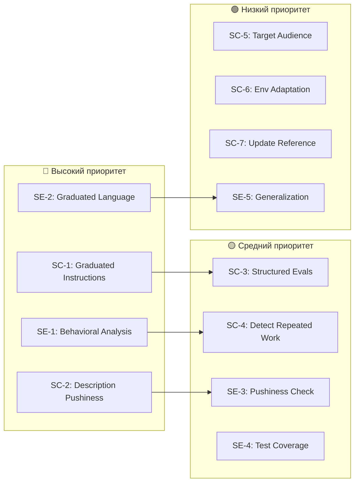

# Анализ обновления Anthropic skill-creator: предложения для наших мета-скилов

> **Дата**: 2026-02-26  
> **Автор**: AI-ассистент  
> **Статус**: Финальная выверка и валидация (2026-02-27) DONE
> **Источники**:  
> - Old Anthropic: [archieve/skill-creator-ref/SKILL.md](file:///Users/sergey/Antigravity/Universal-skills/archieve/skill-creator-ref/SKILL.md) (357 строк, 3 скрипта, 2 reference-файла)
> - New Anthropic: [references/skill-creator-anthropics/SKILL.md](file:///Users/sergey/Antigravity/Universal-skills/references/skill-creator-anthropics/SKILL.md) (480 строк, 9 скриптов, 3 agent-файла, schemas)
> - Наш skill-creator: [.agent/skills/skill-creator/SKILL.md](file:///Users/sergey/Antigravity/Universal-skills/.agent/skills/skill-creator/SKILL.md) (258 строк)
> - Наш skill-enhancer: [.agent/skills/skill-enhancer/SKILL.md](file:///Users/sergey/Antigravity/Universal-skills/.agent/skills/skill-enhancer/SKILL.md) (127 строк)

---

## 1. Обзор ключевых изменений в Anthropic skill-creator

### 1.1 Что добавлено (Old → New)

| Область | Old (archive) | New (references) | Дельта |
|:---|:---|:---|:---|
| **Тон и стиль** | Формальный, документационный | Разговорный, «человечный» | Полная переработка голоса |
| **Описание (description)** | 1 строка, общая | Развёрнутая, с рекомендацией «pushiness» | Парадигмальный сдвиг |
| **Eval/Benchmark** | Нет (кроме Step 6: «Iterate») | Полная инфраструктура: evals.json, grading, benchmark, viewer | **Принципиально новое** |
| **Agent-файлы** | Нет | `agents/grader.md`, `agents/analyzer.md`, `agents/comparator.md` | **Принципиально новое** |
| **Description Optimization** | Нет | 4-шаговый процесс с HTML-ревьюером и ML-оптимизационным циклом | **Принципиально новое** |
| **Blind Comparison** | Нет | A/B сравнение через независимого агента | **Принципиально новое** |
| **Скрипты** | 3 (`init`, `package`, `validate`) | 9 (+`aggregate_benchmark`, `generate_report`, `improve_description`, `run_eval`, `run_loop`, `utils`) | 6 новых скриптов |
| **Schemas** | Нет | `references/schemas.md` — 6 JSON-схем | **Принципиально новое** |
| **Стратегия итеративного улучшения** | 4-строчный пул «iterate» | Развёрнутая секция «Improving the skill» — generalize, lean, explain why, detect repeated work | Сильно расширена |
| **Коммуникация** | Нет | Секция «Communicating with the user» — адаптация к уровню пользователя | **Новое** |
| **Среда исполнения** | Только Claude Code | Claude.ai + Cowork + Claude Code | **Новое** |

### 1.2 Что убрано / переработано

| Было (Old) | Стало (New) |
|:---|:---|
| Подробное описание что такое Skills (§ About Skills) | Убрано полностью — предполагается, что агент знает |
| Формальная секция «Progressive Disclosure Design Principle» | Сжата до 10 строк |
| Детальные примеры BigQuery, PDF, frontend-webapp | Убраны, заменены на абстрактные примеры |
| `references/workflows.md`, `references/output-patterns.md` | Убраны; их место заняли agents/ |
| Step 2: «Planning Reusable Skill Contents» — подробный | Переработан в «Interview and Research» — короче, с MCP |

---

## 2. Критическая оценка изменений

### ✅ Однозначно полезные изменения

#### 2.1 Философия «Explain the Why» vs. «MUST/ALWAYS»
> **Anthropic (New, §Improving, п.3)**: *"Try hard to explain the **why** behind everything... If you find yourself writing ALWAYS or NEVER in all caps, that's a yellow flag — reframe and explain the reasoning so that the model understands why."*

**Критическая оценка**: Это **прямо противоречит** нашей секции «Anti-Laziness & AGI-Agnostic Language» (§6 skill-creator), где мы **требуем** заменять все «should/could» на «MUST/ALWAYS». Anthropic экспериментально пришёл к выводу, что объяснение причин работает лучше, чем жёсткие директивы.

##### Совместимость с моделями

| Модель | «Explain why» | «MUST/ALWAYS» | Рекомендация |
|:---|:---:|:---:|:---|
| **Claude Sonnet/Opus 4.6** | ✅ Отлично | ⚠️ Работает, но избыточно | «Explain why» — основной стиль |
| **Gemini 3.1** | ✅ Хорошо | ✅ Хорошо | Смешанный — Gemini иногда «творит» без жёстких рамок, MUST полезен для структурных ограничений |
| **Codex 5.3** | ✅ Хорошо | ✅ Хорошо | «Explain why» для генерации, MUST для формата вывода |
| **Qwen 3 (72B/235B)** | ⚠️ Средне | ✅ Лучше | Qwen **значительно** лучше следует жёстким директивам. «Explain why» он понимает, но чаще «забывает» мотивацию и упрощает |
| **Llama 4 (Maverick/Scout)** | ⚠️ Средне | ✅ Лучше | Открытые модели хуже удерживают «мягкие» инструкции в длинных контекстах |
| **Mistral Large** | ✅ Хорошо | ✅ Хорошо | Хорошо с обоими, «explain why» чуть лучше для творческих задач |
| **DeepSeek V3/R1** | ⚠️ Средне | ✅ Лучше | Сильная модель, но для длинных инструкций лучше жёсткие рамки |

**Ключевой вывод**: «Explain why» хорошо работает для **frontier-моделей** (Claude, Gemini, Codex). Для **open-source** (Qwen, Llama, DeepSeek) жёсткие директивы надёжнее, особенно в длинных скилах (>200 строк).

> [!IMPORTANT]
> **Рекомендация**: Ввести **«Graduated Instructions»** — двухуровневый подход вместо слепого «MUST everywhere»:
> - Для **safety/data-loss** шагов: `MUST` + объяснение почему
> - Для **поведенческих** шагов: объяснение почему + мягкий императив
> 
> Этот стиль работает для **всех моделей**: frontier-модели читают мотивацию, open-source — реагируют на MUST.

**Пример graduated style:**
```markdown
# ❌ Только MUST (наш текущий стиль)
You MUST run the validation script after every edit.

# ❌ Только «explain why» (стиль Anthropic)
Run validation after edits — unvalidated XML often has 
subtle errors that break the document silently.

# ✅ Graduated (предложенный стиль)
You MUST run validation after every edit — unvalidated XML 
often has subtle namespace or encoding errors that look fine 
in text but silently corrupt the document when opened.
```

---

#### 2.2 Описание с «pushiness» + Description Optimization
> **Anthropic (New, §Write the SKILL.md)**: *"Claude has a tendency to 'undertrigger' skills. Make descriptions a little bit 'pushy'. Instead of 'How to build a dashboard', write 'Make sure to use this skill whenever the user mentions dashboards, data visualization... even if they don't explicitly ask.'"*

**Критическая оценка**: Наш CSO (§7 skill-creator) требует жёсткие схемы «Use when...», «Guidelines for...». Это хорошо для валидации, но не решает проблему **undertriggering**. Anthropic добавил целый 4-шаговый процесс оптимизации описаний с ML-loop (`run_loop.py`), чего у нас нет.

> [!TIP]
> **Рекомендация**: Добавить в CSO рекомендацию по «pushiness» и расширить валидацию описаний. Полный ML-loop — overkill для нашего контекста (multi-vendor), но принцип ценный.

---

#### 2.3 Обнаружение повторяющейся работы в тест-ранах
> **Anthropic (New, §Improving, п.4)**: *"Read the transcripts... if all 3 test cases resulted in the subagent writing a `create_docx.py`, that's a strong signal the skill should bundle that script."*

**Критическая оценка**: Отличный паттерн. У нас в skill-enhancer нет аналога — мы анализируем **структуру** скила, но не **поведение агента при использовании скила**. Это более зрелый подход.

> [!IMPORTANT]
> **Рекомендация**: Добавить в skill-enhancer фазу «Behavioral Analysis» — изучение логов/транскриптов реального использования скила для выявления паттернов повторяющегося кода.

---

### ⚠️ Полезные, но требуют адаптации

#### 2.4 Eval/Benchmark инфраструктура — что можно взять, а что нет

Это **самое крупное** изменение. Anthropic построил целую систему количественной оценки скилов. Ниже — детальный разбор привязки к Claude CLI.

##### Карта привязки компонентов

| Компонент | Привязка к Claude CLI | Адаптируемость | Статус |
|:---|:---:|:---:|:---|
| **`evals.json` формат** | ❌ Нет привязки | ✅ Берём as-is | ✅ Перенесено → `references/eval_schemas.md` |
| **`grading.json` формат** | ❌ Нет привязки | ✅ Берём as-is | ✅ Перенесено → `references/eval_schemas.md` |
| **`benchmark.json` формат** | Слабая | ⚠️ Обобщить | ⏭️ Не переносим (Claude-specific) |
| **`agents/grader.md`** (промпт) | ❌ Нет привязки | ✅ Vendor-agnostic | ✅ Перенесено → `agents/grader.md` в оба скила |
| **`agents/analyzer.md`** (промпт) | ❌ Нет привязки | ✅ Vendor-agnostic | ✅ Перенесено → `agents/analyzer.md` в оба скила |
| **`agents/comparator.md`** (промпт) | ❌ Нет привязки | ✅ Vendor-agnostic | ✅ Перенесено → `agents/comparator.md` в оба скила |
| **`run_eval.py`** | 🔴 Жёсткая | ❌ Переписывать | ⏭️ Не переносим |
| **`run_loop.py`** | 🔴 Жёсткая | ❌ Переписывать | ⏭️ Не переносим |
| **`improve_description.py`** | 🔴 Жёсткая | ❌ Не портируемо | ⏭️ Не переносим |
| **`aggregate_benchmark.py`** | Слабая | ⚠️ Адаптировать | ⏭️ Не переносим |
| **`generate_review.py`** | Средняя | ⚠️ Адаптировать | ⏭️ Не переносим |

##### Почему скрипты привязаны к Claude CLI — конкретные точки

**`run_eval.py` / `run_loop.py`**: Внутри вызывают `claude -p` (Claude Code CLI в pipe-mode) как subprocess. `--skill` — **Claude-specific флаг**, которого нет у Gemini CLI или Codex. Нельзя подставить другой бинарник.

**`improve_description.py`**: Оптимизация описаний использует `claude -p` для двух целей:
1. Оценка «триггерится ли скил?» — вызывает Claude с тестовым промптом и проверяет, выбрал ли он скил из списка
2. Генерация улучшенных описаний через extended thinking — Claude-specific feature

Привязка: **skill triggering** — это внутренний механизм каждого LLM, и у каждого он свой (у Gemini — свой routing, у Codex — свой).

**Субагентная архитектура**: Anthropic предполагает Claude Code / Cowork, где есть `TodoList`, notifications с `total_tokens` / `duration_ms`, `present_files` tool.

##### Vendor-agnostic стратегия: что берём

> [!IMPORTANT]
> **Рекомендация**: НЕ копировать скрипты. Взять **форматы и концепции**:
> 1. Формат `evals.json` — описание тестовых кейсов для скила
> 2. Промпты `agents/grader.md` и `agents/analyzer.md` — как шаблоны для ручной/субагентной проверки
> 3. Принцип structured evals — сам факт наличия записанных тестов дисциплинирует автора

##### Как будет работать vendor-agnostic eval

**Шаг 1**: При создании скила автор пишет `evals/evals.json`:

```json
{
  "skill_name": "summarizing-meetings",
  "evals": [
    {
      "id": 1,
      "name": "standup-short",
      "prompt": "Summarize this standup meeting transcript",
      "input_files": ["evals/fixtures/standup_10min.md"],
      "expected_outcomes": [
        "Summary contains all speakers mentioned in transcript",
        "Action items section is present and non-empty",
        "Output follows template_standup.md structure"
      ]
    },
    {
      "id": 2, 
      "name": "retro-long-no-timestamps",
      "prompt": "Summarize this retrospective",
      "input_files": ["evals/fixtures/retro_90min_plain.txt"],
      "expected_outcomes": [
        "Correctly detects meeting type as retrospective",
        "No content is omitted from a large file",
        "Tags are assigned from tag_taxonomy.md"
      ]
    }
  ]
}
```

**Шаг 2**: Запуск — **вручную через любой CLI или IDE**:
- **Gemini CLI**: скопировал промпт, подал файл, проверил результат
- **Antigravity**: subagent с задачей
- **Claude Code**: subagent с задачей
- **API напрямую**: через скрипт с любым провайдером

**Шаг 3**: Проверка — **человеком по чеклисту** `expected_outcomes`. При желании — автоматизация через `scripts/run_evals.py` с любым LLM API и LLM-as-judge.

**Ценность**: Даже без автоматизации, сам факт наличия записанных test cases **заставляет** автора продумать edge cases и даёт следующему разработчику понимание, что тестировать.

---

#### 2.5 Тон коммуникации с пользователем
> **Anthropic (New, §Communicating)**: Адаптация к уровню пользователя — от плотника до разработчика.

**Критическая оценка**: Хороший принцип для **публичных** скилов. Для нашего внутреннего использования менее релевантно, но полезно при создании скилов для широкой аудитории.

> [!NOTE]
> **Рекомендация**: Добавить в skill-creator краткую заметку о target audience при создании скила.

#### 2.6 Cowork/Claude.ai адаптации
> **Anthropic (New, §Claude.ai-specific, §Cowork-Specific)**: Инструкции по работе без субагентов и без браузера.

**Критическая оценка**: Для нас не напрямую применимо, но полезно как паттерн **«graceful degradation»** — скил должен работать в разных средах.

> [!TIP]
> **Рекомендация**: Добавить в skill-creator best practice «Environment Adaptation» — рекомендация указывать fallback-стратегии для разных IDE/CLI сред.

### ❌ Не рекомендуется к переносу

#### 2.7 Удаление «What Skills Provide» / «About Skills»
Anthropic убрала всю образовательную секцию, предполагая что агент «уже знает». Для нас это **анти-паттерн**: наши скилы используются разными LLM, и базовый контекст полезен.

#### 2.8 Полный отказ от Weak Language запрета
Anthropic фактически отказалась от strict imperative language в пользу «explain why». Для нас **полный отказ** рискован: мы работаем с моделями разного уровня (см. таблицу совместимости в §2.1). Предлагаем graduated подход, а не полный отказ.

#### 2.9 Прямое копирование eval-viewer и скриптов
Привязаны к экосистеме Claude Code (подробный разбор в §2.4). Без полного переписывания — не работоспособны.

---

## 3. Конкретные предложения

### Для `skill-creator`

| # | Предложение | Приоритет | Статус | Затронутые файлы |
|:--|:---|:--|:--|:---|
| SC-1 | **Graduated Instructions** | 🔴 Высокий | ✅ Done | `SKILL.md` §6, `assets/SKILL_TEMPLATE.md` §7 |
| SC-2 | **Description Pushiness** | 🔴 Высокий | ✅ Done | `SKILL.md` §7 (новая подсекция «Preventing Under-Triggering») |
| SC-3 | **Structured Evals** | 🟡 Средний | ✅ Done | `SKILL.md` §14, `assets/SKILL_TEMPLATE.md` §12 |
| SC-4 | **Detect Repeated Work** | 🟡 Средний | ✅ Done | `SKILL.md` §11 step 7 |
| SC-5 | **Target Audience Note** | 🟢 Низкий | ✅ Done | `SKILL.md` §8 (новая подсекция «Target Audience») |
| SC-6 | **Environment Adaptation** | 🟢 Низкий | ✅ Done | `SKILL.md` §10 (новая подсекция «Environment Adaptation») |
| SC-7 | **Обновить reference ссылку** | 🟢 Низкий | ⏭️ Skipped | Оставлена оригинальная GitHub ссылка по решению владельца |

### Для `skill-enhancer`

| # | Предложение | Приоритет | Статус | Затронутые файлы |
|:--|:---|:--|:--|:---|
| SE-1 | **Phase 1.7: Behavioral Analysis** | 🔴 Высокий | ✅ Done | `SKILL.md` (новая Phase 1.7) |
| SE-2 | **Graduated Language Check** | 🔴 Высокий | ✅ Done | `SKILL.md` Phase 1, `references/vdd_checklist.md` §2, `references/refactoring_patterns.md` Patterns 1-2, `scripts/analyze_gaps.py`, `examples/usage_example.md` |
| SE-3 | **Description Pushiness Check** | 🟡 Средний | ✅ Done | `SKILL.md` Phase 2, `references/vdd_checklist.md` §4, `references/refactoring_patterns.md` Pattern 8 |
| SE-4 | **Test Coverage Check** | 🟡 Средний | ✅ Done | `SKILL.md` Phase 4, `references/vdd_checklist.md` §6 |
| SE-5 | **Generalization Check** | 🟢 Низкий | ✅ Done | `SKILL.md` Phase 2 |

---

## 4. Визуализация приоритетов



---

## 5. Архитектурное решение: не объединять skill-creator и skill-enhancer

Anthropic объединил создание, тестирование и улучшение скилов в один мега-скил. Возникает вопрос: не стоит ли нам сделать так же? **Нет.** Вот почему.

### Разные роли, разные контексты

| | **skill-creator** | **skill-enhancer** |
|:---|:---|:---|
| **Когда триггерится** | «Создай скил для X» | «Улучши/проверь существующий скил» |
| **Вход** | Идея / требования пользователя | Готовый SKILL.md с проблемами |
| **Выход** | Новый скил с нуля | Патч к существующему скилу |
| **Основная работа** | Архитектура, структура, написание | Аудит, диагностика, рефакторинг |
| **Скрипты** | `init_skill.py`, `validate_skill.py` | `analyze_gaps.py` |

### Почему Anthropic объединил — и почему нам этого делать не стоит

Anthropic объединил всё в один скил потому что у них **один продукт** (Claude Code/Cowork) и один сценарий: пользователь создаёт скил → тестирует → улучшает → опять тестирует. Весь цикл в одном потоке.

У нас же разделение имеет практический смысл:

1. **Контекст-эффективность** — skill-creator (258 строк) + skill-enhancer (127 строк) = 385 строк. Если объединить — один скил на 400+ строк, который грузится целиком каждый раз, даже когда нужен только аудит. Anthropic-овский уже 480 строк, и они сами пишут «keep under 500 lines».

2. **Чёткий triggering** — «создай скил» и «улучши скил» — разные интенты пользователя. Два отдельных скила = точнее triggering для каждого.

3. **Третий скил в цепочке** — у нас есть `skill-validator`. Объединение creator + enhancer создало бы дисбаланс: один огромный «do everything» скил + маленький validator.

4. **Переиспользуемость** — enhancer вызывается автоматически через `/auto-heal-skill` workflow, без загрузки всего creator-контекста.

### Правильная архитектура: раздельные скилы + пайплайны

Оркестрация — через workflows и осознанный выбор пользователя, а не через «советы» внутри скила:

```
skill-creator  →  (пользователь создал скил)
                        ↓
              /auto-heal-skill  или  VDD-Sarcastic / VDD-Adversarial
                        ↓
              skill-validator + skill-enhancer
```

Каждый скил делает **свою** работу. Пост-проверка — задача выделенных VDD-пайплайнов (`vdd-sarcastic`, `vdd-adversarial`), а не текстовых «рекомендаций» в конце skill-creator.

---

## 6. Резюме

Обновление Anthropic skill-creator — это **эволюционный сдвиг** от документации к **инженерной платформе** для создания скилов. Три ключевых вывода:

1. **Философский**: Переход от «MUST/ALWAYS» к «explain why» — зрелый подход, подтверждённый опытом с продвинутыми LLM. Однако работает не для всех моделей одинаково: frontier (Claude, Gemini, Codex) — отлично, open-source (Qwen, Llama, DeepSeek) — хуже. Предлагаем **graduated approach** (MUST + объяснение для critical, explain why для behavioral), который работает со **всеми** моделями.

2. **Методологический**: Structured evals и behavioral analysis — ценные паттерны. Форматы (`evals.json`, `grading.json`) и промпты (`grader.md`, `analyzer.md`) — vendor-agnostic, берём. Скрипты (`run_eval.py`, `run_loop.py`, `improve_description.py`) — привязаны к `claude -p`, не берём.

3. **Инфраструктурный**: eval-viewer, grading agents, benchmark scripts — мощная система, но тесно привязана к Claude CLI (через `subprocess.run(["claude", "-p", ...])`, Claude-specific `--skill` флаг, triggering test, extended thinking). Прямое копирование невозможно. Берём **концепции и форматы**, а не код.

4. **Архитектурный**: Объединение skill-creator и skill-enhancer в один скил (как у Anthropic) — **нецелесообразно**. Наша раздельная архитектура эффективнее по контексту, точнее по triggering, и правильно интегрируется с VDD-пайплайнами.

> [!CAUTION]
> Важно не перегнуть палку: полный отказ от Anti-Laziness сделает скилы уязвимыми для «ленивых» моделей (Qwen, Llama); полное копирование Anthropic eval-инфраструктуры привяжет к одному вендору. Graduated approach — оптимальный баланс.

---

## 7. Результаты реализации (2026-02-27 Финальная Выверка)

**11 из 12** предложений реализованы (SC-7 пропущен).
Все vendor-agnostic артефакты (агенты, схемы, скрипты агрегации и рендеринга) успешно перенесены. Архитектура приведена к паттерну **Single Source of Truth** (SSoT).

### Изменённые файлы

| Скил | Файл | Что изменилось |
|:---|:---|:---|
| skill-creator v1.3 | `SKILL.md` | §6 graduated instructions, §7 pushiness, §8 target audience, §10 env adaptation, §11 step 7 detect repeated work, §13 agents + schemas, §14 structured evals + eval workflow |
| skill-creator | `assets/SKILL_TEMPLATE.md` | Graduated language в §7, evals placeholder в §12 |
| skill-creator | `references/eval_schemas.md` | **[NEW]** 8 JSON-схем: evals, grading, comparison, analysis, benchmark, metrics, timing, history |
| skill-creator | `agents/grader.md` | **[NEW]** Промпт для оценки результатов выполнения скила |
| skill-creator | `agents/comparator.md` | **[NEW]** Промпт для слепого A/B сравнения |
| skill-creator | `agents/analyzer.md` | **[NEW]** Промпт для пост-анализа сравнений и бенчмарков |
| skill-creator | `scripts/aggregate_benchmark.py` | **[NEW]** Скрипт-агрегатор метрик тестирования |
| skill-creator | `scripts/generate_report.py` | **[NEW]** Конвертер из .json в .html |
| skill-creator | `scripts/generate_review.py` | **[NEW]** Интерактивный UI-ревьюер для evals |
| skill-creator | `scripts/validate_skill.py` | Добавлены `agents` и `evals` в allowed_dirs |
| skill-enhancer v1.2 | `SKILL.md` | Phase 1 graduated review, Phase 1.7 behavioral analysis, Phase 2 pushiness + generalization, Phase 4 test coverage, §6 agents (Ссылки на skill-creator по SSoT) |
| skill-enhancer | `references/vdd_checklist.md` | §2 graduated language, §4 pushiness, §6 test coverage |
| skill-enhancer | `references/refactoring_patterns.md` | Patterns 1,2 → graduated, Pattern 8 pushiness |
| skill-enhancer | `scripts/analyze_gaps.py` | `[Language]` label + graduated message. Обновлена логика парсинга, чтобы не ловить false positives от JSON-примеров. |
| skill-enhancer | `examples/usage_example.md` | Graduated пример с motivated instructions |

### Валидация
- `validate_skill.py`: оба скила ✅
- `analyze_gaps.py`: оба скила чисты, false-positives устранены ✅

