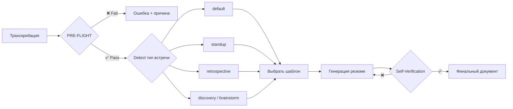

# Summarizing-Meetings — Meta-Skill Strategy Document

## Оценка сложности: COMPLEX (Meta-Skill → Strategy)

**Задача**: Мета-скил для генерации высоко-детализированных резюме встреч из транскрибации. Параметризуемый конструктор — адаптируется под тип встречи, формат вывода, и таксономию проекта.
**Потребители**: люди, AI-агенты, RAG-пайплайны, Obsidian (графовая навигация).

---

## Часть 1: Мета-архитектура

> [!IMPORTANT]
> Это **мета-скил**, а не одноразовый генератор. Ключевое отличие: он содержит **фреймворк адаптации** — набор шаблонов, правила autodetect типа встречи, и configurable pipeline.

### Принцип работы



### Типы встреч (параметризация)

| Тип | Autodetect-сигналы | Шаблон | Особенности |
|-----|-------------------|--------|-------------|
| **default** | Нет явных сигналов | `assets/template_default.md` | Полный шаблон с двумя уровнями пирамиды |
| **standup** | "вчера", "сегодня", "блокеры", < 15 мин | `assets/template_standup.md` | Укороченный: 3 колонки (Done / Doing / Blocked) на участника |
| **retrospective** | "что прошло хорошо", "что улучшить", "ретро" | `assets/template_retrospective.md` | 3 секции: 👍 / 👎 / 🔧 + action items |
| **discovery** | "brainstorm", "идеи", "варианты", "как лучше" | Расширенный `default` | Акцент на альтернативы и trade-offs |

> Пользователь МОЖЕТ явно указать тип: `--type standup`. Если не указан — autodetect.

---

## Часть 2: Шаблон резюме (default)

> [!NOTE]
> Полный шаблон вынесен в `assets/template_default.md` (12-Line Rule). Ниже — краткая структура.

### Структура шаблона

```
YAML frontmatter (type, title, date, participants, duration, tags, related)
├── # Заголовок встречи
├── ## TL;DR                          ← Уровень 1 пирамиды
├── ## Ключевые решения               ← Таблица
├── ## Действия (Action Items)        ← Таблица
├── ## Открытые вопросы               ← Список
├── ## Детальное содержание            ← Уровень 2 пирамиды
│   ├── ### Раздел N: Название
│   │   ├── > Кратко: ...             ← мини-summary
│   │   ├── #### Обсуждение           ← детали
│   │   ├── #### Инсайты (💡)         ← неочевидные мысли
│   │   └── #### Решения по разделу (✅)
│   └── ...
└── ## Метаданные для агентов          ← темы, тон, системы, консенсус
```

### Ключевые элементы frontmatter

```yaml
type: meeting-summary
title: "..."
date: YYYY-MM-DD
meeting_type: default | standup | retrospective | discovery
participants: [...]
duration: "HH:MM"
tags: [...]        # Из references/tag_taxonomy.md
related: [...]     # [[wiki-links]] к существующим заметкам
```

---

## Часть 3: PRE-FLIGHT CHECKS (Input Validation)

Агент ОБЯЗАН выполнить перед генерацией:

| # | Проверка | Действие при провале |
|---|---------|---------------------|
| 1 | **Непустой вход** | ❌ STOP: "Транскрибация пуста." |
| 2 | **Длина < context window** | ⚠️ Если > 100K символов → chunking: разбить на блоки по ~50K с overlap 2K, обработать каждый, затем merge. |
| 3 | **Определение языка** | Определить основной язык. Если mixing → пометить в frontmatter `languages: [ru, en]`. |
| 4 | **Качество ASR** | Если > 30% текста — мусорные токены / "[неразборчиво]" → ⚠️ WARN пользователя: "Низкое качество транскрибации, результат может быть неполным." |
| 5 | **Наличие участников** | Если имена не извлекаются → использовать "Участник 1", "Участник 2". НЕ выдумывать имена. |

---

## Часть 4: Системный промпт

> [!NOTE]
> Полный промпт вынесен в `references/generation_prompt.md` (12-Line Rule). Ниже — краткое содержание.

### Структура промпта

1. **Роль**: Эксперт-фасилитатор + технический писатель
2. **Вход**: Транскрибация + тип встречи (auto/manual)
3. **Выход**: Markdown по шаблону из `assets/template_{type}.md`
4. **6 обязательных правил**: два уровня пирамиды, извлечение структурированных данных, YAML frontmatter, метаданные для агентов, качество текста, логическое разбиение
5. **RED FLAGS**: 4 стоп-проверки против lazy patterns
6. **Self-Verification**: чеклист верификации после генерации

---

## Часть 5: Validation Evidence

### Self-Check (агент выполняет после генерации)

```
□ Каждое решение из транскрибации попало в таблицу "Ключевые решения"
□ Каждый action item имеет ответственного
□ Каждый раздел содержит > Кратко: + Обсуждение + Инсайты
□ TL;DR самодостаточен (понятен без чтения деталей)
□ Все конкретные цифры/имена/даты сохранены
□ Tags соответствуют references/tag_taxonomy.md
□ Нет полей ⚠️ UNKNOWN (если есть > 3 → WARN пользователя)
□ [[wiki-links]] корректны (если vault доступен)
```

### Verification Loop

После self-check агент ОБЯЗАН пройти по транскрибации повторно и проверить: не пропущены ли решения, действия, или инсайты. Если найдены пропуски → дополнить резюме и повторить self-check.

---

## Часть 6: Структура Rich Skill

```
summarizing-meetings/
├── SKILL.md                                   # Мета-инструкции
├── assets/
│   ├── template_default.md                    # Полный дефолтный шаблон
│   ├── template_standup.md                    # Standup-шаблон
│   └── template_retrospective.md              # Retro-шаблон
├── references/
│   ├── generation_prompt.md                   # Системный промпт
│   ├── tag_taxonomy.md                        # Таксономия тегов
│   └── meeting_type_detection.md              # Правила autodetect
└── examples/
    ├── example_input_transcript.md            # Пример транскрибации
    └── example_output_summary.md              # Ожидаемый результат
```

### Ключевые поля SKILL.md

```yaml
---
name: summarizing-meetings
description: >-
  Use when generating meeting summaries from transcriptions.
  Meta-skill: auto-detects meeting type, selects template,
  and produces a two-level pyramid Markdown document
  optimized for people, AI agents, RAG, and Obsidian.
tier: 2
version: 1.0
---
```

- **Execution Mode**: `prompt-first` (text-to-text трансформация)
- **Safety Boundaries**: Только предоставленный текст; не модифицирует файлы за пределами output
- **Validation Evidence**: Self-Check чеклист + Verification Loop

---

## Часть 7: Design Decisions (Trade-offs)

| Решение | Альтернатива | Почему выбрано |
|---------|-------------|---------------|
| Мета-скил с набором шаблонов | Один фиксированный шаблон | Масштабируется на типы встреч; соответствует Meta-Skill паттерну проекта |
| Autodetect + `--type` override | Только manual выбор | Удобство по умолчанию + контроль когда нужно |
| YAML frontmatter | JSON header | Нативен для Obsidian, Dataview, Hugo |
| Эмодзи-маркеры (💡 ✅ 🔲 ⚠️) | Текстовые метки | Визуально + grep'аются агентами |
| `references/tag_taxonomy.md` | Произвольные теги | Obsidian-граф требует consistent taxonomy |
| PRE-FLIGHT + Self-Check | Без валидации | Защита от мусорного ввода и неполного вывода |
| Chunking для длинных транскрибаций | Отказ обработки | Реальные встречи бывают 2+ часа |
| `⚠️ UNKNOWN` вместо `{{UNKNOWN}}` | `{{UNKNOWN}}` | Визуально заметнее; hard to miss при review |

---

## Следующие шаги

> [!IMPORTANT]
> **VDD-Adversarial review выполнен** — см. [critique](file:///Users/sergey/Antigravity/Universal-skills/docs/vdd_critique_meeting_summarizer.md). Все findings адресованы.

### Задачи

- [ ] **Имплементировать скил** — создать `summarizing-meetings/` со всеми файлами по структуре из Части 6
- [ ] **Обновить [README.md](file:///Users/sergey/Antigravity/Universal-skills/README.md)** — добавить скил в Skill Registry (Core Meta-Skills)
- [ ] **Написать Manual** — в [docs/Manuals/](file:///Users/sergey/Antigravity/Universal-skills/docs/Manuals/) по образцу существующих мануалов
