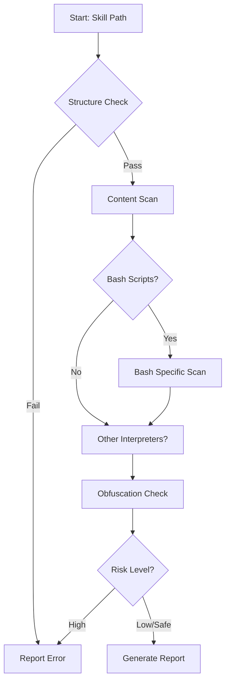

# Skill Validator Design & Security Audit [DONE]

## 1. Concept
**Name**: `skill-validator`
**Purpose**: Automatically audit new skills (especially downloaded ones) for security risks, malware, and structural compliance before they are used.
**Trigger**: verification of a new skill.

## 2. Brainstorming: Features & Requirements

### A. Structural Validation (Compliance)
*   **Manifest**: `SKILL.md` must exist.
*   **Metadata**: Check for `name`, `description`, `tier`, `version`.
*   **Integrity**: Ensure no missing files referenced in `scripts/` or `examples/`.

### B. Security Scanning (Static Analysis)
*   **Pattern Matching (Grep)**:
    *   Network: `curl`, `wget`, `nc`, `netcat`, `/dev/tcp`, `socket`.
    *   Execution: `eval`, `exec`, `system`, `subprocess`.
    *   Privilege: `sudo`, `doas`, `chmod +s`.
    *   Dangerous File Ops: `rm -rf /`, `dd`, `:(){ :|:& };:`.
*   **Obfuscation Detection**:
    *   Base64 strings (long strings).
    *   Hex encoded strings (`\x41`).
    *   Minified code in presumed source files.

### C. Bash Script Scanner (Specialized)
*   **Goal**: Detect malicious bash scripts hidden in skills.
*   **Checks**:
    *   `curl | bash` patterns.
    *   Downloading and executing remote files.
    *   Modifying `.bashrc`, `.zshrc`, or system paths.
    *   Exfiltrating env vars (`env`, `printenv` sent to network).

### D. Workflow

## 3. Security Audit (Adversarial Analysis)

### Threat Model
*   **Attacker**: Malicious skill author trying to run code on the user's machine.
*   **Vector**: Embeds malware in `scripts/` or `examples/` of a useful-looking skill.

### Bypass & Mitigation
| Attack Vector | Validator Mitigation |
| :--- | :--- |
| **Split Command** (`c`+`u`+`r`+`l`) | Advanced variable tracking (future), Flag variable execution. |
| **Base64 Encoding** | Flag high-entropy strings and long base64 blobs. |
| **Steganography** | (Out of scope V1) Scan image artifacts if present. |
| **Polyglot Files** | Check file magic numbers vs extensions. |
| **Validator Exploit** | **CRITICAL**: The validator must *never* execute the code it scans. Strictly static analysis. |

## 4. Implementation Plan (Proposed)

*   **Language**: Python (for robust text processing and library support).
*   **Tools**:
    *   `grep` / Regex for patterns.
    *   `AST` parsing (if possible) or strict tokenization.
    *   `entropy` calculation for obfuscation.
*   **Integration**:
    *   Can be run manually: `python3 .agent/skills/skill-validator/scripts/validate.py <path>`.
    *   Can be hooked into `download-skill` workflow if it exists.