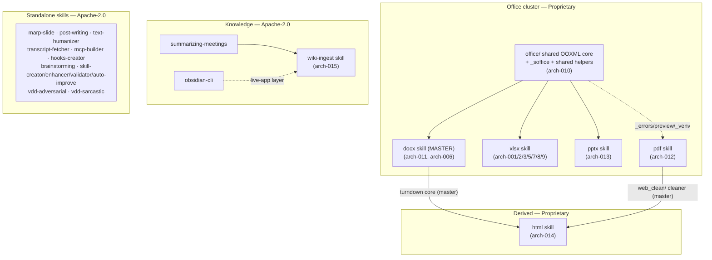

# ARCHITECTURE — Universal-Skills (system index)

> **What this file is.** A **stable index / map** of the whole repository's
> architecture. It is the entry point an agent (or human) reads *first* to
> find which subsystem owns a capability and where its detailed design lives.
> The detailed designs are the **per-subsystem chunks** in
> [`docs/architectures/`](architectures/) — this file only *catalogs and links*
> them.
>
> **It is a LIVING index, never per-task archived** (consistent with the
> `artifact-management` skill: ARCHITECTURE.md is split into
> `docs/architectures/` chunks + a short index once it exceeds 1500 lines —
> this file *is* that index).
>
> **Last reorganized:** 2026-06-28 — converted from a single overwritten
> per-task document (it had become 100 % the `html` skill, TASK 022–027) into
> this index. Five previously-undocumented subsystems were reverse-engineered
> from source and added as chunks (010, 011, 012, 013, 015); the former root
> content was relocated verbatim to [`architecture-014-html-skill.md`](architectures/architecture-014-html-skill.md).

---

## 0. How to use — and how to EXTEND — this index

**To find a design:** scan the [subsystem map](#2-subsystem-map) or the
[chunk catalog](#4-architecture-chunk-catalog), open the linked chunk.

**When you build a new skill or a major feature — follow this protocol so we
never "rewrite the architecture every time" again:**

1. **Add a chunk, don't touch the index body.** Create
   `docs/architectures/architecture-<NNN>-<slug>.md` where `<NNN>` is the next
   free number in the monotonic sequence (see [§6](#6-conventions--numbering--format)).
   Write it to the `architecture-format-core` structure (Purpose → Functional →
   System → Data Model → Interfaces → Cross-cutting → Honest Scope).
2. **Register it here** with exactly two edits: one row in the
   [chunk catalog](#4-architecture-chunk-catalog) and one pointer in the
   [skills-tree table](#3-skill-tree-index). Nothing else in this file changes.
3. **Never overwrite this index** with a single task's architecture. The
   index stays small and stable; depth lives in the chunk.
4. If a feature only *extends* an existing subsystem, append a `## §N` section
   to that subsystem's existing chunk (as `architecture-006` does for the
   docx relocators) instead of creating a new chunk.

> ⚠️ The failure mode this replaces: the Architecture phase used to *overwrite*
> `docs/ARCHITECTURE.md` wholesale each task, so only the latest task survived
> and every new task started from a blank slate. The catalog below is the
> durable memory that fixes that.

---

## 1. System overview

**Universal-Skills** is a monorepo of **independent, self-contained Agent
Skills**. Each skill under [`skills/`](../skills/) is installable and runnable
in isolation (including as a packaged `.skill` archive) — there is no shared
runtime import between skills. Where skills share code, the code is **physically
duplicated and kept byte-identical** by a replication protocol rather than
imported (see [§5](#5-cross-cutting-concerns)).

- **Runtime tiers:** pure-Python stdlib (e.g. `wiki-ingest`), Python + a Node
  converter subprocess (the office/​html `*2*` converters), and LibreOffice /
  Chrome / Poppler / Tesseract as **soft-optional** external engines.
- **Two code families that share a spine:** the **office cluster**
  (`docx`/`xlsx`/`pptx`/`pdf`) built on a duplicated `office/` OOXML core, and
  the **`html`** skill which is a fork-free derivative of `docx` + `pdf`.
- **Split licensing:** Apache-2.0 for the repo and most skills; **Proprietary**
  for the office four + `html` ([§5.2](#52-licensing)).
- **Meta layer:** an agentic-development framework (`System/Agents`,
  `.agent/skills`, `.claude/` workflows) drives how these skills are *built* —
  it is tooling around the repo, not a shipped skill ([§3.3](#33-authoring--content--meta-skills-apache-20)).

---

## 2. Subsystem map

**Replication directions (read the arrows):** `docx` is the **master** for the
office cluster (its `office/` core + helpers are copied into `xlsx`/`pptx`/`pdf`).
`html` is the **one two-master exception** — it copies the turndown core *from
`docx`* and the `web_clean/` cleaner *from `pdf`*. Full rules in
[§5.1](#51-cross-skill-replication-topology).

---

## 3. Skill-tree index

Every skill in [`skills/`](../skills/). "Architecture" links to the dedicated
chunk where one exists, otherwise to the skill's own `SKILL.md` / `references/`.

### 3.1. Office cluster (Proprietary — All Rights Reserved)

| Skill | What it does | Architecture |
|---|---|---|
| **docx** | Markdown ↔ Word, HTML→docx, surgical edit, comments, tracked-changes, template fill, validate | [arch-011](architectures/architecture-011-docx-skill.md) · surgical-edit detail [arch-006](architectures/architecture-006-docx-replace.md) |
| **xlsx** | CSV/JSON/MD→xlsx, charts, recalc, rule-validation, read-back (csv/json/md), comments | [arch-003](architectures/architecture-003-json2xlsx.md), [arch-005](architectures/architecture-005-md-tables2xlsx.md), [arch-001](architectures/architecture-001-xlsx-add-comment.md), [arch-002](architectures/architecture-002-xlsx-check-rules.md), [arch-007](architectures/architecture-007-xlsx-read-library.md), [arch-008](architectures/architecture-008-xlsx-8-and-8a-readback-and-hardening.md), [arch-009](architectures/architecture-009-xlsx-9-xlsx2md.md) |
| **pptx** | Markdown/outline→PPTX, PPTX→Markdown (+OCR), thumbnails, clean, pptx→pdf | [arch-013](architectures/architecture-013-pptx-skill.md) |
| **pdf** | Markdown/HTML→PDF, PDF→Markdown, OCR, merge/split, AcroForm fill, watermark, outline | [arch-012](architectures/architecture-012-pdf-skill.md) |
| **html** | Web/HTML→Markdown clipper + agent step (derived from docx+pdf) | [arch-014](architectures/architecture-014-html-skill.md) |
| *(shared core)* | OOXML unpack/pack/validate, LibreOffice wrapper, encryption, replication | [arch-010](architectures/architecture-010-office-shared-core.md) |

### 3.2. Knowledge / Obsidian skills (Apache-2.0)

| Skill | What it does | Architecture |
|---|---|---|
| **wiki-ingest** | Ingest sources into an Obsidian-style LLM-wiki (ingest/lint/reindex/query + cross-course promotion) | [arch-015](architectures/architecture-015-wiki-ingest-skill.md) |
| **summarizing-meetings** | Model-agnostic summarization → pyramid Markdown or note-JSON; feeds wiki-ingest | [SKILL.md](../skills/summarizing-meetings/SKILL.md) |
| **obsidian-cli** | Drive the running Obsidian app (rename/move, properties, tasks, daily note) | [SKILL.md](../skills/obsidian-cli/SKILL.md) |
| **transcript-fetcher** | Clean transcripts from YouTube/Vimeo/Skool **+ X.com (captions→ASR)**; feeds summarizing-meetings | [arch-016](architectures/architecture-016-transcript-fetcher-x-asr.md) · [SKILL.md](../skills/transcript-fetcher/SKILL.md) |

### 3.3. Authoring / content / meta skills (Apache-2.0)

| Skill | What it does | Architecture |
|---|---|---|
| **marp-slide** | Marp presentation slides, 7 themes, image layouts | [SKILL.md](../skills/marp-slide/SKILL.md) |
| **post-writing** | LinkedIn/Telegram post editorial pipeline | [SKILL.md](../skills/post-writing/SKILL.md) |
| **text-humanizer** | De-"AI-slop" rewriting / genre prompt generation | [SKILL.md](../skills/text-humanizer/SKILL.md) |
| **mcp-builder** | Build MCP servers (Python/TypeScript) | [SKILL.md](../skills/mcp-builder/SKILL.md) |
| **hooks-creator** | Generate secure Gemini-CLI hooks | [SKILL.md](../skills/hooks-creator/SKILL.md) |
| **brainstorming** | Explore intent, clarify requirements, design before coding | [SKILL.md](../skills/brainstorming/SKILL.md) |
| **skill-creator** | Authoritative guide + `init_skill.py` / `validate_skill.py` for NEW skills | [SKILL.md](../skills/skill-creator/SKILL.md) |
| **skill-enhancer** | Audit/fix existing skills to Gold-Standard | [SKILL.md](../skills/skill-enhancer/SKILL.md) |
| **skill-validator** | Security + structural compliance scanner for skills | [SKILL.md](../skills/skill-validator/SKILL.md) |
| **skill-auto-improve** | Propose→evaluate→keep/revert optimizer for skills/prompts | [SKILL.md](../skills/skill-auto-improve/SKILL.md) |
| **vdd-adversarial** | Verification-Driven Development adversarial review | [SKILL.md](../skills/vdd-adversarial/SKILL.md) |
| **vdd-sarcastic** | The "Sarcasmotron" — VDD with a provocative tone | [SKILL.md](../skills/vdd-sarcastic/SKILL.md) |

> The **agentic-development framework** (`System/Agents/`, `.agent/skills/`,
> `.claude/` workflows) is the orchestration tooling that *builds* these skills
> (Analysis → Architecture → Planning → Development pipeline). It is symlinked-in
> dev tooling, not a shipped skill — see `CLAUDE.agentic.md` and
> `.agent/skills/architecture-design/`. Skills without a dedicated chunk above
> are intentionally documented by their own `SKILL.md` + `references/`; promote
> one to a chunk only when its internal design grows beyond what `SKILL.md` can
> hold.

---

## 4. Architecture chunk catalog

The authoritative list of `docs/architectures/*.md`. The `architecture-NNN`
number is a **stable, monotonic ID** — *not* a TASK number and *not* a backlog
ID (see [§6](#6-conventions--numbering--format)). Status: all **shipped** (merged,
tests green, `validate_skill` exit 0 at merge time).

| Chunk | Subsystem · backlog id | Primary entry-points | Scope | Lines |
|---|---|---|---|---|
| [010](architectures/architecture-010-office-shared-core.md) | **office/ shared core** | `office/{unpack,pack,validate}.py`, `_soffice.py`, `office_passwd.py`, `preview.py`, `_errors.py`, `_venv_bootstrap.py` | OOXML container lifecycle, validators registry, LibreOffice shim, encryption/macro detection, **replication topology + `diff -q` gate** | 401 |
| [011](architectures/architecture-011-docx-skill.md) | **docx** skill · `docx-*` (TASK 006/008/019) | `md2docx.js`, `docx2md.js`, `html2docx.js`, `docx_{replace,add_comment,fill_template,accept_changes,merge}.py` | docx as OOXML **master**; full capability set + TASK 019 hardening; cross-refs arch-006 & arch-010 | 470 |
| [012](architectures/architecture-012-pdf-skill.md) | **pdf** skill · `pdf-*` (TASK 013/014/018) | `md2pdf.py`, `html2pdf.py`+`html2pdf_lib/`, `pdf_{extract,ocr,merge,split,fill_form,watermark}.py` | all 8 PDF CLIs; base/chrome/OCR optional-dep tiers; `web_clean` master for html | 353 |
| [013](architectures/architecture-013-pptx-skill.md) | **pptx** skill · `pptx-*` (TASK 020/021) | `md2pptx.js`, `outline2pptx.js`, `pptx2md.py`+`pptx2md/`, `pptx_{clean,thumbnails,to_pdf}.py` | Markdown↔PPTX round-trip, pptx2md document-model pipeline (+OCR/denoise), SmartArt honest-scope | 510 |
| [014](architectures/architecture-014-html-skill.md) | **html** skill · `html` (TASK 022–027) | `html` launcher, `html2md.py`, `html2md_core.js`, `web_clean/` | Web/HTML→Markdown; two-master derivation; SSRF-gated fetch; authenticated Chrome (relocated from old root) | 927 |
| [016](architectures/architecture-016-transcript-fetcher-x-asr.md) | **transcript-fetcher** · TASK 026 + 029 | `sources/x.py`, `sources/_ytdlp_media.py`, `asr/` package, `_config.py`, `_stat.py`, `fetch.py doctor` | X.com (status video + Broadcasts) source; caption-first→ASR; pluggable ASR backends (mw/whisper/whisper.cpp/cloud-opt-in); ffmpeg required for HLS ASR (fail-fast); `.env` config; §10 = TASK 029 HLS hardening (`--concurrent-fragments`, split probe/media budgets, `doctor`, transient-timeout remediation) | 467 |
| [015](architectures/architecture-015-wiki-ingest-skill.md) | **wiki-ingest** skill · `wiki-*` (TASK 015/016/017) | `wiki_ops.py`, `wiki_ingest/` package | pure-Python LLM-wiki maintenance: ingest/lint/reindex/query + cross-course promotion; v1.1 manifest contract | 518 |
| [009](architectures/architecture-009-xlsx-9-xlsx2md.md) | xlsx · `xlsx-9` | `xlsx2md.py` | xlsx read-back → Markdown | 1232 |
| [008](architectures/architecture-008-xlsx-8-and-8a-readback-and-hardening.md) | xlsx · `xlsx-8`/`xlsx-8a` | `xlsx2csv.py`, `xlsx2json.py` | read-back CLIs + production hardening + large-table support | 2107 |
| [007](architectures/architecture-007-xlsx-read-library.md) | xlsx · `xlsx-10.A` | `xlsx_read/` | common read-only reader library | 1202 |
| [006](architectures/architecture-006-docx-replace.md) | docx · `docx-6` (+`docx-008` relocators) | `docx_replace.py`, `docx_anchor.py`, `_relocator.py` | surgical point-edit of `.docx`; §12 = `--insert-after` asset relocators | 2015 |
| [005](architectures/architecture-005-md-tables2xlsx.md) | xlsx · `xlsx-3` | `md_tables2xlsx.py` | Markdown tables → multi-sheet `.xlsx` | 1006 |
| [003](architectures/architecture-003-json2xlsx.md) | xlsx · `xlsx-2` | `json2xlsx.py` | JSON → styled `.xlsx` | 882 |
| [002](architectures/architecture-002-xlsx-check-rules.md) | xlsx · `xlsx-7` | `xlsx_check_rules.py` | declarative business-rule validator | 760 |
| [001](architectures/architecture-001-xlsx-add-comment.md) | xlsx · `xlsx-6` | `xlsx_add_comment.py` | cell comments (with Task-002 module split) | 560 |

> **Note on `004`:** there is no `architecture-004`. The number was skipped
> historically (TASK 004 = `json2xlsx`, whose architecture is `arch-003`). The
> gap is intentional — do not "fill" it; keep allocating from the high end.

---

## 5. Cross-cutting concerns

### 5.1. Cross-skill replication topology

The office skills duplicate shared code instead of importing it (independence
requirement). **`docx` is the master.** Full protocol in
[`CLAUDE.md` §2](../CLAUDE.md) and [arch-010 §6](architectures/architecture-010-office-shared-core.md);
summary:

| Replication unit | Master | Copied into | Scope |
|---|---|---|---|
| `office/` (unpack/pack/validate/validators/helpers/shim/encryption/macros) | docx | xlsx, pptx | 3-skill OOXML |
| `_soffice.py` | docx | xlsx, pptx | 3-skill OOXML |
| `preview.py` | docx | xlsx, pptx, pdf | 4-skill |
| `_errors.py`, `_venv_bootstrap.py` | docx | xlsx, pptx, pdf, **html** | 5-skill |
| `office_passwd.py` | docx | xlsx, pptx | 3-skill OOXML |
| `html2md_core.js` (turndown core) | **docx** | html | 2-master exception |
| `web_clean/` (`archives`/`reader_mode`/`preprocess`/`dom_utils`/`normalize_css`) | **pdf** | html | 2-master exception |

Every copy is **byte-identical**, gated by `diff -q` in CI. Edit only the
master, then replicate in the same commit. `html` is the documented **two-master
exception** and must **never** receive `render.py`/`chrome_engine.py`/`__init__.py`
(the weasyprint/playwright carriers).

### 5.2. Licensing

| Scope | License |
|---|---|
| Repo root + all skills **except** the office four and `html` | Apache-2.0 ([`LICENSE`](../LICENSE)) |
| `skills/{docx,xlsx,pptx,pdf}/` + `skills/html/` | **Proprietary, All Rights Reserved** (per-skill `LICENSE`/`NOTICE`) |
| Third-party (XSD schemas, pip/npm deps, external CLIs) | original licenses, see [`THIRD_PARTY_NOTICES.md`](../THIRD_PARTY_NOTICES.md) |

`html` is proprietary because it embeds byte-identical proprietary `docx`/`pdf`
code; it cannot be Apache-2.0.

### 5.3. Shared conventions every skill follows

- **`--json-errors` envelope** (`_errors.py`, schema v1) — uniform
  machine-readable failure output across every Python CLI.
- **Per-skill isolation** — own `scripts/.venv` (Python) and `node_modules`
  (Node); never global installs. `_venv_bootstrap.py` re-execs into the venv.
- **Soft-optional engines** — LibreOffice (`_soffice.py`), Chrome/Playwright,
  Poppler, Tesseract degrade gracefully and are detected at runtime.
- **`preview.py`** — universal `INPUT → PNG-grid` renderer for visual QA.
- **Validation gate** — `validate_skill.py` must exit 0 before any change is
  declared complete (CSO / Gold-Standard).

---

## 6. Conventions — numbering & format

- **`architecture-NNN`** is a stable monotonic sequence, independent of TASK and
  backlog numbers. Allocate the next free number; never renumber existing
  chunks (links and git history depend on them).
- **Three numbering systems coexist** — keep them distinct in your head:
  - `architecture-NNN` — chunk file ID (this catalog).
  - `TASK NNN` / `plan-NNN` — the build unit ([`docs/tasks/`](tasks/), [`docs/plans/`](plans/)).
  - backlog IDs like `xlsx-6`, `docx-6`, `pdf-4` — items in
    [`docs/office-skills-backlog.md`](office-skills-backlog.md).
- **Chunk structure** follows `architecture-format-core` (see the
  `.agent/skills/architecture-format-core` skill): Purpose & Scope → Functional
  Architecture → System Architecture → Data Model → Interfaces → Cross-cutting →
  Honest Scope & Open Questions.
- **Honest scope is mandatory.** Document real limitations and deferrals in the
  chunk's final section; do not let the prose overstate the code.

---

## 7. Related references

- [`README.md`](../README.md) — public skill registry (user-facing).
- [`CLAUDE.md`](../CLAUDE.md) / [`GEMINI.md`](../GEMINI.md) — agent behavioural
  contract (replication protocol, license hygiene).
- [`docs/CONTRIBUTING.md`](CONTRIBUTING.md) — full contributor protocol.
- [`docs/office-skills-backlog.md`](office-skills-backlog.md) — roadmap + backlog
  IDs.
- [`docs/KNOWN_ISSUES.md`](KNOWN_ISSUES.md) — known issues across skills.
- [`docs/refactoring-office-skills.md`](refactoring-office-skills.md) —
  historical design rationale for the office-skills architecture.
