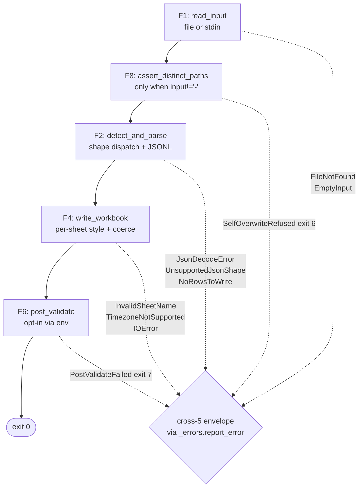
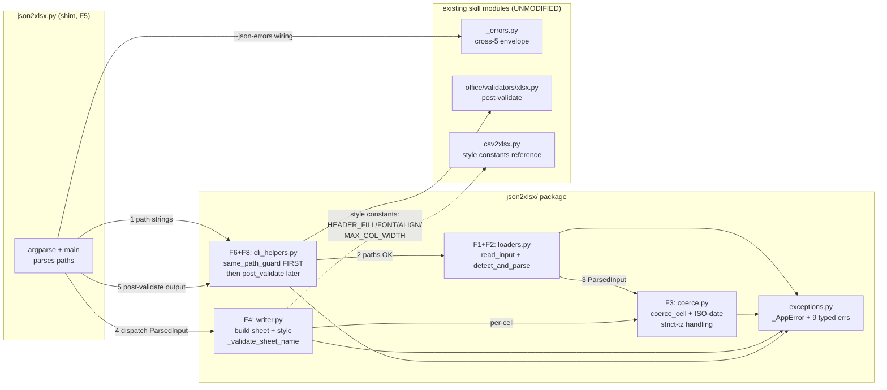
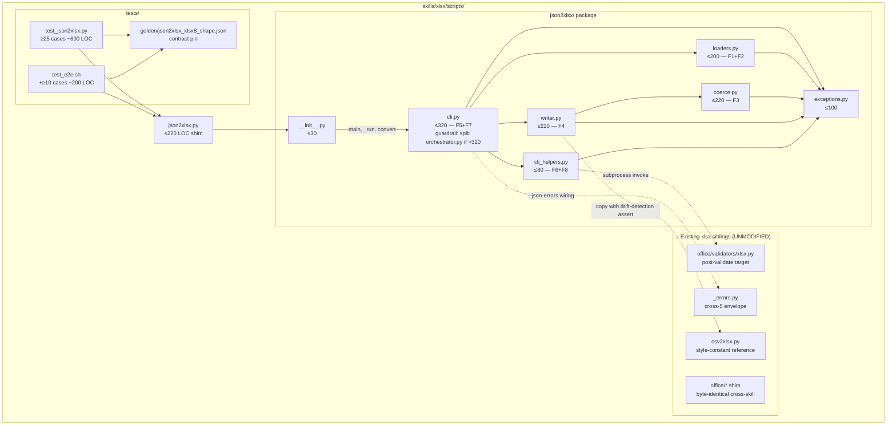

# ARCHITECTURE: xlsx-2 — `json2xlsx.py` (JSON → styled .xlsx converter)

> **Template:** `architecture-format-core` (this is a NEW component
> added to an existing skill, NOT a new system — TIER-2 conditions
> not met). Three immediately preceding xlsx architectures are
> archived as reference precedent:
>
> - xlsx-6 (`xlsx_add_comment.py`, Tasks 001+002 — MERGED 2026-05-08):
>   [`docs/architectures/architecture-001-xlsx-add-comment.md`](architectures/architecture-001-xlsx-add-comment.md)
> - xlsx-7 (`xlsx_check_rules.py`, Task 003 — MERGED 2026-05-08):
>   [`docs/architectures/architecture-002-xlsx-check-rules.md`](architectures/architecture-002-xlsx-check-rules.md)
>
> Both established the **shim + package + cross-5/cross-7** pattern
> that xlsx-2 inherits. csv2xlsx (`skills/xlsx/scripts/csv2xlsx.py`,
> 203 LOC, MERGED) is the **visual / styling reference** xlsx-2
> mirrors 1:1 (`HEADER_FILL`, `HEADER_FONT`, freeze, auto-filter,
> column widths).
>
> **Status (2026-05-11):** **DRAFT** — pre-Planning. To be locked by
> architect-reviewer before Planning phase commences.

## 1. Task Description

- **TASK:** [`docs/TASK.md`](TASK.md) (Task 004, slug `json2xlsx`,
  draft v2 — task-reviewer M1/M2/M3 applied per `docs/reviews/task-004-review.md`).
- **Brief summary of requirements:** Ship `skills/xlsx/scripts/json2xlsx.py`
  — a CLI that reads JSON / JSONL from a file path or stdin and emits
  a styled `.xlsx` workbook. Three input shapes (array-of-objects /
  multi-sheet dict / JSONL) are auto-detected. Native JSON types
  preserved; ISO-8601 date strings auto-coerced to Excel datetime
  cells. Output styling matches `csv2xlsx` 1:1. The CLI is the
  **JSON parallel** to csv2xlsx, closing the agent's natural-output
  format gap (LLMs emit JSON, not CSV) and round-tripping the
  forthcoming xlsx-8 (`xlsx2json`) output shape.

- **Decisions this document closes** (TASK Open Questions O3, O4, O6):

  | TASK Q | Decision | Rationale |
  |---|---|---|
  | **O3 — `--strict-schema`** | **Deferred to v2.** No flag in xlsx-2 v1. | xlsx-7 already provides workbook-side structural validation; xlsx-2's contract is "write what you're given". Adding `--strict-schema` would duplicate the validation surface and force the json2xlsx parser to track per-row schema deltas (which it currently doesn't need). Re-litigate when a real production pipeline reports the gap. |
  | **O4 — `write_only=True` for ≥ 100K rows** | **Deferred to v2 (honest scope §11.3).** v1 uses openpyxl normal-write mode. | Trade-off (no late style edits, slightly different cell-typing path on `WriteOnlyCell`) needs its own design pass. The 30 s/100K-row loose budget in normal-write mode is acceptable for v1. xlsx-7's perf gating convention (`RUN_PERF_TESTS=1`) applies here too. |
  | **O6 — `--escape-formulas` for leading `=`** | **Deferred to v2 — joint csv2xlsx + json2xlsx fix.** | csv2xlsx has the identical gap. Fixing one without the other creates an awkward partial state where CSV inputs are dangerous but JSON inputs are safe (or vice versa). The fix lands as a single follow-up backlog row (`xlsx-2a / csv2xlsx-1`). Locked in TASK §11.2. |

- **Decisions inherited from TASK §0** (D1–D7, locked at Analysis +
  task-reviewer round-1; reproduced here so this document is
  self-contained and the Planner handoff is gap-free):

  | D | Decision |
  |---|---|
  | D1 | **Three input shapes** (auto-detected): array-of-objects, multi-sheet dict, JSONL. |
  | D2 | **Native JSON types + ISO-date coercion default-on.** `--no-date-coerce` and `--strict-dates` flags refine. |
  | D3 | **Full cross-cutting parity** — cross-5 envelope, cross-7 H1 same-path, stdin `-`. Cross-3 / cross-4 N/A (input is JSON, not OOXML). |
  | D4 | **Synthetic round-trip + deferred live wiring.** Locked test contract; live wiring activates when xlsx-8 lands. |
  | D5 | **Atomic chain** (8–12 sub-tasks; Planner locks the slice). Shim + package up front (Task-003 D2 pattern). |
  | D6 | **No `--input-format` flag in v1.** Detection via `.jsonl` extension + JSON root token is deterministic. |
  | D7 | **`--strict-dates` rejects aware datetimes.** Default (without `--strict-dates`) coerces aware → UTC naive per R4.e. |

---

## 2. Functional Architecture

> **Convention:** F1–F8 are functional regions. Each maps 1:1 to one
> module in §3.2 (no module owns more than one region; no region
> spans more than one module). Mirrors xlsx-7's F1–F11 layout.

### 2.1. Functional Components

#### F1 — Input Reader

**Purpose:** Acquire the raw JSON / JSONL bytes from a file path or
stdin, decode UTF-8 strictly, hand off to F2.

**Functions:**
- `read_input(path: str, encoding: str) -> tuple[bytes, str]`
  - **Input:** path string (file path or sentinel `-`), encoding (default `utf-8`).
  - **Output:** `(raw_bytes, source_label)` where `source_label` is the path or `"<stdin>"`.
  - **Related Use Cases:** UC-1, UC-3, UC-4.
- `is_stdin_sentinel(path: str) -> bool` — pure helper, single-char `-` check.
- `path_resolved(path: str) -> Path` — `Path.resolve(strict=False)` wrapper for same-path guard (F8).

**Dependencies:**
- Stdlib only (`sys.stdin.buffer`, `pathlib.Path`).
- Required by: F2 (shape detection), F8 (same-path guard).

---

#### F2 — Shape Detection & Parsing

**Purpose:** Determine which of the three JSON shapes (array-of-
objects / multi-sheet dict / JSONL) the input belongs to, parse it
into a uniform internal representation, and emit typed errors on
malformed or unsupported inputs.

**Functions:**
- `detect_and_parse(raw: bytes, source_label: str, *, is_jsonl_hint: bool) -> ParsedInput`
  - **Input:** raw bytes from F1, source label, hint flag (`.jsonl` extension).
  - **Output:** `ParsedInput` (see §4 Data Model).
  - **Related Use Cases:** UC-1, UC-2, UC-3.
  - **Detection rule (m3 lock):** `is_jsonl_hint=True` → JSONL parser path (line-by-line, blank lines stripped per UC-3 A1). `is_jsonl_hint=False` → single-document path with **root-token dispatch**: parse the document; `root is list` → shape-1 array-of-objects, `root is dict and every value is list[dict]` → shape-2 multi-sheet, anything else → `UnsupportedJsonShape`. The root-token branch lives entirely inside `detect_and_parse`; F1 does NOT pre-classify based on the first byte, because that would require pre-scanning the buffer and duplicates `json.loads`'s own dispatch.
- `_parse_jsonl(raw: bytes) -> list[dict]` — line-by-line with line numbers in errors.
- `_dispatch_root(doc: Any) -> Literal["array_of_objects", "multi_sheet_dict"]` — pure shape classifier.
- `_validate_multi_sheet(doc: dict) -> dict[str, list[dict]]` — every value is a `list[dict]` else fail-loud.

**Dependencies:**
- `json` stdlib (note: `json.loads` collapses duplicate top-level keys — honest scope §11.5).
- Required by: F3 (rows → cells), F4 (sheet plan), F8 (cross-5 errors).

**Failure modes:**
- Empty body → `EmptyInput` (code 2).
- `json.JSONDecodeError` → `JsonDecodeError` with line/column (code 2).
- Root is scalar / list-of-lists / list-of-scalars / dict-of-scalars / mixed dict → `UnsupportedJsonShape` (code 2).
- JSONL line is not an object → `UnsupportedJsonShape` with line N (code 2).
- Empty array `[]` or `{}` → `NoRowsToWrite` (code 2).
- Multi-sheet dict where one sheet has empty rows → `NoRowsToWrite` with `details: {empty_sheet}` (code 2).

---

#### F3 — Type Coercion (cell-level)

**Purpose:** Convert each JSON value into the cell representation
openpyxl expects, with the ISO-8601 date heuristic governed by D2
and the D7 strict-dates rejection.

**Functions:**
- `coerce_cell(value: Any, *, date_coerce: bool, strict_dates: bool, date_format_override: str | None) -> CellPayload`
  - **Input:** Python value from `json.loads`, the three D2/D7 flags.
  - **Output:** `CellPayload(value=…, number_format=…)` where `value` is `None | str | int | float | bool | datetime.date | datetime.datetime`.
  - **Related Use Cases:** UC-1 (dates), UC-2 (booleans), UC-3 (JSONL types).
- `_try_iso_date(s: str) -> datetime.date | datetime.datetime | None`
- `_try_iso_datetime(s: str) -> datetime.datetime | None`
- `_handle_aware_tz(dt: datetime.datetime, strict: bool) -> datetime.datetime`
  - Strict → raise `TimezoneNotSupported` (D7). Lenient → return `dt.astimezone(timezone.utc).replace(tzinfo=None)` (R4.e default).

**Dependencies:**
- `python-dateutil` (already in `requirements.txt` for xlsx-7).
- `datetime` stdlib.
- Required by: F4 (writer per-cell).

**Boundary contract:**
- F3 never touches Excel directly — only produces a `CellPayload`.
  F4 owns openpyxl interaction.

---

#### F4 — Workbook Writer

**Purpose:** Take the `ParsedInput` from F2 and the per-cell
`CellPayload` from F3, build a styled `openpyxl.Workbook`, and save
it to disk.

**Functions:**
- `write_workbook(parsed: ParsedInput, output_path: Path, *, freeze: bool, auto_filter: bool, sheet_override: str | None, coerce_opts: CoerceOptions) -> None`
  - **Input:** parsed shape, output path, style flags, coerce options.
  - **Output:** none (writes file).
  - **Related Use Cases:** UC-1, UC-2, UC-3.
- `_build_sheet(ws: Worksheet, rows: list[dict], coerce_opts: CoerceOptions) -> None`
- `_union_headers(rows: list[dict]) -> list[str]` — preserves first-seen order per R5.
- `_style_header_row(ws: Worksheet, header_count: int) -> None` — applies `HEADER_FILL`, `HEADER_FONT`, `HEADER_ALIGN` (constants imported or copied from csv2xlsx — see §3.2 boundary discussion).
- `_size_columns(ws: Worksheet, headers: list[str], rows: list[dict]) -> None` — `min(max(header_len, max_value_len) + 2, MAX_COL_WIDTH=50)`.
- `_validate_sheet_name(name: str) -> None` — raise `InvalidSheetName` if violates Excel rules (`≤ 31 chars`, no `[]:*?/\\`, not `History`).

**Dependencies:**
- `openpyxl` (Workbook, Worksheet, Alignment, Font, PatternFill, get_column_letter).
- F3 (per-cell coercion).
- Style constants from `csv2xlsx.py` (see §3.2 boundary discussion).
- Required by: F7 (orchestrator), F6 (post-validate hook).

---

#### F5 — CLI Argument Parsing

**Purpose:** Argparse setup, flag wiring, and dispatch into F7.

**Functions:**
- `build_parser() -> argparse.ArgumentParser` — every flag from TASK R9.
- `main(argv: list[str] | None = None) -> int` — entrypoint; calls `parse_args`, dispatches to `_run`, returns exit code.
- `_run(args: argparse.Namespace) -> int` — see F7.

**Dependencies:**
- `_errors.add_json_errors_argument` (cross-5 wiring per R8.a — UN-MODIFIED, byte-identical to the 4-skill replicated copy).
- Required by: shim (`skills/xlsx/scripts/json2xlsx.py`).

**Flag set (locked):**

```
positional: input output
flags:
  --sheet NAME              (default "Sheet1"; ignored for multi-sheet)
  --no-freeze               (default: freeze pane "A2" on)
  --no-filter               (default: auto-filter on)
  --no-date-coerce          (default: ISO-date coercion on)
  --date-format STRFTIME    (default: derived from value type)
  --strict-dates            (D7; off by default)
  --encoding utf-8          (file mode only; ignored when input is '-')
  --json-errors             (cross-5 wiring)
```

**Out-of-scope flags** (deferred to v2 per D6/O3/O6): `--input-format`,
`--strict-schema`, `--escape-formulas`, `--allow-empty`,
`--sanitize-sheet-names`, `--keep-timezone`, `--mkdirs`,
`--write-only`.

---

#### F6 — Post-Validate Hook (opt-in)

**Purpose:** When `XLSX_JSON2XLSX_POST_VALIDATE=1` is set, run the
written workbook through `office/validators/xlsx.py` and fail-loud
on validation errors. Mirrors xlsx-6 `XLSX_ADD_COMMENT_POST_VALIDATE`.

**Functions:**
- `post_validate_enabled() -> bool` — truthy allowlist `1/true/yes/on` per xlsx-6 precedent.
- `run_post_validate(output_path: Path) -> tuple[bool, str]` — returns `(passed, captured_output)`; output is truncated to 8192 bytes.

**Dependencies:**
- `subprocess` (timeout=60).
- `office/validators/xlsx.py` (READ-ONLY; never edited from xlsx-2).
- Required by: F7 (orchestrator).

**Failure mode:**
- Validator non-zero → `PostValidateFailed` exit 7 with envelope detail `{validator_output: <first 8 KiB>}`.
- Output file unlinked on failure (mirrors xlsx-6 cleanup; honest scope: only one cleanup attempt — disk failures during unlink are reported but not retried).

---

#### F7 — Orchestrator

**Purpose:** End-to-end glue: `parse_args → F1.read → F2.parse → F8.same_path_guard → F4.write → F6.post_validate (opt-in) → exit`.

**Functions:**
- `_run(args: argparse.Namespace) -> int`
  - **Input:** parsed argparse namespace.
  - **Output:** exit code 0–7 per TASK §8.
  - **Related Use Cases:** UC-1 (happy), UC-2 (multi-sheet), UC-3 (JSONL), UC-4 (envelope), UC-5 (round-trip).

**Linear pipeline:**



**Dependencies:**
- F1, F2, F3 (via F4), F4, F6, F8, `_errors.report_error`.

---

#### F8 — Path & Same-Path Guard

**Purpose:** Cross-7 H1 parity — resolve both input and output paths,
exit 6 if they collide (catches typos like `json2xlsx.py file.xlsx
file.xlsx` and symlink-chain attacks).

**Functions:**
- `assert_distinct_paths(input_path: str, output_path: Path) -> None`
  - Skip when `input_path == "-"`.
  - `raise SelfOverwriteRefused` if `Path(input_path).resolve() == output_path.resolve()`.

**Dependencies:**
- `pathlib.Path.resolve()` (follows symlinks).
- Required by: F7.

**Honest scope §11.6 (TOCTOU):** A symlink mutated between
`resolve()` and `open(output, "wb")` is out of scope for v1; mirrors
xlsx-7 architect-review m6 precedent.

---

### 2.2. Functional Components Diagram

> **m2 fix:** The diagram below matches the §F7 linear-pipeline
> ordering — F8 (same-path guard) receives the **path string** from
> F5 BEFORE F1 reads bytes. This avoids reading 100K rows of JSONL
> only to discover the output collides with the input.



---

## 3. System Architecture

### 3.1. Architectural Style

**Style:** **Layered, single-process CLI** with shim+package
separation. No persistence layer beyond stdout (envelope) and the
single output `.xlsx` file. No network. No daemon. No long-running
state.

**Justification:**
- Matches xlsx-6 and xlsx-7 precedent — proven for office-skill CLIs.
- Shim file provides a stable test-compat surface (E2E test
  `test_e2e.sh` can `import json2xlsx` or call `python3
  json2xlsx.py …` without caring about the internal module layout).
- Package gives per-region clarity and per-module ≤ 200 LOC budgets,
  which is below the 500 LOC architect cap and well below the 3.6K
  LOC budget of xlsx-7.
- No event-driven, microservice, or queue overhead — the task is
  inherently synchronous file I/O.

### 3.2. System Components

#### `skills/xlsx/scripts/json2xlsx.py` (shim)

- **Type:** CLI shim.
- **Purpose:** Entry point; argparse + dispatch into `json2xlsx/`. Provides a stable test-import surface.
- **Implemented functions:** F5 (CLI argument parsing), F7 (orchestrator) — both re-exported from the package.
- **Technologies:** Python ≥ 3.10, `argparse` stdlib.
- **LOC budget:** ≤ 220.
- **Interfaces:**
  - Inbound: shell invocation, `python3 -m json2xlsx`, `tests/test_e2e.sh`, `tests/test_json2xlsx.py`.
  - Outbound: imports from `json2xlsx.cli`, `json2xlsx.exceptions`.
- **Dependencies:** None besides the package.

#### `skills/xlsx/scripts/json2xlsx/__init__.py`

- **Type:** Package marker.
- **Purpose:** Public re-export surface for the shim and external tests.
- **Technologies:** Python ≥ 3.10.
- **LOC budget:** ≤ 30.
- **Public surface:** `main`, `_run`, `convert` (high-level helper), exceptions.

#### `skills/xlsx/scripts/json2xlsx/loaders.py`

- **Type:** Module.
- **Purpose:** F1 + F2 — input reader and shape detection/parsing.
- **Implemented functions:** `read_input`, `is_stdin_sentinel`, `detect_and_parse`, `_parse_jsonl`, `_dispatch_root`, `_validate_multi_sheet`.
- **Technologies:** `json` stdlib, `sys.stdin.buffer`.
- **LOC budget:** ≤ 200.

#### `skills/xlsx/scripts/json2xlsx/coerce.py`

- **Type:** Module.
- **Purpose:** F3 — per-cell type coercion + ISO-date heuristic + D7 strict-dates.
- **Implemented functions:** `coerce_cell`, `_try_iso_date`, `_try_iso_datetime`, `_handle_aware_tz`, dataclass `CellPayload`, dataclass `CoerceOptions`.
- **Technologies:** `datetime` stdlib, `python-dateutil` (already in `requirements.txt`).
- **LOC budget:** ≤ 220.

#### `skills/xlsx/scripts/json2xlsx/writer.py`

- **Type:** Module.
- **Purpose:** F4 — workbook construction and styling.
- **Implemented functions:** `write_workbook`, `_build_sheet`, `_union_headers`, `_style_header_row`, `_size_columns`, `_validate_sheet_name`.
- **Technologies:** `openpyxl`.
- **LOC budget:** ≤ 220.
- **Style-constant policy:**
  - **Decision:** **Copy** the four style constants (`HEADER_FILL`, `HEADER_FONT`, `HEADER_ALIGN`, `MAX_COL_WIDTH`) into `writer.py` with a `# Mirrors csv2xlsx.py — keep visually identical.` comment.
  - **Rationale:** Importing from `csv2xlsx` would create a cross-module dependency between two top-level scripts (csv2xlsx is also a CLI shim, not a library). Coupling two shims through `from csv2xlsx import ...` would (a) require csv2xlsx to be importable without side-effects (which it currently is, but it's not a stable contract) and (b) create a maintenance trap if csv2xlsx ever introduces a custom theme. Copying four constants is cheap; CI would catch drift if anyone changes csv2xlsx without mirroring.
  - **Drift detection:** Add an assertion in `tests/test_json2xlsx.py` that introspects `csv2xlsx.HEADER_FILL.fgColor.rgb in ("F2F2F2", "00F2F2F2")` and matches against the copy. **Note on the 6-vs-8-char literal:** `csv2xlsx.py:39` declares `PatternFill("solid", fgColor="F2F2F2")` (6 hex chars). openpyxl normalises this to the 8-char ARGB form `"00F2F2F2"` lazily on attribute access. The assertion accepts both forms so the test is robust to whichever path openpyxl chooses on the runner. Drift → assertion failure with a clear error pointing back to this decision.

#### `skills/xlsx/scripts/json2xlsx/exceptions.py`

- **Type:** Module.
- **Purpose:** Closed `_AppError` hierarchy carrying `(message, code, type, details)` for `_errors.report_error` envelope (cross-5).
- **Type model (m1 fix):** `_AppError` is a **plain `Exception` subclass** (NOT a `@dataclass(frozen=True)` exception). Attributes set in `__init__`, mirrors xlsx-6 `xlsx_comment/exceptions.py` precedent rather than xlsx-7's heavier `RulesParseError` dataclass tree (xlsx-2 has 9 typed errors with simple `details` payloads; the xlsx-7 pattern is overkill).
- **Defined errors:**
  - `_AppError(Exception)` (base; attributes `message: str`, `code: int`, `error_type: str`, `details: dict[str, Any]` set in `__init__`).
  - `EmptyInput` (code 2).
  - `NoRowsToWrite` (code 2).
  - `JsonDecodeError` (code 2; wraps `json.JSONDecodeError` with line/column).
  - `UnsupportedJsonShape` (code 2; root_type + hint).
  - `InvalidSheetName` (code 2; name + reason).
  - `TimezoneNotSupported` (code 2; raised only under D7 / R4.g).
  - `InvalidDateString` (code 2; raised only under D7 / R4.g).
  - `SelfOverwriteRefused` (code 6).
  - `PostValidateFailed` (code 7).
- **LOC budget:** ≤ 100.

#### `skills/xlsx/scripts/json2xlsx/cli_helpers.py`

- **Type:** Module.
- **Purpose:** F6 (post-validate) + F8 (same-path) + small wirings (stdin reader).
- **Implemented functions:** `post_validate_enabled`, `run_post_validate`, `assert_distinct_paths`, `read_stdin_utf8`.
- **Technologies:** `subprocess`, `pathlib`, `sys`, `os.environ`.
- **LOC budget:** ≤ 80.

#### `skills/xlsx/scripts/json2xlsx/cli.py`

- **Type:** Module.
- **Purpose:** F5 + F7 internals — argparse construction, `main` entrypoint, `_run` linear pipeline.
- **Implemented functions:** `build_parser`, `main`, `_run`.
- **Technologies:** `argparse`, `_errors.add_json_errors_argument`.
- **LOC budget:** **≤ 320** (revised up from architect-reviewer M2: xlsx-7's analogous `xlsx_check_rules/cli.py` runs 569 LOC for 22 flags; xlsx-2 has 8 flags but the orchestrator still routes argparse, `_AppError` top-of-`_run` catch, cross-5 envelope, stdin-vs-file dispatch, multi-sheet `--sheet` warning, post-validate dispatch, same-path guard). **Guardrail:** if `cli.py` crosses 320 LOC, split `_run` into a separate `orchestrator.py` module (≤ 500 LOC architect cap per TASK R13.b spirit).

#### Tests (`skills/xlsx/scripts/tests/`)

- `test_json2xlsx.py` — ≥ 25 unit cases (~ 600 LOC).
- `test_e2e.sh` — append ≥ 10 named E2E cases (~ + 200 LOC).

#### Fixtures (`skills/xlsx/examples/`)

- `json2xlsx_simple.json` — array-of-objects.
- `json2xlsx_multisheet.json` — multi-sheet dict.
- `json2xlsx_events.jsonl` — JSONL.
- Synthetic xlsx-8 round-trip JSON pinned in `tests/golden/json2xlsx_xlsx8_shape.json` (the contract-freeze artifact for UC-5).

#### References

- `skills/xlsx/references/json-shapes.md` — round-trip contract spec
  authored at the end of the atomic chain (DoD §7 closes review m1):
  exhaustively specifies (a) sheet-name key under `--sheet all`
  (verbatim), (b) null-cell JSON representation, (c) datetime
  serialization (ISO-8601 with offset), (d) `--header-row N>1`
  behaviour, (e) formula resolution. Both xlsx-2 R2 and the future
  xlsx-8 task reference this file; xlsx-8 implementation MUST
  conform on landing.
  > **m4 lock (architecture-reviewer):** xlsx-8's task, when it
  > lands, **MUST consume `references/json-shapes.md` unchanged**.
  > If xlsx-8's discovery work surfaces requirements that force a
  > revision, both skills must update synchronously in the same
  > commit; otherwise `T-roundtrip-xlsx8-live` breaks until parity
  > is restored. The orchestrator opens an issue in the xlsx-8 task
  > if the contract drifts.

### 3.3. Components Diagram



---

## 4. Data Model (Conceptual)

> **Note:** There is no persistent database. The "data model" here
> documents the in-memory entities the modules pass to each other.
> Each entity is a frozen dataclass or plain dict with a clearly-
> typed schema.

### 4.1. Entities Overview

#### Entity: `ParsedInput`

**Description:** The shape-normalised representation that F2 emits
and F4 consumes. Unifies the three input shapes into one structure.

**Key attributes (frozen dataclass):**
- `shape: Literal["array_of_objects", "multi_sheet_dict", "jsonl"]` — original shape, kept for diagnostics / future logging.
- `sheets: dict[str, list[dict[str, Any]]]` — sheet name → list of rows. For shape `array_of_objects` and `jsonl`, this is `{"Sheet1": rows}` (default sheet name overridable via `--sheet`). For `multi_sheet_dict`, the dict's keys in input order.
- `source_label: str` — file path or `"<stdin>"`, used in error envelopes.

**Relationships:**
- One `ParsedInput` per CLI invocation.
- Contains N sheets (1 ≤ N ≤ ≈ 100 typical; no hard upper-bound in v1, Excel itself caps at 65 535).

**Business rules:**
- Every sheet's rows must be `list[dict[str, JSON_VALUE]]` (validated in F2).
- Empty rows for any sheet → F2 raises `NoRowsToWrite` BEFORE F4 sees the data.
- Sheet-name Excel rules NOT validated in F2 (deferred to F4 `_validate_sheet_name`) — this keeps F2 shape-only and F4 owns the openpyxl boundary.

---

#### Entity: `CellPayload`

**Description:** The output of F3 for one JSON value. Wraps both the
typed Python value openpyxl will accept AND the number_format that
F4 must apply.

**Key attributes (frozen dataclass):**
- `value: None | bool | int | float | str | datetime.date | datetime.datetime`
- `number_format: str | None` — `"YYYY-MM-DD"` for dates, `"YYYY-MM-DD HH:MM:SS"` for datetimes, `None` otherwise (openpyxl picks the General format).

**Business rules:**
- `value is None` ⇒ F4 sets the cell value to `None` (empty cell), skips `number_format`.
- `isinstance(value, bool)` is checked BEFORE `isinstance(value, int)` (Python booleans are ints; this matters for Excel `data_type` selection).
- `isinstance(value, datetime.datetime) and value.tzinfo is not None` is impossible by construction (F3 either rejects under D7 or strips tz under R4.e); a defensive assert lives in F4 to catch programming errors.

---

#### Entity: `CoerceOptions`

**Description:** The per-invocation knobs F3 obeys, passed through
from CLI flags.

**Key attributes (frozen dataclass):**
- `date_coerce: bool` — default True; `--no-date-coerce` sets False.
- `strict_dates: bool` — default False; `--strict-dates` sets True (D7).
- `date_format_override: str | None` — default None; `--date-format STRFTIME` sets the override.

---

#### Entity: cross-5 envelope (output)

**Description:** The frozen JSON line emitted on stderr when
`--json-errors` is set. Schema owned by `_errors.py:39` — xlsx-2
never constructs this dict by hand; it always goes through
`report_error(message, code=…, error_type=…, details=…, json_mode=…)`.

**Schema (locked, see `_errors.py:39,126-138`):**

```json
{"v": 1, "error": "<message>", "code": <int>, "type": "<ErrorClass>", "details": {...}}
```

**Business rules:**
- `v` is always 1 in v1.
- `code` is never 0 (`_errors.report_error` coerces and warns; this is the same protection xlsx-7 uses).
- `details.coerced_from_zero: true` appears only if someone foolishly passed `code=0` (defence in depth; should never fire in normal operation).
- xlsx-2-specific `details` keys per error:

  | Error | `details` keys |
  | :--- | :--- |
  | `EmptyInput` | `{source}` |
  | `NoRowsToWrite` | `{empty_sheet?: str}` |
  | `JsonDecodeError` | `{line: int, column: int, msg: str}` |
  | `UnsupportedJsonShape` | `{root_type: str, first_element_type?: str, hint: str}` |
  | `InvalidSheetName` | `{name: str, reason: str}` |
  | `TimezoneNotSupported` | `{value: str, sheet: str, row: int, column: str, tz_offset: str}` |
  | `InvalidDateString` | `{value: str, sheet: str, row: int, column: str}` |
  | `SelfOverwriteRefused` | `{input: str, output: str}` |
  | `PostValidateFailed` | `{validator_output: str (≤ 8192 bytes)}` |
  | `UsageError` (from argparse) | `{prog: str}` |

---

## 5. Interfaces

### External (CLI)

- **Process invocation:** `python3 json2xlsx.py INPUT OUTPUT [flags]`.
- **stdin:** UTF-8 JSON or JSONL when `INPUT == "-"`.
- **stdout:** silent on happy path; reserved for future `--output -` (not v1).
- **stderr:** silent on happy path; non-empty on errors (either plain text or cross-5 envelope per `--json-errors`).
- **Exit codes:** 0 / 1 / 2 / 6 / 7 (see TASK §8).

### Internal (per-module function signatures)

**Locked surface — implementation MUST NOT diverge without updating this section.**

```python
# loaders.py
def read_input(path: str, encoding: str = "utf-8") -> tuple[bytes, str]: ...
def detect_and_parse(raw: bytes, source: str, *, jsonl_hint: bool) -> ParsedInput: ...

# coerce.py
def coerce_cell(value: Any, opts: CoerceOptions, *, ctx: CellContext) -> CellPayload: ...

# writer.py
def write_workbook(
    parsed: ParsedInput, output: Path, *,
    freeze: bool = True, auto_filter: bool = True,
    sheet_override: str | None = None, coerce_opts: CoerceOptions,
) -> None: ...

# cli_helpers.py
def assert_distinct_paths(input_path: str, output_path: Path) -> None: ...
def post_validate_enabled() -> bool: ...
def run_post_validate(output: Path) -> tuple[bool, str]: ...

# cli.py
def build_parser() -> argparse.ArgumentParser: ...
def main(argv: list[str] | None = None) -> int: ...
def _run(args: argparse.Namespace) -> int: ...

# exceptions.py
class _AppError(Exception):
    message: str
    code: int
    error_type: str
    details: dict[str, Any]
```

`CellContext` carries `{sheet: str, row: int, column: str}` and is
purely a diagnostic aid for F3 → F4 error reporting (it lets
`TimezoneNotSupported` and `InvalidDateString` pinpoint the offending
cell, satisfying R4.g `details` schema).

---

## 6. Technology Stack

| Layer | Choice | Justification |
| :--- | :--- | :--- |
| Language | Python ≥ 3.10 | Matches xlsx skill baseline (xlsx-6, xlsx-7). |
| Workbook output | `openpyxl ≥ 3.1.5` | Already pinned. Mature, in-process, no LibreOffice dependency. |
| JSON parsing | `json` stdlib | Battle-tested, fast, no extra dep. Honest-scope §11.5 (duplicate-key collapse) documented. |
| JSONL parsing | hand-rolled line splitter | Trivial; avoids a third-party lib for a 20-line helper. |
| ISO-date parsing | `python-dateutil ≥ 2.8.0` | Already pinned. Handles `Z` / `±HH:MM` / fractional seconds robustly; better than hand-rolling. |
| CLI | `argparse` stdlib | csv2xlsx / xlsx-6 / xlsx-7 precedent. |
| Cross-5 envelope | `_errors.py` (4-skill replicated) | UN-MODIFIED. See §9 / R13.b. |
| Post-validate (opt-in) | `office/validators/xlsx.py` via `subprocess` | xlsx-6 precedent. |
| Tests — unit | `unittest` stdlib | Skill convention. |
| Tests — E2E | `bash` `tests/test_e2e.sh` | Skill convention; sources fixture helpers from `tests/`. |
| Lint / type | None mandatory in v1 | Follows skill precedent (xlsx-6 / xlsx-7 ship without mypy gate; reviewer runs `mypy --strict` locally if curious). |

**No new dependency.** Verified by inspection of `skills/xlsx/scripts/requirements.txt:1-9` (openpyxl, pandas, lxml, defusedxml, Pillow, msoffcrypto-tool, regex, python-dateutil, ruamel.yaml).

### Pandas deliberately avoided (m6 lock)

`pandas>=2.0.0` is pinned in `requirements.txt` (csv2xlsx uses it for `read_csv(..., dtype=str)`). xlsx-2 **does NOT** use pandas, intentionally:

1. **Direct path is shorter.** JSON → `list[dict]` → openpyxl cell is a 5-line loop. Routing through `pd.DataFrame.from_records` adds a layer that buys no value (the row-set is already in memory, no CSV parsing to do).
2. **Import-time cost.** pandas imports ~90 MB of code (numpy, pyarrow optional path, dateutil indirectly). For a CLI invoked thousands of times in a CI batch, this is wasted startup.
3. **Type-coercion conflict.** R3 requires "preserve native JSON types"; pandas' `DataFrame` automatically promotes mixed-type columns to `object` dtype and applies `infer_objects` heuristics that conflict with R3 (e.g., a column of mostly-int with one `null` becomes `float64` because `int64` cannot hold NaN). Bypassing pandas keeps the type contract literal.

This decision is locked here so a future Developer doesn't "simplify" by adding `pd.DataFrame.from_records(rows).to_excel(output)` in the F4 writer — that path would silently break R3 / R4 / R5.

---

## 7. Security

### Threat model

xlsx-2 reads JSON / JSONL from a user-controlled file or pipe and
writes a single `.xlsx` to a user-controlled path. It runs in the
caller's process; no network, no fork, no daemon. The realistic
adversary is **a maliciously-crafted input file** trying to cause
the converter to:

1. Crash with an uninformative traceback (DoS by malformed JSON / deep nesting).
2. Write outside the user's intended directory (path traversal via output).
3. Overwrite the input by accident (typo / symlink race).
4. Smuggle an executable formula into a cell (CSV-injection cousin).
5. Generate an `.xlsx` that crashes Excel on open (malformed sheet names, oversized strings).

### Per-threat mitigation

| Threat | Mitigation | TASK ref |
| :--- | :--- | :--- |
| Malformed JSON / JSONL → uninformative crash | Caught at F2 boundary; `JsonDecodeError` with line/column. | R8, UC-1 A5, UC-3 A2 |
| Deep nesting → stack overflow | Python's `json` module is implemented in C and has a built-in `Py_GetRecursionLimit`-bounded path. We do **not** raise the recursion limit. Document the implicit limit (~1000 levels) in `--help`. v2 may add explicit per-key size cap. | §4.2 (TASK) |
| Path traversal via output | The caller passes the output path; xlsx-2 does not interpret `..` segments specially. The output's parent directory must exist (no `--mkdirs` in v1) → IOError early-fail. Users wishing to sandbox the output point xlsx-2 at a known directory. | C5, F5 docstring |
| Same-path collision (input == output) | F8 `Path.resolve()` same-path guard; exit 6. | R8.b, UC-1 A2 |
| Symlink race between resolve() and open() | **Honest scope §11.6** — accepted v1 limitation; mirrors xlsx-7 architect-review m6. | TASK §11.6 |
| CSV-injection-style leading-`=` in JSON string | **Honest scope §11.2 / §11.7** — passes through; csv2xlsx parity; deferred to v2 joint fix. | TASK §11.2, O6 |
| Excel sheet-name rule violation | F4 `_validate_sheet_name` fail-loud with `InvalidSheetName`. | R7.b, UC-2 A1 |
| Long strings causing Excel choke | openpyxl writes the bytes verbatim; Excel's 32 767 char cell limit is the upstream check. **NOT** in xlsx-2's contract — agents producing >32K-char cells get an `.xlsx` Excel may refuse to open; this is honest scope. | (new honest-scope item — see §10 below) |
| YAML billion-laughs | **N/A** — xlsx-2 only accepts JSON / JSONL. YAML attack surface from xlsx-7 does NOT extend here. | n/a |
| Macro / encrypted input attempt | **N/A** — input is JSON, not OOXML. cross-3 / cross-4 don't fire. | R8.d |

### No `eval` / no shell

- F3 / F4 / F5 / F6 / F7 / F8 contain **no** `eval`, `exec`, `compile`, `subprocess.shell=True`, `os.system`, or template-string formatting reaching user data.
- F6 invokes `subprocess.run([...], shell=False, timeout=60)` to call `office/validators/xlsx.py` — same pattern as xlsx-6's `XLSX_ADD_COMMENT_POST_VALIDATE`.

### Untrusted-input acceptance

xlsx-2 explicitly accepts JSON from `sys.stdin` (UC-4). The stdin
content is treated as untrusted but well-formed-on-the-happy-path:
parse errors map to envelope; structural surprises map to envelope.
**There is no point at which user content is interpreted as code or
shell.**

---

## 8. Scalability and Performance

### Per-input scale

- **Targets (informal, not CI-gated):**
  - 10 000 rows × 6 columns: ≤ 3 s wall.
  - 100 000 rows × 6 columns (JSONL): ≤ 30 s wall, ≤ 500 MB RSS.
- **Mode in v1:** openpyxl normal-write (creates a full `Workbook` in memory). Honest-scope §11.3 documents the v2 path to `write_only=True`.
- **Per-call concurrency:** None. The CLI is one process; tests run
  CLIs concurrently via shell `&`, but no shared state.

### Cache strategy

None. xlsx-2 is a pure transform. No memoisation; every run reads
the input from scratch.

---

## 9. Cross-Skill Replication Boundary (CLAUDE.md §2)

This is the **load-bearing invariant** for the xlsx skill: edits to
shared modules MUST be done in docx first and replicated byte-for-
byte to xlsx / pptx / pdf (4-skill set) or to xlsx / pptx (3-skill
OOXML set, for `office_passwd.py`). xlsx-2 deliberately **does not
touch any of these files**.

### Files xlsx-2 must NOT modify

| Path (in xlsx) | Replication set | Why xlsx-2 leaves it alone |
| :--- | :--- | :--- |
| `skills/xlsx/scripts/_errors.py` | 4-skill | Only consumed via `add_json_errors_argument` + `report_error`. No new envelope fields needed. |
| `skills/xlsx/scripts/_soffice.py` | 4-skill | Not invoked. xlsx-2 doesn't shell out to LibreOffice. |
| `skills/xlsx/scripts/preview.py` | 4-skill | Not invoked. |
| `skills/xlsx/scripts/office/` (entire tree) | 3-skill (OOXML) | The post-validate hook (F6) invokes `office/validators/xlsx.py` via subprocess; never imports it directly. Subprocess invocation is read-only against the validator. |
| `skills/xlsx/scripts/office_passwd.py` | 3-skill (OOXML) | Not invoked. xlsx-2 outputs are never password-protected. |

### Gating check (Developer must run before commit)

```bash
diff -qr skills/docx/scripts/office skills/xlsx/scripts/office
diff -qr skills/docx/scripts/office skills/pptx/scripts/office
diff -q  skills/docx/scripts/_soffice.py skills/xlsx/scripts/_soffice.py
diff -q  skills/docx/scripts/_soffice.py skills/pptx/scripts/_soffice.py
for s in xlsx pptx pdf; do
    diff -q skills/docx/scripts/_errors.py skills/$s/scripts/_errors.py
    diff -q skills/docx/scripts/preview.py  skills/$s/scripts/preview.py
done
diff -q skills/docx/scripts/office_passwd.py skills/xlsx/scripts/office_passwd.py
diff -q skills/docx/scripts/office_passwd.py skills/pptx/scripts/office_passwd.py
```

Eleven invocations, all must be silent. **CI runs this in pre-merge.**

---

## 10. Additional Honest-Scope Items (Architecture-Layer)

These supplement TASK §11. They are architectural choices the
Planner / Developer must NOT widen in v1:

- **A1 — No openpyxl `write_only=True` mode.** Normal-write only.
  Performance budget §8 reflects this. **(Mirrors TASK §11.3 — re-stated here for architecture-layer clarity; not an additional v2 deferral.)**
- **A2 — No streaming output to stdout.** `--output -` not in v1.
  Workbooks are written to disk only. Rationale: openpyxl's `save`
  expects a file-like with `seek` (zipfile internals); piping the
  zipped `.xlsx` to stdout would require buffering the whole file in
  memory first, defeating "streaming". Defer to v2 if a real use-
  case emerges.
- **A3 — No automatic Excel string truncation.** Cells > 32 767
  chars pass through openpyxl unchanged; the resulting `.xlsx` may
  be rejected by Excel. xlsx-2 does not pre-validate. v2 candidate:
  `--truncate-long-strings`.
- **A4 — No automatic number-format inference for non-date strings.**
  Strings like `"42.5%"` or `"$1,234.50"` are written as text cells.
  Detecting and converting them to formatted numbers requires a
  locale-aware parser (cents vs decimal, currency symbols) that is
  out of scope. Users wanting numeric formatting either send native
  JSON numbers + `--date-format`-style flag (deferred to v2) or
  post-process via xlsx-7.
- **A5 — Single-output-file invariant.** Even with multi-sheet
  input, xlsx-2 emits one `.xlsx` (not one file per sheet). A
  `--split-sheets` flag is a v2 candidate.

---

## 11. Open Questions (residual)

> The TASK-phase Open Questions O3, O4, O6 are **closed by §1
> Decisions**. O1 (round-trip test ownership) is a Planning-phase
> decision. The questions below are NEW unknowns surfaced during
> architecture work; each must be resolved before the corresponding
> sub-task starts.

- **AQ-1 — Style-constant drift detection mechanism.** §3.2 writer
  policy says "Copy constants from csv2xlsx, add an assertion in
  `tests/test_json2xlsx.py` that introspects csv2xlsx and matches".
  But `csv2xlsx.py` is a module-level script, not a package; importing
  it at test time requires either (a) `sys.path` manipulation to make
  `import csv2xlsx` work, or (b) reading the source file textually
  and grepping for the constant value.
  **Proposal:** option (a) — add `sys.path.insert(0, "<scripts>")`
  in the test setUp; this is the same pattern `test_xlsx_check_rules.py`
  already uses. The drift assertion accepts BOTH the 6-char source
  literal AND the 8-char ARGB-normalised form (see §3.2 writer
  "Drift detection" sub-bullet): `csv2xlsx.HEADER_FILL.fgColor.rgb
  in ("F2F2F2", "00F2F2F2")`. No new infrastructure.
  **Resolves at:** sub-task 004.02 (test scaffolding).

- **AQ-2 — Where exactly to add the JSONL hint in argparse help.**
  D6 says "no `--input-format` flag". `--help` text must instead tell
  users about the auto-detection rule. Should the rule live in the
  description, the epilog, or as a "Notes" section appended to the
  positional `input` help?
  **Proposal:** Brief mention in `input` positional help text
  (e.g., `"Source JSON / JSONL file (or '-' for stdin). JSONL
  auto-detected via .jsonl extension."`), with the full rule in the
  module docstring (printed via `argparse`'s `description=`).
  **Resolves at:** sub-task 004.06 (CLI argparse).

- **AQ-3 — Should `_run` catch `_AppError` once at the top, or
  should each F-region's caller catch?**
  Mirrors xlsx-7 §3.6 decision. xlsx-7 catches at the top of `_run`;
  the same shape (`except _AppError as exc: return _emit_envelope(...)`)
  is cleaner and avoids try/except-clutter inside the pipeline.
  **Proposal:** top-of-`_run` catch, identical pattern to xlsx-7.
  **Resolves at:** sub-task 004.07 (orchestrator + cross-cutting).

- **AQ-4 — Reuse vs. fork on `xlsx-8` symbol naming.** §3.2
  references mention `convert(...)` as a high-level helper. xlsx-8
  (read-back) will likely want its own `convert` symbol. To avoid
  future namespace fights, name xlsx-2's public helper
  `convert_json_to_xlsx(...)` (verbose but unambiguous) vs `convert`
  (terse, csv2xlsx-style).
  **Proposal:** `convert_json_to_xlsx`. xlsx-8 will get
  `convert_xlsx_to_json`. csv2xlsx's existing `convert(...)` stays
  unchanged (no rename).
  **Resolves at:** sub-task 004.01 (skeleton).

- **AQ-5 — Should `T-roundtrip-xlsx8-live` be a `unittest.skip(...)`
  or a separate test file that's only collected when xlsx-8 is
  present?**
  Skip-with-reason is simpler but pollutes test output with one
  "skipped" line forever. A separate file gathered via
  `glob`-conditional `__init__.py` is cleaner but more machinery.
  **Proposal:** `unittest.skipUnless(_xlsx2json_available(), "xlsx-8 not landed yet")`. The skip line is harmless and self-documenting.
  **Resolves at:** sub-task 004.02 (test scaffolding).
