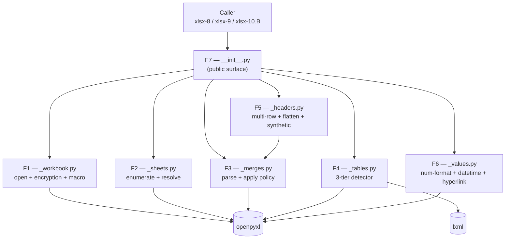
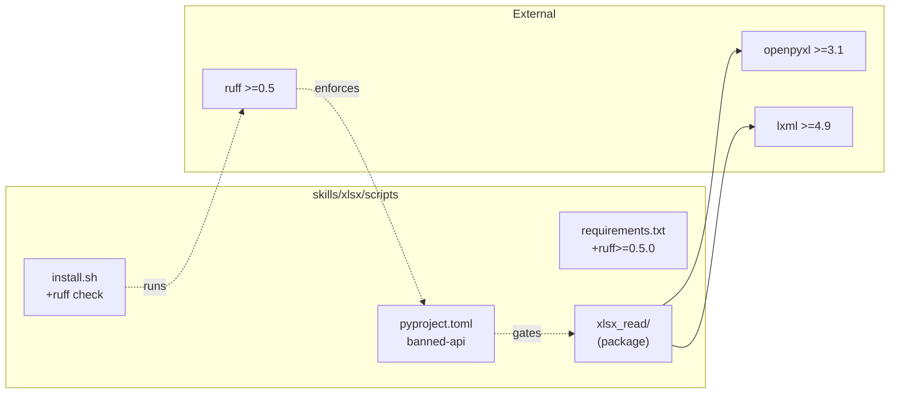
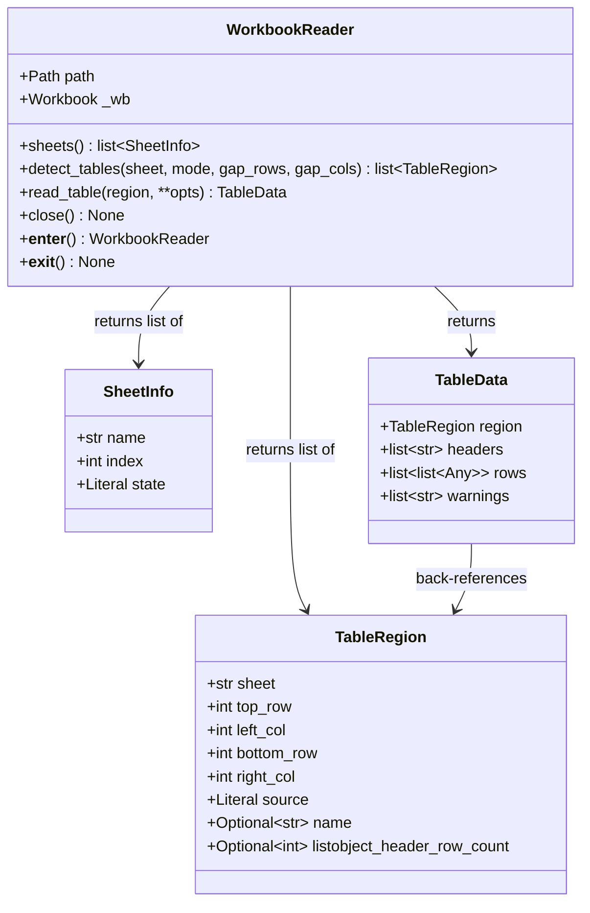

# ARCHITECTURE: xlsx-10.A — `xlsx_read/` common read-only reader library

> **Status:** ✅ **MERGED 2026-05-12** (8 atomic sub-tasks + 3-iteration
> VDD-multi adversarial cycle). Body below preserves the design-time
> specification verbatim; the post-merge implementation differs in a
> small number of documented ways (`keep_formulas` flag, dimension-
> bbox cap, overlap-check memoization, iter_rows streaming, sanitised
> number-format heuristic, banner+sublabels header detection, etc.)
> — see **§13 Post-merge adaptations** at the foot of this document
> for the full delta.
>
> Prior `docs/ARCHITECTURE.md` (docx-6 `docx_replace.py` + §12 docx-008
> relocators) is archived verbatim at
> [`docs/architectures/architecture-006-docx-replace.md`](architectures/architecture-006-docx-replace.md).
>
> **Template:** `architecture-format-core` with selectively extended
> §5 (Interfaces) + §6 (Tech stack) + §7 (Security) + §9 (Cross-skill
> replication boundary) — this is a **new multi-module package** (7
> modules) added to an existing skill, which is the same trigger that
> applied to xlsx-2 (json2xlsx), xlsx-3 (md-tables2xlsx), xlsx-7
> (xlsx_check_rules) and docx-6. Immediately preceding xlsx
> precedents (consulted while drafting this document):
>
> - xlsx-7 (`xlsx_check_rules.py`):
>   [`docs/architectures/architecture-002-xlsx-check-rules.md`](architectures/architecture-002-xlsx-check-rules.md)
>   — shim + package layout, §3.2 module split discipline, §8 perf
>   contract.
> - xlsx-2 (`json2xlsx.py`):
>   [`docs/architectures/architecture-003-json2xlsx.md`](architectures/architecture-003-json2xlsx.md)
>   — shim + package + cross-5/cross-7 pattern.
> - xlsx-3 (`md_tables2xlsx.py`):
>   [`docs/architectures/architecture-005-md-tables2xlsx.md`](architectures/architecture-005-md-tables2xlsx.md)
>   — atomic-chain cadence; §9 five-file `diff -q` gate.

---

## 1. Task Description

- **TASK:** [`docs/TASK.md`](TASK.md) (Task 009, slug
  `xlsx-read-library`, DRAFT v1).
- **Brief summary of requirements:** Ship
  `skills/xlsx/scripts/xlsx_read/` — a **read-only, closed-API,
  in-skill Python package** that extracts the duplicated reader-
  logic shared by future xlsx-8 (`xlsx2csv` / `xlsx2json`) and xlsx-9
  (`xlsx2md`) CLIs. The package replaces no existing code in v1 —
  duplication of xlsx-7's internal reader is **explicitly accepted**
  and refactor is deferred to xlsx-10.B (R3-M3 split).
- **Public surface (R1):** `open_workbook`, `WorkbookReader.sheets`,
  `WorkbookReader.detect_tables`, `WorkbookReader.read_table`,
  `WorkbookReader.close`, plus typed exceptions
  (`EncryptedWorkbookError`, `MacroEnabledWarning`,
  `OverlappingMerges`, `AmbiguousHeaderBoundary`, `SheetNotFound`)
  and frozen-outer dataclasses (`SheetInfo`, `TableRegion`,
  `TableData`).
- **Decisions inherited from TASK §7.3 (D1–D8)** are reproduced here
  so this document is self-contained:

  | D | Decision | Rationale |
  | --- | --- | --- |
  | D1 | `read_table(header_rows="auto", ...)` default | R2-L3 fix — backward-compat with `1` was circular under H3 fix forcing `auto` for multi-table sheets; `auto` reduces caller footguns. |
  | D2 | `detect_tables(gap_rows=2, gap_cols=1)` defaults | M4 fix — single-empty-row inside a table is a frequent visual separator (totals row, section break); `2` avoids over-splitting. |
  | D3 | `frozen=True` outer dataclass, mutable inner sequences | M3 + R2-M6 fix — deep-freeze (`tuple[tuple[Cell, ...], ...]`) is **same** O(n) cost as `list`, but forces caller into build-list-then-rebuild pattern. Honest scope: outer immutable, inner mutable, caller responsibility documented. |
  | D4 | Overlapping merges → fail-loud `OverlappingMerges` | M8 fix — `_overlapping_merges_check(ws.merged_cells.ranges)` runs **before** policy application, regardless of openpyxl's undefined behavior on corrupted workbooks. Pinning openpyxl version is **not** a fix (R2-M5 fix). |
  | D5 | Closed-API enforcement via `ruff` banned-api in `pyproject.toml` | R2-M2 + R3-M1 separation-of-concerns fix — `validate_skill.py` is a Gold-Standard SKILL.md validator, NOT a code linter. Static toolchain (ruff) is the correct boundary. |
  | D6 | xlsx-7 refactor deferred to xlsx-10.B (separate ticket) | R3-M3 split — single-row hid realistic likelihood that 10.B might not ship; ownership-bounded honest-scope handoff. |
  | D7 | `WorkbookReader` documented NOT thread-safe; no locking | L2 fix — openpyxl `Workbook` is not thread-safe; library does not attempt to lock; doc states per-thread instances required. |
  | D8 | Workbook-scope named ranges ignored in `detect_tables` | Honest scope (d); mirror xlsx-7; ListObjects + sheet-scope `<definedName>` cover 100 % of legitimate consumer use cases. |

- **Architect-layer decisions added by this document** (locked
  here, not in TASK):

  | D | Decision | Rationale |
  | --- | --- | --- |
  | D-A1 | `WorkbookReader` implements `__enter__` / `__exit__` context-manager protocol | Q-A1 closed — Pythonic; trivial cost; aligns with `open(...)` mental model used in callers. |
  | D-A2 | `MacroEnabledWarning` subclasses `UserWarning` | Q-A2 closed — standard practice; caller `warnings.filterwarnings("ignore", category=MacroEnabledWarning)` works out of the box. |
  | D-A3 | `SheetInfo` carries **name handle only** (no openpyxl Worksheet ref) | Q-A3 closed — closed-API purity (R1). Caller re-resolves via `reader._resolve_sheet(name)` internally; opaque to public surface. |
  | D-A4 | `_headers.py` is a **fresh** implementation, **NOT** an import from xlsx-7 | Q-A4 closed — duplication is the whole point of the 10.A → 10.B split; xlsx-10.B later refactors xlsx-7 to consume `xlsx_read`, not the other way. |
  | D-A5 | `_values.py` number-format heuristic is a **fresh** implementation; divergences from xlsx-7's heuristic are documented in `_values.py` module docstring | Q-A5 closed — same rationale as D-A4. |
  | D-A6 | `_workbook.py` chooses `read_only=True` automatically when input file size > 10 MiB; caller-overridable via `read_only_mode: bool \| None` kwarg | Heuristic — xlsx-7 uses the same threshold (verified in `xlsx_check_rules/scope_resolver.py`); below 10 MiB the formula/value/merge surfaces preserved by `read_only=False` are worth the memory cost. |
  | D-A7 | Library NEVER prints to stdout/stderr; emits warnings via `warnings.warn` only; raises typed exceptions otherwise | Caller (xlsx-8 / xlsx-9 / xlsx-10.B) is solely responsible for cross-5 envelope generation, exit codes, and user-facing log lines. Library is a pure data-producer. |
  | D-A8 | M8 design-question (openpyxl behavior on overlapping merges) resolved via spike in sub-task **009-01** ("workbook + sheets skeleton") | Empirical answer captured in a single fixture-driven test (`test_overlapping_merges_openpyxl_behavior.py`); regardless of result, library raises `OverlappingMerges` (D4 above). |

---

## 2. Functional Architecture

> **Convention:** F1–F7 are functional regions. Each maps 1:1 to a
> private module in the `xlsx_read/` package. No region spans more
> than one module; no module owns more than one region.

### 2.1. Functional Components

#### F1 — Workbook Open + Cross-Cutting Pre-flight (`_workbook.py`)

**Purpose:** The single entry point. Open the workbook, run cross-3
encryption probe and cross-4 macro probe, decide `read_only` mode,
return a `WorkbookReader`.

**Functions:**
- `open_workbook(path: Path, *, read_only_mode: bool | None = None,
  size_threshold_bytes: int = 10 * 1024 * 1024) -> WorkbookReader`
  - Input: filesystem path + optional override.
  - Output: bound `WorkbookReader`.
  - Raises: `EncryptedWorkbookError` (cross-3), `FileNotFoundError`,
    `zipfile.BadZipFile` (propagated).
  - Emits: `MacroEnabledWarning` for `.xlsm` / `.xltm`.
  - Related Use Cases: UC-01.
- `_probe_encryption(path: Path) -> None` — raises
  `EncryptedWorkbookError` when the file is encrypted (heuristic:
  presence of `EncryptedPackage` stream or magic bytes; identical
  detection pattern as `office_passwd.py`).
- `_probe_macros(path: Path) -> bool` — returns `True` when the file
  carries macros (`vbaProject.bin` in the OPC archive); caller
  decides to warn.
- `_decide_read_only(path: Path, override: bool | None,
  threshold: int) -> bool`.

**Dependencies:**
- Depends on: `openpyxl`, `zipfile`, `pathlib`, `warnings`.
- Depended on by: F2–F6.

---

#### F2 — Sheet Enumeration + Resolver (`_sheets.py`)

**Purpose:** Enumerate sheets in document order, expose
`SheetInfo` dataclass, resolve `name | "all" | missing` queries.

**Functions:**
- `enumerate_sheets(wb: openpyxl.Workbook) -> list[SheetInfo]` —
  reads `xl/workbook.xml/<sheets>` element order.
- `resolve_sheet(wb, query: str) -> str | list[str]` — returns
  one or many sheet names; raises `SheetNotFound` otherwise.
- `_state_from_openpyxl(sheet) -> Literal["visible","hidden",
  "veryHidden"]` — maps openpyxl `sheet_state` to public enum.

**Related Use Cases:** UC-02.

**Dependencies:**
- Depends on: `openpyxl`.
- Depended on by: F3, F4 (sheet handle).

---

#### F3 — Merge Resolution (`_merges.py`)

**Purpose:** Parse `<mergeCells>`, build `anchor → spans` map,
apply policy.

**Functions:**
- `parse_merges(ws) -> MergeMap` where `MergeMap = dict[tuple[int,
  int], tuple[int, int]]` (anchor row/col → bottom-right row/col).
- `apply_merge_policy(rows: list[list[Any]], merges: MergeMap,
  policy: MergePolicy) -> list[list[Any]]` — pure function, returns
  a new row-grid; never mutates input.
- `_overlapping_merges_check(ranges) -> None` — raises
  `OverlappingMerges` on first overlap (D4 / M8 fix). Runs **before**
  policy application.

**Related Use Cases:** UC-04 (Alt-7), UC-04 (main scenario).

**Dependencies:**
- Depends on: `openpyxl` (only `ws.merged_cells.ranges`).
- Depended on by: F4, F6.

---

#### F4 — Table Detection (`_tables.py`)

**Purpose:** 3-tier table detector. Tier-1 ListObjects; Tier-2
sheet-scope named ranges; Tier-3 gap-detect.

**Functions:**
- `detect_tables(wb, sheet_name: str, mode: TableDetectMode,
  gap_rows: int, gap_cols: int) -> list[TableRegion]`.
- `_listobjects_for_sheet(wb, sheet_name) -> list[TableRegion]` —
  parses `xl/tables/tableN.xml` parts bound to the sheet via the
  worksheet's `_rels` relationships. Re-implements xlsx-7 §4.3
  schema parse (fresh code per D-A4).
- `_named_ranges_for_sheet(wb, sheet_name) -> list[TableRegion]` —
  reads `<definedName>` with `localSheetId` matching the sheet
  index; skips workbook-scope (D8).
- `_gap_detect(ws, claimed: list[TableRegion], gap_rows: int,
  gap_cols: int) -> list[TableRegion]` — splits the remaining sheet
  area on consecutive empty rows/cols thresholds.

**Related Use Cases:** UC-03.

**Dependencies:**
- Depends on: `openpyxl`, `lxml` (only for `xl/tables/tableN.xml`
  raw parts).
- Depended on by: F6 (consumes regions).

---

#### F5 — Header Detection + Flatten (`_headers.py`)

**Purpose:** Determine where the header band ends; flatten multi-row
headers; emit synthetic headers when needed.

**Functions:**
- `detect_header_band(ws, region: TableRegion, hint: int |
  Literal["auto"]) -> int` — when `hint="auto"`: scans top rows for
  column-spanning merges; stops at the first row without any merge
  that spans ≥ 2 columns.
- `flatten_headers(rows: list[list[Any]], header_rows: int,
  separator: str = " › ") -> tuple[list[str], list[Warning]]` —
  joins top→sub keys with U+203A separator.
- `synthetic_headers(width: int) -> list[str]` — emits
  `col_1..col_N`.
- `_ambiguous_boundary_check(merges, header_rows) -> Warning |
  None` — emits `AmbiguousHeaderBoundary` if a merge straddles the
  cut.

**Related Use Cases:** UC-04 (main, A1, A2, A8).

**Dependencies:**
- Depends on: `_merges.py` (anchor info).
- Depended on by: F6.

---

#### F6 — Value Extraction (`_values.py`)

**Purpose:** Convert raw `openpyxl.Cell` content to public Python
values, applying number-format heuristic, datetime conversion,
hyperlink extraction, rich-text concat, stale-cache detection.

**Functions:**
- `extract_cell(cell, *, include_formulas: bool,
  include_hyperlinks: bool, datetime_format: DateFmt) -> Any` —
  returns plain Python `str | int | float | bool | datetime |
  None`.
- `_apply_number_format(value, number_format: str) -> str | float
  | int` — heuristic table:
  - `#,##0.00` / `0.00` → formatted string with thousands separator.
  - `0%` / `0.0%` → `f"{value*100:.{n}f}%"`.
  - Date patterns (`yyyy-mm-dd`, `m/d/yyyy`, `[$-409]m/d/yyyy h:mm AM/PM`)
    → routed to `_apply_datetime_format`.
  - Leading-zero text formats (`"00000"`) → string-coerce with
    zero-pad.
  - Fallback → raw value.
- `_apply_datetime_format(dt, fmt: DateFmt) -> str | float |
  datetime` — `ISO` / `excel-serial` / `raw`.
- `_extract_hyperlink(cell) -> str | None` — returns
  `cell.hyperlink.target` when present.
- `_flatten_rich_text(cell) -> str` — concatenates `cell.value`
  span text.
- `_stale_cache_warning(cell) -> Warning | None` — when formula
  exists and `cell.value is None`, returns a warning.

**Related Use Cases:** UC-04 (A3–A6).

**Dependencies:**
- Depends on: `openpyxl.Cell` only.
- Depended on by: F7.

---

#### F7 — Public API Surface (`__init__.py`)

**Purpose:** Re-export the public surface; bind `WorkbookReader`
methods; expose `__all__`.

**Public symbols** (full surface — `__all__` lock):
```python
__all__ = [
    "open_workbook",
    "WorkbookReader",
    "SheetInfo",
    "TableRegion",
    "TableData",
    "MergePolicy",
    "TableDetectMode",
    "DateFmt",
    "EncryptedWorkbookError",
    "MacroEnabledWarning",
    "OverlappingMerges",
    "AmbiguousHeaderBoundary",
    "SheetNotFound",
]
```

**Related Use Cases:** UC-01, UC-06.

**Dependencies:**
- Depends on: F1–F6.
- Depended on by: future xlsx-8 / xlsx-9 / xlsx-10.B callers (out
  of scope for this task).

### 2.2. Functional Components Diagram



---

## 3. System Architecture

### 3.1. Architectural Style

**Style:** **In-skill Python package** — closed-API library wrapped
behind a single `__init__.py` re-export. **No CLI shim in this
task.** (Consumers — xlsx-8 / xlsx-9 / xlsx-10.B — will each ship
their own shims.)

**Justification:**
- Mirrors the proven xlsx pattern: `xlsx_check_rules/` (xlsx-7),
  `xlsx_comment/` (xlsx-4), `json2xlsx/` (xlsx-2), `md_tables2xlsx/`
  (xlsx-3) — each a single-responsibility-per-module package.
- Closed-API surface is the **single guarantee** that distinguishes
  this library from "just helper modules": consumers MUST go through
  `__init__.py` so the library is refactorable without breaking
  callers (R2-M2 + R3-M1 fix).
- Layered Architecture (F1 → F2/F3 → F4/F5/F6 → F7) — each layer
  depends only on layers below; no cycles.
- Zero-dependency-above-skill — no new system tools; only `ruff`
  added at the Python dependency layer.

### 3.2. System Components

#### C1 — `skills/xlsx/scripts/xlsx_read/` (NEW, 7 files)

**Type:** In-skill Python package (`__init__.py` + 6 private modules
+ `tests/` subdir).

**Purpose:** Read-only foundation library; closed API.

**Implemented functions:** F1–F7 (each module = one functional
region; `__init__.py` = F7 surface).

**File layout:**
```
skills/xlsx/scripts/xlsx_read/
  __init__.py          # F7 public surface
  _workbook.py         # F1
  _sheets.py           # F2
  _merges.py           # F3
  _tables.py           # F4
  _headers.py          # F5
  _values.py           # F6
  py.typed             # PEP 561 marker (typed package)
  tests/
    __init__.py
    conftest.py
    fixtures/           # .xlsx fixtures (≥ 30 files)
    test_workbook.py
    test_sheets.py
    test_merges.py
    test_tables.py
    test_headers.py
    test_values.py
    test_public_api.py  # closed-API regression
    test_e2e.py         # ≥ 20 E2E scenarios
```

**Technologies:** Python ≥ 3.10, `openpyxl >= 3.1.0`, `lxml`,
`warnings` (stdlib), `dataclasses` (stdlib), `pathlib` (stdlib).

**Interfaces:**
- **Inbound (Python import):** `from xlsx_read import open_workbook,
  WorkbookReader, ...` (only symbols in `__all__`).
- **Outbound:** `openpyxl.load_workbook(...)`,
  `zipfile.ZipFile(...)` (encryption + macro probes), `lxml.etree`
  (raw `xl/tables/tableN.xml` parse).

**Dependencies:**
- External libs: `openpyxl >= 3.1.0` (already pinned),
  `lxml >= 4.9` (transitive via openpyxl, pinned),
  `ruff >= 0.5.0` (new, dev-time only).
- Other in-skill components: NONE (deliberate — package is
  self-contained per CLAUDE.md §2 "Независимость скиллов").
- System components: `office/`, `_soffice.py`, `_errors.py`,
  `preview.py`, `office_passwd.py` are **NOT imported** (5-file
  silent `diff -q` gate stays silent).

---

#### C2 — `skills/xlsx/scripts/pyproject.toml` (NEW)

**Type:** Toolchain config (Python project metadata).

**Purpose:** Host `[tool.ruff.lint.flake8-tidy-imports.banned-api]`
banned-api rule that forbids `xlsx_read._*` imports outside the
package — the **static** enforcement of the closed-API contract
(D5).

**Content (locked surface):**
```toml
[tool.ruff]
target-version = "py310"
line-length = 100

[tool.ruff.lint]
select = ["E", "F", "W", "TID"]

[tool.ruff.lint.flake8-tidy-imports.banned-api]
"xlsx_read._workbook".msg = "Use xlsx_read public surface; private modules are closed."
"xlsx_read._sheets".msg   = "Use xlsx_read public surface; private modules are closed."
"xlsx_read._merges".msg   = "Use xlsx_read public surface; private modules are closed."
"xlsx_read._tables".msg   = "Use xlsx_read public surface; private modules are closed."
"xlsx_read._headers".msg  = "Use xlsx_read public surface; private modules are closed."
"xlsx_read._values".msg   = "Use xlsx_read public surface; private modules are closed."
```

**Justification of file location:** `skills/xlsx/scripts/pyproject.
toml` (not at repo root) — per-skill toolchain isolation aligns with
the per-skill `requirements.txt` / `install.sh` / `.venv/` model
already in place (CLAUDE.md §1).

---

#### C3 — `skills/xlsx/scripts/requirements.txt` (MODIFIED)

**Change:** add `ruff>=0.5.0`. No other deltas.

#### C4 — `skills/xlsx/scripts/install.sh` (MODIFIED)

**Change:** append post-hook:
```bash
"${VENV_BIN}/ruff" check "${SCRIPT_DIR}" || {
    echo "ruff lint failed — see banned-api errors above"; exit 1;
}
```

#### C5 — `skills/xlsx/.AGENTS.md` (MODIFIED)

**Change:** add `## xlsx_read` section documenting:
- Closed-API contract (do not import `_*` outside the package).
- Thread-safety contract (per-thread instances; no module-level
  singletons).
- Honest-scope catalogue (read-only, no formula eval, no pandas, no
  workbook-scope named ranges, etc.).
- Pointer to `xlsx-10.B` in `docs/office-skills-backlog.md` for the
  pending xlsx-7 refactor.

#### C6 — `skills/xlsx/SKILL.md` (MODIFIED)

**Change:** §10 ("Additional Honest-Scope Items") gains a new
bullet: *"Known duplication: `xlsx_read/` and `xlsx_check_rules/`
internal reader logic. Refactor deferred to xlsx-10.B in
[docs/office-skills-backlog.md](../../docs/office-skills-backlog.md).
xlsx-9 owner to open within 14 days post-xlsx-9 merge; otherwise
promoted to permanent technical debt."*

### 3.3. Components Diagram



---

## 4. Data Model (Conceptual)

### 4.1. Entities Overview

> All public dataclasses are `frozen=True` at the outer level; inner
> sequences (`list[...]`) are mutable per D3 (M3 + R2-M6 honest
> scope).

#### Entity: `SheetInfo`

**Description:** Metadata about a single worksheet.

**Key attributes:**
- `name: str` — sheet name, byte-verbatim from `xl/workbook.xml`.
- `index: int` — 0-based index in document order.
- `state: Literal["visible","hidden","veryHidden"]`.

**Relationships:** Returned in lists by `WorkbookReader.sheets()`.

**Business rules:**
- `index` matches the element order in `<sheets>`.
- `state` is **never** filtered by the library; caller decides.

---

#### Entity: `TableRegion`

**Description:** A rectangular region on a sheet that the library
considers "a table".

**Key attributes:**
- `sheet: str` — owning sheet name.
- `top_row: int`, `left_col: int`, `bottom_row: int`,
  `right_col: int` — inclusive bounds, 1-based to match openpyxl.
- `source: Literal["listobject","named_range","gap_detect"]` —
  provenance (drives downstream emit behavior).
- `name: str | None` — ListObject name or named-range name when
  `source != "gap_detect"`; for `gap_detect` it is
  `"Table-N"` (1-based document order).
- `listobject_header_row_count: int | None` — set only when
  `source == "listobject"`; preserves the original `headerRowCount`
  attribute so `read_table` can short-circuit detection (R2-M4
  fix). `None` for other sources.

**Relationships:** Returned in lists by
`WorkbookReader.detect_tables()`; consumed by
`WorkbookReader.read_table()`.

**Business rules:**
- Tier-1 (ListObject) regions win over Tier-2 / Tier-3 on overlap
  (UC-03 A4).
- Workbook-scope named ranges are dropped before construction (D8).

---

#### Entity: `TableData`

**Description:** The materialised payload of a single region.

**Key attributes:**
- `region: TableRegion` — back-reference for caller traceability.
- `headers: list[str]` — flattened header keys (` › `-joined for
  multi-row) or synthetic `col_1..col_N` for `headerRowCount=0`.
- `rows: list[list[Any]]` — data rows; values are plain Python
  (`str | int | float | bool | datetime | None`). Length and
  shape match `headers` (always rectangular).
- `warnings: list[str]` — soft-fail messages (stale-cache,
  ambiguous boundary, synthetic-headers, hyperlinks-skipped, etc.).
  Plain strings — caller maps to cross-5 envelope.

**Relationships:** Returned by `WorkbookReader.read_table()`.

**Business rules:**
- Rectangular: every `row` has `len(row) == len(headers)`.
- `warnings` is **never** `None`; empty list when no warnings.
- Inner lists are intentionally mutable (D3 — outer frozen, inner
  mutable; documented caller contract: do not mutate).

---

#### Enum: `MergePolicy = Literal["anchor-only","fill","blank"]`

- `"anchor-only"` (default): only the top-left cell of a merge
  range carries the value; the other cells are `None`.
- `"fill"`: the anchor value is broadcast to every cell in the
  range.
- `"blank"`: only the anchor carries the value; the other cells
  are `None` **and** the row width is preserved (functionally
  identical to `anchor-only` in v1; reserved for future divergence
  if caller wants `""` instead of `None`).

#### Enum: `TableDetectMode = Literal["auto","tables-only","whole"]`

- `"auto"` (default): 1→2→3 fallthrough.
- `"tables-only"`: Tier-1 + Tier-2 only.
- `"whole"`: single region spanning the sheet's used range.

#### Enum: `DateFmt = Literal["ISO","excel-serial","raw"]`

- `"ISO"` (default): ISO-8601 string.
- `"excel-serial"`: float (Excel epoch).
- `"raw"`: native Python `datetime`.

### 4.2. Schema diagram



---

## 5. Interfaces

### 5.1. External (Python import)

**Public API (`from xlsx_read import ...`):**

```python
def open_workbook(
    path: Path,
    *,
    read_only_mode: bool | None = None,
    size_threshold_bytes: int = 10 * 1024 * 1024,
) -> WorkbookReader: ...

class WorkbookReader:
    def sheets(self) -> list[SheetInfo]: ...
    def detect_tables(
        self,
        sheet: str,
        *,
        mode: TableDetectMode = "auto",
        gap_rows: int = 2,
        gap_cols: int = 1,
    ) -> list[TableRegion]: ...
    def read_table(
        self,
        region: TableRegion,
        *,
        header_rows: int | Literal["auto"] = "auto",
        merge_policy: MergePolicy = "anchor-only",
        include_hyperlinks: bool = False,
        include_formulas: bool = False,
        datetime_format: DateFmt = "ISO",
    ) -> TableData: ...
    def close(self) -> None: ...
    def __enter__(self) -> "WorkbookReader": ...
    def __exit__(self, *exc) -> None: ...
```

### 5.2. Internal (private modules — banned for external import)

`_workbook.py`, `_sheets.py`, `_merges.py`, `_tables.py`,
`_headers.py`, `_values.py` — closed via D5 ruff banned-api.
Cross-module imports inside the package use sibling-relative form
(`from ._merges import parse_merges`), which is **allowed** because
the banned-api rule targets the absolute path `xlsx_read._*` from
**outside** the package.

### 5.3. Typed exceptions (public, importable, listed in `__all__`)

| Name | Subclass of | When raised |
| --- | --- | --- |
| `EncryptedWorkbookError` | `RuntimeError` | F1 detects encryption (cross-3). |
| `MacroEnabledWarning` | `UserWarning` (D-A2) | F1 detects `.xlsm` / `vbaProject.bin` (cross-4) — **emitted via `warnings.warn`**, not raised. |
| `OverlappingMerges` | `RuntimeError` | F3 detects intersecting merge ranges (D4 / M8). |
| `AmbiguousHeaderBoundary` | `UserWarning` | F5 detects a merge straddling the header/body cut — **emitted as a warning** (caller decides). |
| `SheetNotFound` | `KeyError` | F2 cannot resolve a sheet name. |

### 5.4. Library boundary contract (D-A7)

- The library **never** writes to stdout or stderr directly.
- Soft failures → `warnings.warn(msg, category=...)`.
- Hard failures → typed exceptions listed above.
- Caller responsibilities (out of scope for this task):
  cross-5 `--json-errors` envelope generation, exit-code mapping,
  user-facing log lines.

---

## 6. Technology Stack

### 6.1. Runtime

- Python ≥ 3.10 (xlsx skill baseline; uses `Literal`, `match`,
  dataclasses, type unions `X | Y`).
- `openpyxl >= 3.1.0` (already pinned in
  `skills/xlsx/scripts/requirements.txt`).
- `lxml >= 4.9` (transitive via openpyxl, already pinned).
- stdlib: `zipfile`, `pathlib`, `dataclasses`, `warnings`,
  `typing`, `enum`, `datetime`.

### 6.2. Direct PyPI dependencies (requirements.txt deltas)

| Package | New? | Pin | Use |
| --- | --- | --- | --- |
| `ruff` | **NEW** | `>=0.5.0` | Banned-api lint (D5). Dev-time + install.sh post-hook. |

### 6.3. Excluded technologies (deliberate)

- **pandas** — A4 lock from xlsx-2 / xlsx-3; library handles its
  own row→`list[Any]` materialisation.
- **subprocess / soffice** — read path is pure-Python via openpyxl
  + lxml; no LibreOffice round-trip needed.
- **mypy / pyright at install time** — out of scope; type hints
  ship in source + `py.typed` marker but are not gated. (R2-M2
  fix: scope locked to ruff banned-api only.)
- **`validate_skill.py` extension** — explicitly NOT touched (D5);
  it remains the Gold-Standard SKILL.md validator only.

### 6.4. Test stack

- `unittest` (stdlib) — matches existing xlsx skill convention
  (`skills/xlsx/scripts/xlsx_check_rules/tests/` uses unittest).
- Fixtures: hand-built `.xlsx` files in
  `xlsx_read/tests/fixtures/`, generated once via openpyxl helper
  script (kept under version control as binary blobs — same pattern
  as xlsx-7).

---

## 7. Security

### 7.1. Threat model

- **Trust boundary:** the input `.xlsx` file. Everything past
  `open_workbook(path)` is trusted-output emitted by openpyxl.
- **Adversary model:** the input file may be hostile (XXE payload,
  zip-slip, billion-laughs alias chains, oversize merges, macro-
  bearing).

### 7.2. Per-threat mitigation

| Threat | Mitigation | Owner |
| --- | --- | --- |
| **XXE** in any embedded XML part | `openpyxl` uses `lxml` with `resolve_entities=False` by default; `xlsx_read` does **NOT** parse raw XML outside the openpyxl code path **except** for `xl/tables/tableN.xml`. For that one parse: explicit `lxml.etree.XMLParser(resolve_entities=False, no_network=True, huge_tree=False)`. | F4 (`_tables.py`). |
| **Billion-laughs / entity expansion** | Same as XXE — explicit `resolve_entities=False`; `huge_tree=False`. | F4. |
| **Zip-slip** | Library never extracts archive members to disk; only reads in-memory via `zipfile.ZipFile.open(member)`. | F1. |
| **Macro execution** | `xlsx_read` is read-only; no VBA / OLE evaluation; macros only **detected** and surfaced as `MacroEnabledWarning`. | F1. |
| **Oversize merge / sparse region DoS** | `read_only=True` auto-mode for files > 10 MiB (D-A6); bounded `read_table(region)` reads only the requested rectangle. `_overlapping_merges_check` fails fast. | F1, F3. |
| **Encrypted-payload bypass** | `_probe_encryption` checks for `EncryptedPackage` OPC part **before** invoking openpyxl (which may otherwise spend time parsing garbage). | F1. |
| **Untrusted file path** | Library accepts `pathlib.Path`; **no** shell, **no** subprocess, **no** path concatenation with user-supplied tokens outside `Path` construction. | F1. |

### 7.3. OWASP Top-10 mapping (subset applicable to a non-network library)

| OWASP item | Applies? | Status |
| --- | --- | --- |
| A03:2021 Injection (XML / formula) | Yes (XML) | Mitigated (§7.2 XXE row); formula injection N/A — read-only library does not evaluate. |
| A05:2021 Security Misconfiguration | Yes | `lxml` parser explicitly configured (§7.2). |
| A08:2021 Software / Data Integrity Failures | Partial | Stale-cache detection (F6) surfaces formula/cached-value drift to caller. |

### 7.4. Privilege & filesystem boundaries

- No write paths. No temp-file creation. No subprocess. Library is
  pure-read.
- The only filesystem op is `open(path, "rb")` (via `zipfile` and
  `openpyxl`). No side effects.

---

## 8. Scalability and Performance

- **Per-call cost** (TASK §4.1):
  - Open + sheet enumerate: ≤ 200 ms (1 MiB workbook,
    `read_only=True`).
  - `detect_tables` 100-sheet workbook: ≤ 5 s.
  - `read_table` 10K × 20 region: ≤ 3 s, ≤ 200 MiB RSS.
- **Caching strategy:** **none** in v1. Each `read_table` call
  re-reads from openpyxl. Justification: caller (xlsx-8 / xlsx-9)
  typically reads each region once; caching adds complexity for no
  hit-rate evidence. Future v2 may add an LRU on `(sheet, region)`
  if profiling indicates re-reads.
- **Memory model:** `read_only=True` mode of openpyxl streams rows
  one at a time; `read_table` materialises only the bounded
  rectangle into `TableData.rows`. Worst case:
  `O(rows × cols × cell_size)`.
- **`detect_tables` complexity:** O(sheet_cells × number_of_lookups)
  with gap-detect bounded by the sheet's used range
  (`ws.calculate_dimension()`).

---

## 9. Cross-Skill Replication Boundary (CLAUDE.md §2)

### 9.1. Files this task MUST NOT modify

- `skills/docx/scripts/office/**`
- `skills/xlsx/scripts/office/**`
- `skills/pptx/scripts/office/**`
- `skills/docx/scripts/_soffice.py`
- `skills/xlsx/scripts/_soffice.py`
- `skills/pptx/scripts/_soffice.py`
- `skills/docx/scripts/_errors.py`
- `skills/xlsx/scripts/_errors.py`
- `skills/pptx/scripts/_errors.py`
- `skills/pdf/scripts/_errors.py`
- `skills/docx/scripts/preview.py`
- `skills/xlsx/scripts/preview.py`
- `skills/pptx/scripts/preview.py`
- `skills/pdf/scripts/preview.py`
- `skills/docx/scripts/office_passwd.py`
- `skills/xlsx/scripts/office_passwd.py`
- `skills/pptx/scripts/office_passwd.py`

### 9.2. New files (xlsx-only, no replication required)

- `skills/xlsx/scripts/xlsx_read/__init__.py`
- `skills/xlsx/scripts/xlsx_read/_workbook.py`
- `skills/xlsx/scripts/xlsx_read/_sheets.py`
- `skills/xlsx/scripts/xlsx_read/_merges.py`
- `skills/xlsx/scripts/xlsx_read/_tables.py`
- `skills/xlsx/scripts/xlsx_read/_headers.py`
- `skills/xlsx/scripts/xlsx_read/_values.py`
- `skills/xlsx/scripts/xlsx_read/py.typed`
- `skills/xlsx/scripts/xlsx_read/tests/**`
- `skills/xlsx/scripts/pyproject.toml`

### 9.3. Modified files (xlsx-only, no replication required)

- `skills/xlsx/scripts/requirements.txt` — `+ruff>=0.5.0`.
- `skills/xlsx/scripts/install.sh` — `+ruff check scripts/`.
- `skills/xlsx/.AGENTS.md` — `+## xlsx_read` section.
- `skills/xlsx/SKILL.md` — `§10` known-duplication marker.

### 9.4. Gating check (Developer MUST run before commit)

```bash
diff -qr skills/docx/scripts/office skills/xlsx/scripts/office
diff -qr skills/docx/scripts/office skills/pptx/scripts/office
diff -q  skills/docx/scripts/_soffice.py skills/xlsx/scripts/_soffice.py
diff -q  skills/docx/scripts/_soffice.py skills/pptx/scripts/_soffice.py
diff -q  skills/docx/scripts/_errors.py skills/xlsx/scripts/_errors.py
diff -q  skills/docx/scripts/_errors.py skills/pptx/scripts/_errors.py
diff -q  skills/docx/scripts/_errors.py skills/pdf/scripts/_errors.py
diff -q  skills/docx/scripts/preview.py skills/xlsx/scripts/preview.py
diff -q  skills/docx/scripts/preview.py skills/pptx/scripts/preview.py
diff -q  skills/docx/scripts/preview.py skills/pdf/scripts/preview.py
diff -q  skills/docx/scripts/office_passwd.py skills/xlsx/scripts/office_passwd.py
diff -q  skills/docx/scripts/office_passwd.py skills/pptx/scripts/office_passwd.py
```

All twelve must produce **no output**. (If any of them is noisy,
this task has accidentally touched shared infra and must be
reverted before merge.)

---

## 10. Additional Honest-Scope Items (Architecture-Layer)

- **HS-1.** No `__getattr__` magic at the package level. Any new
  public symbol MUST be added to `__all__` explicitly. Otherwise
  callers might import a private symbol that "happened to be
  accessible" — eroding D5.
- **HS-2.** `WorkbookReader.read_table` returns a **new**
  `TableData` per call; the library never returns a shared
  reference. Caller is free to mutate `TableData.rows` /
  `TableData.warnings` without affecting subsequent calls.
- **HS-3.** No telemetry, no logging at the `WARNING` level via
  `logging` module — only `warnings.warn`. (Callers may install a
  `warnings → logging` bridge if they want; library will not do
  this for them.)
- **HS-4.** Tests use `unittest`, not `pytest` (matches existing
  xlsx convention; xlsx-7 / xlsx-2 / xlsx-3 all use unittest).
- **HS-5.** **No** runtime closed-API enforcement (e.g.
  `_AccessLog`, runtime `__module__` checks). Static lint
  (`ruff` banned-api) is the **sole** gate (D5). Runtime checks
  would add overhead and still be bypassable.
- **HS-6.** Library is **NOT** distributed as a wheel / sdist.
  Consumers are co-located in the same skill (and will be in
  xlsx-10.B for xlsx-7). No `setup.py` / `pyproject.toml`-build
  section.

---

## 11. Atomic-Chain Skeleton (Planner handoff)

Recommended sub-task decomposition (8 atomic sub-tasks). Final
chain is the Planner's responsibility; this list is a hint:

| # | Slug | Scope | Stub-First gate |
| --- | --- | --- | --- |
| 009-01 | `pkg-skeleton-and-toolchain` | Create empty `xlsx_read/` package, `pyproject.toml`, add `ruff>=0.5.0` to `requirements.txt`, install.sh post-hook, `.AGENTS.md` section. All modules contain `pass` stubs only. | `python3 -c "import xlsx_read"` works; `ruff check scripts/` is green. |
| 009-02 | `workbook-open-encrypt-macro` | F1 `_workbook.py` — `open_workbook`, `_probe_encryption`, `_probe_macros`, `_decide_read_only`, `EncryptedWorkbookError`, `MacroEnabledWarning`. M8 spike fixture for openpyxl overlapping-merge behavior (D-A8). | `test_workbook.py` green; M8 spike documented in test file docstring. |
| 009-03 | `sheets-enumerate-resolve` | F2 `_sheets.py` — `enumerate_sheets`, `resolve_sheet`, `SheetInfo`, `SheetNotFound`. | `test_sheets.py` green. |
| 009-04 | `merges-policy-overlap` | F3 `_merges.py` — `parse_merges`, `apply_merge_policy` (3 policies), `_overlapping_merges_check`, `OverlappingMerges`. | `test_merges.py` green (3 policies × 3 fixtures = 9 cases + overlap case). |
| 009-05 | `tables-3tier-detect` | F4 `_tables.py` — Tier-1 ListObjects (re-parse `xl/tables/tableN.xml` via lxml), Tier-2 sheet-scope named ranges, Tier-3 gap-detect (defaults 2/1). | `test_tables.py` green (≥ 7 fixtures). |
| 009-06 | `headers-multi-row-flatten` | F5 `_headers.py` — `detect_header_band`, `flatten_headers` (` › ` separator), `synthetic_headers`, `_ambiguous_boundary_check`, `AmbiguousHeaderBoundary`. | `test_headers.py` green (single-row, multi-row, ambiguous, synthetic). |
| 009-07 | `values-extract-format` | F6 `_values.py` — `extract_cell`, `_apply_number_format`, `_apply_datetime_format`, `_extract_hyperlink`, `_flatten_rich_text`, `_stale_cache_warning`. | `test_values.py` green. |
| 009-08 | `public-api-e2e-and-docs` | F7 `__init__.py` — bind `WorkbookReader`, `__all__`, context-manager protocol, public API regression test (no openpyxl leak), 30 E2E scenarios from TASK §5.5, `SKILL.md §10` marker, `validate_skill.py` exit 0, 12-line `diff -q` gate silent. | All tests green; `ruff check scripts/` green; validator exit 0; cross-skill diff silent. |

---

## 12. Open Questions (residual, non-blocking)

> **All blocking ambiguities are resolved.** The remaining items
> are deferred to implementation-time judgement OR to xlsx-10.B and
> do NOT gate this task.

- **Q-1 (implementation).** `_workbook._probe_encryption` will share
  detection logic with `office_passwd.py`. **Do not** import from
  `office_passwd.py` (cross-skill replication concerns). Reimplement
  the heuristic (a few lines) inline. **Decision:** reimplement;
  documented in `_workbook.py` module docstring.
- **Q-2 (implementation).** ListObject XML parsing — re-use
  `xl/tables/tableN.xml` schema knowledge from xlsx-7's
  `scope_resolver.py`. Fresh code (D-A4); the schema is ECMA-376,
  not project-proprietary.
- **Q-3 (process).** `xlsx-10.B` (xlsx-7 refactor) is gated on this
  task **AND** on xlsx-9 (R3-M3). Until xlsx-9 ships, xlsx-10.B
  cannot start. If xlsx-9 ships first → 14-day ownership clock
  begins. **Action recorded in `SKILL.md §10`.**
- **Q-4 (future spec).** Number-format heuristic divergence between
  `xlsx_read._values` and `xlsx_check_rules` is intentional (D-A5);
  divergences will be enumerated in `_values.py` module docstring
  during implementation. If a divergence is later determined to be a
  **bug** in xlsx-7, that's an xlsx-7 ticket, not this one.

---

## 13. Post-merge adaptations

This section documents implementation choices that **deviate from**
or **extend** the design above. Each is a deliberate trade-off
captured during the 8-sub-task implementation + 3-iteration VDD-multi
adversarial cycle. Where a deviation has a `[D-Ax]` ancestor, the
design lock is re-cited.

### 13.1. `open_workbook` — `keep_formulas` flag (replaces D-A1 single-mode promise)

**Discovered in 009-07.** openpyxl cannot expose **both** formula
strings AND cached values from a single load — `data_only=True` drops
formula strings and exposes cached `<v>`; `data_only=False` keeps
formula strings and discards cached values. The original §5.1
signature implied callers could toggle via `include_formulas` at
`read_table` time alone — empirically impossible.

**Resolution:** new kwarg `keep_formulas: bool = False` on
`open_workbook`. Default false ⇒ openpyxl `data_only=True` ⇒ cached
values surfaced (matches the xlsx-8 / xlsx-9 emit case). `keep_formulas
=True` ⇒ `data_only=False` ⇒ formula strings surfaced; `include_formulas`
becomes meaningful, but cached values are then inaccessible. Documented
in `_workbook.open_workbook` docstring and `__init__.py` honest-scope
catalogue.

### 13.2. `_workbook` — basename-only error/warning messages (S-M2 fix)

**Discovered in vdd-multi iter-2 security critique.** Original §5.3
error messages echoed the **resolved absolute path** (e.g.
`f"Workbook is encrypted: {resolved}"`). Information-leak vector in
shared logs / multi-tenant CI.

**Resolution:** `EncryptedWorkbookError` and `MacroEnabledWarning`
messages now use `path.name` / `resolved.name` (basename only). Full
path remains in scope for the caller via the original `path` argument.

### 13.3. `_workbook._probe_macros` — suffix-gated (P-H3 fix)

**Discovered in vdd-multi iter-2 performance critique.** OOXML
macros are **structurally impossible** in a `.xlsx` container — only
`.xlsm` / `.xltm` can legally carry `xl/vbaProject.bin`. The original
F1 pipeline ran `_probe_macros` (a third ZIP open) on every input.

**Resolution:** `_probe_macros` is now gated by
`resolved.suffix.lower() in (".xlsm", ".xltm")`. `.xlsx` files drop
from 3 ZIP opens (encryption + macros + openpyxl) to 2.

### 13.4. `_tables._gap_detect` — `_GAP_DETECT_MAX_CELLS = 1_000_000` cap (P-C1 fix)

**Discovered in vdd-multi iter-1 performance critique** (also tagged
as a security DoS handoff). A malformed `<dimension ref="A1:XFD1048576"/>`
would force the original §2.1 F4 occupancy-grid allocation to ~137 GB.

**Resolution:** new module-level constant `_GAP_DETECT_MAX_CELLS =
1_000_000`. `_gap_detect` resolves the bbox via a new helper
`_resolve_dim_bbox(ws)` (parses `ws.dimensions` with
`openpyxl.utils.cell.range_boundaries`, falls back to
`(max_row, max_column)`) and raises `ValueError` when
`n_rows × n_cols > _GAP_DETECT_MAX_CELLS`. Callers facing genuinely
large sheets must pass `mode="whole"` or `mode="tables-only"`.

### 13.5. `_tables._gap_detect` + `_types.read_table` — `iter_rows` streaming (P-C2 fix)

**Discovered in vdd-multi iter-1 (perf CRITICAL).** The original §2.1
F4 / F7 pseudocode used `ws.cell(row=r, column=c)` in nested loops.
In openpyxl `read_only=True` mode this is O(rows²) — each call
re-walks the sheet XML stream from the beginning. The 10 MiB
auto-`read_only=True` threshold guaranteed every large workbook hit
this anti-pattern, breaking the 3 s / 10K × 20 read_table budget.

**Resolution:** both call sites now use
`ws.iter_rows(min_row, max_row, min_col, max_col, values_only=…)`
with `values_only=True` for gap-detect (occupancy is bool-only) and
`values_only=False` for `read_table` (full cell objects needed for
`number_format` / `hyperlink`). Includes padding for sparse-row
streaming-mode skips.

### 13.6. `_types.WorkbookReader._overlap_checked` — per-sheet memo (P-H1 / S-L3 / NEW-S-M1)

**Two-stage evolution:**

- **iter-1 (perf H1, sec L3):** O(n²) overlap check ran on every
  `read_table` call against the whole sheet's merges — wasted O(n²)
  per region.
- **iter-2 fix:** added `_overlap_checked: set[str]` on
  `WorkbookReader` (per-sheet memo). First call on a sheet performed
  the check on a **region-filtered** subset; subsequent calls
  skipped. Cleared on `close()`.
- **iter-3 fix (NEW-S-M1):** the iter-2 region-filter broke the
  fail-loud contract — region A's clean call would memoize the
  sheet, then region B's read with overlapping merges in B silently
  skipped the check. Dropped the region filter; the cold-pass now
  runs against `list(ws.merged_cells.ranges)` (full sheet). Soundness
  restored; perf win preserved (one O(n²) pass per sheet per reader
  lifetime). Regression pinned by
  `test_merges.py::TestOverlapMemoSoundnessAcrossRegions`.

### 13.7. `_values._apply_number_format` — quoted-literal + escape + section-split sanitisation (L-H3 / L-M5 fix)

**Discovered in vdd-multi iter-1 logic critique.** Original §2.1 F6
regex pipeline ran `re.sub(r"\[[^\]]*\]", ...)` then matched on the
result. A number-format like `"Day"` (literal-text containing the
date placeholder `d`) routed a numeric ID cell through the date
pipeline, producing fake ISO date strings.

**Resolution:** four-stage strip pipeline in
`_apply_number_format`:

```python
stripped = re.sub(r'"[^"]*"', "", number_format)   # quoted literals
stripped = re.sub(r"\\.", "", stripped)             # \X-escaped chars
stripped = re.sub(r"\[[^\]]*\]", "", stripped)      # locale/colour brackets
stripped = stripped.split(";", 1)[0].strip()        # positive section only
```

The `;`-split addresses L-M5 (positive/negative section formats like
`"#,##0_);(#,##0)"` now correctly classify on the positive section).

### 13.8. `_values._apply_number_format` — 256-char defensive cap (S-L4 fix)

**Discovered in vdd-multi iter-2 security critique.** OOXML imposes
no `number_format` length cap. A malicious workbook with a
multi-megabyte format string would force `re.sub` + four `re.match`
calls per cell to scan the full string. Per cell, in a 10K × 20
region.

**Resolution:** `if len(number_format) > 256: number_format = "General"`
at the top of `_apply_number_format`. Real-world Excel number formats
are < 64 chars; 256 gives 4× headroom. Acts as defence-in-depth
against future ReDoS posture drift (S-M1 accepted-risk item).

### 13.9. `_values._apply_datetime_format("excel-serial")` — `timedelta(days=float(value))` (L-H2 fix)

**Discovered in vdd-multi iter-1 logic critique.** Original §2.1 F6
pseudocode used `_EXCEL_EPOCH.fromordinal(_EXCEL_EPOCH.toordinal() +
int(value))` — `int(value)` silently truncates the fractional part
that encodes time-of-day in Excel's serial format. Datetime cells
with hour:minute components emitted as midnight.

**Resolution:** `dt = _EXCEL_EPOCH + timedelta(days=float(value))`.
Preserves sub-day precision. `timedelta` is now imported alongside
`datetime` and `date`.

### 13.10. `_headers.detect_header_band` — banner+sublabels heuristic (L-H1 + design refactor)

**Two findings stacked:**

- **Original §2.1 F5 pseudocode** marked rows containing any column-
  spanning merge as "header rows". For a workbook with merges on
  row 1 only (the natural Excel banner pattern), the heuristic
  returned `header_rows=1`, missing the row 2 sub-labels.
- **vdd-multi iter-1 L-H1:** the original filter `merge.max_row <
  region.top_row or merge.min_row > region.bottom_row` admitted
  merges whose anchor sits **above** the region's first row — a
  phantom header row inherited from an enclosing super-region.

**Resolution:** new heuristic — *"a column-spanning merge on row K
implies rows K and K+1 are both header (banner + sublabels
pattern)"*. Implementation tracks the maximum `merge.max_row` of any
column-spanning merge **anchored** in the region's top rows
(`merge.min_row >= region.top_row`); header band runs from
`region.top_row` through `max_merge_row + 1`, clamped to
`region.bottom_row`. Default single-row header when no merges found.

### 13.11. `_headers.flatten_headers` — sticky-fill-left + consecutive-repeat dedup

**Design refinement** — original §2.1 F5 left the flatten algorithm
unspecified. Implementation chose:

- **Sticky-fill-left:** the leftmost non-empty value in each header
  row propagates rightward through empty cells (Excel's natural
  anchor-only post-merge pattern).
- **Consecutive-repeat dedup:** `["X", "X"]` flattens to `"X"`, not
  `"X › X"` — when a single-cell label gets sticky-filled into both
  levels, dedup avoids the redundant join.

### 13.12. `_tables._named_ranges_for_sheet` — disambiguation suffix for multi-destination names (L-M3 fix)

**Discovered in vdd-multi iter-1 logic critique.** A defined name
with comma-separated destinations targeting the same sheet (e.g.
`Sheet1!A1:B5,Sheet1!D1:E5`) emitted two `TableRegion`s sharing the
same `name`, causing collisions in downstream dict-keyed consumers.

**Resolution:** track `dest_count` per name in two passes. Single-
dest names keep their bare form; multi-dest names get `#1`, `#2`, …
suffixes in iteration order (deterministic across re-reads).

### 13.13. `_merges.apply_merge_policy` — empty-merges short-circuit (P-M1 fix + iter-3 purity hardening)

**Two-stage evolution:**

- **iter-1 P-M1:** original §2.1 F3 always deep-copied the row-grid,
  wasted ~50–100 ms on the common no-merges case. Added empty-merges
  short-circuit.
- **iter-3 L-N1 / L-perf-iter2-1:** the iter-2 short-circuit aliased
  full-width input rows (`row if len(row) == n_cols else …`),
  technically violating the purity contract. Hardened to always
  `list(row)` even on the fast path.

Final form:
```python
if not merges:
    return [list(row) + [None] * (n_cols - len(row)) for row in rows]
```

### 13.14. Honest-scope addendum in `__init__.py` (delegated to callers)

Five items deliberately delegated to the caller via the public
module docstring (consistent with this library's "API not
application" posture):

1. **Path allowlisting** — `open_workbook` follows symlinks via
   `Path.resolve(strict=True)`; callers exposing this API to
   untrusted paths must allowlist before passing.
2. **Zip-bomb defense** — caller is responsible for RLIMIT_AS /
   container-memory constraints on input archives.
3. **Downstream sanitisation** — cell values are verbatim;
   LLM/shell/SQL escaping is the caller's boundary.
4. **`_GAP_DETECT_MAX_CELLS` cap** — caller passes `mode="whole"`
   or `mode="tables-only"` for genuinely large sheets.
5. **Excel 1900 leap-year bug NOT compensated** — `excel-serial`
   output is true day-count from `1899-12-30`; serials 1–59 (legacy
   Jan/Feb 1900) are off by one day vs Excel's display.

### 13.15. M8 design-question — empirically resolved (D-A8 followup)

The `_workbook.py` M8 spike test (TC-SPIKE-01 in `test_workbook.py`)
empirically confirmed:

> **openpyxl 3.1.5 silently accepts overlapping `<mergeCells>`
> ranges** — `ws.merged_cells.ranges` exposes both ranges; no
> exception is raised.

Locked behaviour as of 2026-05-12. Consequence for `_merges`:
`_overlapping_merges_check` performs explicit pairwise box-
intersection regardless of openpyxl's surface behaviour — implementation
satisfies D4 unconditionally.

### 13.16. Adaptations explicitly NOT made (accepted-risk items)

- **S-M1 (ReDoS posture drift):** migration to `regex` + `timeout=`
  deferred; library relies on linear-pattern discipline (the 256-
  char cap from §13.8 acts as defence-in-depth).
- **P-H2 (single-helper ZIP-open consolidation):** after §13.3 only
  `.xlsm` opens twice; marginal value.
- **L-M4 (`flatten_headers` header/body width mismatch):** caller-
  mitigable via dict-zip guard.
- **L-N2 (named-range suffix gap after `_has_overlap` filter):**
  cosmetic UX nit.
- **`WorkbookReader.__del__`:** deferred; tests use `with` blocks
  or explicit `close()`.
- **Workbook pooling:** explicitly out of v1 scope (HS-3).
