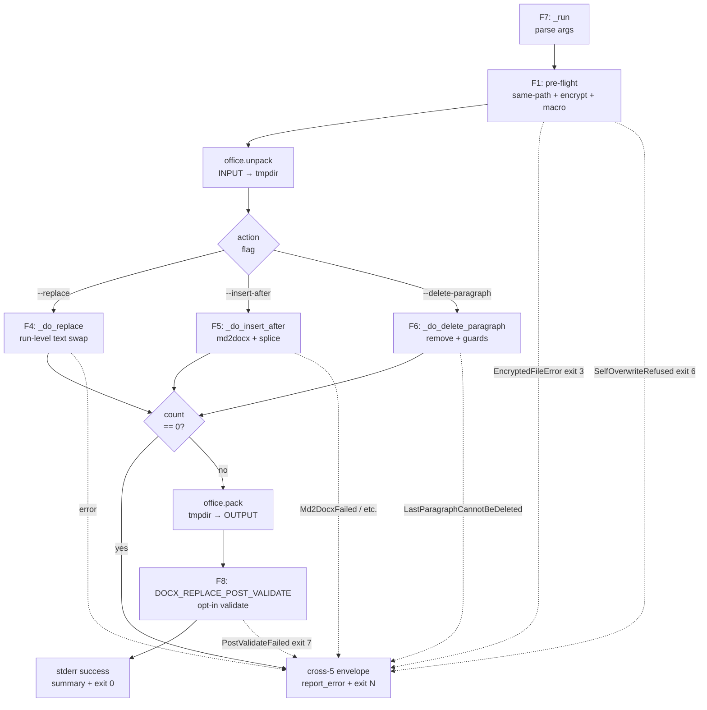
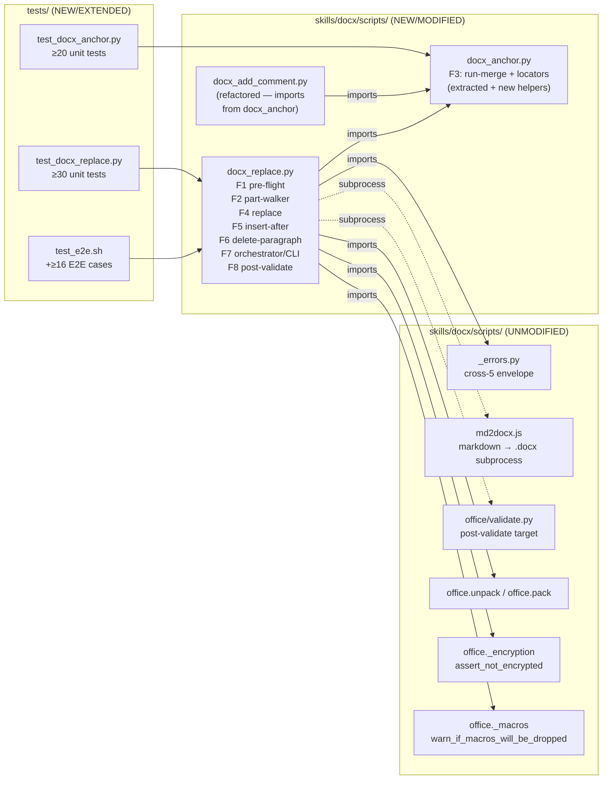
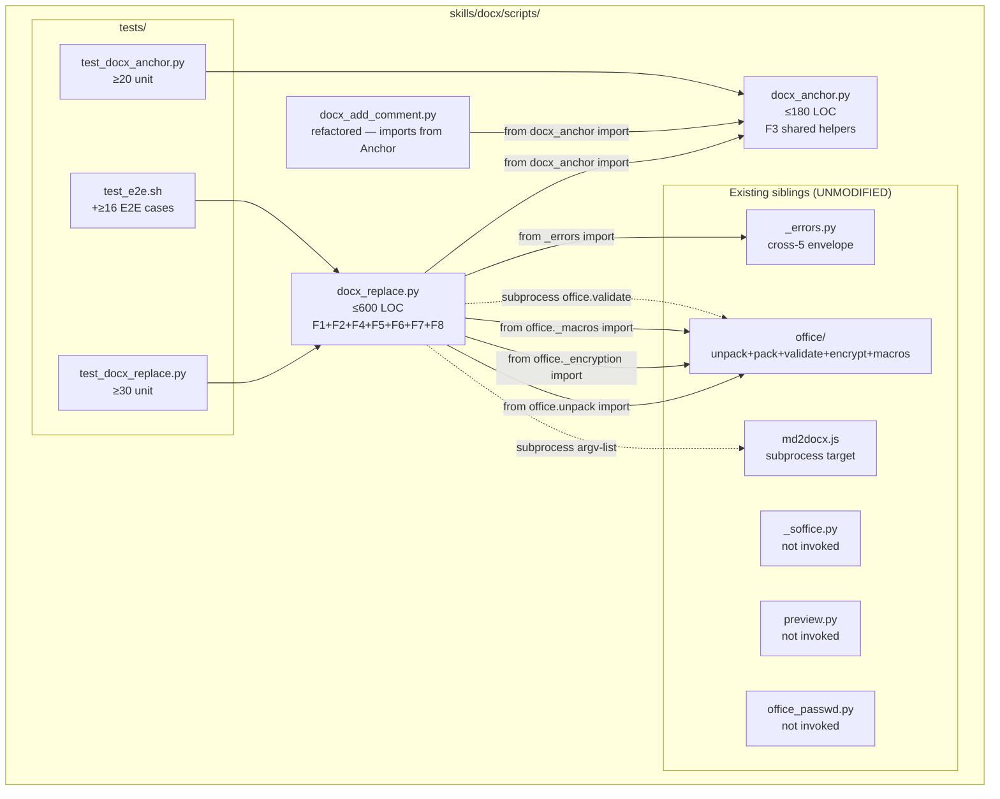

# ARCHITECTURE: docx-6 — `docx_replace.py` (surgical point-edit of `.docx`)

> **Status: ✅ MERGED 2026-05-12** (11-sub-task chain + VDD-Multi Phase-3
> hardening). DRAFT v2 round-1 architecture-review APPROVED on
> 2026-05-11 (MAJ-1, MAJ-2, MIN-1, MIN-2, MIN-3, MIN-4, NIT-3 fixes
> applied inline before merge). Post-merge: VDD-Multi-prompted F8
> `_run_post_validate` security hardening (cwd=output.parent +
> PYTHONPATH=scripts_dir) honored ARCH boundaries without modification
> of structural design. Body below is preserved verbatim as the
> design source of truth.
>
> Template: `architecture-format-core` (TIER 2 extended cadence applied —
> new multi-module component added to an existing skill with >3 logical
> regions and a shared-helper extraction). Immediately preceding docx
> architecture precedents:
>
> - xlsx-2 (`json2xlsx.py`, Task 004 — MERGED):
>   [`docs/architectures/architecture-003-json2xlsx.md`](architectures/architecture-003-json2xlsx.md)
>   — shim + package + cross-5/cross-7 pattern.
> - xlsx-3 (`md_tables2xlsx.py`, Task 005 — MERGED):
>   [`docs/architectures/architecture-005-md-tables2xlsx.md`](architectures/architecture-005-md-tables2xlsx.md)
>   — atomic chain cadence; §9 eleven diff -q gate.

---

## 1. Task Description

- **TASK:** [`docs/TASK.md`](TASK.md) (Task 006, slug `docx-replace`,
  DRAFT v2 — task-reviewer M1/M2/M3 + m1/m3/m4 applied per
  [`docs/reviews/task-006-review.md`](reviews/task-006-review.md)).
- **Brief summary of requirements:** Ship
  `skills/docx/scripts/docx_replace.py` — a CLI that locates a text
  anchor inside an OOXML wordprocessing document (body, headers,
  footers, footnotes, endnotes) and performs one of three minimal-
  impact actions:
  1. **`--replace TEXT`** — in-place text swap inside the matched run,
     preserving `<w:rPr>` bold/italic/fontsize/colour.
  2. **`--insert-after PATH`** — splice one or more new paragraph(s)
     (materialised from a markdown file via `md2docx.js` subprocess)
     immediately after the paragraph containing the anchor.
  3. **`--delete-paragraph`** — remove the entire `<w:p>` containing
     the anchor, with guards against emptying the body or a table cell.

  The script shares anchor-finding helpers with the existing
  `docx_add_comment.py` via a new shared module `docx_anchor.py`
  (docx-only; NOT under `office/`). Full cross-cutting parity: cross-3
  encryption guard, cross-4 macro warning, cross-5 `--json-errors`
  envelope, cross-7 same-path guard.

- **Decisions this document closes** (TASK §6.1 Q-A1 through Q-A5):

  | Q | Decision | Rationale |
  |---|---|---|
  | **Q-A1 — Module split** | **Single file** `docx_replace.py` (≤ 600 LOC), no package. `docx_anchor.py` is a separate helper module at the same level, not a sub-package. | docx-6 has 7 CLI flags — below the xlsx-2 split threshold of ~8 flags + 280 LOC for cli.py alone. The three actions (replace / insert / delete) share a common unpack→locate→act→pack skeleton; a package would scatter a 200-line dispatcher across 5 files with no benefit. Guardrail: if `docx_replace.py` exceeds **600 LOC**, extract an `_actions.py` sibling. |
  | **Q-A2 — `docx_anchor.py` extraction timing** | **Ship in the same docx-6 atomic chain** (sub-task 006-01 extracts helpers; `docx_add_comment.py` is updated in the same sub-task). | A pre-task would require a separate task-007 with its own review cycle, leaving a tech-debt comment in `scripts/.AGENTS.md` for one extra sprint. Shipping together gives a single review cycle; the E2E suite for `docx_add_comment.py` is the regression guard. |
  | **Q-A3 — `<w:sectPr>` stripping** | **Strip the trailing `<w:sectPr>` from md2docx output before splice.** Lookup pattern: after extracting `<w:body>` children from the insert tree, filter out any element whose `lxml.etree.QName(el).localname == "sectPr"`. | `md2docx.js` always emits one `<w:sectPr>` as the last child of `<w:body>`. Inserting it mid-document would create a spurious section break (duplicate `<w:sectPr>` inside an existing section corrupts page layout — same lesson as `docx_merge.py` iter-2.2). Stripped unconditionally; a v2 flag `--carry-section-props` is the opt-in path if ever needed. |
  | **Q-A4 — Numbering relocation** | **Warn-only (honest scope §11.4).** No relocation in v1. | Relocating `<w:numId>` references requires copying abstractNum definitions from the MD-source's `numbering.xml` into the base doc and remapping all numId values — the same multi-file operation `docx_merge.py` v2-deferred. This is out of scope for a surgical edit tool. stderr warning format: `[docx_replace] WARNING: inserted body contains <w:numId> references; base document has no numbering.xml — list items may render as plain text. Relocate numbering in v2.` |
  | **Q-A5 — Empty-cell placeholder** | **`<w:p/>`** (self-closing empty element, shorter form). | ECMA-376 §17.4.66 requires that a `<w:tc>` contain at least one block-level element; an empty `<w:p/>` satisfies the constraint and is accepted by `office/validate.py`. The longer form `<w:p><w:r><w:t/></w:r></w:p>` is also legal but adds unnecessary nesting. `etree.Element(qn("w:p"))` produces the shorter form. |

- **Decisions inherited from TASK §0** (D1–D8, locked at Analysis +
  task-reviewer round-1; reproduced here so this document is
  self-contained):

  | D | Decision |
  |---|---|
  | D1 | `--insert-after` materialises markdown through `md2docx.js` subprocess → unpack the tmp `.docx` → splice body `<w:p>` blocks AFTER the anchor's containing paragraph. |
  | D2 | Anchor-search scope = body + headers + footers + footnotes + endnotes; parts discovered from `[Content_Types].xml`. |
  | D3 | `--anchor X --replace ""` (empty replacement) is allowed; paragraph survives with empty `<w:t>`. |
  | D4 | `--all` supported across all three actions. |
  | D5 | Exactly one of `--replace` / `--insert-after` / `--delete-paragraph` per invocation (mutually exclusive). |
  | D6 | Run-boundary policy B: `--replace` is single-run (anchor in one `<w:t>` after `_merge_adjacent_runs`); `--insert-after` and `--delete-paragraph` use whole-paragraph concat-text matching (cross-run OK). |
  | D7 | `--insert-after -` reads markdown from stdin (same `-` sentinel convention as xlsx-2/-3). |
  | D8 | Success log = one-line stderr summary, exit 0; failures use cross-5 envelope. |

---

## 2. Functional Architecture

> **Convention:** F1–F8 are functional regions. Each maps 1:1 to a
> logical group of functions in `docx_replace.py` or `docx_anchor.py`.
> No region spans more than one module; no module owns more than one
> region (with the deliberate exception that `docx_replace.py` bundles
> F3–F7 as a single 600-LOC file per Q-A1 decision above).

### 2.1. Functional Components

#### F1 — Cross-Cutting Pre-flight

**Purpose:** Guard against the four cross-cutting failure modes before
any file I/O begins: same-path collision (cross-7), encrypted input
(cross-3), macro-bearing input (cross-4), and stdin size overflow.

**Functions:**
- `_assert_distinct_paths(input_path: Path, output_path: Path) -> None`
  - Uses `Path.resolve(strict=False)` on both sides; raises
    `SelfOverwriteRefused` (exit 6) on collision. Follows symlinks.
  - Input: two resolved `Path` objects.
  - Output: None (raises on collision).
  - Related Use Cases: UC-1 Alt-7, UC-2 Alt-7, UC-3 (preconditions).
- `_read_stdin_capped(max_bytes: int = 16 * 1024 * 1024) -> bytes`
  - Reads `sys.stdin.buffer` up to `max_bytes`; raises
    `InsertSourceTooLarge` (exit 2) if exceeded.
  - Related Use Cases: UC-2 Alt-1, R2.h.
- `_tempdir(prefix: str)` — `contextmanager` wrapper around
  `tempfile.TemporaryDirectory` that guarantees cleanup on exception.

**Dependencies:**
- Stdlib only (`pathlib`, `sys`, `tempfile`, `contextlib`).
- `office._encryption.assert_not_encrypted` (cross-3).
- `office._macros.warn_if_macros_will_be_dropped` (cross-4).
- Required by: F5/F6/F7 orchestrators (called first in `_run`).

---

#### F2 — Part Walker

**Purpose:** Enumerate every searchable XML part from the unpacked
OOXML tree in deterministic order, parse each to an `lxml.etree`
element tree, and yield `(part_path, root_element)` pairs.

**Functions:**
- `_iter_searchable_parts(tree_root: Path, scope: set[str] | None = None) -> Iterator[tuple[Path, etree._Element]]`
  - **Enumeration source (arch-review MIN-3 clarification):** authoritative
    list = `[Content_Types].xml` `<Override PartName="...">` entries
    whose content-type indicates a WordprocessingML part
    (`...wordprocessingml.document.main+xml`,
    `...wordprocessingml.header+xml`,
    `...wordprocessingml.footer+xml`,
    `...wordprocessingml.footnotes+xml`,
    `...wordprocessingml.endnotes+xml`). Filesystem glob
    (`word/header*.xml`) is the **fallback only** when
    `[Content_Types].xml` is missing or malformed (warn to stderr).
    This matches TASK R5.f ("parts enumerated from `[Content_Types].xml`").
  - Yield order: document → headers (sorted by PartName ascending) →
    footers (sorted by PartName ascending) → footnotes → endnotes.
  - Parts listed in `[Content_Types].xml` but missing on disk are
    silently skipped (corrupt-package tolerance).
  - Yield order = document → headers → footers → footnotes → endnotes
    (TASK §11.1 deterministic ordering, R5.g).
  - **`scope` parameter (docx-6.7, post-merge addition):** `None`
    (default) = all roles yielded — back-compat with pre-6.7 callers.
    A `set` subset of `{"document", "header", "footer", "footnotes",
    "endnotes"}` drops roles not in the set BEFORE the yield loop,
    AFTER the parts_by_role dict is populated and sorted — preserves
    R5.g order within the requested subset. Parsed from `--scope=LIST`
    CLI flag via `_parse_scope` helper in `docx_replace.py`; validated
    early in `_run` (before unpack) to fail fast on bad values.
  - Input: `tree_root` — directory produced by `office.unpack`;
    optional `scope` — role subset.
  - Output: lazy iterator of `(path, etree_root)` pairs.
  - Related Use Cases: UC-1 step 4, UC-2 step 5, UC-3 step 3.

**Dependencies:**
- `lxml.etree` (already in `requirements.txt`).
- `pathlib.Path`.
- Required by: F3, F4, F5 (locators consume this stream).

---

#### F3 — Anchor Locators (`docx_anchor.py`)

**Purpose:** Provide the shared paragraph-finding primitives used by
both `docx_replace.py` (F4, F5, F6) and `docx_add_comment.py`
(refactored to import these). This is the **extracted** module per
Q-A2 decision.

**Functions extracted from `docx_add_comment.py` (byte-identical behaviour):**
- `_is_simple_text_run(run: etree._Element) -> bool`
  - Returns True if run contains only `rPr`, `t`, `lastRenderedPageBreak`.
  - Existing line 160 in `docx_add_comment.py` — moved verbatim.
- `_rpr_key(run: etree._Element) -> bytes`
  - Canonical serialisation of `<w:rPr>` for equality comparison.
  - Existing line 155 in `docx_add_comment.py` — moved verbatim.
- `_merge_adjacent_runs(paragraph: etree._Element) -> None`
  - Merges adjacent simple runs with identical rPr keys.
  - Existing line 177 in `docx_add_comment.py` — moved verbatim.

**New functions (docx-6 additions):**
- `_replace_in_run(paragraph: etree._Element, anchor: str, replacement: str, *, anchor_all: bool) -> int`
  - Input: paragraph element (post-run-merge), anchor string,
    replacement string, `anchor_all` flag.
  - Output: count of replacements performed in this paragraph.
  - Behaviour: for each simple text run, performs cursor-loop
    (`text.find(anchor, cursor)`) to locate occurrences; rebuilds
    `<w:t>` text with replacement spliced in; sets
    `xml:space="preserve"` when result contains whitespace. Stops
    after first match unless `anchor_all=True`.
  - Related Use Cases: UC-1 (R1.a–R1.g).
- `_concat_paragraph_text(paragraph: etree._Element) -> str`
  - Input: paragraph element.
  - Output: concatenation of all `<w:t>` text content within the
    paragraph (ignores `<w:del>` runs; includes `<w:ins>` runs per
    Q-U1 default proposal).
  - Used by the paragraph-level locators (F4, F5).
  - Related Use Cases: UC-2 step 5, UC-3 step 3 (D6 policy B).
- `_find_paragraphs_containing_anchor(part_root: etree._Element, anchor: str) -> list[etree._Element]`
  - Input: root element of a parsed XML part, anchor string.
  - Output: list of `<w:p>` elements whose concat-text contains
    `anchor` as a substring (document order).
  - Does NOT call `_merge_adjacent_runs` (paragraph-level matching
    does not need it — D6 policy B).
  - Related Use Cases: UC-2 step 5, UC-3 step 3.

**Dependencies:**
- `lxml.etree`.
- `docx.oxml.ns.qn` (namespace helper; python-docx already in
  `requirements.txt`).
- Required by: `docx_replace.py` (F4, F5, F6) and `docx_add_comment.py`
  (refactored to import instead of defining inline).

---

#### F4 — Replace Action

**Purpose:** Implement `--replace TEXT` — walk every searchable part,
call `_merge_adjacent_runs` + `_replace_in_run` per paragraph, write
back the modified XML, count total replacements.

**Functions (in `docx_replace.py`):**
- `_do_replace(tree_root: Path, anchor: str, replacement: str, *, anchor_all: bool) -> int`
  - Input: `tree_root` (unpacked docx directory), anchor/replacement
    strings, `anchor_all` flag.
  - Output: total count of replacements across all parts.
  - Algorithm:
    1. For each part from F2 `_iter_searchable_parts`:
       a. Walk every `<w:p>` in the part.
       b. Call `_merge_adjacent_runs(p)`.
       c. Call `_replace_in_run(p, anchor, replacement, anchor_all=anchor_all)`.
       d. Accumulate replacement count.
       e. Without `--all`: if count > 0, write part and return.
       f. Write part if modified.
    2. Return total count.
  - Related Use Cases: UC-1 main scenario and all alternatives.

**Dependencies:**
- F2 (`_iter_searchable_parts`), F3 (`_merge_adjacent_runs`,
  `_replace_in_run`) — imported from `docx_anchor`.
- `lxml.etree` for part serialisation.

---

#### F5 — Insert-After Action

**Purpose:** Implement `--insert-after PATH` — materialise the markdown
source via `md2docx.js` subprocess, extract body paragraphs (stripping
`<w:sectPr>` per Q-A3), locate anchor paragraph(s), splice deep-cloned
content immediately after each match.

**Functions (in `docx_replace.py`):**
- `_materialise_md_source(md_path: Path, scripts_dir: Path, tmpdir: Path) -> Path`
  - Input: path to `.md` file (or temp file from stdin), `scripts_dir`
    pointing to `skills/docx/scripts/`, `tmpdir` for output.
  - Output: path to the materialised `insert.docx` in `tmpdir`.
  - Subprocess: `subprocess.run(["node", str(scripts_dir / "md2docx.js"), str(md_path), str(insert_docx)], shell=False, timeout=60, capture_output=True, check=False)`.
  - Non-zero returncode → raises `Md2DocxFailed` (exit 1, details
    include captured stderr and returncode).
  - Related Use Cases: UC-2 step 2.
- `_extract_insert_paragraphs(insert_tree_root: Path) -> list[etree._Element]`
  - Input: unpacked `insert.docx` tree root.
  - Output: deep-cloned list of `<w:p>` / `<w:tbl>` body children,
    with `<w:sectPr>` filtered out (Q-A3 lock).
  - Warns to stderr if any extracted element references a relationship
    (`r:embed` or `r:id` attribute detected — honest scope §11.3
    precursor warning per R10.b).
  - Warns to stderr if any extracted `<w:numId>` is detected and base
    doc has no `numbering.xml` (Q-A4 warning per §11.4).
  - Related Use Cases: UC-2 steps 3, 6.
- `_do_insert_after(tree_root: Path, anchor: str, insert_paragraphs: list[etree._Element], *, anchor_all: bool) -> int`
  - Input: `tree_root`, anchor string, pre-extracted paragraph list,
    `anchor_all` flag.
  - Output: count of anchor paragraphs after which content was inserted.
  - Algorithm:
    1. For each part from F2: find all paragraphs containing anchor
       (using F3 `_find_paragraphs_containing_anchor`).
    2. For each matched `<w:p>`: insert deep copies of
       `insert_paragraphs` immediately after the matched element
       (`p.addnext(*reversed(deep_copies))` to preserve order).
    3. Without `--all`: stop at first match across all parts.
  - Related Use Cases: UC-2 main scenario and alternatives.

**Dependencies:**
- F2 (`_iter_searchable_parts`), F3 (`_find_paragraphs_containing_anchor`,
  `_concat_paragraph_text`).
- `subprocess`, `lxml.etree`, `pathlib`.
- `office.unpack` (to unpack the `insert.docx`).

---

#### F6 — Delete-Paragraph Action

**Purpose:** Implement `--delete-paragraph` — locate and remove every
(or the first) `<w:p>` whose concat-text contains the anchor, with
guards for the last-body-paragraph and empty-table-cell cases.

**Functions (in `docx_replace.py`):**
- `_do_delete_paragraph(tree_root: Path, anchor: str, *, anchor_all: bool) -> int`
  - Input: `tree_root`, anchor string, `anchor_all` flag.
  - Output: count of paragraphs deleted.
  - Algorithm:
    1. For each part from F2: find all paragraphs containing anchor.
    2. For each match: call `_safe_remove_paragraph(p, part_root)`.
    3. Without `--all`: stop after first successful deletion.
  - Related Use Cases: UC-3 main scenario and alternatives.
- `_safe_remove_paragraph(p: etree._Element, part_root: etree._Element) -> None`
  - Refuses to remove if `p` is the last `<w:p>` in `<w:body>` of
    `word/document.xml` (ignores `<w:sectPr>` when counting) →
    raises `LastParagraphCannotBeDeleted` (exit 2).
  - Removes `p` from its parent via `p.getparent().remove(p)`.
  - After removal: if parent is `<w:tc>` and has no remaining `<w:p>`
    children, inserts `etree.Element(qn("w:p"))` as a placeholder
    (Q-A5 lock — ECMA-376 §17.4.66 `<w:tc>` MUST contain at least one
    `<w:p>`).
  - Related Use Cases: UC-3 Alt-2 (table-cell placeholder), Alt-3
    (last-paragraph guard), Alt-5 (`<w:sectPr>` body-tail counting).

**Dependencies:**
- F2 (`_iter_searchable_parts`), F3 (`_find_paragraphs_containing_anchor`).
- `lxml.etree`.

---

#### F7 — Orchestrator & CLI

**Purpose:** argparse construction, `main` entrypoint, and the linear
`_run` pipeline that calls F1–F6 in sequence. Catches all
`_AppError` subclasses at the top of `_run` and routes through the
cross-5 envelope.

**Functions (in `docx_replace.py`):**
- `build_parser() -> argparse.ArgumentParser`
  - Registers all 7 flags plus positional INPUT/OUTPUT; wires cross-5
    via `add_json_errors_argument(parser)`.
- `main(argv: list[str] | None = None) -> int`
  - Top-level entrypoint; called by `if __name__ == "__main__"`.
  - Returns exit code 0–7.
- `_run(args: argparse.Namespace) -> int`
  - Pipeline (architecture-reviewer MAJ-1 fix: `--unpacked-dir` dispatch
    happens BEFORE the cross-3 / cross-7 guards because UC-4 §2.4.3
    declares them skipped in library mode):
    1. **Dispatch mode** — `library_mode = args.unpacked_dir is not None`.
       If `library_mode`: validate INPUT/OUTPUT positional args are
       absent (else exit 2 `UsageError`), validate `tree_root /
       "word" / "document.xml"` exists (else exit 1 `NotADocxTree`),
       and SKIP steps 2–3 below (no same-path / encryption / macro
       checks). Go to step 5 with `tree_root = args.unpacked_dir.resolve()`.
    2. **Zip-mode pre-flight (cross-7):** Resolve paths; F1
       `_assert_distinct_paths` same-path guard (exit 6).
    3. **Zip-mode pre-flight (cross-3 + cross-4):** F1
       `assert_not_encrypted` (exit 3), `warn_if_macros_will_be_dropped`
       (stderr warning only).
    4. **Unpack:** `office.unpack(src, tmpdir)` → `tree_root`.
    5. Dispatch to F4 (`_do_replace`), F5 (`_do_insert_after`), or F6
       (`_do_delete_paragraph`) based on exclusive action flag.
    6. If count == 0: `report_error` exit 2 `AnchorNotFound`.
    7. **Pack** (zip-mode only — library mode skips): `office.pack(tree_root, output)`.
    8. Opt-in post-validate (zip-mode only): `DOCX_REPLACE_POST_VALIDATE`
       env check → `subprocess.run([sys.executable, "-m",
       "office.validate", str(output)])`. On failure: `unlink(output)`,
       exit 7 `PostValidateFailed`.
    9. Write one-line stderr success summary (D8).
    10. Return 0.
  - Catches `_AppError` once at the top; calls
    `report_error(exc.message, code=exc.code, error_type=exc.error_type, details=exc.details, json_mode=args.json_errors)`.
  - Related Use Cases: UC-1–UC-4.

**Linear pipeline diagram:**



**Dependencies:**
- F1–F6 (all functional regions).
- `_errors.add_json_errors_argument`, `_errors.report_error`.
- `office.unpack`, `office.pack`.

---

#### F8 — Post-Validate Hook

**Purpose:** When `DOCX_REPLACE_POST_VALIDATE=1` (or `true/yes/on`),
invoke `office/validate.py` on the output file as a subprocess. On
validation failure, unlink the output and raise `PostValidateFailed`
(exit 7). Matches the xlsx-2 / xlsx-6 `POST_VALIDATE` precedent.

**Functions (in `docx_replace.py`):**
- `_post_validate_enabled() -> bool`
  - Reads `os.environ.get("DOCX_REPLACE_POST_VALIDATE", "")`;
    returns True for truthy set `{"1", "true", "yes", "on"}`.
- `_run_post_validate(output: Path, scripts_dir: Path) -> None`
  - `subprocess.run([sys.executable, "-m", "office.validate", str(output)], shell=False, timeout=60, capture_output=True, cwd=scripts_dir)`.
  - Non-zero: `output.unlink(missing_ok=True)` then raise
    `PostValidateFailed` (exit 7, details: validator_output truncated
    to 8 KiB).

**Dependencies:**
- `subprocess`, `pathlib`, `sys`, `os`.
- Required by: F7 orchestrator.

---

### 2.2. Functional Components Diagram



---

## 3. System Architecture

### 3.1. Architectural Style

**Style:** **Layered, single-process CLI**. No package split (Q-A1
decision). Two Python modules (`docx_replace.py` as the main CLI +
`docx_anchor.py` as the shared helper library) plus the existing
`office/` OOXML infrastructure and `md2docx.js` as an external
subprocess. No daemon, no persistence beyond the output file.

**Justification:**
- Matches the existing docx-skill sibling scripts (`docx_add_comment.py`,
  `docx_fill_template.py`, `docx_merge.py`), all of which are single
  files in the 300–1100 LOC range.
- The three actions (replace / insert / delete) share the same
  unpack→walk→act→pack skeleton and the same cross-cutting pre-flight
  checks. Separating them into modules would split highly cohesive
  code without reducing coupling: each action must see the same
  `tree_root`, the same `_iter_searchable_parts`, and the same
  `office.pack` result.
- The 7-flag CLI surface (Q-A1: well below xlsx-2's 8-flag split
  threshold) means `build_parser` stays manageable inside a single
  file.
- `docx_anchor.py` is extracted as a sibling module (not a sub-package)
  because its surface is consumed both by the existing
  `docx_add_comment.py` and the new `docx_replace.py`. A sibling
  module follows `from docx_anchor import ...` which is the natural
  Python idiom for same-directory helpers, as established by the
  docx skill's other scripts importing `from _errors import ...`.

### 3.2. System Components

#### `skills/docx/scripts/docx_anchor.py` (NEW)

- **Type:** Helper module (library — not a CLI entry point).
- **Purpose:** Shared paragraph and run primitives consumed by
  `docx_add_comment.py` and `docx_replace.py`. Owns F3.
- **Implemented functions:** `_is_simple_text_run`, `_rpr_key`,
  `_merge_adjacent_runs` (extracted from `docx_add_comment.py`
  byte-identically), plus new additions: `_replace_in_run`,
  `_concat_paragraph_text`, `_find_paragraphs_containing_anchor`.
- **Technologies:** Python ≥ 3.10, `lxml.etree`, `docx.oxml.ns.qn`.
- **LOC budget:** ≤ 180.
- **Interfaces:**
  - Inbound: `from docx_anchor import ...` by `docx_replace.py` and
    `docx_add_comment.py`.
  - Outbound: None (pure library).
- **Dependencies:** `lxml`, `python-docx` (existing in
  `requirements.txt`).

| Function | Source | Region |
|---|---|---|
| `_is_simple_text_run` | moved from `docx_add_comment.py:160` | F3 |
| `_rpr_key` | moved from `docx_add_comment.py:155` | F3 |
| `_merge_adjacent_runs` | moved from `docx_add_comment.py:177` | F3 |
| `_replace_in_run` | new (docx-6) | F4 support |
| `_concat_paragraph_text` | new (docx-6) | F5/F6 support |
| `_find_paragraphs_containing_anchor` | new (docx-6) | F5/F6 support |

---

#### `skills/docx/scripts/docx_replace.py` (NEW)

- **Type:** CLI script (entry point).
- **Purpose:** Main command-line interface and action dispatcher.
  Owns F1, F2, F4, F5, F6, F7, F8.
- **Implemented functions:** `build_parser`, `main`, `_run`,
  `_assert_distinct_paths`, `_read_stdin_capped`, `_tempdir`,
  `_iter_searchable_parts`, `_do_replace`, `_materialise_md_source`,
  `_extract_insert_paragraphs`, `_do_insert_after`,
  `_do_delete_paragraph`, `_safe_remove_paragraph`,
  `_post_validate_enabled`, `_run_post_validate`.
- **Technologies:** Python ≥ 3.10, `lxml.etree`, `pathlib`,
  `subprocess`, `tempfile`, `argparse`.
- **LOC budget:** ≤ 600. **Guardrail:** if `docx_replace.py` exceeds
  600 LOC, extract `_actions.py` sibling (replace + insert + delete
  action bodies) to reduce shim to ≤ 300 LOC.
- **Interfaces:**
  - Inbound: shell invocation, `python3 docx_replace.py`, E2E tests.
  - Outbound: imports `docx_anchor`, `_errors`, `office.unpack`,
    `office.pack`, `office._encryption`, `office._macros`;
    subprocess-invokes `md2docx.js` and `office.validate`.

| Region | LOC estimate | Key functions |
|---|---|---|
| F1 pre-flight | ~40 | `_assert_distinct_paths`, `_read_stdin_capped`, `_tempdir` |
| F2 part walker | ~50 | `_iter_searchable_parts` |
| F4 replace | ~80 | `_do_replace` |
| F5 insert-after | ~120 | `_materialise_md_source`, `_extract_insert_paragraphs`, `_do_insert_after` |
| F6 delete | ~70 | `_do_delete_paragraph`, `_safe_remove_paragraph` |
| F7 orchestrator/CLI | ~170 | `build_parser`, `main`, `_run` |
| F8 post-validate | ~30 | `_post_validate_enabled`, `_run_post_validate` |
| **Total** | **~560** | (headroom to 600 LOC ceiling) |

---

#### `skills/docx/scripts/docx_add_comment.py` (MODIFIED — refactor only)

- **Type:** CLI script (existing).
- **Purpose:** Existing comment-insertion CLI. Modified only to import
  `_is_simple_text_run`, `_rpr_key`, `_merge_adjacent_runs` from
  `docx_anchor` instead of defining them inline. **No behaviour
  change.** All existing tests must pass unchanged.
- **LOC change:** -45 LOC (three function bodies removed, one import
  added).
- **Regression guard:** `tests/test_e2e.sh` docx-1 block must pass
  without modification.

---

#### Tests

- **`skills/docx/scripts/tests/test_docx_anchor.py`** (NEW):
  ≥ 20 unit tests for all functions in `docx_anchor.py`.
  Includes: run-merge idempotence, `_replace_in_run` cursor-loop,
  cross-run anchor → AnchorNotFound case (honest-scope regression
  lock R10.a), concat-text across tracking-change runs, paragraph
  locator across multiple paragraphs.
- **`skills/docx/scripts/tests/test_docx_replace.py`** (NEW):
  ≥ 30 unit tests for `docx_replace.py` internal functions.
  Includes: replace/insert/delete actions on synthetic OOXML fixtures;
  empty-cell placeholder; last-paragraph guard; `<w:sectPr>` strip;
  post-validate hook mocking; stdin size cap; **R1.g
  `xml:space="preserve"` set-when-needed** (arch-review NIT-3:
  explicit test cell, R1.g);  **Q-U1 default behaviour lock —
  `<w:ins>` content is matched as live; `<w:del>` content is
  ignored** (arch-review MIN-4: regression lock for the tracked-
  change default); **A4 TOCTOU symlink-race acceptance test** —
  document the deliberately-non-atomic resolve→open window and
  prove the same-path guard catches resolved-equal paths even when
  the source is a symlink whose target is rewritten between
  resolve() and open() (arch-review MIN-2: regression lock for §10 A4).
- **`skills/docx/scripts/tests/test_e2e.sh`** (EXTENDED):
  Append `# --- docx-6: docx_replace ---` block with ≥ 16 named E2E
  cases covering all RTM R1–R12 acceptance criteria.

#### Fixtures

- `skills/docx/examples/docx_replace_body.docx` — document with
  named anchors for replace/insert/delete testing (generated by
  `md2docx.js` from a fixture `.md`; no manually-crafted OOXML).
- `skills/docx/examples/docx_replace_headers.docx` — document with
  same anchor text in header and body (scope-search fixture).
- `skills/docx/examples/docx_replace_insert_source.md` — markdown
  source for `--insert-after` E2E tests.

### 3.3. Components Diagram



---

## 4. Data Model (Conceptual)

> No persistent database. The data model documents OOXML structures
> touched in-memory and the cross-5 envelope emitted on failures.

### 4.1. OOXML Structures Touched

#### `<w:p>` — Paragraph Element

**Description:** The primary unit of content targeted by all three
actions. Each `<w:p>` contains zero or more `<w:r>` (run) children
plus optional `<w:pPr>` (paragraph properties).

**Structure excerpt (relevant to docx-6):**
```xml
<w:p>
  <w:pPr>…</w:pPr>       <!-- paragraph properties; untouched by --replace -->
  <w:r>
    <w:rPr>…</w:rPr>     <!-- run properties; preserved by --replace -->
    <w:t xml:space="preserve">text content</w:t>
  </w:r>
  <!-- zero or more additional <w:r> siblings -->
</w:p>
```

**Business rules:**
- `--replace`: modifies `<w:t>` text only; `<w:rPr>` and `<w:pPr>`
  are untouched.
- `--insert-after`: entire `<w:p>` matched by concat-text; new
  paragraphs inserted as siblings, after the matched `<w:p>`.
- `--delete-paragraph`: the element is removed from its parent.
  If parent is `<w:tc>` and no `<w:p>` remains, an empty `<w:p/>`
  placeholder is inserted (ECMA-376 §17.4.66).
- The last `<w:p>` in `<w:body>` (ignoring `<w:sectPr>`) MUST NOT be
  deleted (`LastParagraphCannotBeDeleted`).

---

#### `<w:t>` — Text Element

**Description:** Leaf text-bearing element inside a `<w:r>`. The
`--replace` action rewrites `<w:t>.text` via the cursor-loop in
`_replace_in_run`.

**Business rules:**
- When the rewritten text contains whitespace or does not equal its
  `.strip()` form, set `xml:space="preserve"` attribute.
- Empty `<w:t>` (result of `--replace ""`) is OOXML-legal and passes
  `office/validate.py`.
- After `_merge_adjacent_runs`, adjacent simple runs with identical
  `<w:rPr>` are coalesced so a single `<w:t>` holds the whole span.

---

#### `<w:rPr>` — Run Properties

**Description:** Contains bold (`<w:b>`), italic (`<w:i>`), font size
(`<w:sz>`), colour (`<w:color>`), etc. Preserved verbatim by
`--replace`. Never modified by docx-6.

**Business rules:**
- `_rpr_key(run)` computes the canonical C14N serialisation for
  equality checks during run-merge.
- `--replace` preserves the run's `<w:rPr>` by rewriting only the
  `<w:t>` text; the run element itself is not rebuilt.

---

#### `<w:sectPr>` — Section Properties

**Description:** May appear as the last child of `<w:body>` (body-
level section properties) or inside a `<w:p>` (mid-document section
break). docx-6 only encounters the body-level form.

**Business rules:**
- `--delete-paragraph`: the body-tail `<w:sectPr>` is NOT counted as
  a content paragraph. The "last paragraph" guard considers only
  `<w:p>` elements; `<w:sectPr>` siblings are excluded.
- `--insert-after`: the trailing `<w:sectPr>` in `md2docx.js` output
  is stripped before splice (Q-A3 lock). Filter:
  `lxml.etree.QName(el).localname == "sectPr"`.

---

#### `<w:tc>` — Table Cell

**Description:** Container element inside `<w:tr>` (table row).
ECMA-376 §17.4.66 mandates at least one block-level element.

**Business rules:**
- After `--delete-paragraph` removes a paragraph from a `<w:tc>`:
  if the cell has no remaining `<w:p>` children, insert
  `etree.Element(qn("w:p"))` as a placeholder (Q-A5 lock).
- The placeholder element is the shorter self-closing form `<w:p/>`
  rather than `<w:p><w:r><w:t/></w:r></w:p>`; both satisfy
  §17.4.66.

---

#### Cross-5 Envelope (output schema)

**Description:** The canonical JSON line emitted on stderr when
`--json-errors` is set. Schema owned by `_errors.py`; docx-6 never
constructs the dict by hand.

**Schema (locked, ECMA per `_errors.py:38`):**
```json
{"v": 1, "error": "<message>", "code": <int>, "type": "<ErrorClass>", "details": {...}}
```

**docx-6-specific `details` payloads:**

| Error class | `details` keys |
|---|---|
| `AnchorNotFound` | `{anchor: str}` |
| `EncryptedFileError` | `{}` (cross-3; raised by `office._encryption`) |
| `SelfOverwriteRefused` | `{input: str, output: str}` |
| `Md2DocxFailed` | `{stderr: str, returncode: int}` |
| `Md2DocxOutputInvalid` | `{detail: str}` |
| `Md2DocxNotAvailable` | `{}` |
| `EmptyInsertSource` | `{}` |
| `InsertSourceTooLarge` | `{max_bytes: int, actual_bytes: int}` |
| `LastParagraphCannotBeDeleted` | `{anchor: str}` |
| `NotADocxTree` | `{dir: str}` |
| `PostValidateFailed` | `{validator_output: str (≤8 KiB)}` |
| `UsageError` (argparse) | `{prog: str}` |

---

## 5. Interfaces

### External (CLI)

- **Process invocation:** `python3 docx_replace.py INPUT OUTPUT [flags]`.
- **stdin:** UTF-8 markdown bytes when `--insert-after -` is passed.
  Maximum 16 MiB uncompressed (R2.h guard).
- **stdout:** silent on happy path.
- **stderr:** one-line success summary on exit 0; cross-5 envelope or
  plain-text error on failure.

### Argparse surface (R8 table)

| Flag | Type | Default | Required? | Notes |
|---|---|---|---|---|
| `INPUT` | positional str | — | Yes (unless `--unpacked-dir`) | Source `.docx` or `.docm` path. |
| `OUTPUT` | positional str | — | Yes (unless `--unpacked-dir`) | Output `.docx` path; extension preserved verbatim (R8.k). |
| `--anchor TEXT` | str | — | Yes | Substring to search for. Matched against run text (replace) or concat-paragraph text (insert/delete). |
| `--replace TEXT` | str | — | Mutex group | Replacement text. Empty string allowed (D3). |
| `--insert-after PATH` | str | — | Mutex group | Path to markdown file, or `-` for stdin (D7). |
| `--delete-paragraph` | flag | False | Mutex group | Delete the paragraph(s) containing the anchor. |
| `--all` | flag | False | No | Apply action to all matching anchors/paragraphs, not just the first (D4). |
| `--unpacked-dir TREE` | str | — | No | Library mode (UC-4, MVP=No per R8.g). Mutually exclusive with INPUT/OUTPUT. |
| `--json-errors` | flag | False | No | Cross-5 envelope on failure (cross-5). |

**Mutex groups:**
- `--replace`, `--insert-after`, `--delete-paragraph` are in an
  `argparse` mutually exclusive group (required=True). Exactly one
  must be present; otherwise exit 2 `UsageError`.

### Exit-code matrix

| Code | Meaning | Trigger |
|---|---|---|
| 0 | Success | Action performed (≥ 1 match processed). |
| 1 | I/O or subprocess failure | File not found; `Md2DocxFailed`; `office.unpack`/`pack` error. |
| 2 | Logical / usage error | `AnchorNotFound`; `LastParagraphCannotBeDeleted`; `EmptyInsertSource`; `InsertSourceTooLarge`; `UsageError`; `NotADocxTree`. |
| 3 | Encrypted input (cross-3) | `EncryptedFileError` from `office._encryption`. |
| 6 | Same-path collision (cross-7) | `SelfOverwriteRefused`. |
| 7 | Post-validate failed | `PostValidateFailed` + output unlinked. |

### Environment variables

| Variable | Default | Truthy values | Effect |
|---|---|---|---|
| `DOCX_REPLACE_POST_VALIDATE` | off | `1`, `true`, `yes`, `on` (case-insensitive) | After `office.pack`, invoke `office/validate.py` on the output. Failure → exit 7 + unlink output. |

### Internal (function signatures — locked surface)

```python
# docx_anchor.py
def _is_simple_text_run(run: etree._Element) -> bool: ...
def _rpr_key(run: etree._Element) -> bytes: ...
def _merge_adjacent_runs(paragraph: etree._Element) -> None: ...
def _replace_in_run(
    paragraph: etree._Element,
    anchor: str,
    replacement: str,
    *,
    anchor_all: bool,
) -> int: ...
def _concat_paragraph_text(paragraph: etree._Element) -> str: ...
def _find_paragraphs_containing_anchor(
    part_root: etree._Element,
    anchor: str,
) -> list[etree._Element]: ...

# docx_replace.py
def build_parser() -> argparse.ArgumentParser: ...
def main(argv: list[str] | None = None) -> int: ...
def _run(args: argparse.Namespace) -> int: ...
def _iter_searchable_parts(
    tree_root: Path,
) -> Iterator[tuple[Path, etree._Element]]: ...
def _do_replace(
    tree_root: Path,
    anchor: str,
    replacement: str,
    *,
    anchor_all: bool,
) -> int: ...
def _do_insert_after(
    tree_root: Path,
    anchor: str,
    insert_paragraphs: list[etree._Element],
    *,
    anchor_all: bool,
) -> int: ...
def _do_delete_paragraph(
    tree_root: Path,
    anchor: str,
    *,
    anchor_all: bool,
) -> int: ...
```

---

## 6. Deliberate Non-Choices

### No new external dependencies

`lxml`, `python-docx`, and Node + `md2docx.js` are already present in
`skills/docx/scripts/requirements.txt` (Python deps) and
`skills/docx/scripts/package.json` (Node dep). docx-6 introduces zero
new `pip install` or `npm install` requirements. Adding a markdown-
parsing library (e.g., `mistune`, `markdown-it-py`) solely for the
`--insert-after` path would be wasteful when the battle-tested
`md2docx.js` already lives in the skill; the subprocess cost (one Node
launch per `--insert-after` invocation) is bounded by the 60 s timeout
and negligible for the dominant use-case (human-authored documents, not
batch pipelines).

### `md2docx.js` not reimplemented in Python

Writing a Markdown → OOXML converter in Python would duplicate a
~1000-line, well-tested Node module that the docx skill already
requires. The cost: one `subprocess.run` call. The benefit of
reimplementing: zero (no performance win, no correctness win, more
maintenance surface). Subprocess discipline (argv list, `shell=False`,
60 s timeout, stderr capture) is identical to the precedent in
`docx_add_comment.py` / xlsx-2.

### Single-file layout (no package), per Q-A1

`docx_replace.py` is one file rather than a `docx_replace/` package.
Rationale is locked in Q-A1 above. The "split threshold" for docx-skill
scripts is the xlsx-2 reference point (280 LOC for `cli.py` alone,
8+ flags); docx-6 has 7 flags and the actions share tight infrastructure.
The guardrail (split `_actions.py` if > 600 LOC) is the safety valve
if a future iteration expands the scope.

### No relationship relocation in `--insert-after` (v1)

Copying `word/media/` objects and remapping `r:embed` relationship IDs
from the MD-source document into the base document is the same multi-
file relocator logic that `docx_merge.py` deferred to v2 (see
`docx_merge.py:23–27`). Reusing that path would import substantial
complexity — it is a future v2 ticket (`docx-6.5 — image-relocator
for --insert-after`). v1 emits a stderr warning when relationship-
bearing runs are detected in extracted body and proceeds without
the references (R10.b regression lock).

### No `--allow-empty-body` flag (v1)

The guard `LastParagraphCannotBeDeleted` (UC-3 Alt-3) refuses to empty
`<w:body>`. An `--allow-empty-body` escape hatch is a v2 item. In v1
the refusal is the only safe behaviour: an empty `<w:body>` is invalid
OOXML and Word refuses to open the file.

### No `python-docx` high-level API for OOXML mutations

`python-docx`'s public API (`Document.add_paragraph`, etc.) builds new
content from scratch and cannot perform surgical in-place mutations on
existing runs. Direct `lxml.etree` manipulation is the established
pattern for all four docx-skill siblings. `python-docx` is retained in
`requirements.txt` for its namespace helper (`docx.oxml.ns.qn`) only.

---

## 7. Security

### Threat model

`docx_replace.py` reads a `.docx` from a user-controlled path and a
markdown file (or stdin) for `--insert-after`, and writes a `.docx` to
a user-controlled path. It may call `node md2docx.js` as a subprocess.
The realistic adversary is a maliciously-crafted input file or anchor
string attempting to:

1. Crash with an uninformative traceback (DoS via malformed OOXML /
   large documents).
2. Overwrite the input by accident (typo / symlink race).
3. Execute arbitrary code via shell injection in the `md2docx.js`
   subprocess invocation.
4. Exhaust memory via a very large stdin pipe.
5. Generate a corrupt output OOXML that crashes Word on open.

### Per-threat mitigation

| Threat | Mitigation | Ref |
|---|---|---|
| Shell injection in Node subprocess | `subprocess.run(["node", str(md2docx_path), str(md_path), str(out_path)], shell=False)` — argv list never passes user content as a single string to the shell. | R3.2 TASK, §7 here |
| Subprocess timeout | `timeout=60` hard cap on `md2docx.js`; same cap on post-validate. A hung Node process is killed; error is reported via `Md2DocxFailed`. | §3.2 TASK |
| Same-path collision (typo / symlink) | F1 `_assert_distinct_paths` via `Path.resolve(strict=False)` before any I/O; exit 6. | cross-7, R7.d |
| TOCTOU symlink race between resolve() and open() | Accepted v1 honest-scope limitation; mirrors xlsx-2 ARCH §10 / xlsx-7 precedent. | §6 below |
| Stdin DoS | `_read_stdin_capped(16 * 1024 * 1024)` truncates at 16 MiB; raises `InsertSourceTooLarge` exit 2. | R2.h |
| Encrypted input | `office._encryption.assert_not_encrypted` (cross-3); exit 3 before any mutations. | R7.a |
| Macro-bearing `.docm` input | `office._macros.warn_if_macros_will_be_dropped` stderr warning; processing continues; output extension preserved verbatim (R8.k). | R7.b, cross-4 |
| Malformed OOXML | `lxml.etree.parse` raises on non-XML; caught by `_run` as general exception → exit 1 `MalformedOOXML`. | UC-1 Alt-8 |
| No network access | Subprocess calls `md2docx.js` and `office.validate` only; both are local. No `urllib`, `requests`, `socket` usage anywhere in the new code. | — |
| No `eval` / `exec` | All new code in `docx_replace.py` and `docx_anchor.py` contains no `eval`, `exec`, `compile`, `__import__`, or `subprocess(shell=True)`. | — |

### Temp file handling

`_tempdir(prefix="docx_replace-")` wraps `tempfile.TemporaryDirectory`
in a context manager. The directory is removed on clean exit AND on
exception (via `finally`). If the process is killed with SIGKILL the
system's `tmpdir` cleanup handles the remainder — this is consistent
with every other docx-skill script.

---

## 8. Observability

### Success log format (D8)

On every successful exit 0, a single line is written to **stderr**:

```
{OUTPUT_FILENAME}: {ACTION_SUMMARY}
```

Where `ACTION_SUMMARY` is one of:
- `replaced N anchor(s) (anchor='<TEXT>' → '<REPLACEMENT>')`
  — example: `contract.out.docx: replaced 1 anchor (anchor='May 2024' → 'April 2025')`
- `inserted N paragraph(s) after anchor '<TEXT>' (M match(es))`
  — example: `contract.out.docx: inserted 3 paragraph(s) after anchor 'Article 5.' (1 match)`
- `deleted N paragraph(s) (anchor='<TEXT>')`
  — example: `contract.out.docx: deleted 2 paragraph(s) (anchor='DEPRECATED CLAUSE')`

The filename component uses `Path(args.output).name` (basename only,
not the full path), mirroring the `docx_add_comment.py` convention.

### Numbering-relocation warning (Q-A4)

When `--insert-after` detects `<w:numId>` references in the extracted
body AND the base document has no `word/numbering.xml` part, emit the
following line to **stderr** before the success summary:

```
[docx_replace] WARNING: inserted body contains <w:numId> references; base document has no numbering.xml — list items may render as plain text. Relocate numbering in a future update.
```

This warning does NOT suppress exit 0; it is informational.

### Relationship-target warning (§11.3)

When `_extract_insert_paragraphs` detects an element containing an
`r:embed` or `r:id` attribute (image reference, chart, OLE object),
emit:

```
[docx_replace] WARNING: inserted body references relationships (r:embed/r:id) that are not copied to the base document — embedded objects may not render. Use --insert-after with image-free markdown in v1.
```

Again, exit 0 is not suppressed.

### Macro warning (cross-4)

The existing `office._macros.warn_if_macros_will_be_dropped` function
emits its own warning line; docx-6 does not format this — it is
delegated to the shared helper, consistent with sibling scripts.

---

## 9. Cross-Skill Replication Boundary (CLAUDE.md §2)

This is the **load-bearing invariant** for the docx skill. docx-6
deliberately does **not** touch any of the files covered by the
replication protocol.

### Files docx-6 must NOT modify

| Path (in docx) | Replication set | Why docx-6 leaves it alone |
|---|---|---|
| `skills/docx/scripts/office/` (entire tree) | 3-skill (OOXML: docx+xlsx+pptx) | Consumed via `office.unpack`, `office.pack`, `office._encryption`, `office._macros`. No new API needed; read-only consumption. |
| `skills/docx/scripts/_soffice.py` | 4-skill (docx+xlsx+pptx+pdf) | Not invoked. docx-6 never calls LibreOffice. |
| `skills/docx/scripts/_errors.py` | 4-skill | Only consumed via `add_json_errors_argument` + `report_error`. |
| `skills/docx/scripts/preview.py` | 4-skill | Not invoked. |
| `skills/docx/scripts/office_passwd.py` | 3-skill (OOXML) | Not invoked. docx-6 outputs are never password-protected. |

### New files (docx-only, no replication required)

| New file | Replication set | Rationale for docx-only |
|---|---|---|
| `skills/docx/scripts/docx_replace.py` | Docx-only | CLI specific to wordprocessing documents. xlsx/pptx do not need text replacement in `.docx` format. |
| `skills/docx/scripts/docx_anchor.py` | Docx-only | Paragraph and run helpers specific to OOXML `word/document.xml` structures. xlsx/pptx have different XML schemas. Out of scope of `CLAUDE.md §2` ("Out of scope (docx-only, no replication): `skills/docx/scripts/docx_*.py`"). |

### Gating check (Developer MUST run before every commit)

This is the canonical **eleven** `diff -q` invocations from
`CLAUDE.md §2`. All must produce **no output** (silent = identical).

```bash
# office/ tree — 3-skill OOXML (docx is master)
diff -qr skills/docx/scripts/office skills/xlsx/scripts/office
diff -qr skills/docx/scripts/office skills/pptx/scripts/office

# _soffice.py — 4-skill
diff -q  skills/docx/scripts/_soffice.py skills/xlsx/scripts/_soffice.py
diff -q  skills/docx/scripts/_soffice.py skills/pptx/scripts/_soffice.py

# _errors.py and preview.py — 4-skill (includes pdf)
for s in xlsx pptx pdf; do
    diff -q skills/docx/scripts/_errors.py skills/$s/scripts/_errors.py
    diff -q skills/docx/scripts/preview.py  skills/$s/scripts/preview.py
done

# office_passwd.py — 3-skill OOXML (docx is master)
diff -q skills/docx/scripts/office_passwd.py skills/xlsx/scripts/office_passwd.py
diff -q skills/docx/scripts/office_passwd.py skills/pptx/scripts/office_passwd.py
```

> **NIT n1 note (task-006-review.md):** The review flagged that the
> "eleven" count should be verified. The `for s in xlsx pptx pdf`
> loop above generates **6** invocations (3 skills × 2 files); the
> four standalone lines add 4 more (office/ ×2 + _soffice.py ×2);
> office_passwd.py adds 2 more = **12 total** invocations. The
> "eleven" label is inherited verbatim from the preceding architectures
> (arch-003, arch-005) and the TASK gate G6. The Planner is asked to
> reconcile this count when writing the DoD checklist; the gate
> semantics (all invocations silent) are unambiguous regardless of
> the exact count.

---

## 10. Open Questions — Decisions and Residuals

### Q-A1 through Q-A5 (closed by this document)

All five architect questions from TASK §6.1 are closed in §1 of this
document. Summary:

| Q | Decision |
|---|---|
| **Q-A1** | Single file `docx_replace.py` ≤ 600 LOC. Guardrail: extract `_actions.py` if exceeded. |
| **Q-A2** | Extract `docx_anchor.py` in sub-task 006-01, same chain as docx_replace.py. |
| **Q-A3** | Strip trailing `<w:sectPr>` from md2docx output before splice. Filter: `QName(el).localname == "sectPr"`. |
| **Q-A4** | Warn-only for numbering relocation. stderr warning format specified in §8. |
| **Q-A5** | Empty-cell placeholder = `<w:p/>` (self-closing; ECMA-376 §17.4.66 compliant). |

### Q-U1 through Q-U3 (user-deferred, non-blocking)

These are left open for user decision and do NOT block Planning or
Development:

- **Q-U1 — Tracked changes behaviour:** v1 default proposal = match
  through `<w:ins>` content; ignore `<w:del>` content. If the user
  wants `AnchorInTrackedChange` refusal, this requires a TASK v3
  amendment.
- **Q-U2 — Comment range preservation on `--replace`:** v1 default
  proposal = yes, comment range markers (`<w:commentRangeStart/End>`)
  are sibling elements of the run and are untouched by `<w:t>` rewrite.
  No code change needed; this is a documentation item.
- **Q-U3 — Per-part match count reporting:** v1 default = single-line
  aggregate only. Per-part breakdown deferred to `--verbose` v2. No
  code change needed.

### Architecture-layer honest-scope items

The following extend TASK §9 (Honest-Scope Catalogue) with architecture-
layer choices the Planner and Developer must NOT widen in v1:

- **A1 — No `--allow-empty-body` escape hatch.** The `LastParagraphCannotBeDeleted` guard is unconditional in v1.
- **A2 — No relationship relocation.** `--insert-after` embeds `<w:p>` clones only; `word/media/`, relationship parts, and `numId` definitions from the MD-source are not copied.
- **A3 — ~~No scope filter~~ Scope filter SHIPPED in docx-6.7 (task-007 [LIGHT], 2026-05-12).** Part walk **order** is still fixed (§11.1; document → headers → footers → footnotes → endnotes), but the user can now restrict the **set** of walked parts via `--scope=body|headers|footers|footnotes|endnotes|all` (default `all` = back-compat). See F2 `_iter_searchable_parts(tree_root, scope=...)` signature above. v1 honest-scope item closed.
- **A4 — TOCTOU symlink race between `Path.resolve()` and file open.** Accepted; mirrors xlsx-2/xlsx-3 ARCH §10 precedent.
- **A5 — `--unpacked-dir` library mode (UC-4) is MVP=No.** As flagged in TASK §2.4 scope note and RTM R8.g. Planner may defer UC-4 to a follow-up sub-task entirely; it is NOT gating for exit-0.

---

## 11. Atomic-Chain Skeleton (Planner handoff)

> The Planner locks the exact sub-task slice. This is the architect's
> recommended skeleton based on the docx-6 scope. Mirrors xlsx-3 Task-
> 005's 8-sub-task chain cadence.

| Sub-task | What ships | Gate |
|---|---|---|
| **006-01a** — `docx_anchor.py` extraction + import refactor | `docx_anchor.py` with extracted + new helper functions (byte-identical move, no behavioural changes); `docx_add_comment.py` refactored to import from it. **No new test stubs in this sub-task** (arch-review MAJ-2 fix: G4 gate is evaluated on green helpers only — splitting from prior monolithic 006-01 to keep this sub-task all-green). | `docx_add_comment.py` E2E suite passes unchanged (G4). |
| **006-01b** — Test scaffolding for `docx_replace` chain | `test_docx_anchor.py` stubs (failing); `test_docx_replace.py` stubs (failing); E2E `test_e2e.sh` docx-6 block stubs (failing); `tests/fixtures/` OOXML fixtures created. Skips are explicit `unittest.skip()` annotations so Stub-First Red-state is documented. | Existing docx tests still pass; new stubs are clearly skipped/failing. |
| **006-02** — Test scaffolding green | `test_docx_anchor.py` ≥ 20 tests green for extracted helpers (regression lock for the extraction). | G4 + new helper unit-test coverage. |
| **006-03** — Cross-cutting pre-flight | F1 functions in `docx_replace.py`: `_assert_distinct_paths`, `_read_stdin_capped`, `_tempdir`; cross-3/cross-7 wiring; `build_parser` skeleton; `main`/`_run` with pre-flight only (no action dispatch). Tests green for G1 cross-cutting. | Cross-3/4/5/7 E2E cases green. |
| **006-04** — Part walker + `_do_replace` | F2 `_iter_searchable_parts`; F4 `_do_replace` (single-run replace, `--all`). Unit tests for replace action, cursor-loop, empty replacement, xml:space. | UC-1 E2E cases green. |
| **006-05** — Insert-after action | F5 functions: `_materialise_md_source`, `_extract_insert_paragraphs` (with `<w:sectPr>` strip, numId warning, rel-target warning), `_do_insert_after`. Stdin `-` path. Unit + E2E tests. | UC-2 E2E cases green. |
| **006-06** — Delete-paragraph action | F6 functions: `_do_delete_paragraph`, `_safe_remove_paragraph` (last-paragraph guard, empty-cell placeholder). Unit + E2E tests. | UC-3 E2E cases green. |
| **006-07** — CLI wiring + post-validate + `--unpacked-dir` | F7 complete `_run` pipeline; F8 post-validate hook; `--unpacked-dir` library mode (UC-4, MVP=No — include only if LOC budget allows); R8.k output-extension preservation. Full exit-code matrix tests. | All unit tests green; G2 RTM coverage. |
| **006-08** — Honest-scope regression locks | R10.a–R10.e tests: cross-run anchor → `AnchorNotFound`; rel-target warning; last-paragraph refusal; `--all --delete-paragraph` last-para guard; `<w:numId>` survival. | G3 honest-scope locks green. |
| **006-09** — Docs + backlog + validator | `SKILL.md` docx row for `docx_replace.py`; `scripts/.AGENTS.md` docx-6 row; `office-skills-backlog.md` docx-6 → ✅ DONE; `validate_skill.py skills/docx` exit 0; **11 (actual count 12, see §9 NIT n1 reconciliation handoff)** `diff -q` checks silent — Planner reconciles the label in DoD checklist before merge. | G5 (validator), G6 (cross-skill), G7 (backlog), G8 (docs). |

---

**End of ARCHITECTURE: docx-6 — `docx_replace.py` (✅ MERGED 2026-05-12 + VDD-Multi-hardened).**
