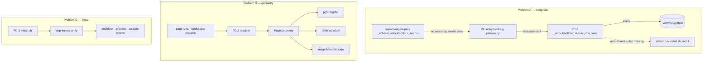
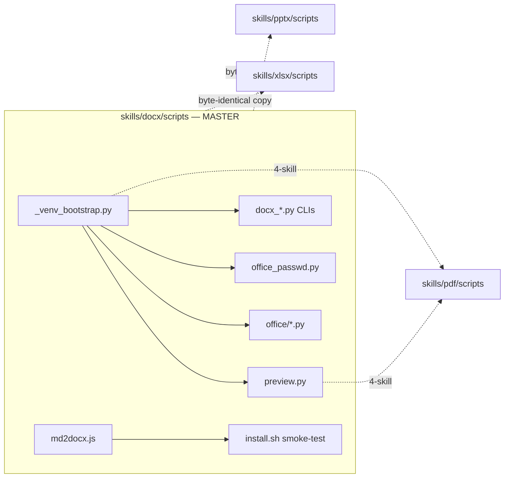

# ARCHITECTURE: docx-skill hardening (TASK 019) — venv self-bootstrap + A4 page geometry + install verify

> Living document, updated **in place** across tasks (architecture-format-core
> §"Living Document & Index-Mode"). It tracks the **current active epic**.
> The prior epic (`pdf_ocr.py` / pdf-4, TASK 018) is complete and **archived**
> (`docs/tasks/task-018-pdf-ocr.md`, `docs/plans/plan-018-pdf-ocr.md`) and preserved
> in git history; this revision refocuses the living doc on TASK 019. No
> `architecture-NNN-*.md` snapshot is created.

---

## 1. Task Description

- **Source:** [`docs/tasks/task-019-docx-skill-hardening.md`](tasks/task-019-docx-skill-hardening.md) (TASK 019, slug `docx-skill-hardening`; archived on completion, plan at [`docs/plans/plan-019-docx-skill-hardening.md`](plans/plan-019-docx-skill-hardening.md)) ←
  [`docs/docx-skill-improvement-spec.md`](docx-skill-improvement-spec.md).
- **Summary:** three independent fixes to the `docx` skill, surfaced by a real
  md+Mermaid → A4 task:
  - **(A, P0)** Python CLIs crash with `ModuleNotFoundError` when the shell's
    `python3` is not the skill's `.venv` — fix via a **stdlib-only self-bootstrap
    prelude** that re-execs each CLI into its own `.venv`.
  - **(B, P1)** `md2docx.js` is hard-wired to US Letter — add `--page-size`/
    `--landscape`/`--margins` and **derive all geometry** (`contentWidthDxa`, image/
    Mermaid caps) from the resolved page, not Letter constants.
  - **(C, P2)** `install.sh` exits "OK" while leaving a non-working `python3`
    contract — add a **smoke-test + dependency-import verify** using the exact
    command `SKILL.md` prescribes.
- **Replication reality (CLAUDE.md §2):** the (A) fix edits **shared/replicated**
  files (`preview.py`, the new `_venv_bootstrap.py`, `office/*`, `office_passwd.py`),
  so this is a **multi-skill** change by force of the byte-identity rule, even though
  the spec is docx-centric. §9 is the load-bearing section.
- **Locked decisions (resolve TASK OQ-1…4):** D-A2 (wire CLI entrypoints only,
  exclude import-only helpers), D-A3 (px = dxa/15; geometry from page), D-A4
  (`SKILL.md` keeps `python3` + auto-bootstrap note), D-A5 (replication tiers),
  D-A6 (defer non-docx per-skill CLI wiring), D-A7 (margins grammar). See §12.
- **Template:** Core (architecture-format-core) — "adding components to an existing
  system." Interfaces / Security / Replication / Decision-Record subsections are
  inlined because the CLI contract, the re-exec safety surface, and the cross-skill
  replication boundary are materially load-bearing.

---

## 2. Functional Architecture

Three independent functional units, no shared runtime state. Data-first: the central
data structure is **`PageGeometry`** (§4.1) — everything in Problem B derives from it;
the central control structure is the **bootstrap decision** (§4.2).

### 2.1. Functional Components

**FC-1 — venv self-bootstrap prelude** (`scripts/_venv_bootstrap.py`, **new**, 4-skill)
- **Purpose:** make `python3 scripts/X.py` behave identically to
  `./.venv/bin/python scripts/X.py` on any host (fixes Problem A); fail *legibly*
  when the venv is absent.
- **Functions:**
  - `reexec_into_venv(requires: tuple[str, ...] = ()) -> None`
    - Input: the caller's required top-level module names (e.g. `("PIL",)`).
    - Output: **none on the happy path** — either `os.execv`-replaces the process
      with the venv interpreter (same `sys.argv`), returns (already in venv / venv
      absent-but-deps-present), or `sys.exit(1)` with a remediation line.
    - Related UC: UC-1, UC-3.
- **Algorithm (stdlib only — `os`, `sys`, `importlib.util`):**
  1. Resolve the skill's `scripts/` root from `__file__` (probe `.venv`/`install.sh` at
     `dirname(__file__)` and its parent — handles `scripts/*.py` AND `scripts/office/*.py`);
     `venv_py = <root>/.venv/bin/python`.
  2. **Consume** the loop-guard env flag first (`os.environ.pop` — read-and-clear, so it
     can never leak to a child process; SEC-1 fix). If `venv_py` exists: compute
     **`in_venv = realpath(sys.prefix) == realpath(<root>/.venv)`**. If **not** `in_venv`
     and the flag was not already set: re-set the flag, then
     `os.execv(venv_py, [venv_py, *sys.argv])`. Else `return`.
     - ⚠ **`sys.prefix`, NOT `realpath(sys.executable)`** (verified deviation from the spec's
       pseudocode, 2026-06-05). A venv's `bin/python` is frequently a *symlink to the same
       base binary* — on this host `realpath(base python3)` and `realpath(.venv/bin/python)`
       are byte-identical (`…/pyenv/3.14.4/bin/python3.14`), so the spec's
       `realpath(sys.executable) != realpath(venv_py)` is **False under base python3 and the
       re-exec never fires**. `sys.prefix` equals the venv root only when the venv interpreter
       is actually running, so it is the correct discriminator. *(D-A1 updated.)*
  3. Else (venv absent): for each `m in requires`, if `importlib.util.find_spec(m)`
     is `None` → print `dependencies missing (<m…>) — run: bash <root>/install.sh` to
     stderr and `raise SystemExit(1)`; otherwise `return` (deps somehow present).
- **Dependencies:** Python stdlib only (must import under *any* interpreter).
- **Consumers:** the CLI entrypoints in FC-1b (NOT the import-only helpers).

**FC-1b — entrypoint wiring** (per-file, 1-line prelude)
- **Purpose:** invoke FC-1 as the **first executable statement**, before any heavy
  third-party import, in every **CLI entrypoint** (file with `if __name__ ==
  "__main__"`): `preview.py`, `office/{unpack,pack,validate}.py`, `office_passwd.py`,
  `docx_accept_changes.py`, `docx_add_comment.py`, `docx_fill_template.py`,
  `docx_merge.py`, `docx_replace.py`.
- **Excluded (D-A2):** pure import-only helpers (`_actions.py`, `_relocator.py`,
  `docx_anchor.py`, `office/_macros.py`) — they have **no `__main__`** and are always
  imported by an already-bootstrapped entrypoint, so a re-exec/`exit` at *import*
  scope would be a hazard, not a fix.
- **office/ path note (BLOCKER fix — verified `unpack.py:29-40`).** The existing
  heavy imports (`unpack.py:29-30` `defusedxml`/`lxml`; `pack.py:30` `lxml`;
  `validate.py` via the `office.validators.*` chain) run **before** the existing
  `__package__`-guarded `sys.path.insert` at `unpack.py:32-40`. Therefore each
  `office/*.py` entrypoint needs a **new, unconditional 3-line prelude at the very top
  (above line 29)** — it must NOT reuse or depend on the existing guarded insert:
  ```python
  import os, sys
  sys.path.insert(0, os.path.dirname(os.path.dirname(os.path.abspath(__file__))))  # scripts/
  import _venv_bootstrap; _venv_bootstrap.reexec_into_venv(requires=("lxml",))     # then heavy imports
  ```
  Note the prelude re-runs once after `os.execv` (the re-exec restarts the module from
  the top under the venv interpreter) — harmless (the second pass takes the `proceed`
  branch); the Developer must not "optimize away" the second `sys.path` insert.

**FC-2 — page-geometry resolver** (`scripts/md2docx.js`, docx-only)
- **Purpose:** turn CLI flags into a `PageGeometry` and thread it through every
  size-bearing construct (section `pgSz`/`pgMar`, table `colWidth`, image/Mermaid
  caps) — replacing the Letter constants (`9360`, `620`, `800`, `12240×15840`).
- **Functions:**
  - parse `--page-size`/`--landscape`/`--margins` (extend `md2docx.js:9-21`).
    - Output: `{pageW, pageH, marginT/R/B/L}`; unknown/malformed → `exit 1` + usage.
    - Related UC: UC-2.
  - derive `PageGeometry` (§4.1): `contentWidthDxa`, `maxWidthPx`, `maxHeightPx`.
  - apply: `contentWidthDxa` → table width/colWidth (`:233,261`); `maxWidthPx/
    maxHeightPx` → `buildImageRun` (`:82-89`) + Mermaid (`:278-284`); `{pageW,pageH}`
    + margins → section `page` (`:343-346`).
    - Related UC: UC-2, UC-6.
- **Dependencies:** `docx-js`, `marked`, `image-size` (existing).

**FC-3 — install verifier** (`scripts/install.sh`, docx-only)
- **Purpose:** prove the documented invocation works before the agent's first call.
- **Functions:**
  - dep-import verify: after `pip install`, assert each `requirements.txt` wheel imports
    in the venv (all five: `PIL`/`lxml`/`defusedxml`/`docx`/`msoffcrypto`); any miss →
    `die` naming the package (SEC/logic vdd-multi widened this from 3 to 5).
  - smoke-test: in a `mktemp -d` scratch, `md2docx.js fixture-simple.md` →
    `preview.py` + `office/validate.py` (the SKILL.md commands); non-zero/
    `ModuleNotFoundError` → `die`; clean up scratch on exit.
    - Related UC: UC-4.
- **Dependencies:** node + the freshly-built venv; `set -euo pipefail` intact.

**FC-4 — docs reconciliation** (`SKILL.md`, `references/docx-js-gotchas.md`, docx-only)
- **Purpose:** make the written contract match the code (D1/D2/D3). Align the
  invocation form (D-A4), advertise the page-size flags, and fix the false
  `--size letter` claim (`gotchas.md:27`).

### 2.2. Functional Components Diagram



---

## 3. System Architecture

### 3.1. Architectural Style

**Self-bootstrapping CLI prelude + parametric generator + verifying installer** —
three small, independent, layered changes. No new service, no new package, no new
runtime coupling. The defining constraint is **per-skill isolation** (CLAUDE.md §2):
the bootstrap helper must be *position-independent* (resolve its venv from `__file__`)
so the **same source bytes** are correct in docx/xlsx/pptx/pdf.

**Justification (YAGNI).** Problem A is solved by a ~25-line stdlib prelude, not a
launcher or a console-entrypoint packaging rework. Problem B is a parametrisation of
existing constants, not a layout engine. Problem C is a bash smoke-test, not a CI
framework. Each maximises the "each skill installable/runnable in isolation" property.

### 3.2. System Components

| Component | Type | Purpose | Tech | Interfaces (in/out) | Replication |
|---|---|---|---|---|---|
| `scripts/_venv_bootstrap.py` | **new** helper | re-exec into `.venv`; legible fail | Python stdlib | in: `requires`; out: execv / return / exit 1 | **4-skill** (docx→xlsx,pptx,pdf) |
| `scripts/preview.py` | CLI | + bootstrap prelude | Python | in: argv; out: PNG grid | **4-skill** |
| `scripts/office/{unpack,pack,validate}.py` | CLI | + bootstrap prelude | Python | in: argv; out: tree/docx/report | **3-skill** (docx→xlsx,pptx) |
| `scripts/office/_macros.py` | helper | (no bootstrap — import-only) | Python | imported | **3-skill** |
| `scripts/office_passwd.py` | CLI | + bootstrap prelude | Python | in: argv; out: docx | **3-skill** |
| `scripts/docx_{accept_changes,add_comment,fill_template,merge,replace}.py` | CLI | + bootstrap prelude | Python | in: argv; out: docx | docx-only |
| `scripts/{_actions,_relocator,docx_anchor}.py` | helper | (no bootstrap — import-only) | Python | imported | docx-only |
| `scripts/md2docx.js` | CLI | page-size flags + derived geometry | Node | in: argv+md; out: docx | docx-only |
| `scripts/install.sh` | bootstrap | dep-verify + smoke-test | bash | host probe + verify | docx-only |
| `SKILL.md`, `references/docx-js-gotchas.md` | docs | reconcile contract | md | — | docx-only |
| `scripts/tests/` | tests | A4/bootstrap/Letter/import-chain | Python+sh | — | docx-only |

### 3.3. Components Diagram



---

## 4. Data Model (Conceptual)

Both fixes are stateless; "data" = two derived records and a set of invariants.

### 4.1. `PageGeometry` (the crux of Problem B — derive, never hard-code)

| Field | Type | Source | Notes |
|---|---|---|---|
| `pageW`, `pageH` | int (dxa) | `--page-size` (+ `--landscape` swap) | Letter `12240×15840` (default); A4 `11906×16838` |
| `marginT/R/B/L` | int (dxa) | `--margins` (default `1440`) | optional `mm` suffix → `round(mm × 56.7)` |
| `contentWidthDxa` | int (dxa) | **derived** `pageW − marginL − marginR` | replaces hard-coded `9360`; A4 default ⇒ **9026** |
| `maxWidthPx` | int (px) | **derived** `floor(contentWidthDxa / 15)` | 1 dxa = 635 EMU, 1 px = 9525 EMU ⇒ px = dxa/15 (Letter 9360⇒624 ≈ current 620) |
| `maxHeightPx` | int (px) | **derived** `floor((pageH − marginT − marginB) / 15)` | replaces hard-coded `800` (Letter usable 12960 dxa ⇒ 864) |

**Reference table (portrait, dxa):** Letter `12240×15840`; A4 `11906×16838`.
**Business rule:** every size-bearing emit (`pgSz`, `pgMar`, table `width`/`colWidth`,
image & Mermaid `transformation`) reads from this record — there is **no** surviving
Letter literal on any geometry path (B4(a)…(e)).

### 4.2. `BootstrapContext` (Problem A control record — conceptual)

| Field | Type | Notes |
|---|---|---|
| `venv_py` | path | `<owning scripts/>/.venv/bin/python`, from `__file__` |
| `current` | path | `realpath(sys.executable)` |
| `requires` | tuple[str] | caller's heavy top-level modules (e.g. `("PIL",)`, `("defusedxml","lxml")`) |
| `action` | enum | `reexec` (venv≠current, exists) / `proceed` (already venv) / `fail` (no venv + dep missing) |

### 4.3. Derived invariants

- **I-1 (idempotent re-exec):** after a re-exec the venv interpreter runs, so
  `sys.prefix == <root>/.venv` → the `proceed` branch (no second exec). A
  **loop-guard env sentinel** (`_VENV_BOOTSTRAP_REEXEC=1`, set just before `execv`)
  additionally bounds a pathological venv (dir present but `pyvenv.cfg` broken, which
  would leave `sys.prefix` unchanged) to at most **one** re-exec **per process** (TASK
  A4d, UC-1/A3). The sentinel is **consumed (popped) on entry** (SEC-1), so it is a
  per-process guard that never propagates to a child — a Python-of-Python child
  bootstraps itself afresh rather than silently inheriting "already re-exec'd".
- **I-2 (byte-identity safe):** the `scripts/` root (hence `.venv`) derives from
  `__file__`, never a skill name, so the replicated copy resolves the *calling* skill's
  `.venv` (TASK A5; §9). Verified: probe under base `python3` re-execs into the **docx**
  `scripts/.venv`; the same bytes in xlsx/pptx/pdf resolve their own.
- **I-3 (Letter backward-compat — geometry-equivalent, not byte-identical):** with no
  flags, the **load-bearing** invariants are exactly the pre-task values — `pgSz =
  12240×15840` and `contentWidthDxa = 9360` — so `docx_replace.py --insert-after`
  (calls `md2docx.js` flag-free, verified `_actions.py:204-217`) and every table layout
  is unaffected. The image/Mermaid caps change from the old **hardcoded 620/800** to the
  **geometrically-exact derived 624/864** (9360/15, 12960/15) — a ≤4 px difference,
  strictly *within* the content width, so it can never cause overflow. The Letter
  regression test (F1d) therefore asserts the exact invariants **`pgSz` + `contentWidthDxa`**,
  and treats the ≤4 px cap correction as intended (the old literals were conservative
  approximations of the true content width). UC-6/DoD-6 are "geometry-equivalent," not
  "byte-for-byte" (TASK updated).

---

## 5. Interfaces

### 5.1. `md2docx.js` public CLI (Problem B)

```text
node md2docx.js IN.md OUT.docx
     [--header TEXT] [--footer TEXT]          # existing
     [--page-size A4|Letter]                  # default Letter (backward-compat)
     [--landscape]                            # swap width/height
     [--margins T,R,B,L]                      # dxa; per-value optional 'mm' suffix
```

- `--page-size A4` ⇒ `<w:pgSz w:w="11906" w:h="16838"/>`; Letter unchanged.
- `--landscape` ⇒ swaps **`pageW ↔ pageH` only** (`<w:pgSz>` dims; `w:orient` attr
  optional, non-load-bearing). Margins are applied **as-authored** to the swapped page
  (top stays top); `maxWidthPx`/`maxHeightPx` recompute from the **post-swap** geometry.
- `--margins` ⇒ `<w:pgMar w:top/right/bottom/left>`.
- **Arg-loop change (MINOR #7):** the existing loop (`md2docx.js:13-21`) silently pushes
  unrecognised tokens into `positional[]` — so a typo (`--page-sizes A4`) would currently
  be mis-read as `outputFile`. The new parser MUST **reject unknown `--`-prefixed flags**
  with a non-zero exit + usage. Malformed `--margins`/unknown `--page-size` likewise exit
  non-zero (parity with the `!inputFile||!outputFile` exit-1 path, `md2docx.js:25-28`).

### 5.2. `_venv_bootstrap` API (Problem A)

```python
# first executable line of every CLI entrypoint, before heavy imports:
import _venv_bootstrap; _venv_bootstrap.reexec_into_venv(requires=("PIL",))
```

`requires` names only the **third-party top-level module whose absence is the
diagnostic signal** (not an exhaustive set, and not first-party `office.*` helpers).
Per-entrypoint, matched to the file's actual top imports (verified):
`preview.py`→`("PIL",)`; `office/unpack.py`→`("defusedxml","lxml")`;
`office/pack.py`→`("lxml",)` (lxml-only, no defusedxml); `office/validate.py`→`("lxml",)`
(a **proxy** for the `office.validators.*` chain — lxml is its first failing third-party
import); `office_passwd.py`→`("msoffcrypto",)` (lazy import at `:78`, but it is the real dep);
`docx_add_comment.py`/`docx_fill_template.py`/`docx_merge.py`→`("docx",)` (top-level
`docx`); `docx_replace.py`/`docx_accept_changes.py`→`("lxml",)` (**no** heavy top import —
`lxml` pulled transitively via `_actions`/`office.*`/`office._macros`). **Derivation rule:**
name the third-party module the entrypoint needs first, directly or transitively (it only
shapes the venv-absent diagnostic; the re-exec is unconditional). Identical `requires`
across a replicated file's copies ⇒ byte-identity holds (the list is content, not
skill-specific).

### 5.3. `install.sh` smoke-test contract (Problem C)

Appended after the existing npm install (`install.sh:150`). Fixture
`examples/fixture-simple.md` (**verified present**). Runs the **SKILL.md** commands in a
`mktemp -d`; `die` on any non-zero / `ModuleNotFoundError`; `trap`-clean the scratch.
**Deliberately invokes bare `python3 scripts/preview.py …`** (NOT `./.venv/bin/python`)
— on a host where `python3 ≠ .venv`, this bare-`python3` smoke-test *is* the proof that
fix A works (UC-4); using the venv interpreter directly would mask the very bug it must
catch. Exit 0 ⇒ the documented path is proven end-to-end.

### 5.4. SKILL.md / gotchas invocation contract (D-A4, Problem D)

`SKILL.md` retains `python3 scripts/X.py` (readable, now safe via FC-1) and adds a
§7.2 one-liner: *"Python CLIs self-bootstrap into `scripts/.venv`; bare `python3` and
`./.venv/bin/python` are equivalent."* `install.sh` hints stay as-is — the two no
longer conflict. §4/§10 gain the page-size flags. `gotchas.md:27` `--size letter` →
`--page-size`.

---

## 6. Technology Stack

| Layer | Choice | Notes |
|---|---|---|
| Bootstrap | Python **stdlib only** (`os`, `sys`, `importlib.util`) | must import under any interpreter; no third-party |
| Generator | Node `docx-js` + `marked` + `image-size` | existing; only constants parametrised |
| Installer | bash (`set -euo pipefail`) + `mktemp` | smoke-test scratch isolated + trap-cleaned |
| Tests | `unittest` (per-skill `.venv`) + shell | run via `./.venv/bin/python -m unittest` |

`requirements.txt` / `package.json` are **unchanged** (no new dependency).

---

## 7. Security

Trust model inherited: single-tenant, operator-supplied input; local CLI, no network.

- **S-1 Re-exec safety.** `os.execv(venv_py, [venv_py, *sys.argv])` — **no shell**, no
  string interpolation; argv passed as a list. `venv_py` is a fixed path derived from
  `__file__`, not from env/argv, so it is not attacker-influenceable. The `sys.prefix`
  detection + env-sentinel loop guard bound it to a single exec (I-1) — no fork-bomb /
  exec loop.
- **S-2 No new attack surface.** Bootstrap touches only process image + stderr; the
  page-size flags only widen existing numeric constants; the installer smoke-test runs
  the skill's own commands on its own fixture in a private `mktemp` dir.
- **S-3 venv-path integrity.** Deriving from `__file__` (not `$VIRTUAL_ENV`/`$PATH`)
  avoids hijack via a planted env var; if `.venv` is absent we fail closed (exit 1),
  never silently fall through to an arbitrary interpreter.
- **S-4 No AuthN/AuthZ.** N/A — local single-user tooling (unchanged).

---

## 8. Scalability & Performance

- Re-exec adds one `execv` (a few ms) only on the wrong-interpreter path; **zero**
  overhead when already in venv (the common case). No per-call import cost beyond the
  stdlib helper.
- Geometry change is constant-time arithmetic; no effect on generation cost.

---

## 9. Cross-Skill Replication Boundary (CLAUDE.md §2 — load-bearing)

This task **does** trigger replication (unlike pdf-4). docx is the **only** edited
master; copies are byte-identical.

| Master (docx) | Tier | Replicate to | Gate (must be silent) |
|---|---|---|---|
| `scripts/_venv_bootstrap.py` (**new**) | 4-skill | xlsx, pptx, pdf | `diff -q` ×3 |
| `scripts/preview.py` | 4-skill | xlsx, pptx, pdf | `diff -q` ×3 |
| `scripts/office/` (unpack, pack, validate, _macros, …) | 3-skill | xlsx, pptx | `diff -qr office` ×2 |
| `scripts/office_passwd.py` | 3-skill | xlsx, pptx | `diff -q` ×2 |
| `md2docx.js`, `install.sh`, `SKILL.md`, `gotchas.md`, `docx_*.py` | docx-only | — | — |

**Protocol (CLAUDE.md §2, per shared edit, same commit):** edit docx master → run
docx tests → `cp`/`cp -R` to targets → clean `__pycache__` → `diff`/`diff -qr` silent
→ `validate_skill.py` exit 0 for **all four** skills → each target's E2E/unit suite
green. **Never** edit an xlsx/pptx/pdf copy directly; **never** replicate xlsx→docx.

**Why a new shared file is safe.** `_venv_bootstrap.py` resolves its venv from
`__file__` (I-2), so the byte-identical copy in xlsx/pptx/pdf finds *that* skill's
`scripts/.venv`. Confirmed targets exist (xlsx/pptx/pdf have `preview.py`+`install.sh`;
xlsx/pptx have `office/`+`office_passwd.py`) and are byte-identical *today* — so adding
the prelude to docx masters and replicating preserves identity.

**Free side-benefit:** xlsx/pptx/pdf `preview.py` and xlsx/pptx `office/*`+`office_passwd.py`
gain self-bootstrap automatically (their CLIs already `__main__`-gate). Their *own*
per-skill CLIs (`xlsx_*`, `pptx_*`, `pdf_*`) are **not** wired here — D-A6.

---

## 10. Honest Scope (v1)

- **Default stays US Letter** (compat, §4.3 I-3). A4 + Letter only — no A3/legal/custom
  named sizes (custom geometry achievable via `--margins`, not arbitrary `pgSz`).
- **Non-docx per-skill CLIs not wired** (D-A6 / TASK OQ-1). After replication,
  xlsx/pptx/pdf ship `_venv_bootstrap.py` and self-bootstrapping `preview`/`office`,
  but `xlsx_*.py`/`pptx_*.py`/`pdf_*.py` still call deps directly — a documented,
  deferrable follow-up, not a regression (the spec's pain was docx).
- **Bootstrap is best-effort when venv is absent:** it fails *legibly* only for the
  modules a CLI declares in `requires`; it does not enumerate the full dependency set.
- **`--landscape` orientation attribute** (`w:orient`) is optional cosmetic; the
  load-bearing effect is the swapped `pgSz` dimensions.
- No re-architecture of install structure; no new runtime dependency.

---

## 11. Atomic-Chain Skeleton (Planner handoff — Stub-First)

Proposed beads for `/vdd-plan`. **Replication is in-bead** (CLAUDE.md "same commit"):
any bead that edits a replicated master replicates + gates at its own close — never a
separate "replication bead".

| Bead | Scope (RTM) | Stub-First role |
|---|---|---|
| **019-01** | FC-1 `_venv_bootstrap.py` helper (re-exec + friendly-fail) + RED tests (self-bootstrap, venv-absent, import-chain idempotency) | STUB + tests (Red) |
| **019-02** | FC-1b wire bootstrap into docx CLI entrypoints (exclude import-only helpers) + **4/3-skill replication** of `_venv_bootstrap.py`/`preview.py`/`office/*`/`office_passwd.py` + `diff` gates + 4× `validate_skill`. **Exit-gate (CLAUDE.md §2, not mechanical `cp`):** after replication, each target skill's E2E/unit suite (xlsx, pptx, pdf) must pass — bead is not "done" until docx **and** all replicate-target suites are green | LOGIC (Green) — Problem A done |
| **019-03** | FC-2 `md2docx.js` flags + `PageGeometry` derivation + tests (A4 pgSz, no-overflow, landscape, margins, **Letter regression**) | LOGIC (Green) — Problem B done |
| **019-04** | FC-3 `install.sh` dep-verify + smoke-test | LOGIC (Green) — Problem C done |
| **019-05** | FC-4 docs: `SKILL.md` (invocation note + page-size flags) + `gotchas.md` (`--size`→`--page-size`) | DOC |
| **019-06** | Dogfood on `tmp7/` (one-command A4, golden parity) + promote `examples/fixture-mermaid-a4.md` + backlog `docx-9` → done | INTEGRATION + DOC |

MVP gate = 019-01…04 (the headline scenario passes with zero workarounds). **C2
(dep-import verify) is promoted to MVP** inside bead 019-04 — it is ~5 lines of bash and
directly addresses the spec §4 Python-3.14 silent-wheel-failure pain (TASK RTM updated
C2 ⬜→✅). The **only** remaining ⬜ non-MVP item is 019-06 F3 (fixture promotion).

**Status (as-built, 2026-06-05):** **all 6 beads shipped + verified.** Key as-built
deviation from the spec: the re-exec guard keys on **`sys.prefix`**, not
`realpath(sys.executable)` — the spec's pseudocode is broken on a pyenv symlink-venv
(verified empirically; see §2.1 FC-1 ⚠ note). `/vdd-multi` adversarial pass (4 critics,
38 agents) **CONVERGED**: 18 INFO-level positive confirmations of the design (sys.prefix
fix, position-independence, byte-identity, backward-compat, XXE, smoke-test) + 2 actionable
MEDIUM fixed in `md2docx.js` (flag-missing-value diagnostic; oversized-margins guard, +2
tests). One pre-existing Mermaid `execSync` item deferred to `KNOWN_ISSUES.md`
(out-of-scope per spec §6). A **second `/vdd-multi`** (user-invoked completeness + regression
pass) reconfirmed all DoD-1..9 against code and fixed 2 more LOW items: **SEC-1** (consume the
loop-guard sentinel so it cannot leak to a Python-of-Python grandchild — §4.3 I-1; proven with
a parent→child probe + regression test) and the dep-verify widening to 5 wheels (§2.1 FC-3). It
also surfaced one **pre-existing, unrelated** xlsx test failure (`XLSX-PREVIEW-PNG-ASSERT`,
proven not-a-regression via `git diff` → `KNOWN_ISSUES.md`). Final gates: docx **190** unit + 52
office + 153 E2E, xlsx **513/514** (the 1 fail is the pre-existing item), pptx 52 office, pdf
284 — all green; `diff` matrix silent; `validate_skill` ×4 PASS; install smoke PASS; dogfood
golden-parity on the real document.

---

## 12. Decision-Record Summary

- **D-A1 (bootstrap signature).** `reexec_into_venv(requires=())` — a single
  stdlib-only helper; `requires` lets each CLI declare its heavy modules so the
  venv-absent path fails legibly (TASK A1/A2). Position-independent (venv from
  `__file__`) for byte-identity (I-2).
- **D-A2 (wire entrypoints only).** Bootstrap goes in files with `__main__`
  (CLI entrypoints) as the first statement; pure import-only helpers
  (`_actions.py`, `_relocator.py`, `docx_anchor.py`, `office/_macros.py`) are
  **excluded** — they inherit the venv from the entrypoint that imports them. Putting
  a re-exec/`exit` at import scope is the hazard this avoids (resolves task-review
  M1/M2; verified none of the four has `__main__`).
- **D-A3 (geometry derivation).** `contentWidthDxa = pageW − marginL − marginR`;
  `maxWidthPx = floor(contentWidthDxa/15)`; `maxHeightPx = floor((pageH − marginT −
  marginB)/15)`. The `/15` factor is exact (635/9525 EMU) and reproduces the current
  Letter caps within 1 px. **No Letter literal survives on any geometry path.**
- **D-A4 (invocation form).** `SKILL.md` keeps `python3 scripts/X.py` (now safe via
  FC-1) + a one-line auto-bootstrap note; `install.sh` hints unchanged. Avoids a
  ~15-line churn to `.venv/bin/python` while satisfying "SKILL.md ↔ install.sh agree"
  (resolves TASK OQ-2).
- **D-A5 (replication tiers).** `_venv_bootstrap.py`+`preview.py` → 4-skill;
  `office/*`+`office_passwd.py` → 3-skill; everything else docx-only (§9). Forced by
  CLAUDE.md §2 byte-identity, not optional.
- **D-A6 (defer non-docx CLI wiring).** Keep this task docx-scoped + atomic; the helper
  lands in all four skills via replication for a fast follow-up (resolves TASK OQ-1).
- **D-A7 (margins grammar).** `--margins T,R,B,L`, all four required, each a dxa
  integer with optional trailing `mm` (`round(mm×56.7)`) (resolves TASK OQ-4).

---

## 13. Open Questions

All TASK open questions are resolved at the architecture layer:

- **OQ-1 (non-docx CLI wiring):** deferred — D-A6. ✅
- **OQ-2 (SKILL.md invocation form):** keep `python3` + note — D-A4. ✅
- **OQ-3 (px-from-dxa factor):** `floor(contentWidthDxa/15)` — D-A3. ✅
- **OQ-4 (`--margins` grammar):** `T,R,B,L` dxa + optional `mm` — D-A7. ✅

No blocking questions remain for the Planning phase.
