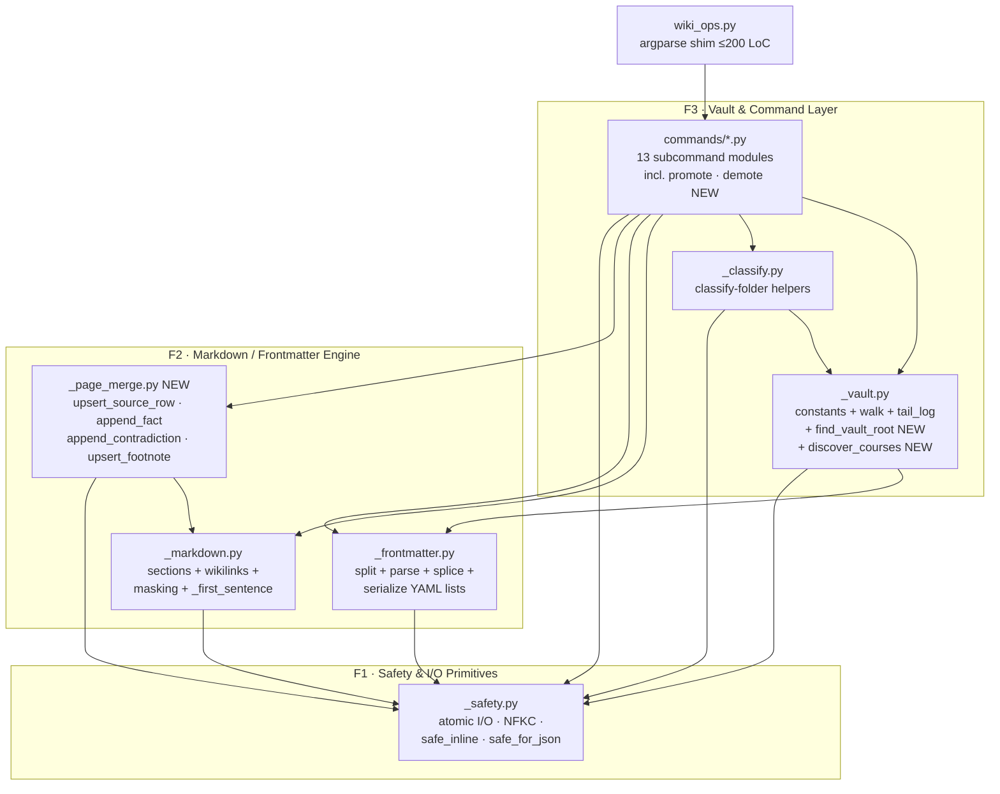
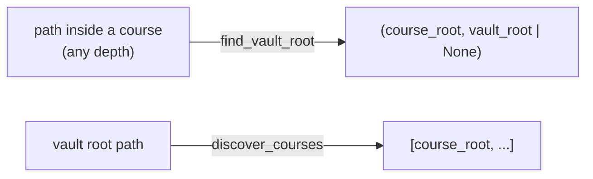
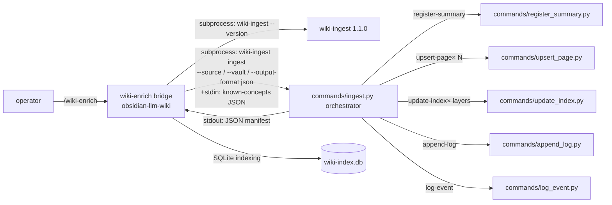
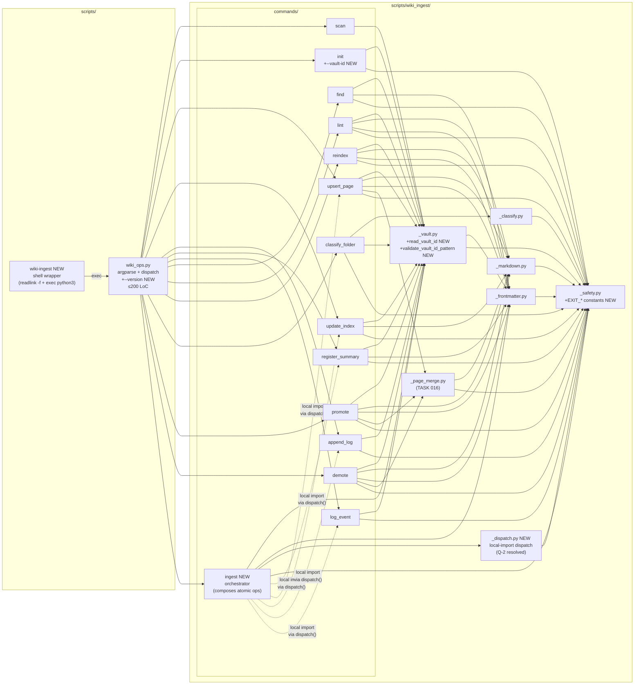

# ARCHITECTURE: wiki-ingest modular refactor + two-tier vault + v1.1 contract

> **Status (2026-05-27): TASK 015 MERGED · TASK 016 MERGED · TASK 017 IN DESIGN.**
>
> TASK 015: All 13 atomic beads (015-00..015-12) shipped; 15 deferred
> KNOWN_ISSUES items resolved in the follow-up pass. See
> [`docs/tasks/task-015-wiki-ingest-modular-refactor.md`](tasks/task-015-wiki-ingest-modular-refactor.md)
> and [`docs/plans/plan-015-wiki-ingest-modular-refactor.md`](plans/plan-015-wiki-ingest-modular-refactor.md).
>
> TASK 016 delta: adds the **two-tier vault model** (vault-root shared layer
> vs course-local layer), lazy operator-driven `promote`/`demote` commands,
> two new F3 command modules (`commands/promote.py`, `commands/demote.py`),
> one new F2 helper (`_page_merge.py` — additive-merge primitives extracted
> from `commands/upsert_page.py` to satisfy the import-graph invariant), and
> extensions to five existing commands (`init`, `lint`, `reindex`,
> `upsert_page`, `register_summary`). Single-course vaults with no root
> `WIKI_SCHEMA.md` continue to behave byte-identically to v1 (backwards
> compatibility load-bearing).
>
> **TASK 017 delta**: aligns the skill with the external
> [`obsidian-llm-wiki/docs/WIKI-INGEST-V1.1-CONTRACT.md`](../../obsidian-llm-wiki/docs/WIKI-INGEST-V1.1-CONTRACT.md)
> consumed by the index-layer `/wiki-enrich` bridge. Surface adds: a `wiki-ingest`
> shell wrapper on `PATH`, top-level `--version` flag (`__version__ = "1.1.0"`),
> a new `commands/ingest.py` orchestrator that composes the existing atomic
> ops (`register-summary` → `upsert-page` → `update-index` → `append-log` →
> `log-event`) and emits a stable JSON manifest on stdout, opt-in `vault_id`
> validation in `_vault.py`, an extended exit-code matrix (0..9), and a new
> internal F2/F3-boundary helper `_dispatch.py` (Open Q-2 resolved in this
> architecture, see §3.2). NO change to existing atomic-op CLIs; v1.0 callers
> see byte-identical behaviour when they do not pass `--vault-id` and do not
> invoke the `ingest` subcommand.
>
> This document is the source of truth for the wiki-ingest internal layout.
> Future maintainers editing the skill must keep it in sync with the code.

---

## 1. Task Description

See archived [`docs/tasks/task-015-wiki-ingest-modular-refactor.md`](tasks/task-015-wiki-ingest-modular-refactor.md)
for the full TASK 015 specification.

**One-liner (delivered)**: split `skills/wiki-ingest/scripts/wiki_ops.py`
(was 2661 LoC, **now 69 LoC**) into a `wiki_ingest/` Python package
alongside it, with strict module boundaries and a ≤200-LoC argparse shim.
**Zero behavioural change to the CLI** (locked by R11 byte-identity gate).
Each subcommand became its own module; cross-cutting helpers form five
domain modules with a documented one-way dependency graph.

**Why we did it**: three VDD passes had grown the file faster than its
structure absorbed; per-module unit tests, future critic loops, and
feature additions are now well-isolated. **Outcome**: 138 tests across
16 files, both validators green, R9 cross-skill matrix silent.

---

## 2. Functional Architecture

### 2.1. Functional Components

The system has **three** functional layers; the refactor renders them as
distinct module groups.

#### F1. Safety & I/O Primitives

**Purpose**: every operation that touches the filesystem or accepts external
data goes through a single hardened layer — atomic writes, size-capped reads,
symlink refusal, NFKC normalisation, sanitised JSON output. These are the
defenses installed during the 2026-05-25 VDD-multi pass and must not regress.

**Functions**:
- `read_text(path, *, follow_symlink=False, max_bytes=MAX_PAGE_BYTES)` — bounded read.
- `write_text(path, content, dry_run)` → `_atomic_write_text` — tempfile + `os.replace` + `flock`.
- `_safe_name(name, kind)` — NFKC normalise + reject path separators, control chars, traversal, template placeholders.
- `_safe_inline(text, field)` — reject newlines + `## ` line-starts + bare `---`.
- `_safe_for_json(value, max_bytes=MAX_VALUE_BYTES)` — strip control chars + cap scalar length.
- `_is_relative_to(child, parent)` — backport-safe containment check.
- `_skip_symlink(path)` — directory-walk filter.
- `_check_case_collision(target_dir, name)` — case-fold + slug-collision check.
- `slugify(text)` — NFKC + Unicode-aware kebab-case.
- `die(msg, code=1)` — fatal error → stderr + exit.

**Inputs**: arbitrary user-supplied strings, filesystem paths.
**Outputs**: validated strings, file descriptors, atomic writes, sanitised JSON-safe values.

**Related Use Cases**: every subcommand (UC-1..UC-3 indirectly).

**Dependencies**: stdlib only (`os`, `tempfile`, `fcntl` on POSIX, `unicodedata`, `re`, `pathlib`, `errno`).

#### F2. Markdown / Frontmatter Engine

**Purpose**: parse + mutate Obsidian-flavour markdown deterministically.
Sections, wiki-links, YAML frontmatter — the three things every wiki op
touches — share one masking pass per page so the engine stays linear-time
even on adversarial inputs.

**Functions** (split across two modules — see §3.2):
- `_mask_code_fences(text)` — offset-preserving mask of fenced code.
- `_mask_inline_constructs(text)` — masks inline backticks + HTML comments.
- `find_section / find_all_sections / get_section_body / replace_section_body / insert_section_before` — all accept an optional pre-computed `masked` view.
- `_existing_lines(body)` — list-item recovery preserving multi-line items.
- `_extract_wikilinks_with_anchors(body, masked=None)` — `{target: {anchors}}` map.
- `_first_sentence(text)` — abbreviation-aware sentence-split, 16 KiB cap.
- `split_frontmatter(content, warnings=None)` — line-anchored YAML closer; surfaces malformed-line warnings.
- `_strip_frontmatter_fast(content)` — cheap body extractor (no parse).
- `_splice_frontmatter_fields(text, fields, fm)` — structural list-field rewrite.

**Inputs**: raw markdown text.
**Outputs**: structured (dict / set / tuple / re-serialised text).

**Related Use Cases**: UC-2 (per-module critic loop); foundational for UC-1 (any new command needs section/frontmatter manipulation).

**Dependencies**: F1 (for `die` only — fatal-error path on guard violations).

#### F3. Vault & Command Layer

**Purpose**: the public-facing CLI surface. Every subcommand reads + mutates
the vault by composing F1 + F2; vault-layout constants and the symlink-
filtering walk live in `_vault.py` so commands share one definition.

**Functions**:
- **Vault helpers** (`_vault.py`): `_walk_pages(vault)`, `load_vault_pages(vault)`, `ensure_schema(vault)`, `load_asset(name)`, `tail_log(vault, n)`.
- **Constants** (`_vault.py`): `DEFAULT_SUBDIRS`, `SUBDIR_TO_KIND`, `SUBDIR_TO_DISPLAY`, `SCHEMA_FILE`, `INDEX_FILE`, `LOG_FILE`.
- **Classify helpers** (`_classify.py`): `_count_md_structure`, `_filename_hint_score`, `_looks_like_wiki_summary`, `_classify_one_file`, `_detect_grouping`, `_group_files`, `_pick_primary`, plus the per-extension/skip/hint tables.
- **Commands** (`commands/*.py`): one file per subcommand — `scan`, `init`, `upsert_page`, `update_index`, `append_log`, `register_summary`, `log_event`, `find`, `lint`, `reindex`, `classify_folder`. Each exposes exactly two public symbols: `register(subparser)` and `execute(args)`.

**Inputs**: parsed `argparse.Namespace`.
**Outputs**: vault-file mutations, JSON-on-stdout reports.

**Related Use Cases**: UC-1 (new command path), UC-3 (E2E smoke).

**Dependencies**: F1 + F2.

### 2.1.bis. TASK 016 additions per layer

#### F1 — no new functions

All path-safety primitives required by TASK 016 (`_is_relative_to`,
`_safe_name`, `_atomic_write_text`, `_skip_symlink`, `die`) already exist.
No new F1 functions are added.

#### F2 — new module `_page_merge.py`

Additive-merge primitives extracted from `commands/upsert_page.py` so that
both `commands/upsert_page.py` and the new `commands/promote.py` can reuse
them without violating the import-graph invariant (M-2 resolution):

- `upsert_source_row(content, source_slug, source_title, source_date) → str`
- `append_fact(content, fact, source_slug) → str`
- `append_contradiction(content, existing_claim, new_fact, source_slug) → str`
- `upsert_footnote(content, source_slug, source_title) → str`

These four functions are lifted verbatim from `commands/upsert_page.py`
(which becomes a thin caller). `_page_merge.py` is an F2-tier module: it
imports from `_markdown` (section ops) and `_safety` (die), but NOT from
`_vault` or any command. The import graph remains strictly hierarchical.

Additionally, `_frontmatter.py` gains internal support for **list-of-dicts**
splice: the existing `_splice_frontmatter_fields` handles flat `list[str]`
fields; `promoted_from:` is `list[{course, date}]`. Rather than adding a
new public function, the helper is extended to detect the list-of-dicts shape
and use a structural rewrite path (the `_serialize_yaml_list_field` fallback
already present). This is an in-module change; the public signature of
`_splice_frontmatter_fields` does not change.

#### F3 helpers — `_vault.py` extensions (M-3 resolution)

R1 is split into TWO helpers as required by M-3:

- `find_vault_root(start: Path) → tuple[Path, Path | None]` — given ANY path
  inside a course directory, walks up until the first `WIKI_SCHEMA.md` (course
  root), then continues walking for a second `WIKI_SCHEMA.md` with
  `schema_version: 2.0` (vault root). Returns `(course_root, vault_root_or_None)`.
  Refuses to cross filesystem boundaries or follow symlinks during the walk
  (M-1 security caveat). Used by ingest-time commands (UC-4 / R8).

- `discover_courses(vault_root: Path) → list[Path]` — given a vault root
  (a directory with a `schema_version: 2.0` schema), walks all descendant
  directories and returns every one that contains a `WIKI_SCHEMA.md` with
  `schema_version: 1.x`. Does NOT hardcode the `Lessons/` segment (Q-8
  resolution): any subdirectory at any depth qualifies. Returns a sorted list
  for deterministic output. **Symlink discipline**: skips symlinked
  directories during the walk (inherits OVERLAP-5 from `_walk_pages`).
  **Nested course schemas**: descends into matched course directories so a
  course-of-courses (e.g. `Lessons/2026/Spring/Hermes/`) is supported — the
  result list is flat and every qualifying descendant appears independently.
  **Same-device boundary not enforced** (only `find_vault_root` enforces
  that, because it walks UP) — courses may live on different mount points
  via deliberate operator setup. Used by `promote`, `demote`, cross-course
  `lint`, root-mode `reindex`.

These two helpers have complementary callers: `find_vault_root` is called by
commands that receive a course path from the user (existing CLI surface, no
`vault_root` argument); `discover_courses` is called by commands that receive
the vault root directly (`promote`, `demote`, cross-course `lint`).

**Byte-identity caveat (M-1 resolution)**: `upsert-page` and `register-summary`
continue to accept the course-root `vault` positional argument unchanged. They
internally call `find_vault_root(vault)` to discover an optional vault root.
On single-course vaults (no root `WIKI_SCHEMA.md`), `vault_root=None` and the
code path is byte-identical to v1 (enforced by TASK 015 R11 fixtures, plus the
new `two_course_vault` fixture variant with `root_schema=None`). **Byte-identity
holds only when no root `WIKI_SCHEMA.md` is present** — with a root schema,
R8 demonstrably changes `upsert-page` behaviour (lookups land on the root page).
This is correct and expected; R11 fixtures test single-course (no root) only.

**Vault-relative footnote form (A-M-2 resolution)**: when promote / demote /
root-aware upsert rewrite a footnote definition to vault-relative form, the
path prefix is computed as `course_root.relative_to(vault_root)` — NOT the
literal substring `Lessons/<Course>/`. The form is
`[^src-<slug>]: [[<course_rel>/_sources/<slug>]] — <Title>`, where
`<course_rel>` is whatever directory the source's owning course actually
sits at relative to the vault root. The R6.4 lint check (root-page
footnote-format) likewise validates the prefix against
`{c.relative_to(vault_root) for c in discover_courses(vault_root)}`,
not against a literal `Lessons/` prefix. `Lessons/` appears only in example
JSON in §4.5 because the spec's running example uses that convention; it
is not part of the contract.

#### F3 commands — two new modules

- `commands/promote.py` (≤400 LoC) — `promote <Name>` with `--dry-run` default
  (R4), `--apply`, `--kind`, `--vault`. Dry-run is default (Q-2 locked).
- `commands/demote.py` (≤300 LoC) — `demote <Name> --to <Course>` with
  `--dry-run` available but NOT default (Q-2b locked). `--vault`, optional
  `--kind`.

Both commands import from `_safety`, `_markdown`, `_frontmatter`, `_vault`,
and `_page_merge`. Neither imports any other `commands/*.py` module (R12.5 +
`test_architecture.py` invariant preserved).

#### F3 commands — five extended modules

| Command           | Extension summary                                                                          |
|-------------------|--------------------------------------------------------------------------------------------|
| `init.py`         | Gains `--root` flag (Q-1 locked: `init <vault> --root`, not a new subcommand). Writes vault-root scaffold: `WIKI_SCHEMA.md` (from `WIKI_SCHEMA.root.template.md`), `_concepts/`, `_entities/`, optional `index.md`. Idempotent; never overwrites. |
| `lint.py`         | Gains cross-course duplicate scan + invariant check (`cross_course_duplicate`, `invariant_violation`). Dangling-link logic updated: course→root resolves (not dangling); course→other-course is dangling. Root-page footnote-format check (warning). |
| `reindex.py`      | Gains `## Shared * referenced` section for course-mode reindex; root-mode reindex (schema_version 2.0 auto-detection per M-4); `--cascade` flag for root mode. |
| `upsert_page.py`  | Calls `find_vault_root`; root-aware lookup (R8.1); vault-relative footnote form on root pages (R8.2); log marker for shared merge target (R8.3). Primitives (`upsert_source_row` etc.) delegated to `_page_merge.py`. |
| `register_summary.py` | Root-aware via `upsert_page.execute` path (no direct change to `register_summary` logic beyond the `upsert_page` delegation). |

### 2.2. Functional Components Diagram



**Dependency rule (one-way only)**: F3 → F2 → F1. No back-edges. Commands
may import any F1/F2/F3-helper module but **never** another command.
`_page_merge.py` is F2: it imports `_markdown` + `_safety` only.

---

## 2.3. Two-Tier Vault Model (TASK 016)

### Vault layout

```
<vault>/                                   # Obsidian vault root
├── WIKI_SCHEMA.md                         # schema_version: 2.0  kind: vault-root
├── _concepts/                             # shared concepts (lazy — empty until first promote)
├── _entities/                             # shared entities (lazy)
├── index.md                               # optional root catalog (created on first promote)
└── Lessons/                               # or any other directory name — NOT hardcoded
    ├── Course A/                          # course-local layer
    │   ├── WIKI_SCHEMA.md                 # schema_version: 1.x
    │   ├── _sources/  _concepts/  _entities/  index.md  log.md
    └── Course B/                          # same
```

Single-course vaults (no vault-root `WIKI_SCHEMA.md`) are unaffected — all
commands detect `vault_root=None` and behave exactly as v1. The root layer is
bootstrapped via `init <vault> --root` (R2).

### One-page-one-place invariant

A given canonical filename (`Sharpe Score.md`) MUST live in exactly ONE of:
- some course's `_concepts/` or `_entities/`, OR
- the vault root's `_concepts/` or `_entities/`.

Never both. This invariant is load-bearing for Obsidian's filename-based
`[[wiki-link]]` resolution. `lint` enforces it (`invariant_violation` finding,
hard failure / non-zero exit). `promote` and `demote` maintain it transactionally.

### Discovery algorithm



`find_vault_root(start)`:
1. Walk up from `start` until a `WIKI_SCHEMA.md` is found → `course_root`.
2. Continue walking from `course_root.parent` until another `WIKI_SCHEMA.md`
   with `schema_version: 2.0` is found → `vault_root`. If none found → `None`.
3. Refuse to cross filesystem device boundary (symlink-loop protection).

`discover_courses(vault_root)`:
1. Walk ALL descendants of `vault_root` (any depth).
2. For each directory containing a `WIKI_SCHEMA.md` with `schema_version: 1.x`
   that is NOT the vault root itself → add to result list.
3. Return sorted list (deterministic for lint/reindex).

### Link resolution order (v2)

For a `[[Foo]]` reference from within a course:
1. `<course>/_concepts/Foo.md` — course-local concept
2. `<course>/_entities/Foo.md` — course-local entity
3. `<vault>/_concepts/Foo.md` — shared root concept
4. `<vault>/_entities/Foo.md` — shared root entity
5. Dangling — lint flags it

The skill does not configure Obsidian's resolver; the above order is
documented for the LLM's reading pass and for `lint`'s dangling-link check.

### Lazy promotion

- Ingest NEVER promotes (operator-only promotion invariant, R13).
- The root layer stays empty until the first `promote --apply`.
- New vaults work exactly like v1 until the operator runs `init --root`.
- Re-promotion (R3.7): if a root page already exists and one more course
  has a course-local copy, `promote` merges that course-local copy into the
  existing root page (additive). The pre-condition is relaxed from "≥2
  courses with course-local copies" to "≥1 course-local copy when root
  version already exists OR ≥2 course-local copies with no root version."

### Schema-version detection (M-4 resolution)

`reindex <path>` auto-detects mode by peeking `<path>/WIKI_SCHEMA.md`'s
`schema_version` field:
- `2.0` → root mode: rebuild root `index.md`; optionally cascade with
  `--cascade`.
- `1.x` → course mode: existing v1 behaviour + `## Shared * referenced`.
- Absent or mismatched → die with existing v1 message.

The same schema-peek is used by `promote`/`demote` to validate the vault root
before any reads (R9.1 / R9.2).

---

## 2.4. v1.1 Contract Integration (TASK 017)

The skill is consumed by an external **index layer** — the `obsidian-llm-wiki`
project, which indexes the markdown output into a per-vault SQLite + FTS5
cache via the `/wiki-enrich` bridge. This integration is realised through a
subprocess boundary; the file layer (this skill) owns synthesis, the index
layer owns reflection. The contract that pins the boundary is
[`obsidian-llm-wiki/docs/WIKI-INGEST-V1.1-CONTRACT.md`](../../obsidian-llm-wiki/docs/WIKI-INGEST-V1.1-CONTRACT.md);
the v1.1 surface is mirrored verbatim in
`skills/wiki-ingest/references/manifest_schema.md` (R12.3) so the skill stays
self-describing if the external contract moves.

### Subprocess data-flow



The orchestrator is **composition over the atomic ops**, NOT reimplementation
(R5). Each step calls the atomic op's `execute(args)` via the new
`_dispatch.py` helper (see §3.2) — preserving the §3.2 import-graph invariant
(no command imports another command).

### Atomicity strategy — per-step rollback (Q-1 RESOLVED option (a))

Mid-pipeline failures DO NOT roll back what already succeeded. The manifest
carries `written_so_far[]` + `phase:"<phase>"` + exit 20, and the caller
(`/wiki-enrich`) gates its DB-side reflection on `exit 20 + non-empty
written_so_far[]` → refuse to half-index, surface to operator. This was
selected over stage-to-tempdir → rename-on-success because vault writes touch
multiple directories (`_sources/`, `_concepts/`, `_entities/`, `index.md`,
`log.md`) that may live on separate filesystems (network mounts, encrypted
overlays), and `os.rename` cannot cross device boundaries.

### `vault_id` semantics — emit, don't enforce

`_vault.py` READS `vault_id` from the root `WIKI_SCHEMA.md` frontmatter when
present and EMITS it in the manifest. Absence is NOT an error in this skill —
enforcement lives in the index layer (its `wiki-init` requires the field).
Standalone wiki-ingest users see no breaking change. Validation triggers
only when:

| Condition                                                          | Exit code | Envelope `code`           |
|--------------------------------------------------------------------|-----------|---------------------------|
| Caller passes `--vault-id` AND frontmatter has none                | 23        | `MISSING_VAULT_ID`        |
| Caller passes `--vault-id` AND frontmatter has a DIFFERENT slug    | 25        | `VAULT_ID_FLAG_MISMATCH`  |
| Frontmatter `vault_id` violates pattern (any caller, w/o the flag) | 24        | `INVALID_VAULT_ID`        |

Pattern (locked): `^[a-z][a-z0-9-]{1,30}[a-z0-9]$` (3..32 chars, lowercase
kebab-case, no `--`).

### Exit-code matrix (extended)

Authoritative audit + per-code call-site list lives at
[`skills/wiki-ingest/references/exit_codes.md`](../skills/wiki-ingest/references/exit_codes.md).
TASK 017's initial draft proposed 3..9 for v1.1-NEW codes, but a 2026-05-27
audit found codes 3..8 already shipped with different meanings in TASK
015/016 (`commands/register_summary.py`, `commands/upsert_page.py`,
`_safety.py`). The v1.1 codes were renumbered to the dedicated **20..26**
band; shipped 3..8 are left untouched.

| Code | Meaning                          | Carries manifest? | New in v1.1 |
|------|----------------------------------|-------------------|-------------|
| 0    | Success                          | Yes (full)        | —           |
| 1    | Generic error (TASK 015/016)     | No                | —           |
| 2    | Argparse / usage error           | No                | —           |
| 3..8 | Shipped TASK 015/016 codes — see `references/exit_codes.md` §2 | No | — |
| 20   | Partial success                  | Yes (`written_so_far[]` + `phase`) | TASK 017 |
| 21   | Downstream subprocess failure (`summarizing-meetings`, etc.) | Optional (`phase`) | TASK 017 |
| 22   | LLM API unavailable / auth failed| Optional (`phase`) | TASK 017 |
| 23   | `MISSING_VAULT_ID`               | No (error envelope only)         | TASK 017 |
| 24   | `INVALID_VAULT_ID`               | No                | TASK 017 |
| 25   | `VAULT_ID_FLAG_MISMATCH`         | No                | TASK 017 |
| 26   | `TIMEOUT` (split from 21)        | Optional (`phase:"timeout"`)     | TASK 017 |

The split between 21 and 26 lets the bridge route on recoverable timeouts
without conflating them with genuine downstream failures. Codes 10..19 are
reserved for future per-command extensions; 27..29 reserved for additive
v1.1.x extensions (renames/removals would require bumping CONTRACT §7).

### Subprocess-friendly behaviour

- `os.isatty(1)` — when stdout is piped, suppress decorative output; emit
  JSON to stdout and unstructured logs to stderr (CONTRACT §8).
- `--quiet` flag forces quiet regardless of TTY.
- `--timeout-seconds <N>` (default 600) bounds total ingest; overrun → kill
  internal subprocess cleanly, exit 26 + partial manifest with
  `phase:"timeout"`.
- `--source-hash <hex>` — external idempotency override; when the recorded
  footer hash in `_sources/<slug>.md` matches the supplied value, skip the
  LLM call entirely (UC-4 short-circuit). Trust model: the caller supplies a
  hex digest of bytes it already has; the skill performs NO additional
  validation — supplying a wrong hash silently re-uses a stale record but
  cannot escape the vault sandbox (containment defenses §7 still apply).
- `--config <path>` — YAML override for the `wiki:` block subset; precedence
  `CLI > config > defaults`. Unknown keys → warning (forward-compat).

---

## 3. System Architecture

### 3.1. Architectural Style

**Layered monolith — single-process Python CLI** with explicit one-way
dependency layers (Safety → Engine → Commands). Each subcommand is a
*driver* over the shared engine; there is no shared mutable state and no
process boundary. The unit of deploy is one `.skill` archive.

**Justification**:
- The skill must remain installable and runnable in isolation
  ([CLAUDE.md §"Независимость скиллов"](../CLAUDE.md)) — a single-process
  layered design is the simplest shape that meets that constraint.
- No concurrency requirements (advisory `flock` covers the single
  cross-process race we care about: two agents writing the same wiki at
  the same time).
- The agent invokes one subcommand per turn — IPC / persistent daemons
  are unjustified.
- Pure stdlib (no `pip` runtime deps) is a hard constraint per CLAUDE.md;
  rules out anything frameworky.

**Alternatives considered + rejected**:
- *Plugin discovery via entry_points*: overkill for ≤15 commands and adds a
  packaging surface not currently present.
- *Async I/O*: zero async-relevant operations in the workload (all reads
  are kilobytes-to-megabytes, all writes are single files).

### 3.2. System Components

The repository layout after the refactor:

```
skills/wiki-ingest/
├── SKILL.md                            # unchanged (public-surface contract)
├── assets/                             # unchanged (markdown templates)
├── examples/                           # unchanged
├── references/
│   ├── ingest_workflow.md              # unchanged
│   ├── folder_ingest_workflow.md       # unchanged
│   ├── query_lint_workflow.md          # unchanged
│   ├── wiki_schema.md                  # unchanged
│   ├── karpathy-llm-wiki.md            # unchanged
│   └── architecture.md                 # NEW (R12 — maintainer-facing module map)
├── evals/                              # unchanged (fixtures + eval suite)
└── scripts/
    ├── wiki_ops.py                     # SHRUNK to ≤200 LoC argparse shim
    ├── wiki_ingest/                    # NEW package
    │   ├── __init__.py
    │   ├── _safety.py                  # F1 — ≤300 LoC
    │   ├── _markdown.py                # F2 — ≤350 LoC
    │   ├── _frontmatter.py             # F2 — ≤300 LoC
    │   ├── _vault.py                   # F3 helpers — ≤150 LoC
    │   ├── _classify.py                # F3 helpers — ≤350 LoC
    │   └── commands/
    │       ├── __init__.py
    │       ├── scan.py                 # ≤100 LoC
    │       ├── init.py                 # ≤100 LoC
    │       ├── upsert_page.py          # ≤250 LoC
    │       ├── update_index.py         # ≤150 LoC
    │       ├── append_log.py           # ≤150 LoC
    │       ├── register_summary.py     # ≤350 LoC (largest — fm rewrite path)
    │       ├── log_event.py            # ≤100 LoC
    │       ├── find.py                 # ≤150 LoC
    │       ├── lint.py                 # ≤300 LoC
    │       ├── reindex.py              # ≤250 LoC
    │       └── classify_folder.py      # ≤200 LoC (drives _classify.py)
    └── tests/                          # NEW — unit + E2E smoke suite
        ├── __init__.py
        ├── fixtures/                   # NEW — minimal module-targeted fixtures
        ├── test__safety.py
        ├── test__markdown.py
        ├── test__frontmatter.py
        ├── test__vault.py
        ├── test__classify.py
        ├── commands/
        │   └── test_*.py               # one per command — happy + ≥1 adversarial
        └── test_e2e_smoke.py           # init → upsert → lint → reindex byte-identity
```

**Component dossier** — for each module:

| Module                                  | Type      | Responsibility                                                                                                                                                       | LoC budget | Imports from              |
|-----------------------------------------|-----------|----------------------------------------------------------------------------------------------------------------------------------------------------------------------|------------|----------------------------|
| `wiki_ops.py`                           | shim      | argparse wiring + dispatch to `wiki_ingest.commands.<cmd>.execute(args)`. **The only file under `scripts/` outside the `wiki_ingest/` package.**                       | ≤200       | wiki_ingest, stdlib        |
| `wiki_ingest/__init__.py`               | package   | Empty (or version string only).                                                                                                                                      | ≤30        | —                          |
| `wiki_ingest/_safety.py`                | F1        | die · slugify · _safe_name · _safe_inline · _is_relative_to · read_text · write_text · _atomic_write_text · _safe_for_json · _skip_symlink · _check_case_collision · constants (MAX_PAGE_BYTES, MAX_SUMMARY_BYTES, MAX_VALUE_BYTES, _UNSAFE_NAME_RE, _CTRL_CHARS_RE) | ≤300       | stdlib                     |
| `wiki_ingest/_markdown.py`              | F2        | _mask_code_fences · _mask_inline_constructs · SECTION_BOUNDARY_RE · find_section / find_all_sections / get_section_body / replace_section_body · insert_section_before · _existing_lines · WIKILINK_RE / WIKILINK_ANCHOR_RE · _extract_wikilinks_with_anchors · _first_sentence · _HTML_COMMENT_RE · _TLDR_BOLD_RE · _ABBREV_RE | ≤350       | _safety                    |
| `wiki_ingest/_frontmatter.py`           | F2        | split_frontmatter · _strip_frontmatter_fast · _parse_flow_list · _strip_quotes · _strip_trailing_comment · _serialize_yaml_list_field · _splice_frontmatter_fields · _FM_CLOSER_RE · _FM_KEY_RE | ≤300       | _safety                    |
| `wiki_ingest/_vault.py`                 | F3 helper | DEFAULT_SUBDIRS · SUBDIR_TO_KIND · SUBDIR_TO_DISPLAY · SCHEMA_FILE · INDEX_FILE · LOG_FILE · ASSETS_DIR · _walk_pages · load_vault_pages · ensure_schema · load_asset · tail_log | ≤150       | _safety, _frontmatter      |
| `wiki_ingest/_classify.py`              | F3 helper | _OFFICE_EXTS / _IMAGE_EXTS / _METADATA_EXTS / _TEXT_EXTS / _SKIP_EXTS / _SKIP_NAMES / _PRIMARY_HINTS / _NON_PRIMARY_HINTS · _PREFIX_REGEX · _UNGROUPED_SENTINEL · _UNGROUPED_LABEL · _is_text_readable · _count_md_structure · _filename_hint_score · _looks_like_wiki_summary · _classify_one_file · _detect_grouping · _group_files · _pick_primary | ≤350       | _safety                    |
| `wiki_ingest/commands/<cmd>.py`         | F3 driver | One subcommand each. Public surface: `register(subparser) → None` and `execute(args) → int`. **No command imports another command.**                                  | ≤400 each  | _safety, _markdown, _frontmatter, _vault, _classify (subset per command) |
| `scripts/tests/`                        | tests     | unittest discoverable; per-module + per-command + E2E.                                                                                                               | n/a        | wiki_ingest                |

**TASK 016 module additions and extensions:**

| Module                                  | Type      | Responsibility                                                                                                                                                            | LoC budget | Imports from                          |
|-----------------------------------------|-----------|---------------------------------------------------------------------------------------------------------------------------------------------------------------------------|------------|---------------------------------------|
| `wiki_ingest/_page_merge.py`            | F2 NEW    | Additive-merge primitives extracted from `commands/upsert_page.py`: `upsert_source_row`, `append_fact`, `append_contradiction`, `upsert_footnote`. Also hosts `render_stub_page` if it references section ops. No vault I/O — pure content mutation. | ≤150       | `_markdown`, `_safety`               |
| `wiki_ingest/commands/promote.py`       | F3 NEW    | `promote <Name> [--kind concept\|entity] [--vault V] [--apply]`. Dry-run default. Calls `discover_courses`, reads N course-local copies, merges frontmatter + body via `_page_merge`, rewrites footnotes to vault-relative form, writes root page, deletes course copies, updates all indexes and logs. Emits `PromotionPlan` JSON on dry-run, `{applied, merged_to, merged_from, contradictions_raised}` on apply. ≤400 LoC. | ≤400       | `_safety`, `_markdown`, `_frontmatter`, `_vault`, `_page_merge` |
| `wiki_ingest/commands/demote.py`        | F3 NEW    | `demote <Name> --to <Course> [--vault V] [--dry-run]`. Dry-run NOT default (Q-2b). Checks cross-course citation refusal (R5.2), moves root page to target course, rewrites footnotes to short form, strips `promoted_from:`, updates indexes and log. Emits `DemotionPlan` JSON on dry-run. ≤300 LoC. | ≤300       | `_safety`, `_markdown`, `_frontmatter`, `_vault`, `_page_merge` |
| `wiki_ingest/_vault.py` (extended)      | F3 helper | **New functions**: `find_vault_root(start) → tuple[Path, Path\|None]`; `discover_courses(vault_root) → list[Path]`. Existing functions and constants unchanged. LoC budget extended to ≤250. | ≤250       | `_safety`, `_frontmatter`             |
| `wiki_ingest/_frontmatter.py` (extended)| F2        | Internal extension: `_splice_frontmatter_fields` gains list-of-dicts rewrite path for `promoted_from:` field. Public signature unchanged. LoC budget extended to ≤350. | ≤350       | `_safety`                             |
| `wiki_ingest/commands/init.py` (extended)| F3       | Gains `--root` flag. New branch writes vault-root scaffold from `WIKI_SCHEMA.root.template.md` asset. Idempotent. R2.3: `init` without `--root` is unchanged. | ≤150       | `_safety`, `_vault`                   |
| `wiki_ingest/commands/lint.py` (extended)| F3       | New passes: `cross_course_duplicate`, `invariant_violation`. Dangling-link updated for two-tier namespace. Root-page footnote-format warning (R6.4). Sort discipline: findings alphabetical by `name` (m-5 resolution). | ≤450       | `_safety`, `_markdown`, `_frontmatter`, `_vault` |
| `wiki_ingest/commands/reindex.py` (extended)| F3   | New: `## Shared concepts referenced` + `## Shared entities referenced` sections. Root-mode via schema-version auto-detection (M-4). `--cascade` flag. | ≤350       | `_safety`, `_markdown`, `_frontmatter`, `_vault` |
| `wiki_ingest/commands/upsert_page.py` (extended)| F3 | Root-aware lookup (R8.1). Vault-relative footnote on root page (R8.2). Log marker for shared target (R8.3). Delegates merge primitives to `_page_merge`. Thin wrapper pattern. | ≤250       | `_safety`, `_markdown`, `_frontmatter`, `_vault`, `_page_merge` |

**New assets and fixtures:**

| Path                                                           | Purpose                                                          |
|----------------------------------------------------------------|------------------------------------------------------------------|
| `assets/WIKI_SCHEMA.root.template.md`                          | Root-schema template with `schema_version: 2.0` + `kind: vault-root` |
| `tests/fixtures/two_course_vault/`                             | Two-course fixture with overlapping `Sharpe Score` + unique concepts |
| `tests/commands/test_promote.py`                               | promote happy-path, 3-course merge, kind-mismatch, re-promote, dry-run, contradictions |
| `tests/commands/test_demote.py`                                | demote happy-path, cross-course citation refusal, footnote rewrite, fm restore |
| `tests/commands/test_lint.py` (extended)                       | New categories + cross-layer dangling refinement                 |
| `tests/commands/test_reindex.py` (extended)                    | Shared-referenced sections + root-mode + cascade + custom-section preservation |
| `tests/commands/test_upsert_page.py` (extended)                | Root-layer-first lookup + vault-relative footnote                |
| `tests/test__vault.py` (extended)                              | `find_vault_root` single/two-tier/nested/schema-mismatch cases   |
| `tests/test_e2e_promotion.py`                                  | Round-trip: ingest → lint detects dup → promote → lint clean → demote → lint clean |

**Import-graph invariant** — enforced by `tests/test_architecture.py`
that walks each module via the `ast` module and asserts: (a) no
`wiki_ingest/_*.py` file imports `wiki_ingest.commands.*`, and (b) no
`wiki_ingest/commands/<a>.py` imports `wiki_ingest/commands/<b>.py`.
TASK 016 preserves this invariant: `_page_merge.py` is an F2 module (no
commands import), and `promote.py`/`demote.py` import only F1/F2/F3-helper
modules — never another command.

**TASK 017 module additions and extensions:**

| Module                                  | Type      | Responsibility                                                                                                                                                            | LoC budget | Imports from                          |
|-----------------------------------------|-----------|---------------------------------------------------------------------------------------------------------------------------------------------------------------------------|------------|---------------------------------------|
| `scripts/wiki-ingest` (no `.sh`)        | wrapper   | POSIX shell wrapper: `exec python3 "$(dirname "$(readlink -f "$0")")/wiki_ops.py" "$@"`. Cross-shell, symlink-safe (R1.1, R1.4). Installed via `~/.local/bin/wiki-ingest` symlink (R1.2). | ≤30 LoC    | shell only                            |
| `wiki_ingest/__init__.py` (extended)    | package   | Gains `__version__ = "1.1.0"` (R2.1). Single source of truth for the version constant; `wiki_ops.py --version` reads it; tests assert minimum `>=1.1`. | ≤30        | —                                     |
| `wiki_ingest/_safety.py` (extended)     | F1        | New `EXIT_*` constants — see `references/exit_codes.md` for the audit + per-code call-site list. Shipped: `EXIT_OK=0`, `EXIT_GENERIC=1`, `EXIT_USAGE=2`. v1.1 contract band (TASK 017 NEW, renumbered from 3..9 after the 2026-05-27 collision audit): `EXIT_PARTIAL=20`, `EXIT_SUBPROCESS=21`, `EXIT_LLM=22`, `EXIT_MISSING_VAULT_ID=23`, `EXIT_INVALID_VAULT_ID=24`, `EXIT_VAULT_ID_MISMATCH=25`, `EXIT_TIMEOUT=26`. `die(msg, code=…)` accepts them. No behavioural change to existing 3..8 magic-number call sites. | ≤350       | stdlib                                |
| `wiki_ingest/_vault.py` (extended ×2)   | F3 helper | New: `read_vault_id(vault_root) → str \| None` (frontmatter peek; emits raw value without enforcement); `validate_vault_id_pattern(slug) → None \| raises die(code=7)`; `_VAULT_ID_RE = re.compile(r"^[a-z][a-z0-9-]{1,30}[a-z0-9]$")` (NO `--` substring). `find_vault_root` signature unchanged — the existing tuple `(course_root, vault_root)` return stays; callers query `read_vault_id` separately. LoC budget extended to ≤300. | ≤300       | `_safety`, `_frontmatter`             |
| `wiki_ingest/_dispatch.py` (NEW)        | F3 helper | **Resolves Open Q-2** (architect's call, locked here). Single function: `dispatch(cmd_name: str, args: argparse.Namespace) → int` that imports the target `wiki_ingest.commands.<cmd>` module at call-time and invokes its `execute(args)`. Lets `commands/ingest.py` call other atomic commands without violating the "no command imports another command" invariant. The import is local (inside the function body) — `_dispatch.py` itself has no top-level command imports, so `test_architecture.py` is unaffected. Imports only `importlib` + stdlib + `_safety` for error envelopes. | ≤80        | `importlib`, `_safety`                |
| `wiki_ingest/commands/ingest.py` (NEW)  | F3 driver | Orchestrator subcommand (R5). Composes the atomic ops via `_dispatch.py`. Owns the manifest collection (see §4.5.5), source-hash short-circuit (R9), known-concepts merge (R7), timeout enforcement (R10.3), `--config` YAML loading (R11), exit-code routing (R4). Internal pipeline order: `find_vault_root` → `read_vault_id` (+ optional `--vault-id` validation) → source-hash check → summary synthesis (delegate or no-op) → `register-summary` via dispatch → N× `upsert-page` → `update-index` per layer → `append-log` (course) → `log-event` (structured) → emit manifest. NO direct vault I/O — every write goes through an existing atomic op. | ≤400       | `_safety`, `_frontmatter`, `_vault`, `_dispatch` |
| `wiki_ingest/commands/init.py` (extended)| F3       | Gains `--vault-id <slug>` flag. When `--root` is also given, the scaffold writes `vault_id: <slug>` in the root `WIKI_SCHEMA.md`. When given without `--root`, error (usage). LoC budget extended to ≤180 (was ≤150). | ≤180       | `_safety`, `_vault`                   |
| `wiki_ops.py` (extended)                | shim      | Gains top-level `--version` action (R2.2) reading `wiki_ingest.__version__`. Gains `ingest` subparser. NO change to existing subparser definitions. LoC budget stays ≤200 (the additions net <30 LoC; if we hit the cap, the subparser registration is hoisted to a small `_register_subcommands(parser)` helper inside `wiki_ops.py`). | ≤200       | wiki_ingest, stdlib                   |

**Why `_dispatch.py` instead of refactoring atomic ops into `lib/*.py`**:
the alternative (Option (a) from TASK 017 Q-2: refactor each composing
command to expose a `lib/*.py` callable) doubles the public surface for
zero benefit — every command would carry both a `commands/<name>.py` driver
AND a `lib/<name>.py` library form. Subprocess recursion (Option (b)) costs
~100ms per atomic op (Python startup) and breaks idempotency contracts
that read process-local state. The `_dispatch.py` helper is the smallest
change that preserves the import-graph invariant; the test gate stays
`test_architecture.py` walks every `commands/*.py` and asserts none import
each other — `_dispatch.py` doing local imports inside a function body is
NOT an `import wiki_ingest.commands.X` at module-top-level, so the AST
walker (which checks module-level `Import` / `ImportFrom` nodes) is unaffected.

**Test-architecture invariant carve-out (explicit)**: `test_architecture.py`
is extended to also assert that `_dispatch.py` does NOT have any
module-level `Import` / `ImportFrom` referencing `wiki_ingest.commands.*`
(the local imports inside `dispatch()` are intentional). This locks the
"dispatch via local import only" contract for the next maintainer.

**TASK 017 new assets and fixtures:**

| Path                                                           | Purpose                                                          |
|----------------------------------------------------------------|------------------------------------------------------------------|
| `scripts/wiki-ingest`                                          | POSIX shell wrapper (R1.1), `chmod +x`, no `.sh` suffix          |
| `references/manifest_schema.md`                                | Verbatim copies of CONTRACT §1/§2/§3/§5/§6/§7/§8 (R12.3) with provenance lines |
| `tests/commands/test_ingest.py`                                | Orchestrator happy path (single-course + two-tier), source-hash short-circuit, exit-code matrix (0/3/4/5/6/7/8/9), `--known-concepts-stdin` injection, `--quiet`, `--timeout-seconds` |
| `tests/commands/test_init_vault_id.py`                         | `init --root --vault-id <slug>` happy path; `--vault-id` without `--root` → exit 2 |
| `tests/test__vault_id.py`                                      | `read_vault_id`, `validate_vault_id_pattern`, pattern boundary cases |
| `tests/test__dispatch.py`                                      | `dispatch()` invokes the target command, propagates exit code, error envelope on unknown name |
| `tests/test_cli_wrapper.py`                                    | `scripts/wiki-ingest --version` → exit 0; subcommand dispatch via wrapper ≡ `python3 wiki_ops.py …` |
| `tests/test_e2e_v1_1_contract.py`                              | Subprocess-call `wiki-ingest ingest …` against `tests/fixtures/two_course_vault/`, parse manifest, assert CONTRACT §1 field shape |
| `tests/test_architecture.py` (extended)                        | New assertion: `_dispatch.py` has zero module-level `wiki_ingest.commands.*` imports |

### 3.3. Components Diagram



Dashed lines indicate **call-time local imports** (Python `importlib`) — they
do NOT appear in the AST at module level and so do not violate the
import-graph invariant enforced by `tests/test_architecture.py` (see §3.2).

---

## 4. Data Model

The refactor introduces **no new persistent data structures** — vault layout
(`_sources/`, `_concepts/`, `_entities/`, `index.md`, `log.md`, `WIKI_SCHEMA.md`)
is unchanged. The internal data exchanged between layers stays as plain
Python dicts / sets / strings, but the contract is now explicit:

### 4.1. PageDict (returned by `load_vault_pages` and built inline by `cmd_lint`)

```python
{
    "path": str,                # vault-relative path, e.g. "_concepts/Foo.md"
    "raw": str,                 # full file content (UTF-8)
    "fm": dict,                 # parsed frontmatter (from split_frontmatter)
    "kind": str,                # "concept" | "entity" | "source" | "unknown"
    # OPTIONAL — present only on the cmd_lint enrichment path:
    "masked": str,              # _mask_inline_constructs(_mask_code_fences(raw))
    "wikilinks": set[str],      # bare target names
    "wikilinks_anchors": dict[str, set[str]],  # {target: {anchor, ...}}
}
```

### 4.2. SectionLocation (returned by `find_section`)

```python
tuple[int, int, int]  # (header_start, body_start, body_end) — offsets into
                      # the ORIGINAL content; the mask preserves offsets.
None                  # if the requested occurrence is not present.
```

### 4.3. WikilinkMap (returned by `_extract_wikilinks_with_anchors`)

```python
dict[str, set[str]]   # {target_name: {anchor_or_empty, ...}}
                      # anchor "" means anchor-less reference; "#API" etc.
                      # are surfaced verbatim in dangling-link reports (L-L4).
```

### 4.4. Frontmatter dict (returned by `split_frontmatter`)

Plain `dict[str, str | list]`. Lists may contain strings OR inner dicts (for
the `key:\n  - subkey: value` pattern). `warnings: list[str] | None` is an
out-parameter for malformed-line surfacing (L-M5).

### 4.5. TASK 016 new data structures

#### 4.5.1. PromotedPageFrontmatter

Frontmatter added to a page when it is promoted to the vault root:

```yaml
schema_version: 2.0         # present only on vault-root WIKI_SCHEMA.md (not on content pages)
kind: vault-root             # present only on vault-root WIKI_SCHEMA.md
promoted_from:
  - course: "Course A"
    date: "2026-05-26"
  - course: "Course B"
    date: "2026-05-26"
```

`promoted_from` is a `list[dict]` with keys `course: str` and `date: str`.
Demote removes this field entirely. Re-promote appends to the list (does not
replace). The `_splice_frontmatter_fields` helper is extended to handle this
list-of-dicts shape (existing flat-list path is unchanged).

#### 4.5.2. PromotionPlan (dry-run JSON envelope)

```python
{
    "merge_from": ["Lessons/Course A/_concepts/Sharpe Score.md",
                   "Lessons/Course B/_concepts/Sharpe Score.md"],
    "merge_to": "_concepts/Sharpe Score.md",
    "delete": ["Lessons/Course A/_concepts/Sharpe Score.md",
               "Lessons/Course B/_concepts/Sharpe Score.md"],
    "index_updates": [
        {"course": "Course A", "op": "move_to_shared"},
        {"course": "Course B", "op": "move_to_shared"},
        {"course": None, "op": "add_to_root_index"},
    ],
    "log_appends": [
        {"course": "Course A", "body": "## [2026-05-26] promote | Sharpe Score\n..."},
        {"course": "Course B", "body": "..."},
    ],
    "contradictions_raised": 0,
    "noop": false
}
```

When `--apply` succeeds, the output is:
```python
{"applied": true, "merged_to": "...", "merged_from": [...], "contradictions_raised": 0}
```
Re-running `--apply` when the page is already at root (no course-local copies)
is a no-op:
```python
{"applied": true, "noop": true}
```

#### 4.5.3. DemotionPlan (dry-run JSON envelope)

```python
{
    "move_from": "_concepts/Sharpe Score.md",
    "move_to": "Lessons/Course A/_concepts/Sharpe Score.md",
    "index_updates": [
        {"course": None, "op": "remove_from_root_index"},
        {"course": "Course A", "op": "move_from_shared_to_local"},
    ],
    "log_appends": [{"course": "Course A", "body": "..."}],
    "refused_citations": []
}
```

`refused_citations` lists `(course, source_slug)` pairs when demote is refused
(non-empty → demote aborts with non-zero exit).

#### 4.5.4. Lint finding categories (new)

```python
# cross_course_duplicate — per-item shape
{
    "category": "cross_course_duplicate",
    "name": "Sharpe Score",
    "kind": "concept",
    "courses": [
        "Lessons/Course A/_concepts/Sharpe Score.md",
        "Lessons/Course B/_concepts/Sharpe Score.md"
    ],
    "suggest": 'wiki-ingest promote "Sharpe Score"'
}

# invariant_violation — per-item shape
{
    "category": "invariant_violation",
    "name": "Sharpe Score",
    "root_path": "_concepts/Sharpe Score.md",
    "course_paths": ["Lessons/Course A/_concepts/Sharpe Score.md"],
    "suggest": 'wiki-ingest promote "Sharpe Score" or demote it'
}
```

Both lists are sorted alphabetically by `name` within their category
(m-5 / determinism gate). The presence of any `invariant_violation` item
causes lint to exit non-zero (hard failure).

### 4.5.5. IngestManifest (TASK 017 — emitted by `commands/ingest.py`)

Stable JSON envelope written to stdout when `--output-format json`. Mirrors
the consumer contract verbatim — the in-repo authority is
`skills/wiki-ingest/references/manifest_schema.md` (R12.3).

```python
{
    "manifest_version": "1.1",                         # structural forward-compat
                                                        # consumers MUST hard-fail on a major bump (e.g. "1.2");
                                                        # mirrors `schema_version: 2.0` precedent (§4.5.1);
                                                        # additive 1.1.x changes do NOT bump this.
    "status": "ok",                                    # "ok" | "error"
    "vault_id": "trade-agents" | None,                  # null when absent (see §2.4)
    "vault_root": "/abs/path/to/vault",
    "course": "Course A" | None,                        # null on single-course vaults
    "source": {
        "path": "/abs/path/to/raw/transcript.md",     # input
        "slug": "transcript-2026-05-27",              # _safe_name'd
        "hash": "sha256-hex"
    },
    "written": [                                      # see WrittenEntry below
        {"path": "Lessons/Course A/_sources/transcript-2026-05-27.md",
         "action": "created", "kind": "source", "scope": "course"},
        ...
    ],
    "created": ["Lessons/Course A/_concepts/Sharpe Score.md", ...],   # subset of written
    "touched": ["Lessons/Course A/_concepts/Volatility.md", ...],     # subset of written
    "contradictions": 0,                              # int — fed from upsert-page
    "summary_path": "Lessons/Course A/_sources/transcript-2026-05-27.md",
    "log_event": <LogEventEnvelope>,                  # see §4.5.7
    "llm_tokens_used": {"input": 4218, "output": 1102, "model": "claude-opus-4-7"}
}
```

**WrittenEntry** (each row in `written[]`):

```python
{
    "path": str,                          # vault-relative
    "action": "created" | "updated" | "appended",
    "kind": "source" | "concept" | "entity" | "index" | "log",
    "scope": "course" | "vault"           # per two-tier model (TASK 016)
}
```

**Partial-success envelope** (exit 20 — supersedes full manifest):

```python
{
    "manifest_version": "1.1",                         # same forward-compat sentinel
    "status": "error",
    "phase": "upsert-page" | "register-summary" | "update-index" | "append-log" | "log-event" | "timeout",
    "code": "PARTIAL_INDEX_FAILURE",
    "child_exit_code": int,                            # dispatched atomic op's
                                                        # original exit code (vdd-multi
                                                        # 2026-05-27): preserves the
                                                        # security signal — e.g. 8 =
                                                        # S-M1 inbox-containment, 7 =
                                                        # symlink-overwrite, 6 =
                                                        # MAX_*_BYTES exceeded — so
                                                        # consumers can distinguish
                                                        # security-class refusals from
                                                        # generic mid-pipeline failures.
    "written_so_far": [<WrittenEntry>, ...],          # what successfully landed
    "cleanup_advice": "Run `wiki-ingest lint --fix` then retry.",
    "vault_id": str | None,                            # echoed when known
    "vault_root": str
}
```

**Forward-compatibility rule**: additive field changes are allowed within
v1.1.x (consumers MUST ignore unknown fields). Renames/removals require
bumping to v1.2.0 (CONTRACT §7 frozen-CLI rule, locked in
`references/manifest_schema.md`).

### 4.5.6. KnownConcept (TASK 017 — `--known-concepts-stdin/file` payload)

```python
# JSON array; one entry per known entity, from the index-layer DB
[
    {"slug": "sharpe-score", "name": "Sharpe Score", "aliases": ["Sharpe Ratio"]},
    ...
]
```

Merge rule: when both `scan`-derived and supplied lists exist, the
DB-supplied entry wins on slug collision (DB is authoritative).
`commands/ingest.py` forwards the merged set to the summary synthesiser
to avoid dangling-link generation.

### 4.5.7. LogEventEnvelope (TASK 017 — mirrors index-layer `log_events` schema)

```python
{
    "event_ts": "2026-05-27T14:32:08+00:00",            # ISO-8601 with TZ
    "event_type": "ingest",                              # enum: ingest|reindex|lint|promote|demote
    "subject": "Karpathy LLM lesson 2026-05-27",         # human-readable
    "log_md_byte_offset": 4218                            # position of the line in log.md
}
```

`log_md_byte_offset` is captured AFTER the `append-log` write completes
(the value returned by `commands/log_event.py`'s underlying append).
Consumers (`/wiki-enrich`) round-trip the file's log.md back to `log_events`
rows on reindex using this offset (R-28 from the index side).

### 4.6. Derived rules / invariants

1. **Offset stability under masking**: every masking function preserves byte
   offsets (newlines preserved, non-newline content replaced with spaces).
   `find_section`'s returned `(header_start, body_start, body_end)` are
   valid in both the masked AND the original content. Tested by
   `tests/test__markdown.py::test_offsets_under_mask`.
2. **Mask-once invariant**: `find_section / find_all_sections /
   get_section_body / replace_section_body` accept a `masked` parameter so
   callers in `cmd_lint` and `cmd_reindex` can pay the masking cost ONCE
   per page (closes the pre-refactor O(K²·L) ReDoS class).
3. **No symlink under `_walk_pages`**: every page emitted by `_walk_pages`
   is a regular file (or follow-up `try/except OSError` returns "" if it
   was raced into a symlink between the walk and the read).
4. **Atomic-write rename**: `write_text` is observable as either "old file"
   or "new file", never "half-new file".

---

## 5. Interfaces

### 5.1. Public CLI

TASK 015 subcommands are unchanged. TASK 016 adds `promote`/`demote` and
`init --root`. TASK 017 adds the `wiki-ingest` shell wrapper (so the CLI is
invokable as `wiki-ingest <sub>` instead of `python3 wiki_ops.py <sub>`),
the top-level `--version` action, and the `ingest` orchestrator subcommand:

```
# Wrapper:
wiki-ingest --version                       # → "wiki-ingest 1.1.0\n", exit 0 (TASK 017)
wiki-ingest <sub> [args...]                 # exec → python3 wiki_ops.py <sub> [args...]

# Underlying argparse:
wiki_ops.py [--version] {scan|init|upsert-page|update-index|append-log|
             register-summary|log-event|find|lint|reindex|
             classify-folder|promote|demote|ingest} ...
```

**`ingest` grammar (TASK 017, R5.1)**:
```
wiki-ingest ingest --source <abs-path>
                   --vault  <abs-path>
                   [--output-format {human,json}]   (default: human)
                   [--vault-id <slug>]              (strict-mode validator)
                   [--known-concepts-file <path> |
                    --known-concepts-stdin]         (mutually exclusive)
                   [--source-hash <hex>]            (idempotency override)
                   [--config <path>]                (YAML override)
                   [--timeout-seconds <N>]          (default: 600; env: WIKI_INGEST_TIMEOUT)
                   [--quiet]                        (force-quiet regardless of TTY)
```
- Default `--output-format human` → unstructured stdout summary; no manifest.
- `--output-format json` → emit IngestManifest JSON (§4.5.5) on stdout for
  success / partial; error envelope only for hard failures (exit ≥21 without
  `phase`).
- `--vault-id <slug>` is a VALIDATOR — see §2.4 for the 6/7/8 routing.

**`init` extension (Q-1 locked: `--root` flag on `init`, not a new subcommand)**:
```
wiki_ops.py init <vault> [--root]
```
`--root` writes the vault-root scaffold. Without `--root`, behaviour is
unchanged (course-local wiki scaffold). (R2.3)

**`promote` grammar**:
```
wiki_ops.py promote <Name> --vault <vault>
                   [--kind concept|entity]
                   [--apply]
```
- Default: dry-run (prints `PromotionPlan` JSON to stdout, writes nothing).
- `--apply`: performs all writes.
- `--kind`: optional; auto-inferred when all duplicates agree; error if mixed.
- `--vault`: path to the vault root (the directory with the `schema_version: 2.0` schema).

**`demote` grammar**:
```
wiki_ops.py demote <Name> --to <Course> --vault <vault>
                   [--kind concept|entity]
                   [--dry-run]
```
- Default: applies immediately (dry-run NOT default, Q-2b locked).
- `--dry-run`: prints `DemotionPlan` JSON, writes nothing.
- `--to <Course>`: required; target course name (not a path — resolved against the `discover_courses(vault_root)` result list by matching the last path segment of each course root; `Lessons/` convention is honoured but not hardcoded; the value is passed through `_safe_name`).
- `--vault`: path to the vault root.

**Existing subcommand changes (R11 byte-identity caveat)**:
- `upsert-page <vault> ...` — vault positional unchanged; gains internal
  `find_vault_root(vault)` call. Byte-identical when no root schema present.
- `lint <vault>` — vault positional unchanged; cross-course passes are additive.
- `reindex <path>` — path positional unchanged; mode auto-detected by schema
  version (M-4 resolution, see §2.3). `--cascade` flag added (root mode only).

### 5.2. Command Module Contract (NEW internal interface — unchanged from TASK 015)

Every `wiki_ingest/commands/<cmd>.py` exposes exactly two symbols:

```python
def register(sub: argparse._SubParsersAction) -> None:
    """Attach this command's subparser. Called once at startup by wiki_ops.py."""

def execute(args: argparse.Namespace) -> int:
    """Run the command. Return process exit code (0 = success)."""
```

`wiki_ops.py` dispatches by calling `execute` after `argparse.parse_args`.
The shim **does not import** the command's helpers, only the two public
symbols.

### 5.3. Internal helper boundary — `_page_merge.py` (M-2 resolution)

`_page_merge.py` is an F2-tier module. Its four public functions are the
**only** permitted path for additive-merge operations. Both
`commands/upsert_page.py` and `commands/promote.py` import from it.

**What is allowed**:
- Any F3 command may import `_page_merge.upsert_source_row` etc.
- `_page_merge` may import from `_markdown` and `_safety`.

**What is forbidden**:
- `_page_merge` must NOT import from `_vault` or any `commands/*.py`.
- No command may import the merge primitives from `commands/upsert_page`
  (the `test_architecture.py` invariant test will fail if attempted).

Future maintainers: if a new merge primitive is needed that requires vault
I/O, it belongs in `commands/promote.py` or a new F3-helper — NOT in
`_page_merge.py`. Keep `_page_merge.py` pure-content (string-in, string-out).

### 5.4. F1 / F2 / F3 internal APIs (unchanged from TASK 015)

Helper-module surface is informally public *within the package only*. The
underscore prefix on the module names (`_safety.py`, `_markdown.py`, etc.)
signals that external consumers should not import them. The Universal-Skills
convention does not yet have a stable "public" tier for wiki-ingest; the
SKILL.md CLI is the only stable surface.

### 5.5. Test discovery

```
cd skills/wiki-ingest/scripts
python3 -m venv .venv && source .venv/bin/activate
python -m unittest discover -s tests
```

Per CLAUDE.md §1 "Testing" — no globally-installed deps; venv is local to
the skill.

---

## 6. Technology Stack

- **Python 3.9+** (matches `_is_relative_to` backport heuristic; `match/case`
  is NOT used so 3.10 is not required).
- **stdlib only**: `argparse`, `errno`, `importlib` (NEW use site:
  `_dispatch.py`), `json`, `math`, `os`, `re`, `subprocess` (NEW use site:
  `commands/ingest.py` invoking `summarizing-meetings` — same pattern as
  existing TASK 015 callers), `sys`, `tempfile`, `unicodedata`, `datetime`,
  `pathlib`, `fcntl` (POSIX guard).
- **No new runtime dependencies introduced by TASK 015 / TASK 016 / TASK 017**
  (pure stdlib constraint is locked for the wiki-ingest skill). YAML parsing
  for `--config` uses a minimal hand-rolled subset parser (see `commands/ingest.py`
  `_parse_config_subset`) — same pattern as the `_parse_flow_list` /
  `_strip_quotes` helpers in `_frontmatter.py`. NO `PyYAML` dependency.
- **Version constant**: `wiki_ingest/__init__.py::__version__ = "1.1.0"`.
  Single source of truth; `wiki_ops.py --version` consumes it; tests in
  `test_cli_wrapper.py` assert minimum `>= 1.1`.
- **Dev / test**: `unittest` (stdlib). No `pytest`, no `tox`, no `hypothesis`
  for v1 — keeps the test surface portable.

---

## 7. Security

The refactor preserves every defence installed in the 2026-05-25 VDD-multi
pass. None of these may regress; tests in `tests/test__safety.py` and
`tests/commands/test_*.py` lock them in.

| ID         | Defence                                                                                       | Location after refactor                                  |
|------------|------------------------------------------------------------------------------------------------|-----------------------------------------------------------|
| OVERLAP-1  | Atomic write + `flock` + `O_NOFOLLOW`                                                          | `_safety.py::_atomic_write_text`, `write_text`            |
| OVERLAP-5  | Symlink-skipping directory walks                                                               | `_vault.py::_walk_pages`, `load_vault_pages`              |
| S-H1       | Path containment via `is_relative_to`                                                          | `_safety.py::_is_relative_to`; called from `upsert_page`, `register_summary` |
| S-H2       | `O_NOFOLLOW` on `read_text`, size cap                                                          | `_safety.py::read_text`                                    |
| S-M1       | `WIKI_INGEST_INBOX_ROOT` containment + sensitive-path blocklist for `register-summary`         | `commands/register_summary.py`                            |
| S-M2       | Mask-once, scan-once in `find_all_sections` (closes ReDoS)                                     | `_markdown.py::find_all_sections`                         |
| S-M5       | NFKC normalisation in `slugify` + `_safe_name`                                                 | `_safety.py`                                              |
| S-M6       | `_safe_for_json` on every JSON-bound scalar                                                   | `_safety.py`; called from `commands/find.py`, `commands/lint.py`, `commands/register_summary.py` |
| L-C1..L-C3 | Frontmatter close-delimiter + section-boundary correctness                                     | `_frontmatter.py::split_frontmatter`, `_markdown.py::SECTION_BOUNDARY_RE` |
| L-H1, L-L4 | `_mask_inline_constructs` for wikilink extraction; anchor-aware variant                        | `_markdown.py`                                            |
| L-H4       | Log idempotency via bounded line-lookahead (no catastrophic regex)                             | `commands/append_log.py`                                   |
| L-H5       | Structural frontmatter rewrite (`_splice_frontmatter_fields`)                                  | `_frontmatter.py`                                          |

**New attack surface introduced by the refactor**: **none.** The package
introduces no new `subprocess`, no new file I/O, no new network paths. It
re-shapes existing call graphs only.

**TASK 016 security additions:**

| ID         | Defence                                                                                               | Location                                            |
|------------|-------------------------------------------------------------------------------------------------------|-----------------------------------------------------|
| T16-S1     | Vault-root containment for `--to <Course>` in `demote`: `_safe_name` + `_is_relative_to(<vault>/..., vault)` | `commands/demote.py` |
| T16-S2     | `find_vault_root` symlink-loop / cross-device refusal: walk-up aborts if `stat().st_dev` changes between steps or if any intermediate directory is a symlink | `_vault.py::find_vault_root` |
| T16-S3     | Footnote-format rewrite regex anchoring: `FOOTNOTE_DEF_RE` anchored to `^` and line-end with `re.M`; a single `[^src-slug]` key can only match once per line — prevents "second-definition smuggling" via a deliberately malformed footnote that repeats the same key on consecutive lines | `commands/promote.py`, `commands/demote.py` |
| T16-S4     | `--name <Name>` argument for `promote`/`demote` passed through `_safe_name(name, kind="name")` — inherits NFKC normalisation, path-separator rejection, control-char rejection, template-placeholder rejection | `commands/promote.py`, `commands/demote.py` |
| T16-S5     | Atomic-write discipline extended: root `index.md`, root concept/entity page, course `index.md`, course `log.md` all use `_atomic_write_text` + `flock` | `commands/promote.py`, `commands/demote.py` |

**Threat-model unchanged**: the wiki-ingest skill is a local-fs CLI. TASK 016
introduces no new subprocess, no new network paths, no new external deps. The
new attack surface (cross-course file moves) is bounded by the same `_is_relative_to` +
`_safe_name` + `_atomic_write_text` stack already defending v1 commands.

**TASK 017 security additions:**

| ID         | Defence                                                                                               | Location                                            |
|------------|-------------------------------------------------------------------------------------------------------|-----------------------------------------------------|
| T17-S1     | `vault_id` pattern validation: `^[a-z][a-z0-9-]{1,30}[a-z0-9]$` rejects path separators, control chars, `--` substring, leading/trailing dashes, and any non-ASCII. Applied to BOTH frontmatter-read values (exit 24) AND `--vault-id <slug>` CLI arguments (re-validated before comparison; exit 25 on mismatch). | `_vault.py::validate_vault_id_pattern`, `commands/init.py`, `commands/ingest.py` |
| T17-S2     | `--known-concepts-stdin` is read-bounded to 1 MiB (configurable via `WIKI_INGEST_KNOWN_CONCEPTS_MAX_BYTES`, default `1048576`). Larger payloads → die("INPUT_TOO_LARGE", code=1) BEFORE JSON parsing. Defends against memory-pressure DoS from a malicious bridge. | `commands/ingest.py::_read_known_concepts_stdin`     |
| T17-S3     | `--known-concepts-file <path>` is read via existing `_safety.read_text(path, max_bytes=1<<20)`. NO `_is_relative_to(vault)` check — operator supplies the path (CONTRACT §2 caller-owned). | `commands/ingest.py::_read_known_concepts_file`     |
| T17-S4     | `--source-hash <hex>` is validated as `^[0-9a-fA-F]{64}$` (sha256 only) before any use. Wrong hash → no escape from sandbox (downstream writes still go through `_atomic_write_text` + `_safe_name`); only effect is incorrectly identifying the source as "already-ingested" / "changed". | `commands/ingest.py::_validate_source_hash`         |
| T17-S5     | `--config <path>` YAML is parsed by a hand-rolled subset parser (no `yaml.load`). Subset: scalar keys + scalar values + flat lists; nested dicts ONLY one level deep. Unknown keys → warning (not error). NO arbitrary type construction (defends against the `yaml.load` exec-tag CVE class). | `commands/ingest.py::_parse_config_subset`          |
| T17-S6     | `--timeout-seconds` enforced via `subprocess.run(timeout=N)` for downstream synthesiser; on timeout, the subprocess is killed via `Popen.kill()` (NOT just `terminate()`) — guarantees no zombie LLM process. Internal Python-side bound is enforced by `signal.SIGALRM` on POSIX where supported; falls back to per-step timeout otherwise. | `commands/ingest.py::_run_with_timeout`              |
| T17-S7     | Manifest JSON emission passes EVERY scalar through `_safe_for_json` (S-M6 carry-over). Vault names, slugs, paths, log subjects — all sanitised; control chars and overlong strings rejected. | `commands/ingest.py::_emit_manifest`                |
| T17-S8     | Shell wrapper `scripts/wiki-ingest` uses `readlink -f` (GNU + BusyBox + macOS coreutils — caveat: stock macOS `readlink` lacks `-f`; the wrapper falls back to a `python3 -c "import os,sys;print(os.path.realpath(sys.argv[1]))" "$0"` form when `readlink -f` errors). NO shell-expansion of arguments — `"$@"` is quoted, eliminating IFS / glob attack surface. | `scripts/wiki-ingest`                                |
| T17-S9     | The new local-import `_dispatch.dispatch()` validates `cmd_name` against a whitelist `_ALLOWED_COMMANDS = frozenset({...})` BEFORE the `importlib.import_module` call. Defends against arbitrary-module-import via attacker-controlled CLI argument. Exit 2 (`UNKNOWN_COMMAND`) on any non-whitelist name. | `_dispatch.py::dispatch`                             |
| T17-S10    | `wiki_ops.py --version` is a pure-Python `argparse.Action` reading `wiki_ingest.__version__`; no subprocess, no `subprocess.check_output("git describe ...")`, no I/O. | `wiki_ops.py`                                        |

**Threat-model delta**: TASK 017 introduces ONE new subprocess call —
`commands/ingest.py` invoking `summarizing-meetings` (same pattern as
existing TASK 015 callers; bounded via T17-S6). The shell wrapper does NOT
shell out further than the single `exec`. NO new network paths. NO new
external runtime deps. The `--source-hash` override (T17-S4) and
`--known-concepts-*` channels (T17-S2, T17-S3) expand the input surface to
the subprocess boundary — both are caller-trusted (the bridge runs locally
under the same UID as the operator) and bounded by the existing containment
stack.

---

## 8. Scalability and Performance

The refactor's perf properties are inherited from the pre-refactor code,
which is already linear in vault size after the OVERLAP-3 fix (mask-once).
Module-boundary cost: **sub-microsecond per call** — Python import is
cached, and cross-module function calls are dwarfed by I/O and regex work
in every workload below.

| Workload          | Pages | Pre-refactor wall-time (already optimised) | Refactor delta |
|-------------------|-------|---------------------------------------------|----------------|
| `scan`            | 500   | <0.1 s                                       | ≤+5 ms (import) |
| `lint`            | 500   | ~0.3 s                                       | ≤+5 ms          |
| `lint`            | 5000  | ~3 s                                         | ≤+5 ms          |
| `reindex`         | 500   | ~0.4 s                                       | ≤+5 ms          |
| `find --terms X`  | 500   | <0.2 s                                       | ≤+5 ms          |

All numbers assume an SSD and the per-skill `.venv` already warmed.

**Per-module budgets** (LoC) are listed in §3.2; the corresponding tests are
required by R7.1 / R8 in [TASK.md](TASK.md#2-requirements-traceability-matrix-rtm).

**TASK 016 performance constraints** (from TASK §4.1):

| Operation                               | Constraint              | Implementation note                                    |
|-----------------------------------------|-------------------------|--------------------------------------------------------|
| `find_vault_root(start)`                | O(depth) — single walk-up | Stat at most `depth` directories; no full tree scan   |
| `discover_courses(vault_root)`          | O(total directories)    | Single `os.walk` pass; no re-entry                     |
| `lint` (incl. cross-course)             | ≤ 0.5 s on 5×100 vault  | Cross-course scan is O(N) — one dict keyed by filename |
| `promote` dry-run                       | ≤ 0.2 s                 | Reads N course pages + merges in memory; no extra I/O  |
| `promote --apply`                       | ≤ 0.4 s                 | Adds atomic writes for root page + delete + log        |
| `reindex --cascade` (5×100 vault)       | ≤ 1 s                   | Sequential per course; reuse mask-once per page        |

Demote's cross-course citation scan (R5.2) is O(courses × sources × footnotes);
the existing `_extract_wikilinks_with_anchors` mask-once path is reused to keep
it linear. On a 5×100×20 fixture that is ≈10k regex ops — well under the 0.5 s
budget given the per-op cost is sub-microsecond on modern hardware.

**TASK 017 performance constraints**:

| Operation                               | Constraint              | Implementation note                                    |
|-----------------------------------------|-------------------------|--------------------------------------------------------|
| `ingest` orchestrator (no LLM, source-hash hit) | ≤ 0.15 s (warm FS cache — typical operator workflow; cold-FS first-run may add stat-walk latency ≤+0.5 s) | Pure idempotency check: `_vault.find_vault_root` + `read_text` of `_sources/<slug>.md` footer + sha256 compare; no subprocess, no writes |
| `ingest` orchestrator (full pipeline)   | LLM-bound (~30-180 s) — wall time dominated by `summarizing-meetings`; skill-internal overhead ≤ 0.4 s | Sequential atomic-op dispatch + manifest collection. NO orchestrator-internal regex / mask passes beyond what the atomic ops already pay (they reuse mask-once). |
| `wiki-ingest --version`                 | ≤ 50 ms (Python startup) | No-op argparse Action; tested for "doesn't import the wiki_ingest package eagerly" — only `__init__.__version__` is read |
| `_dispatch.dispatch()` (per atomic op)  | ≤ 5 ms (cold) + ≤ 0.1 ms (warm) | `importlib.import_module` is cached by `sys.modules` after the first call; ingest's pipeline pays the cold cost once per atomic op kind |
| Manifest emission                       | ≤ 10 ms on 100-write payload | `json.dump(fp)` directly to stdout buffer; `_safe_for_json` per scalar; no shape construction beyond a dict-of-lists |
| `--known-concepts-stdin` parse + merge  | ≤ 50 ms on 10k entries  | `json.loads` once + dict-keyed merge with `scan` output (O(N+M)) |

Source-hash short-circuit (UC-4) is the perf-critical path for the index
layer's reindex flows — `/wiki-enrich` calls `ingest` opportunistically on
every observed file change; ~99% of calls hit the no-op branch (sub-200ms).

---

## 9. Cross-Skill Replication Boundary (CLAUDE.md §2)

**Not triggered.** wiki-ingest does not share any file with
docx/xlsx/pptx/pdf — neither the `office/` package, nor `_soffice.py`,
nor `_errors.py`, nor `preview.py`, nor `office_passwd.py`. The pre-refactor
cross-skill `diff -qr` matrix is silent; the post-refactor matrix MUST stay
silent.

Manual verification command:
```bash
find skills/wiki-ingest/scripts -name "*.py" -exec basename {} \; \
  | sort -u > /tmp/wi.txt
for s in docx xlsx pptx pdf; do
  find skills/$s/scripts -name "*.py" -exec basename {} \; | sort -u \
    | comm -12 - /tmp/wi.txt
done
# Expected output: empty.
```

---

## 10. Honest Scope

- **No behavioural change**: every CLI subcommand emits byte-identical
  stdout for the three deterministic eval scenarios (`scan` on a fixture
  vault, `lint` on a fixture vault, `classify-folder` on the trading-bot
  fixture folder). `append-log` and `log-event` are excluded — they write
  timestamps and are non-deterministic across runs. **R11 fixtures must
  commit a static `log.md`** — no `append-log` / `log-event` is run as
  part of fixture setup; otherwise `cmd_scan`'s `last_log_entries`
  (sourced from `tail_log`) drifts daily and the `diff -q` gate
  silently breaks. **Determinism pre-check** (step 015-00): on day 1 of
  execution, verify that `scan` / `lint` / `classify-folder` produce sorted
  keys / sorted file iteration. If drift is found, a pre-refactor commit
  introduces `sort_keys=True` + sorted `_walk_pages` output BEFORE module
  extraction begins.
- **Tests are new**: pre-refactor there is no `tests/` directory. The
  refactor adds one; the tests are NEW lines of code with NEW coverage,
  not a translation of an existing suite.
- **Architecture document is per-skill, not per-repo**: this file
  describes wiki-ingest specifically. Other skills have their own
  architecture inside `skills/<skill>/references/` (when present) or are
  documented elsewhere.

---

## 11. Atomic-Chain Skeleton (Planner handoff)

Stub-First decomposition — each step is independently revertable, gated by
`diff -q` silent + unit tests green:

| Step  | Title                                      | Touches                                                        | Verifies                            |
|-------|--------------------------------------------|----------------------------------------------------------------|--------------------------------------|
| 015-00 | Pre-refactor determinism check / fix       | `scan`, `lint`, `classify_folder` in `wiki_ops.py`             | Pre/post `diff -q` silent on fixtures |
| 015-01 | Create `wiki_ingest/` package skeleton + extract `_safety.py` | `scripts/wiki_ingest/__init__.py`, `scripts/wiki_ingest/_safety.py`, `wiki_ops.py` imports | Unit tests for `_safety.py`; smoke tests pass |
| 015-02 | Extract `_markdown.py`                     | `scripts/wiki_ingest/_markdown.py`                              | `tests/test__markdown.py`            |
| 015-03 | Extract `_frontmatter.py`                  | `scripts/wiki_ingest/_frontmatter.py`                           | `tests/test__frontmatter.py`         |
| 015-04 | Extract `_vault.py`                        | `scripts/wiki_ingest/_vault.py`                                 | `tests/test__vault.py`               |
| 015-05 | Extract `_classify.py`                     | `scripts/wiki_ingest/_classify.py`                              | `tests/test__classify.py`            |
| 015-06 | Move `scan` + `init` to `commands/`        | `commands/scan.py`, `commands/init.py`, `wiki_ops.py` shim       | Per-command tests + E2E smoke        |
| 015-07 | Move `upsert_page` + `update_index`        | `commands/upsert_page.py`, `commands/update_index.py`           | Per-command tests + E2E smoke        |
| 015-08 | Move `append_log` + `log_event`            | `commands/append_log.py`, `commands/log_event.py`                | Per-command tests                    |
| 015-09 | Move `register_summary`                    | `commands/register_summary.py`                                   | Per-command tests (adversarial)      |
| 015-10 | Move `find` + `lint` + `reindex`           | `commands/find.py`, `commands/lint.py`, `commands/reindex.py`     | Per-command tests + E2E smoke        |
| 015-11 | Move `classify_folder`                     | `commands/classify_folder.py`                                    | Per-command tests                    |
| 015-12 | Trim `wiki_ops.py` to ≤200 LoC + add `references/architecture.md` | `wiki_ops.py`, `references/architecture.md`                     | `validate_skill.py` + `skill-validator/validate.py` |

Each step ships its own tests; the pipeline never has a long-lived
half-refactored state in `main`.

**TASK 016 atomic-bead chain:**

Each bead is independently revertable. Gated by: per-bead tests green +
`validate_skill.py` exit 0 + `test_architecture.py` green. The chain is
ordered (per A-M-1 resolution) to land the **invariant-enforcement net
(016-04, lint extensions)** BEFORE any state-mutating bead (`promote --apply`
in 016-06), per TASK §8 risk 6. The `_splice_frontmatter_fields` list-of-dicts
extension (A-M-3) is its own bead (016-02), so 016-06 can assume the helper
is shipped. The existing `test_architecture.py` already covers new `_*.py`
helper modules via `rglob` (m-A-1) — no test code edits are required for
016-01; the bead's verifies-gate is "test still green against the new module."

| Step   | Title                                                    | Touches                                                                                                              | Verifies                                                                 |
|--------|----------------------------------------------------------|----------------------------------------------------------------------------------------------------------------------|--------------------------------------------------------------------------|
| 016-00 | Pre-flight: `find_vault_root` + `discover_courses`       | `_vault.py` (new functions, symlink-skipping `discover_courses`), `tests/test__vault.py` (extended: single-course, two-tier, nested, schema-mismatch, symlink, cross-fs) | `test__vault.py` green; `test_architecture.py` green; no behavioural change |
| 016-01 | Extract `_page_merge.py` from `commands/upsert_page.py` | New `wiki_ingest/_page_merge.py` hosting `upsert_source_row` / `append_fact` / `append_contradiction` / `upsert_footnote`; `commands/upsert_page.py` becomes thin caller | `test__page_merge.py` (new); `test_upsert_page.py` still green; `test_architecture.py` still green against the new F2 module; byte-identity on v1 fixtures |
| 016-02 | Extend `_splice_frontmatter_fields` for list-of-dicts (A-M-3) | `_frontmatter.py` gains list-of-dicts code path inside `_splice_frontmatter_fields`; public signature unchanged; `tests/test__frontmatter.py` extended | New `test__frontmatter.py` cases: write `promoted_from:` as `list[dict]`, remove same field, round-trip; existing tests still green |
| 016-03 | Root-schema scaffold: `WIKI_SCHEMA.root.template.md` + `init --root` | New asset `assets/WIKI_SCHEMA.root.template.md`; `commands/init.py` extended with `--root` branch (`os.makedirs(..., exist_ok=True)` for `_concepts/` + `_entities/`; no sentinel files; idempotent) | `tests/commands/test_init.py` extended (`--root` happy path, idempotent, never overwrites, no sentinel files) |
| 016-04 | `commands/lint.py` extensions (invariant net lands FIRST, A-M-1) | `commands/lint.py` (cross-course dup + `invariant_violation` + dangling-link cross-layer refinement + root-footnote-format warning, all sorted alphabetically by `name`); `tests/commands/test_lint.py` extended | New lint categories; `invariant_violation` non-zero exit; dangling-link cross-layer; sort discipline preserves byte-identity on fixtures |
| 016-05 | `commands/promote.py` skeleton + dry-run path            | New `commands/promote.py` (skeleton); `wiki_ops.py` gains `promote` registration; new `tests/commands/test_promote.py` | `test_promote.py` dry-run cases: no-duplicate refusal, kind-mismatch, dry-run JSON output; `lint` invariant-net (016-04) catches any incidental write regression |
| 016-06 | `promote --apply` write path + log append (first state-mutating bead, covered by 016-04 net) | `commands/promote.py` (write path; footnote rewrite uses `course_root.relative_to(vault_root)` per A-M-2); `tests/commands/test_promote.py` extended (happy 2-course, 3-course, re-promote, contradictions) | All `test_promote.py` cases; round-trip on `two_course_vault` fixture; post-apply `lint` reports no invariant violation |
| 016-07 | `commands/demote.py` (full)                              | New `commands/demote.py`; `wiki_ops.py` gains `demote`; new `tests/commands/test_demote.py`; footnote rewrite back to short form | `test_demote.py`: happy path, cross-course citation refusal, footnote rewrite, fm restore, dry-run; post-demote `lint` clean |
| 016-08 | `commands/reindex.py` extensions                         | `commands/reindex.py` (Shared-referenced sections + root-mode via schema-peek per M-4 + `--cascade`); `tests/commands/test_reindex.py` extended | `## Shared * referenced` output; root-mode rebuild; cascade; custom-section preservation |
| 016-09 | `commands/upsert_page.py` root-aware lookup              | `commands/upsert_page.py` (calls `find_vault_root`, root-first lookup, vault-relative footnote per A-M-2); `tests/commands/test_upsert_page.py` extended | Root-layer lookup; vault-relative footnote on root page; v1 byte-identity on single-course fixture |
| 016-10 | E2E round-trip + documentation + validators              | `tests/test_e2e_promotion.py` (new); `tests/fixtures/two_course_vault/` (new); `SKILL.md` updates; `references/cross_course_promotion.md` (new); `references/wiki_schema.md` extended; `.AGENTS.md` updated | `test_e2e_promotion.py` full round-trip; `validate_skill.py` exit 0; `skill-validator` SAFE; cross-skill `diff -q` silent |

**TASK 017 atomic-bead chain:**

Each bead is independently revertable. Gated by per-bead tests green +
`validate_skill.py` exit 0 + `test_architecture.py` green + (when applicable)
`skill-validator/validate.py` SAFE. The chain is ordered so that **the
manifest contract (017-04) and the dispatch substrate (017-03) land BEFORE
the orchestrator (017-05)** — fail-fast on contract drift before any
state-mutating code. The shell wrapper (017-01) lands first because the
`--version` action it surfaces is referenced by every downstream bead's test.

| Step   | Title                                                    | Touches                                                                                                              | Verifies                                                                 |
|--------|----------------------------------------------------------|----------------------------------------------------------------------------------------------------------------------|--------------------------------------------------------------------------|
| 017-00 | Pre-flight: `__version__` constant + `wiki_ops.py --version` | `wiki_ingest/__init__.py` (`__version__="1.1.0"`); `wiki_ops.py` (top-level `--version` action); `tests/test_cli_wrapper.py` (version-format + minimum-1.1 assertions) | `wiki_ops.py --version` exits 0 with exact format; no eager package import |
| 017-01 | Shell wrapper `scripts/wiki-ingest` (POSIX, no `.sh`)    | `scripts/wiki-ingest` (chmod +x, `readlink -f` + macOS fallback); SKILL.md install-pattern note; `tests/test_cli_wrapper.py` extended (`wiki-ingest --version` exits 0; subcommand-dispatch equivalence) | wrapper round-trips arguments; symlink-installed wrapper resolves correctly |
| 017-02 | `_safety.EXIT_*` constants + `vault_id` helpers in `_vault.py` | `_safety.py` gains `EXIT_*` enum-equivalent constants; `_vault.py` gains `read_vault_id`, `validate_vault_id_pattern`, `_VAULT_ID_RE`; `tests/test__vault_id.py` (new) | All exit codes 0..9 resolve via constants; vault_id pattern boundary cases (3-char min, 32-char max, `--` rejected, leading digit rejected, control chars rejected) |
| 017-03 | `_dispatch.py` helper (Q-2 RESOLVED option (c))          | `_dispatch.py` (new); `tests/test__dispatch.py` (new); `tests/test_architecture.py` extended (no-module-level-cmd-import assertion for `_dispatch.py`) | `dispatch("upsert-page", args)` invokes `commands.upsert_page.execute(args)`; whitelist enforcement; unknown name → exit 2; module-level import scan clean |
| 017-04 | `references/manifest_schema.md` (verbatim contract copy) | `skills/wiki-ingest/references/manifest_schema.md` (new — embeds CONTRACT §1/§2/§3/§5/§6/§7/§8 verbatim with provenance lines); `tests/test_manifest_schema.py` (parses the §1 JSON example block and asserts it round-trips) | Reference file lands BEFORE the orchestrator; tests can use its example block as a fixture |
| 017-05 | `commands/ingest.py` skeleton (no real writes; emits empty-success manifest) | `wiki_ingest/commands/ingest.py` (skeleton: argparse contract, `find_vault_root`, `read_vault_id`, source-hash idempotency check, emits well-formed manifest with empty `written[]`); `wiki_ops.py` gains `ingest` subparser; new `tests/commands/test_ingest.py` (manifest shape + source-hash short-circuit + exit-code 23/24/25 routing — NO writes tested yet) | Argparse contract complete; manifest passes `references/manifest_schema.md`'s example-validation harness; vault_id routing exits 23/24/25 correctly; UC-3 strict-mode cases pass |
| 017-06 | `commands/ingest.py` write path (full orchestrator)      | `commands/ingest.py` extended with the full pipeline (`register-summary` → `upsert-page`× → `update-index` → `append-log` → `log-event`, all via `_dispatch.dispatch`); manifest's `written[]` populated post-hoc from each dispatch return; `tests/commands/test_ingest.py` extended (happy path 1- and 2-course, exit-3 partial recovery, exit-9 timeout) | Round-trip on `tests/fixtures/two_course_vault/`; manifest's `written[]` matches the actual `git diff` of the fixture; partial-success envelope on injected `register-summary` failure |
| 017-07 | `--known-concepts-stdin/file` + `--source-hash` + `--config` + `--quiet` + `--timeout-seconds` | `commands/ingest.py` extended with the flag set; `tests/commands/test_ingest.py` extended (stdin payload merge, file payload merge, mutual-exclusion, hash-override, config-overrides-default + CLI-overrides-config, quiet honours TTY check, timeout exits 9 + phase) | All R7/R9/R10/R11 flag families pass; payload size bound (1 MiB) enforced; `_safe_for_json` applied to manifest scalars |
| 017-08 | `commands/init.py` extension (`--vault-id` flag)         | `commands/init.py` (`--vault-id <slug>` flag; only valid with `--root`; writes `vault_id:` to root schema); `tests/commands/test_init_vault_id.py` (new) | `init --root --vault-id` writes schema; `init --vault-id` without `--root` exits 2; round-trip with `read_vault_id` |
| 017-09 | E2E v1.1 contract smoke + documentation + validators     | `tests/test_e2e_v1_1_contract.py` (subprocess-call against `tests/fixtures/two_course_vault/`); SKILL.md §4 + §"Top-level orchestrator" section + migration paragraph; `references/wiki_schema.md` extended with `vault_id` §"v1.1"; `.AGENTS.md` updated | `test_e2e_v1_1_contract.py` green; `validate_skill.py` exit 0; `skill-validator/validate.py` SAFE; cross-skill `diff -q` matrix silent |

Each bead is independently revertable. 017-04 (the reference page) lands
between the substrate beads (017-00..017-03) and the orchestrator
(017-05..017-07) so the contract is documented in-repo before any code
references it — protects against drift if the external contract moves
during development.

---

## 12. Open Questions

### TASK 015 open questions (resolved)

1. **Package vs flat layout** — **package wins**. **Decided.**
2. **Global `--inbox-root`** — defer (out of scope; would change SKILL.md).
3. **Fixture re-use** — reuse `evals/fixtures/` for R11; add tiny targeted
   fixtures under `tests/fixtures/` only where needed.
4. **Underscore prefixes** — keep `_*.py` for internal modules.
5. **Command discovery** — hard-code in `wiki_ops.py` for v1.

### TASK 016 open questions (locked defaults)

The following questions from TASK.md §5 are closed by this architecture
document. Defaults are locked; the Planner need not revisit them.

| ID  | Question                                                 | Locked decision                                                                      |
|-----|----------------------------------------------------------|--------------------------------------------------------------------------------------|
| Q-1 | `init --root` vs `init-root` subcommand                  | `init <vault> --root` flag. One flag, smaller surface. (m-1 resolved)               |
| Q-2 | `--dry-run` default for `promote`                        | Dry-run IS the default; `--apply` required to commit. (R4)                           |
| Q-2b| `--dry-run` default for `demote`                         | Dry-run is NOT the default; `--dry-run` is an explicit opt-in flag.                  |
| Q-3 | Promotion threshold configurable?                        | Hard-coded at 2; no schema field. Defer.                                              |
| Q-4 | Root-level `log.md`                                      | NO. Out of scope (R13.2). Affected courses' logs carry the operation.                |
| Q-5 | Auto-promotion opt-in flag                               | NO. Operator-only. (R13)                                                              |
| Q-6 | `description:` merge policy                              | Pick the LONGER of the two values. Operator may edit afterwards.                     |
| Q-7 | Bidirectional `[[Course A/Foo]]` normalisation           | LEAVE ALONE. Operator intent preserved.                                               |
| Q-8 | Course discovery: convention vs hardcoded `Lessons/`     | `discover_courses` walks ALL descendants with `schema_version: 1.x` — not hardcoded. (M-3 + §2.3) |
| Q-9 | Root-page footnote format check level                    | `warning` (non-fatal; consistent with other format checks).                          |
| Q-10| Promote-time contradiction detection algorithm           | Literal-line-diff (cheap; matches v1 contradiction surfacing). No predicate-extraction. (m-3 resolution) |

### TASK 017 open questions (locked defaults — architect's call)

| ID  | Question                                                 | Locked decision                                                                      |
|-----|----------------------------------------------------------|--------------------------------------------------------------------------------------|
| Q-1 | Atomicity strategy: per-step rollback vs tempdir/rename  | **Per-step rollback + `exit 20` + `written_so_far[]`**. Tempdir/rename cannot cross filesystem boundaries; the vault touches multiple directories that may live on separate FS (network mounts, encrypted overlays). Callers gate DB-side reflection on exit 20 + non-empty manifest. (TASK §5 Q-1 RESOLVED 2026-05-27.) |
| Q-2 | `commands/ingest.py` invocation of other commands        | **New `_dispatch.py` F3 helper with whitelist + local imports**. Smallest change preserving the import-graph invariant; `lib/*.py` factoring is ~2× the public surface; subprocess recursion costs ~100ms per atomic op + breaks process-local idempotency. (TASK §5 Q-2 RESOLVED, see §3.2 dossier.) |
| Q-3 | `--source-hash` semantic for a `.md` summary input       | **File-bytes-hash** (sha256 of the raw input bytes, regardless of `type:` frontmatter). Matches CONTRACT §6; the skill never recomputes — it trusts the caller. The downstream `_sources/<slug>.md` footer stores whatever the caller supplied. |
| Q-4 | `summary-light` type emission                            | **No-op for `ingest`**. The orchestrator emits manifest `kind` values from the existing TASK 016 enum (`source` / `concept` / `entity` / `index` / `log`); `summary-light` is an index-layer-internal TYPE_MAPPING concern, not a manifest concept. Drop from contract. |
| Q-5 | `course` field on single-course vaults                   | **`course: null` AND `written[].scope: "course"`** — single-course vaults have one course root (`scope: course`), but no shared layer to map onto a vault-relative `course:` label. The index layer's `_validate_manifest` round-trips `null` correctly per its R-28 schema. |

---

## 13. Decision-Record Summary

### TASK 015 decisions

| Decision                                              | Why                                                        |
|-------------------------------------------------------|-------------------------------------------------------------|
| Layered monolith (F1 → F2 → F3, one-way)              | Matches existing call graph; no concurrency; pure stdlib    |
| Package layout (`wiki_ingest/`)                        | Enables `commands/` namespacing; standard Python idiom      |
| ≤200 LoC argparse shim                                 | Forces every command to live in its own module               |
| Two-symbol `(register, execute)` per command           | Trivially unit-testable; one update site in the shim        |
| No command imports another command                     | Keeps the dependency DAG strictly hierarchical              |
| Tests as `unittest` (no pytest)                        | Zero runtime deps; portable; matches CLAUDE.md §1 testing   |
| Stub-First atomic merges (12 steps)                    | Each step gated by `diff -q` silent + tests; revertable     |
| `_*` prefix on internal modules                        | Signals "not a public API" to future maintainers            |
| No new SKILL.md changes                                | Refactor is invisible to the agent's contract               |
| References per-skill (`references/architecture.md`)    | Standard wiki-ingest doc location; not in repo root         |

### TASK 016 decisions

| Decision                                              | Why                                                                                  |
|-------------------------------------------------------|--------------------------------------------------------------------------------------|
| New `_page_merge.py` F2 module (M-2)                  | Only way to share additive-merge primitives between `upsert_page` and `promote` without violating the import-graph invariant (`test_architecture.py`) |
| Split R1 into `find_vault_root` + `discover_courses` (M-3) | Two complementary callers with different inputs: course-path-in (ingest-time) vs vault-root-in (promote/demote/lint). Removes the Q-8 "Lessons/" hardcoding ambiguity. |
| `init --root` flag, not `init-root` subcommand (Q-1)  | Smaller CLI surface; `init` already discovers existing files; one flag cheaper than a parallel subcommand |
| `reindex` mode-detection via `schema_version` peek (M-4) | No new flag needed; the schema file already encodes the intent; consistent with R9's schema-version guards elsewhere |
| `upsert-page` keeps positional `vault` arg; calls `find_vault_root` internally (M-1) | Preserves CLI byte-identity on single-course vaults; root-aware behaviour kicks in only when root schema is present |
| Byte-identity caveat scoped to "no root schema present" (M-1) | R11 TASK 015 fixtures test single-course only; the two-tier fixture tests a different code path — no contradiction |
| Dry-run default for `promote`, NOT for `demote` (Q-2 / Q-2b) | `promote` deletes files (destructive, hard to reverse in place); `demote` moves one file (easily re-promoted) |
| `description:` merge picks longer value (Q-6)         | Preserves more context; operator always has final authority |
| Contradiction detection = literal-line-diff (Q-10)    | Matches v1 contradiction logic; predicate-extraction is out of scope (R13.1 semantic-identity prohibition) |
| No root-level `log.md` (Q-4 / R13.2)                  | Per-course logs are sufficient for v2; root audit log deferred |
| `discover_courses` walks ALL descendants, not just `Lessons/` (Q-8) | Handles arbitrary vault layouts; operator's `trade-agents/Lessons/` convention is the default but not the only one |
| Lint `invariant_violation` is a hard failure (non-zero exit) | The one-page-one-place invariant is load-bearing for Obsidian link resolution; silent violation is worse than aborting |
| R3.7 re-promote folded into `promote` (not a new command) | Spec §3.3 explicitly recommends this; avoids a `merge-into-root` command with nearly identical logic |

### TASK 017 decisions

| Decision                                              | Why                                                                                  |
|-------------------------------------------------------|--------------------------------------------------------------------------------------|
| `ingest` orchestrator as composition (not reimplementation) — R5 | Atomic ops already exist and are tested; composition keeps the public surface narrow and lets the orchestrator land without re-validating every atomic-op invariant |
| New F3-helper `_dispatch.py` (Q-2)                    | Lets `commands/ingest.py` invoke other commands without violating the "no command imports another command" invariant. Local imports + whitelist + `_safety` error envelopes. |
| `vault_id` emit-don't-enforce (R3, ADR-002 §D1.1 note 2026-05-27) | Backwards-compat for standalone wiki-ingest users. Enforcement is the index layer's concern; this skill only validates the pattern when `--vault-id` is passed |
| Per-step rollback + exit 20 (Q-1)                       | Vault touches multiple directories that may live on separate FS; `os.rename` cannot cross device boundaries; callers (`/wiki-enrich`) already encode this contract |
| Exit code 26 split from 21 (R4.1)                      | Timeout is a recoverable signal; downstream subprocess failure is not. Splitting lets the bridge route on retry semantics without inventing a `phase` discriminator-only API |
| v1.1 exit codes in the 20..26 band (audit 2026-05-27)  | Initial draft proposed 3..9 but `references/exit_codes.md` audit found 3..8 already shipped in TASK 015/016 (`_safety` size-caps, symlink refusals, `register_summary` slug-exists, `upsert_page` case-collision / contradicts-miss). Renumbering v1.1 is cheaper than renumbering shipped behaviour (which is undocumented public surface) |
| Manifest verbatim-mirror in `references/manifest_schema.md` (R12.3) | Defends against external contract drift; the skill stays self-describing even if `obsidian-llm-wiki/docs/WIKI-INGEST-V1.1-CONTRACT.md` is renamed/moved |
| Hand-rolled YAML subset for `--config` (no `PyYAML`)   | Pure stdlib constraint locked; reuses the existing `_frontmatter.py` parser style; avoids the `yaml.load` exec-tag CVE class |
| `__version__` in `wiki_ingest/__init__.py` (single source of truth) | One place to bump; `--version` action reads it; tests assert minimum `>=1.1` |
| Shell wrapper `scripts/wiki-ingest` (no `.sh`)         | Matches CONTRACT §7 expectation that the binary is on PATH; `readlink -f` cross-shell; macOS fallback shelled out — same pattern as TASK 015's existing shell tooling |
| `_dispatch.py` whitelist (not arbitrary `importlib`)   | Defense-in-depth: even though `cmd_name` comes from argparse choices, the explicit whitelist documents the call-graph and survives a future argparse refactor |
| Manifest emission via `json.dump(fp)` (streaming, not buffered string) | Same memory-discipline pattern as `emit_json.py` in xlsx-8a-07 (PERF-HIGH-2 reduction); the manifest is small (<10 KB typical) but the pattern is locked for future scale |
