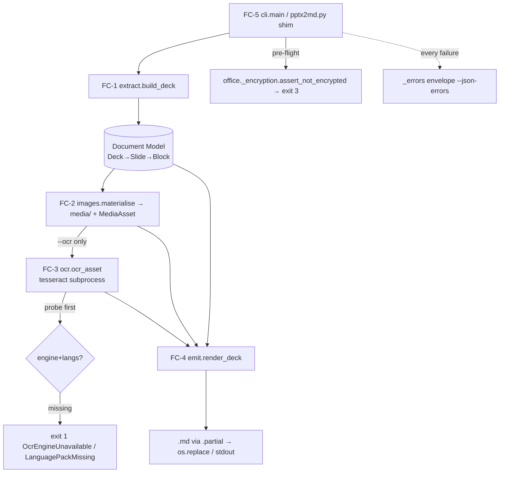
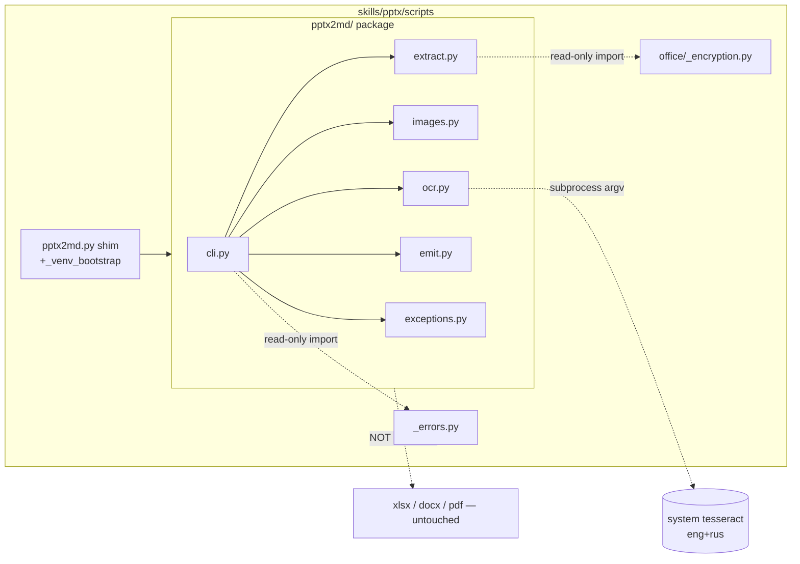

# ARCHITECTURE: pptx → Markdown converter (TASK 020, `pptx2md`)

> Living document, updated **in place** across tasks (architecture-format-core
> §"Living Document & Index-Mode"). It tracks the **current active epic**.
> The prior epic (`docx`-skill hardening, TASK 019) is complete and **archived**
> (`docs/tasks/task-019-docx-skill-hardening.md`,
> `docs/plans/plan-019-docx-skill-hardening.md`) and preserved in git history;
> this revision refocuses the living doc on TASK 020. No `architecture-NNN-*.md`
> snapshot is created.

---

## 1. Task Description

- **Source:** [`docs/tasks/task-020-pptx2md.md`](tasks/task-020-pptx2md.md) (TASK 020,
  slug `pptx2md`; ✅ DONE 2026-06-08, archived lockstep with
  [`docs/plans/plan-020-pptx2md.md`](plans/plan-020-pptx2md.md)). Task-review
  artifact: [`docs/reviews/task-020-review.md`](reviews/task-020-review.md)
  (APPROVED WITH COMMENTS — 5 MAJOR + 4 MINOR folded into the spec).
- **Summary:** add a **read-back** converter to the `pptx` skill —
  `python3 scripts/pptx2md.py INPUT.pptx [OUTPUT.md]` — that turns a `.pptx`/`.pptm`
  deck into structured, LLM-/RAG-friendly Markdown: one section per slide (title →
  heading, body → nested bullets, tables → GFM, **images extracted to a sidecar
  `media/` folder and linked**, optional speaker notes), with an **opt-in `--ocr`**
  mode that recovers text baked into images using the **tesseract engine the `pdf`
  skill is built on** (`eng+rus` default), called **directly per-image** (no
  `ocrmypdf`/`ghostscript`).
- **Precedent:** this is the pptx analogue of **xlsx-9 (`xlsx2md/`)** — a scripted,
  deterministic OOXML→Markdown converter. It deliberately follows the `xlsx2md`
  package shape (cli / extract / emit / exceptions, `.partial`+`os.replace` atomic
  write, self-overwrite guard, `_errors` envelope) rather than the `pdf_extract.py`
  "never-script-the-Markdown" stance — because a `.pptx` carries a **semantic shape
  model** (placeholders, paragraphs+levels, table grids) like a workbook, not
  positioned glyphs like a PDF.
- **Three settled decisions (user, up front):** images → **sidecar media + links**;
  OCR → **per-image tesseract**; OCR → **opt-in `--ocr`** (off by default).
- **Template:** Core (architecture-format-core) — "adding a component to an existing
  system." Interfaces / Security / Replication / Decision-Record subsections are
  inlined because the CLI contract, the OCR subprocess surface, and the
  (deliberately **empty**) cross-skill replication footprint are load-bearing.

---

## 2. Functional Architecture

**Data-first.** The crux is an explicit **in-memory document model** (§4.1):
`extract` builds it from python-pptx, `emit` renders it to Markdown, `images`/`ocr`
feed it side data. Decoupling extraction from emission is what makes the output
**deterministic** (R-A5) and unit-testable without a real `.pptx` on every assertion.

### 2.1. Functional Components

**FC-1 — deck reader / document-model builder** (`pptx2md/extract.py`, **new**, pptx-only)
- **Purpose:** open the deck (after the encryption pre-flight) and walk it into the
  `Deck → [Slide] → ordered [Block]` model (§4.1), in the canonical reading order.
- **Functions:**
  - `assert_openable(path) -> None` — reuse `office._encryption.assert_not_encrypted`
    (single `EncryptedFileError`, exit 3) **before** `Presentation(path)`; catch
    `PackageNotFoundError`/`BadZipFile` → clear `BadInput` (legacy `.ppt` is caught
    here as "encrypted-or-legacy", D-6 / R-D3). Related UC: UC-3.
  - `build_deck(prs, opts) -> Deck` — for each visible slide (**hidden filter, AR-6:**
    python-pptx exposes **no** public `Slide.show`/`hidden` property, so the filter
    reads the raw OOXML attribute `slide._element.get("show")` (`p:sld/@show=="0"` →
    hidden) — a documented private-API reach, locked by a regression test): emit the
    **title placeholder first** (R-A2a / MINOR-1), then walk `slide.shapes` in
    document order, **recursing into GROUP shapes depth-first** (`sh.shape_type ==
    GROUP → walk(sh.shapes)`). **Classification order (AR-1):** branch on
    `shape.shape_type` **first** — `MEDIA` (video/audio `p:pic`) and non-PICTURE →
    `Placeholder`; `PICTURE` → `ImageRef`, but only after `shape.image` access is
    **guarded** (it raises `ValueError` when `blip_rId is None`). Notes become a
    `NotesBlock` **only when `slide.has_notes_slide` is true** (AR-7 — bare
    `slide.notes_slide` has a *create-on-access* side effect) **and**
    `notes_text_frame is not None` and its `.text` is non-empty. Related UC: UC-1, UC-5.
- **Dependencies:** `python-pptx` (pinned `>=0.6.23`; verified against the installed
  **1.0.2** — AR-9; floor to be raised to `>=1.0.2` at implementation per the
  repo's "prefer dependency upgrades" note), `office._encryption` (read-only import),
  `Pillow` (transitively, via `Image.ext`/`.content_type` — see FC-2 / AR-2).
- **Consumers:** `cli.main` (orchestration), `emit`.

**FC-2 — media extractor** (`pptx2md/images.py`, **new**, pptx-only)
- **Purpose:** turn each `ImageRef` into a file on disk under the media dir, with a
  **deterministic, dedup-stable** name, and hand back the relative link.
- **Functions:**
  - `materialise(deck, media_dir, link_base) -> dict[ImageRef, MediaAsset]`
    - Each picture's `shape.image` gives `.blob` + `.sha1` (both **safe** — `.sha1`
      is a direct `hashlib.sha1(blob)`, no Pillow). **`.ext`/`.content_type` are NOT
      safe (AR-1):** `Image.ext` raises `ValueError` for formats outside
      `{BMP,GIF,JPEG,PNG,TIFF,WMF}` (so **EMF/SVG raise**), and `.content_type` →
      `_pil_props` → `PIL.Image.open` raises `UnidentifiedImageError` on
      EMF/WMF/SVG/video/corrupt blobs. So the filename-`ext` lookup is wrapped in a
      guard: success → `MediaAsset`; `ValueError`/`UnidentifiedImageError`/`KeyError`
      → `PlaceholderAsset` (keyed by `(slide, shape)`, **no `ext`/`sha1`**) + warning,
      never a hard failure (R-B3).
    - **Dedup tie-break (R-B1d / MAJOR-3):** a `sha1 → MediaAsset` map; the **first
      occurrence** in reading order owns the canonical filename `slide{N}-img{M}.{ext}`;
      later identical blobs reuse it. `--no-images` short-circuits the whole FC.
    - Related UC: UC-1, UC-1/A2.
- **Dependencies:** stdlib + `Pillow` (already pinned). **AR-2 honesty:** Pillow is
  exercised at **extraction** time too — implicitly, whenever `Image.ext`/
  `.content_type` is read for the filename — not only for the OCR PNG normalisation.
  No new dependency, but the prior "not for extraction" wording was wrong.

**FC-3 — OCR engine adapter** (`pptx2md/ocr.py`, **new**, pptx-only, **opt-in**)
- **Purpose:** recover text from image blobs using **system `tesseract`**, reusing the
  `pdf` skill's engine + `eng+rus` default + soft-optional/fail-loud conventions —
  but **as a direct per-image subprocess**, not via `ocrmypdf`/`pdf_ocr.py`.
- **Functions:**
  - `probe(langs) -> None` — on `--ocr` only: `shutil.which("tesseract")` →
    `OcrEngineUnavailable` (exit 1) if absent; `tesseract --list-langs` → check each
    requested lang → `LanguagePackMissing` (exit 1) naming the gap (R-C2). Runs
    **once**, before any output is written (UC-4). Mirrors `pdf_ocr.py`'s probe shape.
  - `ocr_asset(asset, langs, timeout) -> str` — Pillow-normalise the blob to a temp
    PNG (`mkstemp`, 0600), `subprocess.run(["tesseract", png, "stdout", "-l", langs],
    ...)` **argv-list, no shell** (S-2), bounded by `--ocr-timeout`; empty/whitespace
    result → `""` (no marker); per-image failure/timeout → warning, `""`, continue
    (R-C4). Deduped assets are OCR'd **once** (cache by `MediaAsset`). `--jobs N`
    parallelises across assets (thread pool around the subprocess). Related UC: UC-2.
- **Dependencies:** system `tesseract` (**not bundled**, soft-optional), `Pillow`
  (blob→PNG), stdlib `subprocess`/`tempfile`/`shutil`/`concurrent.futures`.
- **Explicitly NOT used:** `pytesseract`, `ocrmypdf`, `ghostscript` (D-5).

**FC-4 — Markdown emitter** (`pptx2md/emit.py`, **new**, pptx-only)
- **Purpose:** render the document model + media/OCR side-data to a single Markdown
  string/stream — the only component that knows Markdown syntax.
- **Functions:**
  - `render_deck(deck, assets, ocr_text, opts) -> Iterator[str]` — `## Slide N`;
    title `### …`; bullets with `level`→indent; **GFM tables** (escape `\|`, `\n`→
    `<br>`, first row = header, merged cells best-effort); image ``;
    **OCR block** = `<!-- ocr -->`-tagged blockquote under its image (R-C4a); notes
    `> **Notes:**` block (suppressed by `--no-notes`); `[chart]`/`[image]`/`[media]`
    placeholder (R-B3; SmartArt is skipped, not placeholdered — see §10). Streams
    per-slide so large decks don't buffer the whole doc.
    Related UC: UC-1, UC-2, UC-5.
- **Dependencies:** none beyond the model (pure function over data → deterministic).

**FC-5 — CLI orchestrator** (`pptx2md/cli.py` + shim `pptx2md.py`, **new**, pptx-only)
- **Purpose:** own the argparse surface, path resolution (self-overwrite guard +
  media-dir resolution + stdout link-base), atomic write, and the **`_errors`
  envelope routing on every failure path** (mirror `xlsx2md/cli.py`).
- **Functions:** `build_parser()`, `_resolve_paths()` (self-overwrite → exit 6;
  stdout link-base from CWD — MAJOR-4), `main(argv)` (full try/except → `_errors`).
  The shim `scripts/pptx2md.py` carries the **`_venv_bootstrap` prelude** (D-2) +
  `sys.path` insert + `from pptx2md import main`. Related UC: all.

### 2.2. Functional Components Diagram



---

## 3. System Architecture

### 3.1. Architectural Style

**Pipeline of pure-ish stages over an explicit document model** —
`extract → (images, ocr) → emit`, wrapped by a thin CLI. Packaged as a per-skill
mini-library `skills/pptx/scripts/pptx2md/` (closed public surface via `__init__.py`
+ thin shim), **exactly mirroring `xlsx2md/`** (ARCH-precedent). No new service, no
new runtime coupling, no cross-skill replication.

**Justification (YAGNI).** A single 600-line script would tangle four concerns
(deck-walking, blob I/O, subprocess OCR, Markdown syntax) that have different test
needs and different optional-ness (OCR is opt-in + engine-gated). The document-model
seam is the one piece of "extra" structure, and it pays for itself immediately: it is
what makes R-A5 determinism and emit-only unit tests possible. Everything else is the
minimum — no plugin system, no format registry, no config file.

### 3.2. System Components

| Component | Type | Purpose | Tech | Interfaces (in/out) | Replication |
|---|---|---|---|---|---|
| `scripts/pptx2md.py` | **new** shim/CLI | bootstrap prelude + `sys.path` + re-export `main` | Python | in: argv; out: exit code | **pptx-only** |
| `scripts/pptx2md/cli.py` | **new** | argparse, path/guard, atomic write, envelope | Python | in: argv; out: `.md`/stdout | pptx-only |
| `scripts/pptx2md/extract.py` | **new** | deck → document model (groups recursed) | python-pptx | in: path/opts; out: `Deck` | pptx-only |
| `scripts/pptx2md/images.py` | **new** | blob → media file (dedup by sha1) | Python | in: `Deck`,dir; out: `MediaAsset` map | pptx-only |
| `scripts/pptx2md/ocr.py` | **new** (opt-in) | tesseract probe + per-image OCR | subprocess+Pillow | in: asset,langs; out: text | pptx-only |
| `scripts/pptx2md/emit.py` | **new** | document model → Markdown | Python | in: model+sidedata; out: md stream | pptx-only |
| `scripts/pptx2md/exceptions.py` | **new** | `_AppError` hierarchy + codes | Python | — | pptx-only |
| `scripts/pptx2md/tests/` | **new** | unit (emit/extract/images/ocr) | unittest | — | pptx-only |
| `scripts/tests/` | E2E | end-to-end CLI + dogfood | unittest | — | pptx-only |
| `scripts/_errors.py` | **reused** | `--json-errors` envelope | Python | imported read-only | 4-skill (**unchanged**) |
| `scripts/office/_encryption.py` | **reused** | `assert_not_encrypted` | Python | imported read-only | 3-skill (**unchanged**) |
| `SKILL.md`, `references/pptx-to-markdown.md` | docs | contract + decision tree | md | — | pptx-only |
| `THIRD_PARTY_NOTICES.md` (Tesseract row) | doc edit | add `pptx` scope | md | — | repo-root |

### 3.3. Components Diagram



---

## 4. Data Model (Conceptual)

Stateless transform; "data" = the document model + two side tables + invariants.

### 4.1. Document model (`extract` output → `emit` input)

#### Entity: `Deck`
- **Description:** the whole presentation.
- **Key attributes:** `slides: list[Slide]` (visible-then-hidden filtered),
  `source_name: str`.

#### Entity: `Slide`
- **Description:** one slide, as an **ordered** list of content blocks.
- **Key attributes:** `index: int` (1-based, presentation order), `blocks:
  list[Block]`, `notes: str | None`.
- **Business rule:** the **title block is always `blocks[0]`** when a non-empty title
  placeholder exists, regardless of its XML/z-order (R-A2a / MINOR-1).

#### Entity: `Block` (tagged union)
- `Heading{level:int, text:str}` — slide title → `level=3`.
- `Bullets{items: list[BulletItem]}` where `BulletItem{level:int(0..8), text:str}`.
- `Table{rows: list[list[str]]}` — first row = header; cells already escaped-safe.
- `ImageRef{slide:int, shape:int, sha1:str, ext:str, alt:str}` — a pointer; the
  bytes live in `MediaAsset` (resolved by `images`).
- `Placeholder{kind: "chart"|"image"|"media"|"unclassifiable"|"unreadable", note:str}`
  — unsupported/unreadable shape, emitted as a `[kind]` marker + warning (R-B3).
  (SmartArt is **not** a kind here — it has no reliable python-pptx classifier and is
  silently skipped in v1; see §10.)
- **Relationship:** `Slide` 1:N `Block`; `ImageRef` N:1 `MediaAsset` (dedup).

### 4.2. Side tables

#### Entity: `MediaAsset`
- **Key attributes:** `sha1: str` (PK, from `shape.image.sha1`), `filename: str`
  (`slide{N}-img{M}.{ext}` of the **first** occurrence), `rel_path: str` (link base),
  `content_type: str`, `placeholder: bool`.
- **Business rule (dedup, R-B1d):** one row per distinct `sha1`; the canonical
  `filename` is the lowest `(slide, shape)` occurrence; all `ImageRef`s with that
  `sha1` link to it → naming + dedup both deterministic.

#### Entity: `PlaceholderAsset` (AR-1 — when `.ext`/`.content_type` access fails)
- **Key attributes:** `key: (slide:int, shape:int)` (**PK — NOT `sha1`/`ext`**, since
  those accessors raised), `kind: str` (`emf`/`svg`/`wmf`/`media`/`unreadable`),
  `note: str`. Emitted as a `[<kind>]` marker + warning (R-B3). Has **no** file on
  disk and is **not** OCR-eligible. This is why classification branches on
  `shape.shape_type` before touching `shape.image` (FC-1/FC-2).

#### Entity: `OcrResult` (only when `--ocr`)
- **Key attributes:** `sha1: str` (PK → cached per `MediaAsset`), `text: str` (may be
  `""`), `ok: bool`. Empty `text` emits **no** marker (R-C4b).

### 4.3. Derived invariants

- **I-1 (determinism / idempotency, R-A5):** ordering = title-first, then document
  order, groups depth-first; image names from `(slide, shape)`; dedup first-occurrence
  -wins; no dict/set-iteration-order dependence. ⇒ identical input → byte-identical
  `.md` and identical media filenames on re-run. **Locked by an E2E "run-twice-diff"
  test.**
- **I-2 (no replication footprint, §9):** every new file lives under
  `scripts/pptx2md/` (pptx-specific); the only shared files touched (`_errors.py`,
  `office/_encryption.py`) are **imported, never edited** ⇒ the 4-/3-skill `diff -q`
  matrices stay silent. Locked by a `diff -q` check in the integration bead.
- **I-3 (OCR is free of cost & dependency when off, R-C1d):** without `--ocr`,
  `ocr.py` is import-only-on-demand (lazy import in `cli`), `tesseract` is never
  probed, and output equals the no-OCR baseline. Locked by an engine-absent E2E that
  passes **without** `--ocr` and fails-loud **with** it.
- **I-4 (atomic, partial-free output, R-D4):** `.md` is written to a sibling
  `.partial` then `os.replace`; any mid-write exception unlinks it; media dir created
  idempotently; OCR probe runs **before** the first byte is written (UC-4) so a
  missing engine never leaves a half-written file.

---

## 5. Interfaces

### 5.1. `pptx2md.py` public CLI

```text
python3 scripts/pptx2md.py INPUT.pptx [OUTPUT.md|-]
     [--no-images] [--media-dir DIR]            # default DIR = <output-stem>.media/
     [--no-notes]                               # default: include notes when present
     [--include-hidden]                         # default: skip hidden slides
     [--ocr] [--ocr-lang LANGS]                 # default off; LANGS default "eng+rus"
     [--jobs N] [--ocr-timeout SEC]             # OCR parallelism + per-image bound
     [--json-errors]                            # shared _errors envelope (v=1)
```

- `OUTPUT` omitted or `-` → Markdown to **stdout**; media still written to
  `--media-dir` (default beside CWD) and image links are **relative to that dir from
  CWD**, with a one-line stderr note (MAJOR-4 / R-B2c).
- **Exit-code map (hybrid parity — MINOR-3 + AR-3, intentional):** `0` ok · `1`
  OCR-engine failures (`OcrEngineUnavailable`/`LanguagePackMissing`, **pdf parity**)
  + generic input errors (`BadInput`, `FileNotFound`) **+ the terminal redacted
  `InternalError`** (AR-3 — collapses with the generic-failure bucket, matching
  `pdf_ocr.py`'s `InternalError→1`; we deliberately do **not** mint `xlsx2md`'s
  code 7, since this CLI's hybrid map already overloads `1` for generic failures) ·
  `2` argparse usage · `3` `EncryptedFileError` (encrypted **or** legacy `.ppt`,
  **pptx `pptx_to_pdf.py` parity**) · `6` `SelfOverwriteRefused` (cross-7 parity,
  incl. a media path resolving onto INPUT).

### 5.2. OCR subprocess contract (FC-3)

```python
# probe (once, on --ocr): fail-loud BEFORE any output
shutil.which("tesseract") or raise OcrEngineUnavailable      # exit 1
# AR-9: --list-langs prints to stdout on some builds, stderr on others —
# parse BOTH streams (mirror pdf_ocr.py:264 f"{proc.stdout}\n{proc.stderr}").
"eng","rus" ⊆ set(parse(tesseract --list-langs)) or raise LanguagePackMissing  # exit 1
# per image (argv list — NO shell; bounded; never aborts the deck):
subprocess.run(["tesseract", tmp_png, "stdout", "-l", langs],
               capture_output=True, text=True, timeout=ocr_timeout)
```

Reuses the **engine + `eng+rus` default + soft-optional/fail-loud conventions** of
`skills/pdf/scripts/pdf_ocr.py`, but **not** its `ocrmypdf` code path (that is
PDF-page-oriented and would flatten the per-image placement the user chose). No
`pytesseract` dependency is added (D-5).

### 5.3. Error envelope (reused, read-only)

`from _errors import add_json_errors_argument, report_error` — identical schema
`v=1` to the other office CLIs. Domain failures are `pptx2md/exceptions.py`
`_AppError` subclasses carrying `CODE` + `error_type`; `EncryptedFileError` is
imported from `office._encryption` and mapped to code 3 in `main` (parity with
`pptx_to_pdf.py`). `_errors.py` is **not modified** ⇒ no replication.

### 5.4. SKILL.md / docs contract

`SKILL.md` gains: a §2 Capabilities bullet, a §4 Script-Contract command line, a §10
Quick-Reference row, a §12 Resources link, a §7.5 Setup note for the optional
`tesseract` (+`eng`/`rus`) system tool, and an honest-scope line. New
`references/pptx-to-markdown.md` mirrors `pdf/references/pdf-to-markdown.md`
(decision tree: when `--ocr`, when to hand-edit, output shape, limitations).
`THIRD_PARTY_NOTICES.md` Tesseract row scope `pdf` → `pdf, pptx`.

---

## 6. Technology Stack

| Layer | Choice | Notes |
|---|---|---|
| Extraction | `python-pptx` (pinned `>=0.6.23`; verified vs installed **1.0.2** — AR-9) | supplies `Image.sha1/.blob` (safe) + `.ext/.content_type` (Pillow-backed, may raise — AR-1), group recursion, title/notes APIs (all verified live). Raise floor to `>=1.0.2` at implementation (repo "prefer dependency upgrades" note) |
| Image I/O | stdlib + `Pillow` (already a dep) | Pillow only for the OCR blob→PNG normalisation handoff |
| OCR | system `tesseract` via `subprocess` | **not bundled**; soft-optional; argv-list; `eng+rus` default; **no** `pytesseract`/`ocrmypdf`/`ghostscript` |
| CLI/envelope | `argparse` + reused `_errors.py` | schema `v=1`; atomic `.partial`→`os.replace` |
| Encryption guard | reused `office._encryption.assert_not_encrypted` | single `EncryptedFileError`, exit 3 |
| Bootstrap | reused `_venv_bootstrap.reexec_into_venv` | new entrypoint self-bootstraps into `scripts/.venv` (D-2) |
| Tests | `unittest` (per-skill `.venv`) | `./.venv/bin/python -m unittest` |

`requirements.txt` is **unchanged** (no new Python dependency — OCR is a system
tool). `THIRD_PARTY_NOTICES.md` gains `pptx` on the existing Tesseract row only.

---

## 7. Security

Trust model inherited (office skills): single-tenant, operator-supplied input; local
CLI; no network.

- **S-1 Encryption/legacy pre-flight.** `assert_not_encrypted` runs **before**
  `Presentation()`, so a password-protected or legacy CFB `.ppt` fails closed with
  `EncryptedFileError` (exit 3) — never a `BadZipFile`/`PackageNotFoundError`
  traceback (R-D3).
- **S-2 OCR subprocess.** `subprocess.run([...], shell=False)` — argv list, no string
  interpolation, no shell; the only interpolated value is the requested `langs`
  string which is **validated against `--list-langs`** before use. This structurally
  avoids the `DOCX-MERMAID-EXECSYNC` class (KNOWN_ISSUES). Temp PNGs via `mkstemp`
  (0600) in `TMPDIR`, unlinked in `finally`; bounded by `--ocr-timeout`.
- **S-3 Path safety.** self-overwrite guard (OUTPUT **and** any media file resolving
  onto INPUT → exit 6); output parent + media dir auto-created idempotently; atomic
  write so no partial `.md` survives a failure. Terminal `except Exception` → redacted
  `InternalError` (no absolute-path leak), mirroring `xlsx2md`/`pdf_ocr`.
- **S-4 XML.** `python-pptx` parses via `lxml` with its own packaging guards;
  consistent with the rest of the pptx skill (`office/` already uses `defusedxml` for
  the unpack path). No new XML attack surface beyond what the skill already accepts.
- **S-5 No AuthN/AuthZ.** N/A — local single-user tooling (unchanged).

---

## 8. Scalability & Performance

- **Core extraction (no OCR):** O(slides + shapes + image-bytes). **Measured baseline
  (R-E3c, 2026-06-08):** the largest dogfood deck `slodes-3.pptx` (82 slides / 231
  images → 136 deduped / 16 MB) converts in **~0.23 s** (no OCR) on the reference host
  — the regression ceiling. Confirmed linear by the vdd-multi performance critic (no
  quadratic, no hidden blob copy; dedup is a single `sha1` dict; cost is dominated by
  python-pptx zip-extraction + per-picture Pillow header parses). Emit streams
  per-slide — the whole `.md` is never buffered (`_write_output` consumes the
  generator lazily).
- **OCR (opt-in):** dominant cost ≈ `n_unique_images · T` (deduped, so `slodes-3`'s
  231 pictures collapse to distinct blobs only). Default serial; `--jobs N`
  parallelises the subprocess calls; `--ocr-timeout SEC` bounds a pathological image
  so it cannot hang the deck (MAJOR-5).

---

## 9. Cross-Skill Replication Boundary (CLAUDE.md §2 — load-bearing, here EMPTY)

This task triggers **no replication** (like pdf-4, unlike TASK 019). All new code is
pptx-specific and lives under `scripts/pptx2md/` — it is **not** listed in any
CLAUDE.md §2 replication set (`office/`, `_soffice.py`, `_errors.py`, `preview.py`,
`office_passwd.py`). `xlsx2md/` set the precedent: an in-skill mini-library is **not**
cross-skill replicated.

| File | CLAUDE.md tier | Action |
|---|---|---|
| `scripts/pptx2md/**`, `scripts/pptx2md.py` | none (pptx-specific) | new, **not replicated** |
| `scripts/_errors.py` | 4-skill | **imported read-only — not edited** ⇒ matrix stays silent |
| `scripts/office/_encryption.py` | 3-skill | **imported read-only — not edited** ⇒ matrix stays silent |
| `THIRD_PARTY_NOTICES.md` | repo-root | doc edit (add `pptx` to Tesseract row) — not a code file |

**Gate (integration bead):** assert the 4-/3-skill `diff -q` matrices are still
silent (proves no shared file was touched) + `validate_skill.py` exit 0 for pptx
(and, defensively, the other three are unaffected).

---

## 10. Honest Scope (v1)

- **Markdown fidelity is best-effort.** Rich-text styling (bold/italic/colour) is
  flattened to plain text for MVP; **charts** become a `[chart]` placeholder (R-B3 /
  Q3); **SmartArt is silently skipped** (as-built reconciliation — the Q3 "default
  yes, placeholder SmartArt too" was NOT shipped: python-pptx has no reliable SmartArt
  classifier, and adding XML-sniffing detection that cannot be fixtured/dogfooded
  would violate "don't ship code that hasn't run on data"; deferred as a documented
  v1 limitation); merged table cells render anchor-value + blanks (no rowspan/colspan
  reconstruction); animations/transitions/speaker-timings are ignored.
- **OCR is best-effort, no layout.** tesseract returns a flat text block per image; no
  reading-order reconstruction inside an image, no table-in-image parsing. Engine +
  language packs are **detected, never installed** by us.
- **SVG/video** → placeholder marker (Pillow can't identify → no file). **WMF/EMF**
  (vector) is **rendered to an inline `.png`** at extraction time via LibreOffice
  (`images.rasterise_vector`, soft-optional, **fail-closed**) so the diagram displays
  inline in any Markdown viewer; under `--ocr` the same PNG is OCR'd (no second soffice
  call — `materialise` updates `deck.blobs` to the PNG). If `soffice` is absent (or the
  render fails) the original `.wmf`/`.emf` bytes are written instead and `--ocr` skips
  that one image with a `non-rasterisable image` warning — the run never fails. Vectors
  are pre-rendered up front across `--jobs` workers (each render is profile-isolated;
  default `--jobs 1` = serial, ~2–3 s LibreOffice startup *per unique vector*; sha1-
  deduped so identical vectors render once). The inline PNG **bytes** are not byte-
  reproducible across runs (LibreOffice render metadata) but the `.md` + media
  **filenames** are stable. See D-11.
- **`.pptm`** opens normally; macros are **not read** (read-only path) and not warned
  about (the pack-time macro helper does not apply to a reader).
- **Image-only & background-image decks — NOW HANDLED (post-dogfood fix, 2026-06-09).**
  Beyond `Picture` shapes, `extract` also recovers (a) **picture-placeholders**
  (`shape_type==PLACEHOLDER` but `isinstance(shape, Picture)` — e.g. `slides-5` sl 2-3)
  via the `isinstance(shape, Picture)` classifier, and (b) **slide-background + shape-
  fill images** (`p:cSld/p:bg` / `a:blipFill` blips, which carry no shape at all — the
  whole marp/exported slide is a full-page background PNG) via `_collect_nonpic_images`
  (iterate `a:blip` not under a `p:pic`, resolve the embed rId → image part → blob,
  emit `ImageRef(alt="background")`). So `FRAMEWORK_WEBINAR.marp.pptx` (19 bg slides)
  and `slides-5` (picture-placeholders) now extract every image + `--ocr` recovers the
  text — **0 empty slides** across the tmp8 corpus. *Remaining honest limit:* a
  background inherited from the slide **layout/master** (not on the slide itself) is
  not collected (`slide._element` only sees the slide's own bg) — rare; deferred.
- No new Python dependency; no cross-skill replication; no change to existing scripts.

---

## 11. Atomic-Chain Skeleton (Planner handoff — Stub-First)

Proposed beads for `/vdd-plan`. No bead edits a replicated master, so there is **no
in-bead replication** — only the §9 `diff -q` *assertion* at the integration bead.

| Bead | Scope (RTM) | Stub-First role |
|---|---|---|
| **020-01** | `pptx2md/` package skeleton + shim (`_venv_bootstrap` prelude, `sys.path`, re-export) + `exceptions.py` + `cli.build_parser` stub + **RED** E2E/unit scaffolding (happy-path, tables, images-to-sidecar+dedup, notes, `--no-images`, stdout link-base, encrypted-reject exit 3, self-overwrite exit 6, `--json-errors`, OCR-engine-absent) | STUB + tests (Red) |
| **020-02** | FC-1 `extract.py` — encryption pre-flight + slide/shape/group walk → document model (headings, bullets+levels, tables, notes, placeholders) | LOGIC (Green) — Epic A + R-D1/R-D3 |
| **020-03** | FC-2 `images.py` — blob → media file, sha1 dedup, deterministic names, `--media-dir`, link base (file + stdout) | LOGIC (Green) — Epic B |
| **020-04** | FC-4 `emit.py` + FC-5 `cli.main` glue — model → Markdown (GFM tables, bullets, image links, notes, placeholders) + atomic write + envelope routing + self-overwrite/exit-code map | LOGIC (Green) — Epic A/D emit, **MVP gate** |
| **020-05** | FC-3 `ocr.py` — probe (engine+langs, fail-loud) + per-image subprocess OCR + `<!-- ocr -->` placement + `--jobs`/`--ocr-timeout` + dedup-cache | LOGIC (Green) — Epic C |
| **020-06** | Docs + integration: `SKILL.md` (capabilities/contract/quick-ref/setup), `references/pptx-to-markdown.md`, `THIRD_PARTY_NOTICES.md` pptx row, `requirements.txt` floor →`>=1.0.2` (AR-9), install.sh `--with-ocr` note, backlog `pptx-5`→done; **dogfood all 6 tmp8 decks** — text-rich `slides-1/2/4`+`slodes-3` (record `slodes-3` core wall-time, MAJOR-5), image-only `slides-5.pptx` + marp `FRAMEWORK_WEBINAR.marp.pptx` (the `--ocr` cases, engine-gated) + §9 `diff -q` assertion + `validate_skill` exit 0 | INTEGRATION + DOC |

**MVP gate = 020-01…04** (text + bullets + tables + images-to-sidecar + notes
converts all four tmp8 decks with zero workarounds). **020-05 (OCR)** is an MVP
*flag* but engine-soft-optional (an OCR run is engine-gated; if `tesseract` is absent
on the dev host it is documented as pending, like pdf-4's composition gate).

**Status (as-built, 2026-06-08): all 6 beads shipped + verified.** `/vdd-develop-all`
ran each bead with a per-bead adversarial roast (the loop caught 3 real deck-crashers
— unguarded `shape.shape_type`, group `.shapes`, and table-escape order — plus a
DecompressionBomb DoS, all fixed + regression-locked). A subsequent **3-critic
`/vdd-multi`** (logic + security + performance) **converged** (all bikeshedding-only):
it confirmed full RTM/UC coverage, byte-identical replicated files, live bomb-guard on
both the extract and OCR paths, and the 0.23 s baseline — and hardened five items
(see D-9/D-10). Final gates: **63 unit + E2E** + legacy `test_e2e.sh` (48) green;
`validate_skill` PASS; §9 `diff` matrices silent; dogfood on all 6 `tmp8` decks
(`slides-5 --ocr` recovered eng+rus text). Two cosmetic LOWs deferred (media-dir uses
`args.INPUT` whose `.stem` is dir-independent; empty deck → empty `.md`).

---

## 12. Decision-Record Summary

- **D-1 (package, not single file).** Ship `pptx2md/` as a closed mini-library
  (cli/extract/images/ocr/emit/exceptions) + thin shim, mirroring `xlsx2md/`. The
  document-model seam decouples extract↔emit, enabling pure-function emit tests and
  R-A5 determinism. (Resolves TASK Q1.)
- **D-2 (self-bootstrap the new CLI).** The new `pptx2md.py` entrypoint carries the
  TASK-019 `_venv_bootstrap.reexec_into_venv(requires=("pptx",))` prelude — a new
  entrypoint *should* self-bootstrap; this advances (does not violate) TASK-019's
  **"Deferred (not this task)" note + OQ-1** (AR-5 — the deferral covered only
  wiring **pre-existing** per-skill CLIs; "D-A6" is a TASK-018/pdf label, not a
  TASK-019 one).
- **D-3 (explicit document model).** An in-memory `Deck→Slide→Block` model is the one
  piece of deliberate structure; it is the enabler for determinism + testability and
  is cheaper than re-deriving order/dedup inside the emitter.
- **D-4 (dedup tie-break: first-occurrence-wins).** Canonical media filename =
  lowest `(slide, shape)` occurrence of a given `sha1`; later refs link to it.
  Reconciles positional naming with content dedup so both are deterministic
  (resolves review MAJOR-3).
- **D-5 (OCR: direct tesseract subprocess).** Reuse the pdf skill's **engine +
  conventions**, not its `ocrmypdf` code path. No `pytesseract` (no new Python dep),
  no `ghostscript` (AGPL-clean). Per-image preserves slide↔image placement (the
  user's choice) which a whole-deck pptx→pdf→ocr route would lose (resolves MAJOR-2).
- **D-6 (single encryption type).** Reuse `office._encryption.assert_not_encrypted`
  → one `EncryptedFileError` (exit 3) whose message names encrypted-or-legacy; byte
  -sniffing cannot reliably discriminate the two, so no `LegacyPptInput` type is
  invented — parity with the skill's own `pptx_to_pdf.py` (resolves MAJOR-1).
- **D-7 (stdout link base).** In stdout mode, image links are relative to
  `--media-dir` as resolved from CWD, with a stderr note; in file mode, relative to
  the `.md` (resolves MAJOR-4).
- **D-8 (OCR rendering form).** `<!-- ocr -->`-tagged blockquote under the image —
  human-readable + greppable + clearly non-authored (resolves TASK Q2).
- **D-9 (OCR decompression-bomb guard is THREAD-LOCAL).** `ocr_asset` rejects an
  over-`MAX_IMAGE_PIXELS` image via a **local header-size check** (`Image.open` is
  lazy → read `.size` → raise before the full-decode `.save()`) — **NOT**
  `warnings.catch_warnings()`, which mutates process-global filter state and races
  under `--jobs>1` (a sibling thread's context-exit can drop the escalation
  mid-decode). Race-free by construction; locked by an un-mocked `--jobs 2`
  regression test. (vdd-multi 2nd-iteration finding — the first warn-band fix itself
  introduced the race.)
- **D-10 (error envelopes never leak absolute paths).** Every CLI failure path emits
  a **basename-only** message: the `EncryptedFileError` handler builds its own
  basename message instead of echoing `str(exc)` (the shared
  `office._encryption.EncryptedFileError` embeds the resolved absolute path);
  `InternalError` is redacted to the exception class name. (vdd-multi security LOW-1.)
- **D-11 (WMF/EMF rendered to inline PNG via a soft-optional LibreOffice render).**
  Pillow can identify but not *decode* WMF/EMF on macOS/Linux, and most Markdown viewers
  won't display raw `.wmf`/`.emf`, so the converter renders each vector to a **`.png`**
  via the shared `images.rasterise_vector` → `_soffice.convert_to(..., "png")` and writes
  *that* as the sidecar media file (links display inline). This happens at extraction
  time **regardless of `--ocr`**: `materialise` pre-renders all unique vectors
  (`_prerender_vectors`, parallel over `--jobs`, sha1-deduped so each renders once) and
  swaps the blob to the PNG in `deck.blobs`, so a subsequent `--ocr` OCRs the PNG with
  **no second soffice call** (extraction reads `deck.blobs` serially, then mutates
  serially — no race). `ocr.ocr_asset` calls the *same* `rasterise_vector` only as a
  defensive fallback (e.g. `--no-images` decks never pre-rendered). **Reuses the engine
  the skill already trusts** (`pptx_to_pdf.py` / `pptx_thumbnails.py` already feed
  untrusted decks to soffice — no new trust boundary; argv-no-shell; per-call throw-away
  `UserInstallation` profile → safe under `--jobs>1`; `--ocr-timeout`-bounded).
  Fail-closed: absent/failed soffice → keep the original `.wmf`/`.emf` bytes (and under
  `--ocr` skip that image + warn), never crash — guarded by a **bare `except Exception`**
  (a narrow `SofficeError`/`OSError` catch would let a `RuntimeWarning`-as-error escape
  and break AR-1; found by the post-dogfood logic roast). The PNG **bytes** are not
  byte-reproducible (LibreOffice render metadata), but filenames + the `.md` are stable.
  Cost: ~2–3 s of LibreOffice startup per unique vector; default `--jobs 1` is serial —
  raise `--jobs` on vector-heavy decks, or `--no-images` to skip rendering entirely.

---

## 13. Open Questions

All TASK open questions are resolved at the architecture layer:

- **Q1 (single file vs package):** package `pptx2md/` — D-1. ✅
- **Q2 (OCR rendering form):** `<!-- ocr -->` blockquote — D-8. ✅
- **Q3 (charts/SmartArt placeholder):** charts → `[chart]` marker + warning; SmartArt
  **deferred** (silently skipped in v1 — no reliable python-pptx classifier, see §10)
  (R-B3 / emit). ✅

No blocking questions remain for the Planning phase.
