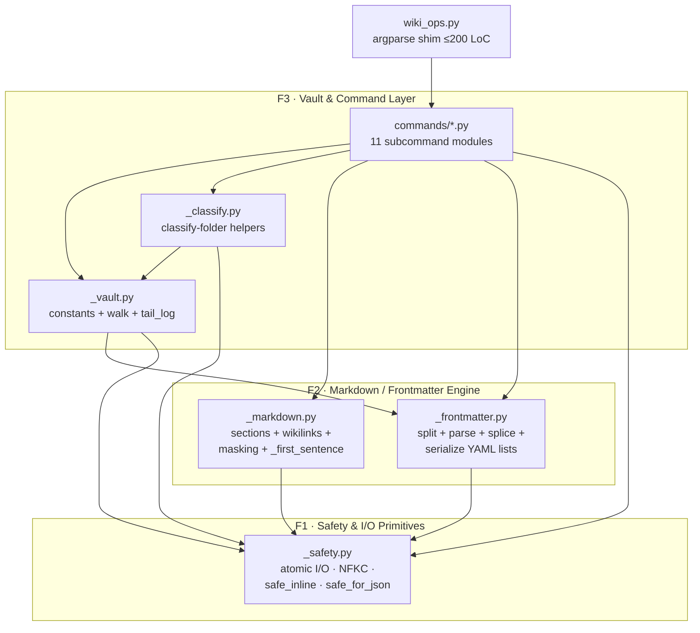
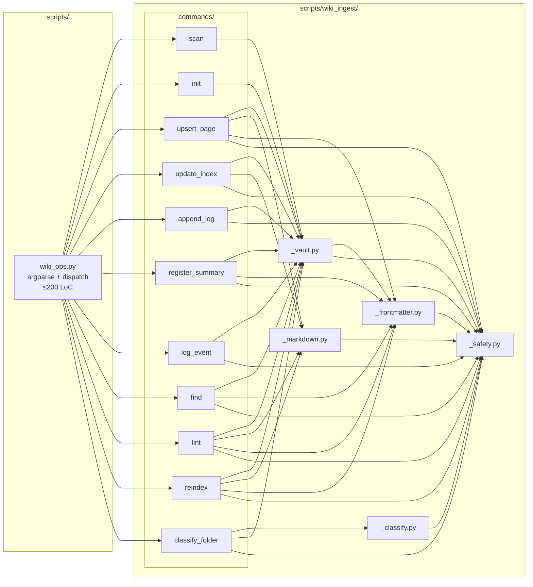

# ARCHITECTURE: TASK 015 — wiki-ingest modular refactor

> **Living document.** Replaces the prior task-014 / pdf-7 architecture
> snapshot (archived under git history). This document is the source of
> truth for the wiki-ingest **internal layout** going forward.

---

## 1. Task Description

See [`docs/TASK.md`](TASK.md) for the full TASK 015 specification.

**One-liner**: split [`skills/wiki-ingest/scripts/wiki_ops.py`](../skills/wiki-ingest/scripts/wiki_ops.py)
(currently 2661 LoC) into a `wiki_ingest/` Python package alongside it, with
strict module boundaries and a ≤200-LoC argparse shim. **No behavioural change
to the CLI.** Each subcommand becomes its own module; cross-cutting helpers
form five domain modules with a documented one-way dependency graph.

**Why now**: three VDD passes have grown the file faster than its structure
absorbed; future critic loops, unit tests, and feature additions are all
gated on per-module ergonomics.

---

## 2. Functional Architecture

### 2.1. Functional Components

The system has **three** functional layers; the refactor renders them as
distinct module groups.

#### F1. Safety & I/O Primitives

**Purpose**: every operation that touches the filesystem or accepts external
data goes through a single hardened layer — atomic writes, size-capped reads,
symlink refusal, NFKC normalisation, sanitised JSON output. These are the
defenses installed during the 2026-05-25 VDD-multi pass and must not regress.

**Functions**:
- `read_text(path, *, follow_symlink=False, max_bytes=MAX_PAGE_BYTES)` — bounded read.
- `write_text(path, content, dry_run)` → `_atomic_write_text` — tempfile + `os.replace` + `flock`.
- `_safe_name(name, kind)` — NFKC normalise + reject path separators, control chars, traversal, template placeholders.
- `_safe_inline(text, field)` — reject newlines + `## ` line-starts + bare `---`.
- `_safe_for_json(value, max_bytes=MAX_VALUE_BYTES)` — strip control chars + cap scalar length.
- `_is_relative_to(child, parent)` — backport-safe containment check.
- `_skip_symlink(path)` — directory-walk filter.
- `_check_case_collision(target_dir, name)` — case-fold + slug-collision check.
- `slugify(text)` — NFKC + Unicode-aware kebab-case.
- `die(msg, code=1)` — fatal error → stderr + exit.

**Inputs**: arbitrary user-supplied strings, filesystem paths.
**Outputs**: validated strings, file descriptors, atomic writes, sanitised JSON-safe values.

**Related Use Cases**: every subcommand (UC-1..UC-3 indirectly).

**Dependencies**: stdlib only (`os`, `tempfile`, `fcntl` on POSIX, `unicodedata`, `re`, `pathlib`, `errno`).

#### F2. Markdown / Frontmatter Engine

**Purpose**: parse + mutate Obsidian-flavour markdown deterministically.
Sections, wiki-links, YAML frontmatter — the three things every wiki op
touches — share one masking pass per page so the engine stays linear-time
even on adversarial inputs.

**Functions** (split across two modules — see §3.2):
- `_mask_code_fences(text)` — offset-preserving mask of fenced code.
- `_mask_inline_constructs(text)` — masks inline backticks + HTML comments.
- `find_section / find_all_sections / get_section_body / replace_section_body / insert_section_before` — all accept an optional pre-computed `masked` view.
- `_existing_lines(body)` — list-item recovery preserving multi-line items.
- `_extract_wikilinks_with_anchors(body, masked=None)` — `{target: {anchors}}` map.
- `_first_sentence(text)` — abbreviation-aware sentence-split, 16 KiB cap.
- `split_frontmatter(content, warnings=None)` — line-anchored YAML closer; surfaces malformed-line warnings.
- `_strip_frontmatter_fast(content)` — cheap body extractor (no parse).
- `_splice_frontmatter_fields(text, fields, fm)` — structural list-field rewrite.

**Inputs**: raw markdown text.
**Outputs**: structured (dict / set / tuple / re-serialised text).

**Related Use Cases**: UC-2 (per-module critic loop); foundational for UC-1 (any new command needs section/frontmatter manipulation).

**Dependencies**: F1 (for `die` only — fatal-error path on guard violations).

#### F3. Vault & Command Layer

**Purpose**: the public-facing CLI surface. Every subcommand reads + mutates
the vault by composing F1 + F2; vault-layout constants and the symlink-
filtering walk live in `_vault.py` so commands share one definition.

**Functions**:
- **Vault helpers** (`_vault.py`): `_walk_pages(vault)`, `load_vault_pages(vault)`, `ensure_schema(vault)`, `load_asset(name)`, `tail_log(vault, n)`.
- **Constants** (`_vault.py`): `DEFAULT_SUBDIRS`, `SUBDIR_TO_KIND`, `SUBDIR_TO_DISPLAY`, `SCHEMA_FILE`, `INDEX_FILE`, `LOG_FILE`.
- **Classify helpers** (`_classify.py`): `_count_md_structure`, `_filename_hint_score`, `_looks_like_wiki_summary`, `_classify_one_file`, `_detect_grouping`, `_group_files`, `_pick_primary`, plus the per-extension/skip/hint tables.
- **Commands** (`commands/*.py`): one file per subcommand — `scan`, `init`, `upsert_page`, `update_index`, `append_log`, `register_summary`, `log_event`, `find`, `lint`, `reindex`, `classify_folder`. Each exposes exactly two public symbols: `register(subparser)` and `execute(args)`.

**Inputs**: parsed `argparse.Namespace`.
**Outputs**: vault-file mutations, JSON-on-stdout reports.

**Related Use Cases**: UC-1 (new command path), UC-3 (E2E smoke).

**Dependencies**: F1 + F2.

### 2.2. Functional Components Diagram



**Dependency rule (one-way only)**: F3 → F2 → F1. No back-edges. Commands
may import any F1/F2/F3-helper module but **never** another command.

---

## 3. System Architecture

### 3.1. Architectural Style

**Layered monolith — single-process Python CLI** with explicit one-way
dependency layers (Safety → Engine → Commands). Each subcommand is a
*driver* over the shared engine; there is no shared mutable state and no
process boundary. The unit of deploy is one `.skill` archive.

**Justification**:
- The skill must remain installable and runnable in isolation
  ([CLAUDE.md §"Независимость скиллов"](../CLAUDE.md)) — a single-process
  layered design is the simplest shape that meets that constraint.
- No concurrency requirements (advisory `flock` covers the single
  cross-process race we care about: two agents writing the same wiki at
  the same time).
- The agent invokes one subcommand per turn — IPC / persistent daemons
  are unjustified.
- Pure stdlib (no `pip` runtime deps) is a hard constraint per CLAUDE.md;
  rules out anything frameworky.

**Alternatives considered + rejected**:
- *Plugin discovery via entry_points*: overkill for ≤15 commands and adds a
  packaging surface not currently present.
- *Async I/O*: zero async-relevant operations in the workload (all reads
  are kilobytes-to-megabytes, all writes are single files).

### 3.2. System Components

The repository layout after the refactor:

```
skills/wiki-ingest/
├── SKILL.md                            # unchanged (public-surface contract)
├── assets/                             # unchanged (markdown templates)
├── examples/                           # unchanged
├── references/
│   ├── ingest_workflow.md              # unchanged
│   ├── folder_ingest_workflow.md       # unchanged
│   ├── query_lint_workflow.md          # unchanged
│   ├── wiki_schema.md                  # unchanged
│   ├── karpathy-llm-wiki.md            # unchanged
│   └── architecture.md                 # NEW (R12 — maintainer-facing module map)
├── evals/                              # unchanged (fixtures + eval suite)
└── scripts/
    ├── wiki_ops.py                     # SHRUNK to ≤200 LoC argparse shim
    ├── wiki_ingest/                    # NEW package
    │   ├── __init__.py
    │   ├── _safety.py                  # F1 — ≤300 LoC
    │   ├── _markdown.py                # F2 — ≤350 LoC
    │   ├── _frontmatter.py             # F2 — ≤300 LoC
    │   ├── _vault.py                   # F3 helpers — ≤150 LoC
    │   ├── _classify.py                # F3 helpers — ≤350 LoC
    │   └── commands/
    │       ├── __init__.py
    │       ├── scan.py                 # ≤100 LoC
    │       ├── init.py                 # ≤100 LoC
    │       ├── upsert_page.py          # ≤250 LoC
    │       ├── update_index.py         # ≤150 LoC
    │       ├── append_log.py           # ≤150 LoC
    │       ├── register_summary.py     # ≤350 LoC (largest — fm rewrite path)
    │       ├── log_event.py            # ≤100 LoC
    │       ├── find.py                 # ≤150 LoC
    │       ├── lint.py                 # ≤300 LoC
    │       ├── reindex.py              # ≤250 LoC
    │       └── classify_folder.py      # ≤200 LoC (drives _classify.py)
    └── tests/                          # NEW — unit + E2E smoke suite
        ├── __init__.py
        ├── fixtures/                   # NEW — minimal module-targeted fixtures
        ├── test__safety.py
        ├── test__markdown.py
        ├── test__frontmatter.py
        ├── test__vault.py
        ├── test__classify.py
        ├── commands/
        │   └── test_*.py               # one per command — happy + ≥1 adversarial
        └── test_e2e_smoke.py           # init → upsert → lint → reindex byte-identity
```

**Component dossier** — for each module:

| Module                                  | Type      | Responsibility                                                                                                                                                       | LoC budget | Imports from              |
|-----------------------------------------|-----------|----------------------------------------------------------------------------------------------------------------------------------------------------------------------|------------|----------------------------|
| `wiki_ops.py`                           | shim      | argparse wiring + dispatch to `wiki_ingest.commands.<cmd>.execute(args)`. **The only file under `scripts/` outside the `wiki_ingest/` package.**                       | ≤200       | wiki_ingest, stdlib        |
| `wiki_ingest/__init__.py`               | package   | Empty (or version string only).                                                                                                                                      | ≤30        | —                          |
| `wiki_ingest/_safety.py`                | F1        | die · slugify · _safe_name · _safe_inline · _is_relative_to · read_text · write_text · _atomic_write_text · _safe_for_json · _skip_symlink · _check_case_collision · constants (MAX_PAGE_BYTES, MAX_SUMMARY_BYTES, MAX_VALUE_BYTES, _UNSAFE_NAME_RE, _CTRL_CHARS_RE) | ≤300       | stdlib                     |
| `wiki_ingest/_markdown.py`              | F2        | _mask_code_fences · _mask_inline_constructs · SECTION_BOUNDARY_RE · find_section / find_all_sections / get_section_body / replace_section_body · insert_section_before · _existing_lines · WIKILINK_RE / WIKILINK_ANCHOR_RE · _extract_wikilinks_with_anchors · _first_sentence · _HTML_COMMENT_RE · _TLDR_BOLD_RE · _ABBREV_RE | ≤350       | _safety                    |
| `wiki_ingest/_frontmatter.py`           | F2        | split_frontmatter · _strip_frontmatter_fast · _parse_flow_list · _strip_quotes · _strip_trailing_comment · _serialize_yaml_list_field · _splice_frontmatter_fields · _FM_CLOSER_RE · _FM_KEY_RE | ≤300       | _safety                    |
| `wiki_ingest/_vault.py`                 | F3 helper | DEFAULT_SUBDIRS · SUBDIR_TO_KIND · SUBDIR_TO_DISPLAY · SCHEMA_FILE · INDEX_FILE · LOG_FILE · ASSETS_DIR · _walk_pages · load_vault_pages · ensure_schema · load_asset · tail_log | ≤150       | _safety, _frontmatter      |
| `wiki_ingest/_classify.py`              | F3 helper | _OFFICE_EXTS / _IMAGE_EXTS / _METADATA_EXTS / _TEXT_EXTS / _SKIP_EXTS / _SKIP_NAMES / _PRIMARY_HINTS / _NON_PRIMARY_HINTS · _PREFIX_REGEX · _UNGROUPED_SENTINEL · _UNGROUPED_LABEL · _is_text_readable · _count_md_structure · _filename_hint_score · _looks_like_wiki_summary · _classify_one_file · _detect_grouping · _group_files · _pick_primary | ≤350       | _safety                    |
| `wiki_ingest/commands/<cmd>.py`         | F3 driver | One subcommand each. Public surface: `register(subparser) → None` and `execute(args) → int`. **No command imports another command.**                                  | ≤400 each  | _safety, _markdown, _frontmatter, _vault, _classify (subset per command) |
| `scripts/tests/`                        | tests     | unittest discoverable; per-module + per-command + E2E.                                                                                                               | n/a        | wiki_ingest                |

**Import-graph invariant** — enforced by a tiny `tests/test_architecture.py`
that walks each module via the `ast` module and asserts: (a) no
`wiki_ingest/_*.py` file imports `wiki_ingest.commands.*`, and (b) no
`wiki_ingest/commands/<a>.py` imports `wiki_ingest/commands/<b>.py`. Cost:
~30 LoC, zero new deps — converts the rule from "manual" to "CI-trusted"
without pulling in `import-linter`. A future task can promote to a
fully-fledged dependency-linter if needed.

### 3.3. Components Diagram



---

## 4. Data Model

The refactor introduces **no new persistent data structures** — vault layout
(`_sources/`, `_concepts/`, `_entities/`, `index.md`, `log.md`, `WIKI_SCHEMA.md`)
is unchanged. The internal data exchanged between layers stays as plain
Python dicts / sets / strings, but the contract is now explicit:

### 4.1. PageDict (returned by `load_vault_pages` and built inline by `cmd_lint`)

```python
{
    "path": str,                # vault-relative path, e.g. "_concepts/Foo.md"
    "raw": str,                 # full file content (UTF-8)
    "fm": dict,                 # parsed frontmatter (from split_frontmatter)
    "kind": str,                # "concept" | "entity" | "source" | "unknown"
    # OPTIONAL — present only on the cmd_lint enrichment path:
    "masked": str,              # _mask_inline_constructs(_mask_code_fences(raw))
    "wikilinks": set[str],      # bare target names
    "wikilinks_anchors": dict[str, set[str]],  # {target: {anchor, ...}}
}
```

### 4.2. SectionLocation (returned by `find_section`)

```python
tuple[int, int, int]  # (header_start, body_start, body_end) — offsets into
                      # the ORIGINAL content; the mask preserves offsets.
None                  # if the requested occurrence is not present.
```

### 4.3. WikilinkMap (returned by `_extract_wikilinks_with_anchors`)

```python
dict[str, set[str]]   # {target_name: {anchor_or_empty, ...}}
                      # anchor "" means anchor-less reference; "#API" etc.
                      # are surfaced verbatim in dangling-link reports (L-L4).
```

### 4.4. Frontmatter dict (returned by `split_frontmatter`)

Plain `dict[str, str | list]`. Lists may contain strings OR inner dicts (for
the `key:\n  - subkey: value` pattern). `warnings: list[str] | None` is an
out-parameter for malformed-line surfacing (L-M5).

### 4.5. Derived rules / invariants

1. **Offset stability under masking**: every masking function preserves byte
   offsets (newlines preserved, non-newline content replaced with spaces).
   `find_section`'s returned `(header_start, body_start, body_end)` are
   valid in both the masked AND the original content. Tested by
   `tests/test__markdown.py::test_offsets_under_mask`.
2. **Mask-once invariant**: `find_section / find_all_sections /
   get_section_body / replace_section_body` accept a `masked` parameter so
   callers in `cmd_lint` and `cmd_reindex` can pay the masking cost ONCE
   per page (closes the pre-refactor O(K²·L) ReDoS class).
3. **No symlink under `_walk_pages`**: every page emitted by `_walk_pages`
   is a regular file (or follow-up `try/except OSError` returns "" if it
   was raced into a symlink between the walk and the read).
4. **Atomic-write rename**: `write_text` is observable as either "old file"
   or "new file", never "half-new file".

---

## 5. Interfaces

### 5.1. Public CLI (unchanged)

```
wiki_ops.py {scan|init|upsert-page|update-index|append-log|
             register-summary|log-event|find|lint|reindex|
             classify-folder} ...
```

All flags and stdout/stderr contracts stay byte-identical (R11). The
[`skills/wiki-ingest/SKILL.md`](../skills/wiki-ingest/SKILL.md) Agent contract
is the source of truth for this surface and is not changed.

### 5.2. Command Module Contract (NEW internal interface)

Every `wiki_ingest/commands/<cmd>.py` exposes exactly two symbols:

```python
def register(sub: argparse._SubParsersAction) -> None:
    """Attach this command's subparser. Called once at startup by wiki_ops.py."""

def execute(args: argparse.Namespace) -> int:
    """Run the command. Return process exit code (0 = success)."""
```

`wiki_ops.py` dispatches by calling `execute` after `argparse.parse_args`.
The shim **does not import** the command's helpers, only the two public
symbols.

### 5.3. F1 / F2 / F3 internal APIs

Helper-module surface is informally public *within the package only*. The
underscore prefix on the module names (`_safety.py`, `_markdown.py`, etc.)
signals that external consumers should not import them. The Universal-Skills
convention does not yet have a stable "public" tier for wiki-ingest; the
SKILL.md CLI is the only stable surface.

### 5.4. Test discovery

```
cd skills/wiki-ingest/scripts
python3 -m venv .venv && source .venv/bin/activate
python -m unittest discover -s tests
```

Per CLAUDE.md §1 "Testing" — no globally-installed deps; venv is local to
the skill.

---

## 6. Technology Stack

- **Python 3.9+** (matches `_is_relative_to` backport heuristic; `match/case`
  is NOT used so 3.10 is not required).
- **stdlib only**: `argparse`, `errno`, `json`, `math`, `os`, `re`, `sys`,
  `tempfile`, `unicodedata`, `datetime`, `pathlib`, `fcntl` (POSIX guard).
- **No new runtime dependencies introduced by this refactor**.
- **Dev / test**: `unittest` (stdlib). No `pytest`, no `tox`, no `hypothesis`
  for v1 — keeps the test surface portable.

---

## 7. Security

The refactor preserves every defence installed in the 2026-05-25 VDD-multi
pass. None of these may regress; tests in `tests/test__safety.py` and
`tests/commands/test_*.py` lock them in.

| ID         | Defence                                                                                       | Location after refactor                                  |
|------------|------------------------------------------------------------------------------------------------|-----------------------------------------------------------|
| OVERLAP-1  | Atomic write + `flock` + `O_NOFOLLOW`                                                          | `_safety.py::_atomic_write_text`, `write_text`            |
| OVERLAP-5  | Symlink-skipping directory walks                                                               | `_vault.py::_walk_pages`, `load_vault_pages`              |
| S-H1       | Path containment via `is_relative_to`                                                          | `_safety.py::_is_relative_to`; called from `upsert_page`, `register_summary` |
| S-H2       | `O_NOFOLLOW` on `read_text`, size cap                                                          | `_safety.py::read_text`                                    |
| S-M1       | `WIKI_INGEST_INBOX_ROOT` containment + sensitive-path blocklist for `register-summary`         | `commands/register_summary.py`                            |
| S-M2       | Mask-once, scan-once in `find_all_sections` (closes ReDoS)                                     | `_markdown.py::find_all_sections`                         |
| S-M5       | NFKC normalisation in `slugify` + `_safe_name`                                                 | `_safety.py`                                              |
| S-M6       | `_safe_for_json` on every JSON-bound scalar                                                   | `_safety.py`; called from `commands/find.py`, `commands/lint.py`, `commands/register_summary.py` |
| L-C1..L-C3 | Frontmatter close-delimiter + section-boundary correctness                                     | `_frontmatter.py::split_frontmatter`, `_markdown.py::SECTION_BOUNDARY_RE` |
| L-H1, L-L4 | `_mask_inline_constructs` for wikilink extraction; anchor-aware variant                        | `_markdown.py`                                            |
| L-H4       | Log idempotency via bounded line-lookahead (no catastrophic regex)                             | `commands/append_log.py`                                   |
| L-H5       | Structural frontmatter rewrite (`_splice_frontmatter_fields`)                                  | `_frontmatter.py`                                          |

**New attack surface introduced by the refactor**: **none.** The package
introduces no new `subprocess`, no new file I/O, no new network paths. It
re-shapes existing call graphs only.

**Threat-model unchanged**: the wiki-ingest skill is a local-fs CLI; the
worst plausible exploit before the refactor was "operator's secrets get
summarised into a markdown index page they then read" (S-H2, addressed)
and post-refactor remains the same.

---

## 8. Scalability and Performance

The refactor's perf properties are inherited from the pre-refactor code,
which is already linear in vault size after the OVERLAP-3 fix (mask-once).
Module-boundary cost: **sub-microsecond per call** — Python import is
cached, and cross-module function calls are dwarfed by I/O and regex work
in every workload below.

| Workload          | Pages | Pre-refactor wall-time (already optimised) | Refactor delta |
|-------------------|-------|---------------------------------------------|----------------|
| `scan`            | 500   | <0.1 s                                       | ≤+5 ms (import) |
| `lint`            | 500   | ~0.3 s                                       | ≤+5 ms          |
| `lint`            | 5000  | ~3 s                                         | ≤+5 ms          |
| `reindex`         | 500   | ~0.4 s                                       | ≤+5 ms          |
| `find --terms X`  | 500   | <0.2 s                                       | ≤+5 ms          |

All numbers assume an SSD and the per-skill `.venv` already warmed.

**Per-module budgets** (LoC) are listed in §3.2; the corresponding tests are
required by R7.1 / R8 in [TASK.md](TASK.md#2-requirements-traceability-matrix-rtm).

---

## 9. Cross-Skill Replication Boundary (CLAUDE.md §2)

**Not triggered.** wiki-ingest does not share any file with
docx/xlsx/pptx/pdf — neither the `office/` package, nor `_soffice.py`,
nor `_errors.py`, nor `preview.py`, nor `office_passwd.py`. The pre-refactor
cross-skill `diff -qr` matrix is silent; the post-refactor matrix MUST stay
silent.

Manual verification command:
```bash
find skills/wiki-ingest/scripts -name "*.py" -exec basename {} \; \
  | sort -u > /tmp/wi.txt
for s in docx xlsx pptx pdf; do
  find skills/$s/scripts -name "*.py" -exec basename {} \; | sort -u \
    | comm -12 - /tmp/wi.txt
done
# Expected output: empty.
```

---

## 10. Honest Scope

- **No behavioural change**: every CLI subcommand emits byte-identical
  stdout for the three deterministic eval scenarios (`scan` on a fixture
  vault, `lint` on a fixture vault, `classify-folder` on the trading-bot
  fixture folder). `append-log` and `log-event` are excluded — they write
  timestamps and are non-deterministic across runs. **R11 fixtures must
  commit a static `log.md`** — no `append-log` / `log-event` is run as
  part of fixture setup; otherwise `cmd_scan`'s `last_log_entries`
  (sourced from `tail_log`) drifts daily and the `diff -q` gate
  silently breaks. **Determinism pre-check** (step 015-00): on day 1 of
  execution, verify that `scan` / `lint` / `classify-folder` produce sorted
  keys / sorted file iteration. If drift is found, a pre-refactor commit
  introduces `sort_keys=True` + sorted `_walk_pages` output BEFORE module
  extraction begins.
- **Tests are new**: pre-refactor there is no `tests/` directory. The
  refactor adds one; the tests are NEW lines of code with NEW coverage,
  not a translation of an existing suite.
- **Architecture document is per-skill, not per-repo**: this file
  describes wiki-ingest specifically. Other skills have their own
  architecture inside `skills/<skill>/references/` (when present) or are
  documented elsewhere.

---

## 11. Atomic-Chain Skeleton (Planner handoff)

Stub-First decomposition — each step is independently revertable, gated by
`diff -q` silent + unit tests green:

| Step  | Title                                      | Touches                                                        | Verifies                            |
|-------|--------------------------------------------|----------------------------------------------------------------|--------------------------------------|
| 015-00 | Pre-refactor determinism check / fix       | `scan`, `lint`, `classify_folder` in `wiki_ops.py`             | Pre/post `diff -q` silent on fixtures |
| 015-01 | Create `wiki_ingest/` package skeleton + extract `_safety.py` | `scripts/wiki_ingest/__init__.py`, `scripts/wiki_ingest/_safety.py`, `wiki_ops.py` imports | Unit tests for `_safety.py`; smoke tests pass |
| 015-02 | Extract `_markdown.py`                     | `scripts/wiki_ingest/_markdown.py`                              | `tests/test__markdown.py`            |
| 015-03 | Extract `_frontmatter.py`                  | `scripts/wiki_ingest/_frontmatter.py`                           | `tests/test__frontmatter.py`         |
| 015-04 | Extract `_vault.py`                        | `scripts/wiki_ingest/_vault.py`                                 | `tests/test__vault.py`               |
| 015-05 | Extract `_classify.py`                     | `scripts/wiki_ingest/_classify.py`                              | `tests/test__classify.py`            |
| 015-06 | Move `scan` + `init` to `commands/`        | `commands/scan.py`, `commands/init.py`, `wiki_ops.py` shim       | Per-command tests + E2E smoke        |
| 015-07 | Move `upsert_page` + `update_index`        | `commands/upsert_page.py`, `commands/update_index.py`           | Per-command tests + E2E smoke        |
| 015-08 | Move `append_log` + `log_event`            | `commands/append_log.py`, `commands/log_event.py`                | Per-command tests                    |
| 015-09 | Move `register_summary`                    | `commands/register_summary.py`                                   | Per-command tests (adversarial)      |
| 015-10 | Move `find` + `lint` + `reindex`           | `commands/find.py`, `commands/lint.py`, `commands/reindex.py`     | Per-command tests + E2E smoke        |
| 015-11 | Move `classify_folder`                     | `commands/classify_folder.py`                                    | Per-command tests                    |
| 015-12 | Trim `wiki_ops.py` to ≤200 LoC + add `references/architecture.md` | `wiki_ops.py`, `references/architecture.md`                     | `validate_skill.py` + `skill-validator/validate.py` |

Each step ships its own tests; the pipeline never has a long-lived
half-refactored state in `main`.

---

## 12. Open Questions

Inherited from TASK.md §5. The architect's recommendation:

1. **Package vs flat layout** — **package wins**. The `commands/` sub-package
   is the deciding factor (a flat layout cannot represent commands without
   either a long-prefix convention `cmd_scan.py` or a separate `commands/`
   directory, in which case we're already a package). **Decided.**
2. **Global `--inbox-root`** — defer (out of scope; would change SKILL.md).
3. **Fixture re-use** — reuse `evals/fixtures/` for R11; add tiny
   targeted fixtures under `tests/fixtures/` only where the eval suite
   lacks a deterministic enough surface.
4. **Underscore prefixes** — keep `_*.py` for internal modules. `commands/`
   submodules are NOT underscore-prefixed because they're the only external-
   facing thing within the package (each is a CLI subcommand).
5. **Command discovery** — hard-code in `wiki_ops.py` for v1. Each command
   adds two lines to `wiki_ops.py` (one import, one `register` call) — that
   beats the implicit-namespace-walk trade-off until the command count is
   ≥15.

---

## 13. Decision-Record Summary

| Decision                                              | Why                                                        |
|--------------------------------------------------------|-------------------------------------------------------------|
| Layered monolith (F1 → F2 → F3, one-way)              | Matches existing call graph; no concurrency; pure stdlib    |
| Package layout (`wiki_ingest/`)                        | Enables `commands/` namespacing; standard Python idiom      |
| ≤200 LoC argparse shim                                 | Forces every command to live in its own module               |
| Two-symbol `(register, execute)` per command           | Trivially unit-testable; one update site in the shim        |
| No command imports another command                     | Keeps the dependency DAG strictly hierarchical              |
| Tests as `unittest` (no pytest)                        | Zero runtime deps; portable; matches CLAUDE.md §1 testing   |
| Stub-First atomic merges (12 steps)                    | Each step gated by `diff -q` silent + tests; revertable     |
| `_*` prefix on internal modules                        | Signals "not a public API" to future maintainers            |
| No new SKILL.md changes                                | Refactor is invisible to the agent's contract               |
| References per-skill (`references/architecture.md`)    | Standard wiki-ingest doc location; not in repo root         |
