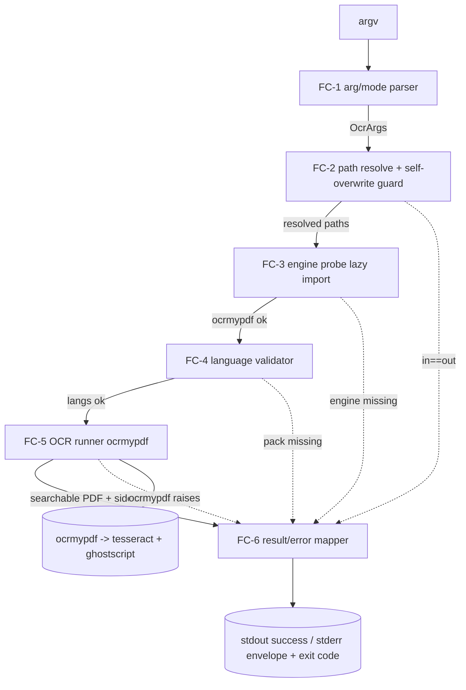
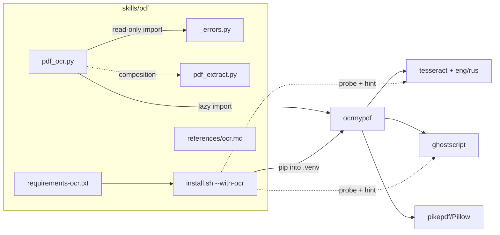

# ARCHITECTURE: `pdf_ocr.py` (pdf-4) — OCR scanned PDFs → searchable PDF (eng+rus)

> Living document, updated **in place** across tasks (architecture-format-core
> §"Living Document & Index-Mode"). It tracks the **current active epic**.
> The prior epic (wiki-ingest modular refactor, TASK 015–017) is complete and
> **archived** (`docs/tasks/task-01{5,6,7}-*.md`, `docs/plans/plan-01{5,6,7}-*.md`)
> and preserved in git history; this revision refocuses the living doc on
> TASK 018. No `architecture-NNN-*.md` snapshot is created.

---

## 1. Task Description

- **Source:** [`docs/TASK.md`](TASK.md) (TASK 018, slug `pdf-ocr`, backlog
  row `pdf-4`).
- **Review:** [`docs/reviews/task-018-review.md`](reviews/task-018-review.md)
  — APPROVED WITH COMMENTS; MAJOR items **M-1** (exit codes) and **M-3**
  (R5 MVP scope) are resolved here (§12 D-A1, D-A2).
- **Summary:** add a thin, contract-compliant CLI `skills/pdf/scripts/pdf_ocr.py`
  that wraps [`ocrmypdf`](https://ocrmypdf.readthedocs.io/) to convert an
  image-only (scanned) PDF into a **searchable PDF** — original page raster
  preserved, invisible OCR text layer overlaid — defaulting to OCR languages
  **`eng+rus`**. It is the remediation hop for `pdf_extract.py` exit
  `10 DocumentScanned`.
- **Locked decisions (TASK §0):** D-1 ocrmypdf→searchable PDF (+ optional
  `--sidecar`); D-2 soft-optional `--with-ocr` packaging; D-3 default
  `--skip-text`.
- **Template:** Core (architecture-format-core) — "adding a new component to
  an existing system" (the pdf skill). Relevant Interfaces / Security /
  Stack subsections are included because the CLI contract and the
  subprocess/dependency surface are materially load-bearing.

---

## 2. Functional Architecture

A single-process, single-file CLI that runs a linear **parse → guard →
probe → validate → delegate → map-result** pipeline. No persistent state, no
network, no concurrency beyond ocrmypdf's own per-page worker pool.

### 2.1. Functional Components

**FC-1 — Arg & mode parser**
- **Purpose:** define and parse the CLI contract; enforce the `--skip-text` /
  `--redo-ocr` / `--force-ocr` mutual exclusion.
- **Functions:**
  - parse argv → `OcrArgs` (§4.1).
    - Input: `argv`. Output: `OcrArgs` namespace, or argparse exit 2.
    - Related UC: UC-1, UC-3.
  - mode mutex: at most one of `{skip_text(default), redo_ocr, force_ocr}`.
    - Related UC: UC-3 A1.
- **Dependencies:** stdlib `argparse`; `_errors.add_json_errors_argument`.

**FC-2 — Path resolver & self-overwrite guard**
- **Purpose:** resolve INPUT/OUTPUT/`--sidecar` to absolute real paths and
  refuse destructive aliasing.
- **Functions:**
  - resolve + guard: reject `resolve(INPUT)==resolve(OUTPUT)` (exit 6
    `SelfOverwriteRefused`); reject `--sidecar` ∈ {INPUT, OUTPUT}.
    - Input: raw paths. Output: resolved `Path`s, or exit 6.
    - Related UC: UC-1 A3, UC-2.
  - input existence/readability precheck (exit 1 `InputNotFound`).
- **Dependencies:** stdlib `pathlib`. Mirrors cross-7 H1 guard in
  `pdf_extract.py` / `pdf_watermark.py`.

**FC-3 — Engine-availability probe (lazy import)**
- **Purpose:** keep the base skill light (D-2); fail loud if the optional
  engine is absent.
- **Functions:**
  - `import ocrmypdf` lazily inside the run path; on `ImportError` →
    `OcrEngineUnavailable` (exit 1 + `error_type`, §12 D-A1) with remediation
    (`bash install.sh --with-ocr` + system tesseract/gs hints).
    - Related UC: UC-1 A1.
- **Dependencies:** optional `ocrmypdf` (from `requirements-ocr.txt`).
- **Pattern parity:** sibling of pdf-11 `ChromeEngineUnavailable`
  (`html2pdf_lib/chrome_engine.py:425`).
- **Scope note (AM-3):** FC-3 probes only the `ocrmypdf` import. The R9
  pass-throughs need *additional* host checks — `--clean` requires the
  `unpaper` binary, `--rotate-pages` needs `osd` traineddata — which are added
  in **bead 05** (soft-check + degrade-with-warn), not folded into FC-3.

**FC-4 — Language validator**
- **Purpose:** turn tesseract's late, cryptic "missing traineddata" failure
  into an early, precise signal.
- **Functions:**
  - split `--lang` on `+`; compare against `tesseract --list-langs` (or
    ocrmypdf's `get_languages()` / `tesseract` API) → missing ⇒
    `LanguagePackMissing` (exit 1 + `error_type`, naming the pack + per-OS
    hint).
    - Input: `["eng","rus"]` (default) or user list. Output: validated list,
      or exit 1.
    - Related UC: UC-1 A2.
- **Dependencies:** `ocrmypdf`/`tesseract` (already gated by FC-3).

**FC-5 — OCR runner (ocrmypdf delegate)**
- **Purpose:** the actual conversion.
- **Functions:**
  - invoke `ocrmypdf.ocr(in, tmp_out, language=[...], skip_text|redo_ocr|
    force_ocr, sidecar=…, jobs=…, optional deskew/rotate/clean)` then atomic
    rename `tmp_out → OUTPUT`.
    - Input: resolved paths + `OcrArgs`. Output: searchable PDF (+ sidecar),
      or a mapped error.
    - Related UC: UC-1, UC-2, UC-3.
  - (R5, bead 4) pre-decrypt: if `--password`, open with `pikepdf` →
    decrypted temp → feed ocrmypdf → shred temp. Related UC: UC-4.
- **Dependencies:** `ocrmypdf` (→ `tesseract`, `ghostscript`, `pikepdf`).

**FC-6 — Result/error mapper & emitter**
- **Purpose:** uniform stdout success line + `--json-errors` envelope on
  failure; map ocrmypdf exceptions to the exit matrix (§5.2).
- **Functions:**
  - map `ocrmypdf.exceptions.*` (`EncryptedPdfError`, `InputFileError`,
    `MissingDependencyError`, `PriorOcrFoundError`, …) → exit codes +
    `error_type`; silence noisy `ocrmypdf`/`pikepdf`/`pdfminer` loggers
    (parity with `pdf_extract.py`).
    - Related UC: UC-1 A4/A5/A6, UC-4.
- **Dependencies:** `_errors.report_error` (read-only import).

### 2.2. Functional Components Diagram



---

## 3. System Architecture

### 3.1. Architectural Style

**Thin single-file CLI wrapper over an external engine** (layered: parse →
validate → delegate → map). Identical shape to the existing pdf CLIs
(`pdf_extract.py`, `pdf_watermark.py`, `pdf_merge.py`): one file, argparse,
`--json-errors`, deterministic exit matrix, no shared internal package.

**Justification.** YAGNI — OCR is a 1→1 file transform with a single mature
engine (ocrmypdf already orchestrates rasterization, tesseract, the text-layer
overlay, and PDF/A output). A bespoke `pdf_ocr_lib/` package (cf.
`html2pdf_lib/`) is unwarranted: there is no multi-format input matrix and no
reusable sub-logic shared with another skill. A single module maximizes the
"each skill installable/runnable in isolation" property (CLAUDE.md §2).

### 3.2. System Components

| Component | Type | Purpose | Tech | Interfaces (in/out) | Deps |
|-----------|------|---------|------|---------------------|------|
| `skills/pdf/scripts/pdf_ocr.py` | CLI script | the wrapper (FC-1…FC-6) | Python 3.10+ | in: argv; out: searchable PDF + sidecar + exit code/envelope | `ocrmypdf` (lazy), `_errors` (read-only) |
| `ocrmypdf` | External Python lib | rasterize + OCR + text-layer overlay + linearize | Python | in: paths + opts; out: PDF | `pikepdf`, `Pillow`, `tesseract`, `ghostscript` |
| `tesseract` (+ `eng`/`rus` traineddata) | External binary | the OCR engine | C++ | in: image; out: text/hOCR | system pkg |
| `ghostscript` (`gs`) | External binary | PDF rasterize/repair used by ocrmypdf | C | in/out: PDF | system pkg |
| `requirements-ocr.txt` | dep manifest | soft-optional pin (ocrmypdf>=…) | text | consumed by `install.sh --with-ocr` | — |
| `install.sh --with-ocr` | bootstrap | install ocrmypdf into `.venv`; **check** (not install) tesseract/eng/rus/gs | bash | host probe + hints | — |
| `_errors.py` | shared helper (read-only import) | `--json-errors` envelope (v=1) | Python | in: msg/code/type; out: stderr JSON | — |
| `references/ocr.md` | doc | usage, composition recipe, trust model, honest scope | md | — | — |

### 3.3. Components Diagram



---

## 4. Data Model (Conceptual)

The script is stateless; "data" = the CLI arg record, the result record, and
the error envelope.

### 4.1. `OcrArgs` (parsed CLI namespace)

| Field | Type | Default | Notes |
|-------|------|---------|-------|
| `input` | Path | — (positional) | source PDF |
| `output` | Path | — (positional) | searchable-PDF destination |
| `lang` | str | `"eng+rus"` | tesseract `+`-list; validated by FC-4 |
| `mode` | enum | `skip_text` | one of `skip_text` / `redo_ocr` / `force_ocr` (mutex) |
| `sidecar` | Path \| None | None | optional plain-text dump |
| `jobs` | int \| None | None | → ocrmypdf `jobs=` (auto = CPU count) |
| `password` | str \| None | None | R5 (bead 4); argv-visible honest-scope |
| `deskew` / `rotate_pages` / `clean` | bool | False | R9 (deferred bead) |
| `json_errors` | bool | False | cross-5 envelope toggle |

### 4.2. `OcrResult` (success, → stdout one-liner)

```jsonc
{ "output": "scan.ocr.pdf", "sidecar": "scan.txt|null",
  "lang": "eng+rus", "mode": "skip_text", "pages": 12 }
```

### 4.3. Error envelope (`--json-errors`, v=1 — `_errors.py`)

The schema is exactly `_errors.report_error`'s envelope — **`{v, error, code,
type?, details?}`** (no `ok`/`message`/`remediation` keys). The
`report_error(..., error_type=…)` argument populates the JSON `type` field; the
remediation text is folded into the `error` **message string** (the same way
pdf-11's `ChromeEngineUnavailable` message carries its install hint):

```jsonc
{ "v": 1,
  "error": "tesseract language pack 'deu' not installed. Install it: macOS `brew install tesseract-lang`; Debian `apt install tesseract-ocr-deu`; Fedora `dnf install tesseract-langpack-deu`.",
  "code": 1,
  "type": "LanguagePackMissing",
  "details": { "missing": ["deu"], "requested": "eng+rus+deu" } }
```

`type` is the **machine-readable discriminator** (§12 D-A1) — it carries the
fine-grained reason while the exit code stays coarse (`1`).

### 4.4. Derived invariants

- **I-1:** OUTPUT, when written, is a valid PDF with the same page count and
  per-page MediaBox as INPUT (R1c). Enforced by ocrmypdf; spot-checked in E2E.
- **I-2:** with default `skip_text`, pages that already carry a text layer are
  left text-unchanged (R3a). (ocrmypdf contract.)
- **I-3:** on any non-zero exit, **no** partial OUTPUT remains (atomic
  `.partial`→rename; tmp shredded on failure).

---

## 5. Interfaces

### 5.1. Public CLI

```text
pdf_ocr.py INPUT.pdf OUTPUT.pdf
           [--lang LANGS]            # default "eng+rus"; tesseract '+'-list
           [--skip-text | --redo-ocr | --force-ocr]   # default --skip-text
           [--sidecar PATH.txt]      # also emit plain text
           [--jobs N]                # ocrmypdf worker pool (default: auto)
           [--password PW]           # R5 (bead 4); decrypt before OCR
           [--deskew] [--rotate-pages] [--clean]      # R9 (deferred)
           [--json-errors]           # cross-5 machine-readable failures
```

**Decision D-A5 (resolves TASK OQ-2):** positional `INPUT OUTPUT`, not
`-o`. OCR is a 1→1 transform that reads most naturally as `in → out`
(matches `pdf_merge.py OUT A B` family); `pdf_extract.py`'s `-o` exists
because its default sink is stdout, which does not apply here (a PDF cannot
go to stdout sensibly). OUTPUT is **required** (no implicit `<input>.ocr.pdf`
— explicit sink avoids the same-name overwrite foot-gun).

### 5.2. Exit-code matrix (resolves M-1 / TASK OQ-4 — see §12 D-A1)

| Code | Symbol | When | `error_type` |
|------|--------|------|--------------|
| 0 | OK | searchable PDF written | — |
| 1 | FAIL | engine missing, lang pack missing, encrypted-without-/wrong-password, corrupt/non-PDF input, prior-OCR conflict (non-skip modes), output-write failure, internal error | `OcrEngineUnavailable` / `LanguagePackMissing` / `EncryptedInput` / `InputUnreadable` / `PriorOcrFound` / `OutputWriteFailed` / `InternalError` |
| 2 | USAGE | argparse error (incl. mode mutex, missing positional) | — |
| 6 | SELF_OVERWRITE | `resolve(IN)==resolve(OUT)` or sidecar collides | `SelfOverwriteRefused` |

**`PriorOcrFound` reachability (AM-4):** with the default `--skip-text` mode
this error is **never** raised (skip-text is precisely the no-conflict path,
D-3); it is reachable only in `--redo-ocr` / `--force-ocr` if ocrmypdf still
detects a conflict. A reader should not expect it on the default path.

**No new exit codes 10/11/12.** `10` belongs to `pdf_extract.py`
(`DocumentScanned`) and is intentionally not reused here. The originally
proposed `11`/`12` are dropped (see D-A1): the `--json-errors` envelope
`error_type` already provides the programmatic discriminator, so inventing
exit codes for dependency-failure conditions is unjustified (YAGNI) and would
diverge from the established `ChromeEngineUnavailable → exit 1` precedent in
the same skill.

### 5.3. Composition contract with `pdf_extract.py`

```bash
pdf_extract.py scan.pdf            # exit 10 DocumentScanned  (the trigger)
pdf_ocr.py     scan.pdf scan.ocr.pdf     # exit 0  (searchable PDF, eng+rus)
pdf_extract.py scan.ocr.pdf        # exit 0, doc_scanned=false, text present
```

**Contract guarantee (R4a):** for the canonical image-only fixture, the OCR'd
output makes `pdf_extract.py` report `doc_scanned=false` with non-empty
per-page `text`. This is the architecture's primary acceptance hinge and is
asserted by the E2E (tolerant case-insensitive needle; OCR is not bit-exact).

### 5.4. Internal interface

Only one external symbol set is consumed read-only:
`_errors.add_json_errors_argument` and `_errors.report_error`. No `office/`,
no shared-helper, no cross-skill import → **no replication** (CLAUDE.md §2;
see §9).

---

## 6. Technology Stack

| Layer | Choice | Floor | Justification |
|-------|--------|-------|---------------|
| Runtime | Python | 3.10+ | matches base `install.sh` floor |
| OCR orchestration | `ocrmypdf` | a **current** release (`>=16`) | per memory "prefer dependency upgrades" — pin a `>=` floor to a current artifact, not an old one; finalize the exact pin at impl time against PyPI |
| OCR engine | `tesseract` (LSTM) | `>=4` | system pkg; `eng`+`rus` traineddata required by default |
| PDF raster/repair | `ghostscript` | system `gs` | ocrmypdf hard dep |
| PDF crypto (R5) | `pikepdf` | (ocrmypdf transitive) | decrypt-to-temp pre-stage; already pulled by ocrmypdf |
| Envelope | `_errors.py` | in-repo | cross-5 parity |

`requirements.txt` (base) is **unchanged**; OCR deps live in
`requirements-ocr.txt` and are installed only via `install.sh --with-ocr`.

---

## 7. Security

Trust model is inherited and stated inline (the pdf skill has no
`references/security.md`; the OCR-specific statement goes in
`references/ocr.md`, R8c): **single-tenant, operator-supplied input;
non-multi-tenant output directory.**

- **S-1 No shell injection.** Invoke ocrmypdf via its **Python API** (or an
  argv list), never `shell=True`; user strings (`--lang`, paths) are never
  interpolated into a shell line. `--lang` is additionally constrained by
  FC-4 validation against the installed-language set before use.
- **S-2 `--password` honest-scope.** argv-visible in `ps` — documented,
  identical to `pdf_extract.py`. (No env/file alternative in v1.)
- **S-3 Temp-file lifecycle (R5 + atomic write).** Decrypted temp (R5) and
  the `.partial` output live in the OUTPUT directory (same filesystem for an
  atomic rename), are created `0600`, and are unlinked on success **and** on
  any failure path (`try/finally`). I-3.
- **S-4 Resource/DoS honest-scope.** ocrmypdf→gs/tesseract over a hostile PDF
  can be slow or memory-heavy; no global timeout in v1 (matches
  `pdf_extract.py` honest-scope). Documented in `references/ocr.md`; if a real
  hang is observed, add a `KNOWN_ISSUES.md` entry + optional `--timeout`.
- **S-5 No new auth surface.** Local CLI; no network, no AuthN/AuthZ (N/A by
  design — single-user local tool).

---

## 8. Scalability and Performance

- OCR is CPU-bound; cost ≈ pages × DPI × languages. ocrmypdf parallelizes
  across pages — expose `--jobs N` (default: ocrmypdf auto = CPU count).
- **Honest scope:** no wall-clock budget is asserted in the suite (inputs vary
  too widely); no streaming/partial output (a PDF is produced whole). These
  are documented non-goals, not regressions.

---

## 9. Cross-Skill Replication Boundary (CLAUDE.md §2)

`pdf_ocr.py` is a **docx-style per-skill CLI** (like `pdf_extract.py`,
`pdf_*.py`): it imports `_errors.py` **read-only** and touches **nothing**
under `office/` or the shared `_soffice.py` / `preview.py` / `office_passwd.py`
helper set. Therefore:

- **No 3/4-skill replication is triggered.** No `diff -qr office` obligation,
  no copy to xlsx/pptx/docx.
- `requirements-ocr.txt`, `install.sh` changes, and `references/ocr.md` are
  **pdf-only** artifacts.
- Verification at merge: the existing cross-skill `diff -q` matrix
  (`_errors.py`, `preview.py`) must stay **silent** — i.e. this task must not
  edit those shared files. (`_errors.py` is imported, not modified.)

---

## 10. Honest Scope (v1)

- No bundled OCR engine — tesseract/gs/lang packs are detected (`--with-ocr`
  probe), never installed by us.
- No layout/Markdown reconstruction — that stays `pdf_extract.py` + LLM
  composition. `pdf_ocr.py` produces a searchable PDF (+ optional flat text),
  not structured Markdown.
- No OCR-accuracy tuning beyond ocrmypdf's own knobs (`--deskew`,
  `--rotate-pages`, `--clean` are the deferred R9 surface).
- No global timeout / decompression-bomb hardening beyond ocrmypdf+gs's own.
- `--password` argv-visible (S-2). R5 produces an **unencrypted** output (we
  decrypt to OCR; re-encryption is out of scope — compose with a future
  `office_passwd`-style step if needed).

---

## 11. Atomic-Chain Skeleton (Planner handoff — Stub-First)

Proposed bead decomposition for the Planning phase (`/vdd-plan`). Stub-First:
bead 01 lands the CLI skeleton + RED E2E/unit scaffolding; later beads turn
them GREEN.

| Bead | Scope (RTM) | Stub-First role |
|------|-------------|-----------------|
| **018-01** | CLI skeleton: argparse contract, mode mutex, path/self-overwrite guards, `--json-errors` wiring, exit-matrix constants; `requirements-ocr.txt` + `install.sh --with-ocr` (probe+hints); fixtures builder (runtime image-only PDF); RED E2E + unit scaffolding | STUB + tests (Red) |
| **018-02** | FC-3 engine probe + FC-4 language validator (`OcrEngineUnavailable` / `LanguagePackMissing` envelopes, eng+rus default) | LOGIC (Green) |
| **018-03** | FC-5 OCR runner (ocrmypdf delegate: skip/redo/force, `--sidecar`, `--jobs`, atomic write) + FC-6 exception→exit mapping; **R4 composition E2E** (scan→OCR→`pdf_extract` reads needle) | LOGIC (Green) — MVP gate (R1–R4, R6–R8) |
| **018-04** | R5 password: `pikepdf` decrypt-to-temp pre-stage + UC-4 tests (post-MVP) | LOGIC |
| **018-05** | R9 image-prep pass-throughs (`--deskew`/`--rotate-pages`/`--clean`, with `osd` validation + unpaper soft-check) — open only if prioritized | LOGIC (deferrable) |
| **018-06** | Docs polish: `references/ocr.md` (usage + composition + trust model + honest scope) + `SKILL.md` surface + `pdf-to-markdown.md` cross-link; `THIRD_PARTY_NOTICES.md` (ocrmypdf/tesseract/gs); validator + `test_e2e.sh` green; backlog row `pdf-4` → done | DOC + INTEGRATION |

**MVP = beads 01–03 + 06.** Beads 04 (R5) and 05 (R9) are in-scope but gated
separately and **not** in the MVP acceptance set (resolves M-3 / OQ-3).

---

## 12. Decision-Record Summary

- **D-A1 (resolves M-1 / OQ-4 — exit codes).** Drop the tentative
  `11 OcrEngineUnavailable` / `12 LanguagePackMissing` codes. **All hard
  failures exit `1`**, discriminated by the `--json-errors` envelope
  `error_type`. Rationale: (a) matches the only existing optional-engine
  precedent in the skill, `ChromeEngineUnavailable → exit 1`
  (`html2pdf.py:302`); (b) `pdf_extract.py`'s `10 DocumentScanned` is a
  *non-failure, actionable* outcome (output IS emitted) — a distinct code is
  justified there but **not** for OCR's hard-failure conditions, where no
  output is produced; (c) YAGNI — the envelope already carries the fine-grained
  reason. `10` is reserved to `pdf_extract.py` and not reused.
- **D-A2 (resolves M-3 / OQ-3 — R5 scope).** R5 (password) is specified now
  but implemented as **bead 04, post-MVP**, and excluded from the MVP
  acceptance gate. Rationale: ocrmypdf does **not** natively accept an input
  password — it requires a `pikepdf` decrypt-to-temp pre-stage (its own
  testable unit + temp-file security surface, S-3). Cleaner as a dedicated
  Stub-First bead than bolted onto the MVP. UC-4 is labeled post-MVP
  accordingly; §2.7 acceptance criteria already exclude password.
- **D-A3 (password mechanism).** Implement R5 via `pikepdf.open(in,
  password=…)` → save decrypted temp (`0600`, OUTPUT dir) → `ocrmypdf` → shred
  temp in `finally`. Output is unencrypted (re-encryption out of scope, §10).
- **D-A4 (language validation owner).** `pdf_ocr.py` validates `--lang`
  **before** invoking ocrmypdf (FC-4), so the error is precise and early,
  rather than surfacing tesseract's late generic failure. Default exactly
  `eng+rus` (user requirement); generic for any installed pack (not
  hard-coded to two).
- **D-A5 (CLI shape, resolves OQ-2).** Positional `INPUT OUTPUT`, OUTPUT
  required; no `-o`, no implicit output name. (See §5.1.)
- **D-A6 (no lib package).** Single `pdf_ocr.py`, no `pdf_ocr_lib/` — YAGNI;
  preserves skill-isolation (§3.1).

---

## 13. Open Questions

All TASK open questions are resolved at the architecture layer:

- **OQ-1 (default lang):** locked `eng+rus`. ✅
- **OQ-2 (positional vs `-o`):** positional `INPUT OUTPUT` — D-A5. ✅
- **OQ-3 (R5/R9 scheduling):** R5 = bead 04 post-MVP; R9 = bead 05 deferrable
  — D-A2 / §11. ✅
- **OQ-4 (new exit codes):** dropped; exit 1 + `error_type` — D-A1. ✅

No blocking questions remain for the Planning phase.
