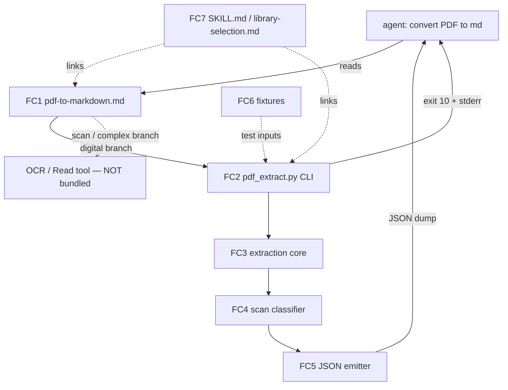
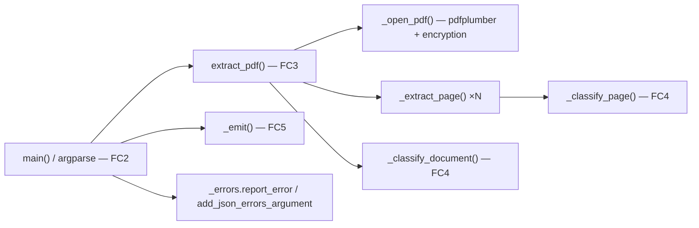

# ARCHITECTURE: TASK 013 (backlog row `pdf-12`) — PDF → Markdown extraction guidance + `pdf_extract.py`

> **Prior `docs/ARCHITECTURE.md`** (xlsx-9 — `xlsx2md.py`) **is archived
> verbatim at** [`docs/architectures/architecture-009-xlsx-9-xlsx2md.md`](architectures/architecture-009-xlsx-9-xlsx2md.md).
>
> **Status:** SPECIFIED 2026-05-21 (TASK 013 — `docs/TASK.md`). Implementation
> pending; this document defines the contract.
>
> **Template:** `architecture-format-core`, with §5 (Interfaces), §7 (Security),
> §8 (Scalability), §9 (Cross-skill replication) selectively extended — mirrors
> the precedent set by xlsx-8 / xlsx-9. This is a **small, single-script**
> addition to an existing skill (not a new system, not a >3-component refactor),
> so the Core template suffices.

---

## 1. Task Description

**TASK:** [`docs/TASK.md`](TASK.md) — TASK 013, slug `pdf-to-markdown`.

The `pdf` skill ships no PDF→Markdown extraction script by deliberate design
(`SKILL.md` §3 / §7.1: extraction is document-dependent → prompt-first). The
agent therefore improvises a `pdfplumber` script on every "convert PDF to md"
request, with two failure modes: (1) quality variance; (2) **silent empty
output on scanned PDFs** — `pdfplumber` returns empty text without raising.

This task delivers, **only inside `skills/pdf/`**:

- **E1 (Part 1, mandatory)** — `references/pdf-to-markdown.md`: a prompt-first
  reference standardising the extraction *approach* (decision tree, recipe,
  pitfalls). No code.
- **E2 (Part 2, user-confirmed in scope)** — `scripts/pdf_extract.py`: a
  structured **dump** (per-page text + tables as JSON), **not** a converter.
  Its defining feature is **scan detection** — turning the silent-empty failure
  into a loud, machine-readable signal.
- **E3** — test fixtures, E2E tests, and skill-integration edits.

**Design tenets (from TASK §1.2 Non-goals — architecturally binding):**
- No `pdf2md.py`; the helper emits JSON only, never Markdown.
- No bundled OCR — scans are *detected*, the agent is *pointed at* OCR / the
  Read tool.
- No auto-inference of heading hierarchy / reading order / table stitching —
  final Markdown composition stays agent judgement.

This architecture covers UC-1 (digital PDF → Markdown), UC-2 (scanned PDF →
loud signal), UC-3 (maintainer validation) from TASK §3.

---

## 2. Functional Architecture

### 2.1. Functional Components

**FC1 — `pdf-to-markdown.md` reference (E1)**
- **Purpose:** standardise the extraction approach so the agent stops
  improvising. Pure documentation artifact.
- **Functions:** decision tree (R1), extraction recipe (R2), pitfalls catalogue
  (R3), "MD assembly is agent's job" framing + Non-goals (R4), linkage (R5).
- **Dependencies:** none at runtime. Cross-links `library-selection.md` and
  `forms.md`; is linked back from `SKILL.md` §7.1/§12.

**FC2 — CLI front-end (`main` / argparse) (E2)**
- **Purpose:** parse argv, dispatch, own the top-level error boundary and the
  process exit code.
- **Functions:** argument parsing; `--json-errors` wiring; map outcomes /
  exceptions to exit codes {0,1,2,10}; idempotent output handoff.
- **Input:** `argv`. **Output:** process exit code; JSON dump to stdout/file;
  human or JSON-envelope errors to stderr.
- **Related UC:** UC-1, UC-2 (all scenarios), UC-3/A1.
- **Dependencies:** FC3, FC5, `_errors` (read-only import).

**FC3 — PDF extraction core (E2)**
- **Purpose:** open the PDF (incl. encryption handling) and produce the raw
  per-page data.
- **Functions:** `extract_pdf` (orchestrate), `_open_pdf` (open + encryption),
  `_extract_page` (per-page text + tables + `char_count` + `has_images`).
- **Input:** PDF path, optional password, `layout` flag.
  **Output:** the dump `dict` (pre-classification pages list).
- **Related UC:** UC-1 main, UC-1/A1-A3, UC-2/A1.
- **Dependencies:** `pdfplumber`.

**FC4 — Scan classifier (E2)**
- **Purpose:** the feature's reason for existing — decide per-page `scanned`
  and document-level `doc_scanned` / `scanned_pages`.
- **Functions:** `_classify_page` (per-page predicate, owns the threshold
  constant), `_classify_document` (aggregate + the blank-page rule R8.2a).
- **Input:** per-page `char_count` + `has_images`; the pages list.
  **Output:** `bool` per page; `(doc_scanned, scanned_pages)` for the document.
- **Related UC:** UC-2 main + A2 (mixed) + A3 (all-blank).
- **Dependencies:** none (pure functions).

**FC5 — JSON emitter (E2)**
- **Purpose:** serialise the dump; route to stdout or `-o` file; idempotent.
- **Functions:** `_emit` — `json.dump(ensure_ascii=False, indent=2)`; overwrite
  on `-o`.
- **Related UC:** UC-1 main, UC-3/idempotency.

**FC6 — Fixtures + builder (E3)**
- **Purpose:** reproducible test inputs.
- **Functions:** build a digital PDF (text + table), a scan-like PDF
  (image-only page, `char_count` clearly ≤ threshold), an encrypted PDF.
- **Dependencies:** `reportlab` (draw), `Pillow` (rasterise text → image),
  `pypdf` (encrypt). All already pdf-skill dependencies.

**FC7 — Skill integration (E3)**
- **Purpose:** wire the two new artifacts into the skill so they are
  discoverable and `validate_skill.py` stays green.
- **Functions:** edit `SKILL.md` (§2/§4/§10/§12, review §1/§3); cross-link
  `references/library-selection.md`; update the existing `pdf-12` backlog row
  to the refined single-script design.

### 2.2. Functional Components Diagram



---

## 3. System Architecture

### 3.1. Architectural Style

**Single self-contained CLI script** + a standalone Markdown reference.

**Justification (YAGNI):** the sibling pdf scripts `pdf_split.py`,
`pdf_merge.py`, `pdf_watermark.py`, `pdf_fill_form.py` are each a single file;
only `html2pdf.py` warranted a `html2pdf_lib/` package because it is ~2 000 LOC.
`pdf_extract.py` is estimated ≤ ~350 LOC — a single file
`skills/pdf/scripts/pdf_extract.py` is correct and consistent. No package, no
new sub-directory for the script. (Tests already live in `scripts/tests/`;
fixtures get a new `scripts/tests/fixtures/` directory.)

### 3.2. System Components

**Component: `skills/pdf/scripts/pdf_extract.py`**
- **Type:** Python 3 CLI script.
- **Purpose:** structured per-page dump of a PDF as JSON, with scan detection.
- **Implemented functions:** FC2 + FC3 + FC4 + FC5.
- **Technologies:** Python 3, `pdfplumber`, stdlib `argparse` / `json` /
  `pathlib`; `_errors` (sibling module, read-only import).
- **Interfaces — Inbound:** invoked from the shell / agent:
  `python3 scripts/pdf_extract.py INPUT.pdf [...]`.
- **Interfaces — Outbound:** reads the input PDF; writes JSON to stdout or the
  `-o` path; writes errors/warnings to stderr.
- **Dependencies:** `pdfplumber` (declared in `requirements.txt`); `_errors.py`.

**Component: `skills/pdf/references/pdf-to-markdown.md`**
- **Type:** Markdown reference document.
- **Purpose:** FC1.
- **Interfaces:** linked from `SKILL.md` §7.1/§12 and
  `references/library-selection.md`; back-links `library-selection.md`,
  `forms.md`.

**Component: `skills/pdf/scripts/tests/` additions**
- **Type:** test code + fixture builder + binary fixtures.
- **Files:** `test_pdf_extract.py` (unittest), `_pdf_extract_fixtures.py`
  (builder — mirrors the existing `_acroform_fixture.py` pattern),
  `fixtures/*.pdf` (committed), a smoke block appended to `test_e2e.sh`.

**Unchanged components (explicitly NOT touched):** `md2pdf.py`, `html2pdf.py`,
`html2pdf_lib/`, `pdf_merge.py`, `pdf_split.py`, `pdf_watermark.py`,
`pdf_fill_form.py`, `preview.py`, `_errors.py`, `requirements*.txt`.

### 3.3. Components Diagram



---

## 4. Data Model (Conceptual)

There is no persistent store. The single data entity is the **dump document** —
the JSON object `pdf_extract.py` emits. It is the public contract (TASK R7.1).

### 4.1. Entity: `DumpDocument`

```jsonc
{
  "page_count":    12,        // int   — number of pages in the PDF
  "doc_scanned":   false,     // bool  — whole-document scan verdict (see 4.3)
  "scanned_pages": [9, 10],   // int[] — 1-indexed pages with scanned==true
  "pages": [ /* PageRecord, document order */ ]
}
```

**Business rules:**
- All four top-level keys are contract fields — always present (TASK R7.1).
  `scanned_pages` is `[]` when no page is scanned (never omitted).
- `page_count == len(pages)`.

### 4.2. Entity: `PageRecord`

```jsonc
{
  "n":          1,             // int  — 1-indexed page number, document order
  "text":       "…",           // str  — extract_text() result; "" if page yields None
  "tables":     [ [ ["a","b"], ["c",null] ] ],  // raw extract_tables() form
  "char_count": 412,           // int  — len(text.strip()); the classification input
  "has_images": false,         // bool — bool(page.images)
  "scanned":    false          // bool — _classify_page(char_count, has_images)
}
```

**Business rules:**
- `text` — `page.extract_text(layout=<--layout>) or ""`. Empty pages → `""`.
- `char_count = len(text.strip())` — leading/trailing whitespace removed so a
  whitespace-only page scores 0. **Honest-scope note:** with `--layout`,
  `extract_text` pads *internal* gaps with spaces that `.strip()` does not
  remove, so `char_count` is inflated on column-bearing pages — harmless,
  because the threshold (10) has wide margin and a genuine scan still scores ≈0.
- `tables` — `page.extract_tables()` raw output verbatim: a list of tables,
  each a list of row-lists of `str | None`; `None` (empty cell) → JSON `null`.
  Default `extract_tables()` settings only (TASK §1.4(c) — no tuning).
- `has_images = bool(page.images)`.

### 4.3. Derived rule: `scanned` and `doc_scanned`

Module constant: **`_SCANNED_CHAR_THRESHOLD = 10`** (TASK R8.1a, Q-3 →
absolute extractable-char count per page).

> **Rationale for 10** (must be reproduced in the helper docstring AND
> `pdf-to-markdown.md`, per TASK R8.1a): an image-only page's only extractable
> text is the occasional digitally-stamped page number or Bates number — a
> handful of characters. The threshold is `10` rather than `0` precisely to
> tolerate such real-world stamping. A digital page carrying genuine content
> essentially always exceeds 10 stripped characters. The dual `has_images`
> condition prevents a sparse digital page from being misread as scanned.
>
> **Interaction with `--layout` (reviewer M-4):** a genuinely image-only page
> has *no* character objects at all, so `extract_text` returns `""` and
> `char_count` is `0` under **both** default and `--layout` extraction — the
> §4.2 layout-padding inflation applies only to pages that *already* contain
> text. The classification is therefore stable across modes. The scan-like
> fixture (FC6) MUST contain **zero selectable text** (no stamped page number)
> so its score is unambiguously `0` — well clear of the threshold and
> independent of `--layout`.

```python
# per page
scanned = (char_count <= _SCANNED_CHAR_THRESHOLD) and has_images

# document
scanned_pages = [p.n for p in pages if p.scanned]
no_meaningful_text = all(p.char_count <= _SCANNED_CHAR_THRESHOLD for p in pages)
doc_scanned = bool(scanned_pages) and no_meaningful_text
```

**Boundary cases (TASK R8.2 / R8.2a, reviewer M-2) — locked truth table:**

| Document | `scanned_pages` | `doc_scanned` | exit |
|----------|-----------------|---------------|------|
| All pages image-only, ≈0 text | all pages | **true** | **10** |
| Single-page PDF, that page image-only ≈0 text | `[1]` | **true** | **10** |
| Digital pages + some image-only pages | the image pages | false | 0 |
| Every page has images, but ≥1 page also has >10 chars text | the ≤10-char image pages | false | 0 |
| All pages blank (no text, **no images**) | `[]` | **false** | 0 |
| Empty PDF (0 pages) | `[]` | false | 0 |
| ≥1 image-only page + remaining pages blank | the image pages | true | 10 |

Two guards make the verdict robust:
- **`bool(scanned_pages)`** — a document with **zero** scanned pages is **never**
  `doc_scanned` (an all-blank PDF must not be sent to OCR).
- **`no_meaningful_text`** — a page carrying genuine text (`char_count > 10`),
  *even one that also has images*, keeps `doc_scanned` false: such a document is
  still text-extractable and must not be routed to OCR. A digital page therefore
  never forces `doc_scanned`, regardless of `has_images`.

---

## 5. Interfaces

### 5.1. CLI contract (TASK R9.1)

```
python3 scripts/pdf_extract.py INPUT.pdf [-o OUT.json] [--layout]
                               [--password PW] [--json-errors]
```

| Arg | Meaning |
|-----|---------|
| `INPUT.pdf` | positional, required — path to the PDF |
| `-o OUT.json` | optional — write the dump to this file (overwrite); default = stdout |
| `--layout` | pass-through → `extract_text(layout=True)` (column-preserving) |
| `--password PW` | password for an encrypted PDF |
| `--json-errors` | emit failures as the `_errors` JSON envelope (schema `v=1`) |

`--help` and the module docstring MUST state plainly: *produces a structured
dump, not finished Markdown — final Markdown composition is the caller's job*
(TASK R10.2/R10.3).

### 5.2. Exit codes (TASK R9.3)

| Code | Constant | Meaning | Envelope `type` |
|------|----------|---------|-----------------|
| `0` | `_EXIT_OK` | Success — dump emitted (digital, mixed, or all-blank PDF) | — |
| `1` | `_EXIT_FAIL` | Input missing / not a PDF or corrupt / encrypted-without-valid-password / `-o` unwritable / unexpected internal error | `InputNotFound` · `CorruptPdf` · `EncryptedPDF` · `OutputWriteFailed` · `InternalError` |
| `2` | `_EXIT_USAGE` | argparse usage error (routed through the envelope) | `UsageError` |
| `6` | `_EXIT_SELF_OVERWRITE` | `-o` output path resolves to the input PDF (cross-7 parity) | `SelfOverwriteRefused` |
| `10` | `_EXIT_SCANNED` | Whole-document scan — dump still emitted, stderr points at OCR / Read tool | `DocumentScanned` |

- An unexpected exception reaching the top-level boundary → exit `1`, type
  `InternalError` (defensive catch-all; should never fire in tests).
- A non-PDF / structurally-broken file is reported as `CorruptPdf` — there is no
  separate `NotAPdf` type, since from pdfplumber's view a non-PDF *is* a
  failed-open; one honest type, message conveys "corrupt or not a PDF".
- **`6 = SelfOverwriteRefused`** (vdd-multi security finding) — `main` resolves
  `INPUT` and `-o` (symlinks followed via `Path.resolve()`); if they are the
  same file it refuses before opening, so the dump never truncates the input.
  Mirrors the cross-7 same-path guard the sibling pdf CLIs (`pdf_watermark.py`,
  `html2pdf.py`) already ship.
- **Whole-doc scan is not an "error":** the dump is still written to its normal
  sink — **stdout or `-o`** — and exit `10` + the stderr message is the loud
  signal (TASK R8.5).
- **stdout vs `--json-errors` (reviewer M-3):** `--json-errors` governs **only
  the stderr channel** — it switches the human error message for the JSON
  envelope. **stdout always carries the JSON dump, never the envelope**, on
  every exit path including a whole-doc scan. A scanned-input pipeline should
  prefer `-o OUT.json` so the dump file and the stderr `DocumentScanned` signal
  never interleave on one stream.
- **Exit codes are per-script, not a shared pdf-skill namespace.**
  `pdf_fill_form.py` already defines `10`/`11`/`12` (`EXIT_FILL_ERROR` /
  `EXIT_XFA` / `EXIT_NO_FORM`) — this is **not** a collision, because each
  script owns its own exit-code space. `pdf_extract.py` defines
  `10 = DocumentScanned`; the only skill-wide rule is "custom codes ≥ 10 (0–9
  reserved for argparse / shell)", which `10` satisfies. The `--json-errors`
  `type` field is the unambiguous discriminator if a wrapper drives both
  scripts.

### 5.3. `--json-errors` envelope

Wired via `_errors.add_json_errors_argument(parser)` and
`_errors.report_error(...)` — identical usage to `pdf_split.py` /
`pdf_fill_form.py`. Envelope: `{"v":1,"error":…,"code":…,"type":…,"details":…}`.
The whole-doc-scan signal under `--json-errors` is
`{"v":1,"error":…,"code":10,"type":"DocumentScanned","details":{"page_count":N}}`.

### 5.4. Internal interfaces (function contracts)

```python
_SCANNED_CHAR_THRESHOLD = 10
_EXIT_OK, _EXIT_FAIL, _EXIT_USAGE, _EXIT_SCANNED = 0, 1, 2, 10

def main(argv: list[str] | None = None) -> int
    # parse → extract → classify → emit → return exit code. Owns the
    # try/except boundary that maps exceptions to 1/2/10.

def _build_parser() -> argparse.ArgumentParser
    # argparse + add_json_errors_argument().

def extract_pdf(pdf_path: Path, *, password: str | None, layout: bool) -> dict
    # open → per-page extract → classify document → return DumpDocument dict.
    # OWNS the pdfplumber handle: opens it inside a `with _open_pdf(...) as pdf:`
    # block so the file descriptor is released even if a mid-extraction
    # exception is raised. The handle never escapes this function.

def _open_pdf(pdf_path: Path, password: str | None)  # -> pdfplumber.PDF (context manager)
    # opens via pdfplumber and returns the PDF object for use as a context
    # manager by extract_pdf (the SOLE caller, which owns closing it);
    # translates pdfminer password exceptions into a caller-visible
    # EncryptedPDF failure; never returns a silently-empty doc.

def _extract_page(page, *, layout: bool) -> dict
    # one PageRecord (incl. char_count, has_images, scanned via _classify_page).

def _classify_page(char_count: int, has_images: bool) -> bool
    # scanned predicate — the ONLY site that reads _SCANNED_CHAR_THRESHOLD.

def _classify_document(pages: list[dict]) -> tuple[bool, list[int]]
    # (doc_scanned, scanned_pages) per §4.3 — incl. the blank-page guard.

def _emit(dump: dict, out_path: Path | None) -> None
    # json.dump(ensure_ascii=False, indent=2) to stdout or out_path (overwrite).
```

---

## 6. Technology Stack

| Concern | Choice | Justification |
|---------|--------|---------------|
| PDF text/table extraction | `pdfplumber` | Already a declared pdf-skill dependency (`SKILL.md` §6); the skill's documented tool for layout-aware extraction (`library-selection.md`). |
| Encryption handling | `pdfplumber` native `password=` kwarg | `pdfplumber.open(path, password=…)`; pdfminer raises on a bad/missing password — caught and re-reported. No separate `pypdf` round-trip needed for *reading*. |
| Error envelope | `_errors.py` (sibling, read-only) | Cross-skill uniform `--json-errors` contract. **Imported, never modified** → no CLAUDE.md §2 replication. |
| CLI / JSON | stdlib `argparse`, `json`, `pathlib` | Zero new dependency. |
| Fixture building | `reportlab` (draw) · `Pillow` (text→image raster) · `pypdf` (encrypt) | All already pdf-skill dependencies; reused only in `tests/`. |

**No new runtime dependency.** `requirements.txt`, `requirements-chrome.txt`,
`LICENSE`, `NOTICE`, and root `THIRD_PARTY_NOTICES.md` are unchanged.

---

## 7. Security

The trust model matches the other pdf scripts: a local CLI operating on
caller-named paths. No authN/authZ surface (no network, no multi-tenant state).

- **No remote fetch.** `pdfplumber` reads only the local input path. The script
  issues no network call.
- **Path scope.** Only `INPUT.pdf` and `-o OUT.json` are touched. `-o`
  overwrites without prompting — consistent with every other pdf script and
  documented in `SKILL.md` §5 (destructive actions).
- **Encrypted input — never silent.** `_open_pdf` detects an encrypted PDF and
  fails loudly (`EncryptedPDF`, exit 1) rather than returning empty pages. This
  is itself a security property: it closes the same silent-failure class the
  whole feature targets. PDF *decryption-cracking* is out of scope.
- **`--password` on argv** is visible in `ps`/process listings. Accepted for the
  local-CLI trust model and **documented** in `--help` and `SKILL.md`; an env-var
  password source is a possible future hardening (§12 Q-2), not v1.
- **Untrusted PDF text is data, not code.** Extracted `text` / `tables` may
  contain arbitrary strings (including Markdown/HTML metacharacters). The dump
  is `json.dump`-escaped — safe as JSON. The *downstream* risk (the agent
  pasting cell text into Markdown verbatim) is a **composition** concern: the
  reference doc (`pdf-to-markdown.md`) MUST flag that extracted content is
  untrusted and the agent owns escaping. The helper itself emits JSON only and
  performs no Markdown rendering (TASK R10.4) — so it introduces no injection
  sink.
- **Malformed / adversarial PDF.** A corrupt PDF raises inside `pdfplumber`;
  caught at the boundary → `CorruptPdf`, exit 1. Decompression-bomb / pathologic
  PDFs are not specifically hardened (see §8 + §10): there is no timeout or
  page-count cap, so a pathological PDF can **hang** (not just crash) — same
  posture as the other pdf extraction tooling, accepted for v1.
- **Output path.** `main` refuses (`SelfOverwriteRefused`, exit 6) when `-o`
  resolves to the input PDF — `Path.resolve()` follows symlinks, so a symlinked
  `-o` pointing back at the input is also caught. Beyond that, `-o` writes
  wherever the caller names it (single-user local-CLI trust model).
- **Owner-only encryption.** The "encryption is never silent" property covers
  PDFs that *require* a password to open. A PDF encrypted with only an *owner*
  password (blank user password — common "open freely, restrict editing")
  opens without a password and is treated as a normal digital PDF; no
  encryption signal is raised because the content is genuinely extractable.
  Recorded in §10 honest-scope.

---

## 8. Scalability and Performance

- **Expected scale:** documents up to ~50–100 pages; sub-second to a few
  seconds. No throughput target (TASK §4).
- **Single open pass (success path).** On a successful extraction there is one
  `pdfplumber.open()`; pages iterated once; no double text extraction even with
  `--layout` (one `extract_text` call per page, mode chosen by the flag). Note:
  each page still pays one `extract_text` **plus** one `extract_tables`
  geometry pass — both are needed, this is not double work. On the **failure**
  path the cost is two parses: `pdfplumber.open()` fails, then `_is_encrypted`
  constructs a `pypdf.PdfReader` (a second parse) purely to label the error
  `EncryptedPDF` vs `CorruptPdf`. This is a cold path (the open already failed)
  — accepted; `_is_encrypted`'s docstring states it is not cheap.
- **Memory honest-scope.** The `DumpDocument` holds every page's `text` +
  `tables` in memory before emit — `O(total extractable content)`. For ordinary
  documents this is negligible; a pathologically large PDF (thousands of
  text-dense pages) would peak proportionally. Streaming the dump page-by-page
  is **out of scope for v1** (§10) — recorded, not built. `_emit` serialises
  straight to the sink with `json.dump` (no intermediate full-string copy).
- **No caching, no concurrency** — a one-shot CLI; YAGNI.

---

## 9. Cross-Skill Replication Boundary (CLAUDE.md §2)

**This task triggers NO cross-skill replication.**

- All new/edited files live under `skills/pdf/` only:
  `scripts/pdf_extract.py`, `references/pdf-to-markdown.md`,
  `scripts/tests/test_pdf_extract.py`, `scripts/tests/_pdf_extract_fixtures.py`,
  `scripts/tests/fixtures/*`, plus edits to `skills/pdf/SKILL.md`,
  `skills/pdf/references/library-selection.md`, and `docs/office-skills-backlog.md`.
- `pdf_extract.py` **imports `_errors`** (the 4-skill byte-identical
  `--json-errors` helper) **read-only** — exactly as `pdf_split.py` etc. do. It
  does **not** modify `_errors.py`, `preview.py`, `office/`, `_soffice.py`, or
  `office_passwd.py`.
- The replicated-file invariant MUST stay silent after this task:
  ```bash
  diff -q skills/docx/scripts/_errors.py  skills/pdf/scripts/_errors.py
  diff -q skills/docx/scripts/preview.py  skills/pdf/scripts/preview.py
  ```
  Both produce no output. This is asserted in the final integration task.

---

## 10. Honest Scope (v1)

Each item is documented in the relevant file (helper docstring and/or
`pdf-to-markdown.md`) so documentation never overstates the deliverable
(root `CLAUDE.md` §3 "Honest scope, not aspirational").

- **(a)** Final Markdown composition — heading levels, reading order, cross-page
  table stitching, image/diagram prose — is **agent judgement**, not scripted.
- **(b)** OCR is not bundled — detection + pointer only.
- **(c)** Non-default table-detection tuning (`snap_tolerance`, text-vs-lines
  strategy, explicit edges) — the helper uses default `extract_tables()`; the
  reference tells the agent to drop to inline `pdfplumber` when defaults miss a
  borderless table.
- **(d)** Image bytes are not extracted — only `has_images` is reported.
- **(e)** `--layout` preserves columns as whitespace; it does **not** reflow
  multi-column text into logical reading order.
- **(f)** `char_count` is inflated by layout padding when `--layout` is set
  (§4.2) — accepted; classification is robust regardless.
- **(g)** No streaming emit — the whole dump is built in memory (§8).
- **(h)** Decompression-bomb / adversarial-PDF hardening is not specifically
  addressed beyond the corrupt-PDF catch (§7): there is **no timeout or
  page-count cap**, so a pathological PDF can *hang*, not only crash.
- **(i)** `--password` is read from argv only — no env-var / prompt source in v1
  (§12 Q-2).
- **(j)** "Encryption never silent" covers PDFs that *require* a password. A
  PDF encrypted with only an *owner* password (blank user password) opens
  without a password and is treated as a normal digital PDF — no encryption
  signal, because the content is genuinely extractable (vdd-multi logic finding;
  documented in the helper docstring + `pdf-to-markdown.md`).

---

## 11. Atomic-Chain Skeleton (Planner handoff)

Suggested decomposition under **Stub-First** (TIER 1 `tdd-stub-first`). The
Planner owns the final cut; this is the architect's hint. Estimated 6 beads:

| # | Bead | Type | Covers | Notes |
|---|------|------|--------|-------|
| 013-01 | `pdf_extract.py` skeleton + test scaffolding + fixture builder | **[STUB CREATION]** | R6/R7/R9 signatures; R11 fixtures | All functions stubbed (hardcoded returns); `test_pdf_extract.py` written RED; `_pdf_extract_fixtures.py` + the 3 fixtures (digital, scan-like, encrypted) built and committed. Verify imports + argparse parse. |
| 013-02 | Extraction core | **[LOGIC]** | R6, R7.1–7.4 | `_open_pdf` (incl. encryption → `EncryptedPDF`), `_extract_page`, `extract_pdf`. Green: digital-fixture dump correct. |
| 013-03 | Scan classifier | **[LOGIC]** | R8 (all), §4.3 truth table | `_classify_page`, `_classify_document`, threshold constant + documented rationale, blank-page guard. Green: scan-like → doc_scanned; all-blank → not. |
| 013-04 | CLI glue + emitter | **[LOGIC]** | R9, R7.3/7.5, R10 | `main`, `_emit`, `--json-errors`, exit-code matrix {0,1,2,10}, idempotency, `--password` success path, honest-name docstring. Green: full E2E incl. R12.7. |
| 013-05 | Reference doc | **[DOC]** | E1 — R1–R5 | `references/pdf-to-markdown.md`. Independent of code; may run in parallel after 013-01 fixes the CLI contract. Must restate the threshold rationale (R8.1a). |
| 013-06 | Skill integration + validation | **[INTEGRATION]** | R5, R12.6, R13 | `SKILL.md` §2/§4/§10/§12 (+ review §1/§3); `library-selection.md` cross-link; existing `pdf-12` backlog row updated to the refined design; `test_e2e.sh` smoke block; `validate_skill.py` exit 0; cross-skill `diff -q` silent. |

Dependency order: 013-01 → {013-02 → 013-03 → 013-04} ; 013-05 after 013-01 ;
013-06 last.

> **RTM-coverage note (reviewer m-3):** the R8.1a threshold *rationale* is
> deliberately dual-homed — bead 013-03 places it in the `pdf_extract.py` module
> docstring, bead 013-05 places the same rationale in
> `references/pdf-to-markdown.md`. Both copies are required by TASK R8.1a; the
> Planner should treat them as one logical requirement satisfied in two files,
> not two independent items.

---

## 12. Open Questions

All resolved with a documented default — non-blocking; the Architecture-Reviewer
/ Planner may confirm or override.

- **Q-1 (resolved → §4.3):** scan-detection threshold value. Resolved:
  `_SCANNED_CHAR_THRESHOLD = 10` extractable chars per page, with the rationale
  recorded in §4.3 (and to be reproduced in the helper docstring + reference per
  TASK R8.1a). Override only if a real fixture proves misclassification.
- **Q-2 (resolved → §7, §10(i)):** `--password` source. Resolved: argv only in
  v1; argv visibility documented; env-var source deferred. Override if a
  pipeline needs to avoid argv-visible secrets.
- **Q-3 (resolved → §3.1):** single script vs package. Resolved: single file
  `pdf_extract.py` (YAGNI; consistent with the sibling pdf scripts). Revisit
  only if the file exceeds ~400 LOC in implementation.
- **Q-4 (resolved → §5.4):** JSON formatting. Resolved: `indent=2`,
  `ensure_ascii=False` — the dump is meant to be read by the agent; readability
  beats compactness at the expected document scale.

No question blocks the Planning phase.

---

## 13. Decision-Record Summary

> **Identifier note (reviewer m-2):** this work has two identifiers, both
> correct. **`TASK 013`** is the global task-sequence ID (drives `docs/TASK.md`,
> the `docs/tasks/task-013-*` archive name, and the `013-NN` bead IDs).
> **`pdf-12`** is the *backlog row* in `docs/office-skills-backlog.md` — it
> **pre-exists** (P0 "agentic read-loop" tier, originally scoped as two scripts
> with a `--format markdown` mode); bead 013-06 *updates* it to TASK 013's
> refined single-`pdf_extract.py`-dump + reference-doc design — it is not newly
> created. The architecture title carries both. There is no `pdf-13`.

| ID | Decision | Rationale |
|----|----------|-----------|
| D1 | `docs/ARCHITECTURE.md` archived per-task → `architectures/architecture-009-…`; fresh doc for TASK 013 | Established, self-documented repo practice (architecture-001..009); overrides the generic framework "living document" rule per `core-principles` §0. |
| D2 | Single file `scripts/pdf_extract.py`, no package | YAGNI; matches `pdf_split.py` / `pdf_fill_form.py`; est. ≤ 350 LOC. |
| D3 | Helper emits **JSON only**, never Markdown; named `pdf_extract.py` | TASK Non-goal — no "magic converter"; the name must not promise finished MD. |
| D4 | Scan = `char_count ≤ 10 AND has_images`; `doc_scanned` guarded by `bool(scanned_pages)` | Dual condition avoids misclassifying sparse digital pages; the guard prevents an all-blank PDF being sent to OCR (reviewer M-2). |
| D5 | Whole-doc scan → exit `10` + stderr + dump still emitted on stdout/`-o` | Strongest loud signal a wrapper cannot miss (TASK Q-2/A-3). Exit codes are per-script; `10` satisfies the skill-wide "custom codes ≥ 10" rule. `pdf_fill_form.py` independently uses 10/11/12 — not a collision, since each script owns its own code space (`type` field disambiguates). |
| D6 | `_errors.py` imported read-only | Uniform `--json-errors`; no CLAUDE.md §2 replication triggered. |
| D7 | `char_count = len(text.strip())`, single extraction even with `--layout` | Simplicity; threshold margin keeps classification robust despite layout padding. |
| D8 | Encryption handled via `pdfplumber` native `password=`; bad/absent password → `EncryptedPDF` exit 1 | No silent-empty on encrypted input — the same failure class the feature exists to kill. |
| D9 | Fixtures built by a committed `_pdf_extract_fixtures.py` (reportlab + Pillow + pypdf) | Reproducible, no opaque binary blobs; mirrors the existing `_acroform_fixture.py` pattern. |
