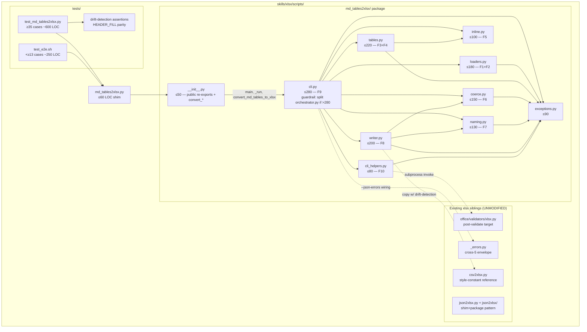
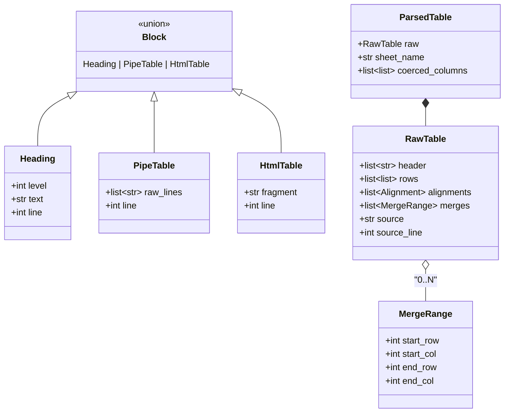

# ARCHITECTURE: xlsx-3 — `md_tables2xlsx.py` (Markdown tables → multi-sheet .xlsx)

> **Template:** `architecture-format-core` (this is a NEW component
> added to an existing skill, NOT a new system — TIER-2 conditions
> not met). Three immediately preceding xlsx architectures are
> archived as reference precedent:
>
> - xlsx-6 (`xlsx_add_comment.py`, Tasks 001+002 — MERGED 2026-05-08):
>   [`docs/architectures/architecture-001-xlsx-add-comment.md`](architectures/architecture-001-xlsx-add-comment.md)
> - xlsx-7 (`xlsx_check_rules.py`, Task 003 — MERGED 2026-05-08):
>   [`docs/architectures/architecture-002-xlsx-check-rules.md`](architectures/architecture-002-xlsx-check-rules.md)
> - xlsx-2 (`json2xlsx.py`, Task 004 — MERGED 2026-05-11):
>   [`docs/architectures/architecture-003-json2xlsx.md`](architectures/architecture-003-json2xlsx.md)
>
> xlsx-2 establishes the **shim + package + cross-5/cross-7** pattern
> that xlsx-3 inherits 1:1. csv2xlsx (`skills/xlsx/scripts/csv2xlsx.py`,
> 203 LOC, MERGED) is the **visual / styling reference** xlsx-3
> mirrors 1:1 (`HEADER_FILL`, `HEADER_FONT`, freeze, auto-filter,
> column widths).
>
> **Status (2026-05-11):** **DRAFT** — pre-Planning. To be locked by
> architect-reviewer before Planning phase commences.

## 1. Task Description

- **TASK:** [`docs/TASK.md`](TASK.md) (Task 005, slug `md-tables2xlsx`,
  draft v2 — task-reviewer M1/M2/M3 + m1/m3/m8/m9/m10 applied per
  [`docs/reviews/task-005-review.md`](reviews/task-005-review.md)).
- **Brief summary of requirements:** Ship `skills/xlsx/scripts/md_tables2xlsx.py`
  — a CLI that reads a markdown document from a file path or stdin
  and emits a multi-sheet styled `.xlsx` workbook with one sheet per
  extracted table. Two table flavors are recognised: GFM pipe tables
  (with column alignment) and HTML `<table>` blocks (with `colspan` /
  `rowspan` merged cells). Sheet names derive from the nearest
  preceding heading; fallback `Table-N`. Default-on numeric / ISO-date
  cell coercion; inline-markdown is stripped to plain text. Output
  styling matches csv2xlsx + json2xlsx 1:1. Closes the "user pasted a
  markdown spec, give me Excel" loop with a deterministic CLI.

- **Decisions this document closes** (TASK Open Questions — all
  scope-blocking pre-locked at Analysis; remaining questions are
  architecture-layer details documented in §11):

  | Layer | Decision | Locked in |
  |---|---|---|
  | **A1** | The package owns the body; the shim is a 50-line re-export only. | TASK §8 + this doc §3.2. |
  | **A2** | F9 (CLI) is **one module** at v1, not two. xlsx-2 split argparse from `_run` only because flag count crossed 8; xlsx-3 has 8 flags total, well below the split threshold. Guardrail: split if `cli.py` exceeds **280** LOC (M2 review-fix; matches §3.2 + §3.3). | This doc §3.2. |
  | **A3** | The post-validate hook subprocess-invokes `office/validate.py` (NOT imports it). Cross-skill replication boundary preserved. Same pattern as xlsx-2 / xlsx-6. | This doc §3.2 + §9. |
  | **A4** | Pandas deliberately avoided (same rationale as xlsx-2: import cost + `infer_objects` heuristic conflict). | This doc §6 "Pandas deliberately avoided". |
  | **A5** | GFM parser is **hand-rolled** (no external `markdown` / `mistune` / `cmark` dependency). HTML `<table>` parser uses `lxml.html` (already in `requirements.txt:3`). | This doc §6. |
  | **A6** | Tables inside fenced code blocks and HTML comments are stripped by a **pre-scan pass** before any table-parser sees the document. Single source of truth for the scrub. | This doc §2 / F2. |

- **Decisions inherited from TASK §0** (D1–D8, locked at Analysis +
  task-reviewer round-1; reproduced here so this document is
  self-contained and the Planner handoff is gap-free):

  | D | Decision |
  |---|---|
  | D1 | **Two table flavors:** GFM pipe tables + HTML `<table>` blocks. RST grid / MultiMarkdown / PHP-Markdown-Extra captions / blockquoted tables deferred to v2. |
  | D2 | **Sheet naming** = nearest preceding heading + sanitisation algorithm steps 1–9 (TASK §0/D2). Fallback `Table-N`. Workbook-wide case-insensitive dedup with suffix `-2`..`-99`; overflow → `InvalidSheetName` exit 2. |
  | D3 | **Cell coercion default-on:** numeric (leading-zero-aware), ISO-date (date / datetime; aware→UTC-naive), inline-markdown stripped, empty cell→`None`. Opt-out: `--no-coerce`. |
  | D4 | **Full cross-cutting parity** — cross-5 envelope, cross-7 H1 same-path guard, stdin `-`. Cross-3 / cross-4 N/A (input is markdown, not OOXML). |
  | D5 | **Atomic chain** (7–10 sub-tasks; Planner locks the slice). Shim + package up front (Task-004 D5 pattern). |
  | D6 | **Heading walk crosses fenced-code-block boundaries** (pre-scan strips fenced blocks, so a heading *before* a code block IS the nearest preceding heading for a table *after* it). |
  | D7 | **No `Source`-cell or provenance metadata in v1.** `Worksheet.title` is enough; agents needing provenance use `xlsx_add_comment.py` downstream. |
  | D8 | **`XLSX_MD_TABLES_POST_VALIDATE` env-var default OFF.** Opt-in only; CI sets it. |

---

## 2. Functional Architecture

> **Convention:** F1–F9 are functional regions. Each maps 1:1 to one
> module in §3.2 (no module owns more than one region; no region
> spans more than one module). Mirrors xlsx-2's F1–F8 layout.

### 2.1. Functional Components

#### F1 — Input Reader & Pre-Scan

**Purpose:** Acquire raw markdown bytes from a file path or stdin,
decode UTF-8 strictly, and run the pre-scan that strips fenced code
blocks (```` ``` ````, `~~~`, indented) and HTML comments (`<!-- -->`)
into "scrub-mask" regions so downstream parsers never see "tables"
that are actually code samples or commented-out content.

**Functions:**
- `read_input(path: str, encoding: str) -> tuple[str, str]`
  - **Input:** path string (file path or sentinel `-`), encoding.
  - **Output:** `(text, source_label)` — strict-UTF-8-decoded body, source label `"<stdin>"` or absolute path.
  - **Related Use Cases:** UC-1, UC-2.
- `is_stdin_sentinel(path: str) -> bool` — pure helper, single-char `-` check (xlsx-2 parity).
- `scrub_fenced_and_comments(text: str) -> tuple[str, list[Region]]`
  - **Input:** raw markdown body.
  - **Output:** `(scrubbed_text, dropped_regions)` — body with all fenced code blocks and HTML comments replaced by equivalent-length spaces (preserves line numbers for diagnostics); list of dropped regions for honest-scope reporting.
  - **Related Use Cases:** UC-1 (A3 fenced-code skip), R3.e, R9.b, R9.i.

**Dependencies:**
- Stdlib only (`sys.stdin.buffer`, `pathlib.Path`, `re`).
- Required by: F2 (block identifier).

**Failure modes:**
- File not found → `FileNotFound` (code 1).
- Empty body after decode → `EmptyInput` (code 2).
- Bad UTF-8 → `InputEncodingError` (code 2, `details: {offset}`).

---

#### F2 — Block Identification (heading + table detection)

**Purpose:** Walk the scrubbed text in document order, emit a stream
of typed blocks: `Heading(level, text, line)`, `PipeTable(text_lines,
line)`, `HtmlTable(html_fragment, line)`. Skip blockquoted tables
(`>`-prefixed lines per honest scope §11.7) and non-table content.

**Functions:**
- `iter_blocks(scrubbed: str) -> Iterator[Block]`
  - **Input:** scrubbed text from F1.
  - **Output:** lazy iterator of `Block` instances (see §4 Data Model).
  - **Related Use Cases:** UC-1, UC-3, R2, R3.
- `_detect_pipe_table_start(line: str) -> bool` — heuristic: line contains ≥ 2 non-escaped `|` AND a following line matches the GFM separator regex.
- `_detect_html_table(text: str, idx: int) -> tuple[int, int] | None` — locate `<table>` … `</table>` ranges; returns `(start, end)` or `None`.
- `_locate_heading(line: str) -> tuple[int, str] | None` — match `^#{1,6} (.+)$` for markdown headings; `<h1>`–`<h6>` for HTML (case-insensitive).

**Dependencies:**
- Stdlib `re` for line-level pattern matching.
- Required by: F3 (pipe parser), F4 (HTML parser), F6 (sheet namer).

**Failure modes:**
- None internally — emits whatever it sees. Empty stream (zero tables) is caught downstream in F9 orchestrator with `NoTablesFound` (code 2).

---

#### F3 — GFM Pipe Table Parser

**Purpose:** Parse a `PipeTable` block (one contiguous range of `|`-pipe
lines) into a `RawTable` data structure. Handles header row, separator
row column-count validation, trailing-pipe variations, escaped pipes
(`\|` → literal `|`), and per-column alignment markers.

**Functions:**
- `parse_pipe_table(block: PipeTable) -> RawTable | None`
  - **Input:** `PipeTable` block from F2.
  - **Output:** `RawTable` (see §4) or `None` if column-count mismatch (warning to stderr per R2.b, processing continues with remaining tables).
  - **Related Use Cases:** UC-1, R2.
- `_split_row(line: str) -> list[str]` — pure helper handling trailing-pipe variations and `\|` escapes.
- `_parse_alignment_marker(sep_line: str, n_cols: int) -> list[Alignment]` — parses `|---|---:|:--:|` row.

**Dependencies:**
- Stdlib `re`.
- Required by: F8 (writer).

**Failure modes:**
- Column count mismatch between header and separator → emit single-line stderr warning + return `None` (skip table).
- Separator row missing → block is not actually a table (heuristic false-positive from F2) → return `None`.

---

#### F4 — HTML `<table>` Parser

**Purpose:** Parse a `HtmlTable` block via `lxml.html.fragment_fromstring`
into a `RawTable`. Honours `<thead>` / `<tbody>` distinction (first
`<tr>` is header if no `<thead>`), expands `colspan` / `rowspan` to
merge-range records, decodes HTML entities.

**Functions:**
- `parse_html_table(block: HtmlTable) -> RawTable`
  - **Input:** `HtmlTable` block from F2.
  - **Output:** `RawTable` with `merges: list[MergeRange]` populated.
  - **Related Use Cases:** UC-3, R3.
- `_walk_rows(table_el: lxml.html.HtmlElement) -> Iterator[lxml.html.HtmlElement]` — iterate `<tr>` elements honouring `<thead>` / `<tbody>` / direct child order.
- `_expand_spans(rows: list[list[CellRaw]]) -> tuple[list[list[CellRaw]], list[MergeRange]]` — produce a rectangular grid + merge-range records; missing cells from `rowspan` chain filled with `None` (anchor-only value).

**Dependencies:**
- `lxml.html` (already in `requirements.txt:3`).
- Required by: F8 (writer applies `ws.merge_cells`).

**Failure modes:**
- Malformed HTML → `lxml.html` is lenient and auto-closes; best-effort parse, no error envelope.
- Overlapping merge ranges (pathological) → caught at write-time by F8 try/except, stderr warning, first wins (R9.h, §11.8).

---

#### F5 — Inline Markdown Strip

**Purpose:** Convert a single cell's raw text (which may contain GFM
inline syntax or HTML entities) into plain text suitable for coercion
and openpyxl cell-value assignment.

**Functions:**
- `strip_inline_markdown(text: str) -> str`
  - **Input:** raw cell text (with possibly `**bold**`, `*italic*`, `` `code` ``, `[text](url)`, `~~strike~~`, `<br>`, `&entity;`).
  - **Output:** plain text. `<br>` → `\n`. HTML entities decoded.
  - **Related Use Cases:** R5 (a–g).
- `_decode_html_entities(text: str) -> str` — wraps `html.unescape` for named + numeric entities.

**Dependencies:**
- Stdlib `re`, `html`.
- Required by: F6 (coerce), F7 (sheet-name resolver — heading text is also inline-md-stripped).

**Failure modes:**
- None — pure transform; idempotent (`strip(strip(x)) == strip(x)`).

---

#### F6 — Cell Coercion

**Purpose:** Convert a single plain-text cell value into the Python
type openpyxl will write (`int`, `float`, `datetime.date`, `datetime.datetime`,
or `str`), per the TASK §0/D3 contract.

**Functions:**
- `coerce_column(values: list[str], opts: CoerceOptions) -> list[object]`
  - **Input:** column-level batch of plain-text cell values (needed for the leading-zero heuristic which is column-level, not cell-level — mirrors csv2xlsx `_coerce_column`).
  - **Output:** parallel list of typed values (or `None` for empty cells).
  - **Related Use Cases:** R6.
- `_coerce_cell_numeric(v: str) -> int | float | None` — `^-?\d+(?:[.,]\d+)?$` regex (comma→dot normalise).
- `_coerce_cell_date(v: str) -> datetime.date | datetime.datetime | None` — `python-dateutil` parser with strict YYYY-MM-DD / YYYY-MM-DDTHH:MM:SS regex pre-filter (avoids dateutil's lenient `"May 11"`-style guesses).
- `_handle_aware_tz(dt: datetime.datetime) -> datetime.datetime` — strips tzinfo after UTC normalise (D7 default-mode).
- `_has_leading_zero(values: list[str]) -> bool` — column-level test (any non-empty value starting `0` then digit and length > 1).

**Dependencies:**
- Stdlib `re`, `datetime`.
- `python-dateutil` (already in `requirements.txt:9`).
- Required by: F8 (writer).

**Failure modes:**
- Aware-datetime without UTC convertibility (pathological — would require a broken `tzinfo`) → fall back to `str` value (no exception).
- All-numeric column with one leading-zero value → whole column flips to text (R6.a parity with csv2xlsx).

---

#### F7 — Sheet Naming

**Purpose:** Map each `RawTable` to a unique, Excel-valid sheet name
per the TASK §0/D2 numbered algorithm (steps 1–9). Owns the
workbook-wide `used_lower` set.

**Functions:**
- `class SheetNameResolver:`
  - `__init__(self, sheet_prefix: str | None = None)` — initialises empty `used_lower: set[str]` and `_fallback_counter: int`.
  - `resolve(self, heading: str | None) -> str` — runs the 9-step pipeline on the heading text; returns the winning sheet name and updates `used_lower`.
- `_sanitise_step2(name: str) -> str` — replace `[]:*?/\` with `_`.
- `_sanitise_step3(name: str) -> str` — collapse whitespace runs.
- `_sanitise_step4(name: str) -> str` — strip whitespace / `'`.
- `_truncate_utf16(name: str, limit: int = 31) -> str` — UTF-16-code-unit-aware truncate (m1 review-fix). Implementation: encode `utf-16-le`, slice to `2 * limit` bytes, decode with `errors="ignore"` so a sliced-mid-surrogate-pair is dropped cleanly.
- `_dedup_step8(self, base: str) -> str` — try suffixes `-2`..`-99`, truncate prefix to fit, raise `InvalidSheetName` on overflow.

**Dependencies:**
- Stdlib `re`.
- Required by: F8 (writer reads resolved names from F7 instance).

**Failure modes:**
- Suffix overflow (`-99` collides) → `InvalidSheetName` (code 2, `details: {original, retry_cap: 99}`).
- `sheet_prefix` mode + `--allow-empty` + zero tables → placeholder `Empty` (NOT `<prefix>-1`; m5 review-fix — locked here as architecture choice).

---

#### F8 — Workbook Writer

**Purpose:** Assemble the `openpyxl.Workbook`, one sheet per table:
header row styling (csv2xlsx parity), data rows with coerced cells,
merge ranges (from HTML colspan/rowspan), per-column alignment (from
GFM markers), freeze pane, auto-filter, auto column widths. Save to
output path (parent `.mkdir(parents=True, exist_ok=True)`).

**Functions:**
- `write_workbook(tables: list[ParsedTable], output: Path, opts: WriterOptions) -> None`
  - **Input:** list of fully-resolved `ParsedTable` (raw + name + coerced cells + merges + alignments).
  - **Output:** None — side effect is the `.xlsx` file at `output`.
  - **Related Use Cases:** UC-1 step 6, UC-3 step 3, R7.
- `_build_sheet(ws, tbl: ParsedTable) -> None` — single-sheet driver.
- `_style_header_row(ws, n_cols: int) -> None` — bold + `F2F2F2` fill + centered.
- `_apply_merges(ws, merges: list[MergeRange]) -> None` — try/except wrapping `ws.merge_cells` for §11.8 overlap handling.
- `_apply_alignment(ws, alignments: list[Alignment], n_rows: int) -> None` — per-column GFM-marker → Excel `cell.alignment.horizontal`.
- `_size_columns(ws, tbl: ParsedTable) -> None` — `min(max(header_len, max_data_len) + 2, MAX_COL_WIDTH=50)`.

**Zero-row table contract (m11 review-fix, locks TASK R10.c):** if
`tbl.raw.rows` is empty (header-only table), F8 writes the header row
only. Freeze pane (`A2`) and auto-filter still apply over the
header-only range — they remain valid Excel constructs on a 1-row
table. The sheet is NOT skipped (the header IS the data here).

**Style-constant policy** (mirror xlsx-2 ARCH §3.2 lock):
- **Copy** the four style constants (`HEADER_FILL`, `HEADER_FONT`,
  `HEADER_ALIGN`, `MAX_COL_WIDTH`) into `writer.py` with a
  `# Mirrors csv2xlsx.py — keep visually identical.` comment.
- **Rationale:** Importing from csv2xlsx (a CLI shim, not a library)
  is brittle. Importing from `json2xlsx.writer` would create a
  three-way coupling. Copying four constants is cheap.
- **Drift detection:** `tests/test_md_tables2xlsx.py` introspects
  `csv2xlsx.HEADER_FILL.fgColor.rgb in ("F2F2F2", "00F2F2F2")` and
  `json2xlsx.writer.HEADER_FILL.fgColor.rgb` similarly; all three
  must match. Drift → test failure with a clear pointer back here.

**Dependencies:**
- `openpyxl` (already pinned, `requirements.txt:1`).
- Required by: F9 (orchestrator).

**Failure modes:**
- Invalid sheet name reaches `Workbook.create_sheet` (F7 didn't catch it) → openpyxl `IllegalCharacterError` propagates up → mapped to `InvalidSheetName` envelope in F9.
- I/O error on `wb.save(output)` → mapped to `OSError` exit 1 envelope.

---

#### F9 — CLI & Orchestrator

**Purpose:** argparse construction, `main` entrypoint, `_run` linear
pipeline (F1 → F2 → F3/F4 → F5 → F6 → F7 → F8). Catches `_AppError`
at the top of `_run` and routes to cross-5 envelope.

**Functions:**
- `build_parser() -> argparse.ArgumentParser` — locks the 8-flag CLI surface from TASK §9.
- `main(argv: list[str] | None = None) -> int` — `try / except _AppError` shell + `report_error` envelope.
- `_run(args: argparse.Namespace) -> int` — pipeline driver:
  1. Resolve I/O paths; same-path guard (cross-7 H1).
  2. Read input (F1).
  3. Pre-scan strip fenced + comments (F1.scrub).
  4. Iterate blocks (F2); collect (heading, table) pairs in document order.
  5. For each table: parse via F3 or F4 → `RawTable`.
  6. Resolve sheet names via F7 in document order.
  7. Coerce columns via F6 per table.
  8. Write workbook via F8.
  9. Post-validate hook (F10) if `XLSX_MD_TABLES_POST_VALIDATE=1`.
  10. Return 0 / non-zero per exit-code matrix.

**Dependencies:**
- `argparse` stdlib.
- All other F-modules.

**Failure modes:**
- Any `_AppError` → cross-5 envelope on stderr + exit code per `error.code`.
- Argparse usage error → `UsageError` → routed through same envelope (TASK §9, cross-5 unifies them — matches xlsx-2 / xlsx-7).

---

#### F10 — Cross-Cutting Helpers

**Purpose:** Bundle of small utilities that don't fit a single
functional region: same-path guard, stdin reader wrapper, post-
validate hook, `XLSX_MD_TABLES_POST_VALIDATE` env truthy parser.

**Functions:**
- `assert_distinct_paths(input_path: str, output_path: Path) -> None` — raises `SelfOverwriteRefused` (code 6) on collision. Stdin sentinel bypasses.
- `post_validate_enabled() -> bool` — reads env-var `XLSX_MD_TABLES_POST_VALIDATE`; truthy set `{"1", "true", "yes", "on"}` (case-insensitive); falsey set `{"0", "false", "no", "off", "", None}` (xlsx-2 parity).
- `run_post_validate(output: Path) -> tuple[bool, str]` — `subprocess.run([sys.executable, str(office_validate_path), str(output)], shell=False, timeout=60, capture_output=True)`. On failure → unlink output + raise `PostValidateFailed` (code 7).
- `read_stdin_utf8() -> str` — `sys.stdin.buffer.read().decode("utf-8")` strict (raises `UnicodeDecodeError` on bad bytes; orchestrator maps to `InputEncodingError`).

**Dependencies:**
- `subprocess`, `pathlib`, `sys`, `os.environ` (stdlib).
- Required by: F9 (orchestrator dispatches via these helpers).

**Failure modes:**
- Same-path collision → exit 6.
- Stdin decode error → exit 2 via orchestrator catch.
- Post-validate non-zero → exit 7 + output unlinked.

---

## 3. System Architecture

### 3.1. Architectural Style

**Style:** **Layered, single-process CLI** with shim+package
separation. No persistence layer beyond the single output `.xlsx`
file. No network. No daemon. No long-running state.

**Justification:**
- Matches xlsx-2 / xlsx-6 / xlsx-7 precedent — proven for office-skill CLIs.
- Shim file provides a stable test-compat surface (`tests/test_e2e.sh`
  can `python3 md_tables2xlsx.py …` without caring about internal
  module layout).
- Package gives per-region clarity; per-module ≤ 200 LOC budgets
  (xlsx-2 footprint).
- No event-driven, microservice, or queue overhead — task is
  inherently synchronous file I/O.

### 3.2. System Components

#### `skills/xlsx/scripts/md_tables2xlsx.py` (shim)

- **Type:** CLI shim.
- **Purpose:** Entry point; re-exports `main` + public helper + exceptions from the package. Provides stable import / test-shim surface.
- **Implemented functions:** None — pure re-export module. (mirrors `json2xlsx.py:53` shim, A1 lock.)
- **Technologies:** Python ≥ 3.10, `argparse` stdlib (via package).
- **LOC budget:** ≤ 60.
- **Interfaces:**
  - Inbound: shell invocation, `python3 -m md_tables2xlsx`, `tests/test_e2e.sh`, `tests/test_md_tables2xlsx.py`.
  - Outbound: imports from `md_tables2xlsx.cli`, `md_tables2xlsx.exceptions`.
- **Dependencies:** None besides the package.

#### `skills/xlsx/scripts/md_tables2xlsx/__init__.py`

- **Type:** Package marker.
- **Purpose:** Public re-export surface AND single source of truth for `convert_md_tables_to_xlsx`.
- **Technologies:** Python ≥ 3.10.
- **LOC budget:** ≤ 70 (raised from 50 to accommodate the argparse-route helper body).
- **Public surface:** `main`, `_run`, `convert_md_tables_to_xlsx`, all `_AppError` subclasses.
- **Lock (M4 review-fix; mirrors xlsx-2 `convert_json_to_xlsx`):** `convert_md_tables_to_xlsx(input_path: str | Path, output_path: str | Path, **kwargs: object) -> int`. Implementation builds `argv = [str(input_path), str(output_path), *flags]` using the **`--flag=value` atomic-token form** (VDD-multi M4 protection inherited from xlsx-2: a flag-value beginning with `--` cannot poison argparse) and routes through `main(argv)`. Returns the exit code (0 on success; non-zero per the exit-code matrix). Accepted kwargs map 1:1 to CLI flags: `allow_empty: bool`, `coerce: bool`, `freeze: bool`, `auto_filter: bool`, `sheet_prefix: str | None`, `encoding: str`.

#### `skills/xlsx/scripts/md_tables2xlsx/loaders.py`

- **Type:** Module.
- **Purpose:** F1 (input reader + pre-scan) + F2 (block identification).
- **Implemented functions:** `read_input`, `is_stdin_sentinel`, `scrub_fenced_and_comments`, `iter_blocks`, `_detect_pipe_table_start`, `_detect_html_table`, `_locate_heading`.
- **Technologies:** stdlib `re`, `sys.stdin.buffer`, `pathlib.Path`.
- **LOC budget:** ≤ 180.

#### `skills/xlsx/scripts/md_tables2xlsx/tables.py`

- **Type:** Module.
- **Purpose:** F3 (GFM pipe parser) + F4 (HTML `<table>` parser).
- **Implemented functions:** `parse_table` (m2 review-fix dispatcher; takes a `Block`, dispatches by isinstance), `parse_pipe_table`, `parse_html_table`, `_split_row`, `_parse_alignment_marker`, `_walk_rows`, `_expand_spans`.
- **Technologies:** stdlib `re`, `lxml.html` (`>=5.0.0` per `requirements.txt:3`).
- **LOC budget:** ≤ 220.
- **Locked `lxml.html` parser construction (M1 review-fix):** a module-level singleton parser instance is used for every `parse_html_table` call:
  ```python
  _HTML_PARSER = lxml.html.HTMLParser(
      no_network=True,   # defense-in-depth — block ext. resource fetch
      huge_tree=False,   # block libxml2 huge-tree expansion path
      recover=True,      # lenient (HTML mode already lenient; explicit)
  )
  # invocation:
  fragment = lxml.html.fragment_fromstring(
      html_fragment, create_parent=False, parser=_HTML_PARSER,
  )
  ```
  Test `test_html_billion_laughs_neutered` asserts BOTH wall-clock ≤ 100 ms AND `_HTML_PARSER.no_network is True`.

#### `skills/xlsx/scripts/md_tables2xlsx/inline.py`

- **Type:** Module.
- **Purpose:** F5 — inline markdown strip + HTML entity decode.
- **Implemented functions:** `strip_inline_markdown`, `_decode_html_entities`.
- **Technologies:** stdlib `re`, `html`.
- **LOC budget:** ≤ 100.

#### `skills/xlsx/scripts/md_tables2xlsx/coerce.py`

- **Type:** Module.
- **Purpose:** F6 — per-column type coercion (numeric + ISO-date + leading-zero detection).
- **Implemented functions:** `coerce_column`, `_coerce_cell_numeric`, `_coerce_cell_date`, `_handle_aware_tz`, `_has_leading_zero`, dataclass `CoerceOptions`.
- **Technologies:** stdlib `re`, `datetime`, `python-dateutil`.
- **LOC budget:** ≤ 150.

#### `skills/xlsx/scripts/md_tables2xlsx/naming.py`

- **Type:** Module.
- **Purpose:** F7 — sheet-naming algorithm (steps 1–9 from TASK §0/D2).
- **Implemented functions:** `class SheetNameResolver`, `_truncate_utf16` (m1 review-fix), `_sanitise_step2/3/4`, `_dedup_step8`.
- **Technologies:** stdlib `re`.
- **LOC budget:** ≤ 130.
- **`_dedup_step8` UTF-16 lock (M3 review-fix; supersedes TASK §0/D2 step 8 pseudocode `base[:31-len(S)] + S`):** prefix-truncation MUST use `_truncate_utf16`, NOT Python code-point slicing. Python `str` slices index by code points, but Excel's 31-char limit is UTF-16 code units. A supplementary-plane code point (e.g. emoji `"😀"`) is 1 Python code point but 2 UTF-16 code units. Naive `base[:29]` can leak a 4-byte char that pushes `candidate` to 32+ UTF-16 units. Locked algorithm:
  ```python
  def _dedup_step8(self, base: str) -> str:
      if base.lower() not in self._used_lower:
          self._used_lower.add(base.lower())
          return base
      for n in range(2, 100):                    # -2 .. -99 inclusive
          suffix = f"-{n}"
          candidate = _truncate_utf16(base, limit=31 - len(suffix)) + suffix
          if candidate.lower() not in self._used_lower:
              self._used_lower.add(candidate.lower())
              return candidate
      raise InvalidSheetName(
          message=f"Sheet name dedup exhausted retries: {base!r}",
          code=2, error_type="InvalidSheetName",
          details={"original": base, "retry_cap": 99,
                   "first_collisions": sorted(self._used_lower)[:10]},
      )
  ```
  Lock-in regression test `TestSheetNaming::test_dedup_emoji_prefix_utf16_safe` exercises the 16-emoji collision case and asserts the resulting name's `len(name.encode("utf-16-le")) // 2 <= 31`.
- **`sheet_prefix` × `resolve(heading)` lock (m12 review-fix):** when `self.sheet_prefix is not None`, `resolve(heading)` ignores `heading` entirely and returns `f"{sanitised_prefix}-{counter}"` where `counter` increments per-call. Dedup step 8 is a no-op in this mode (the prefix-mode counter cannot collide unless N > 99).

#### `skills/xlsx/scripts/md_tables2xlsx/writer.py`

- **Type:** Module.
- **Purpose:** F8 — workbook construction + styling + merges + alignment + column widths.
- **Implemented functions:** `write_workbook`, `_build_sheet`, `_style_header_row`, `_apply_merges`, `_apply_alignment`, `_size_columns`. Style constants `HEADER_FILL`, `HEADER_FONT`, `HEADER_ALIGN`, `MAX_COL_WIDTH` copied from csv2xlsx (drift-detection test in `tests/`).
- **Technologies:** `openpyxl`.
- **LOC budget:** ≤ 200.

#### `skills/xlsx/scripts/md_tables2xlsx/exceptions.py`

- **Type:** Module.
- **Purpose:** Closed `_AppError` hierarchy carrying `(message, code, type, details)` for `_errors.report_error` envelope (cross-5).
- **Type model:** `_AppError` is a **plain `Exception` subclass** (mirrors xlsx-2 m1 lock — NOT `@dataclass(frozen=True)`).
- **Defined errors:**
  - `_AppError(Exception)` (base; attributes `message`, `code`, `error_type`, `details` set in `__init__`).
  - `EmptyInput` (code 2).
  - `NoTablesFound` (code 2).
  - `MalformedTable` (code 2; mostly used internally for skipped tables — orchestrator emits stderr warning, NOT envelope).
  - `InputEncodingError` (code 2; `details: {offset}`).
  - `InvalidSheetName` (code 2; `details: {original, reason}` — also overflow at dedup `-99`).
  - `SelfOverwriteRefused` (code 6).
  - `PostValidateFailed` (code 7).
- **LOC budget:** ≤ 90.

#### `skills/xlsx/scripts/md_tables2xlsx/cli_helpers.py`

- **Type:** Module.
- **Purpose:** F10 — cross-cutting helpers (same-path guard, stdin reader, post-validate hook, env-truthy parser).
- **Implemented functions:** `assert_distinct_paths`, `post_validate_enabled`, `run_post_validate`, `read_stdin_utf8`.
- **Technologies:** `subprocess`, `pathlib`, `sys`, `os.environ`.
- **LOC budget:** ≤ 80.

#### `skills/xlsx/scripts/md_tables2xlsx/cli.py`

- **Type:** Module.
- **Purpose:** F9 — argparse construction, `main` entrypoint, `_run` linear pipeline.
- **Implemented functions:** `build_parser`, `main`, `_run`.
- **Technologies:** `argparse`, `_errors.add_json_errors_argument`.
- **LOC budget:** **≤ 280** (A2 lock; 8 flags vs xlsx-2's 8 + smaller pipeline because no per-cell streaming branch). **Guardrail:** if `cli.py` crosses 280 LOC, split `_run` into a separate `orchestrator.py` module.

> **LOC budget headroom note (m1 review-fix):** the per-module
> budgets sum to ~1540 LOC (production code). TASK §0 estimates
> actual implementation at ~700–1000 LOC. The budgets are
> **ceilings**, not targets — they exist so the architect-review
> guardrail catches accidental scope-bloat, not so the Developer
> "fills" the headroom. The Planner should not pad sub-task plans
> to reach the ceiling.

#### Tests (`skills/xlsx/scripts/tests/`)

- `test_md_tables2xlsx.py` — ≥ 35 unit cases (~ 600 LOC).
- `test_e2e.sh` — append ≥ 13 named E2E cases (~ + 250 LOC).

#### Fixtures (`skills/xlsx/examples/`)

- `md_tables_simple.md` — 3 GFM tables under 3 `##` headings.
- `md_tables_html.md` — 1 GFM + 1 `<table>` with colspan/rowspan.
- `md_tables_fenced.md` — markdown with a pipe-table-looking block inside ```` ```text … ``` ```` (must be skipped).
- `md_tables_no_tables.md` — prose only (no tables; `NoTablesFound` fixture).
- `md_tables_sheet_naming_edge.md` — headings with `[Q1]:* / `, dup headings, `History`, 32-char emoji-heading.

### 3.3. Components Diagram



---

## 4. Data Model (Conceptual)

> **Note:** No persistent database. The "data model" documents the
> in-memory entities the modules pass to each other. Each entity is a
> frozen dataclass or plain dict with clearly-typed schema.

### 4.1. Entities Overview

#### Entity: `Block`

**Description:** A document-order region emitted by F2. Tagged union of `Heading` / `PipeTable` / `HtmlTable`. Carries source line number for diagnostics.

**Key attributes (frozen dataclass — one per variant):**

```python
@dataclass(frozen=True)
class Heading:
    level: int            # 1..6
    text: str             # plain text (NOT inline-stripped yet; F7 owns strip)
    line: int             # 1-indexed source line

@dataclass(frozen=True)
class PipeTable:
    raw_lines: list[str]  # contiguous |-pipe lines including separator
    line: int

@dataclass(frozen=True)
class HtmlTable:
    fragment: str         # raw HTML `<table>…</table>` substring
    line: int

Block = Union[Heading, PipeTable, HtmlTable]
```

**Relationships:** A single document yields a stream of `Block`s; tables consume the nearest preceding `Heading` for naming.

**Business rules:**
- `Heading.text` is the raw heading text (may contain markdown bold/code); F7 inline-strips before sanitisation.
- `PipeTable.raw_lines` and `HtmlTable.fragment` are passed verbatim to F3 / F4.

---

#### Entity: `RawTable`

**Description:** Output of F3 / F4 — parsed table cells in 2D grid form, plus per-column alignment (GFM only) and merge ranges (HTML only).

**Key attributes (frozen dataclass):**

```python
@dataclass(frozen=True)
class RawTable:
    header: list[str]                  # 1 row of column headers
    rows: list[list[str | None]]       # data rows; None = empty cell
    alignments: list[Alignment]        # per-column; len == len(header)
    merges: list[MergeRange]           # empty for GFM tables
    source: Literal["gfm", "html"]
    source_line: int                   # 1-indexed start line in source

Alignment = Literal["left", "right", "center", "general"]

@dataclass(frozen=True)
class MergeRange:
    start_row: int       # 1-indexed in *this table* (row 1 = header)
    start_col: int       # 1-indexed
    end_row: int
    end_col: int
```

**Relationships:**
- One `RawTable` per recognised table block.
- Merge ranges always live in HTML tables (GFM has no colspan/rowspan; R9 lock).

**Business rules:**
- `header` cells contain plain text already (inline-stripped during parse).
- `rows[i][j] is None` means "blank cell" → Excel `None` (not `""`).
- Merge ranges never overlap (overlap = pathological HTML; F8 catches at write time).

---

#### Entity: `ParsedTable`

**Description:** Fully-resolved table ready for the writer. Adds resolved sheet name + per-column coerced values on top of `RawTable`.

**Key attributes (frozen dataclass):**

```python
@dataclass(frozen=True)
class ParsedTable:
    raw: RawTable
    sheet_name: str                    # F7 output; passes Excel rules
    coerced_columns: list[list[object]]  # [N_cols][N_rows]; None = blank
```

**Relationships:**
- 1:1 with `RawTable`.
- Workbook = `list[ParsedTable]` in document order.

**Business rules:**
- `sheet_name` is unique within the workbook (F7's `used_lower` enforces).
- `coerced_columns[j][i]` is `int | float | datetime.date | datetime.datetime | str | None` per the D3 contract.

---

#### Entity: `CoerceOptions`

**Description:** F6 configuration. Controls `--no-coerce` global toggle.

**Key attributes:**

```python
@dataclass(frozen=True)
class CoerceOptions:
    coerce: bool = True       # False = every cell str + number_format="@"
    encoding: str = "utf-8"   # for diagnostics only; F1 owns decode
```

---

#### Entity: `WriterOptions`

**Description:** F8 configuration. Mirrors csv2xlsx + json2xlsx surfaces.

**Key attributes:**

```python
@dataclass(frozen=True)
class WriterOptions:
    freeze: bool = True
    auto_filter: bool = True
    sheet_prefix: str | None = None
    allow_empty: bool = False
```

---

### 4.2. Schema diagram



---

## 5. Interfaces

### External (CLI)

- **Process invocation:** `python3 md_tables2xlsx.py INPUT OUTPUT [flags]`.
- **stdin:** UTF-8 markdown when `INPUT == "-"`.
- **stdout:** silent on happy path.
- **stderr:** silent on happy path; warnings on skipped malformed tables (single line per table); cross-5 envelope on errors (per `--json-errors`).
- **Exit codes:** 0 / 1 / 2 / 6 / 7 (TASK §7).

### Internal (per-module function signatures)

**Locked surface — implementation MUST NOT diverge without updating this section.**

```python
# loaders.py
def read_input(path: str, encoding: str = "utf-8") -> tuple[str, str]: ...
def scrub_fenced_and_comments(text: str) -> tuple[str, list[Region]]: ...
def iter_blocks(scrubbed: str) -> Iterator[Block]: ...

# tables.py
def parse_pipe_table(block: PipeTable) -> RawTable | None: ...
def parse_html_table(block: HtmlTable) -> RawTable: ...

# inline.py
def strip_inline_markdown(text: str) -> str: ...

# coerce.py
def coerce_column(values: list[str], opts: CoerceOptions) -> list[object]: ...

# naming.py
class SheetNameResolver:
    def __init__(self, sheet_prefix: str | None = None) -> None: ...
    def resolve(self, heading: str | None) -> str: ...

# writer.py
def write_workbook(
    tables: list[ParsedTable], output: Path, opts: WriterOptions,
) -> None: ...

# cli_helpers.py
def assert_distinct_paths(input_path: str, output_path: Path) -> None: ...
def post_validate_enabled() -> bool: ...
def run_post_validate(output: Path) -> tuple[bool, str]: ...
def read_stdin_utf8() -> str: ...

# cli.py
def build_parser() -> argparse.ArgumentParser: ...
def main(argv: list[str] | None = None) -> int: ...
def _run(args: argparse.Namespace) -> int: ...

# __init__.py (public surface; M4 review-fix mirrors xlsx-2)
def convert_md_tables_to_xlsx(
    input_path: str | Path,
    output_path: str | Path,
    **kwargs: object,    # allow_empty / coerce / freeze / auto_filter
                         # / sheet_prefix / encoding; mapped to CLI flags
) -> int: ...            # returns exit code; raises nothing on happy path

# exceptions.py
class _AppError(Exception):
    message: str
    code: int
    error_type: str
    details: dict[str, Any]
```

---

## 6. Technology Stack

| Layer | Choice | Justification |
| :--- | :--- | :--- |
| Language | Python ≥ 3.10 | Matches xlsx skill baseline (xlsx-2 / xlsx-6 / xlsx-7). |
| Workbook output | `openpyxl ≥ 3.1.5` | Already pinned. Mature, in-process, no LibreOffice dependency. |
| GFM pipe-table parsing | hand-rolled (~120 LOC) | No external dep needed for a 6-rule spec. Trivial; avoids third-party lib for `tables.py`. A5 lock. |
| HTML `<table>` parsing | `lxml.html` (already in `requirements.txt:3`) | Robust, lenient, handles malformed HTML. Already used by `office/`. A5 lock. |
| ISO-date parsing | `python-dateutil ≥ 2.8.0` (already in `requirements.txt:9`) | Handles `Z` / `±HH:MM` / fractional seconds robustly. Matches xlsx-2 pattern. |
| CLI | `argparse` stdlib | csv2xlsx / json2xlsx / xlsx-6 / xlsx-7 precedent. |
| Cross-5 envelope | `_errors.py` (4-skill replicated) | UN-MODIFIED. See §9 / R11. |
| Post-validate (opt-in) | `office/validators/xlsx.py` via `subprocess` | xlsx-2 / xlsx-6 precedent. A3 lock. |
| Tests — unit | `unittest` stdlib | Skill convention. |
| Tests — E2E | `bash` `tests/test_e2e.sh` | Skill convention. |
| Lint / type | None mandatory in v1 | Skill precedent. |

**No new dependency.** Verified by `skills/xlsx/scripts/requirements.txt:1-10` (openpyxl, pandas, lxml, defusedxml, Pillow, msoffcrypto-tool, regex, python-dateutil, ruamel.yaml).

### Pandas deliberately avoided (A4 lock)

`pandas>=2.0.0` is pinned in `requirements.txt` (csv2xlsx uses it). xlsx-3 **does NOT** use pandas, intentionally:

1. **Direct path is shorter.** Markdown row → `list[str]` → openpyxl cell is a 5-line loop. `pd.DataFrame.from_records` adds a layer that buys no value.
2. **Type-coercion conflict.** R6 requires "leading-zero preservation"; pandas' `DataFrame` `infer_objects` heuristics conflict (a `"007"` column becomes `int64`).
3. **Import-time cost.** Pandas imports ~90 MB. For a CLI invoked in batch, this is wasted startup.

This decision is locked here so a future Developer doesn't "simplify" by routing through pandas — that path silently breaks R6.a.

### Why hand-rolled GFM parser (A5 lock)

External markdown libraries (`markdown`, `mistune`, `markdown-it-py`, `cmark`) all carry significant scope overhead — full AST construction, ~10K LOC implementations, multi-extension support. For xlsx-3's contract — *only* pipe tables + their preceding headings + scrubbing of fenced/comment regions — a ~120-line `tables.py` hand-roll is dramatically simpler, gives full control over the GFM separator-row column-count check (R2.b), and eliminates a transitive dependency the user must install. The HTML side uses `lxml.html` because writing an HTML parser from scratch is the wrong call — `lxml` is already a transitive dep via `office/`.

---

## 7. Security

### Threat model

xlsx-3 reads markdown from a user-controlled file or pipe and writes a single `.xlsx` to a user-controlled path. It runs in the caller's process; no network, no fork, no daemon. The realistic adversary is **a maliciously-crafted input file** trying to cause the converter to:

1. Crash with an uninformative traceback (DoS via malformed markdown / huge pipe tables / pathological HTML).
2. Write outside the user's intended directory (path traversal via output path).
3. Overwrite the input by accident (typo / symlink race).
4. Smuggle an executable formula into a cell (CSV-injection cousin).
5. Generate an `.xlsx` that crashes Excel on open (malformed sheet name, oversized strings).
6. **NEW vs xlsx-2:** Lxml-specific attacks — XML/XXE on HTML `<table>` blocks, entity expansion ("billion laughs" via HTML entities).

### Per-threat mitigation

| Threat | Mitigation | TASK ref |
| :--- | :--- | :--- |
| Malformed markdown → uninformative crash | Caught at F1/F2/F3/F4 boundary; warnings to stderr OR envelopes. | R2.b, UC-1 A3 |
| Deep nesting → stack overflow | GFM parser is iterative (no recursion). HTML parser uses `lxml.html` which is iterative. | n/a |
| Path traversal via output | Caller passes output path; xlsx-3 does not interpret `..` specially. Parent dir must exist → IOError early-fail. | UC-1, F8 docstring |
| Same-path collision (input == output) | F10 `assert_distinct_paths` via `Path.resolve()`; exit 6. | R8.b, UC-4 |
| Symlink race between resolve() and open() | **Honest scope §11.10** — accepted v1 limitation; mirrors xlsx-2 ARCH §10. | TASK §11.10 |
| CSV-injection-style leading-`=` in markdown cell | **Inherits xlsx-2 honest-scope deferral §11.2/§11.7.** Cells starting with `=` are written as literal text (no formula evaluation triggered — `data_type = "s"` forced in F8); however, downstream Excel may still interpret on user save. v2 joint fix `xlsx-2a/3a/csv2xlsx-1`. | TASK §11.5 (no formula resolution lock) |
| Excel sheet-name rule violation | F7 sanitisation algorithm steps 1–9; `InvalidSheetName` envelope on overflow. | R4, TASK §0/D2 |
| Long strings causing Excel choke | openpyxl writes verbatim; Excel's 32 767 cell-char limit is upstream. Honest scope §10. | (architecture honest-scope, below) |
| **XXE / external entity in HTML `<table>`** | F4 uses a module-level singleton `lxml.html.HTMLParser(no_network=True, huge_tree=False, recover=True)` and invokes `lxml.html.fragment_fromstring(html_fragment, create_parent=False, parser=_HTML_PARSER)`. `no_network=True` blocks external resource fetch; `huge_tree=False` blocks libxml2's huge-tree expansion path; HTML mode does not process internal-subset `<!ENTITY>` declarations. (M1 review-fix locks exact parser construction in §3.2.) | new — locked here |
| **Billion-laughs / entity expansion** | `lxml.html.HTMLParser` does NOT expand custom `<!ENTITY>` declarations (HTML mode lacks doctype-entity processing). Named entities (`&amp;`, `&lt;`, etc.) are bounded by the HTML5 named-entity table — finite expansion. Numeric character references are bounded per character. **No exponential expansion possible.** Lock: F4 unit test `test_html_billion_laughs_neutered` (a) constructs a 100-level nested entity payload + verifies wall-clock ≤ 100 ms + final cell value length ≤ 100 chars, AND (b) asserts the module-level `_HTML_PARSER.no_network is True` (parser-instance pin, not just runtime measure). | new — locked here |
| **Macro / encrypted input attempt** | N/A — input is markdown. cross-3 / cross-4 don't fire. | R11.d |

### No `eval` / no shell

- F1 / F2 / F3 / F4 / F5 / F6 / F7 / F8 / F9 contain **no** `eval`, `exec`, `compile`, `subprocess.shell=True`, `os.system`, or template-string formatting reaching user data.
- F10 invokes `subprocess.run([...], shell=False, timeout=60)` to call `office/validators/xlsx.py` — same pattern as xlsx-2 / xlsx-6.

### Untrusted-input acceptance

xlsx-3 explicitly accepts markdown from `sys.stdin` (UC-2). The stdin content is treated as untrusted: parse errors map to envelope; structural surprises map to envelope or stderr warnings. **There is no point at which user content is interpreted as code or shell.** HTML `<style>` / `<script>` blocks are **dropped entirely** by F1's pre-scan (R9.i, §11.9) — they are never reached by F4.

---

## 8. Scalability and Performance

### Per-input scale

- **Targets (informal, not CI-gated):**
  - 100 tables × 50 rows × 6 columns (typical tech-spec) → ≤ 2 s wall.
  - 10 tables × 10 000 rows × 6 columns (synthetic stress) → ≤ 10 s wall, ≤ 200 MB RSS.
- **Mode in v1:** openpyxl normal-write. Honest scope §11 (xlsx-2 ARCH §10 A1 mirror) — no `write_only=True` mode.
- **Per-call concurrency:** None. The CLI is one process.

### Cache strategy

None. xlsx-3 is a pure transform; every run reads input from scratch.

---

## 9. Cross-Skill Replication Boundary (CLAUDE.md §2)

This is the **load-bearing invariant** for the xlsx skill: edits to shared modules MUST be done in docx first and replicated byte-for-byte to xlsx / pptx / pdf (4-skill set) or to xlsx / pptx (3-skill OOXML set, for `office_passwd.py`). xlsx-3 deliberately **does not touch any of these files**.

### Files xlsx-3 must NOT modify

| Path (in xlsx) | Replication set | Why xlsx-3 leaves it alone |
| :--- | :--- | :--- |
| `skills/xlsx/scripts/_errors.py` | 4-skill | Only consumed via `add_json_errors_argument` + `report_error`. No new envelope fields needed. |
| `skills/xlsx/scripts/_soffice.py` | 4-skill | Not invoked. xlsx-3 doesn't shell out to LibreOffice. |
| `skills/xlsx/scripts/preview.py` | 4-skill | Not invoked. |
| `skills/xlsx/scripts/office/` (entire tree) | 3-skill (OOXML) | Post-validate hook (F10) invokes `office/validators/xlsx.py` via subprocess; never imports it directly. |
| `skills/xlsx/scripts/office_passwd.py` | 3-skill (OOXML) | Not invoked. xlsx-3 outputs are never password-protected. |

### Gating check (Developer must run before commit)

```bash
diff -qr skills/docx/scripts/office skills/xlsx/scripts/office
diff -qr skills/docx/scripts/office skills/pptx/scripts/office
diff -q  skills/docx/scripts/_soffice.py skills/xlsx/scripts/_soffice.py
diff -q  skills/docx/scripts/_soffice.py skills/pptx/scripts/_soffice.py
for s in xlsx pptx pdf; do
    diff -q skills/docx/scripts/_errors.py skills/$s/scripts/_errors.py
    diff -q skills/docx/scripts/preview.py  skills/$s/scripts/preview.py
done
diff -q skills/docx/scripts/office_passwd.py skills/xlsx/scripts/office_passwd.py
diff -q skills/docx/scripts/office_passwd.py skills/pptx/scripts/office_passwd.py
```

Eleven invocations, all must be silent. **CI runs this in pre-merge.**

---

## 10. Additional Honest-Scope Items (Architecture-Layer)

These supplement TASK §11. They are architectural choices the Planner / Developer must NOT widen in v1:

- **A1 — No openpyxl `write_only=True` mode.** Normal-write only. Performance budget §8 reflects this. Mirrors xlsx-2 ARCH §10/A1.
- **A2 — No streaming output to stdout.** `--output -` not in v1.
- **A3 — No automatic Excel string truncation.** Cells > 32 767 chars pass through openpyxl unchanged; resulting `.xlsx` may be rejected by Excel. Honest scope — markdown is human-authored and cells > 32 KB are a real-world rarity.
- **A4 — No CSS-driven formatting from HTML `<table>` blocks.** `<style>` is dropped by pre-scan; `style="..."` attributes on `<td>` are ignored. Cell coercion is content-driven (D3), not presentation-driven.
- **A5 — No empty-cell distinction between "value omitted" and "value is empty string".** GFM `| a || b |` → middle cell is `None`. HTML `<td></td>` → also `None`. There is no way for the markdown author to signal `""` vs `None`. If a future use-case demands it, add a flag in v2.
- **A6 — `--sheet-prefix` × `--allow-empty` interaction** (m5 review-fix lock): if both passed and 0 tables found, placeholder sheet name = `Empty` (NOT `<prefix>-1`). The user's `--allow-empty` opt-in is about acknowledging an empty result, not about labelling it.
- **A7 — `lxml.html.HTMLParser(no_network=True, huge_tree=False, recover=True)` enforced** as a module-level singleton in `tables.py`, invoked via `fragment_fromstring(..., create_parent=False, parser=_HTML_PARSER)`. Defense-in-depth against XXE + huge-tree expansion. See §7 and §3.2 `tables.py`. (M1 review-fix.)
- **A8 — Output parent-directory auto-create** (m4 review-fix). xlsx-3's F8 writer calls `output.parent.mkdir(parents=True, exist_ok=True)` before `wb.save()`. This **diverges from xlsx-2** (xlsx-2 ARCH §7 explicitly requires parent-dir to exist → IOError early-fail) **but aligns with csv2xlsx** (`scripts/csv2xlsx.py:158`). Rationale: markdown-input flows commonly emit to a fresh per-run output directory (e.g. `out/runs/$(date)/tables.xlsx`); the agent UX expectation is auto-create, not IOError. The csv2xlsx precedent is the older convention; xlsx-3 honours it. xlsx-2 may align in v2 (out of xlsx-3 scope).

---

## 11. Open Questions (residual)

All scope-blocking questions from the TASK Q&A were closed in D1–D8. The following are **architecture-layer details** the Planner is free to refine inside their atomic-chain breakdown without re-opening this document:

- **Q1 — Should the pre-scan strip indented code blocks (4-space-indent)?**
  - **Proposal:** YES, for the same reason fenced blocks are stripped — a pipe-table-looking block inside an indented code section is a code sample, not data. Implementation cost: ~10 LOC in `scrub_fenced_and_comments`.
  - **Resolution:** Default YES; Planner may demote to opt-out via flag if a regression surfaces during 005-03 implementation.

- **Q2 — How are sheet-prefix mode + multiple tables under the same heading handled?**
  - **Proposal:** `--sheet-prefix Report` overrides the heading rule entirely; every table becomes `Report-1`, `Report-2`, … in document order regardless of headings. The prefix is sanitised once (steps 1–4), then `-N` suffix is applied. Dedup-step 8 is a no-op (prefix-mode names cannot collide unless N exceeds `-99`).
  - **Resolution:** Locked as architect call; encoded in §3.2 `naming.py` description.

- **Q3 — Diagnostics for the M3 retry overflow case.**
  - **Proposal:** `InvalidSheetName` envelope `details: {original, retry_cap: 99, first_collisions: ["Foo", "Foo-2", ...]}` so the user can see what collided. Cap the `first_collisions` list at 10 entries for envelope size.
  - **Resolution:** Locked here; Planner threads through F7 → F9 exception path.

---

**End of ARCHITECTURE: xlsx-3 — `md_tables2xlsx.py` (DRAFT).**
