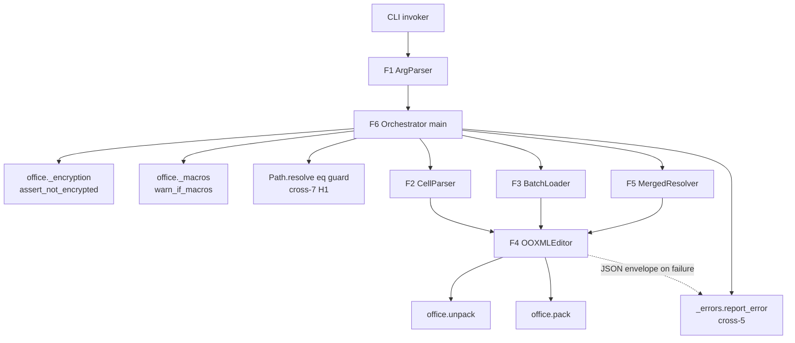
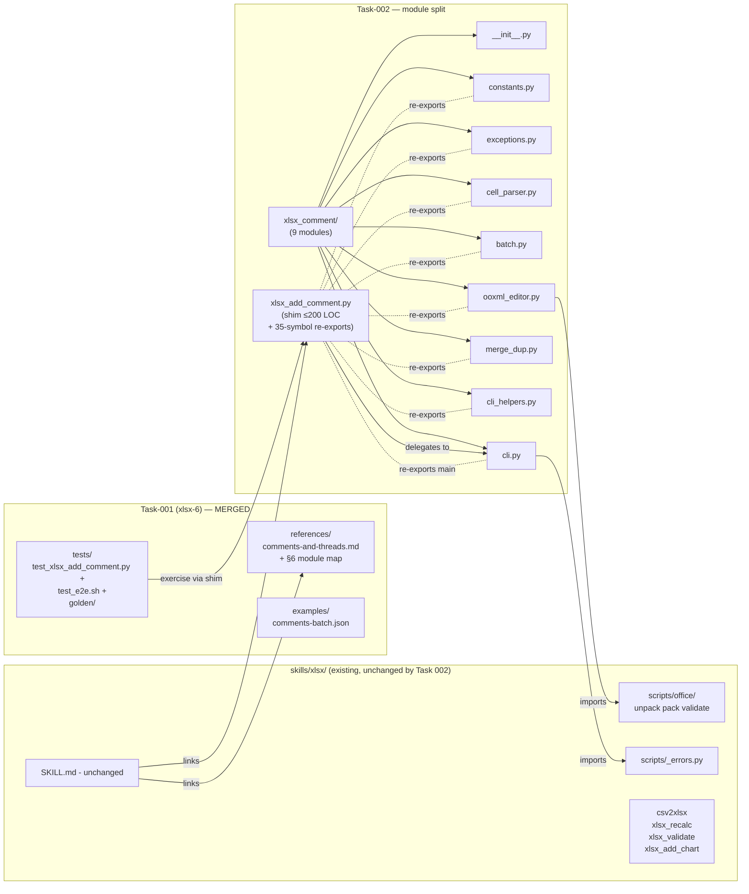
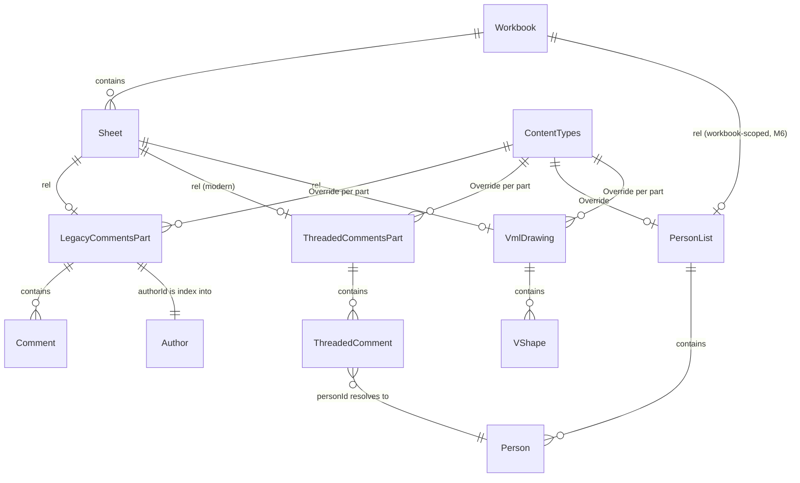

# ARCHITECTURE: xlsx-6 — `xlsx_add_comment.py` (with Task-002 module-split)

> **Template:** `architecture-format-core`. This document covers TWO
> phases of the same script: Task 001 (xlsx-6, MERGED) added the
> single-file CLI; Task 002 (xlsx-add-comment-modular, MERGED
> 2026-05-08) split the as-delivered 2339-LOC monolith into a
> `xlsx_comment/` package while preserving the public CLI surface
> byte-for-byte. Sections §2.1 / §3.1 / §3.2 / §3.3 reflect the
> Task-002 decomposition; §4 (Data Model) and §5 (Security) remain
> unchanged because the OOXML mutations and the trust boundary are
> identical pre/post-refactor — Task 002 moved code, not behaviour.
> Section §8 closes Task-002 architecture-blocker Q1, Q2, Q3.

## 1. Task Description

- **TASK (Task 001 — xlsx-6 v1):** [`docs/tasks/task-001-xlsx-add-comment-master.md`](tasks/task-001-xlsx-add-comment-master.md) — archived after merge.
- **TASK (Task 002 — module split):** [`docs/tasks/task-002-xlsx-add-comment-modular.md`](tasks/task-002-xlsx-add-comment-modular.md) — archived after merge (chain of 11 atomic tasks: `task-002-{01..11}-*.md`).
- **Reviews trail:** [`docs/reviews/task-001-review.md`](reviews/task-001-review.md) (Task 001 round-2 APPROVED) + [`docs/reviews/task-002-review.md`](reviews/task-002-review.md) (Task 002 task/architecture/plan rounds + 7 Sarcasmotron approvals across the chain).
- **Brief summary of requirements:** Ship a CLI under `skills/xlsx/scripts/` that inserts an Excel comment (legacy `<comment>`, optionally with the threaded-comment + personList Excel-365 modern layer) into a target cell, with cross-skill cross-3/4/5/7-H1 hardening, an `--batch` mode that auto-detects the xlsx-7 findings envelope, and a v1 honest-scope locked by regression tests. Mirrors `skills/docx/scripts/docx_add_comment.py` in CLI conventions.
- **Decisions this document closes (handoff from Analyst):**
  - **Q2 — Empty-text policy:** REJECT — empty/whitespace-only `--text` exits 2 `EmptyCommentBody`. Mirrors `docx_add_comment.py --comment` non-empty check.
  - **Q5 — Date attribute:** BOTH — default `dT = datetime.now(timezone.utc).isoformat(timespec="seconds")` with `Z` suffix; `--date ISO` overrides. Mirrors `docx_add_comment.py --date`.
  - **Q7 — Threaded write semantics:** **Option A (Excel-365 fidelity)** — `--threaded` writes BOTH `xl/threadedComments<M>.xml` AND a legacy `<comment>` stub in `xl/commentsN.xml`. `--no-threaded` writes ONLY the legacy `<comment>`. R5.c "mixed legacy+threaded already on the cell" becomes the corollary "if a threaded thread already exists on the cell, append to threaded; else fall through to legacy duplicate-cell rule R5.b".

## 2. Functional Architecture

### 2.1. Functional Components

> **Convention (post Task-002):** each functional component F1–F6
> below maps 1:1 to a Python module inside the
> `skills/xlsx/scripts/xlsx_comment/` package. The previous
> "monolithic single-file CLI" convention from Task 001 is
> **superseded for the xlsx skill only** because the as-delivered
> file size (2339 LOC) crossed the navigability threshold that the
> YAGNI argument was conditional on. The single-file convention
> remains in force for `docx_add_comment.py` (1101 LOC),
> `xlsx_add_chart.py`, `xlsx_recalc.py`, `xlsx_validate.py`,
> `csv2xlsx.py`, and the pptx/pdf scripts — all of which sit comfortably
> below the threshold. See §8 for the Task-002 closure of Q1/Q2/Q3.

**Component F1 — CLI / Argument Parser**

- **Purpose:** Accept the user's CLI invocation and produce a typed `Args` object whose validity is enforced by argparse + post-parse cross-checks (MX-A, MX-B, DEP-1..DEP-4 from TASK §2.5).
- **Functions:**
  - `parse_args(argv) -> Args`: parse, validate mutex/dependency rules, route argparse usage errors through `_errors.report_error` when `--json-errors` is set (DEP-4).
  - Input: `sys.argv` (or test-injected list).
  - Output: `Args` dataclass (`input_path`, `output_path`, `mode: 'cell'|'batch'`, `cell_ref`, `text`, `author`, `initials`, `threaded`, `date_iso`, `batch_path`, `default_author`, `default_threaded`, `allow_merged_target`, `json_errors`).
  - Related Use Cases: I1.1 (cell parser is reused inside this), §2.5 mutex/dep enforcement.
- **Dependencies:** `argparse`, `_errors` (cross-5).

**Component F2 — Cell-syntax parser**

- **Purpose:** Convert `--cell` strings to `(sheet_name, cell_ref)` tuples; resolve "first visible sheet" default; case-sensitive lookup.
- **Functions:**
  - `parse_cell_syntax(text) -> (Optional[str], str)`: handles `A5` / `Sheet2!B5` / `'Q1 2026'!A1` / `'Bob''s Sheet'!A1`. Apostrophe escape `''` → `'`. Returns `(None, "A5")` for unqualified, `(sheet, ref)` otherwise.
  - `resolve_sheet(workbook_xml_root, qualified_or_none, sheet_visibility) -> sheet_name`: applies M2 first-VISIBLE-sheet rule when qualifier is None; case-sensitive lookup when qualifier is given (M3); raises `SheetNotFound` with `details.suggestion` (case-mismatch) or `details.available` (truly missing); raises `NoVisibleSheet` if all hidden and no qualifier.
  - Related Use Cases: I1.1 (all 7 alternatives).
- **Dependencies:** `lxml.etree` (read `xl/workbook.xml` and `<sheet state>`).

**Component F3 — Batch loader**

- **Purpose:** Read `--batch` file (or stdin), enforce 8 MiB cap pre-parse, auto-detect flat-array vs xlsx-7 envelope, hydrate to a uniform `list[BatchRow]`.
- **Functions:**
  - `load_batch(path_or_dash, default_author, default_threaded) -> list[BatchRow]`: pre-parse size cap via `Path.stat().st_size` (or stream-buffer for stdin); JSON parse (stdlib `json`); inspect root type; map to `BatchRow(cell, text, author, initials, threaded)`. Skip group-findings (`row: null`); count in `summary.skipped_grouped` and emit info to stderr.
  - Raises: `BatchTooLarge`, `InvalidBatchInput`, `MissingDefaultAuthor`.
  - Related Use Cases: I2.1, I2.2.
- **Dependencies:** stdlib `json`, `pathlib`.

**Component F4 — OOXML editor (workbook unpacker + writer)**

- **Purpose:** The single source of truth for OOXML mutations. Owns the workbook-wide invariants (`<o:idmap data>`, `o:spid`, `<authors>` dedup, `<person>` dedup, rels attachment points, Content_Types overrides).
- **Functions:**
  - `with_unpacked_workbook(path) -> contextmanager`: unpack via `office.unpack`, yield `WorkbookTree` (a thin wrapper around lxml trees keyed by part name), pack via `office.pack` on exit.
  - `scan_idmap_used(tree) -> set[int]` and `scan_spid_used(tree) -> set[int]`: workbook-wide pre-scans (C1). **Important — `<o:idmap data>` is a comma-separated LIST per ECMA-376** (e.g. `data="1,5,9"` means this drawing claims shape-type IDs 1, 5, AND 9). The scanner must parse the attribute as `[int(x) for x in attr.split(",")]` and union into the set; treating it as a scalar would silently corrupt heavily-edited workbooks where Excel itself emits multi-claim lists. On *write* xlsx-6 emits a single integer per part (we only ever create one block per new VML part), but the read asymmetry must be encoded — see §4.1 VmlDrawing and §4.2 invariant 3. (Architecture-review M-1.)
  - `next_part_counter(tree, part_name_pattern) -> int`: e.g. for `xl/comments?.xml` → 1 if none, else `max(N)+1`. Used for `commentsN`, `threadedCommentsM`, `vmlDrawingK`. Counters are independent.
  - `ensure_legacy_comments_part(tree, sheet_name) -> CommentsPart`: idempotent-create `xl/commentsN.xml` bound to `sheet_name`'s rels.
  - `ensure_threaded_comments_part(tree, sheet_name) -> ThreadedCommentsPart`: idempotent-create `xl/threadedComments<M>.xml`.
  - `ensure_person_list(tree) -> PersonListPart`: idempotent-create `xl/persons/personList.xml`; rel goes on `xl/_rels/workbook.xml.rels` (M6).
  - `ensure_vml_drawing(tree, sheet_name, idmap_data) -> VmlDrawingPart`: idempotent-create `xl/drawings/vmlDrawingK.xml` with chosen `<o:idmap data>`.
  - `add_legacy_comment(part, ref, author, text) -> None`: append `<comment>`; case-sensitive `<authors>` dedup (m5).
  - `add_threaded_comment(part, ref, person_id, text, date_iso) -> threaded_id`: append `<threadedComment id="{UUIDv4}" dT="..." personId="..." ref="...">`; v1 does NOT set `parentId` (R9.a).
  - `add_person(part, display_name) -> person_id`: idempotent — UUIDv5 of displayName, returns existing id if present; case-sensitive dedup matching `<authors>` (m5).
  - `add_vml_shape(part, ref, spid, sheet_index) -> None`: append `<v:shape id="_x0000_s{spid}" o:spid="...">` with default anchor.
  - Related Use Cases: I1.2, I1.3, I1.4, I2.3.
- **Dependencies:** `lxml.etree`, `office.unpack`, `office.pack`, `office._encryption`, `office._macros`.

**Component F5 — Merged-cell resolver**

- **Purpose:** Detect merged-range targets and apply the R6 policy.
- **Functions:**
  - `resolve_merged_target(sheet_xml_root, ref, allow_redirect) -> ref`: scans `<mergeCell ref="A1:C3">` ranges; if `ref` falls inside but is not anchor → either raise `MergedCellTarget` (default) or return anchor (when `allow_redirect=True`, emits `MergedCellRedirect` info to stderr).
  - Related Use Cases: I1.5.
- **Dependencies:** `lxml.etree`, `re` (range parsing).

**Component F6 — Pipeline orchestrator (`main`)**

- **Purpose:** Glue layer: parse args → encryption/macro/same-path checks → unpack → resolve sheet/cell → for each BatchRow apply policy + delegate to F4 → pack → emit JSON envelope on failure.
- **Functions:**
  - `main(argv=None) -> int` (exit code).
  - `single_cell_main(args, tree)`, `batch_main(args, tree)` — internal sub-routines.
  - Related Use Cases: ALL.
- **Dependencies:** F1–F5, `office._encryption.assert_not_encrypted`, `office._macros.warn_if_macros_will_be_dropped`, `_errors`.

### 2.2. Functional Components Diagram



## 3. System Architecture

### 3.1. Architectural Style

**Style:** Python CLI with a thin **shim script** (`xlsx_add_comment.py`,
≤ 200 LOC) that delegates to a co-located **`xlsx_comment/` package**
(9 files = 8 implementation modules + a near-empty `__init__.py`, see
§3.2). Adopted in Task 002 to replace the Task-001 single-file layout
that grew to 2339 LOC.

**Justification (Task-002 update):**
- The Task-001 YAGNI argument was conditional on the file landing at
  ~1100 LOC like `docx_add_comment.py`. The as-delivered file is 2339
  LOC because the xlsx variant implements three feature supersets that
  docx does not have: threaded comments, batch mode, and VML drawing
  with workbook-wide `<o:idmap data>` invariants. With the premise
  falsified, the YAGNI conclusion is too.
- Each new module sits under ~500 LOC (shim ≤ 200, exceptions ≤ 220,
  cell_parser ≤ 200, batch ≤ 160, ooxml_editor ≤ 850 single-file or
  4 × ~200 if Q1 picks the sub-package — see §8 closure: **single-file
  wins**), giving navigability comparable to other office scripts.
- The `office/` shared module remains the trust boundary
  (unpack/pack/validate/encryption/macros). Task 002 adds **NO new
  shared abstraction** — the package is xlsx-private, lives next to
  the shim, and does not propagate to docx/pptx/pdf. CLAUDE.md §2
  4-skill replication does NOT activate.
- The shim re-exports the 35-symbol test-compat surface (TASK §2.5),
  so existing tests pass without edits. `xlsx_add_comment.py` remains
  the **single documented entry point**.

**Anti-pattern explicitly avoided (unchanged from Task 001):** Promoting
OOXML helpers (`scan_idmap_used`, `next_part_counter`) to `office/`
would cause the **4-skill replication burden** documented in CLAUDE.md §2.
These helpers are xlsx-specific (commentsN / threadedComments /
personList / vmlDrawing don't exist in docx or pptx), so they STAY
inside `xlsx_comment/ooxml_editor.py`. **This is a constraint, not a
choice.**

**Convention scope (clarified post-Task-002):** The single-file
convention is in force per script *until* the script crosses the
navigability threshold (~1500 LOC of executable code, excluding
docstrings/comments). At that point, the script is split into a
co-located `<script>_/` package and the original file becomes a
≤ 200-LOC shim. This rule applies skill-wide; today only
`xlsx_add_comment.py` triggers it.

### 3.2. System Components

**Component S1 — `skills/xlsx/scripts/xlsx_add_comment.py`** (REDUCED to shim in Task 002)

- **Type:** Python 3.10+ CLI shim, ≤ 200 LOC.
- **Purpose:** Single user-facing entry point. Delegates to
  `xlsx_comment.cli:main()`. Re-exports the 35-symbol test-compat
  surface (TASK §2.5) so the existing test suite passes without edits.
- **Implemented Functions:** None of its own; `if __name__ == "__main__":
  sys.exit(main())`. Re-imports the symbols imported by
  `tests/test_xlsx_add_comment.py`.
- **Technologies:** Python 3.10+ stdlib only.
- **Interfaces:**
  - **Inbound:** `python3 scripts/xlsx_add_comment.py …` (CLI, see TASK §2.5).
  - **Outbound:** delegates to `xlsx_comment.cli.main(argv)` and returns its exit code.
- **Dependencies:** `xlsx_comment.*` package (next sibling).

**Component S1.pkg — `skills/xlsx/scripts/xlsx_comment/`** (NEW package, 9 files)

- **Type:** Python 3.10+ package private to the xlsx skill.
- **Purpose:** Houses the F1–F6 implementation.
- **Modules** (1:1 with TASK §2.5 file table):

  | Module | Maps to F | Public API (selected) | LOC budget |
  |---|---|---|---|
  | `__init__.py` | — | (near-empty per Q4=A) | ≤ 10 |
  | `constants.py` | (F-Constants) | `SS_NS`, `R_NS`, `PR_NS`, `CT_NS`, `V_NS`, `O_NS`, `X_NS`, `THREADED_NS`, `VML_CT`, `DEFAULT_VML_ANCHOR`, `BATCH_MAX_BYTES` | ≤ 60 |
  | `exceptions.py` | (F-Errors) | `_AppError` + 14 typed errors | ≤ 220 |
  | `cell_parser.py` | F2 | `parse_cell_syntax`, `_load_sheets_from_workbook`, `resolve_sheet` | ≤ 200 |
  | `batch.py` | F3 | `BatchRow`, `load_batch` | ≤ 160 |
  | `ooxml_editor.py` | F4 | scanners (`scan_idmap_used`, `scan_spid_used`, `_vml_part_paths`, `_parse_vml`), part-counter (`next_part_counter`, `_allocate_new_parts`), cell-ref helpers, target/path resolution, rels/Content-Types, legacy comment writers, threaded comment writers, `add_person`. | ≤ 850 (single-file per Q1=A) |
  | `merge_dup.py` | F5 | `resolve_merged_target`, `detect_existing_comment_state`, `_enforce_duplicate_matrix` | ≤ 200 |
  | `cli_helpers.py` | (F-Helpers + Q3) | `_initials_from_author`, `_resolve_date`, `_validate_args`, `_assert_distinct_paths`, `_content_types_path`, `_post_validate_enabled`, `_post_pack_validate` | ≤ 150 |
  | `cli.py` | F1 + F6 (Q2=merged) | `build_parser`, `main`, `single_cell_main`, `batch_main` | ≤ 700 |

- **Internal API rules:**
  - Each module declares an `__all__` list. Cross-module imports use sibling-relative `from .exceptions import _AppError`. Imports through the shim (`from xlsx_add_comment import …`) are **forbidden inside the package** to prevent re-import cycles (TASK R4.b).
  - `_VML_PARSER` (lxml hardened: `resolve_entities=False`, `no_network=True`, `load_dtd=False`, `huge_tree=False`) lives in `ooxml_editor.py` and is preserved verbatim from Task 001 — it is the security boundary against billion-laughs / XXE on tampered VML.
- **Technologies:** Same as S1 pre-split (Python 3.10+, `lxml`, `defusedxml`, stdlib).
- **Dependencies:** Same as Task 001 — `office.unpack`, `office.pack`, `office._encryption`, `office._macros`, `_errors`. **No new deps.**

**Component S1.shim re-export contract**

- The shim re-exports the **exact 35-symbol set** documented in
  TASK §2.5 "Re-export contract — AUTHORITATIVE". The set is
  partitioned: 9 from `constants`, 10 from `exceptions`, 2 from
  `cell_parser`, 1 from `batch`, 9 from `ooxml_editor` (incl. 3
  `_`-prefixed helpers tested directly), 2 from `merge_dup` (incl.
  `_enforce_duplicate_matrix`), 1 from `cli_helpers`
  (`_post_pack_validate`), 1 from `cli` (`main`).
- This is the **only** policy under which TASK R3.a ("zero edits to
  test files") is satisfiable.

**Component S2 — `skills/xlsx/references/comments-and-threads.md`** (NEW)

- **Type:** Markdown reference document.
- **Purpose:** Document the OOXML data model the script implements (R10/I4.2 step 5). Particularly the C1-pitfalls section: `<o:idmap data>` is workbook-wide on `<o:shapelayout>`, `o:spid` is per-shape — they are not the same thing, and conflating them in code creates silent collisions.
- **Implemented Functions:** Documentation only.
- **Technologies:** Markdown.
- **Interfaces:** Linked from `skills/xlsx/SKILL.md` §12.
- **Dependencies:** None.

**Component S3 — `skills/xlsx/SKILL.md`** (MODIFIED)

- **Modifications:**
  - §2 Capabilities — add comment-insertion bullet.
  - §4 Script Contract — add the CLI signature (one line, full flag list cross-referencing TASK §2.5).
  - §10 Quick Reference — add a row (template per TASK I4.2 AC).
  - §12 Resources — link `xlsx_add_comment.py` and `references/comments-and-threads.md`.

**Component S4 — `skills/xlsx/examples/comments-batch.json`** (NEW)

- **Type:** Tiny JSON fixture (≤ 5 rows, flat-array shape).
- **Purpose:** Illustrate the `--batch` flat-array shape for users reading SKILL.md.

**Component S5 — `skills/xlsx/scripts/tests/test_e2e.sh`** (MODIFIED)

- **Modifications:** Append a new `xlsx_add_comment` block with at minimum the 11 ACs enumerated in TASK §3 (clean-no-comments / existing-legacy preserve / threaded / threaded-rel-attachment / multi-sheet partition / merged-cell-target / merged-cell-redirect / batch-50 / batch-50-with-existing-vml / apostrophe-sheet / same-path / encrypted / macro `.xlsm` / hidden-first-sheet / idmap-conflict / `BatchTooLarge`).

**Component S6 — `skills/xlsx/scripts/tests/test_xlsx_add_comment.py`** (NEW)

- **Type:** Python `unittest` module.
- **Purpose:** Unit tests for F2 (cell parser, including A1.1.f case-mismatch), F3 (batch loader, including envelope shape detection + 9 MiB rejection), F4 helpers (`scan_idmap_used`, `scan_spid_used`, `add_person` UUIDv5 stability, `casefold()` for `STRAẞE`), F5 (merged-range scanner), and the honest-scope locks (R9.a–R9.g — names follow `Test*HonestScope*`).
- **Convention:** Run via `./.venv/bin/python -m unittest discover -s tests`, same pattern as existing `office/tests/`.

**Component S7 — `skills/xlsx/scripts/tests/golden/`** (NEW directory)

- **Type:** Directory of binary `.xlsx` golden outputs.
- **Purpose:** Anchor regression tests. Files are agent-output-only — `tests/golden/README.md` documents "DO NOT open in Excel" (m4 + R9.d).
- **CI:** `test_e2e.sh` regenerates and diffs goldens (`zipdiff`-style, comparing per-part XML semantically since byte-equality is impossible due to UUIDv4 non-determinism on `<threadedComment id>` — R9.e). Comparison strategy: use `lxml` + `xml.etree.ElementTree` canonicalisation, ignore ephemeral `<threadedComment id>` and `dT` attributes when `--date` is not pinned.

### 3.3. Components Diagram (post-Task-002)



## 4. Data Model (Conceptual)

> **Note:** The "data model" here is the OOXML part graph the script
> mutates. There is no relational DB. The model below describes the
> **on-disk OOXML invariants** xlsx-6 must preserve.

### 4.1. Entities Overview

#### Entity: `Workbook (xl/workbook.xml + xl/_rels/workbook.xml.rels)`

- **Description:** The root of the OOXML graph. Lists sheets and (via rels) the workbook-scoped parts.
- **Key attributes:**
  - `<sheet name="..." sheetId="N" r:id="rIdN" state="visible|hidden|veryHidden">` — order matters; first visible determines "default sheet" (M2).
- **Relationships (rels):**
  - 1:N → Sheet parts (`xl/worksheets/sheet<N>.xml`).
  - **0..1 → `personList` part (NEW for threaded mode — M6).** This is workbook-scoped, NOT sheet-scoped.
- **Business rules:**
  - Sheet name lookup is case-sensitive (M3).
  - Default-sheet rule = first sheet with `state` absent or `"visible"`.

#### Entity: `Sheet (xl/worksheets/sheet<S>.xml + xl/_rels/sheet<S>.xml.rels)`

- **Description:** One worksheet's content + its rels.
- **Key attributes:**
  - `<mergeCell ref="A1:C3">` — merged ranges; anchor = top-left.
- **Relationships (rels):**
  - 0..1 → `commentsN` part (legacy comments part — N is part-counter, NOT sheet-index — I1.2).
  - 0..1 → `vmlDrawingK` part (VML drawing for legacy-comment hover bubbles — K is part-counter, independent of N).
  - **0..1 → `threadedComments<M>` part (NEW for threaded mode — M is part-counter, independent of N and K).**
- **Business rules:**
  - A sheet without comments has no `commentsN` rel; xlsx-6 creates the part on demand.
  - The relationship target is the part PATH (e.g. `../comments2.xml`); it does NOT have to match the sheet number.

#### Entity: `LegacyCommentsPart (xl/comments<N>.xml)`

- **Description:** ECMA-376 legacy comments. Each part is bound to ONE sheet (via that sheet's rels).
- **Key attributes:**
  - `<comments xmlns="..."><authors><author>{displayName}</author>...</authors><commentList><comment ref="A5" authorId="0"><text><r><t>...</t></r></text></comment>...</commentList></comments>`.
- **Business rules:**
  - `authorId` is the position of `<author>` inside `<authors>`; dedup is **case-sensitive identity comparison on displayName** (m5).
  - `<comment ref>` is unbounded — multiple comments on the same cell are legal in legacy. v1 handles by R5 rules.

#### Entity: `ThreadedCommentsPart (xl/threadedComments<M>.xml)` *(modern, optional)*

- **Description:** Excel-365 threaded comments extension. Bound to ONE sheet via that sheet's rels.
- **Key attributes:**
  - `<ThreadedComments xmlns="..."><threadedComment ref="A5" dT="ISO-8601" personId="{...}" id="{UUIDv4}">{plain text}</threadedComment>...</ThreadedComments>`.
- **Business rules:**
  - `personId` MUST resolve to a `<person id>` in `personList.xml` — without it Excel won't render the thread.
  - **`id` is UUIDv4 — non-deterministic by design (R9.e).**
  - v1 does NOT set `parentId` (R9.a). All threaded comments are top-level.

#### Entity: `PersonList (xl/persons/personList.xml)` *(modern, optional)*

- **Description:** Excel-365 persons registry. Workbook-scoped (rel goes on `xl/_rels/workbook.xml.rels`, M6).
- **Key attributes:**
  - `<personList xmlns="..."><person displayName="..." id="{UUIDv5(URL_NS, displayName)}" userId="..." providerId="None"/></personList>`.
- **Business rules:**
  - **Obligatory whenever any threadedComment exists** (per backlog).
  - `userId` derived via `str.casefold()` (m1) for non-ASCII parity.
  - `providerId="None"` is the literal string — not Python `None` — meaning "no SSO provider".
  - Dedup is case-sensitive on `displayName`, matching `<authors>` dedup (m5).

#### Entity: `VmlDrawing (xl/drawings/vmlDrawing<K>.xml)`

- **Description:** Legacy VML drawing required for Excel to render the yellow hover-bubble on legacy comments. Bound to ONE sheet via that sheet's rels.
- **Key attributes:**
  - Root: `<xml xmlns:v="..." xmlns:o="..." xmlns:x="..."><o:shapelayout v:ext="edit"><o:idmap v:ext="edit" data="N1,N2,..."/></o:shapelayout><v:shapetype id="_x0000_t202" .../><v:shape id="_x0000_sNNNN" o:spid="_x0000_sNNNN" type="#_x0000_t202">...</v:shape>...</xml>`.
- **Business rules (the C1 + M-1 contract):**
  - **`<o:idmap data>` is a COMMA-SEPARATED LIST per ECMA-376** — each integer in the list is claimed by this drawing. **Read** must parse the full list; **write** may emit a single integer (xlsx-6 only ever creates one block per part). The set of all integers across all `<o:idmap data>` lists in all `vmlDrawing*.xml` parts must be workbook-wide unique. (M-1 fix.)
  - **`<v:shape id="_x0000_sNNNN" o:spid>` integer NNNN is workbook-wide unique** across all VML parts. Mirrors Excel's own `_x0000_s1025`-then-`_x0000_s1026`-… allocator.
  - These are TWO DIFFERENT collision domains — conflating them is the round-1 mistake C1, and treating `data` as a scalar is the round-2 architecture-review mistake M-1.

#### Entity: `ContentTypes ([Content_Types].xml)`

- **Description:** OOXML manifest of part-name → MIME-type bindings.
- **Key attributes:** `<Override PartName="/xl/comments2.xml" ContentType="application/vnd.openxmlformats-officedocument.spreadsheetml.comments+xml"/>` and similar for `threadedComments`, `personList`, `vmlDrawing`.
- **Business rules:**
  - Adding a new part REQUIRES adding the matching `<Override>` (idempotent: skip if present, never duplicate).
  - `vmlDrawing` uses `Default Extension="vml"` if not already present; xlsx-6 prefers `<Override>` per part for safety (matching what Excel itself emits for fresh files).

### Relationships diagram



### 4.2. Workbook-wide invariants the editor MUST preserve

These are the invariants that make xlsx-6 correct *and* paranoid about
hostile inputs:

1. **Idempotent overrides.** Adding a part that already has an `<Override>` does not produce a duplicate.
2. **Single rels-Relationship per (sheet, target).** Adding a `commentsN` rel to a sheet that already binds to `commentsN` is a no-op.
3. **`<o:idmap data>` integers workbook-wide unique.** The `data` attribute is a comma-separated list; the union of all integers across all VML parts must be a set without duplicates. (C1 + M-1.)
4. **`o:spid` workbook-wide uniqueness.** (C1)
5. **`personList` is workbook-scoped, NOT sheet-scoped.** (M6)
6. **Author dedup is case-sensitive on displayName** in BOTH `<authors>` and `<personList>`. (m5)
7. **Pre-existing comments preserved byte-equivalent** — only added nodes show in the diff. (R8.b)
8. **`xl/vbaProject.bin` preserved** when the output extension is `.xlsm`. (R8.c)
9. **Encryption / legacy-CFB fail-fast at exit 3.** (R7.a / cross-3)
10. **Same-path (resolved) refused at exit 6.** (R7.d / cross-7 H1)

## 5. Security

> Loading the extended template would add §5 Security as a separate
> chapter; for a single-file CLI that does no network I/O and no shell
> execution, the relevant security surface is small and fits inside
> §4. Repeating it here for explicit traceability against `architecture-design`
> §2 "Security: Built-in".

- **Input validation boundary:** `office/unpack` is the trust boundary. `defusedxml` (already in `requirements.txt`) protects against XML-bomb / XXE / billion-laughs in the parsed parts. `office/unpack` itself is hardened against zip-bomb and path-traversal (existing protection inherited from docx).
- **Batch JSON cap:** 8 MiB pre-parse via `Path.stat().st_size` (m2). Stdin uses a buffered read with the same cap.
- **No shell execution.** `subprocess` is NOT imported. `os.system` is NOT used.
- **No network I/O.** xlsx-6 does not fetch URLs.
- **XML insertion safety.** `lxml.etree.SubElement` + `.text` and `.set` (NOT string concatenation) handle escaping for author / text / sheet-name strings — including untrusted user input in `--text` and `--author`.
- **UUID generation:** `uuid.uuid5(uuid.NAMESPACE_URL, displayName)` for stable `<person id>`; `uuid.uuid4()` for ephemeral `<threadedComment id>`. Neither carries privacy concerns since the input is the user-supplied `displayName`.

**OWASP Top 10 mapping (those that apply to a non-network CLI):**
- A03 Injection — addressed via lxml-mediated XML escaping (above).
- A04 Insecure design — covered by the workbook-wide invariants list (§4.2).
- A06 Vulnerable components — `lxml`, `defusedxml`, `openpyxl` are pinned in `skills/xlsx/scripts/requirements.txt`; no new deps added.
- A08 Software & data integrity — output validates under `office/validate.py` and `xlsx_validate.py --fail-empty` (R8.a, AC in I3.2).

## 6. Open-Question closure (what this document fixes)

| Q | Decision | Rationale |
|---|---|---|
| **Q2 — Empty-text policy** | **REJECT** with exit 2 `EmptyCommentBody` envelope. | Mirrors `docx_add_comment.py --comment` (required + non-empty). Empty comments have zero legitimate use case in a CI / agent pipeline. Easier to relax later than to retract. |
| **Q5 — Date attribute** | **`--date` flag, default `datetime.now(timezone.utc).isoformat(timespec="seconds")` with `Z` suffix.** | Determinism for tests; Excel renders both ISO with timezone and the bare `YYYY-MM-DDTHH:MM:SSZ` form. Mirrors `docx_add_comment.py`. |
| **Q7 — Threaded write semantics** | **Option A (Excel-365 fidelity).** `--threaded` writes BOTH `xl/threadedComments<M>.xml` AND a legacy `<comment>` stub in `xl/commentsN.xml`. `--no-threaded` writes ONLY the legacy `<comment>`. The "stub" body is identical to the threaded body (plain text). | (1) Excel itself writes both parts when it creates a threaded comment — fidelity is the safer default. (2) Keeps older Excel + LibreOffice readable. (3) `--no-threaded` becomes a *suppression* flag, mirroring Excel's own toggling pattern. (4) Full duplicate-cell matrix in §6.1. |

### 6.1 Duplicate-cell behaviour matrix (R5 corollary; closes architecture-review M-2)

The behaviour for a duplicate cell — meaning the target cell already
has at least one comment in the **input** workbook — depends jointly
on (a) what part(s) hold the existing comment(s) and (b) which mode is
selected. R5.b in TASK §2 only covers the empty-cell + `--no-threaded`
case explicitly; this table fills in the rest.

| Existing input state on the cell | `--threaded` | `--no-threaded` |
|---|---|---|
| **Cell empty (no comment yet)** | Write legacy stub + threadedComment (Q7 default). | Write legacy `<comment>` only. |
| **Legacy `<comment>` only** (older xlsx-6 output, hand-edited workbook, or non-Excel-365 source) | Write a fresh `<threadedComment>` on the same cell AND keep the existing legacy `<comment>` in place; the new top-level threadedComment forms a new thread (v1 has no `parentId`, so it is independent of the existing legacy entry). Per §6 Q7 fidelity: ALSO append a NEW legacy `<comment>` stub matching the new threadedComment body (so the two-part stub:thread invariant holds for the *new* entry). The pre-existing legacy `<comment>` stays untouched (R8.b byte-equivalence). | exit 2 `DuplicateLegacyComment` (R5.b — unchanged). |
| **Threaded thread exists** (with or without matching legacy stub) | Append a new `<threadedComment>` to the same `ref` (forms an additional top-level entry in that thread; v1 NO `parentId`). If the cell also has a legacy stub, ALSO append a matching legacy `<comment>` per fidelity rule. | **exit 2 `DuplicateThreadedComment`** (NEW envelope — see §6.2). Silently writing a legacy-only comment alongside an existing thread produces a workbook where older clients see two unrelated comments and Excel-365 sees an orphan legacy entry — the worst of both worlds. Refuse fast. |
| **Threaded only, NO legacy stub** (hand-authored or older agent output that didn't follow Q7 fidelity) | Append `<threadedComment>` to thread; do NOT add a legacy stub for the existing thread (we don't retro-fix non-fidelity input — only honour fidelity for entries WE write). For the new entry: write both per Q7 default. | **exit 2 `DuplicateThreadedComment`** (same as above). |

### 6.2 New exit-code-2 envelope: `DuplicateThreadedComment`

Section M-2 of the architecture review introduced this envelope. It
needs to be reflected in the **TASK §2.5 Exit-code matrix** during the
Architecture cleanup pass — added here as an authoritative architecture
note so the developer does not miss it.

```
{
  "v": 1,
  "error": "Cannot insert legacy-only comment on cell {ref} of sheet {sheet}: "
           "a threaded comment thread already exists. Use --threaded to append "
           "to the thread, or pick a different cell.",
  "code": 2,
  "type": "DuplicateThreadedComment",
  "details": {
    "sheet": "Sheet1",
    "cell": "A5",
    "existing_thread_size": 2
  }
}
```

## 7. Architect-locked decisions (post-review M-3)

> All TASK Open Questions (Q1–Q7) are closed (Q1 → R9.f deferred,
> Q2/Q5/Q7 → §6 above, Q3/Q4/Q6 → analyst recommendations accepted).
> The architecture-review demoted the previously-flagged "open questions"
> A-Q1 and A-Q2 to Architect-locked decisions (M-3) — both have one
> sensible answer and the user need not confirm separately. They are
> recorded here for traceability and may be overridden before
> development if the user objects.

- **A-Q1 (locked) — Test fixture provenance.** Generate fixtures by (a) opening a new Excel-365 workbook, (b) adding 1–2 legacy comments + 1–2 threaded comments via Excel UI, (c) saving as `.xlsx` and `.xlsm`. Commit to `skills/xlsx/scripts/tests/golden/inputs/` with provenance in `tests/golden/README.md`. Files ≤ 50 KB each. **Override:** none expected; user may swap in different fixtures during planning if the chosen ones miss a real-world variant.

- **A-Q2 (locked) — `--no-threaded` default.** Threaded is **opt-in via `--threaded`**. Default mode = legacy-only (equivalent to `--no-threaded`). Matches backlog tone ("опц." = optional) and `docx_add_comment.py` precedent (where threading is opt-in via `--parent`). **Override:** none expected.

- **A-Q3 (PLAN-internal) — Goldens diff strategy.** Use `lxml.etree.tostring(..., method='c14n')` (NOT `c14n2` — `c14n2` does NOT canonicalise attribute order; m-5 review note) for canonical comparison; mask volatile attributes (`<threadedComment id>`, unpinned `dT`) via XPath replace before comparison. Out of scope for this Architecture pass; locked in PLAN.md. **No user input needed.**

## 8. Task-002 Architecture-Blocker Closure (Q1, Q2, Q3)

> This section closes the three architecture-blockers raised by
> `docs/TASK.md` (Task 002, draft v2) §6. Each Q is a binary design
> choice; the Architect closes them per §3.1 / §3.2 reasoning above
> and locks the decision so Planning can proceed without user gating.
> A user override is possible before Planning ends — once Planning
> ships the per-task files, override cost rises sharply.

| Q | Decision | Rationale |
|---|---|---|
| **Q1 — Single-file `ooxml_editor.py` (~850 LOC) or `ooxml/` sub-package (4 × ~200 LOC)** | **Single-file (Q1=A).** | (a) Keep the F4 region as one cohesive file because the four sub-concerns (scanners / rels / legacy / threaded) **share a non-trivial amount of state** through helper functions like `_xml_serialize`, `_open_or_create_rels`, `_allocate_rid`, `_find_rel_of_type`, `_patch_sheet_rels`, `_patch_content_types`. Splitting forces those helpers into either `rels.py` (where the legacy and threaded writers must import them) or a fifth `_helpers.py` — neither is a clean win. (b) 850 LOC is ~36 % of the 2339 LOC monolith, well below the navigability threshold (~1500 LOC) defined in §3.1. (c) YAGNI on the sub-package: if v2 features (parentId, rich text) bloat one sub-concern, splitting later is cheap because the package boundary is already drawn. **Override:** if v2 work pushes `ooxml_editor.py` past ~1200 LOC, the sub-package option re-opens in a follow-up task. |
| **Q2 — `cli.py` (~700 LOC) or split `cli.py` (argparse only) + `orchestrator.py` (`main` / `single_cell_main` / `batch_main`)** | **Merged `cli.py` (Q2=A).** | (a) Argparse setup, mutex/dep validation, and `main()` share too much state — the `args` namespace, the `je = args.json_errors` flag, the unified `try / except _AppError / except EncryptedFileError` wrapper. Splitting leaves `cli.py` as a 90-LOC argparse builder that feeds straight into `orchestrator.py:main()` — adds an import hop with zero coupling reduction. (b) `single_cell_main` and `batch_main` are dispatched from `main()` and call into F2/F3/F4/F5 the same way; pulling them into `orchestrator.py` does not isolate any sub-concern that isn't already isolated by F2-F5 living in their own modules. (c) ≤ 700 LOC matches `ooxml_editor.py` and stays below the threshold. **Override:** if a future task adds a third dispatch mode (e.g., `--unpacked-dir` library mode from R9.g), reconsider — three dispatchers + argparse + main is a real argument for splitting. |
| **Q3 — `_post_pack_validate` / `_post_validate_enabled` belong in `cli_helpers.py` or `cli.py`** | **`cli_helpers.py` (Q3=helpers).** | (a) Both are pure utility functions — no `main()` flow control, no argparse coupling. Their only dependency is `office.validate.py` invocation via subprocess + an env-var read. (b) Moving them to `cli_helpers.py` keeps `cli.py` argparse + main only, which is the §3.1 navigability goal. (c) Tests already import `_post_pack_validate` from the shim; the move is invisible to tests. |

### Knock-on TASK-RTM updates (informational)

Q1=A and Q2=A confirm the analyst's recommendation, so TASK R1.f and
R1.j stand as written. Q3=helpers confirms TASK §2.5 `cli_helpers.py`
row scope. **No TASK edits required from the Architect** — the §2
preamble note in TASK already declared RTM rows recommendation-conditional.

### Q4 / Q5 / Q6 / Q7 are CLOSED in TASK draft v2

Per TASK §6:
- **Q4** — `__init__.py` is near-empty (Policy A). §3.2 S1.pkg row reflects this.
- **Q5** — `BatchRow` is NOT re-exported from the shim; programmatic callers use `from xlsx_comment.batch import BatchRow`. xlsx-7 integration is a follow-up task, not a TASK-002 obligation.
- **Q6** — Yes, `tests/test_xlsx_comment_imports.py` smoke test is mandatory (TASK I12).
- **Q7** — `.AGENTS.md` exists; R5.b is an update, not a create.

## 9. Open Questions

> **Numbering note (A-M3 from review):** §9, §10 of the
> `architecture-format-core` template (Scalability, Reliability) are
> intentionally elided. Rationale: this is a non-network single-process
> CLI with no scale axis, mirroring the §5 Security elision treatment.
> The "Open Questions" slot (template §11) is renumbered §9 here so
> the document is gap-free.

> After §6 closure (Q2/Q5/Q7 from Task 001), §7 closure
> (A-Q1/A-Q2/A-Q3 from Task 001), and §8 closure (Task-002
> Q1/Q2/Q3): **NO open questions remain** that block the user.
> The Planner may proceed without user gating.

- **(none — all questions closed)**
