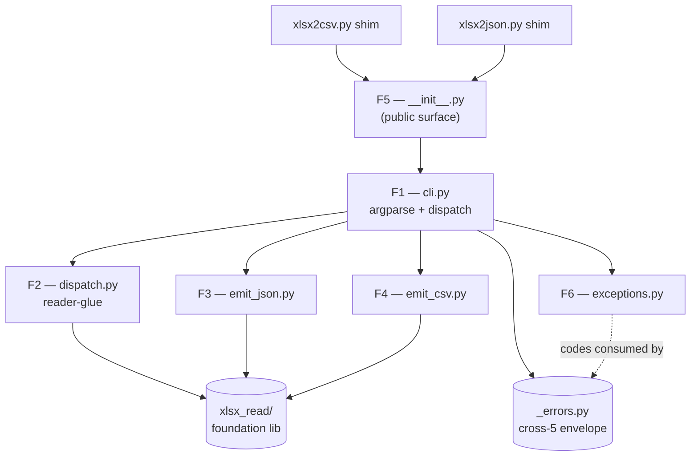
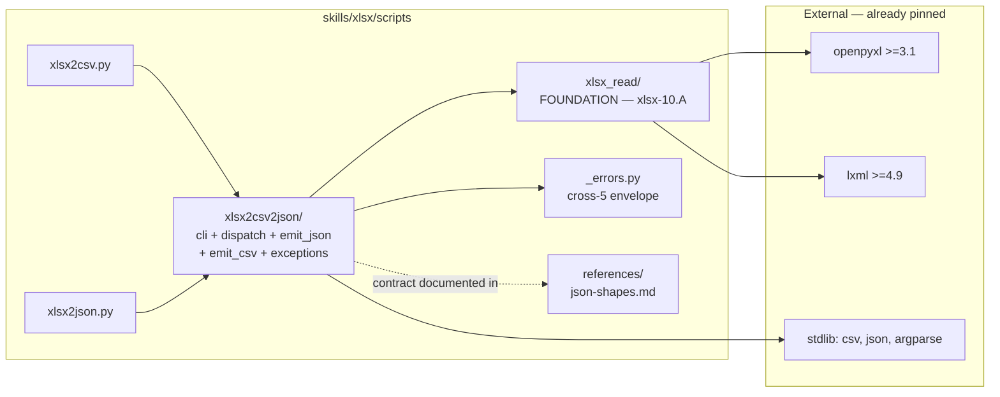
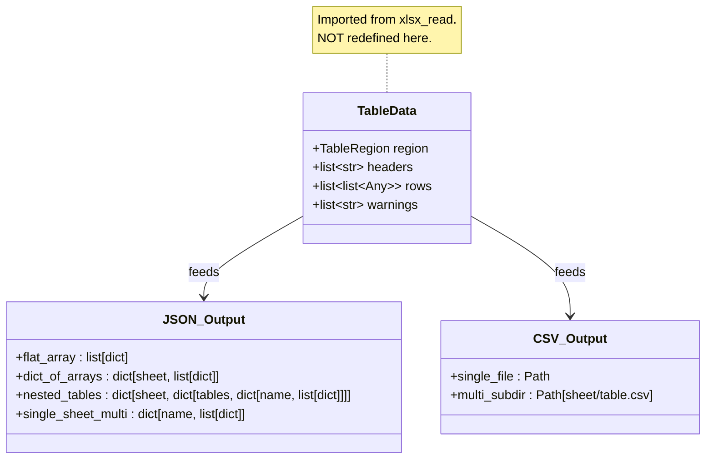

# ARCHITECTURE: xlsx-8 — `xlsx2csv.py` / `xlsx2json.py` read-back CLIs

> **Status:** ✅ **IMPLEMENTED 2026-05-12** (8 atomic sub-tasks
> 010-01..010-08 + vdd-multi adversarial review with 6 fixes — see
> §14 Post-merge adaptations). 841 tests green; ruff clean; 12-line
> cross-skill `diff -q` silent; `validate_skill.py skills/xlsx`
> exit 0. Body below preserves the design-time specification verbatim;
> the post-merge implementation differs in a small number of
> documented ways — see **§14 Post-merge adaptations** at the foot of
> this document for the full delta.
>
> Prior `docs/ARCHITECTURE.md` (xlsx-10.A `xlsx_read/`) is archived
> verbatim at
> [`docs/architectures/architecture-007-xlsx-read-library.md`](architectures/architecture-007-xlsx-read-library.md).
>
> **Template:** `architecture-format-core` with selectively extended
> §5 (Interfaces) + §6 (Tech stack) + §7 (Security) + §9 (Cross-skill
> replication boundary) — this is a **new in-skill package** (~7
> modules) added on top of an existing foundation library
> (`xlsx_read/` from xlsx-10.A). The selection mirrors the precedent
> set by xlsx-2 / xlsx-3 / xlsx-10.A.

---

## 1. Task Description

- **TASK:** [`docs/TASK.md`](TASK.md) (Task 010, slug
  `xlsx-read-back`, DRAFT v1).
- **Brief summary of requirements:** Ship two thin CLI shims
  (`xlsx2csv.py`, `xlsx2json.py`) plus a single shared package
  `skills/xlsx/scripts/xlsx2csv2json/` that converts `.xlsx`
  workbooks into CSV or JSON. All reader logic (merge resolution,
  ListObjects, gap-detect, multi-row headers, hyperlinks,
  stale-cache, encryption probe, macro probe) is **delegated** to
  the xlsx-10.A `xlsx_read/` library; shim package owns **only**
  emit-side concerns (CLI parsing, JSON/CSV serialisation,
  cross-cutting envelopes, filesystem layout).
- **Public surface:**
  - Two shims `xlsx2csv.py` (53–60 LOC) and `xlsx2json.py`
    (53–60 LOC), both re-export from `xlsx2csv2json`.
  - Package public helpers: `convert_xlsx_to_csv(...)`,
    `convert_xlsx_to_json(...)`, `main(argv)`, plus shim-level
    exception types (`SelfOverwriteRefused`,
    `MultiTableRequiresOutputDir`, `MultiSheetRequiresOutputDir`,
    `HeaderRowsConflict`, `InvalidSheetNameForFsPath`,
    `OutputPathTraversal`, `FormatLockedByShim`,
    `PostValidateFailed`).
- **Decisions inherited from TASK §7.3 (D1–D10)** are reproduced
  here so this document is self-contained:

  | D | Decision | Rationale |
  | --- | --- | --- |
  | D1 | Single shared package `xlsx2csv2json/` | Q-A1 closed — emit-format dispatch in `cli.py:main()` is ~20 LOC; two packages would duplicate the entire CLI surface and force a third shared helper module anyway. |
  | D2 | `--header-rows 1` default | R6 backward-compat lock; matches single-row-header common case. |
  | D3 | `--tables whole` default | R6 backward-compat lock; entire sheet = one region. |
  | D4 | `--header-rows auto` flatten separator = U+203A (` › `) | R7.c; matches xlsx-10.A / xlsx-9 separator; no collision with `"Q1 / Q2 split"`-style headers. |
  | D5 | Subdirectory schema `<sheet>/<table>.csv`, NOT `<sheet>__<table>.csv` | R12.c, L4 VDD-adversarial fix — sheet names may legally contain `__`. |
  | D6 | `--gap-rows 2`, `--gap-cols 1` defaults | R9.e–f, M4 fix; single-empty-row inside a table is a frequent visual separator. |
  | D7 | Hyperlink JSON shape `{"value", "href"}`; CSV `[text](url)` | R10.b–c, R3-L1 fix; never emit `=HYPERLINK()` formula syntax (R4-L2 lock). |
  | D8 | Same-path guard via `Path.resolve()` (follows symlinks) | R17.a, cross-7 H1; mirror json2xlsx. |
  | D9 | `--include-formulas` at shim level passes through to `keep_formulas=True` at `open_workbook` AND `include_formulas=True` at `read_table` in lockstep | Q-A5 closed; xlsx-10.A §13.1 dictates the two flags move together. |
  | D10 | Nested `tables` JSON shape lossy on xlsx-2 v1 consume; full restoration deferred to xlsx-2 v2 `--write-listobjects` | R13.b honest-scope; activates `TestRoundTripXlsx8` skipUnless gate. |

- **Architect-layer decisions added by this document** (locked
  here, not in TASK):

  | D | Decision | Rationale |
  | --- | --- | --- |
  | D-A1 | Package name `xlsx2csv2json/` | Q-A2 closed — explicit about the two output formats, matches both shim file names; `xlsx_readback` collides nominally with `xlsx_read` foundation. |
  | D-A2 | `--tables` enum (4-val: `whole\|listobjects\|gap\|auto`) maps to library `TableDetectMode` (3-val) **via post-call filter** for the `gap` case; library API is NOT extended | Q-A6 closed — keeps xlsx-10.A `__all__` frozen surface intact. Filter cost ≤ 4 LOC in `dispatch.py`. xlsx-10.A v2 may later expose granular modes if a third consumer needs them. |
  | D-A3 | Two separate public helpers `convert_xlsx_to_csv` + `convert_xlsx_to_json`, NOT a single `convert_xlsx_readback(format=...)` | Q-A4 closed — clearer call sites; static type-checkers don't need to narrow on a format-literal param; xlsx-2 / xlsx-3 set the precedent (`convert_json_to_xlsx`, `convert_md_tables_to_xlsx`). |
  | D-A4 | `cli.py:main()` is the single argparse surface; shims hard-bind `--format` at parse time and reject mismatch with `FormatLockedByShim` envelope (exit 2) | R2.d; prevents user confusion (`xlsx2csv.py --format json` is a category error, not a recoverable arg). |
  | D-A5 | Shim package depends on `xlsx_read` via `from xlsx_read import open_workbook, WorkbookReader, ...` only — NEVER `from xlsx_read._values import ...` (banned by xlsx-10.A `pyproject.toml`) | xlsx-10.A closed-API contract; xlsx-8 is the **first consumer** of that contract — proof of the abstraction. |
  | D-A6 | Warnings from `xlsx_read` (e.g. `MacroEnabledWarning`, `AmbiguousHeaderBoundary`) propagate to stderr via Python's default `warnings.showwarning` hook for human inspection. They are **NOT** injected into the JSON output body (would break xlsx-2 v1 round-trip — a `summary` key would be misread as a sheet/key). CSV path drops warnings by-design (no place in `csv.writer` output). Optional sidecar `<output>.warnings.json` deferred to v2 if user request. | TASK §R15.b; library is pure data-producer (xlsx-10.A D-A7), shims own user-facing surface. |
  | D-A7 | Streaming CSV emit: `csv.writer` writes row-by-row via `iter_rows`-like helper in `emit_csv.py`; JSON emit accumulates and dumps once (no streaming JSON in v1) | TASK §4.1 perf bound; JSON streaming would require `ijson`-style assembler and complicate pretty-printing; deferred. |
  | D-A8 | Output-path traversal guard: every computed `<output-dir>/<sheet>/<table>.csv` passes `path.resolve().is_relative_to(output_dir.resolve())` BEFORE open-for-write | TASK §4.2 path-traversal mitigation; without this, a sheet named `../../etc/passwd` would write outside `--output-dir`. |
  | D-A9 | `emit_json.py` uses `json.dumps(..., ensure_ascii=False, indent=2, sort_keys=False)`; `--compact` flag deferred to v2 | Indent-2 is human-readable, matches `xlsx2md` mental model; sort_keys=False preserves source sheet order. |
  | D-A10 | All shim-level exit codes are listed in `xlsx2csv2json/exceptions.py` as `_AppError` subclasses with a `CODE` class attribute consumed by `report_error`; no `sys.exit(N)` outside that helper | R16.b; uniform exit-code handling; same pattern as `json2xlsx.py`. |

---

## 2. Functional Architecture

> **Convention:** F1–F6 are functional regions. Each maps to one
> private module in the `xlsx2csv2json/` package. No region spans
> more than one module; no module owns more than one region.

### 2.1. Functional Components

#### F1 — CLI argument parsing + dispatch (`cli.py`)

**Purpose:** Single argparse surface; shim-format binding; dispatch
to `convert_xlsx_to_csv` or `convert_xlsx_to_json`.

**Functions:**
- `build_parser(*, format_lock: Literal["csv", "json", None]) ->
  argparse.ArgumentParser` — constructs the full flag surface;
  rejects `--format <other>` at parse time when `format_lock` is set.
  - Input: `format_lock` from the shim entry point.
  - Output: an `argparse.ArgumentParser` instance.
  - Related Use Cases: UC-01, UC-02, UC-09.
- `main(argv: list[str] | None = None, *, format_lock: str |
  None = None) -> int` — top-level orchestrator; returns exit code.
- `_validate_flag_combo(args) -> None` — raises envelope exceptions
  for cross-flag invariants (HeaderRowsConflict,
  MultiTableRequiresOutputDir, MultiSheetRequiresOutputDir,
  FormatLockedByShim).
- `_resolve_paths(args) -> tuple[Path, Path | None]` — canonical
  resolve of INPUT and `--output` / `--output-dir`; same-path guard;
  parent-dir auto-create.

**Dependencies:**
- Depends on: `argparse`, `pathlib`, `_errors` (cross-5 envelope
  helper).
- Depended on by: shim entry points (`xlsx2csv.py` / `xlsx2json.py`).

---

#### F2 — Reader-glue / dispatch (`dispatch.py`)

**Purpose:** Open the workbook via `xlsx_read.open_workbook`,
enumerate sheets, detect regions per `--tables` mode (with the
post-call filter for `gap`), iterate per region, hand off
`(TableData, sheet_name, region)` triples to the emitter.

**Functions:**
- `iter_table_payloads(args, reader: WorkbookReader) ->
  Iterator[tuple[str, TableRegion, TableData]]` — yields
  `(sheet_name, region, table_data)` per region (already filtered for
  `--tables gap` case).
- `_resolve_tables_mode(arg_tables: str) -> tuple[TableDetectMode,
  Callable[[TableRegion], bool]]` — returns `(library_mode,
  post_filter_predicate)`. `gap` → `("auto", lambda r:
  r.source == "gap_detect")`; `listobjects` → `("tables-only",
  lambda r: True)`; `whole` / `auto` → identity filters.
- `_validate_sheet_path_components(name: str) -> None` — raises
  `InvalidSheetNameForFsPath` if any reject-list character is
  present (used only when CSV output goes to a multi-file layout).

**Dependencies:**
- Depends on: `xlsx_read` public surface.
- Depended on by: F3, F4.

---

#### F3 — JSON emitter (`emit_json.py`)

**Purpose:** Build the JSON shape per TASK §R11 (a–e); write it to
`--output` or stdout via `json.dumps`.

**Functions:**
- `emit_json(payloads: Iterator[tuple[str, TableRegion, TableData]],
  *, output: Path | None, sheet_selector: str, tables_mode: str,
  header_flatten_style: Literal["string", "array"],
  include_hyperlinks: bool, datetime_format: DateFmt) -> int` —
  collects all payloads (single pass), builds the shape, writes the
  JSON. Returns exit code.
- `_shape_for_payloads(payloads_list, ...) -> Any` — pure function;
  given the collected list and the policy flags, builds either flat
  array-of-objects, dict-of-arrays (per sheet), nested
  `{Sheet: {tables: {Name: [...]}}}`, or single-sheet
  `{Name: [...]}`. Pure-function form is unit-testable in isolation.
- `_row_to_dict(headers: list, row: list, *, header_flatten_style,
  include_hyperlinks: bool, hyperlink_resolver: Callable) -> dict` —
  zip headers + row into a dict; applies hyperlink dict-shape rule
  when `cell.hyperlink.target` is reachable.

**Dependencies:**
- Depends on: `json` (stdlib), `xlsx_read` `TableData` /
  `TableRegion` shapes only.
- Depended on by: F1 (`cli.py:main()`).

---

#### F4 — CSV emitter (`emit_csv.py`)

**Purpose:** Write CSV per TASK §R12 (a–f); enforce subdirectory
schema; multi-region / multi-sheet output-dir orchestration; path
traversal guard.

**Functions:**
- `emit_csv(payloads: Iterator[tuple[str, TableRegion, TableData]],
  *, output: Path | None, output_dir: Path | None, sheet_selector:
  str, tables_mode: str, include_hyperlinks: bool, datetime_format:
  DateFmt) -> int` — drives single-file vs multi-file emission.
- `_emit_single_region(table_data, *, fp, include_hyperlinks)` —
  writes one region with `csv.writer(quoting=QUOTE_MINIMAL,
  lineterminator="\n")`.
- `_emit_multi_region(payloads, *, output_dir, include_hyperlinks)`
  — creates `<output-dir>/<sheet>/<table>.csv` per region;
  path-traversal guard via D-A8.
- `_format_hyperlink_csv(value, href) -> str` — `[<text>](<url>)`
  emit; never `=HYPERLINK()`.

**Dependencies:**
- Depends on: `csv` (stdlib), `xlsx_read` types only.
- Depended on by: F1.

---

#### F5 — Public-API surface + helpers (`__init__.py`)

**Purpose:** Re-export `convert_xlsx_to_csv`,
`convert_xlsx_to_json`, `main`, and all `_AppError` subclasses;
expose `__all__`; host the honest-scope catalogue (module docstring
mirrors TASK §1.4).

**Public symbols** (frozen surface):
```python
__all__ = [
    "main",
    "convert_xlsx_to_csv",
    "convert_xlsx_to_json",
    "_AppError",
    "SelfOverwriteRefused",
    "MultiTableRequiresOutputDir",
    "MultiSheetRequiresOutputDir",
    "HeaderRowsConflict",
    "InvalidSheetNameForFsPath",
    "OutputPathTraversal",
    "FormatLockedByShim",
    "PostValidateFailed",
]
```

**Functions:**
- `convert_xlsx_to_csv(input_path: Path, output_path: Path | None =
  None, **kwargs) -> int` — wraps `main()` with `format_lock="csv"`.
- `convert_xlsx_to_json(input_path: Path, output_path: Path | None =
  None, **kwargs) -> int` — wraps `main()` with `format_lock="json"`.

**Dependencies:**
- Depends on: F1, F2, F3, F4, exceptions.
- Depended on by: `xlsx2csv.py` / `xlsx2json.py` shims; future
  Python callers using the package as a library.

---

#### F6 — Exceptions catalogue (`exceptions.py`)

**Purpose:** Define all shim-level error types and their exit codes;
provide a single re-export point for envelope generation in
`_errors`.

**Functions/classes:**
- `class _AppError(RuntimeError)` — base; subclasses set `CODE: int`
  class attribute consumed by `_errors.report_error`.
- Subclasses (CODE values in parentheses):
  - `SelfOverwriteRefused (6)` — cross-7 H1 same-path guard.
  - `MultiTableRequiresOutputDir (2)` — R12.d.
  - `MultiSheetRequiresOutputDir (2)` — R12.f.
  - `HeaderRowsConflict (2)` — R7.e.
  - `InvalidSheetNameForFsPath (2)` — R12 multi-file layout.
  - `OutputPathTraversal (2)` — D-A8 path-traversal guard.
  - `FormatLockedByShim (2)` — D-A4 wrong-format-via-shim.
  - `PostValidateFailed (7)` — R20.c env-flag post-validate.

**Dependencies:** None (leaf module).

---

### 2.2. Functional Components Diagram



---

## 3. System Architecture

### 3.1. Architectural Style

**Style:** **Thin shim + in-skill Python package**, layered on top
of the xlsx-10.A `xlsx_read/` foundation. **No new system tools.**

**Justification:**
- Mirrors the proven xlsx pattern: each script-level CLI in
  `skills/xlsx/scripts/*.py` is a ≤ 60 LOC re-export shim; the body
  lives in a sibling `<name>/` package. Reference precedents: xlsx-2
  (`json2xlsx.py`, 53 LOC + `json2xlsx/` package), xlsx-3
  (`md_tables2xlsx.py`, 47 LOC + `md_tables2xlsx/` package), xlsx-7
  (`xlsx_check_rules.py`, 194 LOC + `xlsx_check_rules/` package).
- Layered Architecture (F1 ← F2 ← F3/F4 ← F6; F5 = aggregator) — each
  layer depends only on layers below; no cycles. `xlsx_read/` is the
  bottom-most external dependency.
- **Zero new deps** above what xlsx-10.A already added (`ruff`,
  `openpyxl`, `lxml` — all already pinned).
- **Single source of truth for reader logic** — every reader-related
  question (merge resolution, ListObjects, gap-detect, multi-row
  headers, hyperlinks, stale-cache) is forwarded to
  `xlsx_read.WorkbookReader`. Drift between this package and
  `xlsx_read` = bug (regression test in §5.3 enforces this).

### 3.2. System Components

#### C1 — `skills/xlsx/scripts/xlsx2csv.py` (NEW, ≤ 60 LOC)

**Type:** Shell-entry shim.

**Purpose:** Re-export from `xlsx2csv2json`; hard-bind
`format_lock="csv"`.

**File body (locked surface):**
```python
#!/usr/bin/env python3
"""xlsx-8: Convert an .xlsx workbook into CSV (per-sheet/per-table).

Thin CLI shim on top of the xlsx-10.A `xlsx_read/` foundation. Body
lives in `xlsx2csv2json/`. See `--help` for the full flag list.
"""
from __future__ import annotations

import sys
from pathlib import Path

sys.path.insert(0, str(Path(__file__).resolve().parent))

from xlsx2csv2json import (  # noqa: E402
    main,
    convert_xlsx_to_csv,
    _AppError,
    SelfOverwriteRefused,
    MultiTableRequiresOutputDir,
    MultiSheetRequiresOutputDir,
    HeaderRowsConflict,
    InvalidSheetNameForFsPath,
    OutputPathTraversal,
    FormatLockedByShim,
    PostValidateFailed,
)


if __name__ == "__main__":
    sys.exit(main(format_lock="csv"))
```

**Technologies:** Python ≥ 3.10.

**Interfaces:**
- **Inbound:** shell (`python3 xlsx2csv.py ...`).
- **Outbound:** `xlsx2csv2json.main(format_lock="csv")`.

**Dependencies:** `xlsx2csv2json/` package (sibling).

---

#### C2 — `skills/xlsx/scripts/xlsx2json.py` (NEW, ≤ 60 LOC)

**Type:** Shell-entry shim.

**Purpose:** Symmetric to C1, with `format_lock="json"`.

**File body (locked surface):**
```python
#!/usr/bin/env python3
"""xlsx-8: Convert an .xlsx workbook into JSON (array-of-objects or
nested dict-per-sheet-per-table).

Thin CLI shim on top of the xlsx-10.A `xlsx_read/` foundation. Body
lives in `xlsx2csv2json/`. See `--help` for the full flag list.
"""
from __future__ import annotations

import sys
from pathlib import Path

sys.path.insert(0, str(Path(__file__).resolve().parent))

from xlsx2csv2json import (  # noqa: E402
    main,
    convert_xlsx_to_json,
    _AppError,
    SelfOverwriteRefused,
    MultiTableRequiresOutputDir,
    MultiSheetRequiresOutputDir,
    HeaderRowsConflict,
    InvalidSheetNameForFsPath,
    OutputPathTraversal,
    FormatLockedByShim,
    PostValidateFailed,
)


if __name__ == "__main__":
    sys.exit(main(format_lock="json"))
```

The re-export list mirrors C1 verbatim except that `convert_xlsx_to_csv`
is replaced by `convert_xlsx_to_json` (single helper per shim — see
D-A3). Exception names are byte-identical across both shims; the
`xlsx2csv2json/__init__.py` `__all__` is the single source of truth.

---

#### C3 — `skills/xlsx/scripts/xlsx2csv2json/` (NEW, package, ~7 files)

**Type:** In-skill Python package.

**Purpose:** Body for both shims; emit-side only.

**Implemented functions:** F1–F6.

**File layout:**
```
skills/xlsx/scripts/xlsx2csv2json/
  __init__.py        # F5 — public surface + honest-scope docstring
  cli.py             # F1 — argparse + main() + dispatch
  dispatch.py        # F2 — reader-glue + iter_table_payloads
  emit_json.py       # F3 — JSON shape builder + writer
  emit_csv.py        # F4 — CSV writer + multi-file orchestration
  exceptions.py      # F6 — _AppError + subclasses
  tests/
    __init__.py
    conftest.py
    fixtures/        # .xlsx fixtures (≥ 25 files)
    test_cli.py
    test_dispatch.py
    test_emit_json.py
    test_emit_csv.py
    test_public_api.py
    test_e2e.py      # 30 E2E scenarios from TASK §5.5
```

**Technologies:** Python ≥ 3.10, `xlsx_read` (xlsx-10.A), `csv`
(stdlib), `json` (stdlib), `argparse` (stdlib), `pathlib` (stdlib),
`warnings` (stdlib).

**Interfaces:**
- **Inbound (Python import):** `from xlsx2csv2json import
  convert_xlsx_to_csv, convert_xlsx_to_json, main, ...` — only
  symbols in `__all__`.
- **Outbound:** `from xlsx_read import open_workbook, WorkbookReader,
  TableData, TableRegion, MergePolicy, TableDetectMode, DateFmt,
  EncryptedWorkbookError, MacroEnabledWarning, OverlappingMerges,
  AmbiguousHeaderBoundary, SheetNotFound`. `from _errors import
  report_error, add_json_errors_argument`.

**Dependencies:**
- External libs: NONE new — `xlsx_read` covers the openpyxl /
  lxml surface; `_errors` covers the envelope; stdlib covers
  json / csv / argparse.
- Other in-skill components: `xlsx_read/` (closed-API consumer —
  first proof of the abstraction).
- System components (NOT modified): `office/`, `_soffice.py`,
  `_errors.py`, `preview.py`, `office_passwd.py`. 12-line
  cross-skill `diff -q` silent gate stays silent.

---

#### C4 — `skills/xlsx/scripts/requirements.txt` (UNCHANGED)

No new dependencies. xlsx-10.A already pinned `openpyxl`, `lxml`,
`ruff`.

#### C5 — `skills/xlsx/scripts/pyproject.toml` (UNCHANGED)

`ruff` banned-api rule from xlsx-10.A continues to enforce that
external code (incl. this package) imports only `xlsx_read.<public>`,
never `xlsx_read._*`. No new rule needed.

#### C6 — `skills/xlsx/scripts/install.sh` (UNCHANGED)

`ruff check scripts/` post-hook from xlsx-10.A continues to gate
both packages.

#### C7 — `skills/xlsx/.AGENTS.md` (MODIFIED)

**Change:** add `## xlsx2csv2json` section pointing to TASK §1.4
honest scope and documenting the `--tables` / `TableDetectMode`
mapping (D-A2). Add cross-link to `xlsx_read` AGENTS section.

#### C8 — `skills/xlsx/SKILL.md` (MODIFIED)

**Change:** registry table gains rows for `xlsx2csv.py` and
`xlsx2json.py` (mirror xlsx-2 / xlsx-3 row format). §10 honest-scope
catalogue gains: *"`xlsx2csv` / `xlsx2json` v1: comments / charts /
styles / pivots dropped; see TASK 010 §1.4."*

#### C9 — `skills/xlsx/references/json-shapes.md` (MODIFIED)

**Change:** append §"xlsx-8 read-back shape" with the four output
shapes from TASK §R11 (flat / dict-of-arrays / single-sheet
multi-table / multi-sheet multi-table). Lock the `tables` key spelling
(no aliases). Update §"Round-trip with xlsx-2" to note that xlsx-2 v1
collapses `tables` on consume; full restoration deferred to xlsx-2
v2 `--write-listobjects`.

### 3.3. Components Diagram



---

## 4. Data Model (Conceptual)

> **Note:** This task introduces NO new dataclasses. Everything
> consumed (`SheetInfo`, `TableRegion`, `TableData`, `MergePolicy`,
> `TableDetectMode`, `DateFmt`) is **imported** from `xlsx_read/` and
> used as-is. The only new "data" is the **JSON shape produced by
> `emit_json`** — a derived format, not a Python entity.

### 4.1. Derived shape — JSON output (frozen contract)

**Description:** Result of `emit_json` materialised through
`json.dumps`.

**Shape rules (per TASK §R11):**

1. **Single sheet, single region:** flat array-of-objects.
   ```json
   [{"col_a": "val", "col_b": 42}, ...]
   ```
2. **Multi-sheet, single region per sheet:** dict-of-arrays.
   ```json
   {"Sheet1": [{...}], "Sheet2": [{...}]}
   ```
3. **Multi-sheet, multi-region per sheet:** nested
   `{Sheet: {tables: {Name: [...]}}}`.
   ```json
   {"Sheet1": {"tables": {"RevenueTable": [...], "CostsTable": [...]}},
    "Sheet2": [{...}]}
   ```
   Note: shape varies per sheet — a sheet with a single region uses
   the flat form (rule 2); a sheet with multiple regions wraps with
   `tables` key (rule 3). Mixed-shape per sheet IS the contract; the
   `tables` key is the discriminator.
4. **Single sheet, multi-region:** `{Name: [...]}` (no enclosing
   sheet key; backward-compat-style flat).
5. **Hyperlink cells (when `--include-hyperlinks`):**
   `{"value": "<text>", "href": "<url>"}` replaces the raw value.

**Frozen invariants:**
- The `tables` key string is spelled verbatim `"tables"` (lowercase,
  ASCII). No aliases.
- Hyperlink keys are spelled verbatim `"value"` and `"href"`.
- Sheet names are JSON-escaped per `json.dumps(..., ensure_ascii=
  False)` defaults — non-ASCII preserved as UTF-8 byte sequences;
  `\"` and `\\` escaped per RFC 8259.
- Region order is document-order (deterministic across re-reads).

**Round-trip with xlsx-2:**
- Shapes 1 and 2 are losslessly consumable by `convert_json_to_xlsx`
  (xlsx-2 v1).
- Shapes 3 and 4 are **lossy** on xlsx-2 v1 consume — the `tables`
  nesting is collapsed and the per-table arrays are concatenated
  under the sheet key (or first region wins; xlsx-2 implementer
  picks per data parity). Full reverse-restore deferred to xlsx-2 v2
  `--write-listobjects` flag (D10).

### 4.2. Derived shape — CSV output

**Description:** RFC-4180-ish CSV via `csv.writer(quoting=
QUOTE_MINIMAL, lineterminator="\n")`.

**Shape rules (per TASK §R12):**

1. **Single region → single file or stdout.**
2. **Multi-region → directory layout:** `<output-dir>/<sheet>/<table>.csv`.
3. **Hyperlink cells (when `--include-hyperlinks`):** `[<text>](<url>)`
   markdown-link-as-text (NEVER `=HYPERLINK()`).

**Path-component invariants (D-A8 + TASK §4.2):**
- `<sheet>` and `<table>` MUST NOT contain `/`, `\\`, `..`, NUL,
  `:`, `*`, `?`, `<`, `>`, `|`, `"`. Violation → exit 2
  `InvalidSheetNameForFsPath`.
- Final write-path MUST resolve under `<output-dir>` (canonical
  parent inclusion). Violation → exit 2 `OutputPathTraversal`.

### 4.3. Schema diagram



---

## 5. Interfaces

### 5.1. External (CLI)

**`xlsx2csv.py` / `xlsx2json.py` arguments (locked surface):**

| Flag | Default | Notes |
| --- | --- | --- |
| `INPUT` (positional) | required | Path to `.xlsx`/`.xlsm`. |
| `--output OUT` / `OUT` (positional) | stdout | Path or `-` for stdout-explicit. |
| `--output-dir DIR` | None | Multi-file CSV layout. |
| `--sheet NAME\|all` | `all` | Sheet selector. |
| `--include-hidden` | off | Include hidden + veryHidden sheets. |
| `--header-rows N\|auto` | `1` | Multi-row header policy. |
| `--header-flatten-style string\|array` | `string` | JSON only. |
| `--merge-policy anchor-only\|fill\|blank` | `anchor-only` | Body merge handling. |
| `--tables whole\|listobjects\|gap\|auto` | `whole` | Region detection. |
| `--gap-rows N` | `2` | Gap-detect threshold (M4 fix). |
| `--gap-cols N` | `1` | Gap-detect threshold (M4 fix). |
| `--include-hyperlinks` | off | Emit hyperlink shape. |
| `--include-formulas` | off | Cached value vs formula string. |
| `--datetime-format ISO\|excel-serial\|raw` | `ISO` | Datetime rendering. |
| `--json-errors` | off | Cross-5 envelope on stderr. |

`xlsx2csv.py` does NOT expose `--format`; `xlsx2json.py` does NOT
expose `--format`. Both hard-bind via `format_lock` (D-A4).

### 5.2. Internal (Python import — for library consumers)

```python
from xlsx2csv2json import (
    main,                            # entry point (CLI surface)
    convert_xlsx_to_csv,             # public helper — CSV
    convert_xlsx_to_json,            # public helper — JSON
    _AppError,                       # exception base
    SelfOverwriteRefused,
    MultiTableRequiresOutputDir,
    MultiSheetRequiresOutputDir,
    HeaderRowsConflict,
    InvalidSheetNameForFsPath,
    OutputPathTraversal,
    FormatLockedByShim,
    PostValidateFailed,
)

# Public helper signature:
def convert_xlsx_to_csv(
    input_path: Path,
    output_path: Path | None = None,
    *,
    output_dir: Path | None = None,
    sheet: str = "all",
    include_hidden: bool = False,
    header_rows: int | Literal["auto"] = 1,
    merge_policy: str = "anchor-only",
    tables: str = "whole",
    gap_rows: int = 2,
    gap_cols: int = 1,
    include_hyperlinks: bool = False,
    include_formulas: bool = False,
    datetime_format: str = "ISO",
    json_errors: bool = False,
) -> int: ...

def convert_xlsx_to_json(
    input_path: Path,
    output_path: Path | None = None,
    *,
    sheet: str = "all",
    include_hidden: bool = False,
    header_rows: int | Literal["auto"] = 1,
    header_flatten_style: Literal["string", "array"] = "string",
    merge_policy: str = "anchor-only",
    tables: str = "whole",
    gap_rows: int = 2,
    gap_cols: int = 1,
    include_hyperlinks: bool = False,
    include_formulas: bool = False,
    datetime_format: str = "ISO",
    json_errors: bool = False,
) -> int: ...
```

### 5.3. Library boundary contract (D-A5 + D-A6)

- The package imports **only** from `xlsx_read.<public>`. Any
  `from xlsx_read._*` import is BANNED by xlsx-10.A `pyproject.toml`
  ruff rule; CI fails-loud if attempted.
- `warnings.catch_warnings(record=True)` is the only legal capture
  point for `MacroEnabledWarning` and `AmbiguousHeaderBoundary`.
- `_errors.report_error` is the only legal stderr-emit + exit-code
  path (D-A10).
- No direct `openpyxl.*` import inside the package (regression test
  greps for `openpyxl` outside the test fixture builder).

---

## 6. Technology Stack

### 6.1. Runtime

- Python ≥ 3.10 (xlsx skill baseline; uses `Literal`,
  `match`-statements optional, type unions `X | Y`).
- `openpyxl >= 3.1.0` (transitively via `xlsx_read/`).
- `lxml >= 4.9` (transitively via `xlsx_read/`).
- stdlib: `argparse`, `csv`, `json`, `pathlib`, `warnings`,
  `typing`, `enum`, `sys`.

### 6.2. Direct PyPI dependencies (requirements.txt deltas)

| Package | New? | Pin | Use |
| --- | --- | --- | --- |
| _(none)_ | — | — | xlsx-10.A already pinned all deps. |

### 6.3. Excluded technologies (deliberate)

- **pandas** — A4 lock; CSV / JSON emit via stdlib `csv` / `json`.
- **`ijson` / streaming JSON** — out of v1 (D-A7); JSON emit
  accumulates and dumps once.
- **`pyyaml`** — N/A; no YAML input/output.
- **`openpyxl` direct import** — forbidden (D-A5); always via
  `xlsx_read/`.

### 6.4. Test stack

- `unittest` (stdlib) — matches xlsx skill convention (xlsx-2 /
  xlsx-3 / xlsx-7 / xlsx-10.A all use unittest).
- Fixtures: hand-built `.xlsx` files in
  `xlsx2csv2json/tests/fixtures/`. Use `xlsx_read/tests/fixtures/`
  as a starting reference (≥ 30 hand-built `.xlsx` already shipped
  with xlsx-10.A); xlsx-8 creates only NEW fixtures that exercise
  emit-side concerns (hyperlinks, multi-region CSV, sheet-name
  edge cases).

---

## 7. Security

### 7.1. Threat model

- **Trust boundary:** the input `.xlsx` file (delegated to
  `xlsx_read/`), the `--output` / `--output-dir` paths (this task's
  concern), and the CLI argv (parsed via stdlib `argparse`).
- **Adversary model:** hostile workbook (XXE, billion-laughs,
  zip-bomb, macro-bearing — all mitigated by `xlsx_read/` per its
  §7.2). **NEW threats at the shim layer:**
  - Malicious sheet / table name designed to escape `--output-dir`
    via path traversal (`../`, NUL, etc.).
  - Same-path overwrite (cross-7 H1 — already standard).
  - Format-binding bypass (`xlsx2csv.py --format json`).

### 7.2. Per-threat mitigation

| Threat | Mitigation | Owner |
| --- | --- | --- |
| **Path traversal via sheet/table name** | D-A8 — every computed `<output-dir>/<sheet>/<table>.csv` passes `path.resolve().is_relative_to(output_dir.resolve())` BEFORE open-for-write. Fail loud `OutputPathTraversal` exit 2. | F4 (`emit_csv.py`). |
| **Invalid filesystem chars** | TASK §4.2 reject list — `/`, `\\`, `..`, NUL, `:`, `*`, `?`, `<`, `>`, `|`, `"` — checked in F2 (`_validate_sheet_path_components`). Fail loud `InvalidSheetNameForFsPath` exit 2. | F2 (`dispatch.py`). |
| **Same-path overwrite (cross-7 H1)** | `Path.resolve()` follows symlinks; equality check → `SelfOverwriteRefused` exit 6. | F1 (`cli.py:_resolve_paths`). |
| **Format-binding bypass** | D-A4 — shims hard-bind via `format_lock`; mismatching `--format` in argv → `FormatLockedByShim` exit 2. | F1 (`cli.py:build_parser`). |
| **Information leak via error messages** | All shim-level error envelopes use `path.name` (basename), NOT `path.resolve()` full path. Parallel xlsx_read §13.2 fix. | F1 + `_errors`. |
| **Stale-cache fabrication** | Library surfaces stale-cache via warning; shim relays the warning, NEVER fabricates a value. | F2 → F3 / F4. |
| **Format-string / template injection** | None — no `str.format` / `string.Template` on user-controlled input; CSV / JSON emit through stdlib only. | All emit paths. |

### 7.3. OWASP Top-10 mapping (subset applicable to a non-network CLI)

| OWASP item | Applies? | Status |
| --- | --- | --- |
| A03:2021 Injection (formula / XML) | Yes (XML inherited); No (formula — read path) | XML mitigated upstream in `xlsx_read/`. Formula injection N/A: read-back CSV emits `[text](url)` for hyperlinks, NEVER `=HYPERLINK()` (D7 / R10.d) — no `=`-prefix emission. |
| A01:2021 Broken Access Control | Yes (path traversal) | Mitigated (§7.2 path traversal row). |
| A05:2021 Security Misconfiguration | Yes | `argparse` default-secure; no `--unsafe` flags. |
| A08:2021 Software / Data Integrity Failures | Partial | Stale-cache warning surfaced; never silently swallowed (R8.f from xlsx_read). |

### 7.4. Privilege & filesystem boundaries

- **Reads:** the input `.xlsx` only (delegated to `xlsx_read/`).
- **Writes:** `--output` file OR `<output-dir>/<sheet>/<table>.csv`
  files; nothing else. No temp files. No subprocess.
- **No network.** No `urllib`, no `requests`, no `socket`.
- **No shell.** No `subprocess.run`, no `os.system`.

---

## 8. Scalability and Performance

- **Per-call cost** (TASK §4.1):
  - JSON: 10K × 20 sheet, no merges → ≤ 5 s wall-clock, ≤ 250 MiB RSS.
  - CSV stream: 10K × 20 sheet → ≤ 4 s wall-clock (lower because no
    JSON accumulation), ≤ 220 MiB RSS.
  - `--tables auto`, 100-sheet workbook, 2 ListObjects/sheet → ≤ 8 s
    wall-clock.
- **Caching strategy:** none. Each region is read fresh from
  `xlsx_read.read_table`. No per-region or per-sheet memoisation at
  the shim layer (library has its own overlap-check memo per D-A6 of
  xlsx-10.A).
- **Memory model:**
  - JSON path: accumulates the full shape in memory (deferred
    streaming per D-A7); RSS dominated by openpyxl + Python object
    overhead.
  - CSV path: row-by-row via `csv.writer.writerow(row)` after
    `read_table` returns `TableData.rows`. Per-region in-memory
    materialisation is unavoidable given xlsx-10.A's eager
    `read_table` semantics; per-workbook accumulation is avoided.
- **`detect_tables` complexity:** delegated to `xlsx_read/`
  (O(sheet_cells) with M4 dimension-bbox cap = 1 million cells).
- **Future v2 streaming:** Could expose `iter_rows_stream(region)` on
  `xlsx_read/` and a new `emit_csv_streaming` shim variant. Deferred
  until profile evidence demands it.

---

## 9. Cross-Skill Replication Boundary (CLAUDE.md §2)

### 9.1. Files this task MUST NOT modify

- `skills/docx/scripts/office/**`
- `skills/xlsx/scripts/office/**`
- `skills/pptx/scripts/office/**`
- `skills/docx/scripts/_soffice.py`
- `skills/xlsx/scripts/_soffice.py`
- `skills/pptx/scripts/_soffice.py`
- `skills/docx/scripts/_errors.py`
- `skills/xlsx/scripts/_errors.py`
- `skills/pptx/scripts/_errors.py`
- `skills/pdf/scripts/_errors.py`
- `skills/docx/scripts/preview.py`
- `skills/xlsx/scripts/preview.py`
- `skills/pptx/scripts/preview.py`
- `skills/pdf/scripts/preview.py`
- `skills/docx/scripts/office_passwd.py`
- `skills/xlsx/scripts/office_passwd.py`
- `skills/pptx/scripts/office_passwd.py`
- `skills/xlsx/scripts/xlsx_read/**` (xlsx-10.A frozen surface; **no
  modification** in this task — the package is a CONSUMER only).
- `skills/xlsx/scripts/pyproject.toml` (xlsx-10.A toolchain
  reused as-is).
- `skills/xlsx/scripts/requirements.txt` (no new deps).
- `skills/xlsx/scripts/install.sh` (no new post-hooks).

### 9.2. New files (xlsx-only, no replication required)

- `skills/xlsx/scripts/xlsx2csv.py` (shim)
- `skills/xlsx/scripts/xlsx2json.py` (shim)
- `skills/xlsx/scripts/xlsx2csv2json/__init__.py`
- `skills/xlsx/scripts/xlsx2csv2json/cli.py`
- `skills/xlsx/scripts/xlsx2csv2json/dispatch.py`
- `skills/xlsx/scripts/xlsx2csv2json/emit_json.py`
- `skills/xlsx/scripts/xlsx2csv2json/emit_csv.py`
- `skills/xlsx/scripts/xlsx2csv2json/exceptions.py`
- `skills/xlsx/scripts/xlsx2csv2json/tests/**` (≥ 60 unit + 30 E2E +
  fixtures)

### 9.3. Modified files (xlsx-only, no replication required)

- `skills/xlsx/.AGENTS.md` — `+## xlsx2csv2json` section.
- `skills/xlsx/SKILL.md` — registry rows for `xlsx2csv.py` +
  `xlsx2json.py`; §10 honest-scope note.
- `skills/xlsx/references/json-shapes.md` — append xlsx-8 read-back
  section; flip `TestRoundTripXlsx8` activation note.
- `skills/xlsx/scripts/json2xlsx/tests/test_json2xlsx.py` —
  `TestRoundTripXlsx8::test_live_roundtrip` `@unittest.skipUnless`
  predicate adjusted to detect the new `xlsx2json.py` shim presence
  (or flipped to always-run; chosen at developer judgement).

### 9.4. Gating check (Developer MUST run before commit)

```bash
diff -qr skills/docx/scripts/office skills/xlsx/scripts/office
diff -qr skills/docx/scripts/office skills/pptx/scripts/office
diff -q  skills/docx/scripts/_soffice.py skills/xlsx/scripts/_soffice.py
diff -q  skills/docx/scripts/_soffice.py skills/pptx/scripts/_soffice.py
diff -q  skills/docx/scripts/_errors.py skills/xlsx/scripts/_errors.py
diff -q  skills/docx/scripts/_errors.py skills/pptx/scripts/_errors.py
diff -q  skills/docx/scripts/_errors.py skills/pdf/scripts/_errors.py
diff -q  skills/docx/scripts/preview.py skills/xlsx/scripts/preview.py
diff -q  skills/docx/scripts/preview.py skills/pptx/scripts/preview.py
diff -q  skills/docx/scripts/preview.py skills/pdf/scripts/preview.py
diff -q  skills/docx/scripts/office_passwd.py skills/xlsx/scripts/office_passwd.py
diff -q  skills/docx/scripts/office_passwd.py skills/pptx/scripts/office_passwd.py
```

All twelve must produce **no output**. (If any of them is noisy, this
task has accidentally touched shared infra and must be reverted before
merge.)

---

## 10. Additional Honest-Scope Items (Architecture-Layer)

- **HS-1.** No `__getattr__` magic at package level. Any new public
  symbol MUST be added to `__all__` explicitly. (Mirror xlsx-10.A
  HS-1.)
- **HS-2.** `convert_xlsx_to_csv` / `convert_xlsx_to_json` are
  **wrappers** around `main()` with `format_lock` pre-set; they do
  NOT independently re-implement argparse. Single source of truth for
  arg parsing is `cli.py:build_parser`.
- **HS-3.** Test fixtures may reuse / symlink existing
  `xlsx_read/tests/fixtures/*.xlsx` for input-side scenarios; emit-
  side fixtures (multi-region directory layout, hyperlink cells with
  edge text) are NEW. No fixture duplication required.
- **HS-4.** **NO** runtime closed-API enforcement at this layer.
  Static `ruff` lint (xlsx-10.A `pyproject.toml`) is the sole gate.
- **HS-5.** **NO** package-level mutable singletons. Regression test
  greps `xlsx2csv2json/*.py` for top-level `=` assigning a mutable
  container (`list/dict/set`).
- **HS-6.** **NO** package-level imports of `openpyxl`. Regression
  test greps; mirror xlsx-10.A `xlsx_read/__init__.py` pattern.
- **HS-7.** **Warnings handling.** JSON path: warnings are routed to
  stderr via Python's default `warnings.showwarning` hook (one
  human-readable line per warning), regardless of `--json-errors`.
  Warnings are **NOT** promoted to the cross-5 envelope shape (the
  envelope schema `_errors.py` v=1 requires a non-zero `code` field
  and is reserved for errors). CSV path: warnings dropped silently
  (no place in `csv.writer` output). The cross-skill envelope
  contract (`_errors.py`, 4-skill replicated) is preserved unchanged.
  Future v2 may introduce a sidecar `<output>.warnings.json` if user
  request justifies it. This is consistent with D-A6 (above) and Q-3
  (below).

---

## 11. Atomic-Chain Skeleton (Planner handoff)

Recommended sub-task decomposition (8 atomic sub-tasks, mirroring
xlsx-10.A cadence):

| # | Slug | Scope | Stub-First gate |
| --- | --- | --- | --- |
| 010-01 | `pkg-skeleton` | Create `xlsx2csv2json/` package + both shims (`pass` stubs); `__init__.py` `__all__` lock; both shims importable; `--help` works (text mostly placeholder). | `python3 xlsx2csv.py --help` exits 0; `python3 -c "import xlsx2csv2json"` works; `ruff check scripts/` green. |
| 010-02 | `cli-argparse` | Full argparse surface per §5.1; `build_parser(format_lock=...)`; `_validate_flag_combo` raises envelope exceptions; no business logic yet. | `test_cli.py` covers every bad-flag combo → exit 2. |
| 010-03 | `cross-cutting` | `_errors.py` integration; cross-3/4/5/7 envelopes; basename-only error messages; `Path.resolve()` same-path guard. | UC-07, UC-08, UC-09 green; envelope shape v1 verified. |
| 010-04 | `dispatch-and-reader-glue` | `dispatch.py` — `iter_table_payloads`, `_resolve_tables_mode` (D-A2 filter for `gap`), `_validate_sheet_path_components`. Smoke: open + enumerate + detect, no emit yet. | `test_dispatch.py` green. |
| 010-05 | `emit-json` | `emit_json.py` — `_shape_for_payloads` pure function (unit-testable on synthetic data); flat / dict-of-arrays / nested / single-sheet-multi shapes; `header_flatten_style`; hyperlink dict emission. | UC-01, UC-03, UC-05, UC-06 (JSON) green. |
| 010-06 | `emit-csv` | `emit_csv.py` — single-file, multi-file directory layout, hyperlink markdown emission, path-traversal guard, `OutputPathTraversal` envelope. | UC-02, UC-04, UC-06 (CSV) green. |
| 010-07 | `roundtrip-and-references` | Update `references/json-shapes.md` with §4.1 shapes; flip `TestRoundTripXlsx8` skipUnless gate in xlsx-2 tests; add 30 E2E test list per TASK §5.5. | UC-10 + all 30 E2E green. |
| 010-08 | `final-docs-and-validation` | `SKILL.md` + `.AGENTS.md` updates; `validate_skill.py` exit 0; 12-line `diff -q` silent gate; package LOC budget verified (≤ 1500 total). | All gates green; cross-skill diff silent. |

---

## 12. Open Questions (residual, non-blocking)

> **All blocking ambiguities are resolved.** The remaining items are
> deferred to implementation-time judgement OR to xlsx-2 v2 and do
> NOT gate this task.

- **Q-1 (implementation).** The `_shape_for_payloads` decision — for
  a single sheet with multiple regions, should the top-level shape be
  `{Name: [...]}` (no enclosing sheet key) or `{sheet_name: {tables:
  {Name: [...]}}}` (consistent with multi-sheet form)?
  **Decision (locks here):** `{Name: [...]}` per TASK §R11.d
  (backward-compat-style flat); justification — single-sheet output
  with `--sheet NAME` is the "I know what I want" case; verbose nesting
  is friction. Multi-sheet form uses nesting only because the
  enclosing sheet key is required to disambiguate.
- **Q-2 (implementation).** Should `--header-flatten-style array` be
  silently ignored for CSV (TASK UC-05 A1) or rejected at parse time?
  **Decision (locks here):** silently ignored. CSV has no native dict
  shape; the flag is a no-op there. UC-05 A1 already documents this.
  Justification: rejecting at parse-time forces users to remember to
  drop the flag per-format, which is friction without benefit.
- **Q-3 (implementation).** `MacroEnabledWarning` is surfaced to
  stderr via `warnings.warn` by `xlsx_read/`. Should the shim capture
  it and re-emit as a `summary.warnings` entry in the JSON output, or
  let it propagate to `sys.stderr` as a Python warning?
  **Decision (locks here):** let it propagate via Python's default
  `warnings.showwarning` hook. The JSON output body does NOT carry
  warnings (would break round-trip with xlsx-2 v1 which would treat
  a `summary` key as a sheet/region). `--json-errors` does NOT
  promote warnings to envelope form (the cross-5 envelope schema is
  reserved for errors with required non-zero `code`; see HS-7).
  Callers needing programmatic warning capture can wrap their call
  in `warnings.catch_warnings(record=True)` — Python's standard
  pattern.
- **Q-4 (future spec).** `--write-listobjects` flag for xlsx-2 v2 is
  the long-term round-trip restoration path. Out of scope here;
  document the contract in `references/json-shapes.md` so the future
  v2 ticket has a stable target. **Not blocking.**

---

## 13. Decision-record summary (for downstream readers)

The locked decisions (D1–D10 from TASK; D-A1–D-A10 from this doc)
form a single contract surface. Future xlsx-9 / xlsx-10.B
architecture documents MUST reference these by ID when discussing
shared behaviour (e.g. xlsx-9 reuses the U+203A flatten separator
from D4; xlsx-10.B may reference the closed-API consumer pattern from
D-A5).

---

## 14. Post-merge adaptations (vdd-multi 2026-05-12)

This section documents implementation choices that **deviate from**
or **extend** the design above. Each adaptation was identified by
the parallel critic pass (`/vdd-multi`) after the 010-01..010-08
chain merged. All have regression tests in
`scripts/xlsx2csv2json/tests/`.

### 14.1. `--include-hyperlinks` forces `read_only_mode=False` (C1 fix)

**Discovered by:** critic-logic (HIGH) and critic-performance
(CRITICAL) jointly.
**Root cause:** openpyxl's `ReadOnlyWorksheet.iter_rows()` returns
`ReadOnlyCell` objects which do NOT expose `cell.hyperlink`. The
hyperlink metadata lives in `xl/worksheets/_rels/sheetN.xml.rels`
and is only joined to cells by the in-memory (non-streaming)
`Worksheet` class. The xlsx-10.A library auto-selects
`read_only=True` for files > 10 MiB (per `_workbook._decide_read_only`)
— for those workbooks, `_extract_hyperlinks_for_region` returned an
empty map silently.
**Fix:** `cli._dispatch_to_emit` passes
`read_only_mode=False if args.include_hyperlinks else None` to
`open_workbook`. Trade-off: large workbook + hyperlinks requested
loads in non-streaming mode (memory cost ∝ workbook size). The
trade-off is opt-in (controlled by the flag). Honest scope **(m)**
in TASK §1.4.
**Regression test:**
`test_e2e.py::test_22_pre_hyperlinks_read_only_mitigation` pins both
the failure mode (force `read_only=True` directly → empty map) and
the shim's mitigation (through `convert_xlsx_to_json` → hyperlinks
survive end-to-end).

### 14.2. `--datetime-format raw` JSON coercion via `default=_json_default` (H1 fix)

**Discovered by:** critic-logic (HIGH).
**Root cause:** the library returns native `datetime` / `date` /
`time` / `timedelta` objects under `datetime_format="raw"`. The
stdlib `json` module cannot encode them — `json.dumps` raised
`TypeError: Object of type datetime is not JSON serializable`.
**Fix:** `emit_json.emit_json` passes `default=_json_default` to
`json.dumps`. The helper coerces `datetime` / `date` / `time` via
`.isoformat()` and `timedelta` via `.total_seconds()`. Honest scope
**(n)** in TASK §1.4 — `raw` and `ISO` produce identical JSON output
today; the flag remains meaningful for library-level Python callers.
**Regression test:**
`test_e2e.py::test_H1_datetime_raw_with_json_does_not_crash`.

### 14.3. `TableData.warnings` re-emitted via `warnings.warn` at dispatch boundary (H2 fix)

**Discovered by:** critic-logic (HIGH).
**Root cause:** the library's `read_table` appends soft warnings
(synthetic-headers, ambiguous-header-boundary, stale-cache) to
`TableData.warnings: list[str]` WITHOUT calling `warnings.warn`. The
shim's outer `warnings.catch_warnings(record=True)` block only
sees what's emitted via the warnings module — TableData strings
were invisible. HS-7 contract ("warnings routed to stderr via
`warnings.showwarning`") was violated.
**Fix:** `dispatch.iter_table_payloads` loops over
`table_data.warnings` and re-emits each via
`warnings.warn(msg, UserWarning, stacklevel=2)` after the
hyperlink-map step. Caught by the shim's outer block, replayed via
`warnings.showwarning` per HS-7.
**Regression test:**
`test_e2e.py::test_H2_table_data_warnings_propagate_to_stderr`
(uses `listobject_header_zero.xlsx` to trigger the synthetic-headers
warning via subprocess; asserts stderr contains both
`"synthetic col_"` and the table name).

### 14.4. Terminal envelope branches for unhandled exceptions (H3 fix)

**Discovered by:** critic-security (HIGH).
**Root cause:** `_run_with_envelope` caught only 5 documented
exception classes (`FileNotFoundError`, `BadZipFile`,
`EncryptedWorkbookError`, `SheetNotFound`, `OverlappingMerges`) +
`_AppError`. Any other exception — `PermissionError` (disk full /
EACCES on output_dir), `OSError`, `MemoryError`, generic
`RuntimeError` from openpyxl internals, `KeyError` from xlsx_read
internals — escaped uncaught. Python printed a full traceback to
stderr, which contained absolute paths via `cli.py`, openpyxl
internals, and the input file path itself — defeating the
basename-only promise in §7.2.
**Fix:** added two terminal branches at the end of `_run_with_envelope`:

```python
except (PermissionError, OSError) as exc:
    filename = Path(getattr(exc, "filename", "") or "").name
    return _errors.report_error(
        f"I/O error: {filename or type(exc).__name__}",
        code=1, error_type=type(exc).__name__,
        details={"filename": filename} if filename else {},
        json_mode=json_mode, stream=sys.stderr,
    )
except Exception as exc:  # noqa: BLE001 — terminal envelope
    return _errors.report_error(
        f"Internal error: {type(exc).__name__}",
        code=1, error_type=type(exc).__name__,
        details={},  # raw message dropped to prevent path leak
        json_mode=json_mode, stream=sys.stderr,
    )
```

Raw exception messages are dropped on the generic branch (they may
contain paths from openpyxl / xlsx_read internals); `PermissionError`
/ `OSError` get a structured `details.filename` from the exception's
own attribute. Honest scope **(p)** in TASK §1.4.
**Regression tests:**
`test_e2e.py::test_H3_unhandled_exception_caught_no_path_leak` and
`test_H3_generic_exception_redacted`.

### 14.5. Mode-aware `--header-rows` default (M1 fix)

**Discovered by:** critic-logic (MED).
**Root cause:** the parser default was `1` (int). The conflict rule
`isinstance(args.header_rows, int) and args.tables != "whole"` thus
fired unconditionally whenever the user typed `--tables auto` (or
`listobjects` / `gap`) without an explicit `--header-rows`, even
though the user accepted the default. argparse cannot distinguish
"user typed 1" from "argparse fell back to 1".
**Fix:** parser default is now `None`; `_validate_flag_combo`
materialises it:
- `args.header_rows is None and args.tables == "whole"` → `1`
- `args.header_rows is None and args.tables != "whole"` → `"auto"`

The explicit-int conflict rule still fires (correctly) when the
user types a literal integer under a multi-table mode.
**Regression tests:**
`test_e2e.py::test_M1_default_header_rows_with_tables_auto_no_conflict`
and `test_M1_explicit_int_header_rows_with_multi_table_still_conflicts`.

### 14.6. Multi-region CSV collision suffix (M2 fix)

**Discovered by:** critic-logic (MED).
**Root cause:** two regions sharing `(sheet, region_name)` — most
commonly a user-named ListObject `Table-1` colliding with a
gap-detect fallback `Table-1` — both wrote to
`<output_dir>/<sheet>/Table-1.csv`. The second silently overwrote
the first.
**Fix:** `_emit_multi_region` maintains a `written: set[Path]`
tracker. On collision, append `__2` / `__3` / ... to the filename
until the path is unique. The path-traversal guard is re-checked
for each suffix variant. Honest scope **(o)** in TASK §1.4.
**Regression test:**
`test_emit_csv.py::test_M2_colliding_region_names_get_numeric_suffix`.

### 14.7. Accepted-risk items (NOT fixed in this iteration)

The critics flagged additional items deferred to v2:

- **Unicode normalization in path validator** (security M, critic
  S/H2): sheet names with `․․` (one-dot-leader) or
  `．．` (fullwidth full stop) bypass the ASCII `".."`
  reject; the `is_relative_to` defense-in-depth still catches the
  resulting path, but the first-line defense has a gap. Accepted
  because: (a) macOS / Linux v1 scope minimises Windows-specific
  pitfalls; (b) defense-in-depth is sound; (c) workbook authors
  can already produce filename-confused output through other
  channels.
- **CSV injection on `=` / `+` / `-` / `@`-prefixed cell values**
  (security M, critic S/M2): xlsx-8 emits cell values verbatim;
  Excel/Calc reopening the CSV may interpret leading `=` as a
  formula. Matches csv2xlsx parity (no defusing there either) —
  joint fix tracked as xlsx-2a / csv2xlsx-1 backlog item.
- **`javascript:` / `data:` URIs in hyperlinks** (security M,
  critic S/M3): hyperlink targets are emitted verbatim in JSON
  `href` and CSV markdown-link text. Downstream consumers
  (LLM renderers, markdown viewers) must sanitise. Documented as
  caller responsibility — would add `--hyperlink-scheme-allowlist`
  in v2 if user demand surfaces.
- **JSON full-payload materialisation** (perf H, critic P/H2): the
  emit_json path holds the entire shape + serialized string in
  memory before write. Within the 250 MiB / 10K×20 budget but
  tight. Streaming JSON deferred to v2.
- **TOCTOU race in `_emit_multi_region`** (security M, critic
  S/H3): a local attacker with write access to `output_dir` can
  symlink-swap between `resolve()` and `open("w")`. `O_NOFOLLOW`
  via `os.open` would close the window. Deferred — the threat
  model is local attacker with write access, not in v1 scope.

These items are documented here for traceability; the vdd-multi
verdict was PASS after the 6 fixes above landed.
