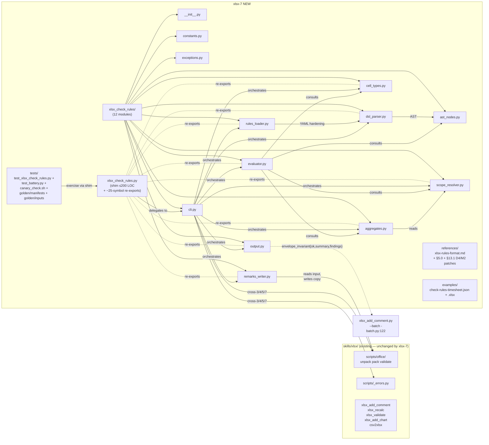

# ARCHITECTURE: xlsx-7 — `xlsx_check_rules.py` (declarative business-rule validator)

> **Template:** `architecture-format-core` + extended §5–§9 sections
> (this is a NEW system per architect-prompt §2 TIER-2 rule). The
> immediately preceding architecture (xlsx-6 / `xlsx_add_comment.py`,
> Tasks 001+002 — both MERGED 2026-05-08) is archived at
> [`docs/architectures/architecture-001-xlsx-add-comment.md`](architectures/architecture-001-xlsx-add-comment.md)
> and is the **reference precedent** for shim+package layout, OOXML
> mutation patterns, cross-skill envelopes, and golden-file diff
> strategy. xlsx-7 mirrors those patterns where applicable; deviations
> are called out inline.
>
> **Status (2026-05-08):** ✅ MERGED — 20-step atomic chain (003.01–003.17)
> shipped. Per-subtask review trail in `docs/reviews/task-003-*.md`;
> per-subtask archives in `docs/tasks/task-003-*.md`.
>
> **As-built deltas vs. this architecture document** (kept here so
> future readers don't have to diff against git history):
>
> 1. **AST node count grew from 17 to 22** (frozen-dataclass count in
>    `ast_nodes.py`). The closed-AST contract held — no new node was
>    needed at parse time; the additional types are internal helpers
>    (`ValueRef` sentinel for the magic implicit `value`; `Operand`
>    union; small dispatch types for `_resolve_operand`). The §6.1
>    "17 types" headline number in this document refers to the
>    *user-visible* AST surface; cf. `xlsx_check_rules/ast_nodes.py`
>    for the actual count.
> 2. **Package LOC budget overshoot (+6.5 %).** The architect-locked
>    cap was 3560 LOC across 11 modules; actual is 3791 LOC, with
>    `evaluator.py` (518 LOC) breaching the per-module 500 cap by 18
>    lines. The overshoot is concentrated in F7's polymorphic AST-node
>    dispatch (10 predicate types × per-cell `Finding` short-circuiting
>    in every branch). Honest-scope disclosure in
>    [`skills/xlsx/scripts/.AGENTS.md`](../skills/xlsx/scripts/.AGENTS.md)
>    "Honest budget overshoot" subsection.
> 3. **GroupByCheck wiring landed in 003.17, not 003.12.** The 003.12
>    aggregates module shipped `eval_group_by` correctly, but the
>    evaluator's per-cell dispatch routed `GroupByCheck` to
>    `_aggregate_unimplemented` for the entire 003.13–003.16b
>    interval (no integration test caught it). 003.17 added
>    `_eval_group_by_rule` in `evaluator.py` that short-circuits at
>    the rule level and emits one Finding per VIOLATING GROUP per
>    SPEC §7.1.3 grouped-finding shape (cell=sheet, row/column=null,
>    `group=null` for the synthetic empty-key partition). The fix
>    is locked by the worked example
>    [`skills/xlsx/examples/check-rules-timesheet.{json,xlsx}`](../skills/xlsx/examples/).
> 4. **Canary saboteurs hardened post-Sarcasmotron.** `tests/canary_check.sh`
>    was tightened with (a) post-`sed` `cmp -s` assertion catching
>    pattern-no-match and (b) textual unittest-output grep that
>    rejects `unexpected success` (xfail-rc inversion). PRECONDITION
>    for Stage-2: every saboteur-targeted manifest must carry
>    `xfail: false`.
> 5. **Message placeholder syntax disambiguated.** SPEC §3 row 168
>    + §10 worked example originally used `{value}` (Python
>    `str.format` syntax); the implementation correctly uses
>    `string.Template.safe_substitute` (`$value`/`${value}`) per
>    SPEC §6.3 format-string-injection guard. 003.17 patched the SPEC
>    text to align with the implementation. The mixed syntax in the
>    pre-merge git history is not a regression.

## 1. Task Description

- **TASK:** [`docs/TASK.md`](TASK.md) (Task 003, slug `xlsx-check-rules`,
  draft v2 — Task-Reviewer M1/M2 applied per `docs/reviews/task-003-review.md`).
- **SPEC contract:** [`skills/xlsx/references/xlsx-rules-format.md`](../skills/xlsx/references/xlsx-rules-format.md)
  (1456 lines, 12 sections + §13 regression battery — frozen pre-merge).
- **Brief summary of requirements:** Ship `skills/xlsx/scripts/xlsx_check_rules.py`
  — a CLI that loads `rules.{json,yaml}` alongside an `.xlsx` workbook
  and emits machine-readable findings (`{ok, schema_version, summary,
  findings}`). No `eval`, no code execution on hostile input — rules
  parse into a closed 17-node AST via a hand-written recursive-descent
  parser. Optional `--output OUT.xlsx --remark-column …` writes a
  copy with severity-tinted remarks. Pipes directly into
  `xlsx_add_comment.py --batch -` (xlsx-6) for findings-as-comments.

- **Decisions this document closes (TASK Open Questions):**

  | TASK Q | Decision | Rationale |
  |---|---|---|
  | **Q2 — Module split** | **11 modules + `__init__.py` (12 files), total ≤ 3560 LOC, each ≤ 500 LOC** — locked in §3.2. | Mirrors xlsx-6 Task-002 layout: each F1–F11 functional region maps to one module; no module owns >1 region. The 3560 cap is +27 % over the 2200–2800 LOC estimate (architect-review M-3) — defensible engineering buffer that absorbs the unknowns of a 17-AST-node hand-written parser + Excel-Tables resolver. The estimate is best-case (xlsx-6-shaped); the cap protects against under-estimating dsl_parser.py (where recursive-descent grammars routinely overshoot estimates). |
  | **Q3 — Streaming `--remark-column-mode replace`** | **A — Read-source / write-dest dual stream, single pass each.** | (a) `WriteOnlyWorkbook` is one-pass by definition; a second-pass design defeats the purpose of `--streaming-output`. (b) `write_remarks_streaming` opens the source via `openpyxl.load_workbook(read_only=True)` and the destination via `WriteOnlyWorkbook`; for each source row it constructs `[cell_or_remark for col in range(1, max_col+1)]` and `append`s. The remark column letter need not be the rightmost data column — substitution at the chosen column index works for any letter ≤ `max_col` (M-1 fix). (c) For `--remark-column LETTER` to the right of `max_col`, the loop extends the row vector with empty cells up to LETTER's index, then writes the remark; positional `append` handles this correctly. (d) `--remark-column auto` is REJECTED with streaming (DEP-4) because auto-pick needs to read existing column letters, which `WriteOnlyWorkbook` doesn't expose; user must pass an explicit letter. **Rejected option B** (reject placements requiring a second pass): no second pass is actually needed under the dual-stream design, so option B's user-facing constraint never fires. |
  | **Q5 — Fixture-set storage** | **A for fixtures < 50 KB, B for `huge-100k-rows.xlsx` only.** | (a) Hybrid keeps git slim while paying the 100K-row generation cost (estimated 8–15 s, openpyxl `WriteOnlyWorkbook`) only when manifests change. (b) `tests/golden/inputs/_generate.py --check` at CI start re-hashes the manifest and decides whether to regenerate; otherwise reuse the committed binary. (c) Committed binaries: `huge-100k-rows.xlsx`, `huge-100k-rows.rules.json` (~10–20 MB). All other 38 fixtures: regenerated each run. |
  | **Q7 — `version: 1` strictness** | **Hard exit 2 `RulesParseError: VersionMismatch` on missing or non-`1` version.** | (a) CI determinism: implicit-default + warning is the worst of both worlds (warnings get suppressed, drift goes silent). (b) Future v2 break gets a clean signal. (c) Mirrors the rest of §2.1 strict-rejection theme (anchors / custom tags / dup-keys). Cost to user is one keystroke (`"version": 1`). |

- **Decisions inherited from TASK §0** (D1–D6, locked at Analysis phase
  + Task-Reviewer round-1; reproduced here so this document is
  self-contained and the Architect handoff is gap-free):

  | D | Decision |
  |---|---|
  | D1 | **Atomic chain delivery** (target 12–18 sub-tasks; planning to lock per-link slice). |
  | D2 | **Shim + package up front** — `scripts/xlsx_check_rules.py` (≤ 200 LOC) + `scripts/xlsx_check_rules/` (11 modules — see §3.2). |
  | D3 | **Helper-script generated fixtures** — `tests/golden/inputs/_generate.py` builds 38 of 39 fixtures from declarative manifests; #31 (huge) is committed once per Q5=hybrid. |
  | D4 | **openpyxl 7-error-code subset honoured** (`#NULL!`, `#DIV/0!`, `#VALUE!`, `#REF!`, `#NAME?`, `#NUM!`, `#N/A`); modern codes (`#SPILL!`, `#CALC!`, `#GETTING_DATA`) demoted to honest scope (user-rule workaround). SPEC §5.0 must be updated accordingly. |
  | D5 | **4-shape hand-coded ReDoS lint as the SOLE parse-time check** (architect-review m1: `recheck` is a JVM CLI, not a Python wheel — original "soft import" framing was a category error; corrected here). Per-cell `regex.fullmatch(timeout=100ms)` is the runtime safety net. `recheck` stays OUT of `requirements.txt` AND is not subprocess-invoked. See §6.3 for the locked behaviour. |
  | D6 | **Perf-test gating via `RUN_PERF_TESTS=1` env var** — fixture #31 skipped in CI by default. |

## 2. Functional Architecture

> **Convention:** F1–F11 are functional regions, each mapping 1:1
> to a Python module inside `skills/xlsx/scripts/xlsx_check_rules/`.
> See §3.2 for module file paths and LOC budgets. The Planner
> uses this F-numbering to size atomic-chain links (D1).

### 2.1. Functional Components

**Component F1 — CLI / Argument Parser** (TASK Epic E5)

- **Purpose:** Accept the user's CLI invocation, parse / validate
  argparse mutex/dep rules (MX-A, MX-B, DEP-1..DEP-7 from TASK §2.5),
  produce a typed `Args` dataclass.
- **Functions:**
  - `build_parser() -> argparse.ArgumentParser`: single-purpose builder; no side effects.
  - `parse_args(argv) -> Args`: invoke parser + post-parse cross-checks (DEP-4/5 streaming-incompatible combos → exit 2 `IncompatibleFlags`; DEP-6 `,`/`;` separator auto-detect; DEP-7 `--json-errors` envelope routing).
  - `Args` dataclass keys: `input_path, rules_path, output_path, json_mode, strict, require_data, severity_filter, max_findings, summarize_after, timeout_seconds, sheet_override, header_row_override, include_hidden, no_strip_whitespace, no_table_autodetect, no_merge_info, ignore_stale_cache, strict_aggregates, treat_numeric_as_date, treat_text_as_date, remark_column, remark_column_mode, streaming_output, json_errors`.
  - Related Use Cases: TASK I5.1, I5.2, I5.3.
- **Dependencies:** `argparse`, `_errors` (cross-5).

**Component F2 — Rules-file loader** (TASK Epic E1, Issue I1.1)

- **Purpose:** Load `--rules PATH` (JSON or YAML), enforce 1 MiB pre-parse cap, hardened YAML reader.
- **Functions:**
  - `load_rules_file(path) -> dict`: dispatch on extension; size-cap pre-parse; route to `_load_json` or `_load_yaml_hardened`.
  - `_load_yaml_hardened(text) -> dict`: ruamel.yaml `YAML(typ='safe', pure=True, version=(1,2))`, `allow_duplicate_keys=False`. Hooks the parser event stream — abort on any `AliasEvent` or non-empty `anchor` field on `ScalarEvent`/`SequenceStartEvent`/`MappingStartEvent` BEFORE composition. Custom-tag constructor refuses any tag outside canonical YAML 1.2 schema.
  - **Q7=hard:** missing/wrong `version` → exit 2 `RulesParseError: VersionMismatch`.
  - Raises: `RulesFileTooLarge`, `RulesParseError` (with sub-type detail), `IOError` (exit 5).
  - Related Use Cases: TASK I1.1.
- **Dependencies:** `ruamel.yaml>=0.18.0`, stdlib `json`, `pathlib`.

**Component F3 — DSL parser & AST builder** (TASK Epic E1, Issue I1.2)

- **Purpose:** Parse `check` field strings into the closed 17-node AST. Hand-written recursive descent (NOT `ast.parse`).
- **Functions:**
  - `parse_check(text, depth=0) -> ASTNode`: recursive descent over §5 SPEC grammar. Tracks composite depth; exit 2 `CompositeDepth` if > 16.
  - `parse_composite(dict_form, depth) -> Logical`: object form (`and`/`or`/`not`).
  - `parse_scope(text) -> ScopeNode`: 10 forms per SPEC §4.
  - `lint_regex(pattern) -> None`: D5 closure (architect-review m1) — sole parse-time check is the hand-coded reject-list for the 4 classic ReDoS shapes (`(a+)+`, `(a*)*`, `(a|a)+`, `(a|aa)*`). `recheck` is NOT used (JVM CLI, would require `subprocess`). Per-cell `regex.fullmatch(timeout=100ms)` in F7 is the runtime safety net for patterns that escape the 4-shape lint.
  - `validate_builtin(name) -> None`: enforces 12-name whitelist (`sum/avg/mean/min/max/median/stdev/count/count_nonempty/count_distinct/count_errors/len`) → `UnknownBuiltin`.
  - Related Use Cases: TASK I1.2.
- **Dependencies:** `regex>=2024.0`, `recheck` (soft import per D5).

**Component F4 — AST node types** (TASK Epic E1 + E3, foundation)

- **Purpose:** Declare the 17 closed AST node dataclasses (used by F3 and F7). No logic; no import of cell evaluation.
- **Types:** `Literal`, `CellRef`, `RangeRef`, `ColRef`, `RowRef`, `SheetRef`, `NamedRef`, `TableRef`, `BuiltinCall`, `BinaryOp`, `UnaryOp`, `In`, `Between`, `Logical`, `TypePredicate`, `RegexPredicate`, `LenPredicate`, `StringPredicate`, `DatePredicate`, `GroupByCheck`. Plus `RuleSpec` (top-level wrapper carrying `id, scope, check, severity, message, when, skip_empty, tolerance, header_row, visible_only, treat_numeric_as_date, treat_text_as_date, unsafe_regex` per §3 SPEC).
- **Functions:** dataclasses + `__repr__` + `to_canonical_str(node)` for §5.5.3 cache-key normalisation.
- **Dependencies:** stdlib `dataclasses`, `enum`. Pure.

**Component F5 — Cell-value canonicaliser** (TASK Epic E2, Issue I2.1)

- **Purpose:** Map openpyxl cell → 6 logical types (`number/date/bool/text/error/empty`), per SPEC §3.5.
- **Functions:**
  - `classify(cell, opts) -> (LogicalType, value_or_error)`: read `cell.data_type` and number-format string; map per §3.5.
  - `is_excel_serial_date(n) -> bool`: window check `[25569, 73050]` for `--treat-numeric-as-date` path.
  - `coerce_text_as_date(s, dayfirst) -> datetime|None`: dateutil with `fuzzy=False`; for `--treat-text-as-date` path. Documented honest-scope (no true strict mode).
  - `cell_error_token(error_str) -> CellError`: D4 — token for the 7 openpyxl-recognised codes only.
  - `whitespace_strip(text, opts) -> str`: default-on per `--no-strip-whitespace`.
  - Related Use Cases: TASK I2.1.
- **Dependencies:** `openpyxl>=3.1.5`, `python-dateutil>=2.8.0`.

**Component F6 — Scope resolver** (TASK Epic E2, Issue I2.2)

- **Purpose:** Resolve all 10 SPEC §4 scope forms → concrete `(sheet_name, list[Cell])` tuples. Owns Excel-Tables auto-detect, header-row resolution, merged-cell anchor logic, hidden-row/col filter.
- **Functions:**
  - `resolve_scope(scope_node, workbook, defaults) -> ScopeResult`: dispatch on `ScopeNode` type; raises `AmbiguousHeader` / `HeaderNotFound` / `MergedHeaderUnsupported`.
  - `resolve_sheet(qualifier, workbook) -> Worksheet`: SPEC §4.1; case-sensitive; first-non-hidden-XML-order default.
  - `resolve_header(name, sheet, defaults, allow_table_fallback) -> column_letter`: SPEC §4.2 + §4.3; reads `xl/tables/tableN.xml` for fallback (default-on; `--no-table-autodetect` opts out).
  - `iter_cells(scope_result, opts) -> Iterator[Cell]`: applies `--visible-only` filter; emits one `merged-cell-resolution` info per merge encountered (suppress `--no-merge-info`).
  - `resolve_named(name, workbook) -> Range`: rejects multi-area `definedName`.
  - Related Use Cases: TASK I2.2.
- **Dependencies:** `openpyxl>=3.1.5`, `lxml>=5.0.0`, `defusedxml>=0.7.1` (only for Excel-Tables XML).

**Component F7 — Rule evaluator** (TASK Epic E3, Issues I3.1–I3.7)

- **Purpose:** Evaluate AST nodes against cell values; produce per-cell findings.
- **Functions:**
  - `eval_rule(rule_spec, scope_result, ctx) -> Iterator[Finding]`: outer loop over cells; pre-rule triage (§5.0 — error-cells short-circuit to synthetic `cell-error` finding suppressing other rules).
  - `eval_check(node, value, ctx) -> bool`: dispatch on AST type; covers §5.1 comparisons / §5.2 type guards / §5.3 text+regex / §5.4 dates / §5.5 cross-cell aggregates / §5.7 composite.
  - `eval_regex(pattern_compiled, value, timeout_ms) -> bool`: `regex` lib `fullmatch(timeout=)`; on TimeoutError → emits `rule-eval-timeout` finding.
  - `eval_arithmetic(binop, left, right, ctx) -> num`: SPEC §5.5.2 (no `**`, no `%`, no bitwise; date arithmetic → `rule-eval-error`).
  - `format_message(template, value, ctx) -> str`: `string.Template($value, $row, …)` per SPEC §6.3 — NOT `str.format`.
  - Related Use Cases: TASK I3.1–I3.7, I3.8 (cell triage + cached-value preflight).
- **Dependencies:** F4, F5, `regex>=2024.0`, stdlib `string`, `decimal`.

**Component F8 — Aggregate cache & evaluator** (TASK Epic E7, Issues I7.1–I7.2)

- **Purpose:** Implement §5.5.3 aggregate cache: canonical-key SHA-1, per-cell skip/error-event capture, replay semantics, `summary.aggregate_cache_hits` counter.
- **Functions:**
  - `eval_aggregate(call_node, scope_node, ctx) -> CacheEntry`: cache-hit-or-compute; cache key = SHA-1 of canonical `(sheet, scope, fn)` after whitespace/quote normalisation, header→letter resolution, Table-fallback equivalence.
  - `replay_events(entry, rule_id, ctx) -> None`: emit per-cell skip/error events into the calling rule's finding stream; intra-rule replay dedups on `(rule_id, cell)`.
  - `eval_group_by(call_node, ctx) -> dict[group_key, num]`: SPEC §5.6.
  - Related Use Cases: TASK I7.1–I7.2.
- **Dependencies:** F4, F5, F6, stdlib `hashlib`, `statistics`.

**Component F9 — Output emitter** (TASK Epic E4, Issues I4.1–I4.4)

- **Purpose:** Produce the `{ok, schema_version, summary, findings}` JSON envelope (stdout when `--json`) and the human-readable stderr report. Owns sort order, sentinel substitution, finding caps, `--summarize-after` collapse.
- **Functions:**
  - `emit_findings(findings, summary, opts, fp) -> None`: deterministic 5-tuple sort `(sheet, row, column, rule_id, group)` with type-homogeneous sentinels per SPEC §7.1.2 (group findings: `row=2**31-1`, `column="￿"`, `group=str`; per-cell findings: `group=""`).
  - `apply_max_findings(findings, N) -> (capped, truncated_flag)`: stops after N; appends synthetic `max-findings-reached`.
  - `apply_summarize_after(findings, N_per_rule) -> findings`: collapses runs of same `rule_id` into `{count, sample_cells[10]}`.
  - `emit_human_report(findings, severity_filter, fp) -> None`: rule_id / cell / severity / message lines.
  - **M2 invariant** (TASK I8.2): the JSON output MUST always carry `{ok, summary, findings}` — even on `--max-findings 0`, partial-flush, `--severity-filter` paths — to satisfy xlsx-6's batch.py:122 envelope gate.
  - Related Use Cases: TASK I4.1–I4.4, I8.2.
- **Dependencies:** stdlib `json`, `sys`.

**Component F10 — Workbook output writer** (TASK Epic E6, Issues I6.1–I6.3)

- **Purpose:** When `--output OUT.xlsx`, write a copy with optional remark column. Two write paths: full-fidelity (default) and streaming (`--streaming-output`).
- **Functions:**
  - `write_remarks(input_path, output_path, findings_per_cell, opts) -> None`: full-fidelity path uses `openpyxl.load_workbook` + per-cell write + `save()`; preserves comments / drawings / charts / defined names on un-modified cells.
  - `write_remarks_streaming(input_path, output_path, findings_per_cell, opts) -> None`: dual-stream design (Q3=A, M-1 closure) — opens source via `openpyxl.load_workbook(read_only=True)` and destination via `WriteOnlyWorkbook`. For each source row, builds `[cell_or_remark for col in range(1, max_col_or_remark_idx+1)]` and `append`s. Remark column letter need not be the rightmost — substitution at the chosen column index works for any letter ≤ source's max_col, and for letters past max_col the row is extended with empty cells up to the remark index. Rejects `--remark-column auto` (DEP-4) and `--remark-column-mode append` (DEP-5) at arg-parse.
  - `allocate_remark_column(sheet, mode, explicit_letter_or_header) -> column_letter`: implements `auto` / `LETTER` / `HEADER` placement; SPEC §8.1 + Q3 closure.
  - `apply_remark_mode(existing_value, new_message, mode) -> str`: `replace` overwrite / `append` newline-concat / `new` (allocate sibling letter `_2` suffix).
  - `apply_pattern_fill(cell, severity) -> None`: red (errors) / yellow (warnings) / blue (info) — full-fidelity only; streaming path uses inline-style `PatternFill` (one of the documented streaming trade-offs in SPEC §11.2).
  - `assert_distinct_paths(input, output) -> None`: cross-7 H1 `Path.resolve()` same-path → exit 6 `SelfOverwriteRefused`.
  - Related Use Cases: TASK I6.1–I6.3.
- **Dependencies:** `openpyxl>=3.1.5`, F2 (rules-side defaults), `_errors`.

**Component F11 — Pipeline orchestrator (`main`)** (TASK Epics E5, E8, ALL glue)

- **Purpose:** End-to-end glue: `parse_args → load_rules → parse_ast → unpack workbook → encryption/macro/same-path checks → for-each-rule(eval+aggregate) → emit JSON+stderr → optional output writer`.
- **Functions:**
  - `main(argv=None) -> int`: returns exit code.
  - `_run(args) -> int`: linear pipeline; cross-3 fail-fast on encrypted; cross-4 `.xlsm` warning; cross-5 `--json-errors` envelope on fatal codes 2/3/5/6/7; cross-7 H1 same-path guard (only when `--output` is set).
  - **Wall-clock watchdog (architect-locked per M-2):** A `_TimeoutFlag` shared object is set by either (a) a `signal.SIGALRM` handler (POSIX) or (b) a daemon `threading.Timer` (Windows fallback). The handler/timer **only sets the flag** — it does NOT call `_partial_flush` and does NOT touch stdout. The per-rule loop in `_run` checks `_TimeoutFlag.tripped` between rules (and between cells inside a long-running rule); on trip it breaks the loop cleanly, then the **main thread** calls `_partial_flush` post-loop.
  - `_partial_flush(findings, summary, opts) -> None`: SPEC §7.3 exit-7 timeout. Always called from the **main thread** post-loop, **never** from a signal handler (async-signal-unsafe wrt `json.dump` would emit a torn envelope and silently break xlsx-6's all-three-keys gate, which is exactly the regression fixture #39a is built to catch but cannot if the test harness times out before the handler completes — M-2 closure). Sets `summary.elapsed_seconds = timeout_seconds`, `summary.truncated = false`, then writes the all-three-keys envelope `{ok, summary, findings}` via `json.dump(..., fp); fp.flush()`. Stdout is opened line-buffered via `os.fdopen(1, 'w', buffering=1)` at process start (in `main`) so no buffered prefix can be lost on `os._exit`. After the flush, `_run` returns exit code 7.
  - Related Use Cases: TASK ALL Epics.
- **Dependencies:** F1–F10, `office._encryption.assert_not_encrypted`, `office._macros.warn_if_macros_will_be_dropped`, `_errors`, stdlib `signal` / `threading`.

### 2.2. Functional Components Diagram

```mermaid
flowchart TB
    User[CLI invoker] --> F1[F1 ArgParser]
    F1 --> F11[F11 Orchestrator main]
    F11 --> Cross3[office._encryption<br/>assert_not_encrypted]
    F11 --> Cross4[office._macros<br/>warn_if_macros]
    F11 --> SamePath[Path.resolve eq guard<br/>cross-7 H1<br/>only when --output]
    F11 --> F2[F2 RulesLoader<br/>JSON / YAML hardened]
    F2 --> F3[F3 DSL Parser<br/>recursive descent]
    F3 --> F4[F4 AST nodes]
    F11 --> F5[F5 CellCanonicaliser]
    F11 --> F6[F6 ScopeResolver]
    F6 --> F5
    F11 --> F7[F7 RuleEvaluator]
    F7 --> F4
    F7 --> F5
    F7 --> F6
    F7 --> F8[F8 AggregateCache]
    F8 --> F6
    F11 --> F9[F9 OutputEmitter<br/>JSON envelope + stderr]
    F11 --> F10[F10 RemarksWriter<br/>full / streaming]
    F11 --> Errors[_errors.report_error<br/>cross-5]
    F2 -. fatal .-> Errors
    F3 -. fatal .-> Errors
    F11 -. fatal .-> Errors
    F9 -. envelope_invariant{ok,summary,findings}<br/>xlsx-6 batch.py:122 .-> Pipe[xlsx_add_comment.py<br/>--batch -]
```

## 3. System Architecture

### 3.1. Architectural Style

**Style:** Python CLI with a thin **shim script** (`xlsx_check_rules.py`,
≤ 200 LOC) that delegates to a co-located **`xlsx_check_rules/`
package** (12 files = 11 implementation modules + a near-empty
`__init__.py`). D2 from TASK §0; matches xlsx-6 post-Task-002 layout
verbatim.

**Justification:**
- Estimated implementation size ~ 2200–2800 LOC (ratio of TASK requirements R1–R14 to xlsx-6's 2339 LOC). Architect-review M-3 closure: the §3.2 LOC budget table caps total at **3560 LOC** (+27 % over the upper estimate) — an explicit engineering buffer for the unknowns of a hand-written 17-AST-node recursive-descent parser and the Excel-Tables resolver. A Developer who hits the cap on a single module without crossing the total has signal to refactor; total cap forces an architectural review. Crossing the navigability threshold on day one — single-file would pay the same Task-002 refactor cost, only later. D2 + this ARCHITECTURE preempts that cost.
- One module per F-region keeps cross-module imports unidirectional: F1 → F11; F2 → F3 → F4; F5/F6/F7/F8 form a layered evaluation stack; F9/F10 are pure sinks. No cycles, easy to plan as atomic-chain links.
- xlsx-7 is **xlsx-private**: NO new shared abstraction is introduced into `office/`. CLAUDE.md §2 4-skill replication does NOT activate. All `office/`-shared modules (`_errors.py`, `_soffice.py`, `preview.py`, `office_passwd.py`, `office/`) are READ-ONLY consumers from xlsx-7.
- The shim re-exports a stable test-compat surface (selected names from F2, F4, F5, F6, F7, F9, F10, F11) so the test suite can `from xlsx_check_rules import …` without knowing the package internals.

**Anti-pattern explicitly avoided** (mirrors xlsx-6 ARCHITECTURE §3.1
note): promoting any xlsx-7 helper to `office/` would trigger the
**4-skill replication burden** documented in CLAUDE.md §2. None of
the xlsx-7 helpers (`scope_resolver`, `aggregate_cache`,
`rule_evaluator`) make sense in docx/pptx/pdf — they all touch
sheet/row/column abstractions that don't exist in those formats.
**Constraint, not a choice.**

### 3.2. System Components

**Component S1 — `skills/xlsx/scripts/xlsx_check_rules.py`** (NEW, shim)

- **Type:** Python 3.10+ CLI shim, ≤ 200 LOC.
- **Purpose:** Single user-facing entry point. Delegates to `xlsx_check_rules.cli:main()`. Re-exports the test-compat surface (target ~ 25 symbols, mirroring xlsx-6's 35 — final list locked in Planning).
- **Implemented Functions:** `if __name__ == "__main__": sys.exit(main())`. Re-imports symbols from package modules.
- **Technologies:** Python 3.10+ stdlib only.
- **Interfaces:**
  - **Inbound:** `python3 scripts/xlsx_check_rules.py …` (CLI per TASK §2.5).
  - **Outbound:** delegates to `xlsx_check_rules.cli.main(argv)` and returns its exit code.
- **Dependencies:** `xlsx_check_rules.*` package (next sibling).

**Component S1.pkg — `skills/xlsx/scripts/xlsx_check_rules/`** (NEW, 12 files)

- **Type:** Python 3.10+ package private to the xlsx skill.
- **Purpose:** Houses the F1–F11 implementation.
- **Modules** (locked per Q2=A; one F-region per module; LOC budgets are caps, not targets):

  | Module | Maps to F | Public API (selected) | LOC budget |
  |---|---|---|---|
  | `__init__.py` | — | (near-empty; re-exports `main` for shim) | ≤ 10 |
  | `constants.py` | (F-Constants) | namespaces, `RULES_MAX_BYTES = 1 MiB`, `COMPOSITE_MAX_DEPTH = 16`, `BUILTIN_WHITELIST`, `EXCEL_SERIAL_DATE_RANGE = (25569, 73050)`, `OPENPYXL_ERROR_CODES` (D4: 7 codes), `DEFAULT_TIMEOUT_SECONDS = 300`, `DEFAULT_MAX_FINDINGS = 1000`, `DEFAULT_SUMMARIZE_AFTER = 100`, `DEFAULT_REGEX_TIMEOUT_MS = 100`, `REDOS_REJECT_PATTERNS = ((r'^\(.*\+\)\+$', …), …)` (4 classic shapes per D5 fallback) | ≤ 80 |
  | `exceptions.py` | (F-Errors) | `_AppError` + 16 typed errors: `RulesFileTooLarge`, `RulesParseError` (with subtypes `VersionMismatch` / `UnknownBuiltin` / `CompositeDepth` / `IncompatibleFlags` / `MultiAreaName`), `AmbiguousHeader`, `HeaderNotFound`, `MergedHeaderUnsupported`, `EncryptedInput`, `CorruptInput`, `IOError`, `SelfOverwriteRefused`, `TimeoutExceeded`, plus internal `RegexLintFailed`, `AggregateTypeMismatch`, `CellError` (sentinel token, not raised), `RuleEvalError`. Each carries `code` / `type` / `details` for `_errors.report_error` envelope (cross-5). | ≤ 220 |
  | `ast_nodes.py` | F4 | 17 dataclasses (§2.1 F4 list) + `RuleSpec`, `to_canonical_str(node)` for cache-key normalisation. | ≤ 250 |
  | `rules_loader.py` | F2 | `load_rules_file`, `_load_yaml_hardened` (event-stream alias reject), `_validate_version` (Q7=hard) | ≤ 200 |
  | `dsl_parser.py` | F3 | `parse_check`, `parse_composite`, `parse_scope`, `lint_regex` (D5 soft import), `validate_builtin` | ≤ 400 |
  | `cell_types.py` | F5 | `classify`, `is_excel_serial_date`, `coerce_text_as_date`, `cell_error_token` (D4), `whitespace_strip` | ≤ 200 |
  | `scope_resolver.py` | F6 | `resolve_scope`, `resolve_sheet`, `resolve_header` (with Excel-Tables fallback), `iter_cells`, `resolve_named` | ≤ 400 |
  | `evaluator.py` | F7 | `eval_rule`, `eval_check`, `eval_regex`, `eval_arithmetic`, `format_message` (string.Template) | ≤ 450 |
  | `aggregates.py` | F8 | `eval_aggregate` (cache + replay), `eval_group_by`, `_canonical_cache_key` (SHA-1) | ≤ 250 |
  | `output.py` | F9 | `emit_findings`, `apply_max_findings`, `apply_summarize_after`, `emit_human_report`, **M2 invariant: always emits `{ok, summary, findings}`** | ≤ 250 |
  | `remarks_writer.py` | F10 | `write_remarks`, `write_remarks_streaming` (Q3=A: pre-allocate column), `allocate_remark_column`, `apply_remark_mode`, `apply_pattern_fill`, `assert_distinct_paths` | ≤ 350 |
  | `cli.py` | F1 + F11 | `build_parser`, `parse_args`, `main`, `_run`, `_partial_flush` | ≤ 500 |
  | **Total cap** | | | **≤ 3560** (engineering buffer over the ~2200–2800 estimate) |

- **Internal API rules:**
  - Each module declares `__all__`. Cross-module imports are sibling-relative (`from .ast_nodes import RuleSpec`). Imports through the shim (`from xlsx_check_rules import …`) are **forbidden inside the package** to prevent re-import cycles (mirrors xlsx-6 TASK R4.b).
  - `_HARDENED_YAML_PARSER` (ruamel.yaml event-stream filter) lives in `rules_loader.py` and is the security boundary against billion-laughs / custom-tag attacks on tampered rules.
  - `_REGEX_COMPILE_CACHE` lives in `evaluator.py`; one `regex.compile(pattern)` per unique pattern per run (R9.c).
  - `_AGGREGATE_CACHE` lives in `aggregates.py`; process-local; not persisted.

**Component S1.shim re-export contract**

- The shim re-exports the symbol set documented as `__all__` in each
  package module — the **test-compat surface**. Final list locked in
  Planning when test files exist. Target: ≤ 30 symbols (xlsx-6 has 35;
  xlsx-7 is leaner because openpyxl-side helpers don't need
  re-exporting).

**Component S2 — `skills/xlsx/references/xlsx-rules-format.md`** (MODIFIED — D4 propagation)

- **Modifications (Issue I9.5):**
  - §Status header: "design spec for backlog item xlsx-7" → "implementation reference (v1 merged 2026-MM-DD)".
  - §5.0: error-code list reduced from 10 to 7 (D4); `#SPILL!` / `#CALC!` / `#GETTING_DATA` moved into a new §11.x bullet "modern-Excel error codes not auto-detected by openpyxl<3.2 — user-rule workaround required".
  - §13.1: add fixture #10b (negative test: `#SPILL!` stored as text → no `cell-error` finding); add fixtures #39a and #39b (M2: envelope all-three-keys invariant on partial-flush + `--max-findings 0`).

**Component S3 — `skills/xlsx/SKILL.md`** (MODIFIED)

- **Modifications:**
  - §2 Capabilities — add "declarative rules-based validation" bullet.
  - §4 Script Contract — add `xlsx_check_rules.py` CLI signature (one line, full flag list cross-referencing TASK §2.5).
  - §10 Quick Reference — add row (template per TASK I9.5 AC).
  - §12 Resources — link `xlsx_check_rules.py`, `examples/check-rules-timesheet.{json,xlsx}`, `references/xlsx-rules-format.md`.

**Component S4 — `skills/xlsx/scripts/.AGENTS.md`** (MODIFIED)

- **Modifications:** add a "xlsx_check_rules/" module map section (mirrors the xlsx-6 entry); declare the `regex>=2024.0`, `python-dateutil>=2.8.0`, `ruamel.yaml>=0.18.0`, `openpyxl>=3.1.5` dep deltas and reference D5 soft-import policy for `recheck`.

**Component S5 — `skills/xlsx/examples/check-rules-timesheet.json` + `…timesheet.xlsx`** (NEW, both files)

- **Type:** SPEC §10 worked example committed as runnable fixture.
- **Purpose:** Showcase a realistic timesheet validation; doubles as smoke-test fixture #2 for the battery.

**Component S6 — `skills/xlsx/scripts/tests/`** (NEW directory tree)

- **Sub-components:**
  - `tests/test_xlsx_check_rules.py` (NEW, Python unittest) — unit tests for F2 (loader hardening), F3 (parser AST + ReDoS lint), F4 (canonicalisation), F5 (cell types incl. D4 7-code subset), F6 (scope forms incl. AmbiguousHeader/HeaderNotFound/MergedHeader), F7 (per-check eval), F8 (cache replay determinism + #19a strict mode), F9 (sort sentinel + caps + M2 invariant), F10 (remarks). Naming convention `Test*HonestScope*` for negative-test classes.
  - `tests/test_battery.py` (NEW) — Q5=hybrid driver: walks `tests/golden/manifests/`, runs `tests/golden/inputs/_generate.py --check` (re-hash manifest; regenerate if stale; `huge-100k-rows.xlsx` cached unless its manifest hash changes), invokes `xlsx_check_rules.py`, asserts `(exit_code, summary keys subset, findings rule_id set ⊇ required, ∩ forbidden = ∅)`.
  - `tests/canary_check.sh` (NEW) — 10 saboteurs per SPEC §13.3; reverts via `trap`. CI gate: each saboteur MUST cause battery to fail.
  - `tests/golden/inputs/_generate.py` (NEW, Python) — D3 fixture generator from manifests in `tests/golden/manifests/*.yaml`. `--check` mode for Q5 hybrid (re-hash manifest, regenerate stale).
  - `tests/golden/manifests/*.yaml` (NEW) — declarative fixture descriptors (one per fixture #1–#39 + #10b + #39a + #39b).
  - `tests/golden/inputs/.gitignore` — excludes auto-generated `.xlsx` / `.json` outputs (Q5=A small fixtures); explicit `!huge-100k-rows.xlsx` allow-list (Q5=B large fixture committed).
  - `tests/golden/README.md` (NEW) — fixture provenance + "agent-output-only — DO NOT open in Excel" warning (R14.e).
  - `tests/test_e2e.sh` (MODIFIED) — append a new `xlsx_check_rules` block exercising the 39 fixtures + xlsx-6 envelope pipeline #39 / #39a / #39b.

**Component S7 — `skills/xlsx/scripts/requirements.txt`** (MODIFIED)

- **Modifications:**
  - Bump `openpyxl>=3.1.0` → `openpyxl>=3.1.5` (R2 / SPEC §5.4.2 locale-format date detection).
  - Add `regex>=2024.0` (per-cell timeout for §5.3.1).
  - Add `python-dateutil>=2.8.0` (likely already a transitive dep of pandas; pin explicitly for `--treat-text-as-date`).
  - Add `ruamel.yaml>=0.18.0` (YAML 1.2 hardening).
  - **NOT added:** `recheck` (D5 soft import only).

**Component S8 — `THIRD_PARTY_NOTICES.md`** (MODIFIED, root)

- **Modifications:** add attributions for the 3 new direct deps (`regex`, `python-dateutil`, `ruamel.yaml`). Per CLAUDE.md §3 license hygiene, in the same commit that introduces them.

### 3.3. Components Diagram



## 4. Data Model (Conceptual)

> **Note:** xlsx-7 is a stateless validator. There is no relational
> DB, no persistent storage. The "data model" is the **in-memory
> graph** flowing through the pipeline + the **on-disk OOXML graph**
> the validator reads (and optionally writes a copy of). Three
> conceptual aggregates: (a) the **Rules tree** (parsed AST); (b)
> the **Workbook view** (cells classified into 6 logical types); (c)
> the **Findings stream** (output JSON envelope).

### 4.1. Entities Overview

#### Entity: `RuleSpec` (in-memory; F4)

- **Description:** One rule from `rules.{json,yaml}`, fully parsed.
- **Key attributes:** `id: str` (unique per file), `scope: ScopeNode`, `check: ASTNode`, `severity: Literal["error","warning","info"]` (default `error`), `message: str|None`, `when: ASTNode|None`, `skip_empty: bool` (default `True`), `tolerance: float` (default `1e-9`), `header_row: int|None`, `visible_only: bool|None`, `treat_numeric_as_date: bool|None`, `treat_text_as_date: bool|None`, `unsafe_regex: bool` (default `False`).
- **Business rules:**
  - `id` MUST be unique within the rules file; duplicate → exit 2 `RulesParseError`.
  - `severity` drives `summary.errors/warnings/info` counters and exit-code computation.
  - Composite-form `check` depth ≤ 16; deeper → exit 2 `CompositeDepth`.

#### Entity: `ScopeNode` + 10 sub-types (in-memory; F4)

- **Description:** AST representation of SPEC §4 scope forms.
- **Sub-types:** `CellRef("Sheet!A5")`, `RangeRef("Sheet!A2:A100")`, `ColRef(header_or_letter)`, `MultiColRef([...])`, `RowRef(N)`, `SheetRef(name)`, `NamedRef(name)`, `TableRef(name, [col])`.
- **Business rules:**
  - Sheet qualifier is case-sensitive; quoted form supports apostrophe-escape `''` → `'`.
  - `ColRef` resolves through `defaults.header_row` (default `1`); Excel-Tables fallback default-on (`--no-table-autodetect` opts out).
  - `NamedRef` rejects multi-area `definedName` at parse.

#### Entity: `LogicalCell` (in-memory; F5)

- **Description:** Canonicalised cell view; the unit of rule evaluation.
- **Key attributes:** `(sheet: str, row: int, col: str)`, `logical_type: LogicalType` (six-valued enum), `value: Union[int, float, str, bool, datetime, CellError, None]`, `is_anchor_of_merge: bool`, `merge_range: str|None`, `is_hidden: bool`.
- **Business rules:**
  - `logical_type` is computed once per cell; downstream stages (F7, F8) consume it without re-classification.
  - `error` cells short-circuit other rules via the §5.0 auto-emit path.
  - `empty` cells are filtered by `skip_empty: true` (default).

#### Entity: `Finding` (in-memory + JSON output; F9)

- **Description:** One emitted observation. Either per-cell or grouped (group-by aggregate).
- **Key attributes:**
  - Per-cell: `cell` (`Sheet!Ref`), `sheet`, `row: int`, `column: str`, `rule_id: str`, `severity: str`, `value: Any`, `expected: Any|absent`, `tolerance: float|absent`, `message: str`.
  - Grouped: same keys but `cell` = bare sheet name, `row: null`, `column: null`, `group: str`, `value` = aggregate result, `expected: float|absent`.
  - Synthetic (auto-emitted): `rule_id ∈ {"cell-error", "rule-eval-error", "rule-eval-timeout", "rule-eval-nan", "aggregate-type-mismatch", "merged-cell-resolution", "stale-cache-warning", "max-findings-reached", "no-data-checked", "aggregate-cache-replay"}`.
- **Business rules:**
  - **Sort key** is the 5-tuple `(sheet_name, row, column_letter, rule_id, group)` with type-homogeneous sentinels per SPEC §7.1.2 — `row=2**31-1`, `column="￿"`, `group=str` for grouped findings; `group=""` for per-cell findings. **MUST be deterministic** across runs (golden-file tests rely on this).
  - **JSON shape**: per-cell findings emit `row`/`column` as concrete values; grouped findings emit them as `null`. Sentinels exist only inside the sort key, never in JSON output.

#### Entity: `Summary` (in-memory + JSON output; F9)

- **Description:** Aggregate counters across the run.
- **Key attributes:** `errors, warnings, info, checked_cells, rules_evaluated, cell_errors, skipped_in_aggregates, regex_timeouts, eval_errors, aggregate_cache_hits, elapsed_seconds, truncated`.
- **Business rules:**
  - `errors/warnings/info` are **unfiltered totals** — reflect the workbook's actual state regardless of `--severity-filter` / `--max-findings`. Consumers wanting visible counts compute `len([f for f in findings if f.severity == X])` (SPEC §12.1 stability promise).
  - `aggregate_cache_hits` is the canary-tested counter (saboteur #9): N rules referencing the same canonical scope produce ≥ N − 1 hits.
  - `skipped_in_aggregates` is the unique-`(rule_id, cell)`-pair count post-replay-dedup.

#### Entity: `AggregateCacheEntry` (in-memory; F8)

- **Description:** Memoised aggregate result + per-cell skip/error events for replay.
- **Key attributes:** `(value: number, skipped_cells: list[CellRef], error_cells: list[CellRef], cache_hits: int)`.
- **Cache key:** SHA-1 of canonical `(sheet_resolved, scope_canonical, fn_name)` — SPEC §5.5.3 dedup spec; `col:Hours` and `table:T1[Hours]` hash to the same key when they refer to the same cell range under Excel-Tables fallback.
- **Business rules:**
  - **Replay determinism**: the second consumer of a cache entry replays per-cell skip/error events into its own rule context; intra-rule dedup on `(rule_id, cell)` (defensive); inter-rule no-dedup (each rule emits independently). Fixture #19a anchors this.

### 4.2. Pipeline-wide invariants the implementation MUST preserve

These invariants are the contract that makes xlsx-7 correct *and*
paranoid about hostile inputs. Each maps to a TASK requirement and
a regression fixture or canary saboteur:

1. **No `eval`** in xlsx-7's import graph (TASK R1.d / NFR; CI grep test).
2. **`ast.parse` not used** for DSL parsing (TASK R1.d / NFR; CI grep test).
3. **`yaml.safe_load` not imported** (TASK NFR; CI grep test).
4. **YAML rules-file rejects** anchors / aliases / custom tags / dup-keys / YAML-1.1 bool coercion in ≤ 100 ms (fixtures #23/#24/#25/#26).
5. **Composite depth cap 16** (fixture #27).
6. **Builtin whitelist 12 names** (fixture #30).
7. **Rules-file size cap 1 MiB** pre-parse (fixture #28).
8. **Closed AST 17 node types** — no attribute access, no `**`, no `%`, no bitwise, no lambda. **Locked by F3 parser unit tests in `tests/test_xlsx_check_rules.py`, not a §13 battery fixture** (architect-review m3 — the Planner should NOT size a fixture for this; the parser tests are exhaustive).
9. **D4 7-error-code subset** for §5.0 auto-emit (fixture #10 + new #10b).
10. **Deterministic finding sort** (5-tuple with sentinels per SPEC §7.1.2) — golden-file byte equality (fixture #2).
11. **M2 envelope all-three-keys invariant** — `{ok, summary, findings}` in xlsx-7 `--json` output, on every code path including partial-flush and `--max-findings 0` (fixtures #39a + #39b).
12. **Aggregate-cache canonicalisation** equates `col:Hours` with `table:T1[Hours]` when Tables-fallback resolution coincides — but ONLY when `--no-table-autodetect` is OFF (fixture #19).
13. **Same-path `--output` resolves** via `Path.resolve()` and follows symlinks → exit 6 (fixtures #37, parity with xlsx-6 cross-7 H1).
14. **Encryption fail-fast** at exit 3 via `office._encryption.assert_not_encrypted` (fixture #38).
15. **`.xlsm` macro warning** to stderr without aborting (cross-4 parity).
16. **`--json-errors` envelope** wraps fatal codes 2/3/5/6/7; finding-level codes 0/1/4 ALWAYS use SPEC §7.1 schema (cross-5 parity).
17. **Performance contract** — fixture #31 ≤ 30 s wall-clock & ≤ 500 MB RSS gated by `RUN_PERF_TESTS=1` (D6).

## 5. Interfaces

### 5.1. External CLI Interface (TASK §2.5)

The CLI surface is the single user-facing interface; full flag table
is in TASK §2.5 (authoritative). The Architect locks two additional
constraints:

- **Argparse error routing (DEP-7):** every argparse usage error
  must route through `_errors.report_error` when `--json-errors` is
  set. Implementation: subclass `argparse.ArgumentParser` with
  `_print_message` → fan-out to `_errors.report_error` when the
  flag is present in the partial parse. (Mirrors xlsx-6 cli.py's
  `_HardenedArgParser`.)
- **`--rules` accepts `-` (stdin)?** **NO.** Stdin is reserved for
  the xlsx-6 envelope-pipe contract (`xlsx_check_rules.py … --json |
  xlsx_add_comment.py … --batch -`). Allowing `--rules -` would
  conflict with future stdin uses and forces a buffer-everything
  semantics on rules files — `Path` only is simpler and matches the
  1 MiB cap enforcement model.

### 5.2. Internal Module API (Q2 module list)

Each F-region module exposes a narrow `__all__`. Cross-module imports
are sibling-relative. The shim's re-export list (locked in Planning
when test files exist) constitutes the **stable public surface** —
breaking it requires a new version bump on the SPEC's
`schema_version`. Internal helpers (`_-prefixed`) are explicitly NOT
re-exported and may change without notice.

Two internal contracts are load-bearing and called out:

- **`F8.eval_aggregate`** is the only entrypoint that mutates the
  aggregate cache. F7 calls F8; F8 calls F6/F5; no other dataflow.
- **`F9.emit_findings`** is the only writer of stdout. F11 calls
  F9; no other module writes to stdout (mistakes here would corrupt
  the envelope under M2). Stderr writers are `F11` (warnings,
  `--no-json` human report) and `F2`/`F3` (parse errors via cross-5).

### 5.3. Cross-skill envelopes

xlsx-7 honours all 4 cross-skill envelopes used by the office-skills
family:

- **cross-3 (encryption):** `office._encryption.assert_not_encrypted`
  on the input workbook → exit 3 `EncryptedInput` if encrypted.
- **cross-4 (`.xlsm` macros):** `office._macros.warn_if_macros_will_be_dropped`
  to stderr; non-fatal; output (if any) preserves macros byte-equivalent
  (matches xlsx-6 R8.c).
- **cross-5 (`--json-errors`):** wraps fatal exit codes 2/3/5/6/7 in
  the shared `_errors.envelope` schema.
- **cross-7 H1 (same-path):** `Path(input).resolve() == Path(output).resolve()`
  → exit 6 `SelfOverwriteRefused`. **Only checked when `--output` is
  set** (xlsx-7 has no required write path, unlike xlsx-6).

### 5.4. xlsx-6 envelope pipeline contract (M2)

The xlsx-7 `--json` output MUST always emit `{ok, summary, findings}`
as the top-level keys. The xlsx-6 batch.py:122 gate is:

```python
if isinstance(root, dict) and {"ok", "summary", "findings"} <= set(root.keys()):
```

xlsx-7 satisfies this on every code path:

- Happy path (exit 0/1): all three keys.
- `--require-data` on empty workbook (exit 1): all three keys; `findings` carries `[{"rule_id": "no-data-checked", …}]`.
- `--max-findings 0` (cap disabled, stderr warning): all three keys; `findings` is the full unbounded array.
- `--max-findings N` truncated (exit 0/1): all three keys; `summary.truncated: true`; `findings` ends with `max-findings-reached`.
- Wall-clock timeout (exit 7): all three keys; `summary.truncated: false`, `summary.elapsed_seconds = timeout`; `findings` is the partial flush. **Architect-locked write ordering (M-2):** `_partial_flush` runs in the main thread post-loop after the watchdog flag breaks the per-rule loop — NEVER from a signal handler (async-signal-unsafe wrt `json.dump`). Stdout is line-buffered at process start (`os.fdopen(1, 'w', buffering=1)`); `_partial_flush` calls `fp.flush()` after `json.dump` to guarantee no torn envelope can ship.
- `--severity-filter` (exit 0/1/4): all three keys; `findings` is filtered subset; `summary.errors/warnings/info` are still **unfiltered totals** (SPEC §12.1).

Fixtures #39 / #39a / #39b lock this invariant.

## 6. Technology Stack

### 6.1. Runtime
- **Python 3.10+** (matches `xlsx_add_comment.py` and `office/`).
- **Process model:** single-process, single-threaded. Concurrent runs
  against the same `--output` path produce a race; documented in SPEC
  §11.2 (use distinct outputs or serialize).

### 6.2. Direct PyPI dependencies (`requirements.txt` deltas)
| Package | Version | Why |
|---|---|---|
| `openpyxl` | bump `>=3.1.0` → `>=3.1.5` | SPEC §5.4.2 — locale-format date detection on Russian/JP workbooks. |
| `regex` | new `>=2024.0` | `regex.fullmatch(timeout=)` — stdlib `re` lacks per-cell timeout. |
| `python-dateutil` | new `>=2.8.0` | `--treat-text-as-date` fallback parser (SPEC §5.4.1 path 4). Likely already a transitive dep of `pandas>=2.0.0`; pin explicitly. |
| `ruamel.yaml` | new `>=0.18.0` | YAML 1.2 parser with `allow_duplicate_keys=False` + event-stream alias rejection. PyYAML's `safe_load` does NOT block alias expansion — cannot use it. |

### 6.3. ReDoS lint (D5 closure, architect-review m1 correction)

`recheck` is a **Scala/JVM CLI** ([github.com/makenowjust-labs/recheck](https://github.com/makenowjust-labs/recheck)), not a PyPI wheel — there is no `import recheck` available in the per-skill `.venv/`. The "soft import" framing in the original TASK D5 was a category error caught by the architect reviewer. **Locked behaviour for v1:**

- xlsx-7 ships **only the hand-coded reject-list** for the 4 classic ReDoS shapes (`(a+)+`, `(a*)*`, `(a|a)+`, `(a|aa)*`), evaluated at parse time in `dsl_parser.lint_regex`.
- `recheck` is **not invoked at all** in v1 — no `subprocess` call, no `shutil.which` probe (would otherwise contradict §6.4 "no `subprocess`").
- Per-cell `regex.fullmatch(timeout=100ms)` is the **runtime safety net**; the parse-time lint is defense-in-depth, not the sole barrier.
- If a user ships a pattern that is genuinely catastrophic but escapes the 4-shape lint, the per-cell timeout catches it in ≤ 100 ms and emits a `rule-eval-timeout` finding (counted in `summary.regex_timeouts`).
- A future v2 may add a stronger lint pass (e.g. via the Python `interegular` package, which IS a wheel) — out of scope for v1.

| Item | Status |
|---|---|
| `recheck` | **NOT used** — JVM CLI, would require subprocess. |
| 4-shape hand-coded reject-list | **Sole parse-time lint** (D5 closure). |
| `regex.fullmatch(timeout=)` | **Runtime safety net** — bounds wall-clock per cell. |

### 6.4. Excluded technology choices
- **No ORM.** xlsx-7 doesn't have a database.
- **No web framework.** No network I/O.
- **No `subprocess`.** xlsx-7 does not exec sub-processes.
- **Stdlib `re` is FORBIDDEN** for rule regex evaluation (no timeout) — only `regex` lib. Stdlib `re` may be used internally for non-rule string processing (e.g. cell-ref parsing).
- **`yaml.safe_load` is FORBIDDEN** (does not block alias expansion).
- **`ast.parse` is FORBIDDEN** for DSL parsing (would expose Python syntax surface).
- **`eval`/`exec`/`compile`/`__import__` are FORBIDDEN** anywhere in the package.

### 6.5. Test stack
- **`unittest`** (stdlib) — no `pytest`. Matches xlsx-6 convention.
- **`hypothesis`** (optional) — soft import for property-based fuzz (SPEC §13.4); not in `requirements.txt`; `pip install hypothesis` for local property-test runs only.

## 7. Security

### 7.1. Trust boundaries
- **`office/unpack`** is the trust boundary for the input workbook. `defusedxml` (already pinned) protects against XML-bomb / XXE / billion-laughs in workbook XML.
- **`rules_loader.load_rules_file`** is the trust boundary for the rules file. YAML hardening (anchor/alias rejection, custom-tag rejection, dup-key rejection, 1 MiB pre-parse cap) keeps untrusted YAML safe.
- **`evaluator.eval_regex`** is the trust boundary for user-supplied regex patterns. `regex` lib + per-cell `timeout=100ms` + parse-time ReDoS lint (D5) bound CPU-spend.

### 7.2. Hostile-input defences
| Threat | Defence | Test |
|---|---|---|
| Billion-laughs YAML | ruamel.yaml event-stream alias rejection pre-composition | Fixture #23 ≤ 100 ms |
| Custom YAML tag (`!!python/object`) | Custom-tag constructor refuses anything outside YAML 1.2 schema | Fixture #24 |
| YAML 1.1 bool trap (`yes/no`) | `version=(1,2)` — strings stay strings | Fixture #25 |
| YAML duplicate keys | `allow_duplicate_keys=False` | Fixture #26 |
| Regex DoS | `regex` lib `timeout=100ms` + parse-time lint (4 classic shapes minimum, `recheck` stronger when available) | Fixture #22 ≤ 100 ms or per-cell timeout |
| Deep composite recursion | Depth cap 16; exit 2 `CompositeDepth` | Fixture #27 |
| Huge rules file | 1 MiB pre-parse `Path.stat().st_size` cap; exit 2 `RulesFileTooLarge` | Fixture #28 |
| Format-string injection | `string.Template` (`$value`), NOT `str.format` | Fixture #29 |
| Unknown builtin | 12-name whitelist; exit 2 `UnknownBuiltin` | Fixture #30 |
| String-with-`&` false-positive (alias-rejection over-trigger) | Event-stream filter checks the `anchor` attribute, NOT a byte-scanner | Fixture #23a (negative regression) |

### 7.3. OWASP Top 10 mapping (those that apply to a non-network CLI)
- **A01 Broken access control** — N/A (CLI; no remote callers).
- **A03 Injection** — addressed via `string.Template` for messages, lxml-mediated XML escaping in remarks output, and the closed AST forbidding code-execution paths.
- **A04 Insecure design** — covered by §4.2 invariants (fixtures + canary saboteurs prevent silent regressions).
- **A05 Security misconfiguration** — defaults are strict (whitespace strip, table-autodetect, hidden-row include, severity-filter wide-open). Loose modes are explicit opt-in flags.
- **A06 Vulnerable components** — direct deps pinned in `requirements.txt`; CLAUDE.md §3 license hygiene attributions in `THIRD_PARTY_NOTICES.md`.
- **A07 Auth failures** — N/A.
- **A08 Software & data integrity** — output validates under `office/validate.py` (cross-skill convention) and `xlsx_validate.py --fail-empty` (consistency with xlsx-6 R8.a). Findings JSON has `schema_version` (SPEC §7.1) for downstream-tool drift detection.
- **A09 Logging failures** — stderr human report carries finding details for operator review; sensitive cell values can leak into logs (operator's choice — documented in SPEC honest scope).
- **A10 SSRF** — N/A (no network I/O).

### 7.4. Privilege & filesystem boundaries
- xlsx-7 reads only the paths in `INPUT.xlsx` and `--rules` and writes only to `--output` (when set). `Path.resolve()` is used both for the same-path guard (cross-7 H1) and for ensuring no path-traversal via crafted symlinks in inputs.
- `office/unpack` already includes path-traversal hardening from the docx skill (verified by xlsx-6 task review).
- **TOCTOU honest scope (architect-review m6):** The `Path.resolve()` same-path guard catches static symlink races, but a symlink mutated between `resolve()` (same-path check) and `open(output, 'wb')` (write) is **out of scope** for v1. Mirrors the xlsx-6 cross-7 H1 honest-scope gap; documented as a v1 limitation in SPEC §11.2 (action item: add a one-line entry under Issue I9.5 SPEC patches).

## 8. Scalability and Performance

### 8.1. Performance contract (TASK NFR + R9.f)
Committed bound: `huge-100k-rows.xlsx × 5-rule.rules.json` ≤ **30 s
wall-clock** & ≤ **500 MB peak RSS** on a 4-core machine. Fixture
#31 enforces. Gated by `RUN_PERF_TESTS=1` (D6).

### 8.2. Caching strategy
- **Aggregate cache (F8)** — process-local; canonical-key SHA-1; single read per shared scope across N rules. Cache replay is **semantically transparent** (output identical with/without cache, only timing differs). `summary.aggregate_cache_hits` is the canary counter (saboteur #9 trips it deterministically regardless of CI box speed).
- **Regex compile cache (F7)** — one `regex.compile(pattern)` per unique pattern per run.
- **No persistent cache.** CI/local runs always start cold.

### 8.3. Streaming mode (`--streaming-output`)
- `openpyxl.WriteOnlyWorkbook` for ≥ 100K-cell workbooks.
- **Q3=A trade-off:** remark column letter is allocated ahead of time; flow-on impact is that `--remark-column auto` is rejected at arg-parse with streaming (DEP-4) — the auto-pick needs to read existing column letters which the write-only workbook can't expose. `--remark-column-mode append` similarly rejected (DEP-5) — append needs to read the existing cell value to concatenate.
- **Documented honest-scope trade-offs** (SPEC §11.2): streaming output loses conditional formatting on the remark column (uses inline-style `PatternFill` instead). Comments / drawings / charts / defined names on cells **NOT** modified by xlsx-7 are preserved (openpyxl streaming does pass through opaque parts).

### 8.4. Memory model
- **Read-only mode** (no `--output`): can stream-read up to ~1M cells (openpyxl iter-rows with `read_only=True`).
- **Read-write mode** (`--output` without `--streaming-output`): full tree loaded into memory; practical limit ~100K cells.
- **Streaming-write mode** (`--output --streaming-output`): back to ~1M cells, with the §8.3 trade-offs.

### 8.5. Wall-clock budget
- `--timeout SECONDS` (default 300) caps total wall-clock. On overrun → exit 7 `TimeoutExceeded` + partial-flush envelope (M2: still `{ok, summary, findings}` valid for xlsx-6 pipeline).
- Per-cell regex budget 100 ms (`defaults.regex_timeout`). Overrun → finding `rule-eval-timeout`, increment `summary.regex_timeouts`.

## 9. Reliability and Fault Tolerance

### 9.1. Error handling philosophy
- **Fail fast on hostile or malformed input** at parse time (exit 2). Better to refuse than guess.
- **Fail soft on per-cell evaluation errors** — emit a `rule-eval-error` finding and continue (e.g. division by zero in a rule expression). One bad cell does not abort the whole scan.
- **Cross-skill envelopes** for fatal errors when `--json-errors` is set (cross-5).

### 9.2. Determinism
- Output `findings[]` array is byte-identical across runs on the same workbook + rules. Sort sentinels per SPEC §7.1.2 are type-homogeneous; Python's stable sort + code-point string ordering is locale-independent.
- UUID generation is **not used** in xlsx-7 (unlike xlsx-6 which generates `<threadedComment id>` UUIDv4). xlsx-7 is fully deterministic.

### 9.3. Resource cleanup
- Workbook handles closed via context managers (`openpyxl.load_workbook` + explicit `wb.close()` in `finally`).
- Rules file handle closed immediately after read.
- Output workbook (when `--output`) flushed and closed on success **and** on partial-flush (exit 7) — `try/finally` in F11.

## 10. Open Questions

> All TASK Open Questions Q2/Q3/Q5/Q7 are closed in §1 (Q2 → §3.2
> module table; Q3 → §1 decisions table option A as refined by
> architect-review M-1 dual-stream design; Q5 → §1 hybrid A+B; Q7 →
> §1 hard exit 2). Q1/Q4/Q6 were closed at TASK level (D5/D4/D6).
> The architect-review (`docs/reviews/architecture-003-review.md`)
> applied M-1 (Q3 dual-stream clarification), M-2 (`_partial_flush`
> main-thread post-loop ordering), M-3 (LOC budget alignment to 3560),
> and m1 (D5 corrected — `recheck` is a JVM CLI, not a Python wheel;
> hand-coded 4-shape lint is the sole parse-time check). All review
> findings landed in §1 / §2.1 F3 / §2.1 F11 / §3.1 / §5.4 / §6.3 /
> §7.4 / §4.2 invariant #8.

**No open questions remain that block the user.** The Planner may
proceed without user gating to produce `docs/PLAN.md` and per-task
files `docs/tasks/task-003-{NN}-*.md`.

### Architect-locked decisions for Planning

These are 3 minor decisions the Architect locks now to free up
Planning bandwidth; user may override before per-task files ship.

- **A-Q1 (locked) — Test fixture provenance for the committed
  `huge-100k-rows.xlsx`.** Generated by
  `tests/golden/inputs/_generate.py --regenerate-perf-fixture` using
  openpyxl `WriteOnlyWorkbook` + a deterministic seed (`random.seed(42)`).
  Manifest `tests/golden/manifests/huge-100k-rows.yaml` carries
  `version: 1` and a SHA-256 hash; regenerate when manifest version
  bumps.

- **A-Q2 (locked) — Goldens diff strategy.** No `.xlsx`-byte goldens.
  All assertions are on the `findings JSON` envelope (key subset
  + sorted finding sequence + summary counters). For #34/#35
  remark-column round-trip fixtures: assert remark column exists, has
  the expected fill colour per row, and contains the expected message
  substring (NOT byte equality — openpyxl write differs from
  Excel-365 write).

- **A-Q3 (locked) — Test runner integration.** `tests/test_e2e.sh`
  gains a `xlsx_check_rules` block (non-perf fixtures). Perf fixture
  #31 lives in a separate `tests/test_perf.sh` invoked only when
  `RUN_PERF_TESTS=1` (D6). Validator gate (`validate_skill.py`) must
  stay green throughout.
