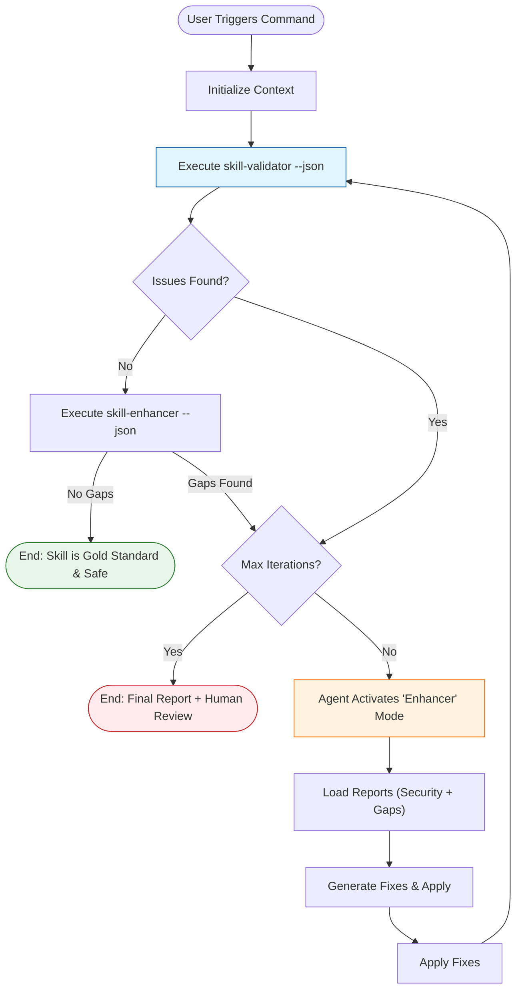

# Auto-Healing Workflow Manual

The **Auto-Healing Workflow** is an automated loop that leverages the `skill-validator` (Auditor) and `skill-enhancer` (Doctor) to detect and fix security vulnerabilities, compliance gaps, and structural issues in your skills.

## Table of Contents
- [Overview](#overview)
- [Visual Architecture](#visual-architecture)
- [Prerequisites](#prerequisites)
- [How to Use](#how-to-use)
  - [Step 1: Diagnose](#step-1-diagnose)
  - [Step 2: Heal (Agentic Loop)](#step-2-heal-agentic-loop)
  - [Step 3: Verify](#step-3-verify)
- [Configuration](#configuration)
- [Troubleshooting](#troubleshooting)
- [References](#references)

## Overview

Unlike standard linters that only report errors, this workflow is designed to be **agent-executable**. It provides:
1.  **Automated Detection**: JSON-structured reports from multiple scanners.
2.  **Prescriptive Fixes**: A dedicated guide (`security_refactoring.md`) for the agent to apply safe patches.
3.  **Closed-Loop Verification**: Re-running checks to ensure fixes work without breaking functionality.

## Visual Architecture

The workflow implements a **Review-Refine Loop**:



## Prerequisites

- **Python 3.8+**: Installed and available in PATH.
- **Skill Suit**: Ensure `skills/` directory contains:
    - `skill-validator/` (v1.3+)
    - `skill-enhancer/` (v2.0+)

## How to Use

You can run this workflow manually or (recommended) trigger it via an AI Agent.

### Step 1: Diagnose

First, identify the issues. The agent runs the validator in JSON mode to get a structured report.

```bash
# Security Audit
python3 skills/skill-validator/scripts/validate.py <skill_path> --json

# Structure & Compliance Audit
python3 skills/skill-enhancer/scripts/analyze_gaps.py <skill_path> --json
```

**Output Example**:
```json
{
  "skill": "my-skill",
  "risk_level": "DANGER",
  "issues": [
    {"type": "critical", "message": "Piping curl to bash detected"}
  ]
}
```

### Step 2: Heal (Agentic Loop)

If issues are found, the Agent switches to **Enhancer Mode**.

1.  **Read Context**: The Agent loads `skills/skill-enhancer/references/security_refactoring.md`.
2.  **Plan Fixes**:
    *   **Critical Security**: Replace `curl | bash` with 2-step download.
    *   **Structure**: Add missing `SKILL.md` sections (Red Flags, Rationalization).
    *   **Compliance**: Remove `TODO` placeholders.
3.  **Apply Fixes**: The Agent uses file editing tools to apply the changes.

> [!IMPORTANT]
> The Agent must use `replace_file_content` for surgical edits. Overwriting entire files (`write_to_file`) is discouraged to prevent data loss.

### Step 3: Verify

The Agent re-runs the diagnosis commands from Step 1.
- **Pass**: Workflow ends.
- **Fail**: Loop back to Step 2 (Max 3 retries).

## Configuration

The workflow behavior is controlled by `skill.conf` in the project root.

| Section | Key | Description | Default |
| :--- | :--- | :--- | :--- |
| `[validation]` | `required_sections` | List of sections mandatory in `SKILL.md` | `["Red Flags", "Rationalization Table"]` |
| `[validation]` | `allowed_cso_prefixes` | Valid starts for Description | `["Use when", "Guidelines for"]` |
| `[quality]` | `max_description_words` | Max words in Description | `50` |
| `[quality]` | `max_inline_lines` | Max lines for inline code blocks (token efficiency) | `12` |

## Troubleshooting

### "Validator crashed on my file"
- **Cause**: The file might be binary or have a non-UTF8 encoding.
- **Fix**: The updated `analyze_gaps.py` handles this with `errors='replace'`, but ensure your text files are UTF-8.

### "Agent keeps failing to fix 'curl | bash'"
- **Cause**: The Agent might be applying a fix that introduces a new syntax error.
- **Fix**: Manually apply the pattern from `security_refactoring.md`:
  ```bash
  curl -sL url -o /tmp/script.sh
  bash /tmp/script.sh
  ```

### "False Positives in Security Scan"
- **Cause**: Documentation files describing attacks often trigger the scanner.
- **Fix**: Add the file to `.scanignore` in the skill directory.

## References

- **[Skill Validator Manual](skill-validator_manual.md)**: Deep dive into security checks.
- **[Security Refactoring Guide](../skills/skill-enhancer/references/security_refactoring.md)**: The "Playbook" used by the Agent to fix issues.
