# Post Writing Skill User Manual

This manual describes how to use the `post-writing` skill to create high-engagement social media posts for LinkedIn and Telegram with built-in brand voice, hook selection, and quality control.

## Table of Contents
1.  [What the Skill Does](#1-what-the-skill-does)
2.  [Workflow Overview](#2-workflow-overview)
3.  [Writing Effective Prompts](#3-writing-effective-prompts)
4.  [Usage Examples](#4-usage-examples)
    *   [In IDE (Cursor, Antigravity, Claude Code)](#in-ide-cursor-antigravity-claude-code)
    *   [Standalone Agent with System Prompt](#standalone-agent-with-system-prompt)
5.  [Automated Content Pipeline](#5-automated-content-pipeline)
    *   [Handling Interactive Steps (Hook Selection)](#handling-interactive-steps-hook-selection)
6.  [Resource Files Reference](#6-resource-files-reference)

## 1. What the Skill Does

The skill orchestrates a **4-step editorial process** that produces publication-ready posts:

1. **Analyze** — clarifies goal, audience, platform, and language before writing
2. **Hook** — generates 3 hook options based on 7 proven formulas (Story, Secret, Problem, Promise, Proclamation, Preview, Contrarian Thesis)
3. **Draft** — writes in a specific brand voice (RU or EN) with platform-correct formatting
4. **Review** — verifies the draft against a checklist before presenting

**Key differentiator:** The skill loads only the resources needed for each step, not everything at once. This reduces token waste and hallucination drift.

## 2. Workflow Overview

```mermaid
graph TB
    A["👤 User prompt"] --> B["Step 1: Analyze & Clarify"]
    B --> C{"All 5 params clear?"}
    C -- "No" --> D["🤖 Ask user for clarification"]
    D --> C
    C -- "Yes" --> E["Step 2: Select a Hook"]
    E --> F["🤖 Load hooks-examples.md"]
    F --> G["🤖 Propose 3 hook options"]
    G --> H["👤 User picks a hook"]
    H --> I["Step 3: Draft"]
    I --> J["🤖 Load voice guide + platform rules"]
    J --> K["🤖 Write the post"]
    K --> L["Step 4: Review"]
    L --> M["🤖 Load review-checklist.md"]
    M --> N{"All checks pass?"}
    N -- "No" --> K
    N -- "Yes" --> O["📄 Present final draft"]
```



## 3. Writing Effective Prompts

The more context you give upfront, the fewer clarification rounds the agent needs. Include these **5 parameters** in your prompt:

| Parameter | What to specify | Example |
|:---|:---|:---|
| **Goal** | What the post achieves | "increase engagement", "announce a feature" |
| **Audience** | Who reads it + awareness level | "AI engineers, Solution-Aware" |
| **Takeaway** | The single thing reader remembers | "ARC-AGI-2 was solved in under a year" |
| **Platform** | Where it gets published | "Telegram", "LinkedIn", "both" |
| **Language** | Output language | "RU", "EN" |

### Prompt Formula

> **[Action]** + **[Source/Topic]** + **[Platform]** + **[Language]** + **[Goal/Tone hints]**

### Good vs Bad Prompts

**❌ Vague:**
> "Write a post about AI agents."

**✅ Specific:**
> "Write a Telegram post in Russian about how I built an AI agent that automated 80% of my routine in one evening. Goal: engagement. Audience: tech founders who've heard about AI agents but haven't built one yet."

**✅ Rewrite with source:**
> "Rewrite this text as a LinkedIn post in English. Make it more provocative, add a hook. Target audience: engineering managers."

**✅ Multi-platform:**
> "Write a post about our product launch. Need both LinkedIn and Telegram versions in Russian. Goal: brand awareness."

## 4. Usage Examples

### In IDE (Cursor, Antigravity, Claude Code)

The skill activates automatically when your prompt matches these triggers:
- "write a post", "draft a post", "rewrite for LinkedIn/Telegram"
- "make this more engaging / viral"
- mentions of hooks, slippery slide, or copywriting techniques

#### Example 1: New Post from Scratch

```
Prompt:
"Write a Telegram post in Russian about how ARC-AGI-2 was solved 
in less than a year. Source data is in this file: [attach notes]. 
Goal: education + engagement."
```

The agent will:
1. Confirm parameters (or ask what's missing)
2. Load `hooks-examples.md`, propose 3 hooks
3. You pick one → agent loads `voice-guide-ru.md` + `platform-rules.md`
4. Draft → review checklist → final version saved to `Draft Posts/RU/`

#### Example 2: Rewrite Existing Text

```
Prompt:
"Rewrite this thread as a LinkedIn post in English.
Make it shorter, add a strong hook, end with a question.
Target: AI engineers, Product-Aware."
[paste text]
```

#### Example 3: Multi-Platform

```
Prompt:
"I need this announcement as both a LinkedIn and Telegram post in Russian.
LinkedIn version should be shorter with arrow lists.
Telegram version can be longer with markdown formatting."
```

The agent will load `templates.md` (multi-platform template) and produce two versions.

---

### Standalone Agent with System Prompt

You can use the skill's resources as building blocks for a dedicated writing agent outside IDE.

#### Basic Writing Agent

```
System Prompt:
"You are a social media writer for the AISobolev brand.

VOICE: Builder thinking out loud. Practitioner, not theorist. 
Honest, not polished. Provocative, but not for hype.

STRUCTURE: Every post follows Problem → Reframe → Action.
- Hook: contradiction, intrigue, or personal story
- Problem: what's wrong (personal experience, specifics)
- Reframe: why common wisdom is incomplete (your perspective)
- Action: what you're doing about it + invitation to dialogue

RULES:
- First sentence ≤ 10 words
- Specific numbers in the first lines (not "many" but "776")
- Embed authority through details, DO NOT claim it
- Every sentence must earn its place
- End with a question or emoji reaction

LINKEDIN FORMAT:
- Paragraphs: 1-2 lines
- → arrows for lists
- NO markdown headers
- Target: 800-1500 characters

TELEGRAM FORMAT:
- Paragraphs: 2-4 lines  
- Full markdown OK
- Target: 500-2000 characters

ANTI-PATTERNS — NEVER DO:
- Start with 'Всем привет' or 'In this post I will talk about'
- Use filler: 'В современном мире', 'plays an increasingly important role'
- Claim authority: 'я эксперт' — embed it through details instead
- Use parcellation or excessive em-dashes
- Teach — show instead"

User Message:
"Write a Telegram post in Russian about [topic]. Here is my source data: [...]"
```

#### RAG-Enhanced Agent (Clone Your Voice)

For maximum voice accuracy, combine the system prompt above with:

1. **Knowledge Base:** Upload 5-10 of your best published posts as reference files
2. **Instruction:** "Read the attached posts to learn the author's cadence, humor, and vocabulary. Write new content mimicking this voice, but adhering to the system prompt rules."

This creates a **positive constraints** (your real voice from examples) + **negative constraints** (anti-patterns from the skill) pipeline.

## 5. Automated Content Pipeline

A conceptual architecture for automating article creation:

```mermaid
graph LR
    subgraph "1. SOURCE"
        A["📰 RSS / News API"]
        B["📝 User Notes"]
        C["🔬 Research Papers"]
    end

    subgraph "2. PROCESS"
        D["🔍 Fact-Checker Agent"]
        E["✍️ Post-Writing Agent"]
        F["🧹 Text Humanizer"]
    end

    subgraph "3. REVIEW"
        G["📋 Review Checklist"]
        H["👤 Human Approval"]
    end

    subgraph "4. PUBLISH"
        I["📱 Telegram Bot API"]
        J["💼 LinkedIn API"]
        K["📁 Archive"]
    end

    A --> D
    B --> D
    C --> D
    D -- "verified facts" --> E
    E -- "draft" --> F
    F -- "humanized draft" --> G
    G -- "✅ all checks pass" --> H
    G -- "❌ fix needed" --> E
    H -- "approved" --> I
    H -- "approved" --> J
    H --> K
```



### Pipeline Steps

| Step | Agent / Tool | Input | Output |
|:---|:---|:---|:---|
| **Source Collection** | RSS reader, web scraper, or manual notes | Raw data, links, facts | Structured fact sheet |
| **Fact-Checking** | LLM + web search | Raw claims | Verified claims + corrections |
| **Draft Writing** | `post-writing` skill | Verified facts + parameters | Draft post (RU/EN, LinkedIn/Telegram) |
| **Humanization** | `text-humanizer` skill | Draft | Humanized draft (no AI slop) |
| **Review** | `review-checklist.md` | Humanized draft | Pass/fail with specific fixes |
| **Human Approval** | Manual review | Final draft | Approved / edit requests |
| **Publishing** | Telegram Bot API / LinkedIn API | Approved post | Published post |

### Implementation Options

**Option A: IDE-based (manual)**
Run 3 skills sequentially in your IDE: `post-writing` → `text-humanizer` → `vdd-sarcastic`. Copy-paste the result. Skills activate automatically based on prompt triggers.

**Option B: n8n / Make.com via Gemini CLI (semi-automated, skills work natively)**

> [!IMPORTANT]
> n8n and Make.com do **not** support skills natively. To use the full skill (with selective resource loading and all workflow steps), call Gemini CLI through an **Execute Command** node.

1. Trigger: RSS feed, webhook, or schedule
2. Execute Command node → `gemini -p "Write a Telegram post about [topic]..."` (Gemini CLI auto-loads `post-writing` skill from the workspace)
3. Parse CLI output → next node
4. Execute Command node → `gemini -p "Humanize this text: [draft]..."` (uses `text-humanizer` skill)
5. Webhook → human approval via Telegram bot
6. Telegram Bot API / LinkedIn API → publish

**Option C: n8n / Make.com via LLM node (semi-automated, no CLI required)**

If you prefer LLM nodes over CLI, paste the system prompt from [Standalone Agent](#standalone-agent-with-system-prompt) directly into the LLM node's system message. Skills don't work here — you're using extracted prompts instead.

1. Trigger: RSS feed or scheduled
2. LLM node (system prompt = extracted voice rules + formatting rules from this manual) → draft
3. LLM node (system prompt = `text-humanizer` rules) → humanized
4. Webhook → human approval
5. API → publish

> [!TIP]
> Option B gives better results because Gemini CLI loads the full skill with all resources. Option C is simpler to set up but loses selective resource loading and the interactive hook selection step.

**Option D: Custom agent (fully automated)**
Build an agent with tools for web search (fact-checking), file access (voice guides), and API access (publishing). The `post-writing` SKILL.md becomes the agent's system prompt. Human stays in the loop via approval step.

### Handling Interactive Steps (Hook Selection)

The skill's Step 2 asks the user to choose between 3 hooks. In an IDE this is natural — you just reply. In n8n, you need to handle this explicitly.

#### Pattern 1: Human-in-the-Loop via Telegram Bot

Best for quality-critical content where human judgment on the hook matters.


**n8n implementation:**
1. **LLM node** — prompt: `"Generate 3 hook options for this topic: [topic]. Return as JSON: [{type, text}]"`
2. **Telegram node** — send message with 3 inline buttons (one per hook)
3. **Wait node** — pause workflow until callback
4. **Telegram Trigger** — catches the button press, extracts chosen hook
5. **LLM node** — prompt: `"Write the post using this hook: [chosen hook]. Topic: [topic]..."`

> [!TIP]
> The same pattern works with **Slack**, **Discord**, or **n8n Forms** instead of Telegram. The key is: pause → present options → resume on response.

#### Pattern 2: Full Automation (No Human-in-the-Loop)

For high-volume pipelines where manual hook selection is impractical.

**Approach A: Auto-select prompt override**

Add this instruction to the system prompt to skip the interactive step:

```
"DO NOT ask the user to choose a hook. Instead, auto-select the best hook 
based on these criteria:
1. Audience awareness level (Unaware → Story Lead, Solution-Aware → Contrarian Thesis)
2. Goal (engagement → Proclamation/Contrarian, education → Preview/Problem)
3. Platform (LinkedIn favors Contrarian Thesis, Telegram favors Story Lead)

State which hook you selected and why in a one-line comment before the post."
```

**Approach B: Dual-LLM evaluation (higher quality)**


1. **LLM node 1** ("Writer") — generates 3 hooks as JSON
2. **LLM node 2** ("Editor") — evaluates hooks against the Hook Checklist criteria (specificity, emotion, open loop, audience match) and picks the winner with reasoning
3. **LLM node 1** — drafts the post using the winning hook

> [!TIP]
> Approach B produces better results because the "Editor" LLM has fresh context and acts as a quality gate. Use a different model for the Editor (e.g., Writer = Gemini Flash, Editor = Gemini Pro) to get genuine diversity in judgment.

#### Pattern 3: Hybrid — Auto-select with Human Approval at the End

The pragmatic middle ground: skip hook selection, but keep human approval on the final draft.

```mermaid
graph LR
    A["LLM: Auto-select hook + draft"] --> B["🧹 Humanizer"] --> C["📋 Checklist"] --> D["👤 Approve/Reject via Telegram"]
    D -- "✅" --> E["Publish"]
    D -- "❌ + feedback" --> A
```



This is the recommended pattern for most production pipelines — you get throughput without sacrificing final quality control.

## 6. Resource Files Reference

| File | Purpose | When Loaded |
|:---|:---|:---|
| `hooks-examples.md` | 7 hook types with formulas and examples | Step 2: Hook selection |
| `voice-guide-ru.md` | Russian voice, tone, lexicon, anti-patterns, "Раньше/Сейчас" framework | Step 3: Drafting (RU) |
| `voice-guide-en.md` | English voice, tone, anti-patterns | Step 3: Drafting (EN) |
| `platform-rules.md` | LinkedIn vs Telegram formatting, char limits, engagement benchmarks | Step 3: Drafting |
| `templates.md` | Post format templates (single, multi-platform, listicle, structured) | Step 3: Drafting (optional) |
| `review-checklist.md` | Pre-publish verification checklist (core + advanced) | Step 4: Review |
