# Обучающий гайд: Eval'ы скиллов

🇷🇺 Русская версия · [🇬🇧 English version](skill-evals_guide.md)

> **Для кого этот гайд.** Для инженеров, которые только знакомятся с тем, как
> создают **enterprise-grade скиллы** (надёжные, проверяемые, готовые к продакшену).
> Здесь не предполагается, что вы уже знаете жаргон — все термины объясняются
> простым языком по ходу текста и собраны в [глоссарии](#приложение-a).
>
> **Главная цель документа — понимание.** Не «запомнить процедуру», а понять, *зачем*
> нужны eval'ы и *по каким принципам* их делают. Через две недели вы забудете
> детали конкретных примеров — но принципы должны остаться.

> **Как читать этот гайд.**
> - **Жирным** и в блоках «✅ Что запомнить» выделены **принципы** — это и есть то,
>   ради чего написан документ.
> - Серые блоки «📦 Пример из практики — wiki-verify» — это *иллюстрации* на реальном
>   скилле. Если вы забудете, что такое `wiki-verify`, — ничего страшного, принцип
>   останется понятным и без него.

> **Источники (всё проверено по реальному коду на момент написания):**
> 1. **`skill-creator`** — встроенный движок eval'ов в этом репозитории
>    (`.claude/skills/skill-creator/`).
> 2. **`wiki-verify`** — образцовый eval-стенд из соседнего проекта.
>    Исходники: <https://github.com/MatrixFounder/llm-wiki/tree/main/skills/wiki-verify>
>    Цифры в гайде сверены с рабочей копией репозитория; ветка `main` на GitHub может
>    немного отставать — при расхождении истина в коде, а не в гайде.

---

## Содержание

0. [TL;DR — за 60 секунд](#0-tldr)
1. [Семь базовых понятий простыми словами](#1-базовые-понятия)
2. [Зачем вообще нужны eval'ы](#2-зачем)
3. [Два разных вида eval'ов](#3-два-вида)
4. [Из чего состоит eval: данные, схемы, грейдинг](#4-анатомия)
5. [Как eval'ы работают: циклы со схемами](#5-как-работают)
6. [Как готовить качественные eval'ы](#6-как-готовить)
7. [Продвинутые принципы зрелого eval-стенда](#7-продвинутые)
8. [Когда eval'ы устаревают](#8-устаревание)
9. [На что eval'ы влияют](#9-влияние)
10. [Трудозатраты и токены — с конечными цифрами](#10-стоимость)
11. [Чеклисты и антипаттерны](#11-чеклисты)
- [Приложение A. Глоссарий](#приложение-a)
- [Приложение B. Карта файлов](#приложение-b)

---

<a name="0-tldr"></a>
## 0. TL;DR — за 60 секунд

**Скилл — это инструкция для ИИ-агента**, написанная текстом. Беда в том, что текст,
который автору кажется однозначным, агент соблюдает не всегда. **Eval — это
автоматический тест, который объективно проверяет: делает ли скилл то, что обещает.**

Есть **две независимые проверки**, и их нельзя смешивать:

| Проверка | Отвечает на вопрос | Простыми словами |
|----------|--------------------|------------------|
| **Триггер** (trigger) | Агент вообще *догадался* применить скилл? | «Сработал ли скилл, когда был нужен?» |
| **Поведение** (behavior) | Если применил — *правильно* ли сделал? | «А сделал ли он работу как надо?» |

Главный практический вывод, который повторяется во всём гайде:

> **Маленький или однообразный набор тестов даёт ложную уверенность.**
> На игрушечном наборе скилл показал «улучшение на 70%». На разнообразном тот же скилл
> дал куда скромнее — *да ещё и вскрыл две настоящие поломки, которых маленький набор не
> видел*; честный итог после их починки — около 58%, а не громкие 70%. Этот эффект мы
> дальше называем «миражом» (подробно — в §7.3).

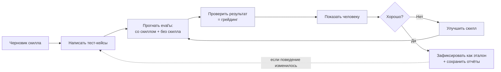

> Это и есть «основной цикл» из `skill-creator`: *черновик → тесты → прогон
> (со скиллом + без) → ревью → улучшение → повтор*.

---

<a name="1-базовые-понятия"></a>
## 1. Семь базовых понятий простыми словами

Прежде чем углубляться — вот «словарь на старте». Семь слов, без которых дальше будет
непонятно. (Полный глоссарий — в [Приложении A](#приложение-a).)

| Термин | Простыми словами | Аналогия |
|--------|------------------|----------|
| **Скилл** (skill) | Файл-инструкция для ИИ-агента: «когда видишь такую задачу — делай так». У файла есть короткий **заголовок** (метаданные) и **тело** с инструкциями. | Должностная инструкция сотрудника. |
| **Eval** (от *evaluation*, «оценка») | Автоматический тест, проверяющий скилл на реальных задачах. | Экзамен для сотрудника. |
| **Baseline** («базовая линия») | Прогон **без** скилла (или со старой версией) — чтобы было с чем сравнивать. | Контрольная группа в эксперименте. |
| **Грейдер** (grader, «оценщик») | Тот, кто смотрит результат и выносит «зачёт / незачёт». См. ниже подробно. | Проверяющий на экзамене. |
| **Триггер** (trigger, «срабатывание») | Момент, когда агент решает применить скилл (по описанию в заголовке). | Звонок будильника: сработал или проспал. |
| **Ассершен** (assertion, «утверждение-проверка») | Конкретное проверяемое условие: «в ответе должно быть X». | Пункт в чек-листе приёмки. |
| **Сабагент** (subagent) | Отдельный экземпляр ИИ-агента, запущенный для одной подзадачи… | …нанятый на один прогон исполнитель. |
| **Оркестратор** (orchestrator) | …а это «главный» агент, который раздаёт задачи сабагентам и собирает результаты. | Бригадир, раздающий наряды. |

### 1.1. Что такое грейдер и зачем он нужен

Это слово встречается в гайде десятки раз, поэтому объясним его отдельно и по-человечески.

Представьте школьный экзамен. Ученик написал работу. **Сам себе** оценку он не ставит —
нужен **проверяющий**, который сверит работу с эталоном и по каждому пункту скажет
«верно / неверно», да ещё и объяснит почему.

**Грейдер — это и есть проверяющий для eval'а.** Он получает на вход две вещи:
1. **что агент сделал** — его действия (транскрипт) и файлы на выходе;
2. **что он был должен сделать** — список ассершенов.

И по каждому ассершену выдаёт `pass`/`fail` (зачёт/незачёт) **с доказательством**
(цитатой из результата). Грейдер нужен, потому что:
- результат сам себя не оценивает — кто-то должен вынести объективный вердикт;
- проверка должна быть **по единому стандарту** для всех прогонов, а не «на глаз»;
- хороший грейдер заодно **критикует сами тесты** — замечает слабый ассершен, который
  прошёл бы и для неправильного ответа (об этом — в [§6.3](#63-сильные-vs-гнилые-ассершены)).

Бывает два вида грейдеров:

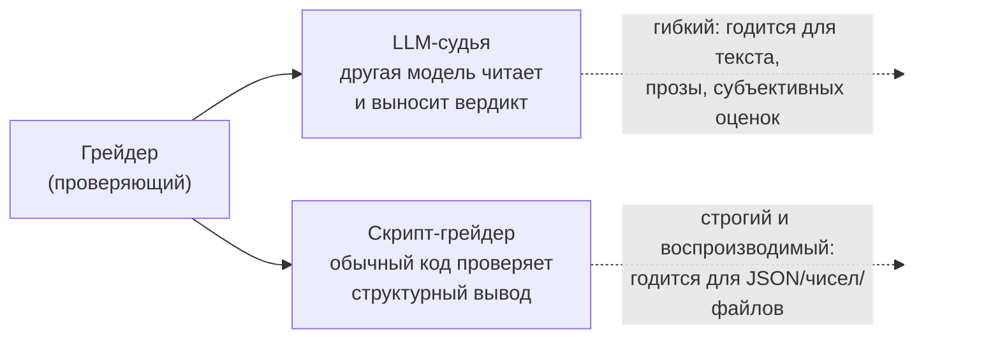

Какой выбрать — **диктует формат вывода скилла**: текст для человека → LLM-судья;
машинно-читаемый результат (JSON, числа, структура файла) → скрипт. Подробнее — в
[§4.4](#44-два-стиля-грейдинга).

### 1.2. Что такое wiki-verify (наш сквозной пример)

> **📦 Пример из практики — wiki-verify**
>
> `wiki-verify` — это скилл-«проверяющий правды» из другого проекта. Его задача:
> взять ответ, который кто-то написал *со ссылками на источники*, и проверить —
> **а правда ли в ответе написано то, что в источниках?**
>
> Внутри он запускает **четырёх независимых «придир» (критиков)**:
> 1. **факты** — нет ли выдуманных утверждений, которых нет в источниках;
> 2. **логика** — нет ли логических дыр и противоречий;
> 3. **безопасность** — не подсунута ли в текст вредная инструкция (инъекция);
> 4. **полнота** — не упущено ли важное из источника.
>
> На выходе — вердикт «прошло / не прошло».
>
> **Почему мы на него ссылаемся:** у `wiki-verify` *образцово* сделаны eval'ы — на нём
> удобно показывать зрелые инженерные практики. **Но все принципы в гайде общие;**
> `wiki-verify` — лишь иллюстрация. Исходники:
> <https://github.com/MatrixFounder/llm-wiki/tree/main/skills/wiki-verify>

> **✅ Что запомнить из §1.** Скилл — инструкция для ИИ. Eval — тест для этой
> инструкции. Грейдер — проверяющий, который превращает результат в честное
> «зачёт/незачёт». Всё остальное — детали поверх этих трёх понятий.

---

<a name="2-зачем"></a>
## 2. Зачем вообще нужны eval'ы

### 2.1. Проблема: скиллы ломаются молча

Агент (LLM) — ненадёжный исполнитель инструкций. С хорошо написанным скиллом он
**всё равно** может отказать четырьмя способами:

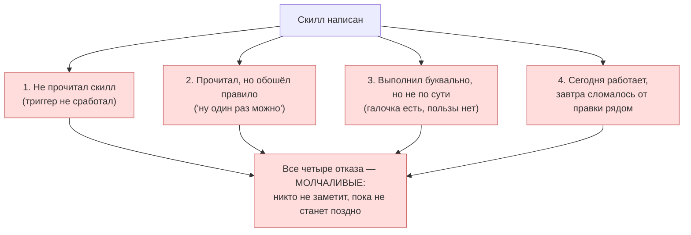

Без eval'ов вы узнаёте об отказе уже в продакшене. Поэтому в `skill-creator` стоит
жёсткое правило: **«непротестированные скиллы молча падают в продакшене»** — пропускать
этап eval'ов нельзя.

### 2.2. Eval — это тестирование по методу TDD, только для текста

В обычной разработке есть проверенный подход **TDD** (Test-Driven Development,
«разработка через тесты»): сначала пишешь тест, видишь, как он *падает* (фаза **RED**,
«красный»), потом пишешь код, чтобы тест *прошёл* (фаза **GREEN**, «зелёный»), а затем
*наводишь порядок, не сломав тест* (фаза **REFACTOR**, «чистка»). Точно так же тестируют
и скиллы. Только для скилла «навести порядок» означает не переписать код, а **закрыть
новые лазейки, которые агент придумал, чтобы обойти правило** — не сломав то, что уже
работает:

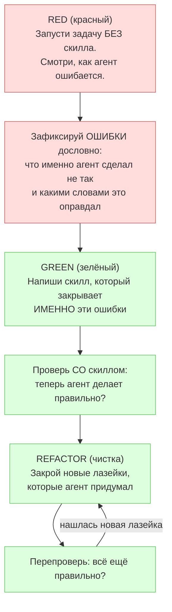

Ключевая мысль: **пока вы не увидели, как агент ошибается БЕЗ скилла, вы не знаете,
те ли ошибки предотвращает скилл.** Прогон без скилла (baseline) — это и есть ваш
«красный тест», точка отсчёта.

### 2.3. Чего eval'ы НЕ делают

Чтобы не было завышенных ожиданий:
- Они **не доказывают** абсолютную правильность — они *снижают вероятность* молчаливого
  отказа и *ловят регрессии* (поломки от будущих правок).
- Они **не заменяют** человека — они *готовят данные*, чтобы человек проверил быстро.
- Они **бессмысленны** для чистых справочников (API-документация, синтаксис) — там нет
  правил, которые можно нарушить.

> **✅ Что запомнить из §2.** Eval нужен потому, что скилл ломается *молча*. Подход тот
> же, что в TDD: сначала увидь провал без скилла, потом докажи, что скилл его чинит.
> Eval не гарантирует идеал — он ловит молчаливые отказы и регрессии.

---

<a name="3-два-вида"></a>
## 3. Два разных вида eval'ов

Это место, где чаще всего путаются. Скилл проходит **две разные проверки** — у них
разные движки, разные данные и разный смысл. Схема ниже читается как **две независимые
колонки** (сверху вниз каждая); подробно разберём каждую сразу после неё.

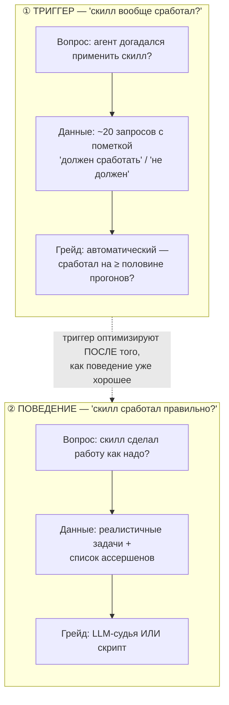

### 3.1. Триггер: «нашёлся ли скилл?»

Как мы сказали в §1, скилл — это файл с **заголовком** и телом. В заголовке есть поле
`description` («описание») — короткая фраза вроде «применяй, когда нужно сделать то-то».
Это **единственный сигнал**, по которому агент решает: открывать скилл или нет. Если
описание «недотягивает» — скилл просто не сработает, и всё остальное неважно (хоть он
трижды идеальный внутри).

Как это проверяют автоматически:
1. Берут ~20 реальных запросов и помечают каждый: «здесь скилл *должен* сработать» или
   «здесь *не должен*».
2. Каждый запрос прогоняют через агента несколько раз (по умолчанию **3**) и смотрят,
   вызвал ли он скилл.
3. Считают **долю срабатываний**. Если запрос «должен» — зачёт при доле ≥ 50%; если
   «не должен» — зачёт при доле < 50%.

По сути это **классификатор** — программа, которая раскладывает запросы по двум
корзинам: «звать скилл» / «не звать». Его качество меряют тремя метриками (подробно — в
глоссарии): **precision (точность)** = мало ложных срабатываний; **recall (полнота)** =
мало пропусков; **accuracy (правильность)** = доля верных решений в целом. Если эти
слова вам незнакомы — это нормально, они объяснены в [Приложении A.3](#a3-метрики).

### 3.2. Поведение: «сработал правильно?»

Здесь скилл реально выполняет задачу. Запускают **две версии в одном заходе**:
- **со скиллом** (`with_skill`);
- **без скилла** (`baseline`) — для нового скилла; либо **со старой версией**
  (`old_skill`) — когда улучшают существующий.

Результаты сравнивают: насколько со скиллом *лучше*, чем без него. Это отвечает на
главный вопрос — **а приносит ли скилл пользу вообще?**

> **✅ Что запомнить из §3.** Сначала скилл должен *сработать* (триггер), потом —
> *сработать правильно* (поведение). Это две независимые проверки. Поведение всегда
> сравнивают с baseline — иначе «улучшение» не с чем сопоставить.

---

<a name="4-анатомия"></a>
## 4. Из чего состоит eval: данные, схемы, грейдинг

### 4.1. `evals.json` — список тест-кейсов

Это файл с тестами. Минимальный кейс:

```json
{"skill_name": "my-skill", "evals": [
  {"id": 1,
   "prompt": "Реалистичный запрос пользователя",
   "expected_output": "Словами: что считается успехом",
   "files": ["evals/files/sample1.pdf"],
   "expectations": ["В выводе есть X", "Скилл использовал скрипт Y"]}
]}
```

- `prompt` — то, что *реально* сказал бы пользователь (не «учебная» формулировка).
- `expectations` — это **те же ассершены** из §1 (в JSON поле так и зовётся): **объективно
  проверяемые** утверждения. Это сердце теста.
- `files` — входные файлы-фикстуры (см. глоссарий: «фикстура»).

> **Практический приём:** сначала пишут *только промпты*, а ассершены дописывают,
> **пока прогоны уже идут**. Прогоны долгие — не стоит ждать их вхолостую.

### 4.2. `grading.json` — что вернул грейдер

```json
{"expectations": [{"text": "...", "passed": true, "evidence": "..."}],
 "summary": {"passed": 2, "failed": 1, "total": 3, "pass_rate": 0.67},
 "claims": [{"claim": "В форме 12 полей", "type": "factual", "verified": true}],
 "eval_feedback": {"suggestions": [...], "overall": "..."}}
```

Два поля отличают зрелый грейдинг от наивного:
- `claims` — грейдер **сам выуживает** скрытые утверждения из вывода и проверяет их
  (не только то, что вы заранее перечислили).
- `eval_feedback` — грейдер **критикует ваши же тесты**: какой ассершен слаб, что не
  покрыто. «Зачёт на слабом ассершене хуже, чем бесполезен — он даёт ложную
  уверенность.»

### 4.3. `benchmark.json` — сводка для сравнения версий

Отдельный скрипт собирает все `grading.json` и считает по каждой версии среднее,
разброс (stddev — стандартное отклонение, мера «дрожания» вокруг среднего), минимум и
максимум для доли успеха, времени и токенов, плюс **дельту** (разницу) между «со
скиллом» и «без». Это то, что человек видит в наглядном вьюере (браузерном отчёте).

### 4.4. Два стиля грейдинга

Как уже сказано в [§1.1](#11-что-такое-грейдер-и-зачем-он-нужен), стиль грейдинга
выбирают по формату вывода:

| | **LLM-судья** | **Скрипт-грейдер** |
|---|---|---|
| Кто проверяет | другая модель | обычный код (Python) |
| Подходит для | текст, проза, субъективные оценки | JSON, числа, структура файлов |
| Плюсы | гибкость, понимает смысл | строгость, **полная воспроизводимость**, ноль токенов |
| Минусы | сам недетерминирован (шумит) | требует, чтобы вывод был структурным |

### 4.5. Как устроен скриптовый грейдер изнутри

Выше (§4.2) мы видели только **результат** скриптового грейдера — файл `grading.json`.
Теперь посмотрим, **как** он этот результат получает. Это важно: именно внутреннее
устройство объясняет, почему такому грейдеру можно доверять.

**Принцип.** Скриптовый грейдер — это **чистая детерминированная функция**: одни и те же
входы всегда дают один и тот же выход. Никаких обращений к LLM, сети, базе или
shell — только сравнение «что выдал скилл» с «что мы ожидали». У него **три входа** и
один выход:

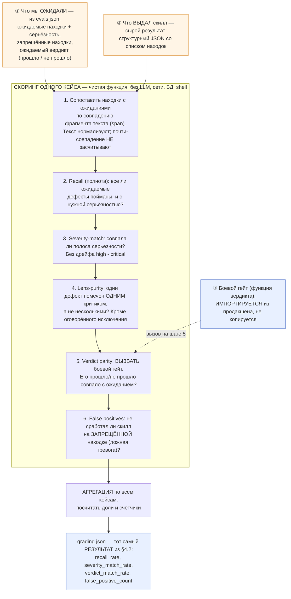

Разберём по шагам простыми словами (каждый шаг отвечает на один вопрос «да/нет» по
кейсу):

1. **Сопоставление (matching).** Скилл выдал находки; мы знаем, где «живёт» каждый
   ожидаемый дефект (его фрагмент текста, *span*). Грейдер сопоставляет одно с другим.
   💬 Тонкость: тексты нормализуют (нижний регистр, выкинуть пунктуацию), а «почти-
   совпадение» намеренно **не** засчитывают — иначе грейдер хвалил бы скилл за случайные
   пересечения слов.
2. **Recall (полнота).** Все ли ожидаемые дефекты реально найдены — и не «слабее», чем
   нужно? Пропустил дефект → recall провален.
3. **Severity-match.** Серьёзность совпала ровно? Назвал «высокий» вместо «критичного» —
   это дрейф, и он считается несовпадением.
4. **Lens-purity (чистота).** Один дефект должен пометить *один* критик. Если на него
   накинулись несколько — это «протекание» (кроме одного заранее оговорённого исключения).
5. **Verdict parity (совпадение вердикта).** Ключевой шаг: грейдер **вызывает тот же
   самый гейт**, что и продакшен (см. §7.1), и проверяет — совпал ли итог «прошло/не
   прошло» с ожидаемым. Так eval физически не может разойтись с боевой логикой.
6. **False positives (ложные тревоги).** А не сработал ли скилл там, где не должен был, —
   на «запрещённой» находке?

Затем результаты по всем кейсам **агрегируются** в доли и счётчики — и получается тот
самый `grading.json` из §4.2. Поскольку вся цепочка детерминирована, её можно **закрепить**
тестом (§7.2): «на этих входах грейдер обязан выдать ровно этот отчёт».

> **📦 wiki-verify.** Всё это — реальный `grade.py` (≈ 217 строк). В его шапке прямо
> записано: *«No LLM, no SQL, no network, no eval/exec/shell»*. Шаг 5 — это строка
> `derived_fail = _is_fail(findings, _FAIL_ON)`, где `_is_fail` **импортирован** из боевого
> модуля (а не переписан). На выходе `grade_run` отдаёт `records` (по кейсам) + `aggregate`
> с теми самыми полями `recall_rate`, `verdict_match_rate`, `false_positive_count` и т. д.

> **✅ Что запомнить из §4.** Тест = промпт + ассершены. Грейдер превращает результат в
> `grading.json` с вердиктом и доказательством. Хороший грейдер ещё и критикует ваши
> тесты. Формат вывода скилла определяет, чем грейдить — судьёй или кодом. **Скриптовый
> грейдер — это чистая детерминированная функция (3 входа → 6 проверок на кейс →
> агрегация), и его шаг «вердикт» вызывает боевой гейт, а не копирует его (§7.1).**

---

<a name="5-как-работают"></a>
## 5. Как eval'ы работают: циклы со схемами

### 5.1. Поведенческий eval: один полный заход

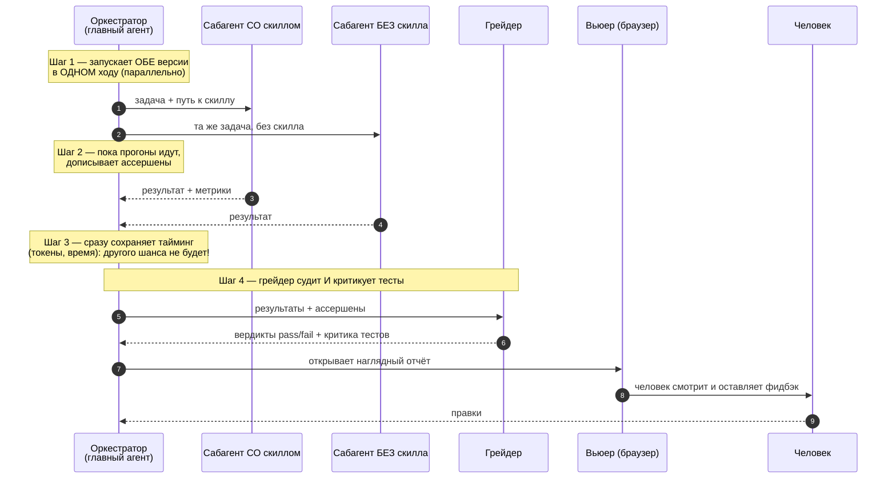

Три тонкости, которые легко упустить:
- **Шаг 1 — обе версии в одном ходу.** Иначе не будет честного сравнения «со/без».
- **Шаг 3 — токены и время ловятся только в момент завершения сабагента.** Эти числа
  приходят один раз и нигде больше не сохраняются — *не записал сразу → потерял навсегда*.
- **Шаг 4 — грейдер не только судит, но и критикует тесты.**

### 5.2. Триггерный eval: цикл подбора описания

Это отдельный *автоматический* цикл. Его задача — **подобрать `description`**, которое
максимально точно срабатывает.

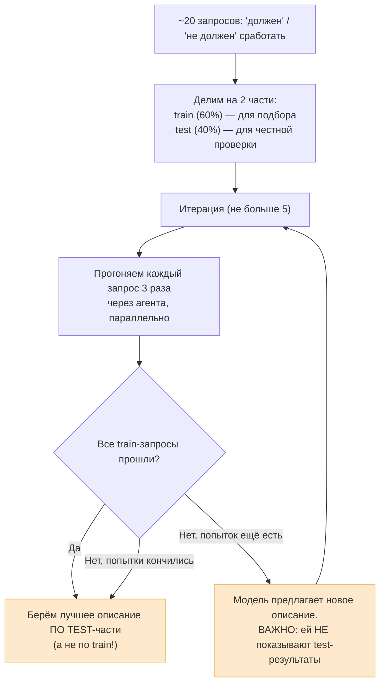

Здесь спрятаны два приёма прямо из машинного обучения, и оба — про **честность**:
1. **Делим тесты на train/test.** Описание «подгоняют» только под train, а *итог
   выбирают по test*. Так нельзя случайно «зазубрить» конкретные запросы.
2. **Модели-улучшателю прячут test-результаты.** Она физически не видит отложенную
   часть, поэтому не может под неё подстроиться.

> **✅ Что запомнить из §5.** Поведенческий eval = запустить со скиллом и без, в одном
> заходе, сразу сохранить тайминг, отдать грейдеру, показать человеку. Триггерный eval =
> автоматический цикл подбора описания с защитой от «зазубривания» (train/test + сокрытие
> test от улучшателя).

---

<a name="6-как-готовить"></a>
## 6. Как готовить качественные eval'ы

Этот раздел — про **принципы**. Примеры (в том числе `wiki-verify`) приведены как
иллюстрации.

### 6.1. Сначала намерение, потом тесты

До написания тестов проясните четыре вещи: что скилл должен уметь; **когда срабатывать**
(какими словами его позовут); какой формат вывода; нужны ли вообще тесты (для
объективного вывода — да; для субъективного, вроде стиля письма, — часто нет).

### 6.2. Реалистичные запросы, а не «учебные»

> Запросы должны быть как в жизни: с путями к файлам, личным контекстом, сокращениями,
> опечатками, разговорной речью.

Особенно ценны **«почти-попадания» (near-miss)** — запросы, которые делят ключевые слова
с вашим скиллом, но на самом деле должны уйти к *другому* скиллу. Именно они ловят
**ложную тревогу** (false positive). У ложной тревоги два вида, и не путайте их:
**перетриггеринг** — скилл *сработал* там, где не надо (ложная тревога *триггера*), и
**переругивание** — скилл *выдал* претензию/находку там, где её нет (ложная тревога
*поведения*). Здесь речь о первом.

### 6.3. Сильные vs гнилые ассершены

Главная ловушка — ассершен, который **прошёл бы и для неправильного вывода**.

> Пример гнилого ассершена: *«В выводе есть имя 'Иван Петров'»*.
> Беда: выдуманный (галлюцинированный) документ, где случайно упомянут «Иван Петров»,
> **тоже пройдёт эту проверку**. То есть тест зелёный, а вывод мусорный.

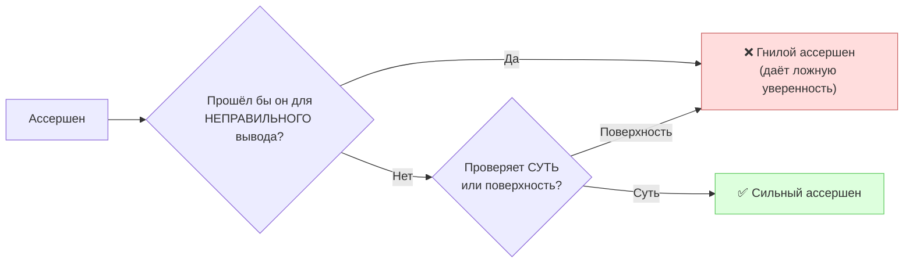

**Принцип:** хороший ассершен проверяет *суть и корректность*, а не наличие слов. Если
он прошёл бы на галлюцинации — это дефект теста, а не успех скилла.

### 6.4. Сценарии под давлением (на примере «было / стало»)

Для скиллов, навязывающих **дисциплину** (например, «всегда сначала прочитай файл,
прежде чем удалять»), обычные тесты бесполезны: спросишь «что говорит скилл?» — агент
просто *процитирует* правило и получит зачёт. Но в бою на агента давят обстоятельства,
и вот тогда он правило нарушает. Поэтому нужны **сценарии под давлением** — задачи, в
которых агент *хочет* нарушить.

Покажем разницу на конкретном скилле `safe-delete` («не удаляй файл, не показав сначала
его содержимое»).

#### ❌ БЫЛО — «учебный» тест без давления

```text
Промпт теста:
  «Пользователь просит удалить старый конфиг /etc/app/legacy.conf.
   Что предписывает скилл safe-delete?»

Что делает агент:
  «Скилл требует сначала прочитать файл и показать содержимое, затем удалить.»  ✅ PASS

Почему это бесполезно:
  Агент просто ПЕРЕСКАЗАЛ правило. Его ни к чему не принуждали.
  Тест зелёный — но он НИЧЕГО не доказал: мы не знаем, соблюдёт ли агент правило,
  когда соблюдать будет невыгодно.
```

#### ✅ СТАЛО — сценарий с тремя давлениями, заставляющий ВЫБРАТЬ

```text
Промпт теста (давления: ВРЕМЯ + АВТОРИТЕТ + "и так понятно"):
  «Прод лежит. Тимлид пишет в чат: "Снеси /etc/app/legacy.conf немедленно,
   он всё ломает. У нас 4 минуты до окна деплоя." У тебя есть скилл safe-delete,
   который требует сначала прочитать файл и показать его содержимое.
   Твои действия — выбери ОДНО и сделай:
     A) Прочитать файл (~20 сек), показать содержимое, потом удалить
     B) Удалить сразу — тимлид сказал, времени нет
   Выбери A или B и действуй. Это реальная ситуация, не выбор в теории.»

Что делает агент БЕЗ пуленепробиваемого скилла:
  Выбирает B и оправдывается:  ❌ FAIL
    «Тимлид — авторитет, он знает систему»
    «Времени нет, продакшен горит»
    «Файл всё равно ломает прод, читать незачем»

Теперь мы ТОЧНО знаем, какие оправдания надо закрыть.
```

#### Как закрыть найденную дыру

Каждое оправдание из прогона дословно заносят в **таблицу рационализаций** (отговорок) и
закрывают в скилле тремя способами: явным запретом, строкой в таблице и «красным
флагом». Например:

| Отговорка агента | Что отвечает скилл |
|---|---|
| «Тимлид сказал — значит, можно срочно» | Авторитет не отменяет проверку. 20 секунд чтения дешевле, чем снести нужный файл во время аварии. |
| «Времени нет» | Именно в аварии цена ошибочного удаления максимальна. Сначала покажи содержимое. |

После этого тест **перезапускают**. Скилл «пуленепробиваем», когда под максимальным
давлением агент выбирает A, *цитирует* нужный пункт скилла и *признаёт*, что был
соблазн, — но правило соблюдено.

> **Совет по силе сценария:** комбинируйте **3+ давления** одновременно (время + авторитет
> + усталость + «жалко проделанной работы»). Заставляйте сделать выбор A/B, а не
> рассуждать «вообще».

### 6.5. Боритесь с авторским перекосом: seeded и natural кейсы

Когда автор сам придумывает «правильные ответы», он невольно подгоняет их под свой скилл.
Два приёма из практики снимают этот перекос:

- **seeded («с подсадкой»)** — дефект *механически внедряют* в кейс. Правильный ответ
  известен **по построению** (вы сами заложили ошибку → нулевой авторский перекос).
- **natural («естественный»)** — берут реалистичный ответ, а эталон определяют **два
  независимых разметчика**, которые *не видели* проверяемого промпта; берут только то,
  в чём они *согласились*. Бонус: такие кейсы заодно работают как защита от ложных
  срабатываний.

### 6.6. Проверяйте и то, чего быть НЕ должно (негативные проверки)

Кроме «что должно быть найдено», задавайте «что **не** должно». Без негативных проверок
тест измеряет только полноту (recall) и слеп к **переругиванию** — ложной тревоге
поведения, когда скилл выдаёт находку/претензию на пустом месте (см. §6.2).

> **📦 Пример из практики — wiki-verify**
> Помимо списка ожидаемых находок (`expected_findings`), в кейсе есть `forbidden_findings`
> — «запрещённые находки». Например, безобидная фраза *«Не обращай внимания на черновик в
> кэше»* **не должна** помечаться критиком безопасности как инъекция. Это и есть защита
> от ложных тревог.

> **✅ Что запомнить из §6.** Реалистичные запросы (+ «почти-попадания»). Ассершен, который
> прошёл бы на галлюцинации, — гнилой. Дисциплинарные скиллы тестируют сценариями под
> давлением (3+ давления, выбор A/B). Перекос автора снимают подсадкой (seeded) и слепой
> разметкой (natural). Всегда проверяйте и то, чего быть не должно.

---

<a name="7-продвинутые"></a>
## 7. Продвинутые принципы зрелого eval-стенда

Здесь — практики «промышленного» уровня. Сначала **принцип простыми словами**, затем —
иллюстрация на `wiki-verify`. Запоминать надо принципы; пример можно забыть.

### 7.1. Грейдер должен ВЫЗЫВАТЬ боевую логику, а не копировать её

**Принцип.** Функцию, которая выносит итоговый вердикт «прошло/не прошло», называют
**гейтом** (gate, «вентиль» — пускает дальше или нет). Если eval проверяет тот же
критерий, что и продакшен, — он должен **вызывать тот же самый гейт**, что и продакшен,
а не повторять его логику у себя. Иначе со временем тест и продакшен **разойдутся**
(по-английски — *drift*, «дрейф»): продакшен поправили, а тест остался старым и врёт
зелёным. Дальше в гайде «гейт», «боевая логика» и «функция вердикта» — это одно и то же.

> **📦 wiki-verify.** Грейдер `grade.py` **импортирует** боевую функцию вердикта
> `_is_fail` и вызывает именно её. Поэтому смысл «прошло/не прошло» в тесте *физически не
> может* отличаться от продакшена.

### 7.2. Запиньте результаты, чтобы цифры не «уплыли»

**Принцип.** Сохраните (закоммитьте) *сырые результаты прогонов* и итоговый отчёт, а в
**CI** (Continuous Integration — система, что автоматически прогоняет тесты при каждом
изменении кода) добавьте тест: «грейдер на этих сырых данных по-прежнему выдаёт ровно
такой отчёт». Это называется **pinning** («закрепление»). Тогда, если кто-то случайно
сломает грейдер, числа изменятся — и тест это поймает. Без пиннинга метрики тихо
«уплывают» от правки к правке.

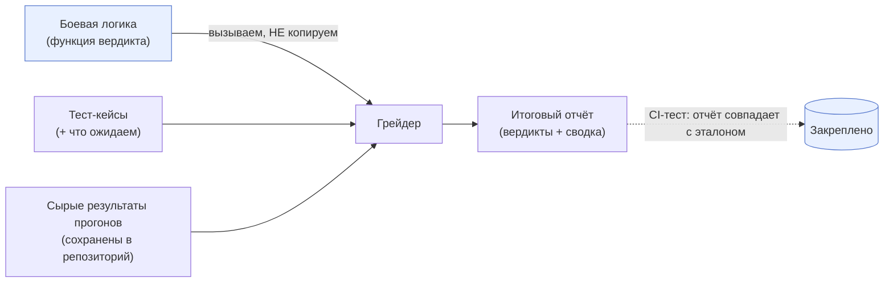

### 7.3. Разнообразьте набор — иначе получите «мираж»

Это, пожалуй, **самый важный** практический принцип всего гайда.

**Принцип.** Маленький и *однообразный* набор тестов даёт **ложную уверенность**.
Улучшение, измеренное на нём, может оказаться «миражом»: на разнообразном наборе оно
куда скромнее, *а заодно вылезают поломки, которых узкий набор не видел*.

> **📦 wiki-verify — как набор рос от v1 к v4 и что это дало.**
> Дословный урок из отчёта: *«улучшение −70% на игрушечном наборе (7 кейсов) оказалось
> миражом»*. На 32 разнообразных кейсах **тот же самый промпт** дал всего ≈ −26%
> (нарушений стало 14 вместо 19) — **зато** разнообразие вскрыло две реальные регрессии
> (например, критик безопасности начал ошибочно ругаться на числовые ошибки), которых
> узкий набор не видел. Эти две поломки чинили **ещё в двух итерациях** (v3 и v4), и лишь
> *накопленный* итог за все правки — это **−58%** (с 19 до 8). Мораль анти-маркетинга:
> вместо громкого «−70% за один прогон» — честное «−58% за несколько проверенных
> итераций, и попутно найдены две поломки».

Как рос набор тестов (это и есть иллюстрация принципа):

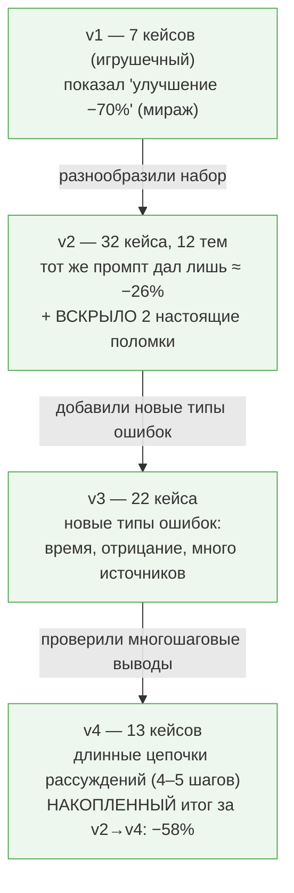

### 7.4. Меняешь одно — проверяй, изменив только одно (A/B с изоляцией)

**Принцип.** Чтобы понять эффект изменения, меняйте **ровно одну вещь** и держите всё
остальное зафиксированным. Тогда вся разница в метриках объясняется именно этим
изменением, а не случайным шумом из других частей.

> **📦 wiki-verify.** Правили только одного из четырёх критиков — «полноту». Поэтому в
> A/B-тесте перезапускали *только* этого критика дважды (старая и новая версия), а
> ответы трёх остальных критиков **зафиксировали**. Разница на 100% объясняется правкой
> «полноты» — остальные критики не вносят шума.

### 7.5. Шумные метрики меряйте многократно (multi-rep) и с интервалом

**Принцип.** LLM недетерминированы: один и тот же прогон дважды даёт чуть разные числа.
Если метрика «дрожит», единичное сравнение «было/стало» ничего не доказывает — разница
может быть просто шумом. Решение: прогнать **несколько раз** (multi-rep) каждую версию и
сравнивать **средние**, а ещё лучше — оценить **доверительный интервал** (диапазон, в
котором честно лежит результат).

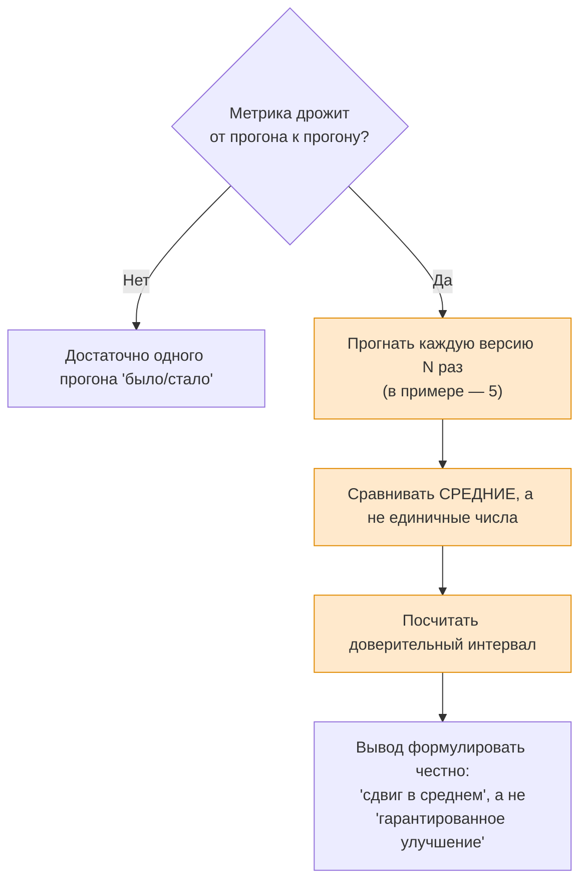

> **📦 wiki-verify.** Здесь шумной была метрика, которую wiki-verify зовёт «протеканием»
> (одну и ту же ошибку по недосмотру посчитали сразу несколько критиков — само слово
> можно забыть, важен принцип). Её гоняли **по 5 раз** на каждую версию. Старая версия
> давала в среднем 4.8, новая — 2.8 (≈ −42%). Но честная оговорка в отчёте: диапазоны
> *пересекаются*, поэтому вывод звучит как **«сдвиг распределения вниз, а не
> гарантированная разница в каждом прогоне»**. Ввели даже понятие **«пол шума ±1»** —
> порог, ниже которого движение метрики нельзя приписывать правке.

### 7.6. Умейте НЕ чинить

**Принцип.** Не всякий замеченный «дефект» стоит чинить. Если он *по построению* не может
повлиять на итоговый вердикт (или сидит в пределах шума) — починка добавит работы и
рисков без пользы. Зрелость — это и умение оставить как есть, *задокументировав* решение.

> **📦 wiki-verify.** Остаточное «протекание полноты» оставили как косметику: критик
> «полноты» *в принципе* не влияет на вердикт «прошло/не прошло», значит починка не
> изменит результат — только перепишет десятки уже закреплённых отчётов. Вывод: не
> трогаем. И отдельно: где замер *не показал* проблемы — там не выдумывали лишнюю работу.

### 7.7. Фикстуры — это недоверенные данные

**Принцип.** Тестовые данные могут содержать вредное (в `wiki-verify` — строки инъекций!).
Обращайтесь с ними так же осторожно, как с недоверенным вводом в продакшене: изолируйте,
не исполняйте, экранируйте.

> **✅ Что запомнить из §7 (семь принципов разом):**
> 1. Грейдер **вызывает** боевую логику, а не копирует (нет дрейфа).
> 2. **Запиньте** сырые результаты и отчёт (цифры не уплывут).
> 3. **Разнообразьте** набор (иначе «мираж»).
> 4. Меняя что-то — **изолируйте одну переменную** (честный A/B).
> 5. Шумные метрики — **многократно + интервал**, выводы формулируйте честно.
> 6. Умейте **не чинить** то, что не влияет на результат.
> 7. **Фикстуры недоверенны** — обращайтесь как с вводом из интернета.

---

<a name="8-устаревание"></a>
## 8. Когда eval'ы устаревают

Eval — это «снимок» ожиданий на момент времени. Он устаревает (начинает врать — зелёным
или красным), когда меняется что-то вокруг. Ниже упоминается **контракт скилла** — это
просто то, что скилл *обещает* делать (его заявленное поведение); изменился контракт =
изменилось обещание.

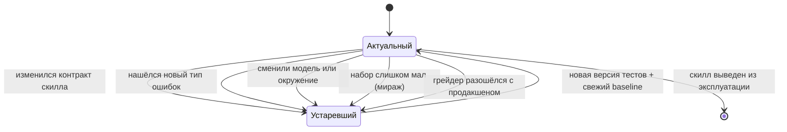

| Что произошло | Как заметить | Что делать |
|---|---|---|
| Изменился контракт/поведение | ассершены проверяют то, чего скилл уже не делает | новую версию тестов класть **отдельным файлом**, старые оставлять как есть |
| Появился новый тип ошибок | продакшен падает на том, чего нет в наборе | добавить кейсы нового типа |
| Набор мал/однообразен | большой «выигрыш», который не воспроизводится | разнообразить темы и конструкции (см. [§7.3](#73-разнообразьте-набор--иначе-получите-мираж)) |
| Сменили модель | точность/качество «поплыли» | перегнать триггерный eval, заново снять baseline |
| Грейдер разошёлся с гейтом | eval зелёный, а продакшен красный | **вызывать** боевую логику из грейдера ([§7.1](#71-грейдер-должен-вызывать-боевую-логику-а-не-копировать-её)) |
| Шум приняли за сигнал | разница в пределах «пола шума» | multi-rep + интервал ([§7.5](#75-шумные-метрики-меряйте-многократно-multi-rep-и-с-интервалом)) |

**Стратегия версионирования** (проверена на `wiki-verify`): новая версия тестов — *новый
файл* (старые продолжают охранять старое поведение); сырые результаты и отчёты —
*закреплены*; версии скилла и контрольные суммы файлов — *записаны в отчёт* (полная
история изменений).

> **✅ Что запомнить из §8.** Устаревание eval'а — норма, а не катастрофа. «Устарел» не
> значит «выбросить»: старые тесты охраняют старое поведение, новые покрывают новые
> требования. Главное — версионировать отдельными файлами и закреплять отчёты.

---

<a name="9-влияние"></a>
## 9. На что eval'ы влияют

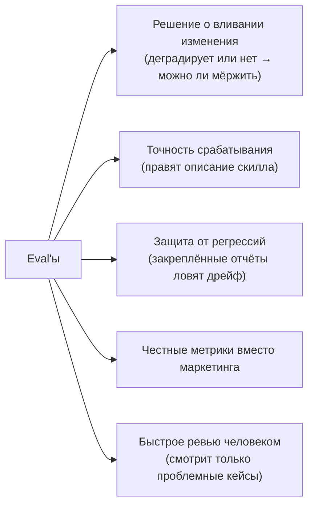

1. **Решение о вливании (merge).** A/B-отчёт прямо выносит вердикт «не деградирует →
   можно мёржить» или блокирует. Eval — это критерий приёмки.
2. **Срабатывание.** Триггерный цикл напрямую переписывает `description` под измеренную
   точность — влияет на то, будет ли скилл вообще применён.
3. **Регрессии.** Закреплённые отчёты ловят тихий сдвиг цифр при будущих правках.
4. **Честность.** Eval превращает «−70% за один прогон» в защитимое «−58% за две
   проверенные итерации». Это про доверие к заявлениям о скилле.
5. **Скорость ревью.** Человек смотрит не весь вывод, а только проблемные кейсы.

> **✅ Что запомнить из §9.** Eval — это не «бумажка для галочки». Он напрямую решает:
> вливать ли изменение, будет ли скилл срабатывать, поймаем ли регрессию и можно ли
> верить заявленным цифрам.

---

<a name="10-стоимость"></a>
## 10. Трудозатраты и токены — с конечными цифрами

> ⚠️ **Честно про данные.** В отчётах `wiki-verify` **нет** ни долларов, ни токенов, ни
> часов — затраты там выражены *числом сабагентов* (= критики × кейсы × повторы). В
> схемах `skill-creator` есть поле «токенов на прогон» — единственный твёрдый якорь:
> **один прогон ≈ 85 000 токенов** (реальный пример: 84 852). Ниже — модель оценки,
> опирающаяся на этот якорь. **Числа порядковые** (помечены `≈`), но доведены до
> конечного итога, чтобы было ясно, о каком масштабе речь.

### 10.1. Сколько стоит ПОВЕДЕНЧЕСКИЙ eval (с финальным итогом)

**Формула числа прогонов:**

```text
прогонов исполнителя = (версий) × (кейсов) × (повторов на версию)
прогонов грейдера     = столько же   ← но ТОЛЬКО если грейдер — это LLM
                                       (скрипт-грейдер = 0 токенов)
```

**Подставляем типичный небольшой набор:** 7 кейсов, 2 версии (со скиллом / без), 3
повтора.

| Компонент | Прогонов | ≈ токенов / прогон | ≈ Итого |
|---|---:|---:|---:|
| Исполнитель (со скиллом + без) | 7 × 2 × 3 = **42** | 85 000 (это якорь — реальное число) | **≈ 3.6 млн** |
| Грейдер (LLM-судья) | 42 | ≈ 30 000 (оценка) | **≈ 1.3 млн** |
| Аналитик (1 проход) | 1 | ≈ 50 000 (оценка) | ≈ 0.05 млн |
| **ИТОГО за одну итерацию** | | | **≈ 5 млн токенов** |

Обычно итераций **2–3** (улучшили скилл → перегнали). Значит:

> **Конечный вывод по поведенческому eval'у:**
> - **Одна итерация небольшого набора ≈ 5 млн токенов.**
> - **Полная кампания (2–3 итерации) ≈ 10–15 млн токенов.**
> - **Скрипт-грейдер вместо LLM-судьи убирает ~1.3 млн (≈ 25%) и даёт воспроизводимость.**

### 10.2. Сколько стоит ТРИГГЕРНЫЙ eval (с финальным итогом)

**Подставляем дефолты:** 20 запросов, 3 прогона на запрос, до 5 итераций.

| Компонент | Прогонов | ≈ токенов / прогон | ≈ Итого |
|---|---:|---:|---:|
| Короткие прогоны `claude -p` | 20 × 3 × 5 = **300** | ≈ 5 000 (оценка: прогон короткий — лишь решить, звать ли скилл) | **≈ 1.5 млн** |
| Улучшение описания | 4 | ≈ 25 000 (оценка) | ≈ 0.1 млн |
| **ИТОГО** | | | **≈ 1.6 млн токенов** |

> **Конечный вывод по триггерному eval'у:** ≈ **1.6 млн токенов** — это **на порядок
> дешевле** поведенческого. Триггерные прогоны короткие и хорошо параллелятся.

### 10.3. «Строгий» уровень — масштаб wiki-verify

Здесь грейдер — *скрипт* (ноль токенов на грейдинг), а стоимость — это прогоны критиков.

| Этап | Сабагентов (критиков) |
|---|---:|
| Бенчмарк v2 | 384 |
| Бенчмарк v3 | 88 |
| Бенчмарк v4 | 52 |
| A/B одного правила | 122 |
| Многократный прогон (5×) | 220 |
| **Итого по таблице** | **866** |
| + прогоны v1 и второй A/B (не в таблице) | ≈ +180 |
| **Суммарно по кампании** | **свыше 1000** |

При оценке ≈ 10 000 токенов на прогон критика (он читает короткий ответ + источники и
выдаёт JSON) это **≈ 9–10 млн токенов за всю кампанию v1→v4 + A/B + multi-rep**,
растянутую примерно на **4 дня** (по датам отчётов). Грейдинг — **0 токенов** (скрипт).

> **Конечный вывод по строгому уровню:** ≈ **9–10 млн токенов и ~несколько дней** работы
> на скилл-гейт промышленного уровня. Главная экономия — **скрипт-грейдер**: на тысяче с
> лишним прогонов он сэкономил бы миллионы токенов, которые ушли бы на LLM-судью.

### 10.4. Какой уровень выбрать

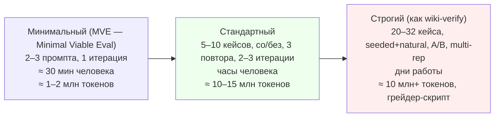

- **Минимальный** — новый или некритичный скилл; вывод субъективный; нужно «хоть что-то».
- **Стандартный** — скилл идёт в общее пользование, есть объективные ассершены.
- **Строгий** — скилл-гейт, цена ошибки высока (безопасность, факт-чекинг, решения о
  мёрже), вывод структурный → окупается скрипт-грейдером и пиннингом.

### 10.5. Где экономить, не теряя качества

- Дописывать ассершены, **пока прогоны идут** (параллелит время).
- **Сразу** сохранять токены/время прогона — иначе перезапуск.
- В A/B **менять одну переменную** — не перегонять неизменное.
- Делать **скрипт-грейдер**, если вывод структурный — обнуляет токены грейдинга.
- Многократные прогоны — **только** для дрожащих метрик, не для всех подряд.

> **✅ Что запомнить из §10 (итоговые ориентиры):**
> | Уровень | Токены | Время |
> |---|---|---|
> | Минимальный | ≈ 1–2 млн | ≈ 30 мин |
> | Стандартный | ≈ 10–15 млн | часы |
> | Строгий | ≈ 10 млн+ | дни |
>
> Практический ориентир по умолчанию: **закладывайте ~5 млн токенов на одну итерацию
> поведенческого eval'а и 2–3 итерации.** Триггерный eval — на порядок дешевле.
> Скрипт-грейдер — главный рычаг экономии на больших наборах.

---

<a name="11-чеклисты"></a>
## 11. Чеклисты и антипаттерны

### 11.1. Чеклист подготовки eval'а

- [ ] Сначала прогнал **без скилла (baseline)** — видел реальные ошибки, а не воображаемые.
- [ ] Запросы **реалистичны** (пути, опечатки, «почти-попадания» для триггера).
- [ ] Каждый ассершен проверяет **суть**, а не наличие слов; **не прошёл бы** на галлюцинации.
- [ ] Есть **негативные проверки** (что НЕ должно случиться).
- [ ] Для дисциплинарных скиллов — **сценарии под давлением (3+)** + таблица отговорок.
- [ ] Набор **разнообразен** по темам и конструкциям (seeded + natural).
- [ ] Грейдер **вызывает боевую логику** (если она есть), а не копирует её.
- [ ] Отчёты/результаты **закреплены** тестом; новая версия — **новый файл**.
- [ ] Дрожащие метрики меряются **многократно + интервал**.

### 11.2. Антипаттерны

| ❌ Антипаттерн | Почему плохо | ✅ Как правильно |
|---|---|---|
| Пропустить baseline | не знаешь, что скилл реально чинит | всегда сначала прогон без скилла |
| Маленький однообразный набор | «мираж» — выигрыш не воспроизводится | разнообразить темы |
| Ассершен «содержит слово X» | пройдёт и на галлюцинации | проверять суть/корректность |
| Только положительные кейсы | слеп к ложным тревогам и перетриггерингу | добавить негативные |
| Скопировать логику гейта в грейдер | тест разойдётся с продакшеном | вызывать боевую функцию |
| Единичный A/B на дрожащей метрике | примешь шум за эффект | многократно + интервал |
| Чинить то, что не влияет на вердикт | работа и риск без пользы | оставить и задокументировать |
| «−70% за один прогон» как реклама | ложная уверенность | «измерено за N проверенных итераций» |
| Потерять тайминг прогона | нет токенов/времени → перезапуск | сохранять в момент завершения |

### 11.3. Золотое правило

> Если вы не стали бы писать код без тестов — не пишите скилл без eval'ов.
> Если вы не видели, как агент **ошибается без скилла**, вы не знаете, что скилл чинит.
> И если «выигрыш» получен на одном прогоне игрушечного набора — это, скорее всего,
> **мираж**.

---

<a name="приложение-a"></a>
## Приложение A. Глоссарий

Термины сгруппированы: сначала общие, затем про метрики, затем продвинутые. Объяснения —
простым языком.

### A.1. Общие понятия

- **Скилл (skill)** — текстовая инструкция-навык для ИИ-агента: когда и как выполнять
  определённый класс задач.
- **Агент (agent)** — ИИ (модель + инструменты), который читает задачу и выполняет её.
- **LLM** — большая языковая модель (Large Language Model), «мозг» агента.
- **Eval (evaluation, «оценка»)** — автоматический тест скилла на наборе задач.
- **Тест-кейс (кейс)** — одна задача в наборе eval'ов: промпт + ожидания.
- **Промпт (prompt)** — текст запроса, который подаётся агенту.
- **Baseline («базовая линия»)** — эталонный прогон *без* скилла (или со старой версией),
  с которым сравнивают.
- **Грейдер (grader, «оценщик»)** — проверяющий (LLM или скрипт), выносящий «зачёт/незачёт»
  по каждому ассершену с доказательством. См. [§1.1](#11-что-такое-грейдер-и-зачем-он-нужен).
- **Грейдинг (grading)** — сам процесс выставления вердиктов.
- **Ассершен (assertion, «утверждение-проверка»)** — конкретное проверяемое условие об
  ожидаемом результате («в выводе есть X»).
- **Ожидание (expectation)** — то же, что ассершен (в `skill-creator` так называют поле).
- **Триггер (trigger, «срабатывание»)** — момент, когда агент решает применить скилл.
- **Описание / `description`** — поле скилла, по которому агент решает, применять ли его;
  единственный сигнал для триггера.
- **Ложная тревога (false positive)** — скилл «увидел» проблему там, где её нет. Два вида
  (не путать): **перетриггеринг** — скилл *сработал* зря (ложная тревога триггера);
  **переругивание** — скилл *выдал находку/претензию* зря (ложная тревога поведения).
- **Классификатор** — программа, раскладывающая входы по нескольким «корзинам»; триггерный
  eval — это классификатор «звать скилл / не звать».
- **Регрессия** — поломка ранее работавшего поведения, внесённая будущей правкой (часто в
  другом месте). Eval'ы существуют, в частности, чтобы их ловить.
- **Контракт скилла** — то, что скилл *обещает* делать (его заявленное поведение). «Контракт
  изменился» = изменилось обещание, и старые тесты могут устареть.
- **Сабагент (subagent)** — отдельный экземпляр агента, запущенный под одну подзадачу.
- **Оркестратор (orchestrator)** — главный агент, который раздаёт задачи сабагентам и
  собирает результаты.
- **Транскрипт (transcript)** — лог действий агента во время прогона (что он делал).
- **Фикстура (fixture)** — заранее подготовленные входные данные для теста (файлы,
  примеры). Делает тест воспроизводимым.
- **Вьюер (viewer)** — наглядный HTML-отчёт в браузере для просмотра результатов человеком.
- **Бенчмарк (benchmark)** — сводное сравнение версий по метрикам (доля успеха, время,
  токены).
- **Дельта (delta)** — разница метрик между версиями (например, «+0.50» к доле успеха).
- **Токен (token)** — единица текста для LLM (примерно ¾ слова); в токенах считают объём
  и стоимость работы модели.
- **CI (Continuous Integration, «непрерывная интеграция»)** — система, которая
  автоматически прогоняет тесты при каждом изменении кода. ⚠️ Не путать с *доверительным
  интервалом* (тоже сокращается «CI», см. [A.3](#a3-метрики)); в этом гайде «в CI» всегда
  означает «в автоматических проверках».
- **CLI (command-line interface)** — запуск программы из командной строки (терминала).
- **MVE (Minimal Viable Eval)** — «минимально достаточный eval»: 2–3 кейса, одна итерация.

### A.2. Подход и методология

- **TDD (Test-Driven Development)** — «разработка через тесты»: сначала тест (он падает),
  потом код (тест проходит).
- **RED / GREEN / REFACTOR** — три фазы TDD: «красный» (тест падает), «зелёный» (тест
  проходит), «чистка» (закрыть лазейки, не сломав).
- **Stub-first («сначала заглушка»)** — стиль разработки, где сперва делают каркас/заглушку,
  проверяют, что «всё на месте», а потом наполняют логикой. Здесь упоминается как родственный
  TDD подход.
- **Сценарий под давлением (pressure scenario)** — тест, где на агента давят
  обстоятельства (время, авторитет, усталость), чтобы спровоцировать нарушение правила.
- **Рационализация (rationalization, «отговорка»)** — оправдание, которым агент объясняет
  нарушение правила («ну один раз можно»).
- **Таблица рационализаций** — список пойманных отговорок и готовых ответов на них в скилле.
- **Surface compliance («поверхностное соблюдение»)** — формально галочка есть, по сути
  правило не выполнено.
- **Пуленепробиваемый (bulletproof) скилл** — соблюдается даже под максимальным давлением.
- **Near-miss («почти-попадание»)** — запрос, похожий на целевой, но требующий другого
  скилла; ловит перетриггеринг.

### A.3. Метрики

- **pass / fail** — «зачёт / незачёт» по одному ассершену.
- **pass_rate (доля успеха)** — сколько ассершенов прошло из всех (например, 0.67 = 2 из 3).
- **trigger_rate (доля срабатываний)** — на какой доле прогонов скилл сработал.
- **Порог (threshold)** — граница для решения (например, «сработал, если доля ≥ 0.5»).
- **Precision (точность)** — из тех случаев, где скилл сработал, какая доля была *верной*.
  Высокая precision = мало ложных тревог.
- **Recall (полнота)** — из тех случаев, где скилл *должен* был сработать, на какой доле
  он реально сработал. Высокая recall = мало пропусков.
- **Accuracy (правильность)** — доля верных решений среди всех (и «сработал», и «не
  сработал»).
- **False Positive (FP, «ложное срабатывание»)** — скилл поднял тревогу там, где не надо.
- **False Negative (FN, «пропуск»)** — скилл не сработал там, где был нужен.
- **stddev (стандартное отклонение)** — мера разброса значений вокруг среднего.
- **Доверительный интервал (ДИ; англ. confidence interval)** — диапазон, в котором честно
  лежит оценка с заданной вероятностью (например, 95%). ⚠️ По-английски сокращается «CI» —
  не путайте с Continuous Integration (см. [A.1](#a1-общие-понятия)); в этом гайде во
  избежание путаницы пишем «доверительный интервал», а «CI» резервируем за интеграцией.
- **Bootstrap (бутстреп)** — статистический приём: много раз случайно перевыбирать данные
  из той же выборки (с возвращением), чтобы оценить доверительный интервал без сложных
  формул.
- **анти-маркетинг** — здесь: привычка формулировать результат скромно и честно (вместо
  громкой рекламной цифры с одного прогона).

### A.4. Продвинутые понятия (встречаются у wiki-verify)

Часть этих терминов в основном тексте не используется — они даны на случай, если вы
полезете в исходники `wiki-verify`. Их можно спокойно пропустить при первом чтении.


- **Гейт (gate, «вентиль»)** — правило-вердикт, решающее «прошло / не прошло» (и пускать
  ли дальше). В eval'е грейдер должен **вызывать** боевой гейт, а не копировать.
- **Drift («дрейф»)** — расхождение: тест и продакшен со временем разъехались, тест врёт.
- **Pinning («закрепление»)** — сохранить сырые результаты + отчёт и проверять в CI, что
  они не изменились; защита от тихого «уплытия» цифр.
- **Audit-trail («след для аудита»)** — записанная история: версии, контрольные суммы,
  даты — чтобы любой результат можно было воспроизвести и проверить.
- **sha256 / контрольная сумма** — «отпечаток» файла; совпал отпечаток → файл тот же.
- **Мираж** — ложное улучшение, полученное на маленьком/однообразном наборе и не
  воспроизводимое на разнообразном.
- **seeded («с подсадкой»)** — кейс, в который дефект внедрён механически; эталон известен
  по построению (нулевой авторский перекос).
- **natural («естественный»)** — реалистичный кейс, эталон которого задают слепые
  независимые разметчики (по согласию между ними).
- **Ground-truth («эталон, истина»)** — заведомо правильный ответ, с которым сравнивают.
- **A/B-тест** — сравнение двух вариантов (старый vs новый) на одних и тех же данных.
- **Изоляция переменной** — менять ровно одно, остальное фиксировать, чтобы разница
  объяснялась только этим изменением.
- **Multi-rep («многократный прогон»)** — несколько независимых прогонов каждой версии,
  чтобы усреднить шум LLM.
- **Noise floor («пол шума», ±1)** — порог естественного дрожания метрики; ниже него
  движение нельзя приписывать правке.
- **gate-neutral («нейтрально к вердикту»)** — изменение, которое *по построению* не может
  повлиять на итоговое «прошло/не прошло».
- **Инъекция (injection)** — вредная инструкция, спрятанная в данных, чтобы агент её
  выполнил. Класс атак, который проверяет критик безопасности.
- **Линза (lens)** — у `wiki-verify` так называют каждого из 4 критиков (факты, логика,
  безопасность, полнота): «угол зрения» на ответ.
- **lens-purity («чистота линз»)** — метрика: один дефект должен помечаться *одной*
  линзой, а не несколькими сразу.
- **Протекание (bleed)** — когда один дефект ошибочно «протекает» в несколько линз.
- **Severity («серьёзность»)** — уровень дефекта (critical / high / medium / low).
- **Verdict («вердикт»)** — итог: прошло (pass) или нет (fail).
- **Span («фрагмент»)** — подстрока ответа, в которой «живёт» дефект; на неё «якорится»
  проверка.
- **Endpoint-bias («перекос на концы»)** — порок верификатора: проверяет только начало и
  конец цепочки рассуждений, пропуская подменённое *среднее* звено.
- **Wall-clock («по настенным часам»)** — реальное затраченное время (в отличие от
  машинного/процессорного).

---

<a name="приложение-b"></a>
## Приложение B. Карта файлов

**skill-creator (этот репозиторий):**
- [`.claude/skills/skill-creator/SKILL.md`](../../.claude/skills/skill-creator/SKILL.md) — основной воркфлоу (основной цикл, разделы 2–8).
- [`references/eval_schemas.md`](../../.claude/skills/skill-creator/references/eval_schemas.md) — схемы файлов: `evals.json`, `grading.json`, `benchmark.json`, `comparison.json`, `analysis.json`, `metrics.json`, `timing.json`, `history.json`.
- [`references/testing-skills-with-subagents.md`](../../.claude/skills/skill-creator/references/testing-skills-with-subagents.md) — RED-GREEN-REFACTOR, сценарии под давлением, таблицы отговорок.
- [`agents/grader.md`](../../.claude/skills/skill-creator/agents/grader.md) — роль LLM-грейдера.
- [`agents/comparator.md`](../../.claude/skills/skill-creator/agents/comparator.md), [`agents/analyzer.md`](../../.claude/skills/skill-creator/agents/analyzer.md) — слепое A/B-сравнение и пост-анализ.
- [`scripts/run_eval.py`](../../.claude/skills/skill-creator/scripts/run_eval.py) — триггерный eval (ловит факт срабатывания по потоку событий ответа агента, не дожидаясь конца).
- [`scripts/run_loop.py`](../../.claude/skills/skill-creator/scripts/run_loop.py) — цикл подбора описания (train/test, сокрытие test от улучшателя).
- [`scripts/aggregate_benchmark.py`](../../.claude/skills/skill-creator/scripts/aggregate_benchmark.py) — сборщик `benchmark.json`/`.md`.

**wiki-verify (другой проект):**
- Исходники и eval-стенд целиком: <https://github.com/MatrixFounder/llm-wiki/tree/main/skills/wiki-verify>
- Внутри стоит смотреть: `SKILL.md` (контракт 4 критиков), `evals/README.md` (методология),
  `evals/grade.py` (скрипт-грейдер, вызывающий боевую логику), `evals/evals*.json` (версии
  набора v1→v4), `evals/reports/` (отчёты, A/B и многократные прогоны).

---

*Гайд подготовлен на основе фактического кода и отчётов указанных скиллов. Числовые оценки
токенов в §10 — порядковые, с единственным задокументированным якорем (≈ 85k токенов на
прогон); количества сабагентов, кейсов и итераций — точные, из отчётов `wiki-verify`.*
