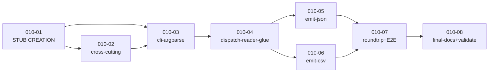

# Development Plan: Task 010 — `xlsx-8` `xlsx2csv.py` / `xlsx2json.py` read-back CLIs

> **Mode:** VDD (Verification-Driven Development) + Stub-First.
> **Status:** DRAFT v1 — pending Plan-Reviewer approval.
> **TASK:** [TASK.md](TASK.md) (Task 010, slug `xlsx-read-back`).
> **Architecture:** [ARCHITECTURE.md](ARCHITECTURE.md) (xlsx-8 — thin
> shim + `xlsx2csv2json/` package on top of xlsx-10.A `xlsx_read/`).
> **Prior plan archived:** [plans/plan-009-xlsx-read-library.md](plans/plan-009-xlsx-read-library.md).
> **Atomic-chain hint (architect handoff):** [ARCHITECTURE.md §11](ARCHITECTURE.md).

---

## 0. Strategy Summary

### 0.1. Chainlink Decomposition Overview

This plan is a **Chainlink** (VDD discipline): every Issue from the
TASK RTM (R1–R20) is decomposed into one or more **Beads** (atomic
sub-issues), each implementable in a single sitting (2–4 h) and
verifiable through a single test case or test cluster. Beads are
grouped by **module-scoped tasks** (`task-010-NN-*.md`), and each
task is tagged Stub-First per `skill-tdd-stub-first §1–§2`.

### 0.2. Phasing

- **Phase 1 (Structure & Stubs)** — single bootstrap task `010-01`:
  package skeleton (`xlsx2csv2json/`), both shims (`xlsx2csv.py` +
  `xlsx2json.py`), `__init__.py` `__all__` lock with all exception
  classes defined (the public contract is frozen up-front), every
  module a `pass`/`NotImplementedError` stub, `tests/` skeleton with
  ONE smoke E2E asserting the hardcoded sentinel behaviour (Red →
  Green on stubs). Toolchain is **inherited unchanged** from
  xlsx-10.A (`pyproject.toml` / `ruff` / `install.sh` /
  `requirements.txt` are NOT touched — see TASK §6.1 and ARCH C4/C5/C6).

- **Phase 2 (Logic Implementation)** — 5 module-scoped logic tasks
  (`010-02` cross-cutting, `010-03` cli/argparse, `010-04`
  dispatch/reader-glue, `010-05` emit-json, `010-06` emit-csv) — each
  replacing one private module's stubs with real behaviour and
  adding the unit-test cluster for that module; existing E2E smoke
  test is **updated** to assert real values per
  `tdd-stub-first §2`.

- **Stage 3 (Integration + final gates)** — task `010-07`
  round-trip + references update (flip xlsx-2's `TestRoundTripXlsx8`
  skipUnless gate, append xlsx-8 read-back section to
  `references/json-shapes.md`, add the 30-E2E test cluster from TASK
  §5.5), then task `010-08` final-docs + validation
  (`SKILL.md`/`.AGENTS.md`, `validate_skill.py` exit 0, 12-line
  `diff -q` silent gate, LOC budget verification).

> **Atomicity check:** each task target = single F-region (one or
> two modules + their tests) — within the 2–4 h budget per planner
> prompt §1. All tasks include explicit Stub-First gates per
> `tdd-stub-first §2`.

### 0.3. Cross-skill replication gate

**This task does NOT replicate anywhere** — `xlsx2csv2json/`,
`xlsx2csv.py`, `xlsx2json.py` are xlsx-specific (consume
`xlsx_read/` which is xlsx-only). The 12-line `diff -q` silent gate
(ARCH §9.4) MUST stay silent every task — the gating shell snippet
appears in every task file under "Acceptance Criteria".

---

## 1. Task Execution Sequence

### Stage 1 — Structure, Stubs, Test Scaffolding

- **Task 010-01** [STUB CREATION] — Package skeleton, both shims,
  exceptions catalogue, `__all__` lock, smoke E2E asserting
  hardcoded sentinels.
  - RTM: [R1], [R2], [R3], [R18] (docstring stubs), exception
    catalogue from [R4–R17] (declared, not implemented).
  - Use Cases: scaffolds UC-01..UC-10 (all stubs return sentinels);
    establishes UC-09 envelope plumbing skeleton.
  - Description File: [tasks/task-010-01-pkg-skeleton.md](tasks/task-010-01-pkg-skeleton.md)
  - Priority: Critical (blocks every later task).
  - Dependencies: none.

### Stage 2 — Logic Implementation (cross-cutting first, then per F-region)

- **Task 010-02** [LOGIC IMPLEMENTATION] — Cross-cutting envelopes,
  `_AppError` subclasses with `CODE`, same-path guard, basename-only
  leak prevention.
  - RTM: [R14], [R15], [R16], [R17]; D-A10 from ARCH.
  - Use Cases: UC-07 (encrypted), UC-08 (same-path), UC-09
    (`--json-errors` envelope).
  - Description File: [tasks/task-010-02-cross-cutting.md](tasks/task-010-02-cross-cutting.md)
  - Priority: Critical (every later task depends on the envelope
    plumbing).
  - Dependencies: 010-01.

- **Task 010-03** [LOGIC IMPLEMENTATION] — `cli.py`: full argparse
  surface per ARCH §5.1; `build_parser(format_lock=...)`;
  `_validate_flag_combo`; `_resolve_paths`; `main(argv,
  format_lock=...)`.
  - RTM: [R2] (format-lock), [R4] (input/output), [R5] (sheet
    selector), [R6] (defaults), [R7] (header-rows + H3 conflict),
    [R12.d] (multi-table envelope at parse-time), [R12.f]
    (multi-sheet envelope at parse-time).
  - Use Cases: UC-01..UC-06 (CLI surface), UC-08/UC-09 (envelope
    triggers).
  - Description File: [tasks/task-010-03-cli-argparse.md](tasks/task-010-03-cli-argparse.md)
  - Priority: High.
  - Dependencies: 010-01, 010-02.

- **Task 010-04** [LOGIC IMPLEMENTATION] — `dispatch.py`: reader-glue
  via `xlsx_read.open_workbook`; `iter_table_payloads`;
  `_resolve_tables_mode` (4-val→3-val with `gap` post-filter, D-A2);
  `_validate_sheet_path_components` (cross-platform reject list).
  - RTM: [R8] (merge policy), [R9] (multi-table modes), [R10.a]
    (hyperlink kwargs to library), [R12.c] (subdir layout
    path-component check).
  - Use Cases: UC-03 (multi-table JSON), UC-04 (multi-region CSV),
    UC-05 (multi-row header).
  - Description File: [tasks/task-010-04-dispatch-and-reader-glue.md](tasks/task-010-04-dispatch-and-reader-glue.md)
  - Priority: High.
  - Dependencies: 010-01, 010-02, 010-03.

- **Task 010-05** [LOGIC IMPLEMENTATION] — `emit_json.py`:
  `_shape_for_payloads` pure function (4 shape rules); `_row_to_dict`
  with header-flatten-style + hyperlink dict-shape; `emit_json`
  driver.
  - RTM: [R10.b] (JSON hyperlink dict), [R11] (4 JSON shapes
    a–e), [R7.d] (`--header-flatten-style array` for JSON only).
  - Use Cases: UC-01, UC-03, UC-05, UC-06 (JSON path).
  - Description File: [tasks/task-010-05-emit-json.md](tasks/task-010-05-emit-json.md)
  - Priority: High.
  - Dependencies: 010-04.

- **Task 010-06** [LOGIC IMPLEMENTATION] — `emit_csv.py`:
  `_emit_single_region`; `_emit_multi_region` with subdirectory
  layout; `_format_hyperlink_csv` (markdown-link form);
  path-traversal guard (D-A8).
  - RTM: [R10.c] (CSV markdown-link), [R12.a–c] (CSV shapes),
    [R12.f] (multi-sheet envelope at emit-time fallback).
  - Use Cases: UC-02, UC-04, UC-06 (CSV path).
  - Description File: [tasks/task-010-06-emit-csv.md](tasks/task-010-06-emit-csv.md)
  - Priority: High.
  - Dependencies: 010-04.

### Stage 3 — Integration, Round-Trip, Final Gates

- **Task 010-07** [LOGIC IMPLEMENTATION] — Round-trip contract +
  references: flip xlsx-2's `TestRoundTripXlsx8` skipUnless gate;
  append xlsx-8 read-back shapes section to
  `references/json-shapes.md`; add the 30-E2E test cluster from TASK
  §5.5; honest-scope docstring in `xlsx2csv2json/__init__.py`.
  - RTM: [R13] (round-trip contract), [R18] (honest-scope
    docstring), [R19] (E2E ≥ 25 — 30 here), [R20] (post-validate
    env-flag).
  - Use Cases: UC-10 (round-trip with xlsx-2); locks UC-01..UC-09
    via the full E2E cluster.
  - Description File: [tasks/task-010-07-roundtrip-and-references.md](tasks/task-010-07-roundtrip-and-references.md)
  - Priority: High.
  - Dependencies: 010-05, 010-06.

- **Task 010-08** [LOGIC IMPLEMENTATION] — Final docs + validation:
  `SKILL.md` registry rows + §10 note; `.AGENTS.md` xlsx2csv2json
  section; `validate_skill.py skills/xlsx` exit 0; 12-line `diff -q`
  silent gate; LOC budget verified (≤ 60 LOC per shim; ≤ 1500 LOC
  total package).
  - RTM: [R18] (docs), [R19] (existing test suites green); locks
    cross-skill replication boundary (TASK §6.1).
  - Use Cases: locks all UCs via final gate.
  - Description File: [tasks/task-010-08-final-docs-and-validation.md](tasks/task-010-08-final-docs-and-validation.md)
  - Priority: Critical (release gate).
  - Dependencies: 010-07.

---

## 2. Chainlink — Epic → Issue → Bead breakdown

> **Convention:** Beads are the atomic verifiable sub-issues. Each
> Bead lives inside exactly one task file (table column "Owner Task").

### Epic E1 — Package + Shim Skeleton

- **[R1] Two CLI shims with single package backend**
  - **B1.1** Create empty package directory with all 6 files (`__init__.py`, `cli.py`, `dispatch.py`, `emit_json.py`, `emit_csv.py`, `exceptions.py`) — Owner: **010-01**
  - **B1.2** Shim `xlsx2csv.py` (53–60 LOC) with body from ARCH §3.2 C1 — Owner: **010-01**
  - **B1.3** Shim `xlsx2json.py` (53–60 LOC) with body from ARCH §3.2 C2 — Owner: **010-01**
  - **B1.4** Public helpers `convert_xlsx_to_csv` + `convert_xlsx_to_json` in `__init__.py` — Owner: **010-01** (stubs) → **010-03** (wired)
- **[R2] Shim dispatch via `--format` (hard-bound)**
  - **B2.1** `format_lock` kwarg threaded through `main()` — Owner: **010-03**
  - **B2.2** `FormatLockedByShim` exception (CODE=2) — Owner: **010-02**
  - **B2.3** Regression test: `xlsx2csv.py --format json` → exit 2 envelope — Owner: **010-03**
- **[R3] Package import hygiene**
  - **B3.1** `sys.path.insert(0, parent)` boilerplate in both shims — Owner: **010-01**
  - **B3.2** `from xlsx2csv2json import ...` re-export list mirrors json2xlsx pattern — Owner: **010-01**
  - **B3.3** `ruff check scripts/` green (banned-api from xlsx-10.A respected) — Owner: **010-01**

### Epic E2 — Core CLI Surface

- **[R4] Input + output args**
  - **B4.1** Positional `INPUT` parsing + `Path` resolution — Owner: **010-03**
  - **B4.2** `--output OUT` or `-` for stdout; absent → stdout default — Owner: **010-03**
  - **B4.3** Parent-dir auto-create for `--output` — Owner: **010-03**
  - **B4.4** Cross-7 H1 same-path guard via `Path.resolve()` — Owner: **010-02**
- **[R5] Sheet selector**
  - **B5.1** `--sheet NAME|all` (default `all`) — Owner: **010-03**
  - **B5.2** Missing sheet → `SheetNotFound` re-mapped to exit 2 envelope — Owner: **010-04**
  - **B5.3** `--include-hidden` opt-in; default skip — Owner: **010-04**
- **[R6] Format defaults (backward-compat lock)**
  - **B6.1** All seven defaults wired into `argparse` — Owner: **010-03**
  - **B6.2** Regression test: no flags + 5-cell fixture pins shape — Owner: **010-07**

### Epic E3 — Complex Table Support

- **[R7] Multi-row headers**
  - **B7.1** `--header-rows N|auto` parse + pass-through to library — Owner: **010-03** + **010-04**
  - **B7.2** Separator U+203A verified at emit-time (library produces; emit preserves) — Owner: **010-05**
  - **B7.3** `--header-flatten-style string|array` for JSON only — Owner: **010-05**
  - **B7.4** `HeaderRowsConflict` envelope when `--header-rows N` (int) AND `--tables != whole` — Owner: **010-02** (class) + **010-03** (raise)
- **[R8] Body merge policy**
  - **B8.1** `--merge-policy anchor-only|fill|blank` parse + pass-through to library — Owner: **010-03** + **010-04**
- **[R9] Multi-table-per-sheet**
  - **B9.1** `--tables whole|listobjects|gap|auto` parse — Owner: **010-03**
  - **B9.2** `_resolve_tables_mode` 4→3 mapping with `gap` post-filter — Owner: **010-04**
  - **B9.3** `--gap-rows 2`, `--gap-cols 1` defaults wired — Owner: **010-03**
- **[R10] Hyperlinks**
  - **B10.1** `--include-hyperlinks` parse + pass-through to library — Owner: **010-03** + **010-04**
  - **B10.2** JSON dict-shape `{"value", "href"}` emit — Owner: **010-05**
  - **B10.3** CSV `[text](url)` markdown emit — Owner: **010-06**
  - **B10.4** Regression test: no `=HYPERLINK()` formula emission — Owner: **010-06**

### Epic E4 — Output Shapes

- **[R11] JSON shape**
  - **B11.1** `_shape_for_payloads` pure function (4 rules a–e) — Owner: **010-05**
  - **B11.2** Region-order determinism (document order from library) — Owner: **010-04** + **010-05**
- **[R12] CSV shape**
  - **B12.1** `_emit_single_region` with `QUOTE_MINIMAL` + `\n` lineterminator — Owner: **010-06**
  - **B12.2** `_emit_multi_region` subdir schema `<output-dir>/<sheet>/<table>.csv` — Owner: **010-06**
  - **B12.3** `MultiTableRequiresOutputDir` envelope (multi-region without `--output-dir`) — Owner: **010-02** (class) + **010-03** (raise)
  - **B12.4** `MultiSheetRequiresOutputDir` envelope (`--sheet all` without `--output-dir`) — Owner: **010-02** (class) + **010-03** (raise)
  - **B12.5** Parent dirs auto-created (csv2xlsx parity) — Owner: **010-06**
- **[R13] Round-trip contract update**
  - **B13.1** Append xlsx-8 read-back shapes section to `references/json-shapes.md` — Owner: **010-07**
  - **B13.2** Document `tables` key as lossy on xlsx-2 v1 consume — Owner: **010-07**
  - **B13.3** Flip `TestRoundTripXlsx8::test_live_roundtrip` skipUnless gate — Owner: **010-07**

### Epic E5 — Cross-Cutting Parity

- **[R14] Cross-3 — encrypted input**
  - **B14.1** Catch `EncryptedWorkbookError` → envelope code 3 with basename-only — Owner: **010-02**
- **[R15] Cross-4 — macro-bearing input**
  - **B15.1** `warnings.catch_warnings(record=True)` + propagate via `warnings.showwarning` — Owner: **010-02**
- **[R16] Cross-5 — `--json-errors` envelope**
  - **B16.1** `add_json_errors_argument(parser)` wired — Owner: **010-02** + **010-03**
  - **B16.2** All exit paths route through `_errors.report_error` — Owner: **010-02**
  - **B16.3** Envelope schema v=1, `code` never 0 — Owner: **010-02**
- **[R17] Cross-7 — same-path guard**
  - **B17.1** `Path.resolve()` follow-symlinks equality check — Owner: **010-02**
  - **B17.2** Regression test: symlink `out.xlsx -> input.xlsx` → exit 6 — Owner: **010-02**

### Epic E6 — Honest-Scope + Tests + Final Gates

- **[R18] Honest-scope documentation**
  - **B18.1** `xlsx2csv2json/__init__.py` docstring mirrors TASK §1.4 — Owner: **010-07**
  - **B18.2** `.AGENTS.md` xlsx2csv2json section — Owner: **010-08**
  - **B18.3** `SKILL.md` registry rows + §10 honest-scope note — Owner: **010-08**
- **[R19] Test suite (≥ 25 E2E + unit per module)**
  - **B19.1** Unit tests per module — distributed: `test_cli.py` (010-03), `test_dispatch.py` (010-04), `test_emit_json.py` (010-05), `test_emit_csv.py` (010-06), `test_public_api.py` (010-01)
  - **B19.2** 30-E2E cluster `test_e2e.py` per TASK §5.5 — Owner: **010-07**
  - **B19.3** `validate_skill.py skills/xlsx` exit 0 — Owner: **010-08**
- **[R20] Post-validate hook (env-flag opt-in)**
  - **B20.1** Env-flag `XLSX_XLSX2CSV2JSON_POST_VALIDATE` read in `cli.py` — Owner: **010-07**
  - **B20.2** JSON `json.loads()` round-trip on emitted file — Owner: **010-07**
  - **B20.3** `PostValidateFailed` envelope (CODE=7) on failure — Owner: **010-02** (class) + **010-07** (raise)

---

## 3. Use Case Coverage

| Use Case | Tasks |
| --- | --- |
| UC-01 (JSON single sheet, happy path) | 010-03 (CLI surface), 010-04 (reader glue), 010-05 (emit), 010-07 (E2E #1) |
| UC-02 (CSV single sheet, stdout) | 010-03 (CLI surface), 010-04 (reader glue), 010-06 (emit), 010-07 (E2E #7) |
| UC-03 (JSON multi-table nested) | 010-04 (`_resolve_tables_mode`), 010-05 (`_shape_for_payloads`), 010-07 (E2E #10–#14) |
| UC-04 (CSV multi-table subdir layout) | 010-04 (path-component validate), 010-06 (`_emit_multi_region`), 010-07 (E2E #15–#17) |
| UC-05 (multi-row header auto) | 010-03 (`--header-rows`), 010-04 (passthrough), 010-05 (flatten-style), 010-07 (E2E #18–#21) |
| UC-06 (hyperlinks) | 010-04 (`--include-hyperlinks`), 010-05 (JSON dict-shape), 010-06 (CSV markdown), 010-07 (E2E #22–#23) |
| UC-07 (encrypted → exit 3) | 010-02 (envelope code 3, basename), 010-07 (E2E #24) |
| UC-08 (same-path → exit 6) | 010-02 (`_resolve_paths` same-path guard), 010-07 (E2E #25) |
| UC-09 (`--json-errors` envelope) | 010-02 (envelope plumbing), 010-07 (E2E #26) |
| UC-10 (round-trip xlsx-2) | 010-07 (flip skipUnless gate + E2E #27) |

---

## 4. Stub-First Compliance Matrix

| Stage | Task ID | Tag | Stub gate | Logic gate |
| --- | --- | --- | --- | --- |
| 1 | 010-01 | [STUB CREATION] | Smoke E2E asserts sentinel; `ruff` green; package importable | — |
| 2 | 010-02 | [LOGIC IMPLEMENTATION] | (stubs from 010-01) | Cross-cutting envelopes live |
| 2 | 010-03 | [LOGIC IMPLEMENTATION] | (stubs from 010-01) | CLI flags + dispatch live |
| 2 | 010-04 | [LOGIC IMPLEMENTATION] | (stubs from 010-01) | Reader-glue live |
| 2 | 010-05 | [LOGIC IMPLEMENTATION] | (stubs from 010-01) | JSON emit live |
| 2 | 010-06 | [LOGIC IMPLEMENTATION] | (stubs from 010-01) | CSV emit live |
| 3 | 010-07 | [LOGIC IMPLEMENTATION] | (per-task stubs) | Round-trip + 30 E2E live |
| 3 | 010-08 | [LOGIC IMPLEMENTATION] | (per-task stubs) | Validate + LOC budget + diff-q silent |

> **Per `tdd-stub-first §2`:** the smoke E2E in 010-01 asserts the
> hardcoded sentinel; each subsequent task **updates** the E2E to
> assert the new real behaviour AND adds module-scoped unit tests
> (per `skill-testing-best-practices`).

---

## 5. Risk register (planner-layer)

| Risk | Mitigation | Owner Task |
| --- | --- | --- |
| **R-1.** `xlsx_read` library API drift between merge (2026-05-12) and xlsx-8 implementation. | xlsx-10.A `__all__` is frozen; ruff banned-api enforces. Regression in 010-01 imports every symbol; CI fails-loud on any rename. | 010-01 |
| **R-2.** xlsx-2's `TestRoundTripXlsx8` skipUnless predicate references a non-existent file at flip-time, so the test stays skipped silently. | 010-07 adds an explicit assertion that the test is **not** skipped after flip; CI asserts `unittest.SkipTest` is NOT raised. | 010-07 |
| **R-3.** `_resolve_tables_mode` post-filter (D-A2) silently swallows Tier-2 named ranges in `--tables listobjects` mode. | TASK §1.4 (l) and ARCH D-A2 both document the intentional bundling. 010-04 has a dedicated unit test asserting Tier-2 regions DO appear in listobjects-mode output. | 010-04 |
| **R-4.** Sheet/table names with dots (`my.budget`) or trailing spaces produce platform-dependent filesystem behaviour. | 010-04 `_validate_sheet_path_components` rejects path-component characters strictly per TASK §4.2 list; trailing-space and dot are NOT in the reject list (Excel-legal, FS-legal on POSIX). Honest scope: Windows trailing-space behaviour is the caller's problem. | 010-04 |
| **R-5.** Performance budget (≤ 5 s for 10K × 20 JSON) blown by `json.dumps(indent=2)` on large payloads. | 010-05 includes opt-in perf test gated by `RUN_PERF_TESTS=1` (mirror xlsx-2 D8 pattern). Out-of-budget result is a warning, not a CI failure, in v1. | 010-05 |

---

## 6. Dependencies & Execution Order

**Parallelisation hint:** 010-05 (emit-json) and 010-06 (emit-csv)
have no inter-dependency — both consume `dispatch.iter_table_payloads`
output. Could be run by two developers in parallel after 010-04
merges.

---

## 7. Done-Definition (release gate)

A merge of Task 010 is acceptable iff **all** the following pass on
the merge commit:

1. **Unit tests:** all per-module test files green (`test_cli.py`,
   `test_dispatch.py`, `test_emit_json.py`, `test_emit_csv.py`,
   `test_public_api.py`).
2. **30 E2E scenarios** (TASK §5.5) live in `test_e2e.py` — all
   green.
3. **xlsx-2's `TestRoundTripXlsx8::test_live_roundtrip`** is no
   longer `@unittest.skipUnless`-skipped AND passes.
4. **Existing xlsx-* test suites** (xlsx-2 / xlsx-3 / xlsx-6 /
   xlsx-7 / xlsx-10.A) green — no-behaviour-change gate.
5. **`ruff check scripts/`** green from `skills/xlsx/scripts/`
   (xlsx-10.A toolchain inherited).
6. **`python3 .claude/skills/skill-creator/scripts/validate_skill.py
   skills/xlsx`** exits 0.
7. **12-line `diff -q`** silent gate (ARCH §9.4).
8. **`skills/xlsx/references/json-shapes.md`** updated with xlsx-8
   read-back section.
9. **LOC budgets** verified: each shim ≤ 60 LOC; total package ≤ 1500
   LOC (per TASK §4.5).
