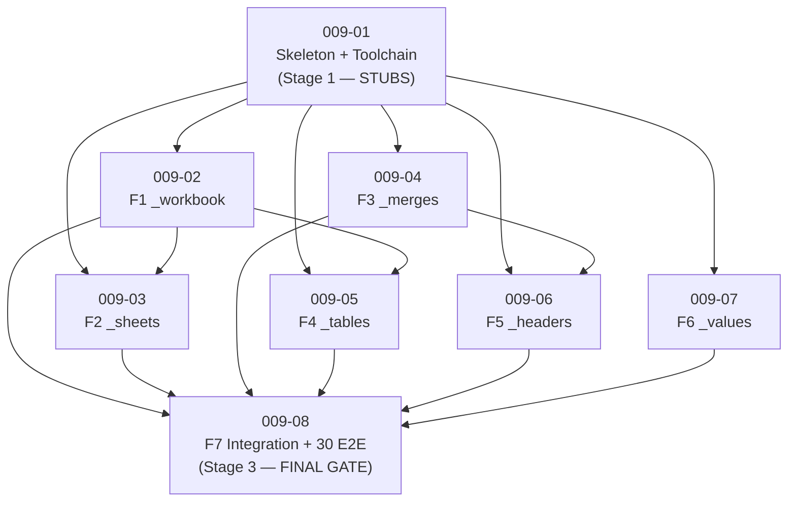

# Development Plan: Task 009 — `xlsx-10.A` `xlsx_read/` library

> **Mode:** VDD (Verification-Driven Development) + Stub-First.
> **Status:** ✅ **MERGED 2026-05-12** (all 8 sub-tasks complete +
> vdd-multi 3-iteration adversarial cycle). 178 xlsx_read tests +
> 511 existing-xlsx tests green; ruff clean; validate_skill exit 0;
> 12-line cross-skill `diff -q` silent. Post-merge adaptations
> captured in [ARCHITECTURE.md §13](ARCHITECTURE.md).
> **TASK:** [TASK.md](TASK.md) (Task 009, slug `xlsx-read-library`).
> **Architecture:** [ARCHITECTURE.md](ARCHITECTURE.md) (xlsx-10.A).
> **Prior plan archived:** [plans/plan-008-docx-replace-relocators.md](plans/plan-008-docx-replace-relocators.md).
> **Atomic-chain hint (architect handoff):** [ARCHITECTURE.md §11](ARCHITECTURE.md).

## 0. Strategy Summary

- **Phase 1 (Structure & Stubs)** — single bootstrap task `009-01`:
  package skeleton, toolchain (`pyproject.toml` + `ruff` +
  `install.sh` + `requirements.txt`), all 7 module files as
  importable stubs (`raise NotImplementedError` / `return None` /
  hardcoded sentinels), all public dataclasses + enums + typed
  exceptions **fully defined** (the contract is final), `__all__`
  locked, `tests/` skeleton with one E2E stub asserting the
  hardcoded sentinel behaviour, `SKILL.md §10` known-duplication
  marker, `.AGENTS.md §xlsx_read` section.
- **Phase 2 (Logic Implementation)** — 6 module-scoped logic
  tasks (`009-02 … 009-07`) each replacing one private module's
  stubs with real behaviour, adding the unit-test coverage for that
  module, and **updating** the running E2E to assert real values
  per `tdd-stub-first §2`.
- **Stage 3 (Integration + final gates)** — task `009-08`:
  `WorkbookReader.read_table` glue pulling F3+F5+F6 together,
  context-manager protocol, 30 E2E scenarios from TASK §5.5,
  closed-API regression test, `validate_skill.py` exit 0, 12-line
  `diff -q` silent gate.

> **Atomicity check:** each task target = single F-region (one
> module + its tests) — within the 2–4 hour budget per planner
> prompt §1. All tasks include explicit Stub-First gates per
> `tdd-stub-first §2`.

---

## 1. Task Execution Sequence

### Stage 1 — Structure, Stubs, Toolchain

- **Task 009-01** [STUB CREATION] — Package skeleton, toolchain,
  module stubs, public surface contract, first stub E2E test.
  - RTM: [R1], [R2], [R6] (signature only), [R10], [R11], [R12]
  - Use Cases: UC-06 (closed-API enforcement); scaffolds UC-01..UC-05.
  - Description File: [tasks/task-009-01-pkg-skeleton-and-toolchain.md](tasks/task-009-01-pkg-skeleton-and-toolchain.md)
  - Priority: Critical (blocks every later task).
  - Dependencies: none.

### Stage 2 — Logic Implementation (per F-region, in dependency order)

- **Task 009-02** [LOGIC IMPLEMENTATION] — `_workbook.py` (F1) —
  `open_workbook`, encryption probe (cross-3), macro probe
  (cross-4), `read_only` heuristic, `EncryptedWorkbookError`
  + `MacroEnabledWarning` wiring, **M8 spike** (empirical
  openpyxl-overlapping-merge behaviour test).
  - RTM: [R3]
  - Use Cases: UC-01.
  - Description File: [tasks/task-009-02-workbook-open-encrypt-macro.md](tasks/task-009-02-workbook-open-encrypt-macro.md)
  - Priority: Critical.
  - Dependencies: 009-01.

- **Task 009-03** [LOGIC IMPLEMENTATION] — `_sheets.py` (F2) —
  enumerate, resolve, `SheetInfo` population, `SheetNotFound`.
  - RTM: [R4]
  - Use Cases: UC-02.
  - Description File: [tasks/task-009-03-sheets-enumerate-resolve.md](tasks/task-009-03-sheets-enumerate-resolve.md)
  - Priority: Critical.
  - Dependencies: 009-01, 009-02.

- **Task 009-04** [LOGIC IMPLEMENTATION] — `_merges.py` (F3) —
  parse `<mergeCells>`, 3 policies (anchor-only / fill / blank),
  `OverlappingMerges` fail-loud detector (M8 fix).
  - RTM: [R9]
  - Use Cases: UC-04 main + A7 (overlapping).
  - Description File: [tasks/task-009-04-merges-policy-overlap.md](tasks/task-009-04-merges-policy-overlap.md)
  - Priority: High.
  - Dependencies: 009-01, 009-02.

- **Task 009-05** [LOGIC IMPLEMENTATION] — `_tables.py` (F4) —
  3-tier detector (ListObjects + sheet-scope named-ranges + gap-
  detect), safe lxml parser for `xl/tables/tableN.xml`.
  - RTM: [R5]
  - Use Cases: UC-03 (all alternatives).
  - Description File: [tasks/task-009-05-tables-3tier-detect.md](tasks/task-009-05-tables-3tier-detect.md)
  - Priority: High.
  - Dependencies: 009-01, 009-02, 009-03.

- **Task 009-06** [LOGIC IMPLEMENTATION] — `_headers.py` (F5) —
  multi-row detect, ` › ` flatten, synthetic `col_1..col_N`,
  `AmbiguousHeaderBoundary` warning.
  - RTM: [R7]
  - Use Cases: UC-04 (main, A1, A2, A8).
  - Description File: [tasks/task-009-06-headers-multi-row-flatten.md](tasks/task-009-06-headers-multi-row-flatten.md)
  - Priority: High.
  - Dependencies: 009-01, 009-04.

- **Task 009-07** [LOGIC IMPLEMENTATION] — `_values.py` (F6) —
  number-format heuristic, datetime conversion, hyperlink, rich-
  text concat, stale-cache detection.
  - RTM: [R8]
  - Use Cases: UC-04 (A3–A6).
  - Description File: [tasks/task-009-07-values-extract-format.md](tasks/task-009-07-values-extract-format.md)
  - Priority: High.
  - Dependencies: 009-01.

### Stage 3 — Integration, E2E, Final Gates

- **Task 009-08** [LOGIC IMPLEMENTATION + DOCS] — `__init__.py`
  (F7) wiring: bind `WorkbookReader.read_table` to F3+F5+F6,
  context-manager (`__enter__`/`__exit__`), full 30-scenario E2E
  suite (TASK §5.5), closed-API regression test, `SKILL.md §10`
  finalisation, `validate_skill.py` exit 0, 12-line `diff -q`
  silent gate.
  - RTM: [R1] (closure), [R6] (wiring), [R12] (closure), [R13]
  - Use Cases: UC-01..UC-06 (full integration).
  - Description File: [tasks/task-009-08-public-api-e2e-and-docs.md](tasks/task-009-08-public-api-e2e-and-docs.md)
  - Priority: Critical (final gate).
  - Dependencies: 009-02 … 009-07.

---

## 2. RTM ↔ Plan Coverage (mandatory traceability)

| RTM ID | Requirement (TASK §2) | Task(s) | Stage |
| --- | --- | --- | --- |
| **[R1]** Public API surface (closed, openpyxl-types never leak) | 009-01 (contract), 009-08 (closure) | 1 + 3 |
| **[R2]** Package layout + ruff banned-api + toolchain bring-up | 009-01 | 1 |
| **[R3]** `open_workbook` + cross-3 + cross-4 + read-only heuristic | 009-02 | 2 |
| **[R4]** `sheets()` + `SheetInfo` + resolver + `SheetNotFound` | 009-03 | 2 |
| **[R5]** `detect_tables()` 3-tier + named-range + gap-detect | 009-05 | 2 |
| **[R6]** `read_table()` dispatch + opts | 009-01 (signature), 009-08 (wiring) | 1 + 3 |
| **[R7]** Multi-row header detection + flatten + synthetic + ambiguous | 009-06 | 2 |
| **[R8]** Cell value extraction (num-format, datetime, hyperlink, rich-text, stale-cache) | 009-07 | 2 |
| **[R9]** Merge resolution + 3 policies + overlapping fail-loud | 009-04 | 2 |
| **[R10]** Typed exception contract | 009-01 (defined) | 1 |
| **[R11]** Dataclass returns (frozen outer / mutable inner) | 009-01 (defined) | 1 |
| **[R12]** Honest-scope + thread-safety doc locks | 009-01 (initial), 009-08 (closure) | 1 + 3 |
| **[R13]** Test suite (≥ 20 E2E) + validator + diff gate | 009-08 | 3 |

> **Coverage rule (planner prompt §4-Step 2):** one RTM item = one
> checklist item. Every RTM ID is named explicitly above. The two
> rows that span two stages ([R1], [R6], [R12]) are Stub-First
> artefacts: contract committed in 009-01, finalised in 009-08.
> This is **not** feature-grouping — it is the deliberate Phase-1 →
> Phase-2 split that the planner prompt mandates.

---

## 3. Use Case Coverage

| Use Case (TASK §3) | Task(s) covering it | Verification |
| --- | --- | --- |
| **UC-01** Open unencrypted workbook (+ encrypted / macro / corrupted alts) | 009-02 main; smoke-stub in 009-01 | TC-E2E-01..-04 in 009-02; TC-E2E in 009-08 |
| **UC-02** Enumerate sheets (visible + hidden + special names) | 009-03 | TC-E2E-01..-03 in 009-03; TC-E2E in 009-08 |
| **UC-03** Detect tables (3-tier fallthrough, ListObject overlap, workbook-scope ignore, mode-whole) | 009-05 | TC-E2E-01..-06 in 009-05; TC-E2E in 009-08 |
| **UC-04** Read table region (merges, multi-row headers, value extraction, all 8 alternatives A1–A8) | 009-04 (merges) + 009-06 (headers) + 009-07 (values) + 009-08 (integration) | Aggregate of all four; 30 scenarios in 009-08 |
| **UC-05** Thread-safety contract (docs + no-singleton invariant) | 009-01 (docs) + 009-08 (regression test) | Static doc-presence check 009-01; AST regression test in 009-08 |
| **UC-06** Closed-API enforcement (`ruff` banned-api) | 009-01 | Stub task's `ruff check` and `__all__` membership test |

---

## 4. Stub-First Compliance

| Component (F-region) | Phase-1 stub task | Phase-2 logic task | Stub-First gate |
| --- | --- | --- | --- |
| F1 `_workbook.py` | 009-01 | 009-02 | After 009-01: `open_workbook(p)` raises `NotImplementedError`; E2E test asserts that. After 009-02: returns real `WorkbookReader`; E2E updated to assert behaviour. |
| F2 `_sheets.py` | 009-01 | 009-03 | After 009-01: `_sheets.enumerate_sheets()` returns sentinel `[]`. After 009-03: returns real `SheetInfo` list. |
| F3 `_merges.py` | 009-01 | 009-04 | After 009-01: `parse_merges()` returns `{}`. After 009-04: real merge map + overlap detector live. |
| F4 `_tables.py` | 009-01 | 009-05 | After 009-01: `detect_tables()` returns `[]`. After 009-05: 3-tier detector live. |
| F5 `_headers.py` | 009-01 | 009-06 | After 009-01: `detect_header_band()` returns `1`. After 009-06: auto-detect live. |
| F6 `_values.py` | 009-01 | 009-07 | After 009-01: `extract_cell()` returns `cell.value` verbatim. After 009-07: number-format heuristic + datetime + hyperlink + rich-text live. |
| F7 `__init__.py` (`WorkbookReader.read_table` dispatch) | 009-01 (signature) | 009-08 (wiring) | After 009-01: returns `TableData(region, headers=[], rows=[], warnings=[])` sentinel. After 009-08: real dispatch through F3 → F5 → F6. |
| Dataclasses + enums + exceptions | 009-01 (final contract) | — | These are **CONTRACT**, not logic — defined once in 009-01 and immutable thereafter. |
| Toolchain (`pyproject.toml`, `requirements.txt`, `install.sh`) | 009-01 | — | Configuration / setup → single task per `planning-decision-tree §1`. |

---

## 5. Cross-cutting Verification Gates (every task MUST pass)

1. `cd skills/xlsx/scripts && ./.venv/bin/python -m unittest discover -s xlsx_read/tests` → exit 0.
2. `cd skills/xlsx/scripts && ./.venv/bin/ruff check .` → exit 0 (no banned-api violations).
3. `python3 .claude/skills/skill-creator/scripts/validate_skill.py skills/xlsx` → exit 0.
4. Existing xlsx skill E2E suite (xlsx-2 / xlsx-3 / xlsx-4 / xlsx-7) green — no regressions.
5. **12-line `diff -q` cross-skill silent gate** (CLAUDE.md §2 + ARCHITECTURE §9.4) all silent.

---

## 6. Dependency Diagram

> **Parallelism note for the Developer:** 009-04 + 009-07 can run
> in parallel after 009-02 (independent surfaces). 009-06 unblocks
> after 009-04. 009-05 unblocks after 009-03. 009-08 is the join.
