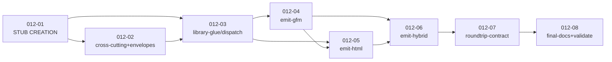

# Development Plan: Task 012 — `xlsx-9` `xlsx2md.py` read-back CLI

> **Mode:** VDD (Verification-Driven Development) + Stub-First.
> **Status:** DRAFT v1 — pending Plan-Reviewer approval.
> **TASK:** [TASK.md](TASK.md) (Task 012, slug `xlsx-9-xlsx2md`).
> **Architecture:** [ARCHITECTURE.md](ARCHITECTURE.md) (xlsx-9 — thin
> shim + `xlsx2md/` package on top of the xlsx-10.A `xlsx_read/`
> foundation).
> **Prior plan archived:** [plans/plan-011-xlsx-8a-production-hardening.md](plans/plan-011-xlsx-8a-production-hardening.md).
> **Closest stylistic precedent:** [plans/plan-010-xlsx-8-readback.md](plans/plan-010-xlsx-8-readback.md)
> (xlsx-8 read-back — shim + package pattern xlsx-9 mirrors).
> **Atomic-chain hint (architect handoff):** [ARCHITECTURE.md §11](ARCHITECTURE.md).

---

## 0. Strategy Summary

### 0.1. Chainlink Decomposition Overview

This plan is a **Chainlink** (VDD discipline): every Issue from the
TASK RTM (R1..R27 + R10a + R20a, 29 IDs) is decomposed into one or
more **Beads** (atomic sub-issues), each implementable in a single
sitting (2–4 h) and verifiable through a single test cluster. Beads
are grouped by **module-scoped tasks** (`task-012-NN-*.md`), and
each task is tagged Stub-First per `skill-tdd-stub-first §1–§2`.

The 6 inherited xlsx-8 / xlsx-8a production-hardening items
(`--header-rows smart` R14g, `HeaderRowsConflict` R14h,
`--memory-mode` R20a, `--hyperlink-scheme-allowlist` R10a,
`InternalError` terminal envelope R23f, `read_only_mode=False`
honest-scope §1.4 m) are planned explicitly — none are silently
dropped. See §3 R-Issue Coverage Matrix and §5 Honest-scope Lock
Inventory.

### 0.2. Phasing

- **Phase 1 (Structure & Stubs)** — single bootstrap task `012-01`:
  package skeleton (`xlsx2md/` with 9 modules per ARCH §3.2 C2),
  shim `xlsx2md.py` (≤ 60 LOC, body verbatim from ARCH §3.2 C1),
  `__init__.py` `__all__` lock with all 10 public symbols (frozen
  contract; including the inherited `HeaderRowsConflict` and the
  new R23f `InternalError`), every module a `pass` /
  `NotImplementedError` stub, `tests/` skeleton with ONE smoke E2E
  asserting hardcoded sentinel behaviour (Red → Green on stubs).
  Toolchain is **inherited unchanged** from xlsx-10.A
  (`pyproject.toml` / `ruff` / `install.sh` / `requirements.txt`
  are NOT touched — see TASK AC #6 and ARCH C3/C4/C5).

- **Phase 2 (Logic Implementation)** — 5 module-scoped logic tasks
  (`012-02` cross-cutting + envelopes + `convert_xlsx_to_md` helper,
  `012-03` library-glue / dispatch / memory-mode plumbing, `012-04`
  emit-gfm, `012-05` emit-html, `012-06` emit-hybrid) — each
  replacing one private module's stubs (or one cluster of stubs)
  with real behaviour and adding the unit-test cluster for that
  module; the existing E2E smoke test is **updated** to assert real
  values per `tdd-stub-first §2`.

- **Stage 3 (Integration + final gates)** — task `012-07`
  round-trip + references (write `xlsx-md-shapes.md`, flip
  `md_tables2xlsx`'s `@unittest.skipUnless(xlsx9_exists)` gate to
  live, lock cell-content byte-identity), then task `012-08` final
  docs + validation (`SKILL.md` registry row, `.AGENTS.md`
  `## xlsx2md` section, module docstrings for honest-scope §1.4
  items, `KNOWN_ISSUES.md` `XLSX-10B-DEFER` entry per TASK AC #15,
  the 34 test slugs from TASK §5.1 fully bound, `validate_skill.py`
  exit 0, 5-line `diff -q` silent gate, full xlsx suite green).

> **Atomicity check:** each task targets a single F-region (one or
> two modules + their tests) — within the 2–4 h budget per
> `planning-decision-tree` and planner prompt §1. All tasks
> include explicit Stub-First gates per `tdd-stub-first §2`.

### 0.3. Cross-skill replication gate

**This task does NOT replicate anywhere** — `xlsx2md/`,
`xlsx2md.py`, `xlsx-md-shapes.md` are all xlsx-specific (consume
`xlsx_read/` which is xlsx-only). The 5-line `diff -q` silent gate
(CLAUDE.md §2; TASK §0; ARCH §9.1) MUST stay silent every task —
the gating shell snippet appears in every task file under
"Acceptance Criteria":

```bash
diff -qr skills/docx/scripts/office skills/xlsx/scripts/office
diff -q  skills/docx/scripts/_soffice.py      skills/xlsx/scripts/_soffice.py
diff -q  skills/docx/scripts/_errors.py       skills/xlsx/scripts/_errors.py
diff -q  skills/docx/scripts/preview.py       skills/xlsx/scripts/preview.py
diff -q  skills/docx/scripts/office_passwd.py skills/xlsx/scripts/office_passwd.py
```

All five must produce no output.

### 0.4. Defaults locked from inheritance (no blocking questions)

The user has explicitly said "no clarifying questions". The
following inherited / defaulted decisions are recorded here in case
the Plan-Reviewer would have asked:

- **Terminal envelope `InternalError` CODE = 7.** The xlsx-8
  precedent in `xlsx2csv2json/cli.py` uses `code=1` with a
  redacted message but no dedicated exception class. xlsx-9 ARCH
  §2.1 F8 + R23f explicitly upgrades this to a real
  `InternalError(_AppError)` with `CODE = 7` (parity with the
  `_AppError` register). The plan locks in CODE 7.

- **Output-parent auto-create.** ARCH §2.1 F1 lists
  "output-parent auto-create" inside `_resolve_paths` (csv2xlsx
  parity, R4d). Same-path guard precedes auto-create.

- **`--no-split` H3 heading.** Q-A1 in ARCH §12 explicitly
  resolves to "emit `### Table-1`" even in `--no-split` mode. UC-03
  A2 in TASK §3 says "no H3 heading emitted"; ARCH supersedes
  (ARCH was specified AFTER TASK §3 was drafted; ARCH §2.1 F3
  carries the closed-Q decision). The plan uses ARCH's wording.

- **`InconsistentHeaderDepth` CODE = 2.** Defensive D-A11 check.
  Added to the frozen `__all__` though it never fires in normal
  workbooks (`xlsx_read.flatten_headers` already enforces uniform
  depth per its docstring).

---

## 1. Task Execution Sequence

### Stage 1 — Structure, Stubs, Test Scaffolding

- **Task 012-01** [STUB CREATION] — Package + shim skeleton,
  exceptions catalogue with `HeaderRowsConflict` + `InternalError`,
  `__all__` lock, smoke E2E asserting hardcoded sentinels.
  - RTM: [R1] (shim ≤ 60 LOC), [R2] (package + 9 modules),
    [R3] (import hygiene + ruff banned-api), exception catalogue
    declared (used by R10, R13, R14h, R21, R23, R23f, R24);
    [R10a] flag DECLARED in argparse (logic in 012-04/05),
    [R14g/h] flag DECLARED (validation in 012-02),
    [R20a] flag DECLARED (mapping in 012-03).
  - Use Cases: scaffolds UC-01..UC-12 (all stubs return sentinels);
    establishes UC-08 / UC-09 envelope plumbing skeleton.
  - Description File: [tasks/task-012-01-pkg-skeleton.md](tasks/task-012-01-pkg-skeleton.md)
  - Priority: Critical (blocks every later task).
  - Dependencies: none.
  - Estimated time: 2-3 h.

### Stage 2 — Logic Implementation (cross-cutting → library glue → emit)

- **Task 012-02** [LOGIC IMPLEMENTATION] — Cross-cutting envelopes,
  `_validate_flag_combo` (M7 + R14h + R15-D14 gates),
  `_resolve_paths` with same-path guard + output-parent auto-create,
  terminal `InternalError` catch-all, `convert_xlsx_to_md`
  programmatic helper in `__init__.py` with `--flag=value`
  atomic-token form.
  - RTM: [R4] (input/output positional args + parent-auto-create
    + cross-7 H1), [R6] (defaults wired in argparse — the
    no-flag-omitted shape pin lives in 012-08 regression cluster),
    [R13] (M7 lock `IncludeFormulasRequiresHTML`),
    [R14h] (`HeaderRowsConflict` early-exit gate),
    [R21] (encrypted → exit 3 envelope), [R22] (macro → exit 0 +
    warning), [R23] (cross-5 `--json-errors` envelope shape v1),
    [R23f] (terminal `InternalError` code 7 envelope, raw-message
    redacted), [R24] (cross-7 H1 same-path guard).
  - Use Cases: UC-08 (same-path guard), UC-09 (encrypted),
    UC-10 (macro), UC-07 Scenario A (M7 lock).
  - Description File: [tasks/task-012-02-cross-cutting-envelopes.md](tasks/task-012-02-cross-cutting-envelopes.md)
  - Priority: Critical (every later task depends on the envelope
    plumbing).
  - Dependencies: 012-01.
  - Estimated time: 3-4 h.

- **Task 012-03** [LOGIC IMPLEMENTATION] — `dispatch.py` reader-glue:
  `iter_table_payloads`, `_resolve_read_only_mode` (R20a /
  `--memory-mode` → `xlsx_read.open_workbook(read_only_mode=...)`),
  sheet enumeration + filter (`--sheet`, `--include-hidden`),
  `_detect_mode_for_args` (D-A2 post-call filter for
  `--no-table-autodetect` and `--no-split`), `_gap_fallback_if_empty`
  (R8.f info-warning path), `--header-rows {N, "auto", "smart"}`
  pass-through to `reader.read_table`.
  - RTM: [R5] (sheet selector + `--include-hidden`), [R8]
    (3-tier detection + `--no-table-autodetect` post-call filter +
    `--no-split`), [R8.f] (gap-fallback info warning),
    [R9] (`--gap-rows`/`--gap-cols`), [R14a/b/f] (header-rows
    pass-through; emit-side flatten lives in 012-04/05),
    [R14g] (`--header-rows smart` pass-through to library),
    [R17] (datetime-format pass-through), [R19]
    (`--datetime-format` enum), [R20] (number-format heuristic
    delegated to library; regression in 012-08),
    [R20a] (`--memory-mode` → `read_only_mode` mapping).
  - Use Cases: UC-02 (multi-sheet H2 order), UC-03 (multi-table
    detection), UC-11 (synthetic headers feed reaches emit), UC-05
    (multi-row header library call).
  - Description File: [tasks/task-012-03-library-glue.md](tasks/task-012-03-library-glue.md)
  - Priority: High.
  - Dependencies: 012-01, 012-02.
  - Estimated time: 3-4 h.

- **Task 012-04** [LOGIC IMPLEMENTATION] — `emit_gfm.py` + `inline.py`:
  pure GFM table serialisation (header / separator / body rows),
  `_format_cell_gfm` (pipe `\|` escape, `\n` → `<br>`, hyperlink
  branch with scheme-allowlist filter), `_render_hyperlink`
  (D-A15 / R10a `allowed_schemes` core), synthetic-header GFM
  emission (D13 GFM half), multi-row ` › ` flatten + warning,
  `_apply_gfm_merge_policy` (duplicate / blank).
  - RTM: [R10] (pure GFM emission + pipe escape + `<br>` +
    hyperlink + `GfmMergesRequirePolicy` raise-site),
    [R10a] (URL scheme allowlist GFM half + emit-side filter
    integration; CLI flag was declared in 012-01, default value
    parsed and propagated here), [R14d] (multi-row ` › ` flatten
    GFM), [R15] (GFM merge policy fail/duplicate/blank), [R16]
    (cell newline `<br>` + pipe escape + hyperlink GFM emit).
  - Use Cases: UC-01 (GFM happy path), UC-04 main-gfm
    (`GfmMergesRequirePolicy`), UC-04 A1/A2 (GFM merge policies),
    UC-05 GFM half (` › ` flatten), UC-06 GFM half (`[text](url)`),
    UC-11 GFM half (synthetic visible header row + separator),
    UC-12 (cell-newline `<br>`).
  - Description File: [tasks/task-012-04-emit-gfm.md](tasks/task-012-04-emit-gfm.md)
  - Priority: High.
  - Dependencies: 012-02, 012-03.
  - Estimated time: 3-4 h.

- **Task 012-05** [LOGIC IMPLEMENTATION] — `emit_html.py` +
  `headers.py`: HTML `<table>` serialisation (`<thead>` + `<tbody>`,
  `colspan`/`rowspan` at anchors, child-cell suppression,
  `data-formula` attr + `class="stale-cache"`, `<a href>`
  hyperlinks with allowlist filter via `inline._render_hyperlink`,
  `html.escape` for text + attrs); multi-row `<thead>`
  reconstruction by splitting ` › ` separators (D-A11 algorithm:
  `split_headers_to_rows`, `compute_colspan_spans`,
  `validate_header_depth_uniformity` raises
  `InconsistentHeaderDepth`).
  - RTM: [R10a] (URL scheme allowlist HTML half — the `<a href>`
    branch routes through the same `_render_hyperlink` written in
    012-04; this task verifies the HTML path), [R11] (HTML
    `<table>` + colspan/rowspan + child suppression + hyperlink
    `<a href>` + `data-formula` attr + pipe `&#124;` + `<br>`),
    [R14c] (multi-row `<thead>` reconstruction), [R18]
    (`data-formula` + `class="stale-cache"`).
  - Use Cases: UC-04 (HTML colspan), UC-05 (HTML multi-row
    `<thead>` with `colspan` reconstruction), UC-06 HTML half
    (`<a href>`), UC-07 Scenario B/C (`data-formula`),
    UC-11 HTML half (synthetic `<thead>` D13).
  - Description File: [tasks/task-012-05-emit-html.md](tasks/task-012-05-emit-html.md)
  - Priority: High.
  - Dependencies: 012-02, 012-03, 012-04 (`inline.py` shared).
  - Estimated time: 3-4 h.

- **Task 012-06** [LOGIC IMPLEMENTATION] — `emit_hybrid.py`
  (TASK R2.e mandatory): `select_format` with the four promotion
  rules (merges; multi-row; formula-bearing; `headerRowCount=0`),
  `emit_workbook_md` H2/H3 orchestration loop (per-sheet
  `## SheetName`, per-table `### TableName` / `### Table-N`),
  predicates `_has_body_merges`, `_is_multi_row_header`,
  `_has_formula_cells`, `_is_synthetic_header`. Raise-site for
  `GfmMergesRequirePolicy` (fail-mode lock) lives here for the
  `--format gfm` path; `_apply_gfm_merge_policy` (duplicate/blank)
  is consumed.
  - RTM: [R7] (multi-sheet H2 with document order from
    `WorkbookReader.sheets()`), [R12] (hybrid auto-select; four
    promotion rules; per-table format), [R15] (raise-site for
    `--format gfm` + body merges + default policy → exit 2).
  - Use Cases: UC-02 (multi-sheet H2), UC-03 (multi-table H3),
    UC-04 (hybrid promotion on merge), UC-05 (hybrid promotion on
    multi-row header), UC-07 Scenario C (hybrid promotion on
    formulas), UC-11 (hybrid promotion on synthetic headers).
  - Description File: [tasks/task-012-06-emit-hybrid.md](tasks/task-012-06-emit-hybrid.md)
  - Priority: High.
  - Dependencies: 012-04, 012-05.
  - Estimated time: 3-4 h.

### Stage 3 — Integration, Round-Trip, Final Gates

- **Task 012-07** [INTEGRATION] — Round-trip contract +
  references: write `skills/xlsx/references/xlsx-md-shapes.md`
  (mirrors `json-shapes.md` H2-per-sheet shape + GFM/HTML/hybrid
  shapes + inline contract + sheet-name asymmetry D9 + round-trip
  limitations + live round-trip activation); flip
  `TestRoundTripXlsx9::test_live_roundtrip_xlsx_md`
  `@unittest.skipUnless(xlsx9_exists, ...)` gate to live in
  `md_tables2xlsx/tests/`; add live cell-content byte-identity
  round-trip E2E using one multi-cell fixture.
  - RTM: [R25] (`xlsx-md-shapes.md` document), [R26] (xlsx-3
    live round-trip activation; cell-content byte-identity, NOT
    sheet-name byte-identity per D9 lock).
  - Use Cases: UC-12 (cell-newline `<br>` round-trip).
  - Description File: [tasks/task-012-07-round-trip-contract.md](tasks/task-012-07-round-trip-contract.md)
  - Priority: High.
  - Dependencies: 012-06.
  - Estimated time: 2-3 h.

- **Task 012-08** [INTEGRATION] — Final docs + validation:
  `SKILL.md` registry row + §10 honest-scope note;
  `.AGENTS.md` `## xlsx2md` section; module docstrings for the
  14 honest-scope §1.4 (a)..(m) + R3-H1 items distributed per
  module; the 34 test slugs from TASK §5.1 fully bound (new ones
  in this task: #19 `T-gap-detect-default-no-split-on-1-row`,
  #20 `T-gap-detect-splits-on-2-empty-rows`, #22
  `T-json-errors-envelope-shape-v1` global lock, #25
  `T-no-autodetect-empty-fallback-whole-sheet`, plus the 9
  inherited-hardening regressions #26-34); `KNOWN_ISSUES.md`
  `XLSX-10B-DEFER` entry (TASK AC #15);
  `python3 .claude/skills/skill-creator/scripts/validate_skill.py
  skills/xlsx` exit 0; `ruff check scripts/` green; 5-line
  `diff -q` silent gate verified; full xlsx skill test suite
  green (no-behaviour-change for existing xlsx-* paths).
  - RTM: [R6h] (no-flag output-shape pin regression),
    [R20] (number-format heuristic regression), [R27] (≥ 14 E2E
    scenarios live + unit ≥ 8/module; validate_skill exit 0);
    final lock for all honest-scope §1.4 (a)..(m) + R3-H1.
  - Use Cases: locks all UCs via the final E2E gate.
  - Description File: [tasks/task-012-08-final-docs-and-validation.md](tasks/task-012-08-final-docs-and-validation.md)
  - Priority: Critical (release gate).
  - Dependencies: 012-07.
  - Estimated time: 2-3 h.

---

## 2. Use Case Coverage Matrix

| Use Case | Tasks |
| --- | --- |
| UC-01 (single sheet GFM, default flags) | 012-01 (smoke), 012-03 (reader-glue), 012-04 (GFM emit), 012-06 (hybrid pick-gfm), 012-08 (E2E #1) |
| UC-02 (multi-sheet H2 ordering, hidden skip) | 012-03 (sheet filter + `--include-hidden`), 012-06 (H2 loop), 012-08 (E2E #3-#6) |
| UC-03 (multi-table ListObjects H3) | 012-03 (`--no-table-autodetect` post-call filter; `--no-split` whole-mode), 012-06 (H3 loop), 012-08 (E2E #7, #25) |
| UC-04 (merged body → HTML / GFM policies) | 012-04 (`_apply_gfm_merge_policy`), 012-05 (`colspan`/`rowspan`), 012-06 (promotion rule 1 + raise-site), 012-08 (E2E #8, #9, #23) |
| UC-05 (multi-row header HTML / GFM ` › ` flatten) | 012-04 (GFM ` › ` flatten + warning), 012-05 (HTML `<thead>` D-A11 reconstruction), 012-06 (promotion rule 2), 012-08 (E2E #10, #11) |
| UC-06 (hyperlinks GFM / HTML) | 012-04 (GFM `[text](url)` via `inline._render_hyperlink`), 012-05 (HTML `<a href>` via same helper), 012-08 (E2E #12, #13) |
| UC-07 (`--include-formulas` interaction) | 012-02 (M7 lock `IncludeFormulasRequiresHTML`), 012-05 (`data-formula` attr), 012-06 (promotion rule 3), 012-08 (E2E #14, #15) |
| UC-08 (same-path guard) | 012-02 (`_resolve_paths` + symlink-follow + cross-extension guard), 012-08 (E2E #16) |
| UC-09 (encrypted workbook) | 012-02 (envelope code 3 + basename), 012-08 (E2E #17) |
| UC-10 (`.xlsm` macro warning) | 012-02 (`warnings.catch_warnings(record=True)` + stderr surface), 012-08 (E2E #18) |
| UC-11 (`headerRowCount=0` synthetic headers) | 012-04 (GFM synthetic visible header + separator), 012-05 (HTML synthetic `<thead>` per D13), 012-06 (promotion rule 4), 012-08 (E2E #24) |
| UC-12 (cell-newline `<br>` round-trip) | 012-04 (`<br>` in GFM cell), 012-05 (`<br>` in HTML cell), 012-07 (live xlsx-3 round-trip; E2E #21) |

---

## 3. R-Issue Coverage Matrix

> Convention: every R-Issue from TASK §2 (RTM) appears in at least
> one bead. The Plan-Reviewer asserts no orphan. Count below: 29
> distinct IDs (R1..R27 + R10a + R20a).

| R-ID | Title | Owner Bead(s) |
| --- | --- | --- |
| R1 | CLI shim `xlsx2md.py` ≤ 60 LOC | 012-01 |
| R2 | In-skill package with 9 single-responsibility modules | 012-01 (skeleton); 012-02..012-06 (per-module logic) |
| R3 | Package import hygiene + ruff banned-api | 012-01 |
| R4 | INPUT + OUTPUT positional args + parent-auto-create + cross-7 H1 | 012-02 |
| R5 | Sheet selector `--sheet NAME\|all` + `--include-hidden` + `SheetNotFound` envelope | 012-03 |
| R6 | Default flag values (backward-compat lock) | 012-01 (defaults wired in argparse); 012-08 (R6h no-flag shape pin regression) |
| R7 | Multi-sheet H2 headings (document order, hidden skip, `--sheet NAME` suppresses H2) | 012-03 (sheet filter); 012-06 (H2 loop) |
| R8 | Multi-table detection 3-tier (Tier-1 / Tier-2 / Tier-3); `--no-table-autodetect` post-call filter; `--no-split`; R8.f gap-fallback warning | 012-03 |
| R9 | Gap-detect config `--gap-rows N` / `--gap-cols N` | 012-03 (flag pass-through); 012-08 (E2E #19, #20) |
| R10 | `--format gfm` pure GFM emission (pipe escape, `<br>`, hyperlink, `GfmMergesRequirePolicy`) | 012-04 |
| R10a | `--hyperlink-scheme-allowlist` URL scheme filter | 012-01 (flag declaration); 012-04 (parser + GFM branch via `inline._render_hyperlink`); 012-05 (HTML branch via same helper) |
| R11 | `--format html` HTML `<table>` emission (colspan/rowspan, child suppression, `<a href>`, `data-formula`, pipe `&#124;`, `<br>`) | 012-05 |
| R12 | `--format hybrid` per-table auto-select (default); four promotion rules | 012-06 |
| R13 | M7 lock — `--format gfm` + `--include-formulas` → exit 2 `IncludeFormulasRequiresHTML` | 012-02 |
| R14 | Multi-row header detection + emission (a-h: `auto`/`N`/multi-row HTML/multi-row GFM ` › `, ambiguous-boundary warning, library single-call-path, `smart` heuristic, `HeaderRowsConflict`) | 012-01 (flag); 012-02 (R14h conflict gate); 012-03 (R14a/b/f/g pass-through); 012-04 (R14d GFM ` › `); 012-05 (R14c HTML `<thead>`) |
| R15 | Merged body-cell GFM policy `fail`/`duplicate`/`blank` | 012-04 (`_apply_gfm_merge_policy`); 012-06 (raise-site for `fail` + `--format gfm`) |
| R16 | Inline content (cell newline `<br>`, pipe escape, hyperlinks, empty-text link) | 012-04 (GFM half); 012-05 (HTML half) |
| R17 | Numbers, dates, formula cells (`--datetime-format`, number-format heuristic, formula-cell-cached-or-empty) | 012-03 (datetime-format pass-through); 012-04/05 (emit-side cached values); 012-08 (number-format regression) |
| R18 | `--include-formulas` → `data-formula` attr + `class="stale-cache"` | 012-05 |
| R19 | `--datetime-format ISO\|excel-serial\|raw` flag | 012-01 (flag); 012-03 (pass-through to `read_table`) |
| R20 | Number-format heuristic delegated to `xlsx_read._values.extract_cell` | 012-03 (no re-implementation; library forwards formatted strings); 012-08 (regression `#,##0.00 → "1,234.50"`) |
| R20a | `--memory-mode {auto,streaming,full}` openpyxl read-mode exposure | 012-01 (flag); 012-03 (`_resolve_read_only_mode` mapping + auto-switch hyperlink-unreliable warning) |
| R21 | Cross-3 encrypted input → exit 3 envelope with basename | 012-02 |
| R22 | Cross-4 macro-bearing input → exit 0 + stderr warning | 012-02 |
| R23 | Cross-5 `--json-errors` envelope (v=1, code ≠ 0, byte-identical to xlsx-2/3/8) | 012-02 (envelope helper + add_json_errors_argument); 012-08 (E2E #22 global shape lock) |
| R23(f) | Terminal `InternalError` code 7 envelope (raw-message redacted) | 012-01 (`InternalError` class declared); 012-02 (`try/except Exception` in `main()`); 012-08 (E2E #34 redaction regression) |
| R24 | Cross-7 H1 same-path guard `Path.resolve()` | 012-02 |
| R25 | `xlsx-md-shapes.md` round-trip contract document | 012-07 |
| R26 | xlsx-3 (`md_tables2xlsx`) live round-trip flip | 012-07 |
| R27 | Test suite gates (≥ 14 E2E + ≥ 8 unit/module + validate_skill + existing-suite green + 5-line `diff -q`) | 012-08 |

**Orphan check:** 29 R-IDs declared; 29 R-IDs covered. **No
orphans.**

---

## 4. Test-slug Coverage

> Source: TASK §5.1 (34 entries; ≥ 14 required per R27).

| # | Slug | Owner Bead |
| --- | --- | --- |
| 1 | `T-single-sheet-gfm-default` | 012-04 (defined here, locked-in 012-08 E2E cluster) |
| 2 | `T-stdout-when-output-omitted` | 012-02 (output-path resolution + stdout default) |
| 3 | `T-sheet-named-filter` | 012-06 (`--sheet NAME` suppresses H2; integration test) |
| 4 | `T-multi-sheet-h2-ordering` | 012-06 (H2 loop integration) |
| 5 | `T-hidden-sheet-skipped-default` | 012-03 (sheet filter unit-test); 012-08 (E2E) |
| 6 | `T-hidden-sheet-included-with-flag` | 012-03 (`--include-hidden` unit); 012-08 (E2E) |
| 7 | `T-multi-table-listobjects-h3` | 012-06 (H3 loop) |
| 8 | `T-merged-body-cells-html-colspan` | 012-05 |
| 9 | `T-gfm-merges-require-policy-exit2` | 012-06 (raise-site); 012-08 (E2E gate) |
| 10 | `T-multi-row-header-html-thead` | 012-05 |
| 11 | `T-multi-row-header-gfm-u203a-flatten` | 012-04 |
| 12 | `T-hyperlink-gfm-url-form` | 012-04 |
| 13 | `T-hyperlink-html-anchor-tag` | 012-05 |
| 14 | `T-include-formulas-gfm-exits2` | 012-02 (M7 raise-site) |
| 15 | `T-include-formulas-html-data-attr` | 012-05 |
| 16 | `T-same-path-via-symlink-exit6` | 012-02 |
| 17 | `T-encrypted-workbook-exit3` | 012-02 |
| 18 | `T-xlsm-macro-warning` | 012-02 |
| 19 | `T-gap-detect-default-no-split-on-1-row` | 012-03 (unit); 012-08 (E2E) |
| 20 | `T-gap-detect-splits-on-2-empty-rows` | 012-03 (unit); 012-08 (E2E) |
| 21 | `T-cell-newline-br-roundtrip` | 012-07 |
| 22 | `T-json-errors-envelope-shape-v1` | 012-02 (envelope shape unit-test); 012-08 (global E2E gate) |
| 23 | `T-gfm-merge-policy-duplicate` | 012-04 |
| 24 | `T-synthetic-headers-listobject-zero` | 012-05 (HTML `<thead>` per D13); 012-04 (GFM visible synthetic + separator); 012-06 (promotion rule 4); 012-08 (E2E gate) |
| 25 | `T-no-autodetect-empty-fallback-whole-sheet` | 012-03 (`_gap_fallback_if_empty` unit); 012-08 (E2E) |
| 26 | `T-header-rows-smart-skips-metadata-block` | 012-03 (`--header-rows smart` pass-through unit); 012-08 (E2E regression) |
| 27 | `T-header-rows-int-with-multi-table-exits-2-conflict` | 012-02 (`HeaderRowsConflict` raise-site); 012-08 (E2E gate) |
| 28 | `T-memory-mode-streaming-bounds-peak-rss` | 012-03 (`_resolve_read_only_mode` unit); 012-08 (slow E2E `@skipUnless(SLOW)`) |
| 29 | `T-memory-mode-auto-respects-library-default-100mib-threshold` | 012-03 (unit) |
| 30 | `T-hyperlink-allowlist-blocks-javascript-html` | 012-05 (HTML branch unit); 012-08 (E2E) |
| 31 | `T-hyperlink-allowlist-blocks-javascript-gfm` | 012-04 (GFM branch unit); 012-08 (E2E) |
| 32 | `T-hyperlink-allowlist-default-passes-https-mailto` | 012-04 / 012-05 (both branches unit); 012-08 (E2E) |
| 33 | `T-hyperlink-allowlist-custom-extends` | 012-04 / 012-05 (parser + custom CSV); 012-08 (E2E) |
| 34 | `T-internal-error-envelope-redacts-raw-message` | 012-02 (`try/except Exception` unit + monkey-patch); 012-08 (E2E) |

**Orphan check:** 34 slugs declared in TASK §5.1; 34 slugs bound
to at least one bead. **No orphans.**

---

## 5. Honest-scope Lock Inventory

> Source: TASK §1.4 (a)..(m) + R3-H1 — 14 items. Each must be
> locked by a docstring note AND/OR a regression test.

| Item | Subject | Lock owner | Lock mechanism |
| --- | --- | --- | --- |
| §1.4 (a) | Rich-text spans → plain-text concat | 012-08 (lib delegate) | Docstring in `xlsx2md/__init__.py` notes "delegated to `xlsx_read._values.extract_cell`"; no separate test (covered by xlsx_read's own tests). |
| §1.4 (b) | Cell styles dropped | 012-08 | `__init__.py` docstring; honest scope; no regression test (markdown has no representation). |
| §1.4 (c) | Comments dropped | 012-08 | `__init__.py` docstring; deferred to v2 sidecar pattern. |
| §1.4 (d) | Charts / images / shapes dropped | 012-08 | `__init__.py` docstring; `preview.py` canonical visual path note. |
| §1.4 (e) | Pivot tables unfold to cached values | 012-08 | `__init__.py` docstring (delegated to `xlsx_read`). |
| §1.4 (f) | Data validation dropdowns dropped | 012-08 | `__init__.py` docstring. |
| §1.4 (g) | Formula without cached value → empty / `data-formula` | 012-05 (HTML emit `class="stale-cache"`); 012-08 (regression) | `emit_html.py` docstring + unit test asserting stale-cache class; `__init__.py` docstring. |
| §1.4 (h) | Shared / array formulas → cached value only | 012-08 | `__init__.py` docstring (library forwards cached value). |
| §1.4 (i) | `headerRowCount=0` synthetic headers + D13 visible `<thead>` + hybrid auto-promote | 012-04 (GFM visible row + separator); 012-05 (HTML synthetic `<thead>` per D13); 012-06 (promotion rule 4); 012-08 (E2E #24 regression) | Emit module docstrings; UC-11 E2E. |
| §1.4 (j) | Diagonal borders / sparklines / camera objects dropped | 012-08 | `__init__.py` docstring. |
| §1.4 (k) | `smart` vs `auto` produce different shapes on metadata banners | 012-03 (smart pass-through unit); 012-08 (E2E #26 regression) | `dispatch.py` docstring + unit test + E2E. |
| §1.4 (l) | Hyperlink scheme allowlist (default `http,https,mailto`); `'*'` allows all, `""` blocks all | 012-04 (`inline._render_hyperlink` GFM); 012-05 (HTML branch); 012-08 (E2E #30-#33) | `inline.py` docstring + ≥ 4 unit tests + E2E regression cluster. |
| §1.4 (m) | Hyperlinks always-on → `read_only_mode=False` heap cost; `--memory-mode=streaming` workaround | 012-01 (`__init__.py` docstring); 012-03 (`_resolve_read_only_mode` unit); 012-08 (E2E #28, #29) | Docstring + unit + slow E2E. |
| R3-H1 | `--sanitize-sheet-names` option dropped entirely; sheet names verbatim; `History` → `History` (xlsx-9 emit) vs `History_` (xlsx-3 write-back) asymmetry is expected | 012-07 (`xlsx-md-shapes.md` §6 documents D9 lock); 012-08 (regression: `History` sheet name preserved verbatim) | Contract doc + regression. |

**Orphan check:** 14 honest-scope items; 14 with at least one
docstring lock or regression test. **No orphans.**

---

## 6. Cross-skill replication gate

Asserted in every task's Acceptance Criteria block:

```bash
diff -qr skills/docx/scripts/office skills/xlsx/scripts/office
diff -q  skills/docx/scripts/_soffice.py      skills/xlsx/scripts/_soffice.py
diff -q  skills/docx/scripts/_errors.py       skills/xlsx/scripts/_errors.py
diff -q  skills/docx/scripts/preview.py       skills/xlsx/scripts/preview.py
diff -q  skills/docx/scripts/office_passwd.py skills/xlsx/scripts/office_passwd.py
```

All five commands must produce **no output** after every bead
lands. xlsx-9 touches zero cross-replicated files, so the gate
should remain silent from start to finish.

---

## 7. Stub-First Compliance Matrix

| Stage | Task ID | Tag | Stub gate | Logic gate |
| --- | --- | --- | --- | --- |
| 1 | 012-01 | [STUB CREATION] | Smoke E2E asserts sentinel; `ruff` green; package importable | — |
| 2 | 012-02 | [LOGIC IMPLEMENTATION] | (stubs from 012-01) | Cross-cutting envelopes + `_validate_flag_combo` + `_resolve_paths` + `InternalError` catch-all live |
| 2 | 012-03 | [LOGIC IMPLEMENTATION] | (stubs from 012-01) | `dispatch.iter_table_payloads` + memory-mode mapping live |
| 2 | 012-04 | [LOGIC IMPLEMENTATION] | (stubs from 012-01) | `emit_gfm.emit_gfm_table` + `inline.*` live |
| 2 | 012-05 | [LOGIC IMPLEMENTATION] | (stubs from 012-01) | `emit_html.emit_html_table` + `headers.*` live |
| 2 | 012-06 | [LOGIC IMPLEMENTATION] | (stubs from 012-01) | `emit_hybrid.emit_workbook_md` + `select_format` live |
| 3 | 012-07 | [INTEGRATION] | (per-task stubs) | `xlsx-md-shapes.md` + live round-trip E2E |
| 3 | 012-08 | [INTEGRATION] | (per-task stubs) | Validate + 5-line `diff -q` silent + KNOWN_ISSUES.md + full suite green |

> **Per `tdd-stub-first §2`:** the smoke E2E in 012-01 asserts the
> hardcoded sentinel; each subsequent task **updates** the E2E to
> assert the new real behaviour AND adds module-scoped unit tests
> (per `skill-testing-best-practices`).

---

## 8. Risk register (planner-layer)

| Risk | Mitigation | Owner Task |
| --- | --- | --- |
| **R-1.** `xlsx_read` library API drift between xlsx-10.A merge and xlsx-9 implementation. | xlsx-10.A `__all__` is frozen; ruff banned-api enforces. 012-01 imports every symbol; CI fails-loud on any rename. | 012-01 |
| **R-2.** `md_tables2xlsx`'s `TestRoundTripXlsx9::test_live_roundtrip_xlsx_md` skipUnless predicate references a non-existent file at flip-time, so the test stays skipped silently. | 012-07 adds an explicit assertion that the test is **not** skipped after flip; CI asserts `unittest.SkipTest` is NOT raised. | 012-07 |
| **R-3.** D-A11 multi-row `<thead>` reconstruction misinterprets literal U+203A in header cells (A-A3 honest scope). | ARCH §10 A-A3 documents the accepted edge case; 012-08 adds a regression that the reconstruction result is *consistent across re-runs* (deterministic). The misinterpretation itself is the user's responsibility. | 012-05, 012-08 |
| **R-4.** `--memory-mode=streaming` on a workbook with hyperlinks: openpyxl `ReadOnlyCell.hyperlink` is None → hyperlinks silently lost. | 012-03 surfaces a `summary.warnings` entry: `"hyperlinks unreliable in streaming mode; pass --memory-mode=full or extract on a smaller workbook"`. Documented honest scope §1.4 (m). | 012-03 |
| **R-5.** `--no-table-autodetect` post-call filter (D-A2) on a dense sheet yields zero regions; the E2E might fail with "no tables" instead of falling back to whole-sheet. | 012-03 `_gap_fallback_if_empty` falls back to `mode="whole"` + info warning; 012-08 E2E #25 locks the behaviour. | 012-03 |
| **R-6.** `InternalError` redaction regression: the raw exception message contains an absolute path that leaks despite the `details={}` redaction. | 012-02 wraps the entire `main()` body in `try/except Exception`; the `error` field is hardcoded to `f"Internal error: {type(exc).__name__}"` (NEVER `str(exc)`); 012-08 E2E #34 monkey-patches `open_workbook` to raise `PermissionError("/Users/secret/file.xlsx")` and asserts `"/Users/secret"` NOT in the envelope JSON. | 012-02, 012-08 |
| **R-7.** `xlsx-md-shapes.md` drifts from emit-side reality. | 012-07 writes the doc AFTER 012-06 stabilises emit behaviour; doc cross-references emit-module docstrings; 012-08 doesn't ship until both are consistent. | 012-07 |

---

## 9. Dependencies & Execution Order



**Parallelisation hint:** 012-04 (`emit_gfm.py` + `inline.py`) and
012-05 (`emit_html.py` + `headers.py`) share `inline.py`. They can
be developed by two developers in parallel if `inline.py` is
written first (the GFM developer writes it as part of 012-04 and
the HTML developer pulls latest), or sequentially as the dependency
arrow suggests.

---

## 10. Done-Definition (release gate)

A merge of Task 012 is acceptable iff **all** the following pass
on the merge commit:

1. **Unit tests:** all per-module test files green
   (`test_cli.py`, `test_dispatch.py`, `test_emit_gfm.py`,
   `test_emit_html.py`, `test_emit_hybrid.py`, `test_inline.py`,
   `test_headers.py`, `test_exceptions.py`, `test_public_api.py`).
   Per TASK §5.2 minimum counts: cli 8, emit_gfm 10, emit_html 12,
   emit_hybrid 8, exceptions 4.
2. **34 E2E scenarios** (TASK §5.1) live in `test_e2e.py` — all
   green.
3. **`md_tables2xlsx/`'s `TestRoundTripXlsx9::test_live_roundtrip_xlsx_md`**
   is no longer `@unittest.skipUnless`-skipped AND passes.
4. **Existing xlsx-* test suites** (xlsx-2, xlsx-3, xlsx-6,
   xlsx-7, xlsx-8 / xlsx2csv2json, xlsx-10.A / xlsx_read) green —
   no-behaviour-change gate.
5. **`ruff check scripts/`** green from `skills/xlsx/scripts/`
   (xlsx-10.A toolchain inherited).
6. **`python3 .claude/skills/skill-creator/scripts/validate_skill.py
   skills/xlsx`** exits 0.
7. **5-line `diff -q`** silent gate (CLAUDE.md §2; TASK §0;
   ARCH §9.1).
8. **`skills/xlsx/references/xlsx-md-shapes.md`** exists and
   covers §1 Scope / §2 GFM shape / §3 HTML shape / §4 Hybrid /
   §5 Inline contract / §6 Sheet-name asymmetry / §7 Round-trip
   limitations / §8 Live round-trip test activation.
9. **LOC budget:** shim ≤ 60 LOC (TASK AC #1). Package per-module
   ≤ 700 LOC (TASK R2.g xlsx skill precedent).
10. **`docs/KNOWN_ISSUES.md`** has `XLSX-10B-DEFER` entry linking
    `xlsx-10.B` backlog row + 14-day deadline marker (TASK AC #15).
