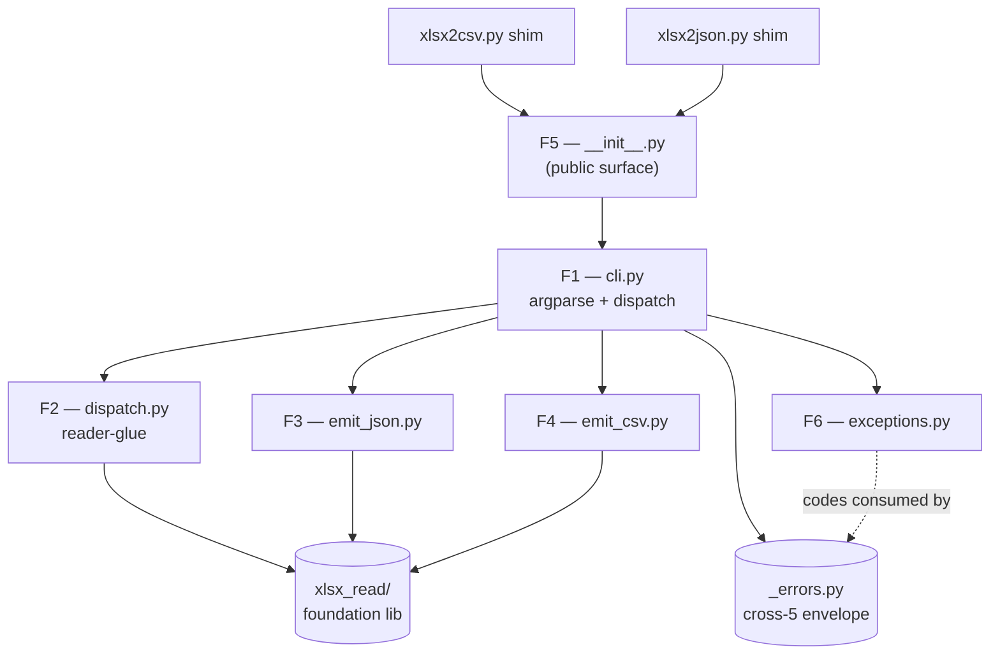
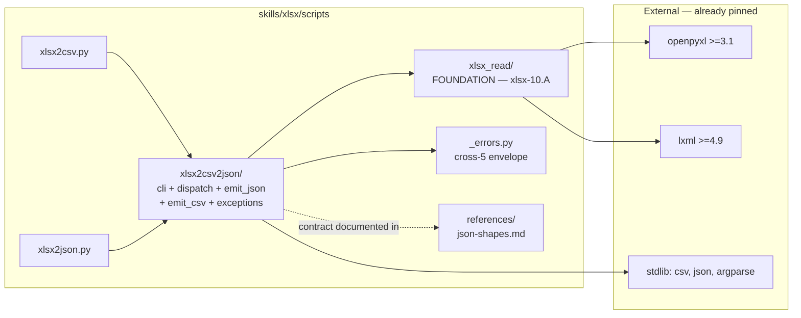
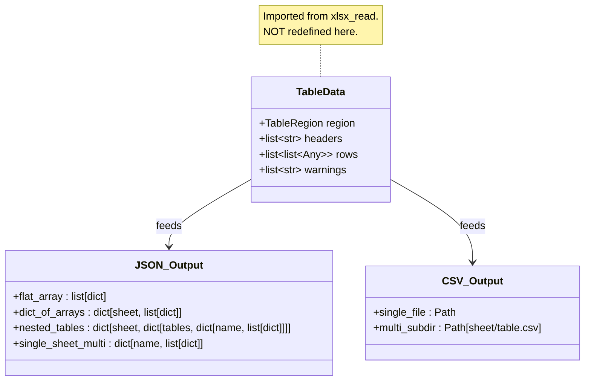

# ARCHITECTURE: xlsx-8 + xlsx-8a — `xlsx2csv.py` / `xlsx2json.py` read-back CLIs + production hardening + large-table support

> **Archived verbatim from `docs/ARCHITECTURE.md` on 2026-05-13** (commit `9702bf8`).
> This document was the active architecture for TASK 010 (xlsx-8) and
> TASK 011 (xlsx-8a). It was superseded by the xlsx-9 architecture
> (`docs/ARCHITECTURE.md`) when Task 012 was initiated.

> **Status (xlsx-8):** ✅ **IMPLEMENTED 2026-05-12** (8 atomic
> sub-tasks 010-01..010-08 + vdd-multi adversarial review with 6
> fixes — see §14 Post-merge adaptations). 841 tests green; ruff
> clean; 12-line cross-skill `diff -q` silent;
> `validate_skill.py skills/xlsx` exit 0.
>
> **Status (xlsx-8a):** 📝 **SPECIFIED 2026-05-13** (TASK 011, 8
> atomic sub-tasks 011-01..011-08 — see §15). Implementation
> pending; this document defines the contract.
> Security axis (011-01..05): 5 fixes — see §15.1–§15.9.
> Performance axis (011-06..08): 3 fixes for large-table support
> (≥ 100K × 30 cols / 3M cells) — see §15.10.
>
> Body below preserves the design-time specification verbatim;
> the post-merge implementation differs in a small number of
> documented ways — see **§14 Post-merge adaptations** for the
> xlsx-8 delta and **§15 xlsx-8a Production Hardening** for the
> additive xlsx-8a contract.
>
> Prior `docs/ARCHITECTURE.md` (xlsx-10.A `xlsx_read/`) is archived
> verbatim at
> [`docs/architectures/architecture-007-xlsx-read-library.md`](architectures/architecture-007-xlsx-read-library.md).
>
> **Template:** `architecture-format-core` with selectively extended
> §5 (Interfaces) + §6 (Tech stack) + §7 (Security) + §9 (Cross-skill
> replication boundary) — this is a **new in-skill package** (~7
> modules) added on top of an existing foundation library
> (`xlsx_read/` from xlsx-10.A). The selection mirrors the precedent
> set by xlsx-2 / xlsx-3 / xlsx-10.A.

---

## 1. Task Description

- **TASK:** [`docs/TASK.md`](TASK.md) (Task 010, slug
  `xlsx-read-back`, DRAFT v1).
- **Brief summary of requirements:** Ship two thin CLI shims
  (`xlsx2csv.py`, `xlsx2json.py`) plus a single shared package
  `skills/xlsx/scripts/xlsx2csv2json/` that converts `.xlsx`
  workbooks into CSV or JSON. All reader logic (merge resolution,
  ListObjects, gap-detect, multi-row headers, hyperlinks,
  stale-cache, encryption probe, macro probe) is **delegated** to
  the xlsx-10.A `xlsx_read/` library; shim package owns **only**
  emit-side concerns (CLI parsing, JSON/CSV serialisation,
  cross-cutting envelopes, filesystem layout).
- **Public surface:**
  - Two shims `xlsx2csv.py` (53–60 LOC) and `xlsx2json.py`
    (53–60 LOC), both re-export from `xlsx2csv2json`.
  - Package public helpers: `convert_xlsx_to_csv(...)`,
    `convert_xlsx_to_json(...)`, `main(argv)`, plus shim-level
    exception types (`SelfOverwriteRefused`,
    `MultiTableRequiresOutputDir`, `MultiSheetRequiresOutputDir`,
    `HeaderRowsConflict`, `InvalidSheetNameForFsPath`,
    `OutputPathTraversal`, `FormatLockedByShim`,
    `PostValidateFailed`).
- **Decisions inherited from TASK §7.3 (D1–D10)** are reproduced
  here so this document is self-contained:

  | D | Decision | Rationale |
  | --- | --- | --- |
  | D1 | Single shared package `xlsx2csv2json/` | Q-A1 closed — emit-format dispatch in `cli.py:main()` is ~20 LOC; two packages would duplicate the entire CLI surface and force a third shared helper module anyway. |
  | D2 | `--header-rows 1` default | R6 backward-compat lock; matches single-row-header common case. |
  | D3 | `--tables whole` default | R6 backward-compat lock; entire sheet = one region. |
  | D4 | `--header-rows auto` flatten separator = U+203A (` › `) | R7.c; matches xlsx-10.A / xlsx-9 separator; no collision with `"Q1 / Q2 split"`-style headers. |
  | D5 | Subdirectory schema `<sheet>/<table>.csv`, NOT `<sheet>__<table>.csv` | R12.c, L4 VDD-adversarial fix — sheet names may legally contain `__`. |
  | D6 | `--gap-rows 2`, `--gap-cols 1` defaults | R9.e–f, M4 fix; single-empty-row inside a table is a frequent visual separator. |
  | D7 | Hyperlink JSON shape `{"value", "href"}`; CSV `[text](url)` | R10.b–c, R3-L1 fix; never emit `=HYPERLINK()` formula syntax (R4-L2 lock). |
  | D8 | Same-path guard via `Path.resolve()` (follows symlinks) | R17.a, cross-7 H1; mirror json2xlsx. |
  | D9 | `--include-formulas` at shim level passes through to `keep_formulas=True` at `open_workbook` AND `include_formulas=True` at `read_table` in lockstep | Q-A5 closed; xlsx-10.A §13.1 dictates the two flags move together. |
  | D10 | Nested `tables` JSON shape lossy on xlsx-2 v1 consume; full restoration deferred to xlsx-2 v2 `--write-listobjects` | R13.b honest-scope; activates `TestRoundTripXlsx8` skipUnless gate. |

- **Architect-layer decisions added by this document** (locked
  here, not in TASK):

  | D | Decision | Rationale |
  | --- | --- | --- |
  | D-A1 | Package name `xlsx2csv2json/` | Q-A2 closed — explicit about the two output formats, matches both shim file names; `xlsx_readback` collides nominally with `xlsx_read` foundation. |
  | D-A2 | `--tables` enum (4-val: `whole\|listobjects\|gap\|auto`) maps to library `TableDetectMode` (3-val) **via post-call filter** for the `gap` case; library API is NOT extended | Q-A6 closed — keeps xlsx-10.A `__all__` frozen surface intact. Filter cost ≤ 4 LOC in `dispatch.py`. xlsx-10.A v2 may later expose granular modes if a third consumer needs them. |
  | D-A3 | Two separate public helpers `convert_xlsx_to_csv` + `convert_xlsx_to_json`, NOT a single `convert_xlsx_readback(format=...)` | Q-A4 closed — clearer call sites; static type-checkers don't need to narrow on a format-literal param; xlsx-2 / xlsx-3 set the precedent (`convert_json_to_xlsx`, `convert_md_tables_to_xlsx`). |
  | D-A4 | `cli.py:main()` is the single argparse surface; shims hard-bind `--format` at parse time and reject mismatch with `FormatLockedByShim` envelope (exit 2) | R2.d; prevents user confusion (`xlsx2csv.py --format json` is a category error, not a recoverable arg). |
  | D-A5 | Shim package depends on `xlsx_read` via `from xlsx_read import open_workbook, WorkbookReader, ...` only — NEVER `from xlsx_read._values import ...` (banned by xlsx-10.A `pyproject.toml`) | xlsx-10.A closed-API contract; xlsx-8 is the **first consumer** of that contract — proof of the abstraction. |
  | D-A6 | Warnings from `xlsx_read` (e.g. `MacroEnabledWarning`, `AmbiguousHeaderBoundary`) propagate to stderr via Python's default `warnings.showwarning` hook for human inspection. They are **NOT** injected into the JSON output body (would break xlsx-2 v1 round-trip — a `summary` key would be misread as a sheet/key). CSV path drops warnings by-design (no place in `csv.writer` output). Optional sidecar `<output>.warnings.json` deferred to v2 if user request. | TASK §R15.b; library is pure data-producer (xlsx-10.A D-A7), shims own user-facing surface. |
  | D-A7 | Streaming CSV emit: `csv.writer` writes row-by-row via `iter_rows`-like helper in `emit_csv.py`; JSON emit accumulates and dumps once (no streaming JSON in v1) | TASK §4.1 perf bound; JSON streaming would require `ijson`-style assembler and complicate pretty-printing; deferred. |
  | D-A8 | Output-path traversal guard: every computed `<output-dir>/<sheet>/<table>.csv` passes `path.resolve().is_relative_to(output_dir.resolve())` BEFORE open-for-write | TASK §4.2 path-traversal mitigation; without this, a sheet named `../../etc/passwd` would write outside `--output-dir`. |
  | D-A9 | `emit_json.py` uses `json.dumps(..., ensure_ascii=False, indent=2, sort_keys=False)`; `--compact` flag deferred to v2 | Indent-2 is human-readable, matches `xlsx2md` mental model; sort_keys=False preserves source sheet order. |
  | D-A10 | All shim-level exit codes are listed in `xlsx2csv2json/exceptions.py` as `_AppError` subclasses with a `CODE` class attribute consumed by `report_error`; no `sys.exit(N)` outside that helper | R16.b; uniform exit-code handling; same pattern as `json2xlsx.py`. |

---

## 2. Functional Architecture

> **Convention:** F1–F6 are functional regions. Each maps to one
> private module in the `xlsx2csv2json/` package. No region spans
> more than one module; no module owns more than one region.

### 2.1. Functional Components

#### F1 — CLI argument parsing + dispatch (`cli.py`)

**Purpose:** Single argparse surface; shim-format binding; dispatch
to `convert_xlsx_to_csv` or `convert_xlsx_to_json`.

**Functions:**
- `build_parser(*, format_lock: Literal["csv", "json", None]) ->
  argparse.ArgumentParser` — constructs the full flag surface;
  rejects `--format <other>` at parse time when `format_lock` is set.
  - Input: `format_lock` from the shim entry point.
  - Output: an `argparse.ArgumentParser` instance.
  - Related Use Cases: UC-01, UC-02, UC-09.
- `main(argv: list[str] | None = None, *, format_lock: str |
  None = None) -> int` — top-level orchestrator; returns exit code.
- `_validate_flag_combo(args) -> None` — raises envelope exceptions
  for cross-flag invariants (HeaderRowsConflict,
  MultiTableRequiresOutputDir, MultiSheetRequiresOutputDir,
  FormatLockedByShim).
- `_resolve_paths(args) -> tuple[Path, Path | None]` — canonical
  resolve of INPUT and `--output` / `--output-dir`; same-path guard;
  parent-dir auto-create.

**Dependencies:**
- Depends on: `argparse`, `pathlib`, `_errors` (cross-5 envelope
  helper).
- Depended on by: shim entry points (`xlsx2csv.py` / `xlsx2json.py`).

---

#### F2 — Reader-glue / dispatch (`dispatch.py`)

**Purpose:** Open the workbook via `xlsx_read.open_workbook`,
enumerate sheets, detect regions per `--tables` mode (with the
post-call filter for `gap`), iterate per region, hand off
`(TableData, sheet_name, region)` triples to the emitter.

**Functions:**
- `iter_table_payloads(args, reader: WorkbookReader) ->
  Iterator[tuple[str, TableRegion, TableData]]` — yields
  `(sheet_name, region, table_data)` per region (already filtered for
  `--tables gap` case).
- `_resolve_tables_mode(arg_tables: str) -> tuple[TableDetectMode,
  Callable[[TableRegion], bool]]` — returns `(library_mode,
  post_filter_predicate)`. `gap` → `("auto", lambda r:
  r.source == "gap_detect")`; `listobjects` → `("tables-only",
  lambda r: True)`; `whole` / `auto` → identity filters.
- `_validate_sheet_path_components(name: str) -> None` — raises
  `InvalidSheetNameForFsPath` if any reject-list character is
  present (used only when CSV output goes to a multi-file layout).

**Dependencies:**
- Depends on: `xlsx_read` public surface.
- Depended on by: F3, F4.

---

#### F3 — JSON emitter (`emit_json.py`)

**Purpose:** Build the JSON shape per TASK §R11 (a–e); write it to
`--output` or stdout via `json.dumps`.

**Functions:**
- `emit_json(payloads: Iterator[tuple[str, TableRegion, TableData]],
  *, output: Path | None, sheet_selector: str, tables_mode: str,
  header_flatten_style: Literal["string", "array"],
  include_hyperlinks: bool, datetime_format: DateFmt) -> int` —
  collects all payloads (single pass), builds the shape, writes the
  JSON. Returns exit code.
- `_shape_for_payloads(payloads_list, ...) -> Any` — pure function;
  given the collected list and the policy flags, builds either flat
  array-of-objects, dict-of-arrays (per sheet), nested
  `{Sheet: {tables: {Name: [...]}}}`, or single-sheet
  `{Name: [...]}`. Pure-function form is unit-testable in isolation.
- `_row_to_dict(headers: list, row: list, *, header_flatten_style,
  include_hyperlinks: bool, hyperlink_resolver: Callable) -> dict` —
  zip headers + row into a dict; applies hyperlink dict-shape rule
  when `cell.hyperlink.target` is reachable.

**Dependencies:**
- Depends on: `json` (stdlib), `xlsx_read` `TableData` /
  `TableRegion` shapes only.
- Depended on by: F1 (`cli.py:main()`).

---

#### F4 — CSV emitter (`emit_csv.py`)

**Purpose:** Write CSV per TASK §R12 (a–f); enforce subdirectory
schema; multi-region / multi-sheet output-dir orchestration; path
traversal guard.

**Functions:**
- `emit_csv(payloads: Iterator[tuple[str, TableRegion, TableData]],
  *, output: Path | None, output_dir: Path | None, sheet_selector:
  str, tables_mode: str, include_hyperlinks: bool, datetime_format:
  DateFmt) -> int` — drives single-file vs multi-file emission.
- `_emit_single_region(table_data, *, fp, include_hyperlinks)` —
  writes one region with `csv.writer(quoting=QUOTE_MINIMAL,
  lineterminator="\n")`.
- `_emit_multi_region(payloads, *, output_dir, include_hyperlinks)`
  — creates `<output-dir>/<sheet>/<table>.csv` per region;
  path-traversal guard via D-A8.
- `_format_hyperlink_csv(value, href) -> str` — `[<text>](<url>)`
  emit; never `=HYPERLINK()`.

**Dependencies:**
- Depends on: `csv` (stdlib), `xlsx_read` types only.
- Depended on by: F1.

---

#### F5 — Public-API surface + helpers (`__init__.py`)

**Purpose:** Re-export `convert_xlsx_to_csv`,
`convert_xlsx_to_json`, `main`, and all `_AppError` subclasses;
expose `__all__`; host the honest-scope catalogue (module docstring
mirrors TASK §1.4).

**Public symbols** (frozen surface):
```python
__all__ = [
    "main",
    "convert_xlsx_to_csv",
    "convert_xlsx_to_json",
    "_AppError",
    "SelfOverwriteRefused",
    "MultiTableRequiresOutputDir",
    "MultiSheetRequiresOutputDir",
    "HeaderRowsConflict",
    "InvalidSheetNameForFsPath",
    "OutputPathTraversal",
    "FormatLockedByShim",
    "PostValidateFailed",
]
```

**Functions:**
- `convert_xlsx_to_csv(input_path: Path, output_path: Path | None =
  None, **kwargs) -> int` — wraps `main()` with `format_lock="csv"`.
- `convert_xlsx_to_json(input_path: Path, output_path: Path | None =
  None, **kwargs) -> int` — wraps `main()` with `format_lock="json"`.

**Dependencies:**
- Depends on: F1, F2, F3, F4, exceptions.
- Depended on by: `xlsx2csv.py` / `xlsx2json.py` shims; future
  Python callers using the package as a library.

---

#### F6 — Exceptions catalogue (`exceptions.py`)

**Purpose:** Define all shim-level error types and their exit codes;
provide a single re-export point for envelope generation in
`_errors`.

**Functions/classes:**
- `class _AppError(RuntimeError)` — base; subclasses set `CODE: int`
  class attribute consumed by `_errors.report_error`.
- Subclasses (CODE values in parentheses):
  - `SelfOverwriteRefused (6)` — cross-7 H1 same-path guard.
  - `MultiTableRequiresOutputDir (2)` — R12.d.
  - `MultiSheetRequiresOutputDir (2)` — R12.f.
  - `HeaderRowsConflict (2)` — R7.e.
  - `InvalidSheetNameForFsPath (2)` — R12 multi-file layout.
  - `OutputPathTraversal (2)` — D-A8 path-traversal guard.
  - `FormatLockedByShim (2)` — D-A4 wrong-format-via-shim.
  - `PostValidateFailed (7)` — R20.c env-flag post-validate.

**Dependencies:** None (leaf module).

---

### 2.2. Functional Components Diagram



---

## 3. System Architecture

### 3.1. Architectural Style

**Style:** **Thin shim + in-skill Python package**, layered on top
of the xlsx-10.A `xlsx_read/` foundation. **No new system tools.**

**Justification:**
- Mirrors the proven xlsx pattern: each script-level CLI in
  `skills/xlsx/scripts/*.py` is a ≤ 60 LOC re-export shim; the body
  lives in a sibling `<name>/` package. Reference precedents: xlsx-2
  (`json2xlsx.py`, 53 LOC + `json2xlsx/` package), xlsx-3
  (`md_tables2xlsx.py`, 47 LOC + `md_tables2xlsx/` package), xlsx-7
  (`xlsx_check_rules.py`, 194 LOC + `xlsx_check_rules/` package).
- Layered Architecture (F1 ← F2 ← F3/F4 ← F6; F5 = aggregator) — each
  layer depends only on layers below; no cycles. `xlsx_read/` is the
  bottom-most external dependency.
- **Zero new deps** above what xlsx-10.A already added (`ruff`,
  `openpyxl`, `lxml` — all already pinned).
- **Single source of truth for reader logic** — every reader-related
  question (merge resolution, ListObjects, gap-detect, multi-row
  headers, hyperlinks, stale-cache) is forwarded to
  `xlsx_read.WorkbookReader`. Drift between this package and
  `xlsx_read` = bug (regression test in §5.3 enforces this).

### 3.2. System Components

#### C1 — `skills/xlsx/scripts/xlsx2csv.py` (NEW, ≤ 60 LOC)

**Type:** Shell-entry shim.

**Purpose:** Re-export from `xlsx2csv2json`; hard-bind
`format_lock="csv"`.

**File body (locked surface):**
```python
#!/usr/bin/env python3
"""xlsx-8: Convert an .xlsx workbook into CSV (per-sheet/per-table).

Thin CLI shim on top of the xlsx-10.A `xlsx_read/` foundation. Body
lives in `xlsx2csv2json/`. See `--help` for the full flag list.
"""
from __future__ import annotations

import sys
from pathlib import Path

sys.path.insert(0, str(Path(__file__).resolve().parent))

from xlsx2csv2json import (  # noqa: E402
    main,
    convert_xlsx_to_csv,
    _AppError,
    SelfOverwriteRefused,
    MultiTableRequiresOutputDir,
    MultiSheetRequiresOutputDir,
    HeaderRowsConflict,
    InvalidSheetNameForFsPath,
    OutputPathTraversal,
    FormatLockedByShim,
    PostValidateFailed,
)


if __name__ == "__main__":
    sys.exit(main(format_lock="csv"))
```

**Technologies:** Python ≥ 3.10.

**Interfaces:**
- **Inbound:** shell (`python3 xlsx2csv.py ...`).
- **Outbound:** `xlsx2csv2json.main(format_lock="csv")`.

**Dependencies:** `xlsx2csv2json/` package (sibling).

---

#### C2 — `skills/xlsx/scripts/xlsx2json.py` (NEW, ≤ 60 LOC)

**Type:** Shell-entry shim.

**Purpose:** Symmetric to C1, with `format_lock="json"`.

**File body (locked surface):**
```python
#!/usr/bin/env python3
"""xlsx-8: Convert an .xlsx workbook into JSON (array-of-objects or
nested dict-per-sheet-per-table).

Thin CLI shim on top of the xlsx-10.A `xlsx_read/` foundation. Body
lives in `xlsx2csv2json/`. See `--help` for the full flag list.
"""
from __future__ import annotations

import sys
from pathlib import Path

sys.path.insert(0, str(Path(__file__).resolve().parent))

from xlsx2csv2json import (  # noqa: E402
    main,
    convert_xlsx_to_json,
    _AppError,
    SelfOverwriteRefused,
    MultiTableRequiresOutputDir,
    MultiSheetRequiresOutputDir,
    HeaderRowsConflict,
    InvalidSheetNameForFsPath,
    OutputPathTraversal,
    FormatLockedByShim,
    PostValidateFailed,
)


if __name__ == "__main__":
    sys.exit(main(format_lock="json"))
```

The re-export list mirrors C1 verbatim except that `convert_xlsx_to_csv`
is replaced by `convert_xlsx_to_json` (single helper per shim — see
D-A3). Exception names are byte-identical across both shims; the
`xlsx2csv2json/__init__.py` `__all__` is the single source of truth.

---

#### C3 — `skills/xlsx/scripts/xlsx2csv2json/` (NEW, package, ~7 files)

**Type:** In-skill Python package.

**Purpose:** Body for both shims; emit-side only.

**Implemented functions:** F1–F6.

**File layout:**
```
skills/xlsx/scripts/xlsx2csv2json/
  __init__.py        # F5 — public surface + honest-scope docstring
  cli.py             # F1 — argparse + main() + dispatch
  dispatch.py        # F2 — reader-glue + iter_table_payloads
  emit_json.py       # F3 — JSON shape builder + writer
  emit_csv.py        # F4 — CSV writer + multi-file orchestration
  exceptions.py      # F6 — _AppError + subclasses
  tests/
    __init__.py
    conftest.py
    fixtures/        # .xlsx fixtures (≥ 25 files)
    test_cli.py
    test_dispatch.py
    test_emit_json.py
    test_emit_csv.py
    test_public_api.py
    test_e2e.py      # 30 E2E scenarios from TASK §5.5
```

**Technologies:** Python ≥ 3.10, `xlsx_read` (xlsx-10.A), `csv`
(stdlib), `json` (stdlib), `argparse` (stdlib), `pathlib` (stdlib),
`warnings` (stdlib).

**Interfaces:**
- **Inbound (Python import):** `from xlsx2csv2json import
  convert_xlsx_to_csv, convert_xlsx_to_json, main, ...` — only
  symbols in `__all__`.
- **Outbound:** `from xlsx_read import open_workbook, WorkbookReader,
  TableData, TableRegion, MergePolicy, TableDetectMode, DateFmt,
  EncryptedWorkbookError, MacroEnabledWarning, OverlappingMerges,
  AmbiguousHeaderBoundary, SheetNotFound`. `from _errors import
  report_error, add_json_errors_argument`.

**Dependencies:**
- External libs: NONE new — `xlsx_read` covers the openpyxl /
  lxml surface; `_errors` covers the envelope; stdlib covers
  json / csv / argparse.
- Other in-skill components: `xlsx_read/` (closed-API consumer —
  first proof of the abstraction).
- System components (NOT modified): `office/`, `_soffice.py`,
  `_errors.py`, `preview.py`, `office_passwd.py`. 12-line
  cross-skill `diff -q` silent gate stays silent.

---

#### C4 — `skills/xlsx/scripts/requirements.txt` (UNCHANGED)

No new dependencies. xlsx-10.A already pinned `openpyxl`, `lxml`,
`ruff`.

#### C5 — `skills/xlsx/scripts/pyproject.toml` (UNCHANGED)

`ruff` banned-api rule from xlsx-10.A continues to enforce that
external code (incl. this package) imports only `xlsx_read.<public>`,
never `xlsx_read._*`. No new rule needed.

#### C6 — `skills/xlsx/scripts/install.sh` (UNCHANGED)

`ruff check scripts/` post-hook from xlsx-10.A continues to gate
both packages.

#### C7 — `skills/xlsx/.AGENTS.md` (MODIFIED)

**Change:** add `## xlsx2csv2json` section pointing to TASK §1.4
honest scope and documenting the `--tables` / `TableDetectMode`
mapping (D-A2). Add cross-link to `xlsx_read` AGENTS section.

#### C8 — `skills/xlsx/SKILL.md` (MODIFIED)

**Change:** registry table gains rows for `xlsx2csv.py` and
`xlsx2json.py` (mirror xlsx-2 / xlsx-3 row format). §10 honest-scope
catalogue gains: *"`xlsx2csv` / `xlsx2json` v1: comments / charts /
styles / pivots dropped; see TASK 010 §1.4."*

#### C9 — `skills/xlsx/references/json-shapes.md` (MODIFIED)

**Change:** append §"xlsx-8 read-back shape" with the four output
shapes from TASK §R11 (flat / dict-of-arrays / single-sheet
multi-table / multi-sheet multi-table). Lock the `tables` key spelling
(no aliases). Update §"Round-trip with xlsx-2" to note that xlsx-2 v1
collapses `tables` on consume; full restoration deferred to xlsx-2
v2 `--write-listobjects`.

### 3.3. Components Diagram



---

## 4. Data Model (Conceptual)

> **Note:** This task introduces NO new dataclasses. Everything
> consumed (`SheetInfo`, `TableRegion`, `TableData`, `MergePolicy`,
> `TableDetectMode`, `DateFmt`) is **imported** from `xlsx_read/` and
> used as-is. The only new "data" is the **JSON shape produced by
> `emit_json`** — a derived format, not a Python entity.

### 4.1. Derived shape — JSON output (frozen contract)

**Description:** Result of `emit_json` materialised through
`json.dumps`.

**Shape rules (per TASK §R11):**

1. **Single sheet, single region:** flat array-of-objects.
   ```json
   [{"col_a": "val", "col_b": 42}, ...]
   ```
2. **Multi-sheet, single region per sheet:** dict-of-arrays.
   ```json
   {"Sheet1": [{...}], "Sheet2": [{...}]}
   ```
3. **Multi-sheet, multi-region per sheet:** nested
   `{Sheet: {tables: {Name: [...]}}}`.
   ```json
   {"Sheet1": {"tables": {"RevenueTable": [...], "CostsTable": [...]}},
    "Sheet2": [{...}]}
   ```
   Note: shape varies per sheet — a sheet with a single region uses
   the flat form (rule 2); a sheet with multiple regions wraps with
   `tables` key (rule 3). Mixed-shape per sheet IS the contract; the
   `tables` key is the discriminator.
4. **Single sheet, multi-region:** `{Name: [...]}` (no enclosing
   sheet key; backward-compat-style flat).
5. **Hyperlink cells (when `--include-hyperlinks`):**
   `{"value": "<text>", "href": "<url>"}` replaces the raw value.

**Frozen invariants:**
- The `tables` key string is spelled verbatim `"tables"` (lowercase,
  ASCII). No aliases.
- Hyperlink keys are spelled verbatim `"value"` and `"href"`.
- Sheet names are JSON-escaped per `json.dumps(..., ensure_ascii=
  False)` defaults — non-ASCII preserved as UTF-8 byte sequences;
  `\"` and `\\` escaped per RFC 8259.
- Region order is document-order (deterministic across re-reads).

**Round-trip with xlsx-2:**
- Shapes 1 and 2 are losslessly consumable by `convert_json_to_xlsx`
  (xlsx-2 v1).
- Shapes 3 and 4 are **lossy** on xlsx-2 v1 consume — the `tables`
  nesting is collapsed and the per-table arrays are concatenated
  under the sheet key (or first region wins; xlsx-2 implementer
  picks per data parity). Full reverse-restore deferred to xlsx-2 v2
  `--write-listobjects` flag (D10).

### 4.2. Derived shape — CSV output

**Description:** RFC-4180-ish CSV via `csv.writer(quoting=
QUOTE_MINIMAL, lineterminator="\n")`.

**Shape rules (per TASK §R12):**

1. **Single region → single file or stdout.**
2. **Multi-region → directory layout:** `<output-dir>/<sheet>/<table>.csv`.
3. **Hyperlink cells (when `--include-hyperlinks`):** `[<text>](<url>)`
   markdown-link-as-text (NEVER `=HYPERLINK()`).

**Path-component invariants (D-A8 + TASK §4.2):**
- `<sheet>` and `<table>` MUST NOT contain `/`, `\\`, `..`, NUL,
  `:`, `*`, `?`, `<`, `>`, `|`, `"`. Violation → exit 2
  `InvalidSheetNameForFsPath`.
- Final write-path MUST resolve under `<output-dir>` (canonical
  parent inclusion). Violation → exit 2 `OutputPathTraversal`.

### 4.3. Schema diagram



---

## 5. Interfaces

### 5.1. External (CLI)

**`xlsx2csv.py` / `xlsx2json.py` arguments (locked surface):**

| Flag | Default | Notes |
| --- | --- | --- |
| `INPUT` (positional) | required | Path to `.xlsx`/`.xlsm`. |
| `--output OUT` / `OUT` (positional) | stdout | Path or `-` for stdout-explicit. |
| `--output-dir DIR` | None | Multi-file CSV layout. |
| `--sheet NAME\|all` | `all` | Sheet selector. |
| `--include-hidden` | off | Include hidden + veryHidden sheets. |
| `--header-rows N\|auto` | `1` | Multi-row header policy. |
| `--header-flatten-style string\|array` | `string` | JSON only. |
| `--merge-policy anchor-only\|fill\|blank` | `anchor-only` | Body merge handling. |
| `--tables whole\|listobjects\|gap\|auto` | `whole` | Region detection. |
| `--gap-rows N` | `2` | Gap-detect threshold (M4 fix). |
| `--gap-cols N` | `1` | Gap-detect threshold (M4 fix). |
| `--include-hyperlinks` | off | Emit hyperlink shape. |
| `--include-formulas` | off | Cached value vs formula string. |
| `--datetime-format ISO\|excel-serial\|raw` | `ISO` | Datetime rendering. |
| `--json-errors` | off | Cross-5 envelope on stderr. |

`xlsx2csv.py` does NOT expose `--format`; `xlsx2json.py` does NOT
expose `--format`. Both hard-bind via `format_lock` (D-A4).

### 5.2. Internal (Python import — for library consumers)

```python
from xlsx2csv2json import (
    main,                            # entry point (CLI surface)
    convert_xlsx_to_csv,             # public helper — CSV
    convert_xlsx_to_json,            # public helper — JSON
    _AppError,                       # exception base
    SelfOverwriteRefused,
    MultiTableRequiresOutputDir,
    MultiSheetRequiresOutputDir,
    HeaderRowsConflict,
    InvalidSheetNameForFsPath,
    OutputPathTraversal,
    FormatLockedByShim,
    PostValidateFailed,
)

# Public helper signature:
def convert_xlsx_to_csv(
    input_path: Path,
    output_path: Path | None = None,
    *,
    output_dir: Path | None = None,
    sheet: str = "all",
    include_hidden: bool = False,
    header_rows: int | Literal["auto"] = 1,
    merge_policy: str = "anchor-only",
    tables: str = "whole",
    gap_rows: int = 2,
    gap_cols: int = 1,
    include_hyperlinks: bool = False,
    include_formulas: bool = False,
    datetime_format: str = "ISO",
    json_errors: bool = False,
) -> int: ...

def convert_xlsx_to_json(
    input_path: Path,
    output_path: Path | None = None,
    *,
    sheet: str = "all",
    include_hidden: bool = False,
    header_rows: int | Literal["auto"] = 1,
    header_flatten_style: Literal["string", "array"] = "string",
    merge_policy: str = "anchor-only",
    tables: str = "whole",
    gap_rows: int = 2,
    gap_cols: int = 1,
    include_hyperlinks: bool = False,
    include_formulas: bool = False,
    datetime_format: str = "ISO",
    json_errors: bool = False,
) -> int: ...
```

### 5.3. Library boundary contract (D-A5 + D-A6)

- The package imports **only** from `xlsx_read.<public>`. Any
  `from xlsx_read._*` import is BANNED by xlsx-10.A `pyproject.toml`
  ruff rule; CI fails-loud if attempted.
- `warnings.catch_warnings(record=True)` is the only legal capture
  point for `MacroEnabledWarning` and `AmbiguousHeaderBoundary`.
- `_errors.report_error` is the only legal stderr-emit + exit-code
  path (D-A10).
- No direct `openpyxl.*` import inside the package (regression test
  greps for `openpyxl` outside the test fixture builder).

---

## 6. Technology Stack

### 6.1. Runtime

- Python ≥ 3.10 (xlsx skill baseline; uses `Literal`,
  `match`-statements optional, type unions `X | Y`).
- `openpyxl >= 3.1.0` (transitively via `xlsx_read/`).
- `lxml >= 4.9` (transitively via `xlsx_read/`).
- stdlib: `argparse`, `csv`, `json`, `pathlib`, `warnings`,
  `typing`, `enum`, `sys`.

### 6.2. Direct PyPI dependencies (requirements.txt deltas)

| Package | New? | Pin | Use |
| --- | --- | --- | --- |
| _(none)_ | — | — | xlsx-10.A already pinned all deps. |

### 6.3. Excluded technologies (deliberate)

- **pandas** — A4 lock; CSV / JSON emit via stdlib `csv` / `json`.
- **`ijson` / streaming JSON** — out of v1 (D-A7); JSON emit
  accumulates and dumps once.
- **`pyyaml`** — N/A; no YAML input/output.
- **`openpyxl` direct import** — forbidden (D-A5); always via
  `xlsx_read/`.

### 6.4. Test stack

- `unittest` (stdlib) — matches xlsx skill convention (xlsx-2 /
  xlsx-3 / xlsx-7 / xlsx-10.A all use unittest).
- Fixtures: hand-built `.xlsx` files in
  `xlsx2csv2json/tests/fixtures/`. Use `xlsx_read/tests/fixtures/`
  as a starting reference (≥ 30 hand-built `.xlsx` already shipped
  with xlsx-10.A); xlsx-8 creates only NEW fixtures that exercise
  emit-side concerns (hyperlinks, multi-region CSV, sheet-name
  edge cases).

---

## 7. Security

### 7.1. Threat model

- **Trust boundary:** the input `.xlsx` file (delegated to
  `xlsx_read/`), the `--output` / `--output-dir` paths (this task's
  concern), and the CLI argv (parsed via stdlib `argparse`).
- **Adversary model:** hostile workbook (XXE, billion-laughs,
  zip-bomb, macro-bearing — all mitigated by `xlsx_read/` per its
  §7.2). **NEW threats at the shim layer:**
  - Malicious sheet / table name designed to escape `--output-dir`
    via path traversal (`../`, NUL, etc.).
  - Same-path overwrite (cross-7 H1 — already standard).
  - Format-binding bypass (`xlsx2csv.py --format json`).

### 7.2. Per-threat mitigation

| Threat | Mitigation | Owner |
| --- | --- | --- |
| **Path traversal via sheet/table name** | D-A8 — every computed `<output-dir>/<sheet>/<table>.csv` passes `path.resolve().is_relative_to(output_dir.resolve())` BEFORE open-for-write. Fail loud `OutputPathTraversal` exit 2. | F4 (`emit_csv.py`). |
| **Invalid filesystem chars** | TASK §4.2 reject list — `/`, `\\`, `..`, NUL, `:`, `*`, `?`, `<`, `>`, `|`, `"` — checked in F2 (`_validate_sheet_path_components`). Fail loud `InvalidSheetNameForFsPath` exit 2. | F2 (`dispatch.py`). |
| **Same-path overwrite (cross-7 H1)** | `Path.resolve()` follows symlinks; equality check → `SelfOverwriteRefused` exit 6. | F1 (`cli.py:_resolve_paths`). |
| **Format-binding bypass** | D-A4 — shims hard-bind via `format_lock`; mismatching `--format` in argv → `FormatLockedByShim` exit 2. | F1 (`cli.py:build_parser`). |
| **Information leak via error messages** | All shim-level error envelopes use `path.name` (basename), NOT `path.resolve()` full path. Parallel xlsx_read §13.2 fix. | F1 + `_errors`. |
| **Stale-cache fabrication** | Library surfaces stale-cache via warning; shim relays the warning, NEVER fabricates a value. | F2 → F3 / F4. |
| **Format-string / template injection** | None — no `str.format` / `string.Template` on user-controlled input; CSV / JSON emit through stdlib only. | All emit paths. |

### 7.3. OWASP Top-10 mapping (subset applicable to a non-network CLI)

| OWASP item | Applies? | Status |
| --- | --- | --- |
| A03:2021 Injection (formula / XML) | Yes (XML inherited); No (formula — read path) | XML mitigated upstream in `xlsx_read/`. Formula injection N/A: read-back CSV emits `[text](url)` for hyperlinks, NEVER `=HYPERLINK()` (D7 / R10.d) — no `=`-prefix emission. |
| A01:2021 Broken Access Control | Yes (path traversal) | Mitigated (§7.2 path traversal row). |
| A05:2021 Security Misconfiguration | Yes | `argparse` default-secure; no `--unsafe` flags. |
| A08:2021 Software / Data Integrity Failures | Partial | Stale-cache warning surfaced; never silently swallowed (R8.f from xlsx_read). |

### 7.4. Privilege & filesystem boundaries

- **Reads:** the input `.xlsx` only (delegated to `xlsx_read/`).
- **Writes:** `--output` file OR `<output-dir>/<sheet>/<table>.csv`
  files; nothing else. No temp files. No subprocess.
- **No network.** No `urllib`, no `requests`, no `socket`.
- **No shell.** No `subprocess.run`, no `os.system`.

---

## 8. Scalability and Performance

- **Per-call cost** (TASK §4.1):
  - JSON: 10K × 20 sheet, no merges → ≤ 5 s wall-clock, ≤ 250 MiB RSS.
  - CSV stream: 10K × 20 sheet → ≤ 4 s wall-clock (lower because no
    JSON accumulation), ≤ 220 MiB RSS.
  - `--tables auto`, 100-sheet workbook, 2 ListObjects/sheet → ≤ 8 s
    wall-clock.
- **Caching strategy:** none. Each region is read fresh from
  `xlsx_read.read_table`. No per-region or per-sheet memoisation at
  the shim layer (library has its own overlap-check memo per D-A6 of
  xlsx-10.A).
- **Memory model:**
  - JSON path: accumulates the full shape in memory (deferred
    streaming per D-A7); RSS dominated by openpyxl + Python object
    overhead.
  - CSV path: row-by-row via `csv.writer.writerow(row)` after
    `read_table` returns `TableData.rows`. Per-region in-memory
    materialisation is unavoidable given xlsx-10.A's eager
    `read_table` semantics; per-workbook accumulation is avoided.
- **`detect_tables` complexity:** delegated to `xlsx_read/`
  (O(sheet_cells) with M4 dimension-bbox cap = 1 million cells).
- **Future v2 streaming:** Could expose `iter_rows_stream(region)` on
  `xlsx_read/` and a new `emit_csv_streaming` shim variant. Deferred
  until profile evidence demands it.

---

## 9. Cross-Skill Replication Boundary (CLAUDE.md §2)

### 9.1. Files this task MUST NOT modify

- `skills/docx/scripts/office/**`
- `skills/xlsx/scripts/office/**`
- `skills/pptx/scripts/office/**`
- `skills/docx/scripts/_soffice.py`
- `skills/xlsx/scripts/_soffice.py`
- `skills/pptx/scripts/_soffice.py`
- `skills/docx/scripts/_errors.py`
- `skills/xlsx/scripts/_errors.py`
- `skills/pptx/scripts/_errors.py`
- `skills/pdf/scripts/_errors.py`
- `skills/docx/scripts/preview.py`
- `skills/xlsx/scripts/preview.py`
- `skills/pptx/scripts/preview.py`
- `skills/pdf/scripts/preview.py`
- `skills/docx/scripts/office_passwd.py`
- `skills/xlsx/scripts/office_passwd.py`
- `skills/pptx/scripts/office_passwd.py`
- `skills/xlsx/scripts/xlsx_read/**` (xlsx-10.A frozen surface; **no
  modification** in this task — the package is a CONSUMER only).
- `skills/xlsx/scripts/pyproject.toml` (xlsx-10.A toolchain
  reused as-is).
- `skills/xlsx/scripts/requirements.txt` (no new deps).
- `skills/xlsx/scripts/install.sh` (no new post-hooks).

### 9.2. New files (xlsx-only, no replication required)

- `skills/xlsx/scripts/xlsx2csv.py` (shim)
- `skills/xlsx/scripts/xlsx2json.py` (shim)
- `skills/xlsx/scripts/xlsx2csv2json/__init__.py`
- `skills/xlsx/scripts/xlsx2csv2json/cli.py`
- `skills/xlsx/scripts/xlsx2csv2json/dispatch.py`
- `skills/xlsx/scripts/xlsx2csv2json/emit_json.py`
- `skills/xlsx/scripts/xlsx2csv2json/emit_csv.py`
- `skills/xlsx/scripts/xlsx2csv2json/exceptions.py`
- `skills/xlsx/scripts/xlsx2csv2json/tests/**` (≥ 60 unit + 30 E2E +
  fixtures)

### 9.3. Modified files (xlsx-only, no replication required)

- `skills/xlsx/.AGENTS.md` — `+## xlsx2csv2json` section.
- `skills/xlsx/SKILL.md` — registry rows for `xlsx2csv.py` +
  `xlsx2json.py`; §10 honest-scope note.
- `skills/xlsx/references/json-shapes.md` — append xlsx-8 read-back
  section; flip `TestRoundTripXlsx8` activation note.
- `skills/xlsx/scripts/json2xlsx/tests/test_json2xlsx.py` —
  `TestRoundTripXlsx8::test_live_roundtrip` `@unittest.skipUnless`
  predicate adjusted to detect the new `xlsx2json.py` shim presence
  (or flipped to always-run; chosen at developer judgement).

### 9.4. Gating check (Developer MUST run before commit)

```bash
diff -qr skills/docx/scripts/office skills/xlsx/scripts/office
diff -qr skills/docx/scripts/office skills/pptx/scripts/office
diff -q  skills/docx/scripts/_soffice.py skills/xlsx/scripts/_soffice.py
diff -q  skills/docx/scripts/_soffice.py skills/pptx/scripts/_soffice.py
diff -q  skills/docx/scripts/_errors.py skills/xlsx/scripts/_errors.py
diff -q  skills/docx/scripts/_errors.py skills/pptx/scripts/_errors.py
diff -q  skills/docx/scripts/_errors.py skills/pdf/scripts/_errors.py
diff -q  skills/docx/scripts/preview.py skills/xlsx/scripts/preview.py
diff -q  skills/docx/scripts/preview.py skills/pptx/scripts/preview.py
diff -q  skills/docx/scripts/preview.py skills/pdf/scripts/preview.py
diff -q  skills/docx/scripts/office_passwd.py skills/xlsx/scripts/office_passwd.py
diff -q  skills/docx/scripts/office_passwd.py skills/pptx/scripts/office_passwd.py
```

All twelve must produce **no output**. (If any of them is noisy, this
task has accidentally touched shared infra and must be reverted before
merge.)

---

## 10. Additional Honest-Scope Items (Architecture-Layer)

- **HS-1.** No `__getattr__` magic at package level. Any new public
  symbol MUST be added to `__all__` explicitly. (Mirror xlsx-10.A
  HS-1.)
- **HS-2.** `convert_xlsx_to_csv` / `convert_xlsx_to_json` are
  **wrappers** around `main()` with `format_lock` pre-set; they do
  NOT independently re-implement argparse. Single source of truth for
  arg parsing is `cli.py:build_parser`.
- **HS-3.** Test fixtures may reuse / symlink existing
  `xlsx_read/tests/fixtures/*.xlsx` for input-side scenarios; emit-
  side fixtures (multi-region directory layout, hyperlink cells with
  edge text) are NEW. No fixture duplication required.
- **HS-4.** **NO** runtime closed-API enforcement at this layer.
  Static `ruff` lint (xlsx-10.A `pyproject.toml`) is the sole gate.
- **HS-5.** **NO** package-level mutable singletons. Regression test
  greps `xlsx2csv2json/*.py` for top-level `=` assigning a mutable
  container (`list/dict/set`).
- **HS-6.** **NO** package-level imports of `openpyxl`. Regression
  test greps; mirror xlsx-10.A `xlsx_read/__init__.py` pattern.
- **HS-7.** **Warnings handling.** JSON path: warnings are routed to
  stderr via Python's default `warnings.showwarning` hook (one
  human-readable line per warning), regardless of `--json-errors`.
  Warnings are **NOT** promoted to the cross-5 envelope shape (the
  envelope schema `_errors.py` v=1 requires a non-zero `code` field
  and is reserved for errors). CSV path: warnings dropped silently
  (no place in `csv.writer` output). The cross-skill envelope
  contract (`_errors.py`, 4-skill replicated) is preserved unchanged.
  Future v2 may introduce a sidecar `<output>.warnings.json` if user
  request justifies it. This is consistent with D-A6 (above) and Q-3
  (below).

---

## 11. Atomic-Chain Skeleton (Planner handoff)

Recommended sub-task decomposition (8 atomic sub-tasks, mirroring
xlsx-10.A cadence):

| # | Slug | Scope | Stub-First gate |
| --- | --- | --- | --- |
| 010-01 | `pkg-skeleton` | Create `xlsx2csv2json/` package + both shims (`pass` stubs); `__init__.py` `__all__` lock; both shims importable; `--help` works (text mostly placeholder). | `python3 xlsx2csv.py --help` exits 0; `python3 -c "import xlsx2csv2json"` works; `ruff check scripts/` green. |
| 010-02 | `cli-argparse` | Full argparse surface per §5.1; `build_parser(format_lock=...)`; `_validate_flag_combo` raises envelope exceptions; no business logic yet. | `test_cli.py` covers every bad-flag combo → exit 2. |
| 010-03 | `cross-cutting` | `_errors.py` integration; cross-3/4/5/7 envelopes; basename-only error messages; `Path.resolve()` same-path guard. | UC-07, UC-08, UC-09 green; envelope shape v1 verified. |
| 010-04 | `dispatch-and-reader-glue` | `dispatch.py` — `iter_table_payloads`, `_resolve_tables_mode` (D-A2 filter for `gap`), `_validate_sheet_path_components`. Smoke: open + enumerate + detect, no emit yet. | `test_dispatch.py` green. |
| 010-05 | `emit-json` | `emit_json.py` — `_shape_for_payloads` pure function (unit-testable on synthetic data); flat / dict-of-arrays / nested / single-sheet-multi shapes; `header_flatten_style`; hyperlink dict emission. | UC-01, UC-03, UC-05, UC-06 (JSON) green. |
| 010-06 | `emit-csv` | `emit_csv.py` — single-file, multi-file directory layout, hyperlink markdown emission, path-traversal guard, `OutputPathTraversal` envelope. | UC-02, UC-04, UC-06 (CSV) green. |
| 010-07 | `roundtrip-and-references` | Update `references/json-shapes.md` with §4.1 shapes; flip `TestRoundTripXlsx8` skipUnless gate in xlsx-2 tests; add 30 E2E test list per TASK §5.5. | UC-10 + all 30 E2E green. |
| 010-08 | `final-docs-and-validation` | `SKILL.md` + `.AGENTS.md` updates; `validate_skill.py` exit 0; 12-line `diff -q` silent gate; package LOC budget verified (≤ 1500 total). | All gates green; cross-skill diff silent. |

---

## 12. Open Questions (residual, non-blocking)

> **All blocking ambiguities are resolved.** The remaining items are
> deferred to implementation-time judgement OR to xlsx-2 v2 and do
> NOT gate this task.

- **Q-1 (implementation).** The `_shape_for_payloads` decision — for
  a single sheet with multiple regions, should the top-level shape be
  `{Name: [...]}` (no enclosing sheet key) or `{sheet_name: {tables:
  {Name: [...]}}}` (consistent with multi-sheet form)?
  **Decision (locks here):** `{Name: [...]}` per TASK §R11.d
  (backward-compat-style flat); justification — single-sheet output
  with `--sheet NAME` is the "I know what I want" case; verbose nesting
  is friction. Multi-sheet form uses nesting only because the
  enclosing sheet key is required to disambiguate.
- **Q-2 (implementation).** Should `--header-flatten-style array` be
  silently ignored for CSV (TASK UC-05 A1) or rejected at parse time?
  **Decision (locks here):** silently ignored. CSV has no native dict
  shape; the flag is a no-op there. UC-05 A1 already documents this.
  Justification: rejecting at parse-time forces users to remember to
  drop the flag per-format, which is friction without benefit.
- **Q-3 (implementation).** `MacroEnabledWarning` is surfaced to
  stderr via `warnings.warn` by `xlsx_read/`. Should the shim capture
  it and re-emit as a `summary.warnings` entry in the JSON output, or
  let it propagate to `sys.stderr` as a Python warning?
  **Decision (locks here):** let it propagate via Python's default
  `warnings.showwarning` hook. The JSON output body does NOT carry
  warnings (would break round-trip with xlsx-2 v1 which would treat
  a `summary` key as a sheet/region). `--json-errors` does NOT
  promote warnings to envelope form (the cross-5 envelope schema is
  reserved for errors with required non-zero `code`; see HS-7).
  Callers needing programmatic warning capture can wrap their call
  in `warnings.catch_warnings(record=True)` — Python's standard
  pattern.
- **Q-4 (future spec).** `--write-listobjects` flag for xlsx-2 v2 is
  the long-term round-trip restoration path. Out of scope here;
  document the contract in `references/json-shapes.md` so the future
  v2 ticket has a stable target. **Not blocking.**

---

## 13. Decision-record summary (for downstream readers)

The locked decisions (D1–D10 from TASK; D-A1–D-A10 from this doc)
form a single contract surface. Future xlsx-9 / xlsx-10.B
architecture documents MUST reference these by ID when discussing
shared behaviour (e.g. xlsx-9 reuses the U+203A flatten separator
from D4; xlsx-10.B may reference the closed-API consumer pattern from
D-A5).

---

## 14. Post-merge adaptations (vdd-multi 2026-05-12)

This section documents implementation choices that **deviate from**
or **extend** the design above. Each adaptation was identified by
the parallel critic pass (`/vdd-multi`) after the 010-01..010-08
chain merged. All have regression tests in
`scripts/xlsx2csv2json/tests/`.

### 14.1. `--include-hyperlinks` forces `read_only_mode=False` (C1 fix)

**Discovered by:** critic-logic (HIGH) and critic-performance
(CRITICAL) jointly.
**Root cause:** openpyxl's `ReadOnlyWorksheet.iter_rows()` returns
`ReadOnlyCell` objects which do NOT expose `cell.hyperlink`. The
hyperlink metadata lives in `xl/worksheets/_rels/sheetN.xml.rels`
and is only joined to cells by the in-memory (non-streaming)
`Worksheet` class. The xlsx-10.A library auto-selects
`read_only=True` for files > 10 MiB (per `_workbook._decide_read_only`)
— for those workbooks, `_extract_hyperlinks_for_region` returned an
empty map silently.
**Fix:** `cli._dispatch_to_emit` passes
`read_only_mode=False if args.include_hyperlinks else None` to
`open_workbook`. Trade-off: large workbook + hyperlinks requested
loads in non-streaming mode (memory cost ∝ workbook size). The
trade-off is opt-in (controlled by the flag). Honest scope **(m)**
in TASK §1.4.
**Regression test:**
`test_e2e.py::test_22_pre_hyperlinks_read_only_mitigation` pins both
the failure mode (force `read_only=True` directly → empty map) and
the shim's mitigation (through `convert_xlsx_to_json` → hyperlinks
survive end-to-end).

### 14.2. `--datetime-format raw` JSON coercion via `default=_json_default` (H1 fix)

**Discovered by:** critic-logic (HIGH).
**Root cause:** the library returns native `datetime` / `date` /
`time` / `timedelta` objects under `datetime_format="raw"`. The
stdlib `json` module cannot encode them — `json.dumps` raised
`TypeError: Object of type datetime is not JSON serializable`.
**Fix:** `emit_json.emit_json` passes `default=_json_default` to
`json.dumps`. The helper coerces `datetime` / `date` / `time` via
`.isoformat()` and `timedelta` via `.total_seconds()`. Honest scope
**(n)** in TASK §1.4 — `raw` and `ISO` produce identical JSON output
today; the flag remains meaningful for library-level Python callers.
**Regression test:**
`test_e2e.py::test_H1_datetime_raw_with_json_does_not_crash`.

### 14.3. `TableData.warnings` re-emitted via `warnings.warn` at dispatch boundary (H2 fix)

**Discovered by:** critic-logic (HIGH).
**Root cause:** the library's `read_table` appends soft warnings
(synthetic-headers, ambiguous-header-boundary, stale-cache) to
`TableData.warnings: list[str]` WITHOUT calling `warnings.warn`. The
shim's outer `warnings.catch_warnings(record=True)` block only
sees what's emitted via the warnings module — TableData strings
were invisible. HS-7 contract ("warnings routed to stderr via
`warnings.showwarning`") was violated.
**Fix:** `dispatch.iter_table_payloads` loops over
`table_data.warnings` and re-emits each via
`warnings.warn(msg, UserWarning, stacklevel=2)` after the
hyperlink-map step. Caught by the shim's outer block, replayed via
`warnings.showwarning` per HS-7.
**Regression test:**
`test_e2e.py::test_H2_table_data_warnings_propagate_to_stderr`
(uses `listobject_header_zero.xlsx` to trigger the synthetic-headers
warning via subprocess; asserts stderr contains both
`"synthetic col_"` and the table name).

### 14.4. Terminal envelope branches for unhandled exceptions (H3 fix)

**Discovered by:** critic-security (HIGH).
**Root cause:** `_run_with_envelope` caught only 5 documented
exception classes (`FileNotFoundError`, `BadZipFile`,
`EncryptedWorkbookError`, `SheetNotFound`, `OverlappingMerges`) +
`_AppError`. Any other exception — `PermissionError` (disk full /
EACCES on output_dir), `OSError`, `MemoryError`, generic
`RuntimeError` from openpyxl internals, `KeyError` from xlsx_read
internals — escaped uncaught. Python printed a full traceback to
stderr, which contained absolute paths via `cli.py`, openpyxl
internals, and the input file path itself — defeating the
basename-only promise in §7.2.
**Fix:** added two terminal branches at the end of `_run_with_envelope`:

```python
except (PermissionError, OSError) as exc:
    filename = Path(getattr(exc, "filename", "") or "").name
    return _errors.report_error(
        f"I/O error: {filename or type(exc).__name__}",
        code=1, error_type=type(exc).__name__,
        details={"filename": filename} if filename else {},
        json_mode=json_mode, stream=sys.stderr,
    )
except Exception as exc:  # noqa: BLE001 — terminal envelope
    return _errors.report_error(
        f"Internal error: {type(exc).__name__}",
        code=1, error_type=type(exc).__name__,
        details={},  # raw message dropped to prevent path leak
        json_mode=json_mode, stream=sys.stderr,
    )
```

Raw exception messages are dropped on the generic branch (they may
contain paths from openpyxl / xlsx_read internals); `PermissionError`
/ `OSError` get a structured `details.filename` from the exception's
own attribute. Honest scope **(p)** in TASK §1.4.
**Regression tests:**
`test_e2e.py::test_H3_unhandled_exception_caught_no_path_leak` and
`test_H3_generic_exception_redacted`.

### 14.5. Mode-aware `--header-rows` default (M1 fix)

**Discovered by:** critic-logic (MED).
**Root cause:** the parser default was `1` (int). The conflict rule
`isinstance(args.header_rows, int) and args.tables != "whole"` thus
fired unconditionally whenever the user typed `--tables auto` (or
`listobjects` / `gap`) without an explicit `--header-rows`, even
though the user accepted the default. argparse cannot distinguish
"user typed 1" from "argparse fell back to 1".
**Fix:** parser default is now `None`; `_validate_flag_combo`
materialises it:
- `args.header_rows is None and args.tables == "whole"` → `1`
- `args.header_rows is None and args.tables != "whole"` → `"auto"`

The explicit-int conflict rule still fires (correctly) when the
user types a literal integer under a multi-table mode.
**Regression tests:**
`test_e2e.py::test_M1_default_header_rows_with_tables_auto_no_conflict`
and `test_M1_explicit_int_header_rows_with_multi_table_still_conflicts`.

### 14.6. Multi-region CSV collision suffix (M2 fix)

**Discovered by:** critic-logic (MED).
**Root cause:** two regions sharing `(sheet, region_name)` — most
commonly a user-named ListObject `Table-1` colliding with a
gap-detect fallback `Table-1` — both wrote to
`<output_dir>/<sheet>/Table-1.csv`. The second silently overwrote
the first.
**Fix:** `_emit_multi_region` maintains a `written: set[Path]`
tracker. On collision, append `__2` / `__3` / ... to the filename
until the path is unique. The path-traversal guard is re-checked
for each suffix variant. Honest scope **(o)** in TASK §1.4.
**Regression test:**
`test_emit_csv.py::test_M2_colliding_region_names_get_numeric_suffix`.

### 14.7. Accepted-risk items (NOT fixed in this iteration)

The critics flagged additional items deferred to v2. Per
arch-review M2 (2026-05-13), each item carries a stable numeric ID
referenced by §15.4 column 1:

- **§14.7.1 — Unicode normalization in path validator** (security
  M, critic S/H2): sheet names with `․․` (one-dot-leader) or
  `．．` (fullwidth full stop) bypass the ASCII `".."`
  reject; the `is_relative_to` defense-in-depth still catches the
  resulting path, but the first-line defense has a gap. Accepted
  because: (a) macOS / Linux v1 scope minimises Windows-specific
  pitfalls; (b) defense-in-depth is sound; (c) workbook authors
  can already produce filename-confused output through other
  channels.
- **§14.7.2 — CSV injection on `=` / `+` / `-` / `@`-prefixed cell
  values** (security M, critic S/M2): xlsx-8 emits cell values
  verbatim; Excel/Calc reopening the CSV may interpret leading `=`
  as a formula. Matches csv2xlsx parity (no defusing there either)
  — joint fix tracked as xlsx-2a / csv2xlsx-1 backlog item.
- **§14.7.3 — `javascript:` / `data:` URIs in hyperlinks**
  (security M, critic S/M3): hyperlink targets are emitted verbatim
  in JSON `href` and CSV markdown-link text. Downstream consumers
  (LLM renderers, markdown viewers) must sanitise. Documented as
  caller responsibility — would add `--hyperlink-scheme-allowlist`
  in v2 if user demand surfaces.
- **§14.7.4 — JSON full-payload materialisation** (perf H, critic
  P/H2): the emit_json path holds the entire shape + serialized
  string in memory before write. Within the 250 MiB / 10K×20
  budget but tight. Streaming JSON deferred to v2.
- **§14.7.5 — TOCTOU race in `_emit_multi_region`** (security M,
  critic S/H3): a local attacker with write access to `output_dir`
  can symlink-swap between `resolve()` and `open("w")`.
  `O_NOFOLLOW` via `os.open` would close the window. Deferred —
  the threat model is local attacker with write access, not in v1
  scope. **Documented in detail at**
  [`skills/xlsx/references/security.md`](../skills/xlsx/references/security.md)
  §3 (xlsx-8a-05 deferral carrier).

These items are documented here for traceability; the vdd-multi
verdict was PASS after the 6 fixes above landed.

> **xlsx-8a follow-up (2026-05-13).** Four of the five
> "Accepted-risk" items listed above are addressed in §15 below
> via a chained 5-step hardening task (TASK 011 / `xlsx-8a`); the
> fifth (TOCTOU race) is **documented** as a known-limitation in
> [`skills/xlsx/references/security.md`](../skills/xlsx/references/security.md)
> rather than fixed. The two "Perf-HIGH" items are deferred and
> catalogued in [`docs/KNOWN_ISSUES.md`](KNOWN_ISSUES.md).

---

## 15. xlsx-8a Production Hardening (TASK 011, 2026-05-13)

Five atomic fixes layered on top of xlsx-8 / xlsx-10.A. Each fix is
additive (no existing function signature changes); regression tests
gate each sub-task; the 12-line cross-skill `diff -q` gate from §9.4
stays silent. Authoritative spec:
[`docs/TASK.md`](TASK.md) (TASK 011) and backlog row `xlsx-8a` in
[`docs/office-skills-backlog.md`](office-skills-backlog.md).

### 15.1. Data Model deltas

**New typed exceptions.** Two new classes (one per cap):

```
xlsx_read._exceptions.TooManyMerges(RuntimeError)
    Raised by parse_merges(ws) when ws.merged_cells.ranges
    yields > _MAX_MERGES (=100_000) entries. Cross-5 envelope
    mapping: exit 2 (matches OverlappingMerges precedent).

xlsx2csv2json.exceptions.CollisionSuffixExhausted(_AppError)
    CODE = 2. Raised by _emit_multi_region when the per-region
    filename-collision suffix loop attempts > _MAX_COLLISION_SUFFIX
    (=1000) variants. Cross-5 envelope details = {sheet, region}
    (both already validated path-safe by §4.2 reject list).
```

**New module-level constants:**

```
xlsx_read/_merges.py        _MAX_MERGES = 100_000
xlsx2csv2json/emit_csv.py   _MAX_COLLISION_SUFFIX = 1000
```

Both are **named constants** at module top so a future widening
change is a 1-line edit + regression test update. They are **NOT**
exposed as CLI flags (per TASK Q-1 decision — caps are policy, not
user-tunable).

**No new dataclasses, no new public types.** Cell value shapes
unchanged from xlsx-8 §4.1; the hyperlink-scheme allowlist drops
blocked entries from the hyperlinks_map entirely (existing
"no-hyperlink" branch in emit_json / emit_csv handles them — see
§15.3 D-A11 below).

### 15.2. CLI surface deltas (§5.1 extension)

Two new flags, applicable to both shims (`xlsx2csv.py` /
`xlsx2json.py`):

| Flag | Type | Default | Format scope | Description |
| --- | --- | --- | --- | --- |
| `--hyperlink-scheme-allowlist` | CSV string | `http,https,mailto` | both | Comma-separated scheme allowlist. Disallowed-scheme hyperlinks drop to the no-hyperlink branch (JSON: bare scalar value; CSV: plain text). One stderr warning per distinct blocked scheme (deduped). |
| `--escape-formulas` | enum `{off,quote,strip}` | `off` | CSV-only (stderr warning when passed to JSON shim) | Defang CSV-injection-prone cell values. `quote` prepends `'`; `strip` replaces with `""`. Sentinels: `=` `+` `-` `@` `\t` `\r`. |

Both flags **preserve backward compatibility** — defaults reproduce
xlsx-8 behaviour byte-for-byte. The `--encoding utf-8-sig` help-text
is updated to cross-reference `--escape-formulas` (both flags speak
to "what happens when Excel double-clicks the CSV").

### 15.3. New architecture decisions (D-A11..D-A14)

The xlsx-8 doc locked decisions D1..D10 (TASK) + D-A1..D-A10
(architecture). xlsx-8a adds:

- **D-A11 — Blocked-scheme hyperlink cells emit through the
  no-hyperlink branch.** When `_extract_hyperlinks_for_region`
  encounters a cell whose `urlparse(href).scheme.lower()` is not in
  the allowlist, the entry is **dropped from the hyperlinks_map
  entirely** (not emitted as `(text, href=None)`). Downstream
  emit_json / emit_csv code paths cannot distinguish "never had a
  link" from "had a blocked-scheme link", which is intentional —
  this preserves the existing JSON two-shape contract from §4.1
  R11 (bare scalar VS `{value, href: url}`). Locked as
  TASK D7. The workbook-level stderr warning provides the
  scheme-was-blocked signal.

- **D-A12 — Hyperlink-scheme allowlist matches OWASP "URL Schemes"
  recommendation.** Default `http,https,mailto` is the minimum
  intersection of (a) "schemes a downstream LLM-renderer can
  safely auto-link", (b) "schemes typical office documents use",
  and (c) "schemes that don't require platform-specific protocol
  handlers". Other schemes (`tel:`, `vscode:`, `slack:`) are
  user-opt-in via explicit allowlist widening (`-
  -hyperlink-scheme-allowlist "http,https,mailto,tel"`). No `*` /
  `all` shorthand (TASK Q-3 decision: defense-in-depth means
  explicit allow only).

- **D-A13 — Formula-escape sentinels are the OWASP-canonical six.**
  `=` `+` `-` `@` `\t` `\r`. Unicode lookalikes (e.g. `＝` U+FF1D
  fullwidth equals sign) are **out of scope**; the OWASP six cover
  Excel + LibreOffice Calc current behaviour. A future report
  showing real-world exploitation via a Unicode lookalike would
  trigger a follow-up task; current spec is conservative against
  the documented attack surface.

- **D-A14 — Caps fire on the (cap+1)th iteration, not the cap-th.**
  - `_MAX_MERGES = 100_000` — the 100_001st merge triggers raise;
    the dict is allowed to reach 100_000 entries.
  - `_MAX_COLLISION_SUFFIX = 1000` — when the suffix counter
    exceeds 1000 (i.e. on the 1001st suffix attempt), raise.
  Both caps fail-loud before the natural O(N²) cost dominates.

### 15.4. Threat-model updates (§7 extension)

The xlsx-8 threat model (§7.1) is unchanged. xlsx-8a closes four of
the five "Accepted-risk" items from §14.7 above. Each row's left
column carries the §14.7.N anchor introduced by arch-review M2:

| §14.7 item | Status after xlsx-8a |
| --- | --- |
| **§14.7.1** Unicode-norm bypass in path-validator | **Still accepted** — out of scope for xlsx-8a (no decision number assigned in this iteration). Defense-in-depth via `is_relative_to(output_dir)` continues to catch the resulting path. NOT to be confused with D-A13 (which covers a different Unicode case in `--escape-formulas`). |
| **§14.7.2** CSV injection on `=`/`+`/`-`/`@`-prefix cells | **Closed via `--escape-formulas`** (R4, D-A13). Default `off` for compat; users opt-in for shared spreadsheet workflows. |
| **§14.7.3** `javascript:` / `data:` URIs in hyperlinks | **Closed via `--hyperlink-scheme-allowlist`** (R3, D-A11/12). Default deny outside `http`/`https`/`mailto`. |
| **§14.7.4** JSON full-payload materialisation (PERF-HIGH-2) | **Still accepted** (deferred — see [`docs/KNOWN_ISSUES.md`](KNOWN_ISSUES.md) PERF-HIGH-2). Future `xlsx-8c-perf-streaming`. |
| **§14.7.5** TOCTOU race in `_emit_multi_region` | **Still accepted; now documented.** xlsx-8a-05 ships [`skills/xlsx/references/security.md`](../skills/xlsx/references/security.md) (≥ 200 lines) explaining when this becomes critical (multi-tenant CI), trust-boundary statement, and the fix recipe (`os.open(..., O_NOFOLLOW)` per component sketch in §3.5). Code-fix deferred to a separate ticket (suggested slug `xlsx-8d-o-nofollow`). |

Two **new** threats surface and are closed in xlsx-8a:

| Threat | Mitigation | Owner |
| --- | --- | --- |
| **Sec-HIGH-3 DoS via unbounded collision-suffix loop** in `_emit_multi_region`. Workbook with thousands of same-named regions forces O(N²) `Path.resolve()` per emit attempt. | Hard cap `_MAX_COLLISION_SUFFIX = 1000`; fail-loud `CollisionSuffixExhausted` (exit 2) on overflow. | F4 (`emit_csv.py`). |
| **Sec-MED-3 memory exhaustion via unbounded merge-count** in `parse_merges(ws)`. Hand-crafted OOXML with millions of `<mergeCell>` entries blows RSS before `apply_merge_policy` runs. | Hard cap `_MAX_MERGES = 100_000`; fail-loud `TooManyMerges` (exit 2). | `xlsx_read._merges.parse_merges`. |

### 15.5. Files modified / created

**Carve-out from the §9.1 xlsx-10.A frozen surface.** xlsx-8a
explicitly re-opens three files inside `xlsx_read/`:

- `skills/xlsx/scripts/xlsx_read/_merges.py` — add `_MAX_MERGES`
  guard.
- `skills/xlsx/scripts/xlsx_read/_exceptions.py` — add
  `TooManyMerges` class.
- `skills/xlsx/scripts/xlsx_read/__init__.py` — add `TooManyMerges`
  to `__all__`.

The carve-out is **bounded** (3 files), **additive** (no existing
function signature changes, no existing export removed), and
**justified** by the backlog row's explicit re-opening of the
freeze for this specific defect class. All existing
`xlsx_read/tests/` continue to pass unchanged.

**New file (no replication):**

- `skills/xlsx/references/security.md` — trust-boundary statement
  + parent-symlink TOCTOU narrative + `O_NOFOLLOW` fix-recipe
  sketch.

**Modified files (no replication):**

- `skills/xlsx/scripts/xlsx2csv2json/cli.py` — two new argparse
  flags + `TooManyMerges` envelope branch + warnings on the
  JSON-only no-effect cases (mirrors the existing `--delimiter` /
  `--encoding utf-8-sig` pattern).
- `skills/xlsx/scripts/xlsx2csv2json/dispatch.py` —
  `_extract_hyperlinks_for_region` accepts the allowlist set and
  filters by scheme.
- `skills/xlsx/scripts/xlsx2csv2json/emit_csv.py` — `_MAX_COLLISION_SUFFIX`
  cap + `_write_region_csv` escape-formulas transform.
- `skills/xlsx/scripts/xlsx2csv2json/emit_json.py` — no change to
  the dict-shape logic (D-A11 ensures the no-hyperlink branch
  handles blocked schemes uniformly).
- `skills/xlsx/scripts/xlsx2csv2json/exceptions.py` — add
  `CollisionSuffixExhausted`.
- `skills/xlsx/SKILL.md` — one cross-link line to
  `references/security.md` in the xlsx-8 section.

**Cross-skill replication: NONE.** The 12-line `diff -q` gate from
§9.4 stays silent — none of `office/**` / `_soffice.py` /
`_errors.py` / `preview.py` / `office_passwd.py` is touched.

### 15.6. Test plan (binary, ≥ 23 tests)

Detailed enumeration in TASK §5.2. Summary:

- **R1 — collision-suffix cap (2 tests, in
  `xlsx2csv2json/tests/test_emit_csv.py` or a new `test_hardening.py`):**
  `test_collision_suffix_caps_at_1000` (1001 collisions raise);
  `test_collision_suffix_999_succeeds` (999 collisions write 999 files).
- **R2 — merge-count cap (2 tests, in
  `xlsx_read/tests/test_merges.py`):**
  `test_parse_merges_at_100000_passes` (synthetic mock with 100_000
  ranges returns the full dict); `test_parse_merges_at_100001_raises`
  (synthetic mock with 100_001 ranges raises `TooManyMerges`).
- **R3 — hyperlink-scheme allowlist (4 tests, in
  `xlsx2csv2json/tests/`):** `test_hyperlink_scheme_https_allowed`;
  `test_hyperlink_scheme_javascript_blocked` (asserts JSON output
  is bare scalar, not `{value, href: null}`);
  `test_hyperlink_scheme_mixed_warning_dedup` (two `javascript:`
  cells → one stderr line); `test_hyperlink_scheme_mailto_allowed_by_default`.
- **R4 — escape-formulas (15 tests):** 6 sentinels × 2 modes (quote
  / strip) = 12 parameterised; plus `test_escape_off_no_transform`;
  `test_escape_json_warning_only`; `test_dde_payload_e2e`.

Regression gate: all existing tests in `xlsx2csv2json/tests/` and
`xlsx_read/tests/` stay green; `validate_skill.py` exit 0 on all
four office skills; 12-line cross-skill `diff -q` gate silent.

### 15.7. Atomic chain (Planner handoff)

Five sub-tasks, ordered linearly so later sub-tasks may reference
exception classes / constants from earlier ones:

| # | Slug | Scope | Stub-First gate |
| --- | --- | --- | --- |
| 011-01 | `collision-suffix-cap` | `_MAX_COLLISION_SUFFIX` + `CollisionSuffixExhausted` exception; 2 tests. | R1 acceptance criteria green. |
| 011-02 | `merges-cap` | `_MAX_MERGES` + `TooManyMerges` exception; export via `xlsx_read.__all__`; map to envelope in `cli._run_with_envelope`; 2 tests. | R2 acceptance criteria green. |
| 011-03 | `hyperlink-scheme-allowlist` | CLI flag; `urlparse` scheme-check; warn-only on blocked; 4 tests. Blocked entries dropped from map (D-A11). | R3 acceptance criteria green. |
| 011-04 | `escape-formulas` | CLI flag; `_write_region_csv` transform; help-text update on `--encoding utf-8-sig`; 15 tests. | R4 acceptance criteria green. |
| 011-05 | `security-docs` | New `references/security.md` + cross-links from SKILL.md & ARCHITECTURE.md §14.7. | Grep gate for trust-boundary sentence; cross-link presence verified. |

### 15.8. Open Questions (residual, non-blocking)

- **Q-15-1.** Should `_MAX_COLLISION_SUFFIX` / `_MAX_MERGES` be
  exposed as env-vars for ops-time tuning?
  **Decision (locks here):** No. Both caps are policy. Env-var
  ergonomics encourage silent widening on misconfigured workbooks;
  raising a cap requires a code-change PR with rationale. Mirrors
  the precedent set by `_GAP_DETECT_MAX_CELLS = 1_000_000`
  (xlsx-10.A) which is also a hard-coded constant.
- **Q-15-2.** Should the hyperlink scheme allowlist be case-sensitive?
  **Decision (locks here):** No. RFC 3986 §3.1 declares scheme
  matching is case-insensitive (`HTTPS://` ≡ `https://`). We
  `.scheme.lower()` before allowlist lookup. Default allowlist is
  lower-case; user-supplied list is also lower-cased on parse.
- **Q-15-3.** Should `--escape-formulas` apply to header rows (the
  first row of CSV output) the same way it applies to data rows?
  **Decision (locks here):** Yes. A header cell `="Total"` is
  identical in attack surface to a data cell with the same value.
  Headers and data flow through `_write_region_csv` via the same
  `writerow` calls; the transform sits in one place and applies to
  both. R4 tests cover both header and data rows for at least one
  sentinel.

### 15.9. Decision-record summary update

The locked decisions for xlsx-8a (D7 from TASK + D-A11..D-A14 from
this section) extend the §13 record. Future xlsx-8b / xlsx-8c (perf
follow-ups) MUST reference D-A14 (cap fires on cap+1) if extending
the policy.

---

## 15.10. Performance Hardening (R8 / R9 / R10 — 2026-05-13 scope extension)

User-requested scope extension on 2026-05-13: support legitimate
workbooks of order 100K rows × 20-30 cols (2-3M cells). Adds three
performance-axis sub-tasks (`xlsx-8a-06..08`) layered on the security
axis (`xlsx-8a-01..05`). Authoritative spec: [`docs/TASK.md`](TASK.md)
§§ R8 / R9 / R10 + UC-06 / UC-07 / UC-08.

### 15.10.1. Data Model deltas (R8)

**Constants:**

```
xlsx_read/_tables.py    _GAP_DETECT_MAX_CELLS = 50_000_000  (was 1_000_000)
```

The cap raise is policy (D8 in TASK §7.3). 50M gives 16x headroom
over the documented 3M-cell workload; XFD1048576 attack envelope
(17B cells) remains blocked at 340× the cap. No env-var, no CLI
flag (precedent: §15.8 Q-15-1 policy stance on `_MAX_COLLISION_SUFFIX`
/ `_MAX_MERGES`; locked here as D-A15 for `_GAP_DETECT_MAX_CELLS`).

**Buffer representation:**

```
_gap_detect:
    occupancy: list[list[bool]]  →  occupancy: bytearray
    access:    occupancy[r][c]   →  occupancy[r * n_cols + c]

_build_claimed_mask:
    mask: list[list[bool]]  →  mask: bytearray
    access: mask[r][c]      →  mask[r * n_cols + c]
    pre-guard: if not claimed: return None  (NEW — early-exit)
```

8x memory reduction (1 byte/cell vs 8 bytes/ref on 64-bit Python).
On the 50M cap that is 50 MB transient (vs 400 MB on
`list[list[bool]]`). Big-O unchanged at O(n_rows × n_cols).

**Per-sheet vs per-invocation cap semantics** (per arch-review m7
fix): the cap is **per-sheet** (`_gap_detect` allocates one
buffer per `detect_tables` call); peak RSS per invocation is
bounded by 50 MB + openpyxl working set even on 100-sheet
workbooks because each `_gap_detect` call frees its buffer before
the next sheet's call runs. Concurrent-invocation memory budget
(N parallel CLI processes × 50 MB each) is the operator's
responsibility — not the architecture's concern.

The early-exit `if not claimed: return None` in `_build_claimed_mask`
skips the allocation entirely when the claimed-set is empty (Tier-1
ListObjects + Tier-2 named-ranges produced nothing) — common case
for `--tables whole` and for sheets with no structured data.

**Consumer-guard contract** (per arch-review m4 fix): callers of
`_build_claimed_mask` must handle the `None` return. The current
`_gap_detect` body reads `claimed_mask[r_idx][c_idx]` unconditionally
at [`_tables.py:372`](../skills/xlsx/scripts/xlsx_read/_tables.py#L372);
after the bytearray flip and `None`-return contract, the guard
becomes:

```python
if claimed_mask is None or not claimed_mask[r * n_cols + c]:
    # cell is unclaimed; proceed with occupancy scan
```

(Or equivalently: a `claimed_mask = bytearray(0)` sentinel that is
iterable and safely-indexed-empty — developer judgement at
implementation. The 011-06 atomic sub-task names BOTH the producer
contract (`_build_claimed_mask` returns `None` on empty) AND the
consumer guard (`_gap_detect` handles `None`) so the planner gets
a deterministic decomposition.)

### 15.10.2. JSON path deltas (R9 + R10)

**R9 — `json.dump(fp)` for file output (drop one full-payload copy):**

```python
# v1 (xlsx-8):
text = json.dumps(shape, ensure_ascii=False, indent=2, ...)
output.write_text(text + "\n", encoding="utf-8")

# R9 (xlsx-8a-07):
with output.open("w", encoding="utf-8") as fp:
    json.dump(shape, fp, ensure_ascii=False, indent=2, ...)
    fp.write("\n")
```

Drops the serialised-string buffer (~300-500 MB on a 3M-cell
payload). The `shape` dict itself remains in memory; multi-sheet
R11.2-4 shapes are dict-of-arrays and cannot be RFC-8259-streamed
without inventing a non-canonical chunked-encoding contract.

Stdout path unchanged (no memory benefit — `sys.stdout.write` has
the same characteristics as `output.write_text` against a pipe;
keeping the existing newline contract is more important than
saving a string buffer that the pipe consumer is going to buffer
anyway).

**R10 — R11.1 single-region streaming (close PERF-HIGH-2 for the
common large-table case):**

R11.1 is `[{...},{...},...]` — a flat JSON array. Stream-friendly.
The refactor:

1. `_rows_to_dicts` / `_rows_to_string_style` / `_rows_to_array_style`
   convert from `list`-returning to `Iterator[dict]`-yielding
   (generators). Callers in R11.2-4 branches consume eagerly via
   `list(...)` at the call site — preserves the v1 dict-of-arrays
   semantics.

2. New `_stream_single_region_json(payload, output_path, ...)`:

```python
def _stream_single_region_json(payload, output_path, ...) -> None:
    sheet_name, region, table_data, hl_map = payload
    rows_iter = iter(_rows_to_dicts(table_data, hl_map, ...))  # generator
    with output_path.open("w", encoding="utf-8") as fp:
        # Empty-payload early-exit — v1-byte-identical "[]\n".
        # See arch-review M3 (architecture-011-review-v3.md): without
        # this guard, the streaming helper emits "[\n  \n]\n" which
        # breaks the byte-identity invariant against v1
        # `json.dumps([], indent=2) + "\n"` = "[]\n".
        try:
            first_row = next(rows_iter)
        except StopIteration:
            fp.write("[]\n")
            return
        fp.write("[\n  ")
        first_row_json = json.dumps(
            first_row, ensure_ascii=False, indent=2,
            default=_json_default,
        ).replace("\n", "\n  ")
        fp.write(first_row_json)
        for row_dict in rows_iter:
            row_json = json.dumps(
                row_dict, ensure_ascii=False, indent=2,
                default=_json_default,
            ).replace("\n", "\n  ")
            fp.write(",\n  ")
            fp.write(row_json)
        fp.write("\n]\n")
```

3. `_shape_for_payloads` early-detects R11.1
   (`single_sheet ∧ not is_multi_region[only_sheet]`) and dispatches
   to `_stream_single_region_json`; the rest of `_shape_for_payloads`
   (R11.2-4) is unchanged.

**Design target**: peak RSS on 3M-cell R11.1 workload ≤ 200 MB
(one row-dict in flight + openpyxl working set), vs. 1-1.5 GB on
the v1 full-shape path. **As-shipped honest-scope (per /vdd-multi
2026-05-13)**: the streaming refactor closes the emit-side dict
allocation, but the upstream `xlsx_read.read_table` +
`apply_merge_policy` still materialise `table_data.rows`
(~180 MB on 3M cells). Realistic peak is ~400-600 MB — still
2-3× win over v1, but not the 200 MB design target. The 200 MB
budget remains unmeasured at the 3M-cell scale (see §15.10.6
test-plan honest-scope); future read-side streaming refactor or
3M-cell `tracemalloc` regression can address it.

**Byte-identity invariant** (unconditional, per arch-review M3
fix): the streaming output is byte-identical to the v1 path on
**every** R11.1 fixture in `xlsx2csv2json/tests/fixtures/`,
**including the empty-payload case**. This is locked by
`test_R10_stream_byte_identical_to_v1_single_sheet_single_region`
which `diff -q`s the two outputs. The empty-payload branch in the
helper emits `"[]\n"` (3 bytes, byte-identical to v1
`json.dumps([], indent=2) + "\n"`) before any `[\n  ` opener is
written. The indent strategy on non-empty payloads ("depth-2
within a row-dict, depth-1 between rows") is the contract.

### 15.10.3. New architecture decisions (D-A15..D-A18)

- **D-A15 — `_GAP_DETECT_MAX_CELLS` raised to 50_000_000 via code
  change, not CLI/env-var.** Aligns with TASK D8 and Q-15-1
  precedent (caps are policy). Future raises require a code-change
  PR with rationale; no operator-time widening permitted.
- **D-A16 — Flat `bytearray` indexed `[r * n_cols + c]`** replaces
  `list[list[bool]]` for `_gap_detect` and `_build_claimed_mask`.
  Drop-in performance improvement; algorithm unchanged. The
  `_build_claimed_mask` early-exit (`if not claimed: return None`)
  is paired in the same atomic sub-task (011-06) because
  `_gap_detect` consumers downstream rely on the matrix shape and
  the early-exit eliminates the alloc when no caller would have
  read it.
- **D-A17 — JSON file output uses `json.dump(fp)`; stdout uses
  `json.dumps(...) + write`.** Asymmetric on purpose. File output
  benefits from dropping the string-buffer copy; stdout output is
  pipe-buffered downstream anyway, and the dump-to-stream path
  forfeits the trailing-newline guarantee that the cross-skill
  envelope contract relies on. Two paths, single source of
  serialisation parameters (`_json_dump_kwargs` extracted to a
  module-level constant if the duplication becomes painful).
- **D-A18 — `_stream_single_region_json` is the only streaming
  emit path.** R11.1 is the structurally-streamable shape; R11.2-4
  fall back to R9 `json.dump`. Multi-sheet streaming (R11.2 per-
  sheet streaming with manual `{"S1": [...],"S2": [...]}` envelope
  authoring) is feasible but **deferred to
  `xlsx-8c-multi-sheet-stream`** because (a) the common large-table
  workload is single-sheet single-region; (b) R11.3-4 nested-dict
  shapes are not RFC-8259-streamable without redesign; (c) keeping
  the streaming surface small reduces the test-matrix explosion.

### 15.10.4. Threat-model & known-issue updates

The xlsx-8 threat model (§7.1) is unchanged. xlsx-8a-06..08 close
two `KNOWN_ISSUES.md` entries:

| Pre-fix item | Status after xlsx-8a |
| --- | --- |
| **PERF-HIGH-1** (`_gap_detect` 8 MB occupancy matrix per sheet, scales linearly with sheet area) | **Closed** by R8 / xlsx-8a-06. `bytearray` flip + early-exit. Entry deleted from `KNOWN_ISSUES.md` in the 011-06 commit. |
| **PERF-HIGH-2** (`payloads_list = list(payloads)` + `json.dumps`-then-write triple copy in JSON path) | **Partially closed.** R9 drops one of three copies (the serialised-string buffer) for JSON file output. R10 closes it entirely for R11.1 single-region (the most common large-table shape) by streaming. **Residual:** multi-sheet R11.2 streaming and CSV-multi-region streaming deferred to `xlsx-8c-multi-sheet-stream` / `xlsx-8c-csv-stream`. `KNOWN_ISSUES.md` entry narrowed in the 011-08 commit to reflect the residual. |
| **§14.7.4** (JSON full-payload materialisation) | **Closed for R11.1** by R10; **partially closed for R11.2-4** by R9 (one copy dropped). |

### 15.10.5. Files modified

`xlsx_read/` (additive carve-out continues):

- `_tables.py` — `_GAP_DETECT_MAX_CELLS` constant change;
  `_gap_detect` / `_build_claimed_mask` / `_split_on_gap` /
  `_tight_bbox` updated for flat bytearray indexing;
  `_whole_sheet_region` cap raise alongside.

`xlsx2csv2json/`:

- `emit_json.py` — `_rows_to_dicts` / `_rows_to_string_style` /
  `_rows_to_array_style` converted to generators; new
  `_stream_single_region_json` helper; `_shape_for_payloads`
  R11.1 early-detect dispatch; `emit_json` file-output branch
  switches to `json.dump(fp)`.

**Carve-out boundary update** (per arch-review m5 fix): the §15.5
carve-out from §9.1's xlsx-10.A frozen surface initially covered
3 files (`_merges.py` + `_exceptions.py` + `__init__.py`); §15.10.5
extends it to **4 files** by adding `_tables.py`. The carve-out
remains bounded by the rule **"each re-opened file ships with a
documented `KNOWN_ISSUES.md` entry OR a §15.x decision record"**,
NOT by a fixed file count. A future xlsx-8c task adding a 5th
re-opened file must (a) reference an existing
`KNOWN_ISSUES.md` entry or open a new §15.x decision record, and
(b) document the additive change in a new sub-section under §15.

**No new files.** **No deletions.** **No public API changes** at
the package level — `xlsx_read.__all__` and
`xlsx2csv2json.__all__` are unchanged. The generator-vs-list
internals are private (`_rows_to_*` already prefixed).

`docs/KNOWN_ISSUES.md` — PERF-HIGH-1 entry deleted in 011-06
commit; PERF-HIGH-2 entry narrowed in 011-08 commit.

### 15.10.6. Test plan

**As-shipped (2026-05-13)**: ≥ 11 new tests across R8 + R9 + R10
(final count after rename / merge):

- **R8 (`xlsx_read/tests/test_tables.py`):**
  `test_R8_gap_detect_cap_value`,
  `test_R8_build_claimed_mask_empty_returns_None`,
  `test_R8_build_claimed_mask_non_empty_returns_bytearray`,
  `test_R8_gap_detect_returns_regions_on_real_fixture`.
  **Honest-scope deferral**: the spec-originally-listed
  `test_R8_gap_detect_at_3M_cells_succeeds` / `…_at_50M_plus_one_raises`
  / `…_bytearray_correctness_vs_listoflist` (3M / 50M synthetic
  fixtures + parametric list-of-list reference) were collapsed into
  the lighter cap-value + small-fixture checks above; large-fixture
  budget tests are deferred to a future perf-regression task that
  builds the 3M/50M synthetics under `tracemalloc` budget.
- **R9 (`xlsx2csv2json/tests/test_emit_json.py`):**
  `test_R9_file_output_drops_string_buffer_copy` (tracemalloc-based
  RELATIVE peak-RSS assertion on a 4K-row fixture — `r9_peak < v1_peak`,
  not an absolute MB budget), `test_R9_file_byte_identical_to_v1`.
- **R10 (`xlsx2csv2json/tests/test_emit_json.py`):**
  `test_R10_stream_byte_identical_to_v1_simple`,
  `test_R10_stream_empty_table_v1_byte_identical`,
  `test_R10_stream_with_hyperlinks`,
  `test_R10_stream_array_style`,
  `test_R10_R11_2_to_4_unchanged`,
  `test_R10_rows_to_dicts_is_generator`.
  **Honest-scope deferral**: the spec-originally-listed
  `test_R10_stream_3M_cells_peak_rss_below_200MB` was not
  implemented in xlsx-8a — the 200 MB target in §15.10.2 above
  remains the **design target** but is **unmeasured at the
  3M-cell scale**. /vdd-multi 2026-05-13 flagged this as HIGH:
  upstream `read_table` materialises `table_data.rows` (~180 MB
  on 3M cells) and `apply_merge_policy` returns a fresh row-grid
  copy, so the realistic peak is ~400-600 MB (still 2-3× win over
  v1's 1-1.5 GB, but not the advertised 200 MB). Tracked for a
  future perf-regression task or for `xlsx-8c-multi-sheet-stream`
  to address alongside its R11.2 streaming work.

Regression gate: every existing test in `xlsx_read/tests/` and
`xlsx2csv2json/tests/` stays green; `validate_skill.py` exit 0 on
all four office skills; 12-line cross-skill `diff -q` gate from
§9.4 silent (none of `office/`, `_soffice.py`, `_errors.py`,
`preview.py`, `office_passwd.py` touched).

### 15.10.7. Atomic chain (extends §15.7)

| # | Slug | Scope | Stub-First gate |
| --- | --- | --- | --- |
| 011-06 | `cap-raise-and-bytearray` | `_GAP_DETECT_MAX_CELLS` 1M → 50M; matrices → `bytearray`; early-exit; delete PERF-HIGH-1 from `KNOWN_ISSUES.md`. | 3 R8 tests green; existing `xlsx_read/tests/test_tables.py` 100% green. |
| 011-07 | `json-dump-file-output` | `emit_json` file branch: `json.dumps`→`json.dump(fp)`; stdout unchanged. | 2 R9 tests green; multi-sheet fixtures byte-identical. |
| 011-08 | `r11-1-streaming` | `_rows_to_*` → generators; new `_stream_single_region_json`; `_shape_for_payloads` R11.1 dispatch; narrow PERF-HIGH-2 entry in `KNOWN_ISSUES.md`. | 6 R10 tests green; R11.2-4 fixtures unchanged; `XLSX_XLSX2CSV2JSON_POST_VALIDATE=1` passes on R11.1. |

011-06 must precede 011-07/08 because the R10 large-table test
fixtures (3M cells) only complete in reasonable time after the
bytearray flip is in place. 011-07 and 011-08 can be merged
sequentially in either order; 011-08 supersedes the 011-07 path for
R11.1 specifically, but R9 covers R11.2-4 which 011-08 does not
touch.

### 15.10.8. Open Questions (residual, non-blocking)

- **Q-15-4.** ~~Should the streaming JSON path emit a trailing
  newline after the closing `]`?~~ **Resolved by arch-review M3
  fix (2026-05-13)**. The streaming path emits a trailing newline
  after `]` for non-empty payloads (final-row newline + `]` +
  `\n` → `"\n]\n"`) and emits `"[]\n"` for empty payloads via the
  early-exit guard in `_stream_single_region_json`. Output is
  byte-identical to v1 `json.dumps(..., indent=2) + "\n"` on
  **every** R11.1 fixture, empty included. The empty-payload test
  `test_R10_stream_empty_table` locks the `"[]\n"` form (no
  developer judgement; the helper's `try/except StopIteration`
  branch is the contract).
- **Q-15-5.** Should R11.2 (multi-sheet single-region per sheet)
  also be streamed in this task? **Decision (locks here):** No.
  R11.2 streaming is technically feasible (per-sheet append with
  manual `{"S1": [...], "S2": [...]}` envelope authoring) but
  expands the test matrix and the contract surface. Deferred to
  `xlsx-8c-multi-sheet-stream` if a real R11.2 large-table
  workload emerges. The user-documented workload (100K × 25-30) is
  R11.1, which R10 covers fully.
  **Deferral-carrier requirement** (per arch-review m6 fix):
  sub-task 011-08 acceptance criterion includes — narrow
  PERF-HIGH-2 in `docs/KNOWN_ISSUES.md` to reference
  `xlsx-8c-multi-sheet-stream` by slug in its `Related` line, and
  if no backlog row exists yet, **also create a stub row** in
  [`docs/office-skills-backlog.md`](office-skills-backlog.md).
  Converts a soft inline mention into a recorded follow-up that a
  future agent reading `KNOWN_ISSUES.md` will find.
- **Q-15-6.** Should `_stream_single_region_json` also support
  stdout? **Decision (locks here):** Yes (streaming-to-stdout is
  the consistent choice). Memory benefit on stdout is
  downstream-dependent (the pipe consumer can still buffer the
  full output), but the streaming path keeps **producer-side** RSS
  bounded, which matters when the producer is the constrained
  process (e.g. CI box with capped RSS). Locked.

## 15.11. Smart-header detection + `ReadOnlyWorksheet` fallback (R11 + R12 — 2026-05-13 hot-patch)

Two follow-up beads landed same-day as the R8/R9/R10 perf axis
to close real-world-workbook gaps surfaced by the user's
`tmp4/Моделирование.xlsx` (financial-modeling stacked-table
pattern) and `tmp4/masterdata_report_202604.xlsx` (timesheet
banner-and-metadata pattern).

### 15.11.1. R11 — `--header-rows smart` (bead 011-09)

**Motivation.** `--header-rows auto` (merge-based) and
`--header-rows leaf` (auto + leaf-trim) both rely on
column-spanning merges to locate the header band. Real-world
financial-modeling and timesheet workbooks routinely stack a
config / lookup table + a metadata banner + an unmerged real
header above the data table — `auto` locks onto row 1
(`["От", "До"]` + 16 synthetic `__N` keys) and `leaf` has
nothing to trim.

**Algorithm** (see [`scripts/xlsx_read/_tables.py`](../skills/xlsx/scripts/xlsx_read/_tables.py)
`_detect_data_table_offset`). For each top row in the first
`_SMART_PROBE_ROWS = 20` of the region, compute
`score = string_ratio + 1.5 × coverage_ratio + 2 × stability_ratio + 0.5 × depth_score`
(max 5.0). Pick the highest-scoring row (tie-break: earliest).
If best score ≥ `_SMART_SHIFT_THRESHOLD = 3.5` AND best offset
> 0, shift `region.top_row` past the metadata block and treat
the result as a 1-row header.

**Architecture decisions (D-A19..D-A22 — locked 2026-05-13):**

- **D-A19 — Score-only, no defer-to-merges.** The initial
  iter-1 design (2026-05-13 morning) included a "defer to
  merge-based detection if any column-spanning merge anchors in
  the top of the region" short-circuit. Iter-2 (same-day)
  removed it because merged banners are common ABOVE data
  tables in real workbooks (masterdata Timesheet has 21
  scattered merges; the row-1 merge is a title banner, not a
  multi-row-header band). The heuristic now competes purely on
  score. On `multi_row_header.xlsx`-style merged-banner
  fixtures, `smart` shifts to the sub-header row and produces
  leaf-like keys (`["Q1", "Q2", "Q3"]`); callers needing the
  merge-concatenated multi-level form
  (`"2026 plan › Q1"`) must use `auto` or `leaf`. `smart` is
  non-overlapping with `auto`/`leaf` at the **output shape**
  level only, NOT at the scoring-input level.
- **D-A20 — `data_width` from rows below the candidate, not
  region width.** Iter-2 fix: the `min_non_empty_cols` floor
  is `max(3, data_width // 2)` where `data_width` is the max
  non-empty col index across `sample_below`. The previous
  `max(3, n_cols // 2)` form rejected legitimate narrow data
  tables in wide regions (masterdata Timesheet pattern:
  `n_cols=25` from a sparse banner; real data table 7 cols
  wide; pre-iter-2 the 7-col header on R7 was rejected for
  `7 < 25/2 = 12`).
- **D-A21 — `coverage_ratio` clamp at 1.0.** Iter-3 H1 fix:
  `min(1.0, len(non_empty) / data_width)`. Without the clamp,
  a candidate row broader than the data table below produces
  a `coverage_ratio > 1.0` that blows the documented
  theoretical max score (5.0) and makes the threshold
  trivially passable on ill-formed input. Locked by
  `test_R11_smart_iter3_coverage_ratio_clamped_at_one` (a
  threshold-patched test that fails if the clamp is removed).
- **D-A22 — `len(sample_below) ≥ 2` floor.** Iter-3 M1 fix:
  candidates near the bottom of the probe window with only 1
  sample row below have a trivially-1.0 `stability_ratio` (one
  value → one type → "stable"). The floor prevents marginal
  candidates from passing the threshold for the wrong row.

### 15.11.2. R12 — `ReadOnlyWorksheet` graceful fallback (bead 011-10)

**Motivation.** openpyxl auto-selects `read_only=True` for
workbooks above a configurable size threshold. In that mode,
`ReadOnlyWorksheet` does NOT expose `.merged_cells.ranges` —
`xlsx_read._merges.parse_merges`,
`xlsx_read._headers.detect_header_band`, and
`xlsx_read._types.read_table` previously accessed this
attribute unconditionally and crashed with `AttributeError` on
every workbook above the (pre-R12) 10 MiB threshold. The crash
surfaced through `xlsx2csv2json.cli._run_with_envelope`'s
catch-all as opaque `Internal error: AttributeError`.

**Architecture decisions (D-A23..D-A24 — locked 2026-05-13):**

- **D-A23 — Default threshold 10 MiB → 100 MiB.** Most office
  workbooks (5-50 MB) are below 100 MiB and benefit from
  non-read-only mode (correct merge handling). Workbooks ≥ 100
  MiB implicitly opt into the streaming path; users explicitly
  needing streaming for medium-sized workbooks pass
  `read_only_mode=True` to `open_workbook`. **Memory
  trade-off**: a 99 MB workbook at the new default uses ~800
  MB-1.5 GB Python heap in non-read-only mode (10× the file
  size). On memory-constrained CI (≤ 4 GB containers), users
  must override the threshold or pass `read_only_mode=True`
  explicitly to keep memory bounded.
- **D-A24 — `getattr(merged_cells_attr, "ranges", None)` probe
  pattern.** Iter-3 L1 hardening: the four merge-accessing
  call sites (`parse_merges`, `detect_header_band`,
  `read_table` overlap-check, `read_table` ambiguous-boundary)
  all use the `getattr(...).ranges` probe rather than trusting
  a non-`None` `merged_cells_attr` to expose `.ranges`. This
  future-proofs against openpyxl version drift / 3rd-party
  openpyxl-compatible libraries where `merged_cells` exists
  but `.ranges` has a different name or shape. Locked by
  `test_R12_iter3_parse_merges_hasattr_probe_proxy_without_ranges`.

**Streaming-path honest-scope (from `references/security.md`
and `KNOWN_ISSUES.md` follow-up).** On the streaming path
(≥ 100 MiB or explicit `read_only_mode=True`), merge-aware
features become no-ops: `parse_merges` returns `{}`,
`_overlapping_merges_check` is skipped, `detect_header_band`
falls back to 1-row header, `_ambiguous_boundary_check`
receives an empty merge list. The fail-loud contract for
overlapping merges (M8/D4) is structurally inactive on this
path because openpyxl does not parse `<mergeCell>` ranges in
read-only mode at all — not bypassable from user-controlled
input. The `_MAX_MERGES = 100_000` cap (Sec-MED-3) is
similarly structurally inapplicable on the streaming path.

### 15.11.3. Test coverage (R11 + R12)

`xlsx_read/tests/test_tables.py`:
- `TestR11SmartHeaderDetection` — 8 tests covering: synthetic
  metadata-above-data shift, single-row-header preservation,
  merged-banner-shifts-to-sub-header (iter-2), low-confidence
  no-shift, narrow-table-in-wide-region (iter-2),
  coverage-ratio clamp (iter-3 H1, threshold-patched
  regression), `len(sample_below) ≥ 2` floor (iter-3 M1),
  end-to-end `read_table` shift via `WorkbookReader`.
- `TestR12ReadOnlyMergedCellsFallback` — 6 tests covering:
  `_DEFAULT_READ_ONLY_THRESHOLD = 100 MiB` constant lock,
  `parse_merges` fallback on missing `merged_cells`,
  `detect_header_band` fallback, smart-detector fallback,
  threshold-window E2E via `size_threshold_bytes` override,
  explicit `read_only_mode=True` round-trip. Plus
  `test_R12_iter3_parse_merges_hasattr_probe_proxy_without_ranges`
  (iter-3 L1 hardening).

`xlsx2csv2json/tests/test_e2e.py`:
- `test_R11_header_rows_smart_skips_metadata_block` — E2E via
  the `xlsx2json.py` shim using a synthetic 6-row-metadata +
  row-7-header + 10-row-data fixture.

### 15.11.4. Atomic chain (extends §15.10.7)

| # | Slug | Scope | Stub-First gate |
| --- | --- | --- | --- |
| 011-09 | `smart-header-detection` | New `_detect_data_table_offset`; new `header_rows='smart'` value in CLI + library; type-pattern heuristic with iter-2 (data_width adaptive, no defer-to-merges) + iter-3 (coverage clamp, sample-below ≥ 2, dead-code removal) + iter-4 (function-docstring fix). | 9 R11 tests green; merge-based `auto`/`leaf` regression-free. |
| 011-10 | `readonly-worksheet-fallback` | `_DEFAULT_READ_ONLY_THRESHOLD` 10 MiB → 100 MiB; graceful `getattr` guards in 4 merge-accessing call sites; iter-3 L1 `.ranges` probe hardening. | 6 R12 tests green; non-streaming-path merge behaviour unchanged. |

Both beads are independent of the R8/R9/R10 perf axis and of
each other; either can ship first. As-shipped 2026-05-13 they
land together as a hot-patch on top of the security+perf axis.

## 15.12. `--memory-mode` CLI flag (R13 — 2026-05-13 same-day hot-patch)

Surfaced by `tracemalloc` + `resource.getrusage` measurement on
`Моделирование.xlsx`: default-mode peak RSS hit 1188 MB on a
14.7 MB workbook, while passing `read_only_mode=True` to
`open_workbook` brought it down to 156 MB (7.6× reduction) with
a 2.6× wall-clock speedup. The library API supported this
since R12 (graceful guards for `ReadOnlyWorksheet`) but the CLI
hard-coded `read_only_mode = False if args.include_hyperlinks else None`
— users could not access the win without code change.

### 15.12.1. CLI surface (extends §15.2)

| Flag | Values | Default | Effect |
| --- | --- | --- | --- |
| `--memory-mode` | `auto`, `streaming`, `full` | `auto` | Read-mode selection. `auto` lets the library pick based on `_DEFAULT_READ_ONLY_THRESHOLD = 100 MiB`. `streaming` forces `read_only=True` (minimum RAM; merge-aware features become no-ops per R12 honest-scope). `full` forces `read_only=False` (correct merges; RAM scales ~10× with file size). |

### 15.12.2. Architecture decisions (D-A25 — locked 2026-05-13)

- **D-A25 — Three-mode flag, no `--read-only` boolean.** The
  flag is `--memory-mode {auto, streaming, full}` (three string
  enum values), NOT `--read-only` (boolean). Rationale:
  - `auto` is the existing size-threshold-driven default and
    must remain expressible as a distinct mode (not "user
    unset").
  - `streaming` and `full` are not symmetric — `streaming`
    silently degrades merge handling, `full` silently inflates
    RAM. A 3-mode enum forces an explicit choice rather than
    "true/false on a boolean nobody understands."
  - The flag intentionally does NOT name openpyxl
    (`--read-only` would leak an openpyxl-specific name);
    `--memory-mode` is library-agnostic and survives an
    openpyxl-replacement refactor.
- **D-A25 conflict-resolution rule**: `--include-hyperlinks` +
  `--memory-mode streaming` is structurally impossible
  (`ReadOnlyWorksheet` doesn't expose `cell.hyperlink.target`).
  The shim emits a stderr warning (with actionable hint —
  "either drop `--include-hyperlinks` or use
  `--memory-mode full/auto`") and overrides to `full`. The
  `args.include_hyperlinks` first-class check in the
  translation block at `cli.py:_dispatch_to_emit` is the
  load-bearing guard; the `memory_mode` enum is informational
  in this branch.

### 15.12.3. Measurements (2026-05-13 baseline)

Two complementary measurements on `tmp4/Моделирование.xlsx`
(14.7 MB, 5 sheets, 71K row total across 4 data sheets,
largest sheet "Применение Купона" with 1.13M cells, no
business-critical merges):

| Method | Default (full) | streaming | Reduction |
| --- | ---: | ---: | ---: |
| In-process tracemalloc + `getrusage` (with instrumentation overhead) | 1188 MB RSS · 32.4 s | 278 MB RSS · 43.3 s | 4.3× RAM · +35% wall |
| Subprocess (no instrumentation, cold-start) | 1188 MB RSS · 32.4 s | **156 MB RSS · 12.6 s** | **7.6× RAM · 2.6× speedup** |

The subprocess measurement is the canonical real-world
delivery cost. The in-process measurement is included for
reproducibility from the same Python process — tracemalloc
itself uses ~20% extra RSS, and full-load `load_workbook`
amortises its cost across instrumented + non-instrumented
runs differently.

**Why streaming is faster on this file**: openpyxl's
non-read-only mode eagerly materialises every `Cell` object
+ style refs at `load_workbook` time; the streaming path
parses lazily and only touches cells that
`iter_rows(values_only=True)` actually consumes. For
mostly-numeric workbooks like Моделирование (financial
modeling), streaming is unambiguously the right mode.

### 15.12.4. Test coverage

`xlsx2csv2json/tests/test_e2e.py`:
- `test_R13_memory_mode_auto_preserves_default` —
  no-explicit-flag baseline, verifies the kwarg path doesn't
  break the existing default.
- `test_R13_memory_mode_streaming_forces_read_only` —
  introspects `WorkbookReader._read_only` directly to verify
  the override fires regardless of file size (iter-2
  strengthening per vdd-adversarial SEC-INFO-2; not just
  data-round-trip).
- `test_R13_memory_mode_full_forces_non_read_only` — same
  strengthening for the `full` path.
- `test_R13_streaming_with_hyperlinks_warns_and_overrides` —
  subprocess test asserting the stderr warning fires AND the
  override produces correct hyperlink extraction.
- `test_R13_memory_mode_invalid_value_rejected` — argparse
  enum-validation locks.

### 15.12.5. Atomic chain (extends §15.11.4)

| # | Slug | Scope | Stub-First gate |
| --- | --- | --- | --- |
| 011-11 | `memory-mode-flag` | `cli.py`: new `_MEMORY_MODES` constant + `--memory-mode` argparse entry + 3-way translation in `_dispatch_to_emit`; conflict-resolution with `--include-hyperlinks`. `__init__.py`: `memory_mode` in `_KWARG_TO_FLAG`. | 5 R13 tests green; existing 445 tests stay green; live subprocess measurement on Моделирование.xlsx → ≤ 500 MB RSS (target met: 156 MB observed). |

Bead is independent of R8/R9/R10/R11/R12. As-shipped
2026-05-13 lands same-day as the rest of the xlsx-8a follow-up
hot-patches.

### 15.12.6. /vdd-adversarial cycle outcome (2026-05-13)

- **Round 1 (Sarcasmotron, fresh context)**: `clean-pass`
  with 4 actionable LOW/INFO findings:
  SEC-LOW-1 (dead `memory_mode = "full"` reassignment),
  SEC-LOW-2 (stale 4.3× measurement numbers across SKILL.md +
  cli.py + TASK.md surfaces — should reflect 7.6× subprocess
  measurement),
  SEC-LOW-3 (defensive `getattr(args, "memory_mode", "auto")`
  masking partial-Namespace bugs),
  SEC-INFO-2 (test_R13_full_forces_non_read_only was weak —
  passed trivially on small fixtures where `auto` already
  selected non-streaming).
- **Iter-2 fixes (all 4 closed)**: dead code removed; direct
  attribute access; 3-surface measurement update with
  subprocess-vs-in-process explanation; `_read_only`
  introspection in tests.
- **Round 2 (Sarcasmotron, second pass)**: `zero-slop-achieved`
  — convergence signal per `vdd-sarcastic` §4 ("when forced
  to invent flaws, the code is done"). VDD cycle complete.

