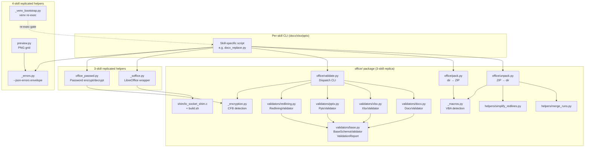

# ARCHITECTURE: Shared office/ OOXML Core + LibreOffice Wrapper + Cross-Skill Replication

> **Status:** Shipped — the `office/` package and all replicated helpers are fully deployed across docx/xlsx/pptx.
> **License:** Proprietary, All Rights Reserved (docx/xlsx/pptx/pdf + html skills; see per-skill `LICENSE` and `NOTICE`).
> **Master:** `skills/docx/scripts/` — the sole source of truth for edits.
> **Downstream copies (byte-identical):** `skills/xlsx/scripts/` and `skills/pptx/scripts/` (office/ + _soffice.py); additionally `skills/pdf/scripts/` for the 4-skill helpers (_errors.py, preview.py, _venv_bootstrap.py).
> **Replication gate:** `diff -q` / `diff -qr` — zero output required before every commit that touches master.

---

## 1. Purpose & Scope

The `office/` package is the shared OOXML foundation that `docx`, `xlsx`, and `pptx` all build on. It handles the ZIP-based container lifecycle that ECMA-376 (Office Open XML) mandates: unpack a file into an inspectable directory tree, let the skill-specific scripts manipulate individual XML parts, then repack and optionally validate the result.

The subsystem was designed with one architectural constraint above all others: **each skill must be installable and runnable in complete isolation**, including when packaged as a `.skill` archive. This rules out symlinks, shared imports from a `common/` root, or any form of cross-skill runtime dependency. Physical duplication with a strict replication protocol is the deliberate solution.

**What this subsystem does:**

- Unpack any OOXML ZIP into a diff-friendly, pretty-printed directory tree (`unpack.py`).
- Apply DOCX-specific canonicalisation helpers at unpack time: merge split `<w:r>` runs (`merge_runs.py`) and collapse adjacent tracked-change markers by the same author (`simplify_redlines.py`).
- Repack a modified directory back into a well-formed OOXML ZIP (`pack.py`), placing `[Content_Types].xml` first per ECMA-376 Part 2.
- Validate OOXML containers against structural rules, relationship graphs, ID-uniqueness constraints, XSD schemas (when present), and cross-file tracked-change coverage (`validate.py` + `validators/`).
- Detect and surface CFB containers — password-protected OOXML and legacy .doc/.xls/.ppt — before any ZIP operation can fail with a mystifying `BadZipFile` (`_encryption.py`).
- Detect macro-enabled files (.docm/.xlsm/.pptm) and warn when a repack would silently drop the VBA project (`_macros.py`).
- Launch LibreOffice headless for format conversion, with automatic AF_UNIX socket shim injection in sandbox environments (`_soffice.py` + `shim/`).
- Render any OOXML or PDF as a PNG preview grid (`preview.py`).
- Set or remove MS-OFB Agile (Office 2010+) password protection (`office_passwd.py`).
- Provide a uniform `--json-errors` error envelope for all CLI scripts (`_errors.py`).
- Bootstrap each CLI into its own per-skill `.venv` transparently (`_venv_bootstrap.py`).

**What this subsystem deliberately does NOT do:**

- Execute, modify, or analyse VBA bytecode — macro inspection is left to dedicated tools (oletools, msoffcrypto-tool).
- Provide cross-process AF_UNIX IPC emulation — the shim enables LO to start in seccomp-tightened sandboxes but does not bridge socket traffic between separate OS processes (documented limitation locked in by `TestShimCrossProcessIPCLimitation`).
- Convert between macro and non-macro extensions — that requires re-save in the host application or `soffice --convert-to`.
- Format-convert legacy .doc/.xls/.ppt files natively — users must convert upstream.
- Diff document formatting (bold/italic/colour); `redlining.py` compares text content only.

---

## 2. Functional Architecture

| Capability | Entry-point script | Notes |
|---|---|---|
| Unpack OOXML to directory | `office/unpack.py` | Pretty-prints XML; DOCX-only: merge_runs + simplify_redlines + smart-quote escaping |
| Repack directory to OOXML | `office/pack.py` | Reverse smart-quote escaping; whitespace condensation; [Content_Types].xml first |
| Validate OOXML container | `office/validate.py` | Dispatches to DocxValidator / XlsxValidator / PptxValidator; optional `--strict` XSD; `--compare-to` redlining |
| LibreOffice headless conversion | `_soffice.py` (module only) | Used by docx_accept_changes.py, xlsx_recalc.py, pptx_to_pdf.py, pptx_thumbnails.py; not a standalone CLI |
| AF_UNIX sandbox shim | `office/shim/lo_socket_shim.c` + `build.sh` | Compiled on demand by `_soffice.py`; LD_PRELOAD (Linux) / DYLD_INSERT (macOS) |
| PNG preview grid | `preview.py` | OOXML → soffice → pdftoppm → Pillow grid; PDF → pdftoppm → grid |
| Password set/remove/check | `office_passwd.py` | msoffcrypto-tool Agile encryption; OOXML 3-skill only (pdf has its own mechanism) |
| CFB detection | `office/_encryption.py` (module only) | 8-byte magic check; distinguishes encrypted OOXML from legacy Office 97-2003 only by message (not by byte parsing) |
| Macro-enabled detection | `office/_macros.py` (module only) | Content-type authoritative signal; VBA project part as fallback for broken packages |
| JSON error envelope | `_errors.py` (module only) | `--json-errors` flag wired by `add_json_errors_argument`; schema version 1 |
| Venv self-bootstrap | `_venv_bootstrap.py` (module only) | re-exec into `.venv` on first run; loop guard via `_VENV_BOOTSTRAP_REEXEC` env var |

---

## 3. System Architecture

### 3.1 Module / package layout (under `skills/docx/scripts/` — replicated verbatim to xlsx/pptx)

```
scripts/
├── _errors.py               # --json-errors envelope; 4-skill (docx/xlsx/pptx/pdf)
├── _venv_bootstrap.py       # venv re-exec helper; 4-skill
├── _soffice.py              # LibreOffice wrapper; 3-skill (docx/xlsx/pptx)
├── office_passwd.py         # password encrypt/decrypt/check; 3-skill (docx/xlsx/pptx)
├── preview.py               # PNG-grid renderer; 4-skill
│
└── office/                  # OOXML container package; 3-skill (docx/xlsx/pptx)
    ├── __init__.py           # package declaration only (no public symbols)
    ├── unpack.py             # ZIP → directory; main() CLI
    ├── pack.py               # directory → ZIP; main() CLI
    ├── validate.py           # dispatch validator CLI (--strict, --json, --compare-to)
    ├── _encryption.py        # CFB signature check; EncryptedFileError
    ├── _macros.py            # macro-enabled detection + macro-loss warning helpers
    │
    ├── validators/
    │   ├── __init__.py
    │   ├── base.py           # BaseSchemaValidator + ValidationReport; OPC relationship resolver
    │   ├── docx.py           # DocxValidator: tracked-change + comment-marker checks
    │   ├── xlsx.py           # XlsxValidator: sheet chain, shared-string/style index bounds, orphan sheets
    │   ├── pptx.py           # PptxValidator: slide chain, layout/master chain, media refs, notes reciprocity
    │   └── redlining.py      # RedliningValidator: text-diff between original and edited .docx
    │
    ├── helpers/
    │   ├── __init__.py
    │   ├── merge_runs.py         # collapse adjacent <w:r> with identical rPr
    │   └── simplify_redlines.py  # merge adjacent <w:ins>/<w:del> by same author/date
    │
    ├── shim/
    │   ├── lo_socket_shim.c      # LD_PRELOAD shim: intercepts AF_UNIX socket syscalls
    │   ├── build.sh              # idempotent compiler wrapper (gcc/clang; Linux/macOS)
    │   ├── liblo_socket_shim.dylib  # pre-built macOS artefact (gitignored on Linux)
    │   └── .build.lock           # fcntl advisory lock for concurrent builds
    │
    ├── tests/
    │   ├── __init__.py
    │   ├── test_shim.py                        # TestShimInterceptionContract + TestShimCrossProcessIPCLimitation
    │   ├── test_shim.md                        # companion narrative
    │   ├── test_redlining.py                   # RedliningValidator unit tests
    │   ├── test_validate_package_structure.py  # _check_package_structure + scratch-leak regression
    │   ├── test_xlsx_validator.py              # XlsxValidator unit tests
    │   └── test_pptx_validator.py              # PptxValidator unit tests
    │
    └── schemas/
        ├── README.md    # schema inventory and licence notes
        ├── fetch.sh     # on-demand downloader for ECMA-376 + Microsoft XSD sets
        └── w3c/
            └── xml.xsd  # W3C XML namespace schema (the only bundled schema)
```

> The `ecma-376/` and `microsoft/` schema subdirectories are gitignored and fetched on demand via `schemas/fetch.sh`. XSD validation is best-effort and skipped when the schema files are absent; `--strict` promotes missing-schema notices to warnings.

### 3.2 Runtime model

```
python3 scripts/X.py ...
    ↓
_venv_bootstrap.reexec_into_venv()   [stdlib only; re-execs into .venv if needed]
    ↓
skill-specific script (e.g. docx_replace.py)
    ↓ imports
office.unpack / office.pack / office.validate / _soffice / _errors
    ↓ soffice calls (when needed)
_soffice.run()
    ↓ if AF_UNIX blocked
  [build shim on demand via build.sh, inject via LD_PRELOAD / DYLD_INSERT]
    ↓
soffice --headless --convert-to ... (subprocess; throwaway user profile)
```

PDF and OOXML preview additionally pass through `pdftoppm` (Poppler) and Pillow.

### 3.3 Component diagram



---

## 4. Data Model / Intermediate Representations

### OOXML container (on disk before/after processing)

An OOXML file is a ZIP archive. The canonical parts are:

- `[Content_Types].xml` — must be the first ZIP entry; maps file extensions and overrides to MIME content types.
- `_rels/.rels` — root relationship file; points to the document's main part.
- Format-specific hierarchy: `word/` (DOCX), `xl/` (XLSX), `ppt/` (PPTX), plus `docProps/` and optional `customXml/`.

`unpack.py` extracts the ZIP into a directory tree, pretty-printing XML parts with two-space indent (via `defusedxml.minidom`) and escaping seven Unicode smart-quote / dash characters to numeric XML entities (e.g. `"` → `&#x201C;`). `pack.py` reverses this encoding and optionally condenses whitespace-only text nodes before repacking with `ZIP_DEFLATED`.

### ValidationReport (in-memory)

`ValidationReport` (defined in `office/validators/base.py`) is a simple dataclass:

```python
@dataclass
class ValidationReport:
    errors: list[str]
    warnings: list[str]

    @property
    def ok(self) -> bool: ...
    def merge(self, other: ValidationReport) -> None: ...
    def to_dict(self) -> dict[str, list[str]]: ...
    # to_dict() returns {"errors": [...], "warnings": [...], "ok": bool}
    # Note: the returned dict also carries an "ok" bool value (derived from
    # the ok property); the annotation reflects the real signature in base.py.
```

Errors are hard failures (exit 1). Warnings are soft notices that become errors only under `--strict`. The `--json` flag serialises `to_dict()` as a JSON object on stdout (`{"errors": [...], "warnings": [...], "ok": true/false}`).

### Package-structure whitelist (in `validate.py`)

```python
_ALLOWED_PREFIXES_BY_EXT = {
    ".docx": ("[Content_Types].xml", "_rels/", "word/", "docProps/", "customXml/"),
    ".xlsx": ("[Content_Types].xml", "_rels/", "xl/",   "docProps/", "customXml/"),
    ".pptx": ("[Content_Types].xml", "_rels/", "ppt/",  "docProps/", "customXml/"),
}
```

ZIP members outside these prefixes are flagged as `non-OOXML package member` warnings (e.g. scratch-file leaks from interrupted edits).

### ExtractedParagraph (redlining validator)

`redlining.py` materialises each paragraph as an `ExtractedParagraph` dataclass holding the text as it looked **before** tracked changes (`original`) and **after** (`edited`), derived by walking `<w:t>` and `<w:delText>` inside `<w:ins>` / `<w:del>` ancestry chains. A `difflib.SequenceMatcher` diff between the two documents' original-text strings produces the set of unmarked changes.

---

## 5. Interfaces

### `office/unpack.py`

```
python -m office.unpack INPUT OUTPUT_DIR
    [--no-pretty]          skip XML pretty-printing
    [--no-escape-quotes]   keep smart quotes as UTF-8
    [--no-merge-runs]      skip merge_runs + simplify_redlines (DOCX only)
```

Exit 0 on success, 1 on failure.

### `office/pack.py`

```
python -m office.pack INPUT_DIR OUTPUT
    [--no-unescape-quotes]  keep numeric entities as-is
    [--no-condense]         preserve whitespace in XML parts
```

Exit 0 on success, 1 on failure.

### `office/validate.py`

```
python -m office.validate INPUT
    [--strict]            warnings become errors; parse-all-parts + XSD-when-present
    [--json]              emit JSON report on stdout
    [--schemas-dir PATH]  directory with XSD files (default: office/schemas/)
    [--compare-to ORIG]   redlining: compare INPUT.docx against ORIG.docx
```

Exit codes:
- `0` — no errors (warnings present but `--strict` not set)
- `1` — errors present (or warnings with `--strict`)
- `2` — input missing or unknown extension
- `3` — CFB container (encrypted OOXML or legacy .doc/.xls/.ppt)

### `office_passwd.py`

```
office_passwd.py INPUT OUTPUT --encrypt PASSWORD   # '-' to read from stdin
office_passwd.py INPUT OUTPUT --decrypt PASSWORD
office_passwd.py INPUT        --check
    [--json-errors]
```

Exit codes: 0 success, 1 generic failure, 2 usage error, 3 missing dependency, 4 wrong password, 5 state mismatch, 6 self-overwrite refused, 10 file not encrypted (--check), 11 file not found.

### `preview.py`

```
python3 preview.py INPUT OUTPUT.jpg
    [--cols 3]
    [--dpi 110]
    [--gap 12]
    [--padding 24]
    [--label-font-size 14]
    [--soffice-timeout 240]
    [--pdftoppm-timeout 60]
    [--json-errors]
```

Prints the output path on stdout. Exit 0 on success, 1 on failure.

### `--json-errors` envelope (all CLIs that call `add_json_errors_argument`)

Single line of JSON on stderr:

```json
{"v": 1, "error": "<message>", "code": <int>, "type": "<ErrorClass>", "details": {}}
```

`v` is the schema version (currently 1). `type` and `details` are optional. `code` is never 0 — callers passing `code=0` have it coerced to 1 with a warning folded into `details`.

---

## 6. Cross-cutting Concerns

### Replication topology

Three concentric replication scopes, each controlled by `diff -q` gates:

| Scope | Files | Skills | Master |
|---|---|---|---|
| **3-skill (OOXML core)** | `office/` (full tree), `_soffice.py` | docx, xlsx, pptx | docx |
| **3-skill (OOXML passwd)** | `office_passwd.py` | docx, xlsx, pptx | docx |
| **4-skill (cross-skill helpers)** | `_errors.py`, `_venv_bootstrap.py`, `preview.py` | docx, xlsx, pptx, pdf | docx |

The `html` skill joins the 4-skill scope for `_errors.py` and `_venv_bootstrap.py` (making it a 5-skill loop per CLAUDE.md §2). The `office/` package and `_soffice.py` are NOT replicated to `html` or `pdf`.

**Replication commands (from repo root):**

```bash
# 3-skill OOXML core
rm -rf skills/xlsx/scripts/office skills/pptx/scripts/office
cp -R skills/docx/scripts/office skills/xlsx/scripts/office
cp -R skills/docx/scripts/office skills/pptx/scripts/office
cp skills/docx/scripts/_soffice.py skills/xlsx/scripts/_soffice.py
cp skills/docx/scripts/_soffice.py skills/pptx/scripts/_soffice.py

# Verification (all must produce no output)
find skills -type d -name __pycache__ -exec rm -rf {} + 2>/dev/null
diff -qr skills/docx/scripts/office skills/xlsx/scripts/office
diff -qr skills/docx/scripts/office skills/pptx/scripts/office
diff -q  skills/docx/scripts/_soffice.py skills/xlsx/scripts/_soffice.py
diff -q  skills/docx/scripts/_soffice.py skills/pptx/scripts/_soffice.py
```

**Why physical duplication (not symlinks or a shared package):** Each skill must be packageable as a self-contained `.skill` archive by `skills/skill-creator/scripts/package_skill.py`. Symlinks would dangle inside the archive. A user installing only the `pptx` skill on a clean machine must not require `docx` to be present. This is a hard requirement per the project plan §"Независимость скиллов".

### XML parsing security posture

All XML parsing throughout `office/` uses hardened lxml XMLParser settings (`resolve_entities=False`, `no_network=True`, `load_dtd=False`) — centralized as `_safe_parser()` in `validators/base.py` and used by the validator layer; `pack.py` inlines the same settings directly (additionally setting `remove_blank_text=True` for condensation) rather than calling `_safe_parser()`. `unpack.py` additionally uses `defusedxml.minidom.parseString` for pretty-printing. ECMA-376 parts do not use DTDs or external entities; these settings close the XXE / SSRF attack surface.

### LibreOffice AF_UNIX shim

`_soffice.run()` probes whether `socket(AF_UNIX, SOCK_STREAM)` succeeds in the current process. If it does not (seccomp-tightened sandbox), or if `LO_SHIM_FORCE=1` is set, `_soffice._shim_library_path()` is called. It compiles `lo_socket_shim.c` on demand (idempotent, guarded by `fcntl.flock` for concurrent callers), then injects the resulting `.so`/`.dylib` via `LD_PRELOAD` (Linux) or `DYLD_INSERT_LIBRARIES` + `DYLD_FORCE_FLAT_NAMESPACE` (macOS). On macOS, `_soffice._soffice_hardened_on_macos()` uses `codesign --display --verbose=2` to detect hardened-runtime binaries — Apple strips `DYLD_INSERT_LIBRARIES` at exec time for those, so a `RuntimeWarning` is emitted rather than silently no-oping.

Each `soffice` invocation uses a throwaway user profile directory (`tempfile.TemporaryDirectory(prefix="soffice-profile-")`) so concurrent calls cannot conflict over LibreOffice's lock file. The standard flags passed to every invocation are `--headless --norestore --nologo --nodefault -env:UserInstallation=<uri>`.

### Licensing

All four office skills and the `html` skill are **Proprietary, All Rights Reserved**, governed by their per-skill `LICENSE` and `NOTICE` files. Source is available for audit only; any use, execution, copying, modification, or distribution requires prior written permission. The root repository `LICENSE` (Apache-2.0) does **not** cover these skills. Third-party attributions (ECMA-376/W3C/Microsoft schemas, `msoffcrypto-tool`, `defusedxml`, `lxml`) are recorded in the root `THIRD_PARTY_NOTICES.md`.

---

## 7. Honest Scope & Open Questions

### Documented limitations

1. **Shim does not provide cross-process AF_UNIX IPC.** `lo_socket_shim.c` creates an independent `socketpair()` per `socket(AF_UNIX)` call. There is no global path→fd registry. A `connect(path)` in a child process cannot reach a `bind(path)` in the parent; data written to a shimmed socket is never read by another process. This is documented verbatim in `lo_socket_shim.c` and locked in by `TestShimCrossProcessIPCLimitation`. Multi-process UNO service scenarios require a real IPC solution (Docker without AF_UNIX seccomp denial, or a proper shared-memory broker).

2. **macOS hardened-runtime LibreOffice:** The Document Foundation's LibreOffice.app bundle is signed with hardened runtime. Apple strips `DYLD_INSERT_LIBRARIES` at exec time for such binaries. The shim silently no-ops; `_soffice.run()` emits a `RuntimeWarning` when it detects this. To use the shim on macOS the binary must be unsigned or re-signed without hardened runtime.

3. **XSD validation is best-effort.** ECMA-376 is large and real-world files frequently use extension schemas (e.g. `mc:AlternateContent`, Microsoft `w14`/`w15` namespaces) not included in the bundled schema set. XSD failures are warnings unless `--strict` is specified. The `ecma-376/` and `microsoft/` schema directories are not bundled and must be fetched via `schemas/fetch.sh`.

4. **Redlining validator does not diff formatting.** `RedliningValidator.compare()` reconstructs paragraph text from `<w:t>` and `<w:delText>` nodes and diffs the text strings. `<w:rPrChange>` / `<w:pPrChange>` (formatting tracked changes) are acknowledged but not compared. This is noted in the module docstring as "a later enhancement if needed."

5. **CFB discrimination is message-only.** `_encryption.py` detects any CFB container by its 8-byte magic signature but cannot reliably distinguish encrypted OOXML from legacy Office 97-2003 without walking the FAT. The error message lists both possibilities. Parsing the FAT is considered out of scope for a pre-flight check.

6. **`shim_fd_peer` table is fixed-size.** The shim allocates `shim_fd_peer[4096]`. File descriptors >= 4096 are not shimmed. This is fine for LibreOffice's typical startup use, but would silently miss sockets on systems with many open fds.

### Open questions

- Whether `validate.py --compare-to` (the redlining check) should be extended to cover formatting tracked changes (`<w:rPrChange>`) given that some review workflows care about formatting attribution.
- Whether the AF_UNIX shim should be replaced with a Docker-based isolation strategy for production deployments, given the macOS hardened-runtime limitation.
- The `shim_fd_peer` table size (4096) — whether this should become a runtime-configurable `SHIM_MAX_FDS` environment variable for high-fd-count deployments.
