# ARCHITECTURE: docx skill — Word .docx create / edit / convert / validate (OOXML MASTER)

> **Status:** Shipped (all backlog items docx-1 through docx-9 done as of 2026-06-05).
> **License:** Proprietary, All Rights Reserved (`skills/docx/LICENSE`).
> **Replication role:** MASTER for `office/` (→ xlsx, pptx), `_soffice.py` (→ xlsx, pptx),
> `office_passwd.py` (→ xlsx, pptx), `_errors.py` / `_venv_bootstrap.py` / `preview.py` (→ xlsx, pptx, pdf).
> `html2md_core.js` is mastered here and replicated to the `html` skill (`diff -q` gated).
> **Execution mode:** `script-first` (Tier 2 skill).
> **Tasks covered:** docx-1 … docx-9 (backlog IDs); TASK 006 (docx_replace),
> TASK 008 (relocators), TASK 019 (venv self-bootstrap + A4 page-size + install hardening).

---

## 1. Purpose & Scope

The `docx` skill gives an agent a deterministic, script-first way to create, edit, and
convert Microsoft Word `.docx` files. Every capability is exposed as a single CLI command
so the agent never has to derive low-level OOXML constructs by hand.

**What it does:**

- Create `.docx` from Markdown (including Mermaid diagrams, tables, page-size / orientation / margins control)
- Convert HTML / `.webarchive` / `.mhtml` to `.docx`
- Extract `.docx` content to Markdown, preserving comments, tracked changes, and footnotes in side-car JSON
- Surgical anchor-and-action edit of a live `.docx` (replace text, insert paragraphs, delete paragraphs) without a lossy round-trip; includes asset and numbering relocation for `--insert-after`
- Fill `.docx` templates with `{{placeholder}}` substitution using safe run-merging
- Accept all tracked changes via headless LibreOffice
- Add / reply to Word review comments (wires `<w:commentRangeStart/End>`, `<w:commentReference>`, `commentsExtended.xml`)
- Merge N `.docx` files with full reference relocation (images, relationships, bookmarks, numbering)
- Unpack / repack `.docx` for raw OOXML editing with smart-quote entity round-tripping
- Structurally validate a `.docx` (relationships, content-types, package-layout allow-list, optional XSD binding, redlining comparison)
- Render any `.docx`/`.docm` to a PNG-grid preview via LibreOffice + Poppler
- Set / remove / detect password protection (MS-OFB Agile, Office 2010+)
- Reject password-protected and legacy `.doc` (CFB) inputs with a clear exit-3 message
- Warn when a macro-enabled `.docm` input would silently drop its `vbaProject.bin`
- Emit failures as machine-readable JSON to stderr (`--json-errors`) for agent harness integration

**What it deliberately does NOT do:**

- Merge footnotes / endnotes / headers / footers across documents (noted in `docx_merge.py` honest scope)
- Support cross-run anchors in `--replace` (anchor must fit in one `<w:t>` after run-merge)
- Convert conditionals / loops in templates (plain `{{key}}` substitution only; no docxtpl expressions)
- Create or manipulate custom content controls, style inheritance chains, or macro code
- Fetch remote images silently or install system tools (LibreOffice, Poppler, Node.js)

---

## 2. Functional Architecture

| Capability | Entry-point script | Runtime | Notes |
|---|---|---|---|
| Markdown → `.docx` | `scripts/md2docx.js` | Node.js | Page geometry (`--page-size A4\|Letter`, `--landscape`, `--margins T,R,B,L`) derived from actual page dimensions (TASK 019 B). Default US Letter for backward-compat. Mermaid diagrams via `execSync(mmdc …)`. |
| HTML / `.webarchive` / `.mhtml` → `.docx` | `scripts/html2docx.js` | Node.js | Three input formats; Confluence / CMS chrome stripping; two-tier SVG renderer (Chrome Tier 1 → resvg-js Tier 2); `--reader-mode` candidate list. |
| `.docx` → Markdown | `scripts/docx2md.js` | Node.js | Mammoth → Turndown pipeline; JSON sidecar for comments + tracked changes; pandoc footnote markers. Delegates to `docx2md/` package modules. |
| Template fill | `scripts/docx_fill_template.py` | Python + venv | Run-merge + `{{key}}` substitution; `--strict` for customer-facing outputs. |
| Accept tracked changes | `scripts/docx_accept_changes.py` | Python + LibreOffice | StarBasic `.uno:AcceptAllTrackedChanges` dispatched from a disposable user profile via `_soffice.py`. |
| Surgical anchor-and-action edit | `scripts/docx_replace.py` | Python + venv | `--replace`, `--insert-after`, `--delete-paragraph`; asset / numbering relocation via `_relocator.py`; scope filter `--scope=body\|…\|all`. Full detail in chunk docx-6 (architecture-006-docx-replace.md). |
| Add / reply to review comment | `scripts/docx_add_comment.py` | Python + venv | Anchors on text substring; threaded replies via `commentsExtended.xml`; library mode `--unpacked-dir`. |
| Merge N `.docx` | `scripts/docx_merge.py` | Python + venv | Full reference relocation: media, relationships, bookmarks, numbering. Honest scope: footnotes / headers / footers / comments excluded. |
| Unpack for raw XML edit | `scripts/office/unpack.py` | Python + venv | Pretty-print, run-merge, smart-quote entity encode; produces a directory tree under the shared `office/` package. |
| Repack after raw edit | `scripts/office/pack.py` | Python + venv | Reverses smart-quote encoding; produces a `.docx` ZIP. |
| Structural validate | `scripts/office/validate.py` | Python + venv | Relationships, content-types, package-layout allow-list, duplicate IDs, comment pairing, optional XSD binding; `--compare-to ORIGINAL` for redlining. |
| PNG-grid preview | `scripts/preview.py` | Python + LibreOffice + Poppler | soffice headless → PDF → `pdftoppm` → PIL grid. Byte-identical across four office skills. |
| Password protect / detect | `scripts/office_passwd.py` | Python + venv | `--encrypt`, `--decrypt`, `--check`; stdin password via `-`. Byte-identical across three OOXML skills. |

---

## 3. System Architecture

### 3.1 Module / file layout

```
skills/docx/
├── SKILL.md                          # skill contract (agent instructions)
├── LICENSE / NOTICE                  # Proprietary per-skill
├── examples/
│   ├── fixture-simple.md
│   └── fixture-mermaid-a4.md         # TASK 019 dogfood fixture (F3)
├── references/
│   ├── ooxml-basics.md
│   ├── docx-js-gotchas.md
│   ├── tracked-changes.md
│   ├── templating.md
│   ├── add-comment-howto.md
│   ├── docx2md-sidecar.md
│   └── html-conversion.md
└── scripts/
    │
    ├── [Node.js CLIs — no venv needed]
    │   ├── md2docx.js                # MD → .docx; page-geometry; Mermaid
    │   ├── html2docx.js              # HTML/.webarchive/.mhtml → .docx CLI
    │   │   ├── _html2docx_archive.js # webarchive + MHTML extractor
    │   │   ├── _html2docx_preprocess.js  # DOM cleanup (Confluence/CMS chrome strip)
    │   │   ├── _html2docx_walker.js  # cheerio DOM → docx-js object tree
    │   │   └── _html2docx_svg_render.js  # two-tier SVG rasteriser
    │   ├── html2md_core.js           # HTML → GFM core (turndown + expandTableToGrid)
    │   │                             #   MASTER → replicated to html skill
    │   └── docx2md.js               # .docx → Markdown CLI (orchestrator)
    │       └── docx2md/
    │           ├── _util.js          # dep loader
    │           ├── _probes.js        # soffice / poppler detection
    │           ├── _assets.js        # image extract / dedup / EMF→PNG batch
    │           ├── _shapes.js        # body drawing extraction / injection
    │           ├── _markdown.js      # post-processing (TOC, dedup, headings)
    │           └── _metadata.js      # comments + revisions sidecar; footnote sentinels
    │
    ├── [Python CLIs — venv entrypoints]
    │   ├── docx_replace.py           # surgical anchor-and-action editor (docx-6)
    │   ├── docx_add_comment.py       # review comment inserter (docx-1)
    │   ├── docx_fill_template.py     # {{placeholder}} template filler
    │   ├── docx_accept_changes.py    # LibreOffice tracked-change acceptor
    │   ├── docx_merge.py             # N-file merger with full relocation (docx-2)
    │   ├── preview.py                # PNG-grid renderer (4-skill byte-identical)
    │   └── office_passwd.py          # password set/remove/check (3-OOXML-skill identical)
    │
    ├── [Python import-only helpers — NO __main__, inherit venv from caller]
    │   ├── docx_anchor.py            # run-merge + anchor-find helpers (shared by replace + comment)
    │   ├── _actions.py               # F2 part-walker, F4 replace, F5 insert-after, F6 delete
    │   ├── _relocator.py             # docx-6.5/6.6: image + numbering relocation for --insert-after
    │   └── _app_errors.py            # domain exception hierarchy for docx_replace / _actions
    │
    ├── [Cross-cutting shared helpers — 4-skill byte-identical]
    │   ├── _errors.py                # --json-errors envelope (v=1); argparse patch
    │   └── _venv_bootstrap.py        # stdlib-only re-exec into .venv (TASK 019)
    │
    ├── [LibreOffice wrapper — 3-OOXML-skill byte-identical]
    │   └── _soffice.py               # soffice locate / run / shim auto-load
    │
    ├── office/                       # OOXML unpack/pack/validate package
    │   │                             # MASTER — byte-identically replicated to xlsx, pptx
    │   ├── unpack.py / pack.py       # ZIP ↔ directory with smart-quote round-trip
    │   ├── validate.py               # structural + optional XSD validation CLI
    │   ├── _encryption.py            # CFB magic-byte guard (exit 3)
    │   ├── _macros.py                # ContentType-based macro detection
    │   ├── validators/
    │   │   ├── base.py               # hardened XMLParser + base class
    │   │   ├── docx.py               # docx-specific structural checks
    │   │   ├── redlining.py          # RedliningValidator (--compare-to)
    │   │   └── …
    │   ├── helpers/ shim/ tests/ schemas/
    │   └── __init__.py
    │
    ├── install.sh                    # venv + npm + smoke-test (TASK 019 C)
    ├── requirements.txt              # python-docx, lxml, defusedxml, Pillow, msoffcrypto-tool
    └── package.json / node_modules/  # docx, marked, mammoth, turndown, image-size, cheerio, …
```

### 3.2 Runtime model

Three runtimes cooperate:

1. **Node.js** — `md2docx.js`, `html2docx.js`, `docx2md.js` and their sub-modules. Invoked by the agent directly (`node scripts/md2docx.js …`). The `docx_replace.py --insert-after` action spawns `md2docx.js` as a subprocess.
2. **Python 3 in `.venv`** — all `*.py` CLI entrypoints. `_venv_bootstrap.py` ensures `python3 scripts/X.py` auto-re-execs into `scripts/.venv` regardless of the host interpreter (TASK 019 A). Import-only helpers (`_actions.py`, `_relocator.py`, `docx_anchor.py`, `office/_macros.py`) have no `__main__` and inherit the venv from their calling entrypoint.
3. **LibreOffice (soffice)** — `docx_accept_changes.py` (StarBasic macro dispatch) and `preview.py` (headless `--convert-to pdf`). Located via `_soffice.py` which also auto-compiles and auto-loads the `office/shim/` LD_PRELOAD shim for AF_UNIX-blocked sandboxes.

**Subprocess chain for `--insert-after`:**

```
docx_replace.py (Python)
  └─ subprocess: node scripts/md2docx.js <stdin_md> <tmp.docx>
                     → _relocator.py grafts assets from tmp tree into base tree
```

### 3.3 Component diagram

```mermaid
graph TD
    subgraph Node["Node.js layer"]
        MD2DOCX["md2docx.js\n(MD→.docx)"]
        HTML2DOCX["html2docx.js\n(HTML→.docx)"]
        DOCX2MD["docx2md.js\n(.docx→MD)"]
        CORE["html2md_core.js\n(HTML→GFM core)\nMASTER → html skill"]
    end

    subgraph PyVenv["Python .venv layer"]
        REPLACE["docx_replace.py\n--replace/--insert-after\n--delete-paragraph"]
        COMMENT["docx_add_comment.py"]
        TMPL["docx_fill_template.py"]
        ACCEPT["docx_accept_changes.py"]
        MERGE["docx_merge.py"]
        PREVIEW["preview.py\n4-skill identical"]
        PASSWD["office_passwd.py\n3-OOXML identical"]

        ANCHOR["docx_anchor.py\n(run-merge, anchor-find)"]
        ACTIONS["_actions.py\n(part-walker, replace, insert, delete)"]
        RELOCATOR["_relocator.py\n(image + numbering relocation)"]
        APPERR["_app_errors.py\n(exception hierarchy)"]
    end

    subgraph Shared["Cross-cutting (byte-identical copies in xlsx/pptx/pdf)"]
        ERRORS["_errors.py\n(--json-errors envelope)"]
        BOOTSTRAP["_venv_bootstrap.py\n(re-exec into .venv)"]
        SOFFICE["_soffice.py\n(LibreOffice wrapper)"]
    end

    subgraph OfficeCore["office/ package (MASTER → xlsx, pptx)"]
        UNPACK["unpack.py"]
        PACK["pack.py"]
        VALIDATE["validate.py"]
        ENC["_encryption.py"]
        MACROS["_macros.py"]
    end

    subgraph External["External tools"]
        LO["LibreOffice (soffice)"]
        POPPLER["Poppler (pdftoppm)"]
        CHROMIUM["Chrome/Chromium\n(SVG rasteriser Tier 1)"]
    end

    REPLACE --> ANCHOR
    REPLACE --> ACTIONS
    REPLACE --> RELOCATOR
    REPLACE --> APPERR
    ACTIONS --> ANCHOR
    ACTIONS --> RELOCATOR
    COMMENT --> ANCHOR

    REPLACE --> UNPACK
    REPLACE --> PACK
    REPLACE --> ENC
    COMMENT --> UNPACK
    COMMENT --> PACK
    TMPL --> UNPACK
    TMPL --> PACK
    MERGE --> UNPACK
    MERGE --> PACK
    REPLACE -->|subprocess| MD2DOCX

    ACCEPT --> SOFFICE
    PREVIEW --> POPPLER
    PREVIEW -->|soffice direct| LO
    SOFFICE --> LO
    HTML2DOCX -->|Tier 1 SVG| CHROMIUM

    DOCX2MD --> CORE
```



---

## 4. Data Model / Intermediate Representations

### 4.1 OOXML unpacked tree

`office/unpack.py` materialises the `.docx` ZIP into a directory tree:

```
<outdir>/
  [Content_Types].xml    ← pretty-printed
  _rels/.rels
  word/
    document.xml         ← run-merged; smart-quotes entity-encoded
    styles.xml
    numbering.xml        ← present when the document has lists
    comments.xml
    commentsExtended.xml ← threaded replies (w15 namespace)
    footnotes.xml / endnotes.xml
    header1.xml / footer1.xml / …
    media/               ← image / media blobs
    _rels/document.xml.rels
  docProps/
    app.xml / core.xml
```

Run canonicalisation (adjacent `<w:r>` with identical `<w:rPr>` are merged) is applied on
unpack so downstream editors can match anchors reliably. Smart-quote entities (`&#x2019;` etc.)
are reversed on pack.

### 4.2 `docx2md` sidecar JSON

Written next to the output Markdown when the document has comments, tracked changes, or
unsupported revision types. Path: `<stem>.docx2md.json`. Schema version `v: 1`.

Key fields: `comments[]` (id, author, initials, date, text, anchorText + before/after context, paragraphIndex, paraId, parentParaId for threading), `revisions[]` (`<w:ins>`/`<w:del>` with type/author/date/text/paragraphIndex/runIndex), `unsupported` (counts of rPrChange, pPrChange, moveFrom, moveTo, cellIns, cellDel). Sidecar is not written when all arrays are empty and all unsupported counts are zero (clean documents stay clean). See `references/docx2md-sidecar.md` for the full schema.

### 4.3 Page geometry in `md2docx.js`

Resolved from `--page-size` and `--landscape` before any layout calculation (TASK 019 B):

```
pageW, pageH  ← PAGE_SIZES[sizeKey]      (twips / DXA: Letter 12240×15840, A4 11906×16838)
effW, effH    ← swap if --landscape
margins       ← parsed from --margins or default 1440 all sides
contentWidthDxa = effW − marginL − marginR
maxWidth (px) = floor(contentWidthDxa / 15)   (1 dxa = 1/15 px)
maxHeight (px) = floor((effH − marginT − marginB) / 15)
```

All table column widths, image caps, and Mermaid diagram caps derive from `contentWidthDxa`.
The `<w:pgSz>` and `<w:pgMar>` section properties are set from the same resolved values.

### 4.4 Asset relocation report (`_relocator.py`)

When `docx_replace.py --insert-after` relocates embedded assets from the md2docx-produced
insert tree into the base tree, `_relocator.py` returns a `RelocationReport` dataclass
summarising media files copied, relationships merged (rId offset applied), non-media parts
(charts, OLE, SmartArt) copied, and numbering definitions shifted. A one-line stderr
annotation `[relocated K media, A abstractNum, X numId]` is emitted when at least one
asset was moved.

### 4.5 `--json-errors` envelope

All Python CLI failures emit a single JSON line to stderr when `--json-errors` is present:

```json
{"v": 1, "error": "<message>", "code": <int>, "type": "<ErrorClass>", "details": {…}}
```

`_errors.py` also patches `argparse.error` so usage errors use the same envelope. Schema
version `v` is currently `1`; bumped only when existing field semantics change.

---

## 5. Interfaces

### 5.1 CLI surface

```
node scripts/md2docx.js INPUT.md OUTPUT.docx
    [--header TEXT] [--footer TEXT]
    [--page-size A4|Letter] [--landscape] [--margins T,R,B,L]

node scripts/docx2md.js INPUT.docx OUTPUT.md
    [--metadata-json PATH] [--no-metadata] [--no-footnotes] [--json-errors]

node scripts/html2docx.js INPUT OUTPUT.docx
    [--header TEXT] [--footer TEXT] [--reader-mode] [--json-errors]
    INPUT: .html/.htm, .mhtml/.mht, .webarchive

python3 scripts/docx_replace.py INPUT.docx OUTPUT.docx --anchor TEXT
    (--replace TEXT | --insert-after PATH_OR_DASH | --delete-paragraph)
    [--all] [--unpacked-dir DIR] [--scope=LIST] [--json-errors]

python3 scripts/docx_add_comment.py INPUT.docx OUTPUT.docx
    (--anchor-text TEXT --comment BODY | --parent N --comment BODY)
    [--author NAME] [--initials AB] [--date ISO] [--all]
    [--unpacked-dir DIR] [--json-errors]

python3 scripts/docx_fill_template.py TEMPLATE.docx DATA.json OUTPUT.docx [--strict]

python3 scripts/docx_accept_changes.py INPUT.docx OUTPUT.docx [--timeout 120]

python3 scripts/docx_merge.py OUTPUT.docx INPUT1.docx INPUT2.docx [...]
    [--page-break-between] [--no-merge-styles] [--json-errors]

python3 scripts/office/unpack.py INPUT.docx OUTDIR/
    [--no-pretty] [--no-escape-quotes] [--no-merge-runs]

python3 scripts/office/pack.py INDIR/ OUTPUT.docx
    [--no-unescape-quotes] [--no-condense]

python3 scripts/office/validate.py INPUT.docx
    [--strict] [--json] [--schemas-dir PATH] [--compare-to ORIGINAL.docx]

python3 scripts/preview.py INPUT OUTPUT.jpg
    [--cols 3] [--dpi 110] [--gap 12] [--padding 24]
    [--label-font-size 14] [--soffice-timeout 240] [--pdftoppm-timeout 60]
    [--json-errors]

python3 scripts/office_passwd.py INPUT [OUTPUT]
    (--encrypt PASSWORD | --decrypt PASSWORD | --check)
    # use - as PASSWORD to read from stdin
```

### 5.2 Exit codes

| Code | Meaning | Which scripts |
|---|---|---|
| 0 | Success | all |
| 1 | I/O error, unreadable ZIP, OOXML error, general failure | all Python |
| 2 | Anchor not found (`AnchorNotFound`); last-paragraph delete refused; invalid `--scope`; argparse usage error | `docx_replace.py`, `docx_add_comment.py` |
| 3 | Encrypted / password-protected input or legacy CFB `.doc` (OOXML reader CLIs: `docx_replace.py`, `docx_add_comment.py`, `validate.py`, etc.); **`office_passwd.py` reuses code 3 for MissingDependency** (`msoffcrypto-tool` not installed), not for encrypted input (it reads encrypted files by design) | OOXML reader CLIs + `office_passwd.py` (different meaning — see note) |
| 4 | Wrong password (`--decrypt`) | `office_passwd.py` |
| 5 | State mismatch (`--encrypt` on encrypted / `--decrypt` on clean) | `office_passwd.py` |
| 6 | Same-path self-overwrite refused (`SelfOverwriteRefused`) | `docx_replace.py`, `docx_add_comment.py`, `docx_merge.py`, `office_passwd.py` |
| 7 | Post-validate failure after edit | `docx_replace.py` |
| 10 | `--check`: file is NOT encrypted | `office_passwd.py` |
| 11 | Input file not found | `office_passwd.py` |

### 5.3 Environment variables

| Variable | Used by | Purpose |
|---|---|---|
| `HTML2DOCX_BROWSER` | `html2docx.js` | Override Chrome path for SVG Tier-1; set to a non-existent path to force resvg-js fallback |
| `HTML2DOCX_ALLOW_NO_SANDBOX` | `html2docx.js` | Set to `1` inside a trusted CI container to drop Chrome's `--no-sandbox` guard |

---

## 6. Cross-cutting Concerns

### 6.1 Shared `office/` core

The `office/` package (`unpack.py`, `pack.py`, `validate.py`, `_encryption.py`, `_macros.py`,
`validators/`, `helpers/`, `shim/`, `tests/`, `schemas/`) is the docx-mastered, byte-identical
OOXML utility library shared with `xlsx` and `pptx`. Because `docx` is the declared MASTER,
any change to `office/` must be edited in docx first, tested, then replicated to xlsx and pptx
in the same commit (`CLAUDE.md §2` protocol). This architecture chunk is an overview — the
`office/` core is documented separately (a dedicated architecture-010 chunk is not yet written;
see `CLAUDE.md §2` for the full protocol).

### 6.2 Replication boundary summary

| File(s) | Replication target | Gate |
|---|---|---|
| `office/` (entire package) | xlsx, pptx | `diff -qr` |
| `_soffice.py` | xlsx, pptx | `diff -q` |
| `office_passwd.py` | xlsx, pptx | `diff -q` |
| `_errors.py` | xlsx, pptx, pdf | `diff -q` |
| `_venv_bootstrap.py` | xlsx, pptx, pdf | `diff -q` |
| `preview.py` | xlsx, pptx, pdf | `diff -q` |
| `html2md_core.js` | html skill | `diff -q` |

All replication is physical copy (no symlinks, no submodules) — each skill is installable
and runnable in isolation per the project plan's independence requirement.

**Not replicated** (docx-only): `docx_replace.py`, `docx_add_comment.py`, `docx_fill_template.py`,
`docx_accept_changes.py`, `docx_merge.py`, `docx_anchor.py`, `_actions.py`, `_relocator.py`,
`_app_errors.py`, `md2docx.js`, `html2docx.js`, `docx2md.js` and `docx2md/`.

### 6.3 Detailed cross-references

- **Surgical editor (`docx_replace.py`, `docx_anchor.py`, `_actions.py`, `_app_errors.py`):**
  full functional regions F1–F8, scope filter (docx-6.7), asset/numbering relocation (docx-6.5/6.6)
  — see [`docs/architectures/architecture-006-docx-replace.md`](architecture-006-docx-replace.md).

- **Relocators (`_relocator.py`):** image relocation (docx-6.5) and numbering relocation
  (docx-6.6) implemented in the same Task 008 atomic chain — documented in architecture-006
  §10 (docx-008 sub-section).

### 6.4 Licensing

`skills/docx/` is **Proprietary, All Rights Reserved**. Source is available for audit only;
any use, execution, copying, modification, or distribution requires prior written permission.
All third-party runtime dependencies are attributed in the root `THIRD_PARTY_NOTICES.md`.

### 6.5 Venv self-bootstrap (TASK 019)

`_venv_bootstrap.py::reexec_into_venv(requires, *, _file)` is called as the first executable
statement of every CLI entrypoint (before heavy imports). It detects whether the running
interpreter is the skill's own `.venv` by comparing `sys.prefix` (not `realpath(sys.executable)`
— pyenv symlink-venvs point to the same base binary, so `realpath` gives a false positive).
Import-only helpers (`_actions.py`, `_relocator.py`, `docx_anchor.py`, `office/_macros.py`)
have no `__main__` and do NOT carry the bootstrap call — they always run inside an already-
bootstrapped entrypoint.

---

## 7. Honest Scope & Open Questions

### 7.1 Known limitations (code-documented)

| Limitation | Where documented | Workaround |
|---|---|---|
| `--replace` anchor must fit in a single `<w:t>` after run-merge; cross-run anchors spanning formatting boundaries not supported | `docx_replace.py` docstring, SKILL.md §2 | Pick a more uniform anchor substring that does not cross format boundaries |
| `--insert-after` images require `r:embed` relationship relocation; images are not resolved to live `r:embed` if `md2docx.js` fails | `_actions.py` comment, `_relocator.py` scope | Ensure Node.js is in PATH for `--insert-after` |
| `docx_merge.py` does not merge footnotes, endnotes, headers, footers, or comments; their content from extra documents is warned and dropped | `docx_merge.py` docstring honest scope | Pre-accept tracked changes; accept that headers/footers come from the base document only |
| `html2docx.js` ignores inline `style=""` attributes and CSS classes | `html2docx.js` file header, `references/html-conversion.md` | Use `--reader-mode` for heavily-styled CMS pages |
| `html2docx.js` does not reproduce `rowspan`/`colspan` | `html2docx.js` file header | Manually reformat merged-cell tables after conversion |
| `office_passwd.py --encrypt` is non-deterministic (fresh salt per run); encrypted bytes differ each run | `SKILL.md §4` idempotency note | The decrypted output is byte-equal to the pre-encryption input |
| `docx2md` footnote text is flat plain text (formatting flattened) | `docx2md-sidecar.md`, backlog docx-5 | Accept the footnote definitions block as plain text |
| Sidecar reports `unsupported` counts for `rPrChange`, `pPrChange`, `moveFrom`, `moveTo`, `cellIns`, `cellDel` (not captured in v1) | `docx2md-sidecar.md` `unsupported` field | Use `office/validate.py --compare-to` for detailed redlining |
| `_soffice.py` AF_UNIX shim is not a cross-process IPC solution — it only unblocks LibreOffice startup in seccomp sandboxes | `office/shim/lo_socket_shim.c` file-level comment | See `office/tests/test_shim.md` for nsjail / Docker end-to-end validation |
| Non-docx per-skill CLIs (`xlsx_*.py`, `pptx_*.py`, `pdf_*.py`) do not yet call `_venv_bootstrap` in their own entrypoints | TASK 019 §5 out-of-scope / OQ-1 | `_venv_bootstrap.py` is replicated; their `preview.py` and `office/*` already self-bootstrap |

### 7.2 Deferred features (backlog)

- **`docx_replace.py` cross-run anchors** — requires run-splitting which risks corrupting complex formatting; deferred to a future task.
- **Full footnote/endnote/header/footer merge** in `docx_merge.py` — high complexity; deferred per docx-2 honest scope notes.
- **`html2docx.js` CSS class support** — would require a CSS parser; deferred per html-conversion.md §honest-scope.
- **Dogfood fixture F3 promotion** (`fixture-mermaid-a4.md` regression wiring) — marked `⬜` in TASK 019, partially deferred.
- **Per-skill entrypoint bootstrap for xlsx/pptx/pdf own CLIs** (OQ-1 from TASK 019) — helper already replicated; fast follow-up when those skills are updated.
