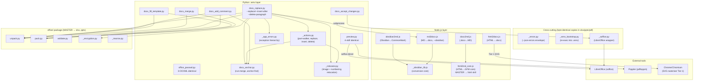

# ARCHITECTURE: docx skill — Word .docx create / edit / convert / validate (OOXML MASTER)

> **Status:** §1–§7 Shipped (backlog docx-1 … docx-9, 2026-06-05).
> **§8 Obsidian note input (docx-10 / TASK 030) is IN PROGRESS.** Its code exists and is
> exercised end to end. Its SKILL.md surface lands with the same task.
> **License:** Proprietary, All Rights Reserved (`skills/docx/LICENSE`).
> **Replication role:** MASTER for `office/` (→ xlsx, pptx), `_soffice.py` (→ xlsx, pptx),
> `office_passwd.py` (→ xlsx, pptx), `_errors.py` / `_venv_bootstrap.py` / `preview.py` (→ xlsx, pptx, pdf).
> `html2md_core.js` is mastered here and replicated to the `html` skill (`diff -q` gated).
> **Execution mode:** `script-first` (Tier 2 skill).
> **Tasks covered:** docx-1 … docx-11 (backlog IDs); TASK 006 (docx_replace),
> TASK 008 (relocators), TASK 019 (venv self-bootstrap + A4 page-size + install hardening),
> TASK 030 (Obsidian note input — see §8).

---

## 1. Purpose & Scope

The `docx` skill gives an agent a deterministic, script-first way to create, edit, and
convert Microsoft Word `.docx` files. Every capability is exposed as a single CLI command
so the agent never has to derive low-level OOXML constructs by hand.

**What it does:**

- Create `.docx` from Markdown (including Mermaid diagrams, tables, page-size / orientation / margins control)
- Convert HTML / `.webarchive` / `.mhtml` to `.docx`
- Extract `.docx` content to Markdown, preserving comments, tracked changes, and footnotes in side-car JSON
- Surgical anchor-and-action edit of a live `.docx` (replace text, insert paragraphs, delete paragraphs) without a lossy round-trip; includes asset and numbering relocation for `--insert-after`
- Fill `.docx` templates with `{{placeholder}}` substitution using safe run-merging
- Accept all tracked changes via headless LibreOffice
- Add / reply to Word review comments (wires `<w:commentRangeStart/End>`, `<w:commentReference>`, `commentsExtended.xml`)
- Merge N `.docx` files with full reference relocation (images, relationships, bookmarks, numbering)
- Unpack / repack `.docx` for raw OOXML editing with smart-quote entity round-tripping
- Structurally validate a `.docx` (relationships, content-types, package-layout allow-list, optional XSD binding, redlining comparison)
- Render any `.docx`/`.docm` to a PNG-grid preview via LibreOffice + Poppler
- Set / remove / detect password protection (MS-OFB Agile, Office 2010+)
- Reject password-protected and legacy `.doc` (CFB) inputs with a clear exit-3 message
- Warn when a macro-enabled `.docm` input would silently drop its `vbaProject.bin`
- Convert an **Obsidian vault note** to `.docx` in one command — frontmatter re-emitted as a table, `![[embeds]]` resolved to real images, `[[wikilinks]]` flattened, callouts and Obsidian-only syntax normalised (§8)
- Emit failures as machine-readable JSON to stderr (`--json-errors`) for agent harness integration

**What it deliberately does NOT do:**

- Merge footnotes / endnotes / headers / footers across documents (noted in `docx_merge.py` honest scope)
- Support cross-run anchors in `--replace` (anchor must fit in one `<w:t>` after run-merge)
- Convert conditionals / loops in templates (plain `{{key}}` substitution only; no docxtpl expressions)
- Create or manipulate custom content controls, style inheritance chains, or macro code
- Fetch remote images silently or install system tools (LibreOffice, Poppler, Node.js)
- Render math (`$…$` / `$$…$$`) — it reaches the document as literal text; deferred to backlog `docx-11`
- Convert a `.docx` back into an Obsidian note, or evaluate Obsidian plugin syntax (Dataview, Templater, Excalidraw)

---

## 2. Functional Architecture

| Capability | Entry-point script | Runtime | Notes |
|---|---|---|---|
| Markdown → `.docx` | `scripts/md2docx.js` | Node.js | Page geometry (`--page-size A4\|Letter`, `--landscape`, `--margins T,R,B,L`) derived from actual page dimensions (TASK 019 B). Default US Letter for backward-compat. Mermaid diagrams via `execSync(mmdc …)`. |
| Obsidian note → CommonMark | `scripts/obsidian2md.js` | Node.js | Pre-processor, no OOXML knowledge. Frontmatter → GFM table (default) / prose / strip; `![[embed]]` → image with an angle-bracket destination; `[[wikilink]]` → text; callouts, `==highlight==`, `%%comment%%`, task boxes; attachment resolution via `.obsidian/app.json` → note dir → literal path → NFC-folded vault index. All logic in `_obsidian_lib.js`. TASK 030. |
| Obsidian note → `.docx` (one command) | `scripts/md2docx.js --obsidian` | Node.js | Runs `_obsidian_lib.js` in-process into an `fs.mkdtempSync` directory, then the normal MD → `.docx` path. `--vault-root DIR` is a known value-flag, rejected with exit 1 without `--obsidian`. TASK 030. |
| HTML / `.webarchive` / `.mhtml` → `.docx` | `scripts/html2docx.js` | Node.js | Three input formats; Confluence / CMS chrome stripping; two-tier SVG renderer (Chrome Tier 1 → resvg-js Tier 2); `--reader-mode` candidate list. |
| `.docx` → Markdown | `scripts/docx2md.js` | Node.js | Mammoth → Turndown pipeline; JSON sidecar for comments + tracked changes; pandoc footnote markers. Delegates to `docx2md/` package modules. |
| Template fill | `scripts/docx_fill_template.py` | Python + venv | Run-merge + `{{key}}` substitution; `--strict` for customer-facing outputs. |
| Accept tracked changes | `scripts/docx_accept_changes.py` | Python + LibreOffice | StarBasic `.uno:AcceptAllTrackedChanges` dispatched from a disposable user profile via `_soffice.py`. |
| Surgical anchor-and-action edit | `scripts/docx_replace.py` | Python + venv | `--replace`, `--insert-after`, `--delete-paragraph`; asset / numbering relocation via `_relocator.py`; scope filter `--scope=body\|…\|all`. Full detail in chunk docx-6 (architecture-006-docx-replace.md). |
| Add / reply to review comment | `scripts/docx_add_comment.py` | Python + venv | Anchors on text substring; threaded replies via `commentsExtended.xml`; library mode `--unpacked-dir`. |
| Merge N `.docx` | `scripts/docx_merge.py` | Python + venv | Full reference relocation: media, relationships, bookmarks, numbering. Honest scope: footnotes / headers / footers / comments excluded. |
| Unpack for raw XML edit | `scripts/office/unpack.py` | Python + venv | Pretty-print, run-merge, smart-quote entity encode; produces a directory tree under the shared `office/` package. |
| Repack after raw edit | `scripts/office/pack.py` | Python + venv | Reverses smart-quote encoding; produces a `.docx` ZIP. |
| Structural validate | `scripts/office/validate.py` | Python + venv | Relationships, content-types, package-layout allow-list, duplicate IDs, comment pairing, optional XSD binding; `--compare-to ORIGINAL` for redlining. |
| PNG-grid preview | `scripts/preview.py` | Python + LibreOffice + Poppler | soffice headless → PDF → `pdftoppm` → PIL grid. Byte-identical across four office skills. |
| Password protect / detect | `scripts/office_passwd.py` | Python + venv | `--encrypt`, `--decrypt`, `--check`; stdin password via `-`. Byte-identical across three OOXML skills. |

---

## 3. System Architecture

### 3.1 Module / file layout

```
skills/docx/
├── SKILL.md                          # skill contract (agent instructions)
├── LICENSE / NOTICE                  # Proprietary per-skill
├── examples/
│   ├── fixture-simple.md
│   ├── fixture-mermaid-a4.md         # TASK 019 dogfood fixture (F3)
│   └── fixture-obsidian-vault/       # TASK 030 mini-vault: app.json, embeds,
│                                     #   size hints, a `%` filename, a space-named dir
├── references/
│   ├── ooxml-basics.md
│   ├── docx-js-gotchas.md
│   ├── tracked-changes.md
│   ├── templating.md
│   ├── add-comment-howto.md
│   ├── docx2md-sidecar.md
│   └── html-conversion.md
└── scripts/
    │
    ├── [Node.js CLIs — no venv needed]
    │   ├── md2docx.js                # MD → .docx; page-geometry; Mermaid; --obsidian
    │   ├── obsidian2md.js            # Obsidian note → CommonMark CLI (TASK 030)
    │   │   └── _obsidian_lib.js      # the conversion core; required by BOTH
    │   │                             #   obsidian2md.js and md2docx.js --obsidian
    │   ├── html2docx.js              # HTML/.webarchive/.mhtml → .docx CLI
    │   │   ├── _html2docx_archive.js # webarchive + MHTML extractor
    │   │   ├── _html2docx_preprocess.js  # DOM cleanup (Confluence/CMS chrome strip)
    │   │   ├── _html2docx_walker.js  # cheerio DOM → docx-js object tree
    │   │   └── _html2docx_svg_render.js  # two-tier SVG rasteriser
    │   ├── html2md_core.js           # HTML → GFM core (turndown + expandTableToGrid)
    │   │                             #   MASTER → replicated to html skill
    │   └── docx2md.js               # .docx → Markdown CLI (orchestrator)
    │       └── docx2md/
    │           ├── _util.js          # dep loader
    │           ├── _probes.js        # soffice / poppler detection
    │           ├── _assets.js        # image extract / dedup / EMF→PNG batch
    │           ├── _shapes.js        # body drawing extraction / injection
    │           ├── _markdown.js      # post-processing (TOC, dedup, headings)
    │           └── _metadata.js      # comments + revisions sidecar; footnote sentinels
    │
    ├── [Python CLIs — venv entrypoints]
    │   ├── docx_replace.py           # surgical anchor-and-action editor (docx-6)
    │   ├── docx_add_comment.py       # review comment inserter (docx-1)
    │   ├── docx_fill_template.py     # {{placeholder}} template filler
    │   ├── docx_accept_changes.py    # LibreOffice tracked-change acceptor
    │   ├── docx_merge.py             # N-file merger with full relocation (docx-2)
    │   ├── preview.py                # PNG-grid renderer (4-skill byte-identical)
    │   └── office_passwd.py          # password set/remove/check (3-OOXML-skill identical)
    │
    ├── [Python import-only helpers — NO __main__, inherit venv from caller]
    │   ├── docx_anchor.py            # run-merge + anchor-find helpers (shared by replace + comment)
    │   ├── _actions.py               # F2 part-walker, F4 replace, F5 insert-after, F6 delete
    │   ├── _relocator.py             # docx-6.5/6.6: image + numbering relocation for --insert-after
    │   └── _app_errors.py            # domain exception hierarchy for docx_replace / _actions
    │
    ├── [Cross-cutting shared helpers — 4-skill byte-identical]
    │   ├── _errors.py                # --json-errors envelope (v=1); argparse patch
    │   └── _venv_bootstrap.py        # stdlib-only re-exec into .venv (TASK 019)
    │
    ├── [LibreOffice wrapper — 3-OOXML-skill byte-identical]
    │   └── _soffice.py               # soffice locate / run / shim auto-load
    │
    ├── office/                       # OOXML unpack/pack/validate package
    │   │                             # MASTER — byte-identically replicated to xlsx, pptx
    │   ├── unpack.py / pack.py       # ZIP ↔ directory with smart-quote round-trip
    │   ├── validate.py               # structural + optional XSD validation CLI
    │   ├── _encryption.py            # CFB magic-byte guard (exit 3)
    │   ├── _macros.py                # ContentType-based macro detection
    │   ├── validators/
    │   │   ├── base.py               # hardened XMLParser + base class
    │   │   ├── docx.py               # docx-specific structural checks
    │   │   ├── redlining.py          # RedliningValidator (--compare-to)
    │   │   └── …
    │   ├── helpers/ shim/ tests/ schemas/
    │   └── __init__.py
    │
    ├── install.sh                    # venv + npm + smoke-test (TASK 019 C)
    ├── requirements.txt              # python-docx, lxml, defusedxml, Pillow, msoffcrypto-tool
    └── package.json / node_modules/  # docx, marked, mammoth, turndown, image-size, cheerio, …
```

### 3.2 Runtime model

Three runtimes cooperate:

1. **Node.js** — `md2docx.js`, `obsidian2md.js`, `html2docx.js`, `docx2md.js` and their sub-modules. Invoked by the agent directly (`node scripts/md2docx.js …`). The `docx_replace.py --insert-after` action spawns `md2docx.js` as a subprocess.
2. **Python 3 in `.venv`** — all `*.py` CLI entrypoints. `_venv_bootstrap.py` ensures `python3 scripts/X.py` auto-re-execs into `scripts/.venv` regardless of the host interpreter (TASK 019 A). Import-only helpers (`_actions.py`, `_relocator.py`, `docx_anchor.py`, `office/_macros.py`) have no `__main__` and inherit the venv from their calling entrypoint.
3. **LibreOffice (soffice)** — `docx_accept_changes.py` (StarBasic macro dispatch) and `preview.py` (headless `--convert-to pdf`). Located via `_soffice.py` which also auto-compiles and auto-loads the `office/shim/` LD_PRELOAD shim for AF_UNIX-blocked sandboxes.

**Subprocess chain for `--insert-after`:**

```
docx_replace.py (Python)
  └─ subprocess: node scripts/md2docx.js <stdin_md> <tmp.docx>
                     → _relocator.py grafts assets from tmp tree into base tree
```

### 3.3 Component diagram


```mermaid
graph TD
    subgraph Node["Node.js layer"]
        MD2DOCX["md2docx.js\n(MD→.docx, --obsidian)"]
        OBS2MD["obsidian2md.js\n(Obsidian→CommonMark)"]
        OBSLIB["_obsidian_lib.js\n(conversion core)"]
        HTML2DOCX["html2docx.js\n(HTML→.docx)"]
        DOCX2MD["docx2md.js\n(.docx→MD)"]
        CORE["html2md_core.js\n(HTML→GFM core)\nMASTER → html skill"]
    end

    subgraph PyVenv["Python .venv layer"]
        REPLACE["docx_replace.py\n--replace/--insert-after\n--delete-paragraph"]
        COMMENT["docx_add_comment.py"]
        TMPL["docx_fill_template.py"]
        ACCEPT["docx_accept_changes.py"]
        MERGE["docx_merge.py"]
        PREVIEW["preview.py\n4-skill identical"]
        PASSWD["office_passwd.py\n3-OOXML identical"]

        ANCHOR["docx_anchor.py\n(run-merge, anchor-find)"]
        ACTIONS["_actions.py\n(part-walker, replace, insert, delete)"]
        RELOCATOR["_relocator.py\n(image + numbering relocation)"]
        APPERR["_app_errors.py\n(exception hierarchy)"]
    end

    subgraph Shared["Cross-cutting (byte-identical copies in xlsx/pptx/pdf)"]
        ERRORS["_errors.py\n(--json-errors envelope)"]
        BOOTSTRAP["_venv_bootstrap.py\n(re-exec into .venv)"]
        SOFFICE["_soffice.py\n(LibreOffice wrapper)"]
    end

    subgraph OfficeCore["office/ package (MASTER → xlsx, pptx)"]
        UNPACK["unpack.py"]
        PACK["pack.py"]
        VALIDATE["validate.py"]
        ENC["_encryption.py"]
        MACROS["_macros.py"]
    end

    subgraph External["External tools"]
        LO["LibreOffice (soffice)"]
        POPPLER["Poppler (pdftoppm)"]
        CHROMIUM["Chrome/Chromium\n(SVG rasteriser Tier 1)"]
    end

    REPLACE --> ANCHOR
    REPLACE --> ACTIONS
    REPLACE --> RELOCATOR
    REPLACE --> APPERR
    ACTIONS --> ANCHOR
    ACTIONS --> RELOCATOR
    COMMENT --> ANCHOR

    REPLACE --> UNPACK
    REPLACE --> PACK
    REPLACE --> ENC
    COMMENT --> UNPACK
    COMMENT --> PACK
    TMPL --> UNPACK
    TMPL --> PACK
    MERGE --> UNPACK
    MERGE --> PACK
    REPLACE -->|subprocess| MD2DOCX

    ACCEPT --> SOFFICE
    PREVIEW --> POPPLER
    PREVIEW -->|soffice direct| LO
    SOFFICE --> LO
    HTML2DOCX -->|Tier 1 SVG| CHROMIUM

    DOCX2MD --> CORE
    OBS2MD --> OBSLIB
    MD2DOCX --> OBSLIB
```

---

## 4. Data Model / Intermediate Representations

### 4.1 OOXML unpacked tree

`office/unpack.py` materialises the `.docx` ZIP into a directory tree:

```
<outdir>/
  [Content_Types].xml    ← pretty-printed
  _rels/.rels
  word/
    document.xml         ← run-merged; smart-quotes entity-encoded
    styles.xml
    numbering.xml        ← present when the document has lists
    comments.xml
    commentsExtended.xml ← threaded replies (w15 namespace)
    footnotes.xml / endnotes.xml
    header1.xml / footer1.xml / …
    media/               ← image / media blobs
    _rels/document.xml.rels
  docProps/
    app.xml / core.xml
```

Run canonicalisation (adjacent `<w:r>` with identical `<w:rPr>` are merged) is applied on
unpack so downstream editors can match anchors reliably. Smart-quote entities (`&#x2019;` etc.)
are reversed on pack.

### 4.2 `docx2md` sidecar JSON

Written next to the output Markdown when the document has comments, tracked changes, or
unsupported revision types. Path: `<stem>.docx2md.json`. Schema version `v: 1`.

Key fields: `comments[]` (id, author, initials, date, text, anchorText + before/after context, paragraphIndex, paraId, parentParaId for threading), `revisions[]` (`<w:ins>`/`<w:del>` with type/author/date/text/paragraphIndex/runIndex), `unsupported` (counts of rPrChange, pPrChange, moveFrom, moveTo, cellIns, cellDel). Sidecar is not written when all arrays are empty and all unsupported counts are zero (clean documents stay clean). See `references/docx2md-sidecar.md` for the full schema.

### 4.3 Page geometry in `md2docx.js`

Resolved from `--page-size` and `--landscape` before any layout calculation (TASK 019 B):

```
pageW, pageH  ← PAGE_SIZES[sizeKey]      (twips / DXA: Letter 12240×15840, A4 11906×16838)
effW, effH    ← swap if --landscape
margins       ← parsed from --margins or default 1440 all sides
contentWidthDxa = effW − marginL − marginR
maxWidth (px) = floor(contentWidthDxa / 15)   (1 dxa = 1/15 px)
maxHeight (px) = floor((effH − marginT − marginB) / 15)
```

All table column widths, image caps, and Mermaid diagram caps derive from `contentWidthDxa`.
The `<w:pgSz>` and `<w:pgMar>` section properties are set from the same resolved values.

### 4.4 Asset relocation report (`_relocator.py`)

When `docx_replace.py --insert-after` relocates embedded assets from the md2docx-produced
insert tree into the base tree, `_relocator.py` returns a `RelocationReport` dataclass
summarising media files copied, relationships merged (rId offset applied), non-media parts
(charts, OLE, SmartArt) copied, and numbering definitions shifted. A one-line stderr
annotation `[relocated K media, A abstractNum, X numId]` is emitted when at least one
asset was moved.

### 4.5 `--json-errors` envelope

All Python CLI failures emit a single JSON line to stderr when `--json-errors` is present:

```json
{"v": 1, "error": "<message>", "code": <int>, "type": "<ErrorClass>", "details": {…}}
```

`_errors.py` also patches `argparse.error` so usage errors use the same envelope. Schema
version `v` is currently `1`; bumped only when existing field semantics change.

---

## 5. Interfaces

### 5.1 CLI surface

```
node scripts/md2docx.js INPUT.md OUTPUT.docx
    [--header TEXT] [--footer TEXT]
    [--page-size A4|Letter] [--landscape] [--margins T,R,B,L]
    [--obsidian [--vault-root DIR] [--frontmatter table|render|strip]
                [--lang ru|en|auto] [--links text|italic]
                [--inline-tags strip|keep] [--transclude] [--strict-assets]]

node scripts/obsidian2md.js INPUT.md OUTPUT.md
    [--vault-root DIR] [--frontmatter table|render|strip] [--lang ru|en|auto]
    [--links text|italic] [--inline-tags strip|keep] [--transclude]
    [--strict-assets] [--json-errors]
    # defaults: --frontmatter table, --lang auto, --links text, --inline-tags strip
    # --vault-root default: walk up from the note to the nearest `.obsidian/`,
    #   else the note's own directory
    # --transclude is MVP=NO in TASK 030; present and tested, may be split out

node scripts/docx2md.js INPUT.docx OUTPUT.md
    [--metadata-json PATH] [--no-metadata] [--no-footnotes] [--json-errors]

node scripts/html2docx.js INPUT OUTPUT.docx
    [--header TEXT] [--footer TEXT] [--reader-mode] [--json-errors]
    INPUT: .html/.htm, .mhtml/.mht, .webarchive

python3 scripts/docx_replace.py INPUT.docx OUTPUT.docx --anchor TEXT
    (--replace TEXT | --insert-after PATH_OR_DASH | --delete-paragraph)
    [--all] [--unpacked-dir DIR] [--scope=LIST] [--json-errors]

python3 scripts/docx_add_comment.py INPUT.docx OUTPUT.docx
    (--anchor-text TEXT --comment BODY | --parent N --comment BODY)
    [--author NAME] [--initials AB] [--date ISO] [--all]
    [--unpacked-dir DIR] [--json-errors]

python3 scripts/docx_fill_template.py TEMPLATE.docx DATA.json OUTPUT.docx [--strict]

python3 scripts/docx_accept_changes.py INPUT.docx OUTPUT.docx [--timeout 120]

python3 scripts/docx_merge.py OUTPUT.docx INPUT1.docx INPUT2.docx [...]
    [--page-break-between] [--no-merge-styles] [--json-errors]

python3 scripts/office/unpack.py INPUT.docx OUTDIR/
    [--no-pretty] [--no-escape-quotes] [--no-merge-runs]

python3 scripts/office/pack.py INDIR/ OUTPUT.docx
    [--no-unescape-quotes] [--no-condense]

python3 scripts/office/validate.py INPUT.docx
    [--strict] [--json] [--schemas-dir PATH] [--compare-to ORIGINAL.docx]

python3 scripts/preview.py INPUT OUTPUT.jpg
    [--cols 3] [--dpi 110] [--gap 12] [--padding 24]
    [--label-font-size 14] [--soffice-timeout 240] [--pdftoppm-timeout 60]
    [--json-errors]

python3 scripts/office_passwd.py INPUT [OUTPUT]
    (--encrypt PASSWORD | --decrypt PASSWORD | --check)
    # use - as PASSWORD to read from stdin
```

### 5.2 Exit codes

| Code | Meaning | Which scripts |
|---|---|---|
| 0 | Success | all |
| 1 | I/O error, unreadable ZIP, OOXML error, general failure | all Python; `obsidian2md.js`; **every `md2docx.js` usage error** (incl. `--vault-root` without `--obsidian`) |
| 2 | Anchor not found (`AnchorNotFound`); last-paragraph delete refused; invalid `--scope`; argparse usage error | `docx_replace.py`, `docx_add_comment.py`, `obsidian2md.js` |
| — | **Dual meaning, like code 3 below.** A usage error is exit **2** in `obsidian2md.js` and the Python CLIs, but exit **1** in `md2docx.js`, which has used 1 for every usage error since TASK 019. TASK 030 chose not to change a shipped contract to gain uniformity. | — |
| 3 | Encrypted / password-protected input or legacy CFB `.doc` (OOXML reader CLIs: `docx_replace.py`, `docx_add_comment.py`, `validate.py`, etc.); **`office_passwd.py` reuses code 3 for MissingDependency** (`msoffcrypto-tool` not installed), not for encrypted input (it reads encrypted files by design) | OOXML reader CLIs + `office_passwd.py` (different meaning — see note) |
| 4 | Wrong password (`--decrypt`) | `office_passwd.py` |
| 5 | State mismatch (`--encrypt` on encrypted / `--decrypt` on clean) | `office_passwd.py` |
| 6 | Same-path self-overwrite refused (`SelfOverwriteRefused`) | `docx_replace.py`, `docx_add_comment.py`, `docx_merge.py`, `office_passwd.py`, `obsidian2md.js` |
| 7 | Post-validate failure after edit | `docx_replace.py` |
| 8 | Attachment not found under `--strict-assets` (`AssetNotFound`) | `obsidian2md.js` **and** `md2docx.js --obsidian` (TASK 030). Only `obsidian2md.js` can wrap it in a `--json-errors` envelope — `md2docx.js` has no such flag (pre-existing). |
| 10 | `--check`: file is NOT encrypted | `office_passwd.py` |
| 11 | Input file not found | `office_passwd.py` |

### 5.3 Environment variables

| Variable | Used by | Purpose |
|---|---|---|
| `HTML2DOCX_BROWSER` | `html2docx.js` | Override Chrome path for SVG Tier-1; set to a non-existent path to force resvg-js fallback |
| `HTML2DOCX_ALLOW_NO_SANDBOX` | `html2docx.js` | Set to `1` inside a trusted CI container to drop Chrome's `--no-sandbox` guard |

---

## 6. Cross-cutting Concerns

### 6.1 Shared `office/` core

The `office/` package (`unpack.py`, `pack.py`, `validate.py`, `_encryption.py`, `_macros.py`,
`validators/`, `helpers/`, `shim/`, `tests/`, `schemas/`) is the docx-mastered, byte-identical
OOXML utility library shared with `xlsx` and `pptx`. Because `docx` is the declared MASTER,
any change to `office/` must be edited in docx first, tested, then replicated to xlsx and pptx
in the same commit (`CLAUDE.md §2` protocol). This architecture chunk is an overview — the
`office/` core is documented separately in
[architecture-010](architecture-010-office-shared-core.md); see `CLAUDE.md §2` for the full
protocol.

### 6.2 Replication boundary summary

| File(s) | Replication target | Gate |
|---|---|---|
| `office/` (entire package) | xlsx, pptx | `diff -qr` |
| `_soffice.py` | xlsx, pptx | `diff -q` |
| `office_passwd.py` | xlsx, pptx | `diff -q` |
| `_errors.py` | xlsx, pptx, pdf | `diff -q` |
| `_venv_bootstrap.py` | xlsx, pptx, pdf | `diff -q` |
| `preview.py` | xlsx, pptx, pdf | `diff -q` |
| `html2md_core.js` | html skill | `diff -q` |

All replication is physical copy (no symlinks, no submodules) — each skill is installable
and runnable in isolation per the project plan's independence requirement.

**Not replicated** (docx-only): `docx_replace.py`, `docx_add_comment.py`, `docx_fill_template.py`,
`docx_accept_changes.py`, `docx_merge.py`, `docx_anchor.py`, `_actions.py`, `_relocator.py`,
`_app_errors.py`, `md2docx.js`, `html2docx.js`, `docx2md.js` and `docx2md/`,
`obsidian2md.js` and `_obsidian_lib.js`.

`_obsidian_lib.js` is a **reuse candidate** for `pdf` (`md2pdf.js`), `pptx`, and `marp-slide`,
which face the same Obsidian input. It is deliberately NOT replicated by TASK 030: a fourth
replication unit is a standing cost, and no second consumer exists yet. The module keeps a
pure Markdown→Markdown contract so the option stays open (TASK 030 §5).

When a second consumer arrives, three things change together, and none is optional. Docx
becomes MASTER for a new unit. The copy joins the `diff -q` gate in the target skill's
`test_e2e.sh`. This chunk's header **Replication role** line gains it.

### 6.3 Detailed cross-references

- **Surgical editor (`docx_replace.py`, `docx_anchor.py`, `_actions.py`, `_app_errors.py`):**
  full functional regions F1–F8, scope filter (docx-6.7), asset/numbering relocation (docx-6.5/6.6)
  — see [`docs/architectures/architecture-006-docx-replace.md`](architecture-006-docx-replace.md).

- **Relocators (`_relocator.py`):** image relocation (docx-6.5) and numbering relocation
  (docx-6.6) implemented in the same Task 008 atomic chain — documented in architecture-006
  §10 (docx-008 sub-section).

### 6.4 Licensing

`skills/docx/` is **Proprietary, All Rights Reserved**. Source is available for audit only;
any use, execution, copying, modification, or distribution requires prior written permission.
All third-party runtime dependencies are attributed in the root `THIRD_PARTY_NOTICES.md`.

### 6.5 Venv self-bootstrap (TASK 019)

`_venv_bootstrap.py::reexec_into_venv(requires, *, _file)` is called as the first executable
statement of every CLI entrypoint (before heavy imports). It detects whether the running
interpreter is the skill's own `.venv` by comparing `sys.prefix` (not `realpath(sys.executable)`
— pyenv symlink-venvs point to the same base binary, so `realpath` gives a false positive).
Import-only helpers (`_actions.py`, `_relocator.py`, `docx_anchor.py`, `office/_macros.py`)
have no `__main__` and do NOT carry the bootstrap call — they always run inside an already-
bootstrapped entrypoint.

---

## 7. Honest Scope & Open Questions

### 7.1 Known limitations (code-documented)

| Limitation | Where documented | Workaround |
|---|---|---|
| `--replace` anchor must fit in a single `<w:t>` after run-merge; cross-run anchors spanning formatting boundaries not supported | `docx_replace.py` docstring, SKILL.md §2 | Pick a more uniform anchor substring that does not cross format boundaries |
| `--insert-after` images require `r:embed` relationship relocation; images are not resolved to live `r:embed` if `md2docx.js` fails | `_actions.py` comment, `_relocator.py` scope | Ensure Node.js is in PATH for `--insert-after` |
| `docx_merge.py` does not merge footnotes, endnotes, headers, footers, or comments; their content from extra documents is warned and dropped | `docx_merge.py` docstring honest scope | Pre-accept tracked changes; accept that headers/footers come from the base document only |
| `html2docx.js` ignores inline `style=""` attributes and CSS classes | `html2docx.js` file header, `references/html-conversion.md` | Use `--reader-mode` for heavily-styled CMS pages |
| `html2docx.js` does not reproduce `rowspan`/`colspan` | `html2docx.js` file header | Manually reformat merged-cell tables after conversion |
| `office_passwd.py --encrypt` is non-deterministic (fresh salt per run); encrypted bytes differ each run | `SKILL.md §4` idempotency note | The decrypted output is byte-equal to the pre-encryption input |
| `docx2md` footnote text is flat plain text (formatting flattened) | `docx2md-sidecar.md`, backlog docx-5 | Accept the footnote definitions block as plain text |
| Sidecar reports `unsupported` counts for `rPrChange`, `pPrChange`, `moveFrom`, `moveTo`, `cellIns`, `cellDel` (not captured in v1) | `docx2md-sidecar.md` `unsupported` field | Use `office/validate.py --compare-to` for detailed redlining |
| `_soffice.py` AF_UNIX shim is not a cross-process IPC solution — it only unblocks LibreOffice startup in seccomp sandboxes | `office/shim/lo_socket_shim.c` file-level comment | See `office/tests/test_shim.md` for nsjail / Docker end-to-end validation |
| Non-docx per-skill CLIs (`xlsx_*.py`, `pptx_*.py`, `pdf_*.py`) do not yet call `_venv_bootstrap` in their own entrypoints | TASK 019 §5 out-of-scope / OQ-1 | `_venv_bootstrap.py` is replicated; their `preview.py` and `office/*` already self-bootstrap |

### 7.2 Deferred features (backlog)

- **`docx_replace.py` cross-run anchors** — requires run-splitting which risks corrupting complex formatting; deferred to a future task.
- **Full footnote/endnote/header/footer merge** in `docx_merge.py` — high complexity; deferred per docx-2 honest scope notes.
- **`html2docx.js` CSS class support** — would require a CSS parser; deferred per html-conversion.md §honest-scope.
- **Dogfood fixture F3 promotion** (`fixture-mermaid-a4.md` regression wiring) — marked `⬜` in TASK 019, partially deferred.
- **Per-skill entrypoint bootstrap for xlsx/pptx/pdf own CLIs** (OQ-1 from TASK 019) — helper already replicated; fast follow-up when those skills are updated.


---

## 8. TASK 030 — Obsidian note input

> **Status:** IN PROGRESS. Code exists and runs end to end; the SKILL.md documentation
> surface lands with the same task. Backlog `docx-10`.

### 8.1 Why a pre-processor rather than a `marked` extension

An Obsidian note is a dialect of CommonMark. `marked` reports the difference as `text`
tokens rather than as an error. Measured on a real vault note before the change: exit 0, a
valid `.docx`, five participants and two images missing, seventeen literal `[[wikilinks]]`
in the body.

Normalising the syntax **before** the lexer sees it fixes the loss for every downstream
consumer at once. A tokenizer extension would fix it for `md2docx.js` alone, and would bind
the rules to that file's internals.

### 8.2 Data model — three cross-module contracts

**(a) The size-hint alt-text prefix.** CommonMark cannot express Obsidian's `![[pic.png|300]]`
width, so it rides a reserved alt-text prefix.

| Producer | Wire format | Consumer |
|---|---|---|
| `_obsidian_lib.js` `rewriteEmbeds()` | `^w=\d+(?:x\d+)?\|` prepended to the alt text | `buildImageRun()` (`md2docx.js:267`) |

Geometry rule: the hint is an **upper bound and never upscales**. That preserves the
`Math.min(1, maxWidth/w, maxHeight/h)` invariant at `md2docx.js:299`. `w=NNN` scales height
from the source aspect ratio. `w=NNNxMMM` takes both dimensions literally, then scales them
down together to fit the page.

**Why it differs from Obsidian.** Obsidian upscales on `|300`. A source narrower than the
hint therefore renders smaller here than in the vault — recorded in §8.5.

**(b) The destination encoding contract.** Every destination the converter emits must lex as
an `image` token **and** survive `resolveLocalImagePath()`, which calls `decodeURI(rawHref)`
unguarded at `md2docx.js:237`.

| Path contains | Emitted form | Why |
|---|---|---|
| anything else (incl. spaces) | `` | angle brackets carry spaces; a bare space lexes as `text` and the image is lost |
| `<`, `>`, newline, or a literal `%` | `encodeURI(path)`, then `(`→`%28`, `)`→`%29` | `decodeURI("100% coverage.png")` raises `URIError: URI malformed`; `encodeURI` makes `%` into `%25` first, so the round-trip is exact. `encodeURI` leaves parentheses alone and an unescaped `)` would end the destination |

**(c) The temp-directory rule.** `--obsidian` writes the intermediate Markdown into an
`fs.mkdtempSync` directory, but **`inputDir` keeps pointing at the real note's directory**.

`resolveLocalImagePath` resolves a relative href against `inputDir` (`md2docx.js:257`). The
first version re-based it on the temp directory, on the theory that the converter absolutises
every destination. It absolutises the ones it *rewrites* — wikilink embeds. A note may also
carry ordinary CommonMark ``, which Obsidian itself emits when "Use
[[Wikilinks]]" is off, and those resolved against an empty temp directory and threw
`Local image not found`. `--obsidian` therefore broke documents that converted fine without
it. The temp directory holds exactly one file — the intermediate `.md` — so there was never
anything there to resolve against.

### 8.3 Read scope and trust boundary

This is the first docx capability that reads files the user did not name on the command
line, so the boundary is stated rather than implied. All of it is **read-only**; nothing
outside the named output path is ever written.

| Aspect | Rule |
|---|---|
| Vault root | `--vault-root` when given, else an **upward walk** from the note to the nearest ancestor containing `.obsidian/`, else the note's own directory |
| What is read | attachment files resolved through §8.4, `<vault>/.obsidian/app.json`, and — under `--transclude` only — sibling notes |
| Never walked | `.obsidian/`, `.git/`, `node_modules/`, `.trash/`; directory symlinks are not followed, so no cycle and no escape through a linked folder |
| Cost bound | the vault index is built at most once per run, and the walk stops after 200 000 entries |
| Untrusted input | `attachmentFolderPath` in `app.json` travels with the vault. An **absolute** value, or one resolving outside the vault root, is refused with a warning — that key would otherwise redirect every lookup, and the resolved bytes are embedded into the output. Enforced **twice**: on the parsed value, and again at the use site against `realpath`-resolved paths, because a string-prefix check alone is walked through by a directory symlink shipped inside the vault |
| Transclusion targets | **Confined to the vault**, compared on `realpath`. Transclusion inlines the target's *text* into the document, so an unconfined target is an arbitrary-file read driven by a note somebody else wrote. This is a different risk from the attachment bytes below, and is confined where those are not |
| Declared non-confinement | a note may name an absolute path in its own link (`![[/etc/x.png]]`); this is the same capability plain Markdown `` already has, and it is not confined |

`skills/docx/SKILL.md` §5 currently reads "only the input/output paths named on the command
line". TASK 030 R17(a) widens that sentence in the same task. Until it lands, §5 understates
this capability.

### 8.4 Attachment resolution order

Obsidian's own precedence, reproduced so a note resolves the same way outside the app:

1. the vault's configured attachment folder (`app.json`, subject to §8.3's confinement rule);
2. the note's own directory;
3. the literal relative or absolute path in the link;
4. a vault-wide search by basename, comparing **NFC-normalised, case-folded** names — macOS
   hands out NFD and a byte compare finds no Cyrillic filename at all. More than one match
   emits a warning listing every candidate and uses the first;
5. no match → a localised placeholder plus a warning (exit 0), or exit **8** under
   `--strict-assets`.

### 8.5 Honest scope

| Limitation | Where it is enforced or recorded |
|---|---|
| Math (`$…$`, `$$…$$`) reaches the document as literal text | backlog `docx-11`; out of TASK 030 by decision |
| A size hint never upscales, so a small source renders smaller than it would in Obsidian | `buildImageRun()` comment; TASK 030 R3(h) |
| Resolution step 3 can leave the vault root when the note names an absolute path | §8.3 last row; TASK 030 R5(i) |
| The R6(c) unescaped-spaces warning is captured and discarded when `docx_replace.py --insert-after` spawns `md2docx.js` through `_actions.py` (`capture_output=True`, stderr read only on non-zero rc) | `md2docx.js` code comment; TASK 030 R6(d) |
| `--transclude` is MVP=NO — implemented and tested, but may be split to a follow-up | TASK 030 R12, §4 A9 |
| An indented code block **nested inside a list** is treated as list content and stays visible to the rewrites | `maskIndentedBlocks()` docstring; TASK 030 R10(a) |
| `.webp` is resolvable by Obsidian but not embeddable by the docx layer, so it is named as a file rather than embedded | `IMAGE_EXTENSIONS` comment; TASK 030 R3(f) |
| No reverse route (`.docx` → note) and no Obsidian plugin syntax | TASK 030 §2 |
| `[[wikilink]]` becomes plain text, never a `.docx` internal hyperlink | TASK 030 §5 (`--links=bookmark` rejected) |

### 8.6 Regression contracts

Three properties are the reason this change is safe to ship, and each has a test:

- **Inert code — and only code.** Fenced blocks, indented blocks, and inline spans are
  masked before any rewrite and restored after, so a note *documenting* Obsidian syntax is
  not edited, and a `mermaid` block passes through byte-identical.

  The indented case is a **line walker, not a regex**, and the reason is worth keeping. A
  bare `/(^|\n)((?:[ ]{4}|\t)…)/` matched any line after any newline. Obsidian indents
  nested bullets with a tab, so that pattern masked every nested list item in an ordinary
  note. Masked text is restored verbatim, so `![[embed]]` and `[[wikilink]]` inside a bullet
  reached the document literally, at exit 0. `--strict-assets` stayed silent because the
  embed was never parsed. The guard against silent loss was itself the largest source of it. CommonMark's rules are line-context questions: indented code cannot interrupt a
  paragraph, and inside a list, indentation is content. Both are now preconditions.
- **Zero regression.** A CommonMark document with no Obsidian syntax converts
  byte-identical, modulo one trailing-LF normalisation. Without `--obsidian`, `md2docx.js`
  behaves as before except for two named additions. Those are the R6(c) warning and the
  R3(g) alt-text parse; the latter is a no-op on any alt text not matching its regex.
- **Idempotence.** Converting twice yields byte-identical output, matching the SKILL.md §4
  contract shared by the other converters.

The temp directory is removed on success **and** on failure (a `process.on('exit')` hook),
so a failed run leaves nothing behind.
