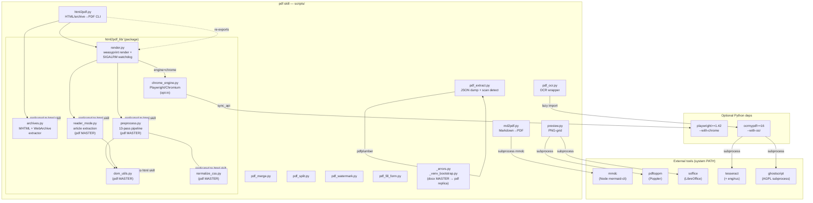

# ARCHITECTURE: pdf skill — create / convert / extract / OCR / merge / split / fill PDF

> **Status:** Shipped (Proprietary, All Rights Reserved).
> **License:** LicenseRef-Proprietary — governed by `skills/pdf/LICENSE` and `skills/pdf/NOTICE`.
> **Tier:** 2 (script-first for stable operations; prompt-first for extraction composition and form filling).
> **Replication role:** pdf is a *replica target* for `_errors.py`, `preview.py`, and `_venv_bootstrap.py` (master = docx; 4-skill loop). pdf is the *master* for the `html2pdf_lib/` cleaning cluster (`archives.py`, `reader_mode.py`, `preprocess.py`, `dom_utils.py`, `normalize_css.py`) that the `html` skill replicates FROM pdf. `render.py`, `chrome_engine.py`, and `html2pdf_lib/__init__.py` are pdf-only; they are NOT replicated to `html`.
> **Optional-dependency tiers:** base (weasyprint/pypdf/pdfplumber/markdown2/reportlab/Pillow) · chrome (`playwright>=1.42,<2.0` + bundled Chromium ~150 MB, via `install.sh --with-chrome`) · OCR (`ocrmypdf>=16` + system tesseract+eng/rus+ghostscript, via `install.sh --with-ocr`).
> **Tasks:** 013 (pdf-12: `pdf_extract.py` + `references/pdf-to-markdown.md`), 014 (pdf-7: PDF outline/bookmarks for weasyprint and Chrome), 018 (pdf-4: `pdf_ocr.py`).

---

## 1. Purpose and Scope

The pdf skill gives agents a small, deterministic set of CLIs that cover the common PDF lifecycle:

- **Render** Markdown or HTML/web-archives to typeset PDF.
- **Manipulate** existing PDFs: merge, split, watermark, fill AcroForm forms.
- **Extract** per-page text and tables as structured JSON; detect scanned/image-only documents with a loud signal.
- **OCR** scanned PDFs into searchable PDFs (soft-optional engine).
- **Preview** any PDF (or peer-skill OOXML file) as a PNG-grid thumbnail.

The skill deliberately does NOT ship:
- A finished PDF-to-Markdown converter (`pdf2md.py`). Markdown composition — heading levels, reading order across multi-column layouts, cross-page table stitching — is agent judgement. `pdf_extract.py` produces a structured dump; the final Markdown is the caller's responsibility.
- A bundled OCR engine. `pdf_ocr.py` wraps the system `ocrmypdf`/tesseract/ghostscript toolchain; if those are absent it fails loud with remediation hints.
- XFA form filling. AcroForm is supported; XFA (Adobe LiveCycle) is detected and refused with a clear message.
- Remote resource fetching in the HTML-to-PDF path. The offline URL fetcher refuses `http`/`https` from weasyprint; the Chrome engine blocks network by default.

---

## 2. Functional Architecture

| Capability | Entry-point script | Runtime dependencies | Notes |
|---|---|---|---|
| Markdown → PDF | `scripts/md2pdf.py` | weasyprint, markdown2, (mmdc + katex optional) | Mermaid blocks pre-rendered to PNG via `mmdc` (Node); SHA1 cache per diagram + config; bundled `mermaid-config.json` for Cyrillic-capable font stack. Inline `$…$` / display `$$…$$` math pre-rendered to MathML via the bundled KaTeX (`katex_render.js`, one Node batch; weasyprint typesets MathML natively, runs no JS) — currency/`$`-in-code untouched; `--no-math`/`--strict-math`; both Node tools degrade gracefully when absent. PDF carries navigable outline from h1–h6 headings. |
| HTML / web-archive → PDF | `scripts/html2pdf.py` | weasyprint OR playwright (opt-in), html2pdf_lib/ | Handles `.html`, `.mhtml`/`.mht`, `.webarchive`. 13-pass preprocessing pipeline; reader-mode; archive subframe selection (`--archive-frame main/N/all/auto`); SIGALRM watchdog (default 180 s); `--engine chrome` opt-in for SPA/Material3/heavy-CSS. PDF carries outline from headings. |
| Merge PDFs | `scripts/pdf_merge.py` | pypdf | Bookmark-preserving; each source is nested under a top-level entry named after the source's stem. |
| Split PDF | `scripts/pdf_split.py` | pypdf | Three modes: named ranges (`--ranges`), one-per-page (`--each-page`), fixed-size chunks (`--every N`); 1-indexed pages. |
| Watermark PDF | `scripts/pdf_watermark.py` | reportlab, pypdf, Pillow | Text or image stamp; five corner/center presets + diagonal (six total); per-mediabox overlay caching for heterogeneous decks; selective page ranges. |
| Fill AcroForm | `scripts/pdf_fill_form.py` | pypdf | Three modes: `--check` (form-type triage, exit 0/11/12), `--extract-fields` (field schema JSON), fill mode (DATA.json → OUT.pdf, optional `--flatten`). XFA detected and refused. |
| Extract text + tables (JSON dump) | `scripts/pdf_extract.py` | pdfplumber | Structured per-page dump (NOT Markdown). Scan detection: exits 10 (`DocumentScanned`) when whole document is image-only. Font-relative word-split (`--x-tolerance-ratio`, default 0.15) for LaTeX/academic PDFs. |
| OCR scanned PDF | `scripts/pdf_ocr.py` | ocrmypdf (soft-optional), tesseract, ghostscript | Overlays invisible text layer on raster pages. Default `eng+rus`. `--skip-text` default skips pages that already have a text layer. Soft-optional: absent engine → `OcrEngineUnavailable` envelope. |
| Preview as PNG-grid | `scripts/preview.py` | Pillow, Poppler (`pdftoppm`), LibreOffice for OOXML | Byte-identical across all four office skills. `.pdf` → Poppler directly; `.docx`/`.xlsx`/`.pptx` → LibreOffice → Poppler. |

---

## 3. System Architecture

### 3.1 Module / file layout

```
skills/pdf/
  SKILL.md                          # agent-facing capability doc and contract
  LICENSE / NOTICE                  # Proprietary, All Rights Reserved
  scripts/
    md2pdf.py                       # Markdown → PDF via weasyprint + markdown2
    html2pdf.py                     # HTML/archive → PDF CLI (thin shim over html2pdf_lib/)
    pdf_extract.py                  # PDF → per-page JSON dump; scan detection (exit 10)
    pdf_ocr.py                      # OCR scanned PDF via ocrmypdf (soft-optional)
    pdf_merge.py                    # merge PDFs, preserve bookmarks
    pdf_split.py                    # split by ranges / per-page / chunks
    pdf_watermark.py                # stamp text or image watermark (reportlab + pypdf)
    pdf_fill_form.py                # AcroForm inspect / extract / fill / flatten
    preview.py                      # INPUT → PNG-grid renderer (replicated, docx master)
    _errors.py                      # --json-errors envelope helper (replicated, docx master)
    _venv_bootstrap.py              # re-exec into scripts/.venv (replicated, docx master)
    mermaid-config.json             # bundled Mermaid theme (Cyrillic-capable font stack)
    katex_render.js                 # batch TeX → MathML for md2pdf math (Node, trust:false)
    requirements.txt                # base deps: pypdf, pdfplumber, weasyprint, markdown2, reportlab, Pillow
    requirements-chrome.txt         # opt-in: playwright>=1.42,<2.0
    requirements-ocr.txt            # opt-in: ocrmypdf>=16
    install.sh                      # bootstrap venv; --with-chrome; --with-ocr
    package.json                    # mmdc (mermaid-cli) local Node install
    html2pdf_lib/                   # HTML preprocessing + render package (pdf is MASTER for cleaning cluster)
      __init__.py                   # re-exports: ChromeEngineUnavailable, RenderTimeout, SUPPORTED_ENGINES, SUPPORTED_EXTENSIONS, convert
      render.py                     # weasyprint + chrome dispatch; _offline_url_fetcher; SIGALRM watchdog; RenderTimeout
      chrome_engine.py              # headless Chromium via Playwright; render_chrome(); ChromeEngineUnavailable
      archives.py                   # MHTML + WebArchive extraction; FrameInfo; subframe selection
      preprocess.py                 # 13-pass HTML preprocessing pipeline (pdf MASTER → html replica)
      reader_mode.py                # article extraction (pdf MASTER → html replica)
      dom_utils.py                  # depth-tracked regex DOM helpers (pdf MASTER → html replica)
      normalize_css.py              # NORMALIZE_CSS injected string (pdf MASTER → html replica)
    tests/
      test_battery.py               # data-driven fixture battery for html2pdf (6 synthetic + 6 platform slices)
      battery_signatures.json       # per-fixture page-count / size / needle assertions
      capture_signatures.py         # auto-capture tool for adding new platform fixtures
      _acroform_fixture.py          # build-at-runtime AcroForm PDF builder
      _outline_probe.py             # outline/bookmarks probe for test assertions
      fixtures/platforms/           # 6 stripped real-platform HTML slices (Mintlify, GitBook, etc.)
  references/
    library-selection.md            # which PDF library for which task
    pdf-to-markdown.md              # PDF→Markdown decision tree and recipe
    forms.md                        # AcroForm vs XFA, filling, flattening
    html-conversion.md              # html2pdf.py deep-dive: preprocessing, reader-mode, per-platform notes
    weasyprint-setup.md             # weasyprint native-library install notes; @page recipes
    ocr.md                          # OCR install, languages, workflow
  examples/
    fixture.md                      # standard Markdown fixture for smoke testing
    fixture-mermaid-*.md            # Mermaid diagram fixtures (cyrillic, sequence, gantt, etc.)
```

### 3.2 Runtime model

The pdf skill uses three distinct runtime models depending on the operation:

**Pure Python** (`pdf_merge.py`, `pdf_split.py`, `pdf_watermark.py`, `pdf_fill_form.py`, `pdf_extract.py`): stdlib + pypdf/pdfplumber/reportlab/Pillow inside the per-skill `.venv`. No subprocess, no external tools.

**Python + Node subprocess** (`md2pdf.py`): weasyprint runs in Python; mermaid blocks spawn `mmdc` (Node, from `scripts/node_modules/.bin/mmdc`). mmdc is optional — without it, mermaid blocks degrade to code blocks unless `--strict-mermaid` is set.

**Python + system Poppler** (`preview.py`): Python orchestration; `pdftoppm` (Poppler) is a subprocess for rasterisation; `soffice` (LibreOffice) is a subprocess for OOXML inputs before rasterisation.

**Python + Playwright/Chromium** (`html2pdf.py --engine chrome`): Playwright `sync_api` drives a bundled headless Chromium. Opt-in; `ChromeEngineUnavailable` is raised and reported if `playwright` is not installed. Network is blocked at the route level.

**Python + ocrmypdf/tesseract/ghostscript** (`pdf_ocr.py`): `ocrmypdf` is a Python library (lazy import) that orchestrates tesseract and ghostscript as subprocesses. All three must be present; absent → `OcrEngineUnavailable`. ghostscript is AGPL-3.0 and deliberately kept as a non-bundled, separate-process dependency.

### 3.3 Component diagram



---

## 4. Data Model / Intermediate Representations

### 4.1 HTML preprocessing pipeline (html2pdf)

Input HTML passes through `preprocess.preprocess_html()` before weasyprint render (weasyprint engine only; Chrome skips this):

1. `_fix_light_dark` — resolve CSS `light-dark()` to the light variant.
2. `_strip_external_stylesheets` — remove `<link rel="stylesheet" href="https://...">` (offline guard).
3. `_strip_all_fontfaces_in_styles` — strip `@font-face` blocks from all `<style>` elements (CDN subset fonts produce garbled glyphs); the inner CSS helper it wraps is `strip_all_fontfaces`.
4. `_strip_problematic_calc` — remove `calc()` expressions that confuse weasyprint's layout engine.
5. `_strip_html_comments` — remove HTML comments (can carry large inlined data blocks).
6. `_strip_universal_chrome` — remove browser-chrome boilerplate elements (nav bars, sidebars, etc.).
7. `_strip_interactive_chrome` — remove interactive elements (`<button>`, `<input>`, etc.) irrelevant in print.
8. `_strip_icon_svgs` — remove icon-font and inline SVG icon tags.
9. `_strip_empty_anchor_links` — remove `<a>` tags with no visible content (perf guard).
10. `_flatten_table_code_blocks` — unwrap Fern/Mintlify shiki table-based code blocks to `<pre><code>`.
11. `_strip_universal_ads` — remove ad network and analytics `<script>`/`<link>` tags.
12. `_fo_to_svg_text` — convert draw.io/Confluence `<foreignObject>` labels to SVG `<text>`.
13. `_fix_svg_viewport` — synthesise `viewBox` on SVGs that lack one.
14. Inject `NORMALIZE_CSS` into `<head>` — print-normalisation stylesheet (body/overflow fixes, ARIA-role tables, etc.).
15. Return preprocessed HTML string.

### 4.2 Archive extraction (archives.py)

Both MHTML (MIME multipart via `email`) and WebArchive (Apple binary plist via `plistlib`) are extracted to a caller-supplied temporary directory. Sub-resources are rewritten to local filenames; remote `@font-face` declarations are stripped from CSS. Returns `(html_text: str, base_url: str)` ready for `render.convert()`.

The `FrameInfo` dataclass carries `index`, `kind` (`"main"` or `"subframe"`), `substantial` (bool), `bytes`, `scripts`, `text_len`, and `url`. The `--list-frames` flag surfaces this inventory for human inspection and downstream `awk` parsing.

### 4.3 pdf_extract.py JSON output schema

```json
{
  "page_count": <int>,
  "doc_scanned": <bool>,
  "scanned_pages": [<1-indexed int>, ...],
  "pages": [
    {
      "n": <1-indexed int>,
      "text": "<str>",
      "tables": [[[<cell_str|null>, ...], ...], ...],
      "char_count": <int>,
      "has_images": <bool>,
      "scanned": <bool>
    }
  ]
}
```

`doc_scanned` is `true` only when at least one page is `scanned` AND no page yields meaningful text. A fully blank PDF (no text, no images) is NOT `doc_scanned` — it exits 0. `tables` is the raw `extract_tables()` result (list of row-lists of cell strings; `null` for empty cells).

### 4.4 --json-errors envelope

All scripts share the `_errors.py` envelope (schema `v=1`):

```json
{"v": 1, "error": "<message>", "code": <int>, "type": "<ErrorClass>", "details": {}}
```

`type` and `details` are optional. `code` is never 0 (a `code=0` call is coerced to 1 with a warning). argparse usage errors are routed through the same envelope as `type:"UsageError"`, `code:2`.

---

## 5. Interfaces

### 5.1 CLI surface

| Command | Key flags | Exit codes |
|---|---|---|
| `python3 scripts/md2pdf.py INPUT.md OUTPUT.pdf` | `--page-size letter\|a4\|legal`, `--css`, `--base-url`, `--no-mermaid`, `--strict-mermaid`, `--mermaid-config PATH`, `--no-mermaid-config`, `--json-errors` | 0 ok, 1 fail, 4 strict-mermaid fail |
| `python3 scripts/html2pdf.py INPUT OUTPUT.pdf` | `--page-size`, `--css`, `--base-url`, `--no-default-css`, `--reader-mode`, `--archive-frame main\|N\|all\|auto`, `--list-frames`, `--timeout SECONDS`, `--engine weasyprint\|chrome`, `--chrome-js`, `--untrusted`, `--json-errors` | 0 ok, 1 fail (incl. ChromeEngineUnavailable/RenderTimeout/NoSubstantialFrames/FrameIndexOutOfRange), 2 usage, 6 SelfOverwriteRefused |
| `python3 scripts/pdf_merge.py OUTPUT.pdf INPUT1.pdf ...` | `--json-errors` | 0 ok, 1 fail |
| `python3 scripts/pdf_split.py INPUT.pdf --ranges "..."` | `--each-page OUTDIR/`, `--every N OUTDIR/`, `--json-errors` | 0 ok, 1 invalid range/pypdf error |
| `python3 scripts/pdf_watermark.py INPUT.pdf OUTPUT.pdf` | `--text TEXT` or `--image STAMP.png`, `--opacity`, `--position center\|top-left\|top-right\|bottom-left\|bottom-right\|diagonal`, `--rotation`, `--font-size`, `--color`, `--scale`, `--pages "all"\|"1-5,8"`, `--json-errors` | 0 ok, 1 fail, 2 usage, 6 SelfOverwriteRefused |
| `python3 scripts/pdf_fill_form.py --check INPUT.pdf` | `--extract-fields INPUT.pdf -o FIELDS.json`, fill mode `INPUT.pdf DATA.json -o OUT.pdf [--flatten]`, `--json-errors` | 0 AcroForm, 10 fill error, 11 XFA, 12 no-form |
| `python3 scripts/pdf_extract.py INPUT.pdf` | `-o OUT.json`, `--layout`, `--password PW`, `--x-tolerance-ratio R`, `--json-errors` | 0 ok, 1 fail, 2 usage, 6 SelfOverwrite, 10 DocumentScanned |
| `python3 scripts/pdf_ocr.py INPUT.pdf OUTPUT.pdf` | `--lang eng+rus`, `--skip-text\|--redo-ocr\|--force-ocr`, `--sidecar PATH.txt`, `--jobs N`, `--password PW`, `--deskew`, `--rotate-pages`, `--clean`, `--json-errors` | 0 ok, 1 fail (OcrEngineUnavailable/LanguagePackMissing/EncryptedInput/etc.), 2 usage, 6 SelfOverwriteRefused |
| `python3 scripts/preview.py INPUT OUTPUT.jpg` | `--cols 3`, `--dpi 110`, `--gap 12`, `--padding 24`, `--label-font-size 14`, `--soffice-timeout 240`, `--pdftoppm-timeout 60`, `--json-errors` | 0 ok, 1 fail |

### 5.2 Environment variables

| Variable | Default | Consumer |
|---|---|---|
| `HTML2PDF_TIMEOUT` | `180` | `html2pdf.py` — render watchdog seconds; `0` disables |

### 5.3 Exit-code constants (cross-script)

- `0` — success
- `1` — domain failure (discriminated by `type` in the `--json-errors` envelope)
- `2` — usage / argparse error
- `6` — `SelfOverwriteRefused` (output path resolves to the input path, shared guard)
- `10` — `DocumentScanned` (exclusive to `pdf_extract.py`; ocr remediation hop)
- `11` — XFA form detected (exclusive to `pdf_fill_form.py`)
- `12` — no form present (exclusive to `pdf_fill_form.py`)

---

## 6. Cross-cutting Concerns

### 6.1 Shared helpers — replication

Three files are byte-identical across all four office skills (`docx`, `xlsx`, `pptx`, `pdf`); docx is the master:

- `_errors.py` — `--json-errors` envelope helper (schema `v=1`). All eight pdf CLIs use it.
- `preview.py` — universal PNG-grid renderer.
- `_venv_bootstrap.py` — re-exec into `scripts/.venv` so `python3 scripts/X.py` always finds the venv regardless of the active interpreter.

The pdf skill does NOT have `_soffice.py` or `office/` — those are OOXML-only (docx/xlsx/pptx master). `office_passwd.py` is absent from pdf for the same reason (pdf encryption is handled directly by `pypdf.PdfWriter.encrypt`, not by the OOXML msoffcrypto path).

### 6.2 html2pdf_lib/ — pdf is MASTER, html is replica

`preprocess.py`, `reader_mode.py`, `dom_utils.py`, `normalize_css.py`, and `archives.py` are physically duplicated to `skills/html/scripts/web_clean/`. Any change to these modules MUST be made on the pdf copy first, then replicated to html. The `diff -q` gate is enforced by `skills/html/scripts/tests/test_e2e.sh`.

`render.py`, `chrome_engine.py`, and `html2pdf_lib/__init__.py` are pdf-only. They carry weasyprint and playwright module-level imports and must NEVER be replicated to `html` (which must not import those libraries).

### 6.3 Dependency tiers

| Tier | Installed by | Python packages | System tools |
|---|---|---|---|
| base | `bash install.sh` | pypdf, pdfplumber, weasyprint, markdown2, reportlab, Pillow | pango, cairo, gdk-pixbuf (weasyprint native runtime) |
| chrome | `bash install.sh --with-chrome` | playwright>=1.42,<2.0 (+ bundled Chromium ~150 MB) | none additional |
| ocr | `bash install.sh --with-ocr` | ocrmypdf>=16 (+ pikepdf, Pillow transitively) | tesseract + eng/rus traineddata, ghostscript |
| preview (OOXML) | separate, not bundled | — | LibreOffice (`soffice`), Poppler (`pdftoppm`) |
| mermaid | `npm install` in `scripts/` | — | Node.js + mmdc (`@mermaid-js/mermaid-cli`) |

ghostscript is AGPL-3.0-or-later and MUST remain a non-bundled, separate-process dependency (invoked by ocrmypdf via subprocess). Vendoring or patching a `gs` binary into the skill would pull the proprietary skill under AGPL copyleft.

### 6.4 Offline / security invariants

- weasyprint engine: `_offline_url_fetcher` refuses `http`/`https`; only `file://` and `data:` pass through. `--untrusted` mode (`_make_untrusted_url_fetcher`) additionally confines `file://` access to the document's base directory, neutralising local-file-exfiltration from attacker-controlled fetched HTML.
- Chrome engine: network is blocked at the Playwright route level by default. `--chrome-js` is the only flag that enables page JavaScript (off by default to prevent Gmail-class network-error self-destruct and Angular half-hydration). The `<base href>` tag is stripped before handing HTML to Chrome (webarchives carry `<base href="https://orig-site/">` which would route every relative URL to the offline-blocked origin).
- All scripts: operate only on paths named on the command line. No remote fetches in any other CLI.
- `SelfOverwriteRefused` (exit 6) is a cross-script guard: whenever an output path resolves to the input path (including via symlink), the script refuses with a clear message.

---

## 7. Honest Scope and Open Questions

### 7.1 Known limitations (from source comments and module docstrings)

**SIGALRM watchdog (html2pdf / render.py)**
- POSIX only (macOS/Linux). No-op on Windows.
- Fires between Python bytecodes but not while cairo (PDF backend) or lxml (HTML parser) hold the GIL inside C extension calls. A pathological cairo layout that stays in C code for minutes will not be interrupted until that C call returns. Real-world stuck PIDs of 6+ hours observed on vc.ru SPA pages. The watchdog is the last line of defence; the primary fix is site-CSS stripping in `_strip_external_stylesheets`.
- Non-main-thread invocations (`signal.signal()` raises in worker threads) degrade gracefully to no watchdog rather than crashing.

**pdf_extract.py**
- Markdown composition (heading levels, reading order, table stitching, image/diagram description) is agent judgement, never scripted — deliberate and permanent (PDF is positioned glyphs with no semantic model).
- Default `extract_tables()` settings only; borderless-table tuning (`snap_tolerance`, text strategy) requires inline `pdfplumber` code.
- Image bytes are not extracted; only `has_images` (bool) is reported per page.
- `--password` is read from argv (visible in `ps`).
- No global timeout or decompression-bomb hardening; a pathological PDF can hang.

**pdf_ocr.py**
- OCR engine is not bundled. `--password` is argv-only (output is unencrypted — re-encryption is out of scope).
- No global timeout / decompression-bomb hardening beyond what ocrmypdf and ghostscript do themselves.
- `PriorOcrFound` exit is unreachable on the default `--skip-text` path; only `--redo-ocr` / `--force-ocr` can trigger it.

**Chrome engine (html2pdf_lib/chrome_engine.py)**
- Heavyweight: ~150 MB Chromium binary, 1–3 s per-page startup.
- `tagged=True` is a mandatory side-effect of `page.pdf(outline=True, tagged=True)` for Playwright ≥ 1.42 — Chromium only emits an outline when the PDF is tagged; this was discovered empirically during TASK 014 (pdf-7) development and is the reason for the `>=1.42` floor.

**Mermaid (md2pdf.py)**
- Optional: without `mmdc` the fenced blocks degrade to code blocks (unless `--strict-mermaid`).
- Per-run cache keyed on SHA1(diagram body + config fingerprint); a config change or `--mermaid-config` switch invalidates all cached PNGs.

### 7.2 Deferred / out of scope

- PDF-to-Markdown automation (conversion script): permanently out of scope. `pdf_extract.py` is a structured dump; the final Markdown is always the caller's job.
- XFA form filling: refused with exit 11; reauthor the form as AcroForm or use commercial tooling.
- PDF password cracking: `--password` accepts a known password; cracking is out of scope.
- PDF creation from scratch (programmatic): `reportlab` is available as a base dependency for watermark overlays; a bundled `pdf_create.py` is not in scope.
- Multi-column reading-order reconstruction: `--layout` pass-through exposes column separation as whitespace; re-flowing columns into logical order is agent judgement.
- Re-encryption of OCR'd output: `pdf_ocr.py` output is always unencrypted.
