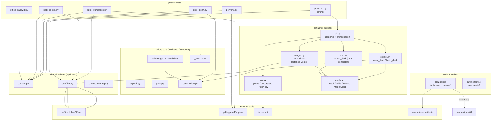

# ARCHITECTURE: pptx skill — PowerPoint .pptx create / edit / convert / preview / clean

> **Status:** Shipped (all capabilities live in production code)
> **License:** Proprietary, All Rights Reserved
> **Skill tier:** 2
> **Tasks realised:** TASK 020 (`pptx2md` — deck → Markdown), TASK 021 (`--ocr-denoise` noise reduction)
> **Replication role:** pptx is a *consumer* of the office/ core (master = docx). All files under
> `scripts/office/`, `scripts/_soffice.py`, `scripts/_errors.py`, `scripts/preview.py`, and
> `scripts/_venv_bootstrap.py` are byte-identical copies maintained by the docx→pptx replication
> protocol in `CLAUDE.md §2`. `scripts/office_passwd.py` is byte-identical across the three OOXML
> skills (docx master). The `pptx2md/` package and all `pptx_*.py` scripts are pptx-specific and
> are NOT replicated.

---

## 1. Purpose & Scope

The pptx skill provides a stable, agent-safe scripted layer for every common PowerPoint operation.
Direct in-agent `pptxgenjs` or `python-pptx` calls regress on typography, layout padding, and bullet
density; the skill's scripts encode those lessons once and keep them frozen across agent sessions.

**What it does:**

- Generate `.pptx` decks from Markdown (`md2pptx.js`, built-in renderer or via `marp-slide` skill).
- Produce a slide-skeleton from a heading-only outline (`outline2pptx.js`).
- Convert a `.pptx`/`.pptm` deck back into structured Markdown (`pptx2md.py`), including sidecar
  image extraction, speaker notes, GFM tables, and opt-in per-image OCR with noise reduction.
- Export to PDF via headless LibreOffice (`pptx_to_pdf.py`).
- Generate a labelled thumbnail-grid JPEG for rapid visual QA (`pptx_thumbnails.py`).
- Drop orphan parts (slides, media, charts, themes) after manual edits via BFS over the `.rels`
  graph (`pptx_clean.py`).
- Unpack / patch / repack raw OOXML for changes not covered by high-level APIs (`office/unpack.py`,
  `office/pack.py`).
- Structurally validate a `.pptx` including the PresentationML graph: slide chain, layout/master
  chain, media refs, notes reciprocity, slide-ID uniqueness (`office/validate.py` + `PptxValidator`).
- Render any office file as a PNG-grid preview (`preview.py`).
- Set, remove, or detect password protection via MS-OFB Agile encryption (`office_passwd.py`).
- Reject encrypted/legacy CFB inputs early with a clear message (exit 3) and detect macros.

**What it deliberately does NOT do:**

- SmartArt extraction in `pptx2md`: python-pptx has no reliable SmartArt detector; SmartArt
  `graphicFrame` shapes are silently skipped (v1 documented limitation, not a `Placeholder`).
- Generate slide masters or custom themes from scratch (use `office/unpack.py` + hand-edit +
  `office/pack.py`).
- Fetch remote images in `md2pptx.js` unless the user explicitly provides a URL; only local paths
  relative to the `.md` file are supported by default.
- OCR whole pages (the `pdf` skill owns that path via `ocrmypdf`); `pptx2md --ocr` calls `tesseract`
  directly per extracted image blob, preserving slide-image structure.
- Provide concurrent same-target write safety in `pptx2md` — the `.partial` → `os.replace` atomic
  write is single-tenant only.

---

## 2. Functional Architecture

| Capability | Entry-point script | Notes |
|---|---|---|
| Markdown → .pptx (built-in) | `scripts/md2pptx.js` | `---`-delimited slides; Mermaid → PNG via `mmdc`; `--via-marp` delegates to sibling `marp-slide` skill |
| Heading-only outline → skeleton .pptx | `scripts/outline2pptx.js` | `#` → title slide, `##` → content + TODO placeholder |
| .pptx/.pptm → structured Markdown | `scripts/pptx2md.py` | Thin shim; body in `pptx2md/` package |
| .pptx → Markdown + per-image OCR | `scripts/pptx2md.py --ocr` | Opt-in; system `tesseract`; `--ocr-denoise` for noise reduction (TASK 021) |
| .pptx → PDF | `scripts/pptx_to_pdf.py` | LibreOffice headless; `--timeout` |
| Thumbnail grid JPEG | `scripts/pptx_thumbnails.py` | pptx → LibreOffice PDF → Poppler → Pillow grid |
| PNG-grid preview (universal) | `scripts/preview.py` | Handles .pptx/.pptm/.docx/.xlsx/.pdf; byte-identical across 4 office skills |
| Drop orphan parts | `scripts/pptx_clean.py` | BFS over `.rels` graph; `--dry-run` previews |
| Unpack OOXML to a directory | `scripts/office/unpack.py` | Shared office/ core; docx is master |
| Repack OOXML from a directory | `scripts/office/pack.py` | Shared office/ core |
| Structural validate | `scripts/office/validate.py` | `PptxValidator` — slide chain, layout/master, media refs, sldId range |
| Password set / remove / detect | `scripts/office_passwd.py` | `--encrypt`, `--decrypt`, `--check`; stdin password via `-`; byte-identical across 3 OOXML skills |
| Machine-readable error envelope | `--json-errors` flag | Available on every Python script; `_errors.py` schema `v=1` |

---

## 3. System Architecture

### 3.1 File / Module Layout

```
skills/pptx/
├── SKILL.md                         # agent contract + capability index
├── LICENSE / NOTICE                 # Proprietary, All Rights Reserved
├── references/
│   ├── design-principles.md         # typography, colour, bullet density rules
│   ├── editing-workflow.md          # python-pptx vs unpack/patch/pack dispatch
│   └── pptxgenjs-basics.md          # pptxgenjs API primer for step-out cases
├── examples/
│   └── fixture-slides.md            # 6-slide Markdown fixture for smoke tests
└── scripts/
    ├── md2pptx.js                   # Markdown → .pptx (Node.js, pptxgenjs)
    ├── outline2pptx.js              # Heading-only outline → skeleton .pptx (Node.js, pptxgenjs)
    ├── pptx2md.py                   # CLI shim → delegates to pptx2md/ package
    ├── pptx2md/                     # pptx → Markdown converter (Python, TASK 020/021)
    │   ├── __init__.py              # Public surface re-export: main, convert, _AppError subclasses
    │   ├── cli.py                   # argparse, path resolution, pipeline orchestration
    │   ├── model.py                 # Frozen dataclasses: Deck / Slide / Block union / side tables
    │   ├── extract.py               # python-pptx → document model (open_deck, build_deck)
    │   ├── images.py                # safe_image_meta, materialise, rasterise_vector, _prerender_vectors
    │   ├── ocr.py                   # probe, ocr_asset, _filter_tsv (tesseract, opt-in)
    │   ├── emit.py                  # render_deck — pure generator; model → Markdown
    │   ├── exceptions.py            # _AppError, SelfOverwriteRefused, OcrEngineUnavailable, etc.
    │   ├── .AGENTS.md               # Per-directory agent guide
    │   └── tests/                   # unit + E2E tests (test_surface, test_extract, test_images, test_emit_cli, test_ocr, test_ocr_denoise)
    ├── pptx_clean.py                # Orphan-parts remover (BFS over .rels)
    ├── pptx_thumbnails.py           # Thumbnail-grid generator (LibreOffice + Poppler + Pillow)
    ├── pptx_to_pdf.py               # PDF export (LibreOffice wrapper)
    ├── mermaid-config.json          # Bundled mmdc config (Cyrillic-capable font stack)
    ├── package.json                 # Node deps: pptxgenjs ^3.12, marked ^12, @mermaid-js/mermaid-cli ^11.4, image-size ^2
    ├── requirements.txt             # Python deps: python-pptx, Pillow, lxml, defusedxml, msoffcrypto-tool
    │
    │ — Replicated from docx master (byte-identical, diff -q gated) —
    ├── _errors.py                   # --json-errors envelope helper (schema v=1)
    ├── _soffice.py                  # LibreOffice subprocess wrapper (SofficeError, convert_to, find_soffice)
    ├── _venv_bootstrap.py           # Self-bootstrap into scripts/.venv before heavy imports
    ├── preview.py                   # Universal INPUT → PNG-grid renderer (4-skill replicated)
    ├── office_passwd.py             # Password set/remove/detect via msoffcrypto-tool (3-OOXML replicated)
    └── office/                      # OOXML core (byte-identical copy from docx master)
        ├── unpack.py                # ZIP → directory tree
        ├── pack.py                  # Directory tree → ZIP
        ├── validate.py              # CLI validator (dispatches to validators/pptx.py)
        ├── _encryption.py           # EncryptedFileError, assert_not_encrypted (CFB detection)
        ├── _macros.py               # warn_if_macros_will_be_dropped
        ├── validators/
        │   ├── base.py              # BaseSchemaValidator, ValidationReport
        │   ├── pptx.py              # PptxValidator (slide chain, layout/master, media refs, sldId, notes)
        │   ├── docx.py              # (docx-specific; present in the replicated copy)
        │   └── xlsx.py              # (xlsx-specific; present in the replicated copy)
        ├── helpers/
        │   ├── merge_runs.py        # Run-merge helper
        │   └── simplify_redlines.py # Redline simplifier
        ├── shim/                    # AF_UNIX socket shim for sandbox LibreOffice start
        │   ├── lo_socket_shim.c     # C source; honest-scope: single-process only (no cross-process IPC)
        │   └── liblo_socket_shim.dylib  # Pre-built macOS dylib
        └── schemas/                 # Optional ECMA-376 / W3C XSDs for validate.py --schemas-dir
```

### 3.2 Runtime Model

| Script | Runtime | External tool dependencies |
|---|---|---|
| `md2pptx.js` | Node.js (pptxgenjs, marked) | `mmdc` optional (Mermaid); `marp-slide` skill optional (`--via-marp` → LibreOffice) |
| `outline2pptx.js` | Node.js (pptxgenjs) | None |
| `pptx2md.py` | Python (.venv: python-pptx, Pillow, lxml) | `tesseract` soft-optional (`--ocr`); LibreOffice soft-optional (WMF/EMF rasterisation) |
| `pptx_to_pdf.py` | Python (.venv: Pillow) | `soffice` (LibreOffice), required |
| `pptx_thumbnails.py` | Python (.venv: Pillow) | `soffice` (LibreOffice) + `pdftoppm` (Poppler), required |
| `pptx_clean.py` | Python (.venv: lxml) | None |
| `office/validate.py` | Python (.venv: lxml) | None (XSDs optional) |
| `preview.py` | Python (.venv: Pillow) | `soffice` + `pdftoppm`, required |
| `office_passwd.py` | Python (.venv: msoffcrypto-tool) | None |

### 3.3 Component Diagram



---

## 4. Data Model / Intermediate Representations

### 4.1 pptx2md Document Model (`pptx2md/model.py`)

The converter follows a strict pipeline `extract → images → (ocr) → emit` over an explicit
in-memory model. Decoupling extraction from emission makes the output deterministic and lets
`emit.py` be tested as a pure function over data.

```
Deck
├── slides: list[Slide]
│   └── Slide
│       ├── index: int          # 1-based, presentation order
│       ├── blocks: list[Block] # ordered content items
│       │   ├── Heading(level, text)             # title → level=3
│       │   ├── Bullets(items=[BulletItem(level, text)])
│       │   ├── Table(rows: list[list[str]])      # rows[0] = header; cells GFM-escaped
│       │   ├── ImageRef(slide, shape, sha1, ext, alt)  # sha1 pointer into Deck.blobs
│       │   └── Placeholder(slide, shape, kind, note)   # chart / image / media / unclassifiable / unreadable
│       └── notes: str | None   # speaker notes
├── source_name: str
└── blobs: dict[sha1 → (bytes, content_type)]   # raw image side table; deduped by sha1
```

Side tables materialised after extraction:

| Side table | Type | Key | Role |
|---|---|---|---|
| `assets` | `dict[ImageRef → MediaAsset \| PlaceholderAsset]` | `ImageRef` object | Resolved sidecar files; built by `images.materialise` |
| `ocr_text` | `dict[MediaAsset → str]` | `MediaAsset` object | OCR text per unique image; built by `cli._build_ocr_text`; empty when `--ocr` absent |

**Key invariant:** `ImageRef` is a pure pointer (`sha1`). The actual bytes live in `Deck.blobs`
(one entry per distinct sha1, aliasing the python-pptx in-memory blob, not a copy). `materialise`
writes the bytes once per sha1 — duplicate images across slides share one sidecar file and one
`MediaAsset`.

### 4.2 Sidecar media convention

- Media directory: `<output-stem>.media/` alongside the `.md` (file mode) or `<input-stem>.media/`
  under CWD (stdout mode); overridable via `--media-dir`.
- Filename: `slide{N}-img{M}.{ext}` — N = slide index (1-based), M = per-slide picture ordinal
  (first-occurrence, dedup tie-break). Extension comes from python-pptx's `Image.ext` (routed
  through Pillow); WMF/EMF vectors are pre-rendered to `.png` via LibreOffice.
- Links in the emitted Markdown: POSIX-relative from the `.md` (or CWD) to the sidecar dir.

### 4.3 md2pptx theme object (`md2pptx.js`)

`DEFAULT_THEME` (the `Charcoal Minimal` palette) is a plain JS object; `--theme PATH` shallow-merges (top-level key spread — a supplied role object replaces the default for that key)
a user JSON file on top. It carries font/size/colour specs for `heading`, `subheading`, `body`,
`code`, `quote`, and `caption` roles, plus palette tokens `bg`, `fg`, `muted`, `accent`,
`accentLight`. `scaledTheme()` adapts body font size down from 15 pt toward 11 pt as character
count in a slide's tokens exceeds 800 chars (empirical overflow prevention).

---

## 5. Interfaces

### 5.1 CLI surface

All Python scripts accept `--json-errors`; all exit non-zero on failure.

**`pptx2md.py`** — deck → Markdown

```
python3 scripts/pptx2md.py INPUT.pptx [OUTPUT.md|-]
    [--no-images] [--media-dir DIR] [--no-notes] [--include-hidden]
    [--ocr] [--ocr-lang LANGS] [--jobs N] [--ocr-timeout SEC]
    [--ocr-denoise] [--ocr-min-px N] [--ocr-min-confidence C]
    [--json-errors]
```

Exit codes: `0` ok · `1` bad-input/OCR-engine/internal · `2` usage · `3` encrypted-or-legacy-CFB
· `6` self-overwrite refused.

**`md2pptx.js`** — Markdown → .pptx

```
node scripts/md2pptx.js INPUT.md OUTPUT.pptx
    [--size 16:9|4:3] [--theme PATH]
    [--via-marp] [--marp-theme NAME]
    [--mermaid-config PATH | --no-mermaid-config]
```

Exit codes: `0` ok · `1` bad args / missing input / pptxgenjs failure · `2` = --via-marp requested but marp-slide skill not found.

**`outline2pptx.js`** — outline → skeleton .pptx

```
node scripts/outline2pptx.js INPUT.md OUTPUT.pptx [--size 16:9|4:3] [--theme PATH]
```

**`pptx_to_pdf.py`** — PDF export

```
python3 scripts/pptx_to_pdf.py INPUT.pptx [OUTPUT.pdf] [--timeout 180] [--json-errors]
```

**`pptx_thumbnails.py`** — thumbnail grid

```
python3 scripts/pptx_thumbnails.py INPUT.pptx OUTPUT.jpg
    [--cols 3] [--dpi 110] [--gap 12] [--padding 24] [--label-font-size 14]
    [--json-errors]
```

**`pptx_clean.py`** — orphan-parts remover

```
python3 scripts/pptx_clean.py INPUT.pptx [--output OUT.pptx] [--dry-run] [--json-errors]
```

Prints a JSON report: `{input, kept, removed, removed_files, dry_run, output}`.

**`office/validate.py`** — structural validator

```
python3 scripts/office/validate.py INPUT.pptx [--json] [--strict] [--schemas-dir PATH]
```

Exit codes: `0` ok · `1` errors (or warnings under `--strict`) · `2` missing/unknown input ·
`3` CFB container.

**`office/unpack.py`** / **`office/pack.py`**

```
python3 scripts/office/unpack.py INPUT.pptx OUTDIR/
python3 scripts/office/pack.py   INDIR/     OUTPUT.pptx
```

**`preview.py`** — universal PNG-grid renderer

```
python3 scripts/preview.py INPUT OUTPUT.jpg
    [--cols 3] [--dpi 110] [--gap 12] [--padding 24]
    [--label-font-size 14] [--soffice-timeout 240] [--pdftoppm-timeout 60]
    [--json-errors]
```

**`office_passwd.py`** — password management

```
python3 scripts/office_passwd.py INPUT [OUTPUT] (--encrypt PASSWORD | --decrypt PASSWORD | --check)
```

Exit codes: `0` success / `--check` encrypted · `1` generic · `2` usage · `3` missing dep ·
`4` wrong password · `5` state mismatch · `6` same-path refused · `10` `--check` clean ·
`11` file not found.

### 5.2 --json-errors envelope

Every Python CLI emits failures as a single JSON line on stderr when `--json-errors` is present:

```json
{"v": 1, "error": "<message>", "code": <int>, "type": "<ErrorClass>", "details": {...}}
```

`v=1` is the current schema version. `type` and `details` are optional. argparse usage errors are
routed through the same envelope (monkey-patched `parser.error`). Implemented in the replicated
`_errors.py`.

---

## 6. Cross-cutting Concerns

### 6.1 Shared office/ core

The `office/` directory is a byte-identical copy of the docx master. It provides:

- `office/unpack.py` + `office/pack.py` — ZIP ↔ directory round-trip (safe OOXML editing).
- `office/validate.py` — dispatches to `validators/pptx.PptxValidator` for PresentationML-specific
  checks: slide chain (sldIdLst → .rels → slide files), slide-ID uniqueness and ECMA-376 range
  (256–2147483647), layout/master chain, media references (`a:blip`, `p:videoFile`), notes
  reciprocity, orphan slide detection. Package-layout allow-list (`[Content_Types].xml`, `_rels/`,
  `ppt/`, `docProps/`, `customXml/`) is enforced as a warning (promoted to exit 1 under `--strict`).
- `office/_encryption.py` — `assert_not_encrypted` / `EncryptedFileError`: uniform CFB pre-flight
  used by `pptx2md.py`, `pptx_to_pdf.py`, `pptx_thumbnails.py`, and `pptx_clean.py`.
- `office/_macros.py` — `warn_if_macros_will_be_dropped` used by `pptx_clean.py`.
- `office/shim/` — AF_UNIX socket shim for sandbox LibreOffice startup. Honest-scope: the shim
  is single-process only; it does NOT provide cross-process IPC (documented in the C source
  file-level comment and locked by `TestShimCrossProcessIPCLimitation`).

Cross-reference: the office/ core is shared with `docx`, `xlsx`, and `pdf` (docx is always master).
A detailed description of the office/ module internals belongs in a future dedicated chunk.

### 6.2 Shared helper scripts (replicated)

| File | Replicated scope | Role |
|---|---|---|
| `_errors.py` | 4-skill: docx / xlsx / pptx / pdf | `--json-errors` envelope, `add_json_errors_argument`, `report_error` |
| `_soffice.py` | 3-skill: docx / xlsx / pptx | `find_soffice`, `convert_to`, `SofficeError`; AF_UNIX shim detection |
| `_venv_bootstrap.py` | 5-skill: docx / xlsx / pptx / pdf / html | Self-bootstrap into `.venv` before heavy imports; makes bare `python3 scripts/foo.py` behave like `.venv/bin/python` |
| `preview.py` | 4-skill: docx / xlsx / pptx / pdf | Universal PNG-grid renderer (soffice + Poppler) |
| `office_passwd.py` | 3-OOXML: docx / xlsx / pptx | MS-OFB Agile password management |

Editing any of these files requires following the replication protocol in `CLAUDE.md §2`: edit only
the docx copy, run tests, replicate, verify `diff -q` silence, re-run all affected validators.

### 6.3 pptx2md — pptx-specific, not replicated

`scripts/pptx2md.py` and the entire `scripts/pptx2md/` package are pptx-specific. They consume
`_errors.py` and `office/_encryption.py` by read-only import. No replication is triggered by
changes to `pptx2md/`.

### 6.4 Node.js scripts

`md2pptx.js` and `outline2pptx.js` are also pptx-specific. Their Node.js dependencies are
isolated in `scripts/node_modules/` (never global):

- `pptxgenjs` ^3.12 — OOXML assembly
- `marked` ^12 — Markdown lexer
- `@mermaid-js/mermaid-cli` ^11.4 — optional Mermaid → PNG rendering
- `image-size` ^2 — aspect-ratio computation for embedded images

`md2pptx.js` auto-applies `scripts/mermaid-config.json` (Cyrillic-capable font stack) to every
`mmdc` invocation unless `--no-mermaid-config` is passed.

### 6.5 Licensing

The pptx skill is **Proprietary, All Rights Reserved** (same scope as docx, xlsx, pdf). Source is
available for audit only; any use, execution, copying, modification, or distribution requires
prior written permission. See `skills/pptx/LICENSE` and `skills/pptx/NOTICE`.

---

## 7. Honest Scope & Open Questions

### 7.1 Known limitations (v1, locked in code/docs)

**SmartArt not extracted.**
`pptx2md` has no reliable SmartArt detector — python-pptx exposes a `graphicFrame` for SmartArt
but provides no public API to read its content. A SmartArt `graphicFrame` is silently skipped (not
emitted as a `Placeholder`). Documented in `model.py` `Placeholder` docstring and in `SKILL.md §2`.
Deferral rationale: recovery would require parsing `p:graphicData` OOXML directly; the cost exceeds
the v1 scope.

**WMF/EMF rasterisation is LibreOffice-soft-optional.**
`images.materialise` pre-renders WMF/EMF vectors to PNG via LibreOffice. When `soffice` is absent
or the conversion fails, the original vector bytes are kept in the sidecar (`.wmf`/`.emf`), which
most Markdown viewers will not render inline. Behaviour is documented; no crash.

**OCR decompression-bomb guard is per-call, not per-worker.**
The `ocr_asset` thread-local image-size pre-check (TASK 021 / D-9) rejects images declared over
`Image.MAX_IMAGE_PIXELS` before the full decode. However, `Image.MAX_IMAGE_PIXELS` is a
process-global mutable. If a caller modifies it externally between calls under `--jobs > 1`, the
gate could differ across threads. Documented; practical risk is nil for the current single-tenant
CLI use.

**Concurrent same-target write is unsupported.**
`_write_output` uses a fixed `.partial` suffix. Two concurrent `pptx2md.py` invocations targeting
the same `OUTPUT.md` will race on the temp file. Documented in `cli.py`. The tool is a single-tenant
local CLI; concurrent same-target runs are not a claimed use case.

**Layout/master-inherited background images not collected.**
`extract._collect_nonpic_images` captures slide-level background fills and shape-fill blips but
does NOT walk the slide layout or slide master for inherited backgrounds. A marp-exported deck where
the background is set at master level will emit slides without any `ImageRef`. Deferred; mitigated
by the visual QA step (`pptx_thumbnails.py`).

**`--via-marp` requires the `marp-slide` sibling skill.**
`md2pptx.js` resolves `../../marp-slide/scripts/render.py`. If the `marp-slide` skill is not
installed alongside `pptx`, the flag fails with a clear message and exit 2.

**`pptx_clean.py` is a graph-walk cleaner, not an XML-content sanitiser.**
If a slide internally references a media file without a `.rels` entry (broken input), the media
path dangles inside the XML even after cleaning. Use `office/validate.py` after `pptx_clean.py`
for a full integrity check. Documented in the script's module docstring.

**`office/shim/lo_socket_shim.c` does NOT provide cross-process IPC.**
The shim intercepts the AF_UNIX `socket()` call and returns a no-op descriptor so LibreOffice
starts in sandboxed environments. It cannot relay socket messages across processes; two LibreOffice
instances cannot communicate through it. Locked by `TestShimCrossProcessIPCLimitation`.

### 7.2 Open questions / future work

- SmartArt extraction (requires direct OOXML parsing of `p:graphicData`; v1 deferred).
- OCR for the `pdf` skill's whole-page path (`pdf_ocr.py`) is an independent future TASK, explicitly
  out of scope for TASK 020/021.
- Layout/master inherited background collection in `pptx2md` (deferred past v1).
- `--ocr-denoise` calibration values (`--ocr-min-px 48`, `--ocr-min-confidence 50`) are empirical
  from the `tmp8` corpus (7 decks); they may need tuning on different deck styles.
