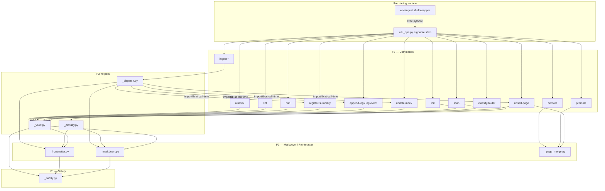

# ARCHITECTURE: `wiki-ingest` — Obsidian-style LLM-wiki maintenance layer

> **Status:** Shipped (v1.1.0 — TASK 017 final).
> **License:** Apache-2.0 (root `LICENSE`; no office-skill replication triggers).
> **Runtime:** Pure Python, stdlib-only (no external dependencies, no `requirements.txt`).
> **Entry point:** `skills/wiki-ingest/scripts/wiki-ingest` (POSIX shell wrapper) or
> `skills/wiki-ingest/scripts/wiki_ops.py` (direct Python invocation; both surfaces
> are locked byte-identical by `tests/test_cli_wrapper.py`).
> **Tasks:** TASK 015 (modular refactor), TASK 016 (cross-course promotion), TASK 017 (v1.1 contract).
> **Replication:** None — shares no files with `docx`/`xlsx`/`pptx`/`pdf`.

---

## 1. Purpose & Scope

### What it does

`wiki-ingest` is the **maintenance layer** for an Obsidian-flavour LLM-wiki (Karpathy's
llm-wiki pattern). Each new source — a transcript, article, lesson summary, or meeting note
— must not just produce an isolated summary file; it must *compound* the knowledge base by
updating concept/entity pages, updating the vault index, appending to the audit log, and
flagging contradictions for operator resolution.

The skill enforces three invariants:

1. **Raw layer is immutable** — source files are read, never modified.
2. **Wiki layer is additive** — concept/entity pages grow richer over time; prior content is
   never silently overwritten.
3. **Every claim traces to a source** — footnote citations (`[^src-<slug>]`) on every page.

The skill exposes five operation modes:

- **`ingest`** (v1.1 orchestrator) — composes `register-summary` → N× `upsert-page` →
  `update-index` → `append-log` → `log-event` in one call; emits a stable JSON manifest.
- **`scan`** / **`init`** — inspect vault state; scaffold missing structure files.
- **`lint`** — health check (orphans, dangling links, open contradictions, missing pages,
  cross-course duplicates, invariant violations in two-tier vaults).
- **`reindex`** — rebuild `index.md` from disk, preserving operator-added custom sections.
- **`promote` / `demote`** (TASK 016) — lazy cross-course merging in two-tier vaults.
- **`classify-folder`** — pre-ingest file-role classification for multi-file folder ingests.

### What it deliberately does NOT do

- Fetch remote content — that is `transcript-fetcher`.
- Generate summaries from raw transcripts — that is `summarizing-meetings`.
  The v1.1 `ingest` orchestrator accepts only **pre-made summaries**; raw transcripts
  fail-fast with `phase:"needs-pre-summarization"` + exit 21 (EXIT_SUBPROCESS).
- Synthesizer-subagent integration — documented future enhancement
  (`references/manifest_schema.md` §8); not shipped in v1.1.
- Install globally or depend on any pip packages — pure stdlib, venv not required.

---

## 2. Functional Architecture

| Capability | Entry-point script / subcommand | Notes |
|---|---|---|
| Vault state inspection | `wiki-ingest scan <vault>` | Read-only; JSON output; R11 byte-identity gate |
| Scaffold vault | `wiki-ingest init <vault>` | Creates `WIKI_SCHEMA.md`, `index.md`, `log.md`, `_sources/`, `_concepts/`, `_entities/`; fully idempotent |
| Scaffold vault root (two-tier) | `wiki-ingest init <vault> --root [--vault-id <slug>]` | `schema_version: 2.0`, `kind: vault-root`; no `_sources/` at root |
| Create/update concept or entity page | `wiki-ingest upsert-page <vault> --kind <concept\|entity> --name <name> ...` | Additive; dedupes by slug; detects collisions; contradiction blocks via `--contradicts` |
| Add/update row in index.md | `wiki-ingest update-index <vault> ...` | Dedupes by slug |
| Copy pre-made summary into `_sources/` | `wiki-ingest register-summary <vault> --summary-path <path>` | Returns JSON with slug/title/date/concepts/related |
| Append ingest entry to log.md | `wiki-ingest append-log <vault> ...` | Dedupes by (date, event, source-slug) |
| Log arbitrary vault event | `wiki-ingest log-event <vault> --event <type> ...` | query / lint / reindex events |
| Keyword search | `wiki-ingest find <vault> --terms "..." [--limit N]` | Ranked JSON hits; backs `query` mode |
| Vault health check | `wiki-ingest lint <vault> [--threshold N]` | JSON; two-tier-aware; exits non-zero on `invariant_violation` |
| Rebuild index.md from disk | `wiki-ingest reindex <vault>` | Preserves `## Notes` and other custom sections |
| Pre-ingest folder classification | `wiki-ingest classify-folder <folder>` | Read-only; no vault required; R11 byte-identity gate |
| Cross-course concept promotion | `wiki-ingest promote "<Name>" --vault <vault> [--apply]` | Dry-run by default; unioned frontmatter + additive body merge; literal-line-diff contradiction detection |
| Revert promoted page to course | `wiki-ingest demote "<Name>" --to <Course> --vault <vault>` | Refuses if non-target courses cite the page |
| End-to-end ingest orchestration | `wiki-ingest ingest --source <abs> --vault <abs> [--output-format json]` | v1.1; summary-passthrough only; manifest on stdout |
| Version check | `wiki-ingest --version` | Emits `wiki-ingest 1.1.0\n`; fast-path (no command modules loaded) |

---

## 3. System Architecture

### 3.1 Module / package layout

```
skills/wiki-ingest/
├── SKILL.md                                  # public agent contract (v1.1)
├── assets/                                   # markdown templates copied by `init`
│   ├── WIKI_SCHEMA.template.md
│   ├── WIKI_SCHEMA.root.template.md
│   ├── index.template.md
│   ├── log.template.md
│   ├── concept_page.template.md
│   └── entity_page.template.md
├── references/                               # in-repo contract mirrors + playbooks
│   ├── architecture.md                       # module layout reference (maintainer-facing)
│   ├── manifest_schema.md                    # v1.1 JSON manifest contract (in-repo authority)
│   ├── exit_codes.md                         # authoritative exit-code matrix
│   ├── wiki_schema.md                        # vault schema conventions
│   ├── cross_course_promotion.md             # promote/demote operator playbook
│   ├── ingest_workflow.md                    # LLM judgement steps for ingest
│   ├── query_lint_workflow.md                # LLM judgement steps for query/lint/reindex
│   ├── folder_ingest_workflow.md             # Phase 0-folder algorithm
│   └── karpathy-llm-wiki.md                  # foundational methodology (imported verbatim)
├── examples/
│   ├── usage_example.md
│   └── sample_summary.md
├── evals/
│   ├── evals.json
│   ├── trigger_evals.json
│   └── fixtures/
└── scripts/
    ├── wiki-ingest                           # POSIX shell wrapper (entry point)
    ├── wiki_ops.py                           # ~89-LoC argparse shim — dispatches to commands/
    ├── wiki_ingest/                          # internal package (not a public API)
    │   ├── __init__.py                       # __version__ = "1.1.0"
    │   ├── _safety.py                        # F1 — atomic I/O, NFKC, safe_name, exit codes
    │   ├── _markdown.py                      # F2 — code-fence masking, sections, wikilink extraction
    │   ├── _frontmatter.py                   # F2 — hand-rolled YAML parser + structural splice
    │   ├── _page_merge.py                    # F2 — additive-merge primitives (upsert rows/facts/footnotes)
    │   ├── _vault.py                         # F3-helper — layout constants, walk, two-tier discovery
    │   ├── _classify.py                      # F3-helper — folder-classify helpers (Phase 0)
    │   ├── _dispatch.py                      # F3-boundary — whitelist-gated importlib bridge for ingest
    │   └── commands/
    │       ├── __init__.py
    │       ├── scan.py                       # vault state JSON
    │       ├── init.py                       # scaffold vault / vault root
    │       ├── upsert_page.py                # additive concept/entity page create-or-update
    │       ├── update_index.py               # add/dedup rows in index.md
    │       ├── append_log.py                 # ingest-specific log entry
    │       ├── register_summary.py           # copy pre-made summary into _sources/
    │       ├── log_event.py                  # generic vault event (query/lint/reindex)
    │       ├── find.py                       # keyword search → ranked JSON
    │       ├── lint.py                       # health check (single-tier + two-tier)
    │       ├── reindex.py                    # rebuild index.md preserving custom sections
    │       ├── classify_folder.py            # Phase 0 folder classification
    │       ├── promote.py                    # cross-course concept/entity promotion
    │       ├── demote.py                     # revert promoted page back to course
    │       └── ingest.py                     # v1.1 orchestrator (TASK 017)
    └── tests/
        ├── __init__.py
        ├── .AGENTS.md
        ├── fixtures/                         # R11 frozen byte-identity fixtures
        │   ├── scan_vault/   lint_vault/   classify_folder/
        │   └── expected/     (scan.json, lint.json, classify.json)
        ├── test__safety.py
        ├── test__markdown.py
        ├── test__frontmatter.py
        ├── test__vault.py                    # includes vault_id + two-tier discovery
        ├── test__vault_id.py
        ├── test__classify.py
        ├── test__page_merge.py
        ├── test__dispatch.py
        ├── test_architecture.py              # AST-walk import-graph lint
        ├── test_r11_byte_identity.py         # byte-identity gate (varied PYTHONHASHSEED)
        ├── test_cli_wrapper.py               # wrapper ≡ direct equivalence
        ├── test_manifest_schema.py
        ├── test_known_issues_resolved.py
        ├── test_e2e_promotion.py
        ├── test_e2e_v1_1_contract.py     # v1.1 ingest contract e2e
        └── commands/
            ├── test_scan.py · test_init.py
            ├── test_upsert_page.py · test_update_index.py
            ├── test_append_log.py · test_log_event.py
            ├── test_register_summary.py
            ├── test_find_lint_reindex.py
            ├── test_classify_folder.py
            ├── test_lint_two_tier.py · test_reindex_two_tier.py
            ├── test_promote.py · test_demote.py
            ├── test_upsert_root_aware.py
            ├── test_ingest.py            # ingest orchestrator
            └── test_init_vault_id.py     # vault-id init contract
            # (illustrative — see scripts/tests/ for the full set)
```

### 3.2 One-way dependency DAG (enforced by `test_architecture.py`)

```
F3 · Commands + Vault/Classify helpers
    commands/*.py          (one subcommand per module — no command imports another command)
    _vault.py              (layout constants, page walk, two-tier course discovery)
    _classify.py           (folder-role classification, grouping pattern detection)
    _dispatch.py           (whitelist-gated importlib bridge; carve-out for ingest.py)
         ↑
F2 · Markdown / Frontmatter Engine
    _markdown.py           (mask-once code-fence, section locators, wikilink extraction)
    _frontmatter.py        (hand-rolled YAML split + structural splice)
    _page_merge.py         (upsert_source_row, append_fact, append_contradiction, upsert_footnote)
         ↑
F1 · Safety & I/O Primitives
    _safety.py             (atomic write, O_NOFOLLOW read, NFKC slugify, safe_name,
                            safe_inline, safe_for_json, exit-code constants, die())
```

Rules locked by `test_architecture.py` (stdlib `ast` walk):
- No `_*.py` helper imports `commands.*`.
- No `commands/<a>.py` imports `commands/<b>.py` (commands are independent).
- `_dispatch.py` has zero module-level `wiki_ingest.commands.*` imports (carve-out
  documented in the file; its `test_dispatch_no_module_level_command_imports` locks it).

### 3.3 Runtime model

The skill is **pure Python / stdlib-only**. No pip packages, no `requirements.txt`, no
venv required. Every operation runs entirely **in-process** — there are zero subprocess
calls in production code. `--timeout-seconds` is an accepted-but-decorative no-op: the
flag is parsed (default 600) but has no subprocess to bound in the summary-passthrough
scope. Synthesiser-subagent integration (invoking `summarizing-meetings` out-of-process)
is a documented future hook; it is not shipped in v1.1. There is no Node subprocess, no
LibreOffice, no Chrome.

`wiki_ops.py` uses lazy import inside `build_parser()` so the `--version` fast-path
avoids loading all 14 command modules (TASK 017 R2 / ≤50 ms startup budget).

### 3.4 Component diagram



`*` The `ingest` command invokes the five atomic ops via `_dispatch.py` rather than
direct imports, preserving the "no command imports command" invariant.

---

## 4. Data Model / Intermediate Representations

### 4.1 Vault on-disk layout

```
<vault>/
├── WIKI_SCHEMA.md          # frontmatter: schema_version, kind, vault_id (optional)
├── index.md                # tabular catalog of all pages
├── log.md                  # chronological grep-friendly audit log
├── _sources/               # one .md per ingested source
├── _concepts/              # one .md per concept (additive; never rewritten)
└── _entities/              # one .md per entity (same contract)
```

Two-tier vault (TASK 016) adds a root-level `WIKI_SCHEMA.md` with
`schema_version: 2.0`, `kind: vault-root`, and optional `vault_id: <slug>`.
Course directories anywhere below the root each carry a `schema_version: 1.x` schema.
The root's `_concepts/` and `_entities/` hold only **promoted** pages; sources never
live at root.

The one-page-one-place invariant: a given canonical filename exists in exactly one place —
either some course's `_concepts/`/`_entities/` or the root's. `lint` detects violations
and exits non-zero.

### 4.2 Page frontmatter (source pages)

Source pages (`_sources/<slug>.md`) carry YAML frontmatter with at minimum:
`title`, `date`, `type` (must be `summary`, `lesson-summary`, or `meeting-summary`
for the v1.1 `ingest` orchestrator), `concepts:` list, `related:` list.
The `source_hash:` footer field (sha256-hex) is written by the orchestrator for
idempotency short-circuit (UC-4).

### 4.3 v1.1 Manifest (ingest JSON output)

Emitted on stdout by `wiki-ingest ingest --output-format json`. Top-level shape
(within the 1.1.x band — additive only; renames/removals bump to 1.2+):

```
manifest_version: "1.1"
status:           "ok" | "error"
vault_id:         string | null
vault_root:       string (absolute path)
course:           string | null     (course basename; null for single-course vaults)
source:           {path, slug, hash}
written[]:        [{path, action, kind, scope}]
created[]:        vault-relative paths (subset of written[])
touched[]:        vault-relative paths (subset of written[])
contradictions:   int
summary_path:     string | null
log_event:        {event_ts, event_type, subject, log_md_byte_offset} | null
llm_tokens_used:  {input, output, model}
```

`WrittenEntry.scope` is `"course"` or `"vault"` (per TASK 016 two-tier).
Mid-pipeline failure exits 20 and emits a partial envelope with `written_so_far[]`
and `phase` discriminator instead.

### 4.4 PromotionPlan (promote dry-run output)

`promote` (dry-run default) emits a JSON plan showing the candidate pages, their
merged frontmatter (earliest `created`, longer `description`, `promoted_from:` list-of-dicts),
unioned body, detected contradiction blocks, and the list of writes that `--apply` would
commit.

### 4.5 Key in-memory structures

`load_vault_pages()` returns `{concepts: {stem: fm_dict}, entities: {}, sources: {}, other: []}`.
`scan` serialises this to JSON. `lint` and `reindex` build on the same walk.

---

## 5. Interfaces

### 5.1 CLI surface

All subcommands follow the `register(sub) / execute(args) → int` contract. Every
mutating subcommand accepts `--dry-run` (prints would-be content to stdout, no write).

Key flag patterns:
- `--vault <path>` — vault root (required for all vault ops).
- `--name <name>` / `--slug <slug>` / `--source-slug <slug>` — NFKC-normalised,
  path-traversal rejected, max 200 chars, markdown metacharacters (`[`, `]`, `|`, `^`)
  rejected.
- `--kind concept|entity` — used by `upsert-page`, `promote`, `demote`.
- `--force` — override collision / already-exists guards (requires explicit operator
  intent; agent must not pass without approval).
- `--output-format human|json` — `ingest` only; `json` suppresses decorative output
  when stdout is piped (TTY-aware per CONTRACT §8).
- `--vault-id <slug>` — `ingest` strict-mode; exits 23/24/25 on mismatch.
- `--source-hash <sha256-hex>` — `ingest` idempotency short-circuit (UC-4).
- `--timeout-seconds <N>` — accepted flag (default 600); **decorative in v1.1** — no
  subprocess exists to bound. No environment-variable fallback is read; the argparse
  default is a hardcoded 600 with no `os.environ` lookup.
- `--inbox-root <path>` / `WIKI_INGEST_INBOX_ROOT` — `register-summary` containment
  control (S-M1): when set, the source path passed to `register-summary` must resolve
  inside the designated inbox root; paths outside are rejected. `WIKI_INGEST_INBOX_ROOT`
  is the one production `os.environ` read in the skill (see §6.4).
- `--known-concepts-file <path>` / `--known-concepts-stdin` — `ingest` known-concepts
  injection (decorative in v1.1 summary-passthrough; consumed when synthesiser
  integration lands).
- `--config <path>` — accepted flag; **decorative in v1.1** (help text notes
  "decorative — see --known-concepts-file"). The value is NOT parsed or consumed;
  no config-file reader exists for this flag. The hand-rolled YAML parser that
  does exist (`_frontmatter.py`) parses page frontmatter, not a `--config` file.

### 5.2 Exit-code conventions

| Band | Codes | Notes |
|------|-------|-------|
| Legacy | 0 (OK), 1 (generic), 2 (usage/missing schema) | Locked; do not reassign |
| Legacy | 3 (already exists), 4 (case collision), 5 (contradicts not found), 6 (oversized), 7 (symlink overwrite), 8 (symlink follow) | Magic numbers at call sites (no drive-by rename) |
| Reserved | 10..19 | Future per-command extensions |
| v1.1 contract band | 20 (PARTIAL), 21 (SUBPROCESS), 22 (LLM), 23 (MISSING_VAULT_ID), 24 (INVALID_VAULT_ID), 25 (VAULT_ID_MISMATCH), 26 (TIMEOUT) | Symbolic constants in `_safety.py`; codes 20/21/22/26 carry `phase` discriminator |
| Reserved | 27..29 | Additive within 1.1.x |

Symbolic constants live in `_safety.py` as `EXIT_OK`, `EXIT_GENERIC`, `EXIT_USAGE`,
`EXIT_PARTIAL`, `EXIT_SUBPROCESS`, `EXIT_LLM`, `EXIT_MISSING_VAULT_ID`,
`EXIT_INVALID_VAULT_ID`, `EXIT_VAULT_ID_MISMATCH`, `EXIT_TIMEOUT`.

### 5.3 JSON error envelope (`die()`)

Errors go to stderr as `wiki_ops: error: <msg>\n`. The v1.1 manifest partial envelope
(exit 20) goes to stdout as a JSON object — callers (e.g. `/wiki-enrich` bridge) key on
the `phase` field for routing.

### 5.4 Version contract

`wiki-ingest --version` emits exactly `wiki-ingest 1.1.0\n` to stdout and exits 0.
Consumers use prefix + tuple compare: `assert ver >= (1, 1)`. Within the 1.1.x band,
additive manifest changes are allowed; renames/removals bump to `"1.2"`. Consumers
MUST ignore unknown fields and MUST hard-fail on a major bump.

---

## 6. Cross-cutting

### 6.1 Shared office helpers

`wiki-ingest` is an **independent skill** with no file-sharing with the four office skills
(`docx`, `xlsx`, `pptx`, `pdf`). The `CLAUDE.md §2` replication protocol is **not triggered**
by any change to this skill. The cross-skill `diff -q` matrix must remain silent.

### 6.2 Shared helper files (_errors.py / preview.py / _venv_bootstrap.py / _soffice.py)

None of these files are present in `wiki-ingest`. The skill does not use LibreOffice,
Poppler, or any preview infrastructure. It has no `_errors.py` (errors go to stderr via
`die()`) and no `_venv_bootstrap.py` (no venv required; pure stdlib).

### 6.3 Licensing

Apache-2.0 (governed by the root `LICENSE`). No proprietary code from `docx`/`pdf` is
embedded; no `NOTICE` file required beyond the repo root's `THIRD_PARTY_NOTICES.md`.
The TASK 015 task doc explicitly notes: "Cross-skill replication: None. wiki-ingest does
NOT share files with the four office skills."

### 6.4 Safety layer

`_safety.py` is the single hardened I/O root:

- **Atomic writes** — temp-file + `os.fsync` + `os.replace`; advisory `fcntl.flock`
  for concurrent-write safety; orphan tmp cleanup on error (M2-015-01).
- **Symlink refusal** — `O_NOFOLLOW` reads (via `_safe_open_for_read`); symlink
  overwrite refused via `path.is_symlink()` check before write; vault walk skips
  symlinks silently.
- **Input validation** — `_safe_name` rejects path traversal, control chars, markdown
  metacharacters, template placeholders, and overlong (>200 char) names; NFKC-normalises
  to collapse confusable-character variants (S-M5).
- **JSON sanitisation** — `_safe_for_json` strips C0 control chars and truncates scalars
  >2000 bytes before any JSON output; defends against prompt-injection-via-frontmatter.
- **Size caps** — `MAX_PAGE_BYTES = 50 MiB` per markdown file; `MAX_SUMMARY_BYTES = 50 MiB`
  for `register-summary` input; `MAX_VALUE_BYTES = 2000` for JSON scalar echo.
- **Containment** — `_is_relative_to` (backport-safe) verifies all writes stay under
  the vault root; case-collision + slug-collision detection before every `upsert-page`.
  `register-summary` additionally scopes its source-file reads to a designated inbox via
  `--inbox-root` / `WIKI_INGEST_INBOX_ROOT` (S-M1 containment) — the one `os.environ`
  read in the skill's production code.

### 6.5 Determinism gate (R11)

`test_r11_byte_identity.py` runs `scan`, `lint`, and `classify-folder` against frozen
fixture vaults under varied `PYTHONHASHSEED` values and asserts stdout matches frozen
`expected/*.json` files byte-for-byte. The expected files are intentionally frozen; a
refactor that breaks them is not behaviour-preserving. Determinism is enforced by sorting
all list emissions at each command boundary.

---

## 7. Honest Scope & Open Questions

### Known limitations

1. **`ingest` is summary-passthrough only (v1.1 scope).** Raw transcripts passed to
   `wiki-ingest ingest --source` fail-fast with `phase:"needs-pre-summarization"` +
   exit 21 (EXIT_SUBPROCESS). The synthesiser-subagent integration (the LLM-calling
   half) is a documented future hook; see `references/manifest_schema.md` §8. The
   operator or bridge must pre-summarise via `summarizing-meetings` before calling
   `ingest`.

2. **`ingest` is a full Phase-2 orchestrator (shipped).** `commands/ingest.py`
   composes `register-summary` → `upsert-page` × N → `update-index` → `append-log`
   → `log-event` via `_dispatch`, populates `written[]`/`created[]`/`touched[]`,
   writes the `source_hash` footer for UC-4 idempotency, and emits a non-null
   `summary_path`. Tests assert `written[]` is non-empty and `summary_path` is
   non-null. (Note: the module docstring of `ingest.py` and a test file docstring
   still reference "Phase 1 skeleton / no writes" — those are stale comments
   superseded by the shipped implementation.)

3. **`--known-concepts-file` / `--known-concepts-stdin` are decorative in v1.1.**
   The flags are parsed and validated but the payload is not consumed by the
   summary-passthrough path. They become active when the synthesiser integration lands.

4. **`--config <path>` is decorative and unimplemented in v1.1.** The flag is accepted
   by argparse but its value is never read or parsed — no config-file parser exists for
   it. Do not claim a hand-rolled YAML config parser is "implemented and tested"; the
   hand-rolled parser that does exist (`_frontmatter.py`) serves page frontmatter, not
   `--config`.

5. **Test suite coverage.** A unittest suite under `scripts/tests/` (including
   `commands/` subpackage and a v1.1-contract e2e) covers the package. The S-M1b
   symlink-order hardening (`is_symlink()` before `resolve()` in `register_summary.py`)
   is shipped with regression coverage; the only `skipTest` calls in the suite are
   environment-conditional (filesystem-symlink-unsupported).

6. **`promote` dry-run is the only safe default; `demote` is not dry-run-default.**
   `promote` defaults to dry-run (`--apply` required to commit). `demote` does not default
   to dry-run — it is reversible via re-promote, and the SKILL.md documents this explicitly.

7. **No network calls.** The skill is entirely local-filesystem. URL ingests must be
   fetched first by `transcript-fetcher`; `wiki-ingest ingest --source <URL>` will reject
   with exit 1 if the path does not resolve to a local file.

8. **Two-tier vault: `Lessons/` is convention, not hardcoded.** `discover_courses` walks
   all descendant directories with a `schema_version: 1.x` schema. Course-of-courses
   layouts (`Lessons/2026/Spring/Hermes/`) are supported. The `Lessons/` segment itself
   is just the conventional name in examples.

9. **Dynamic imports in `_dispatch.py` are invisible to the AST-walk gate.** The
   `test_architecture.py` import-graph lint only flags syntactic `import` / `from … import`
   nodes. `_dispatch.py` uses `importlib.import_module` at call time — a deliberate,
   documented carve-out. Future maintainers must not introduce top-level `from
   wiki_ingest.commands import …` in `_dispatch.py`; the `test_dispatch_no_module_level_command_imports`
   test locks this.

10. **No CI signal for vault operations.** The skill operates on user-local files; there
    is no CI fixture that exercises a full multi-ingest vault. The R11 byte-identity gate
    and the unittest suite cover the code paths; live-vault E2E is the operator's validation
    step per `SKILL.md §6`.

### Open Questions (from TASK 017)

- Synthesiser-subagent integration: how the `ingest` orchestrator will invoke the LLM for
  Phase 2 summarisation is deferred. The external contract (`obsidian-llm-wiki`) documents
  the expected hook point; this skill must implement it in a future task.
- `vault_id` in single-course vaults: the field is optional for standalone wiki-ingest
  users but required by the `obsidian-llm-wiki` bridge. The SKILL.md documents the
  migration path (`wiki-ingest init <vault> --root --vault-id my-vault`).
