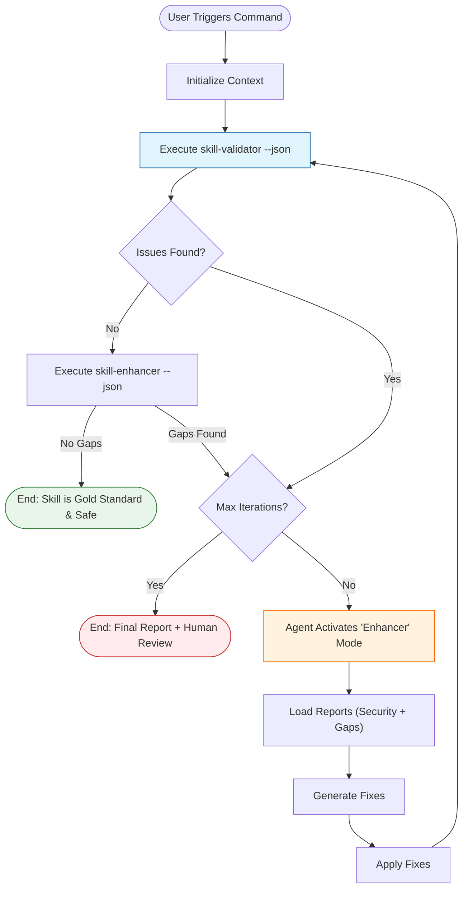

# Technical Specification: Skill Auto-Healing Loop

**Status**: Draft
**Target**: `.agent/workflows/secure-skill.md` (Workflow) & `gemini cli` extension

## 1. Goal
Create a "Self-Healing" workflow that automatically audits and fixes skills using a closed feedback loop between `skill-validator` (Detection) and `skill-enhancer` (Correction).

## 2. Architecture

The workflow implements a **Review-Refine Loop** pattern.



## 3. Components & Upgrades

### A. Skill Validator (The Auditor)
*   **Current State**: Ready (v1.3). Supports structure, bash, and static analysis.
*   **Action**: No changes needed (Output is already JSON compatible).
*   **Command**: `python3 skills/skill-validator/scripts/validate.py <path> --json`

### B. Skill Enhancer (The Doctor)
*   **Current State**: Manual-assist tool for "Gold Standard" compliance. Output is text-only.
*   **Required Upgrades**:
    1.  **JSON Output**: Update `scripts/analyze_gaps.py` to support `--json` flag.
    2.  **Scope Expansion**: Update `SKILL.md` to include "Security Remediation" as a core capability.
    3.  **Fixing Logic**: Add `references/security_refactoring.md` - a guide/prompt for the Agent on how to fix common validator errors (e.g., "Replace `curl | bash` with 2-step download").

### C. The Orchestrator (New Workflow)
*   **Implementation**: `.agent/workflows/auto-heal-skill.md`.
*   **Logic**:
    1.  **Audit**: Run Validator + Enhancer Analyzer.
    2.  **Decision**: If `critical_errors > 0` OR `gaps > 0`:
        *   **Activate Agent**: Pass the JSON reports.
        *   **Prompt**: "You are the Skill Enhancer. Fix the following Security Errors [list] and Compliance Gaps [list]. Return the corrected file content."
        *   **Apply**: Agent edits the files.
    3.  **Loop**: Repeat until clean or Max Retries (3).
    4.  **Final**: Generate `auto-fix-report.md` with:
        *   Success/Fail Status.
        *   Diff of changes.
        *   Remaining issues (if any).

## 4. Interfaces

### JSON Report Format (Combined)
The workflow will aggregate outputs into a context object for the Agent:

```json
{
  "security_report": {
    "critical": ["SEC-001: malicious pattern in install.sh"],
    "warning": ["SEC-002: obfuscated string"]
  },
  "compliance_report": {
    "gaps": ["GAP-001: Missing 'Red Flags' section", "GAP-002: Weak verbs used"]
  }
}
```

## 5. Implementation Plan

1.  **Upgrade `skill-enhancer`**:
    *   [x] Modify `scripts/analyze_gaps.py` to output JSON.
    *   [x] Update `SKILL.md` to reference security fixing.
2.  **Create Workflow**:
    *   [x] Draft `.agent/workflows/auto-heal-skill.md`.
    *   [x] Create the "Fixer Prompt" (system prompt for the sub-agent).
3.  **Test Loop**:
    *   [x] Create `tests/bad_skill/` (with security & style errors).
    *   [x] Run workflow.
    *   [x] Verify `bad_skill` becomes `good_skill`.
4.  **Perform VDD-Adversarial Testing (Round 1)**:
    *   [x] Create `tests/bad_skill/` (with security & style errors).
    *   [x] Run workflow against it.
    *   [x] Verify `bad_skill` becomes `good_skill`.

5.  **Fix VDD Findings**:
    *   [x] Address any gaps or failures found during Round 1 testing.

6.  **Perform TDD Testing**:
    *   [x] Define expected "Gold Standard" output.
    *   [x] Run workflow.
    *   [x] Assert that output matches the Gold Standard.

7.  **Perform VDD-Adversarial Testing (Round 2)**:
    *   [x] Create `tests/bad_skill_v2/` with new edge cases (e.g., comments inside code, strict limits).
    *   [x] Run workflow.
    *   [x] Verify robustness.

8.  **Deployment Integration**:
    *   [x] Roll out as Custom Command for `gemini cli`.
         - Artifact: `custom-commands/auto-heal-external-skill.toml`
    *   [x] Roll out as Slash Command for `Claude`.
         - Artifact: `commands/auto-heal-external-skill.md`

9.  **Documentation**:
    *   [x] Update `README.md`: Add "Auto-Fix" section and installation options.
    *   [x] Create `docs/manuals/auto-fix-workflow.md`: Dedicated manual for the new workflow.
