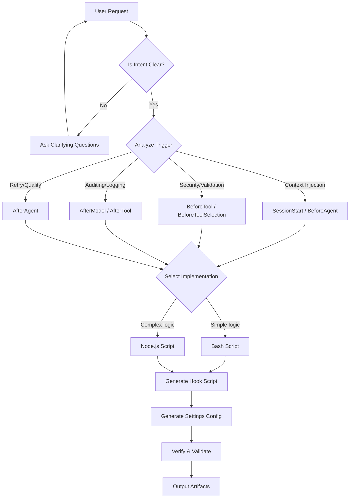

# Gemini CLI Hooks Generator - Skill Specification

## 1. Goal
Create a self-sufficient skill capable of generating robust, secure, and compliant Gemini CLI hooks based on natural language user requests. The skill must handle the entire lifecycle: event selection, script implementation, and configuration updates, while strictly adhering to the "Golden Rules" of the Gemini CLI hook system.

## 2. Scope
The skill must be able to generate hooks for:
*   **All Lifecycle Events**: `SessionStart`, `SessionEnd`, `Notification`, `PreCompress`.
*   **Agent/Model Events**: `BeforeAgent`, `AfterAgent`, `BeforeModel`, `AfterModel`, `BeforeToolSelection`.
*   **Tool Events**: `BeforeTool`, `AfterTool`.
*   **Implementation**: Scripts in `bash` (default for simple logic) or `node` (for complex logic/JSON processing).
*   **Configuration**: Corresponding updates for `.gemini/settings.json`.

## 3. Canonical Resources
The agent MUST reference these files for all implementation details. These are the source of truth:
*   `docs/hooks/Gemini%20CLI%20Hooks.md` - Core concepts and definitions.
*   `docs/hooks/writing-hooks.md` - Tutorials and patterns.
*   `docs/hooks/reference.md` - Technical schems and API.
*   `docs/hooks/best-practices.md` - Security and performance guidelines.

## 4. Core Process (The "How")

## 5. Nuances & Constraints (The "Golden Rules")
The skill must ENFORCE these constraints in generated code:

1.  **Strict JSON Output**: 
    *   `stdout` MUST ONLY contain the final JSON. 
    *   ALL logs/debug output MUST go to `stderr`.
    *   *Constraint*: Generated scripts must specifically prevent "echo pollution" (e.g., using `>&2` for logs).
2.  **Robustness & Dependencies**:
    *   **Bash**: MUST check for `jq` existence at the start. If missing, print a friendly error to `stderr` and exit 2 (or 0 with warning depending on criticality).
    *   **Node**: Check for required packages.
3.  **Exit Codes**:
    *   **0 (Success)**: Preferred for structured decisions (`allow`/`deny`).
    *   **2 (System Block)**: Emergency brake. `stderr` becomes the error message.
4.  **Security & Input Sanitization**:
    *   **Bash**: MUST use `jq` to parse JSON. **DO NOT** use `grep`, `sed`, or regex to extract values from `input`, as this allows arbitrary code injection.
    *   Warn about arbitrary code execution.
    *   Redaction awareness (mention `suppressOutput` for sensitive data).
    *   Fingerprinting warning: Mention that changing the command resets trust.
5.  **Performance**:
    *   Use specific `matchers` instead of `*` where possible.
    *   Async operations where applicable (Node.js).
    *   Use `jq` for robust parsing in Bash.

## 6. Skill Instructions (Draft)
The skill should follow this reasoning process:

1.  **Identify Trigger**: Which event matches the user's goal? (e.g., "Block secrets" -> `BeforeTool`).
2.  **Design Data Flow**:
    *   Input: What fields are available? (`tool_input`, `llm_request`, etc.)
    *   Output: What fields need to be returned? (`decision`, `hookSpecificOutput`, etc.)
3.  **Draft Script**:
    *   **Preamble**: Shebang (`#!/usr/bin/env bash` or `node`).
    *   **Input Parsing**: Use `jq` (Bash) or `JSON.parse` (Node).
    *   **Logic**: The detailed implementation.
    *   **Output Construction**: Valid JSON to stdout.
4.  **Draft Configuration**:
    *   `settings.json` snippet with correct `matcher` and `type: "command"`.

## 7. Examples to Encode
*   **Security Gate**: `BeforeTool` checking for secrets (Bash/grep).
*   **Context Injection**: `BeforeAgent` adding Git status (Bash).
*   **Tool Filtering**: `BeforeToolSelection` implementing RAG-based allowlists (Node).
*   **Logger**: `AfterModel` logging to file (Bash).

## 8. Verification Plan
The skill must advise the user to:
1.  Make the script executable (`chmod +x`).
2.  Test manually using piped JSON: `cat test.json | ./hook.sh`.
3.  Check `exit code`.
4.  Enable via `settings.json`.
