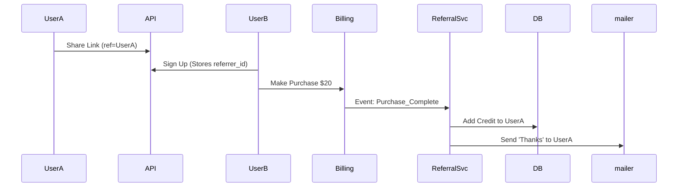

# Example: Complex Task (Deep Dive)

**User Request**: "Design a referral system where users get credits for inviting friends."

**Agent Thinking** (Internal):
*   **Complexity**: COMPLEX. Multiple components (DB, Auth, Billing), potential fraud risks, state management.
*   **Action**: Deep Dive. Research -> Visualize -> Design Doc.

**Agent**:
"I'll help design the referral system. This touches User, Billing, and Notification domains.
To ensure we handle fraud and scale correctly, **when should the credit be awarded?**
A) On Sign-up (High fraud risk)
B) On First Purchase (Standard)
C) On Email Verification"

**User**:
"On First Purchase."

**Agent**:
"Understood. That simplifies the fraud risk.
**Proposed Architecture Flow** (Mermaid):

*   **Trade-off**: I suggest processing the Credit asynchronously (via Queue) to avoid blocking the checkout if the Referral Service is slow.

I have drafted the full specification in `docs/design/referral-system.md` including the Database Schema changes.
**Please review it.** Do you agree with the Async approach?"

**User**:
"Yes, async is better. The schema looks good."

**Agent**:
"Great. The design is approved. I am moving to Implementation."
