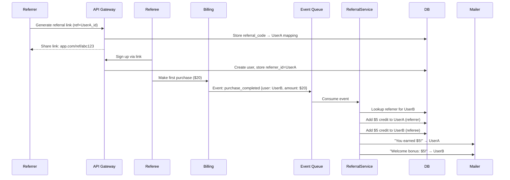

# Example: Complex Task (Deep Dive)

**User Request**: "Design a referral system where users get credits for inviting friends."

---

**Agent Thinking** (Internal):
- **Complexity**: COMPLEX. Multiple domains (User, Billing, Notifications), fraud risks, state machine, async processing.
- **Action**: Deep Dive. Research → Ideation (multiple techniques) → Visualize → Trade-offs → Design Doc → Sign-off.

---

## Phase 1: Assess & Understand

**Agent**:
"This is a **COMPLEX** task — entering Deep Dive mode. It touches User, Billing, and Notification domains with fraud implications.

Before generating options, I need to understand the constraints:

1. **When should the credit be awarded?**
   A) On Sign-up (simplest, but high fraud risk — fake accounts)
   B) On First Purchase (standard — proves real engagement)
   C) On Email Verification (middle ground)

2. **What's the credit model?**
   A) Fixed amount (e.g., $5 per referral)
   B) Percentage of referee's first purchase
   C) Tiered (more referrals = bigger rewards)"

**User**:
"On First Purchase. Fixed $5."

---

## Phase 2: Diverge — Generate Ideas (no evaluation yet)

**Agent**:
"Good — First Purchase eliminates most fraud vectors. Here are 5 architecture options, generated using different techniques:

**Direct approaches:**
1. **Synchronous in checkout flow** — When purchase completes, immediately credit the referrer in the same DB transaction. Simple, zero latency on credit delivery.

2. **Event-driven async** — Purchase triggers `purchase_completed` event → ReferralService consumes it → credits referrer asynchronously. Decoupled from checkout.

**Inversion (what would guarantee failure?):**
3. **Pre-authorized credits** — Credit the referrer immediately on sign-up, mark as 'pending'. Revoke if no purchase within 30 days. Feels instant to users, but needs a cleanup job.

**Analogy (real-world precedents):**
4. **Dropbox model** — Dropbox's 2008 referral program (which grew them from 100K to 4M users in 15 months) credited BOTH referrer and referee. PayPal's early program similarly paid both sides ($20 each). Both sides having skin in the game dramatically increases conversion.

**Wild Card (challenge the framing):**
5. **No credits — product virality instead** — Instead of paying for referrals, make the product inherently shareable. Figma-style collaboration links where inviting someone is a natural part of using the product. Slack grew primarily through workspace invites, not credit incentives. Zero fraud risk, infinite scale.

Each approach (1-4) needs: a `referrals` DB table, a unique referral link generator, and email notifications."

**User**:
"I like Option 2 (async). And let's do the Dropbox model — credit both sides. Option 5 is interesting but too big a shift for now."

---

## Phase 3: Converge — Evaluate & Visualize

**Agent**:
"Noted — filing Option 5 as a future consideration. Now evaluating the selected approach.

Here's the architecture flow:

```mermaid
sequenceDiagram
    participant UserA as Referrer
    participant API as API Gateway
    participant UserB as Referee
    participant Billing
    participant Queue as Event Queue
    participant RefSvc as ReferralService
    participant DB
    participant Mailer

    UserA->>API: Generate referral link (ref=UserA_id)
    API->>DB: Store referral_code → UserA mapping
    API-->>UserA: Share link: app.com/ref/abc123

    UserB->>API: Sign up via link
    API->>DB: Create user, store referrer_id=UserA

    UserB->>Billing: Make first purchase ($20)
    Billing->>Queue: Event: purchase_completed {user: UserB, amount: $20}

    Queue->>RefSvc: Consume event
    RefSvc->>DB: Lookup referrer for UserB
    RefSvc->>DB: Add $5 credit to UserA (referrer)
    RefSvc->>DB: Add $5 credit to UserB (referee)
    RefSvc->>Mailer: "You earned $5!" → UserA
    RefSvc->>Mailer: "Welcome bonus: $5!" → UserB
```

**Trade-off analysis (top 3 options):**

| Criteria | Sync (Option 1) | Async (Option 2) | Pre-auth (Option 3) |
|---|---|---|---|
| Reliability | Fails if referral service is down → blocks checkout | **Queue retries automatically** | Requires cleanup cron job |
| Complexity | Low | Medium | High (pending state + revocation) |
| User experience | Instant credit | Credit within seconds | Instant but confusing if revoked |
| Coupling | **High** — Billing knows about Referrals | **Low** — event-driven | Medium |
| Fraud resistance | Medium | **High** | Low (gaming pending credits) |

**Second-order consequences of Async + Dropbox model:**
- **6-month**: You'll need observability for the queue (dead-letter monitoring, credit delivery SLA dashboard). Budget ~2 days for this.
- **Scale**: At 10K referrals/day, the queue handles it fine. At 100K, you'll want to batch credit writes. Event sourcing (like Uber's referral system uses) would future-proof this.
- **Organizational**: Marketing will want referral analytics (conversion funnel, top referrers). Build the events schema to support this from day one — retrofitting analytics into event streams is painful.

**I recommend Async (Option 2) + Dropbox model** because:
- Queue-based retry handles transient failures without blocking checkout
- Low coupling — Billing doesn't know about referrals
- Fraud resistance is high since credit requires a real purchase
- Dropbox and PayPal proved that dual-sided incentives dramatically increase referral conversion
- Main risk: event delivery delay → mitigate with dead-letter queue + alerting

**Key design decisions to confirm:**
1. **Credit expiry?** — Do credits expire? (I suggest no expiry for simplicity)
2. **Referral cap?** — Max referrals per user? (I suggest 50 to prevent abuse — Dropbox used a cap of 32 referrals = 16GB max bonus)
3. **Self-referral prevention** — Block same IP/email domain? (I suggest email domain check)"

**User**:
"No expiry. Cap at 20. Email domain check is fine."

---

## Phase 4: Verify & Confirm

**Agent Thinking** (Internal — Pre-Mortem):
*"Imagine this failed in production 6 months from now. What went wrong?"*
1. **Failure: duplicate credits** — Same purchase event processed twice due to queue retry → Mitigation: idempotency key on (referrer_id, referee_id, event_id). ✅ Add to schema.
2. **Failure: referral link abuse** — Bot creates thousands of accounts via referral links, never purchases → Mitigation: credit only on purchase + rate limit sign-ups per referral code. ✅ Covered by design.
3. **Failure: credit drain** — User creates 20 alt accounts, each makes minimum purchase → Mitigation: email domain check blocks same-domain; consider phone verification for high-value credits. ⚠️ Flag to user: email domain check alone may not be sufficient.

**Agent Thinking** (Internal — Adversarial Checklist):
- [x] Red Flags: User said "First Purchase" and "Fixed $5" — design matches
- [x] YAGNI: No unnecessary features (no tiers, no percentage model)
- [x] Alignment: Event queue fits their existing architecture (they use RabbitMQ)
- [x] Idea Diversity: 5 genuine options from 4 different angles (direct, inversion, analogy, wild card)
- [x] Knowledge Depth: Cited Dropbox, PayPal, Uber, Figma, Slack precedents
- [x] User Confirmation: Explicit "yes" to async + Dropbox model

**Agent**:
"Here is the final design for the Referral System:

- **Architecture**: Event-driven async via RabbitMQ
- **Credit model**: Fixed $5 to both referrer and referee on first purchase
- **Constraints**: 20 referral cap, email domain check, no credit expiry
- **DB changes**: New `referrals` table + `credits` ledger table + idempotency key
- **Components**: ReferralService (consumer), referral link generator (API), email templates (2)

**Pre-Mortem flag**: Email domain check alone may not prevent determined fraud (alt accounts with different email providers). Consider adding phone verification if credit abuse becomes significant. Not needed for launch, but plan the schema to support it.

I've drafted the full specification in `docs/design/referral-system.md` including the database schema, API endpoints, event contracts, and idempotency design.

**Please review the doc.** If it looks good, I'll move to implementation starting with the DB migration."

**User**:
"The schema looks good. Let's go."

**Agent**:
"Design approved. Starting implementation with the database migration."

---

**Why this works**:
- **5 options** from 4 techniques (direct, inversion, analogy, wild card)
- **Knowledge depth**: Cited Dropbox growth (100K→4M), PayPal dual incentive, Uber event sourcing, Figma virality, Slack growth model
- **Phase 2 and Phase 3 separated**: Ideas generated without evaluation first, then evaluated separately
- **Second-order thinking**: 6-month consequences, scale implications, organizational impact stated explicitly
- **Pre-Mortem**: 3 failure scenarios tested, one flagged as open risk
- **Commitment anchor**: "COMPLEX task — entering Deep Dive mode" declared at start
- Mermaid diagram catches integration issues early
- Trade-off table with 5 criteria
- Clear recommendation with reasoning AND risk mitigation
- 3 follow-up questions on edge cases (expiry, cap, fraud) caught before implementation
