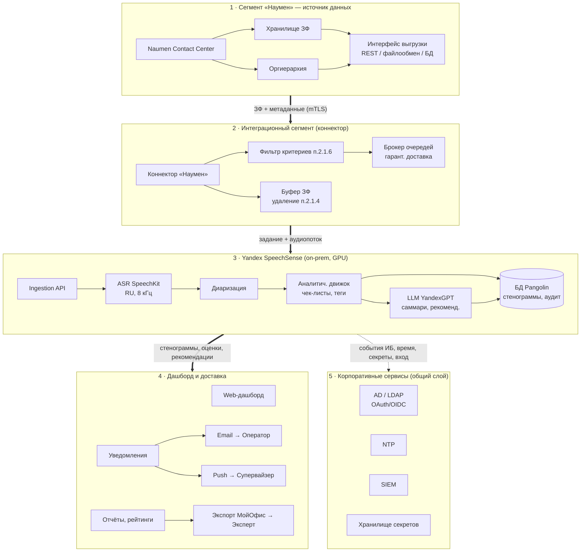
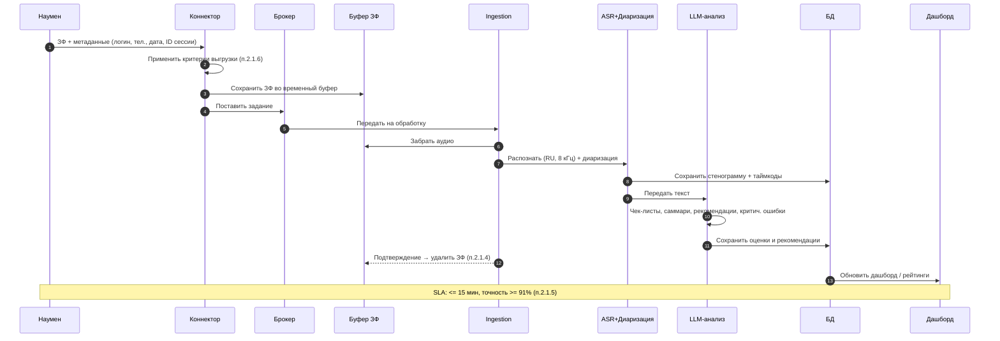
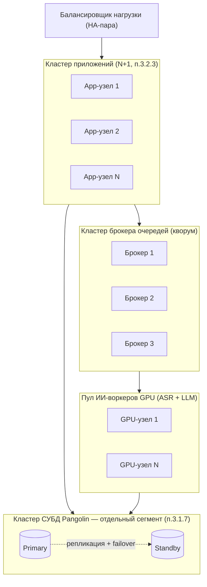

# Интеграционная архитектура: «Анализ звонков через интеграцию ИИ и ПО «Наумен»»

**Заказчик:** ПАО «NewCompany»
**Решение:** Yandex SpeechSense (on-prem) — платформа речевой аналитики (ASR SpeechKit + LLM YandexGPT) + ПО «Наумен»
**Документ:** краткое описание интеграционной архитектуры
**Версия:** черновик 0.2

---

## 1. Назначение и состав

Решение автоматизирует анализ диалогов телемаркетинга: выгрузку звуковых файлов (ЗФ) и метаданных из ПО «Наумен», распознавание речи, формирование стенограмм, ИИ-анализ по чек-листам и промптам, генерацию рекомендаций и единый дашборд с отчётностью.

Все компоненты разворачиваются **on-prem внутри контура ПАО «NewCompany»** — внешние/облачные сервисы не используются (п. 2.1.3, 3.6.9). ASR и LLM работают локально на GPU.

**Основные сегменты решения:**

| Сегмент | Назначение | Состав |
|---|---|---|
| «Наумен» | Источник данных | Naumen Contact Center, хранилище ЗФ, оргиерархия |
| Интеграция | Доставка данных | Коннектор «Наумен», брокер очередей, временный буфер ЗФ |
| Yandex SpeechSense (on-prem) | Ядро ИИ-аналитики | Ingestion API, ASR (SpeechKit), диаризация, аналитический движок, LLM (YandexGPT), БД, дашборд |
| Доставка | Каналы вывода | Email (SMTP), push/мобильное приложение, экспорт «МойОфис»/ODF |
| Корпоративные сервисы | Инфраструктура | AD/LDAP, NTP, SIEM, хранилище секретов |

---

## 2. Логическая интеграционная архитектура

Логические блоки следуют сверху вниз: источник → интеграция → ядро ИИ → доставка; корпоративные сервисы — общий слой.



---

## 3. Поток обработки одного звонка



---

## 4. Отказоустойчивость и кластеризация

Архитектура — разнесённая, с **выделенным кластером приложений и выделенным кластером СУБД** (п. 3.1.7). Горизонтальное масштабирование выполняется добавлением однотипных узлов с балансировкой нагрузки (п. 3.2.3). СУБД масштабируется штатными средствами Pangolin.

**Принципы:**

- **Кластер приложений** — не менее 2 узлов (N+1) за балансировщиком; масштабируется добавлением узлов без простоя.
- **Пул ИИ-воркеров (GPU)** — ASR/LLM выполняются на нескольких GPU-узлах; задания распределяются из очереди, отказ узла не теряет задание.
- **Кластер брокера очередей** — 3 узла (кворум); гарантированная доставка и идемпотентность (п. 3.4.3); недоступность «Наумен» или GPU не теряет задания.
- **Кластер СУБД Pangolin** — Primary + Standby с репликацией и автоматическим failover; вынесен в отдельный сетевой сегмент данных.
- **Изоляция интеграций (п. 3.4.2)** — отказ/замедление коннектора «Наумен» не влияет на работу ядра: обработка идёт из очереди и буфера.



---

## 5. Расчёт доступности

**Метод.** Общая доступность системы рассчитывается как произведение доступностей последовательно соединённых компонентов; резервированные кластеры считаются по параллельной схеме:

```
A_кластера = 1 − (1 − A_узла) ^ n
A_системы = A_ЦОД × ∏ A_компонента
```

Размещение — ЦОД уровня **Tier II** (Uptime Institute), базовая инфраструктурная доступность **99,741 %** (п. 3.4.1). Доступность ПО-уровня обеспечивается кластеризацией (раздел 4).

**Оценка по компонентам (исходные значения узлов — типовые, уточняются по итогам нагрузочного тестирования):**

| Компонент | Резервирование | A узла | A компонента |
|---|---|---|---|
| Балансировщик нагрузки | HA-пара | 0,99 | 0,9999 |
| Кластер приложений | N+1 (≥ 2 узла) | 0,99 | 0,9999 |
| Кластер брокера очередей | 3 узла (кворум) | 0,99 | 0,999999 |
| Пул ИИ-воркеров (GPU) | N+1 | 0,99 | 0,9999 |
| Кластер СУБД Pangolin | Primary + Standby, авто-failover | 0,995 | 0,999975 |
| Инфраструктура ЦОД | Tier II | — | 0,99741 |

**Итог.** Доступность ПО-слоя (произведение кластеров) ≈ **99,95 %**. С учётом инфраструктуры ЦОД Tier II итоговая расчётная доступность системы:

```
A_системы ≈ 0,99741 × 0,9995 ≈ 0,99691  →  ≈ 99,69 %
```

Доступность ограничена сверху уровнем ЦОД (Tier II). С учётом плановых окон обслуживания рекомендуемое **целевое SLA-обязательство — 99,5 %**.

**Допустимый простой в зависимости от уровня доступности:**

| Доступность | Простой в год | Простой в месяц |
|---|---|---|
| 99,9 % | 8,8 ч | 43,8 мин |
| 99,741 % (Tier II) | 22,7 ч | 1,83 ч |
| 99,69 % (расчётная) | 27,2 ч | 2,27 ч |
| 99,5 % (целевое SLA) | 43,8 ч | 3,65 ч |

> Расчёт предварительный. Финальные значения доступности узлов и итоговое SLA подтверждаются по итогам проектирования, нагрузочного тестирования и расчёта по форме Заказчика (комплект документации, раздел «Расчёт доступности Системы»).

---

## 6. Точки интеграции и порты

Порты типовые, уточняются на этапе проектирования.

| Связь | Протокол | Порт | Защита |
|---|---|---|---|
| Наумен → Коннектор | REST/HTTPS или SMB/FTPS | 443 / 445 | mTLS, подтверждение доставки |
| Коннектор → Брокер | AMQP / Kafka | 5672 / 9092 | TLS |
| Коннектор → Ingestion API | gRPC / HTTPS | 443 | mTLS + JWT |
| Пользователь → Дашборд/API | HTTPS | 443 | TLS, OAuth 2.0 / OIDC |
| SpeechSense → СУБД | PostgreSQL (Pangolin) | 5432 | TLS |
| App → AD/LDAP | LDAPS | 636 | TLS |
| App → SMTP | SMTP / STARTTLS | 587 / 25 | TLS |
| App → SIEM | syslog / CEF | 514 / 6514 | TLS |
| Компоненты → NTP | NTP | 123 | — |
| App → Хранилище секретов | HTTPS | 8200 | mTLS |

---

## 7. Соответствие ключевым требованиям

| Требование | Как закрывается |
|---|---|
| On-prem без облака (2.1.3, 3.6.9) | Все сегменты внутри контура NewCompany; ASR/LLM на локальном GPU |
| Удаление ЗФ после обработки (2.1.4) | Аудио — только во временном буфере; удаляется после подтверждения, в БД остаётся стенограмма |
| Привязка метаданных (2.1.2) | Логин/инсталляция/телефон/дата/ID сессии переносятся как атрибуты записи |
| Критерии выгрузки (2.1.6) | Фильтр в коннекторе: длительность, проект, логин, ID сессии, дата, сторона/результат вызова |
| Гарантированная доставка (3.4.3) | Брокер очередей + идемпотентность + подтверждения |
| Отказоустойчивость интеграции (3.4.2) | Недоступность «Наумен» не блокирует ядро — обработка из очереди/буфера |
| Разнесённые кластеры (3.1.7) | Выделенный кластер приложений + выделенный кластер СУБД Pangolin |
| Масштабирование (3.2.3) | Горизонтальное добавление однотипных узлов с балансировкой |
| Доступность Tier II (3.4.1) | Расчётная доступность ≈ 99,69 %; целевое SLA 99,5 % |
| Отчётность по иерархии (2.3.7, 2.3.8) | Импорт оргструктуры из «Наумен», разбивка по операторам/командам |
| Сегментация и ИБ (3.6.17, 3.6.18, 3.6.25) | Изолированные сетевые зоны, mTLS/TLS, OAuth/OIDC, SIEM, NTP, секреты |
| Дашборд и экспорт (2.4.x) | Near-real-time дашборд, рейтинги, push, экспорт «МойОфис»/ODF |

---

*Документ носит предварительный характер. Названия компонентов Yandex SpeechSense (SpeechKit/YandexGPT), порты, протоколы и значения доступности уточняются на этапе проектирования и по итогам ответов Заказчика.*
