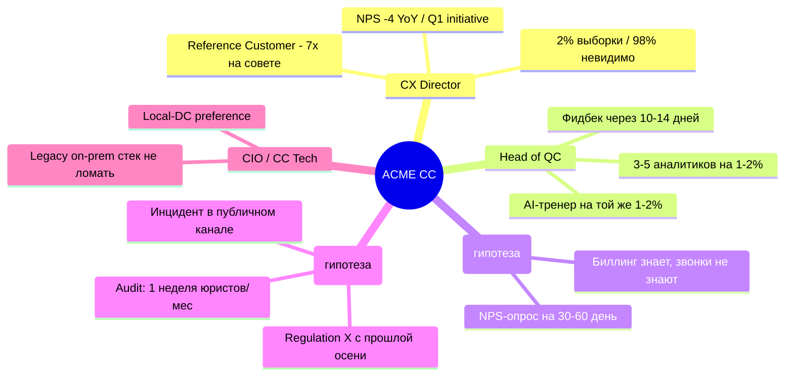

<!--
Full-deck integration fixture for the marp-slide renderer.
Source: scrubbed from a real sales-pipeline smoke-test output (customer-specific
strings replaced with generic placeholders; regulatory references replaced with
"Regulation X / Y"; Cyrillic preserved on purpose to exercise i18n rendering).

Exercises in ONE deck:
  - frontmatter: theme, header, footer, paginate
  - custom class directive <!-- _class: narrow --> on slide 2
  - title slide + 6 content slides + 3 back-pocket slides = 10 total
  - mermaid mindmap (2-level, 5 clusters × 2-4 sub-bullets — the canonical shape)
  - markdown table (PPVVC card on slide 3)
  - ASCII-grid iconostasis (карта боя on slide 4)
  - markdown table with data (signing timeline on slide 7)
  - back-pocket: mermaid-like ASCII architecture diagram (slide 8)
  - back-pocket: markdown table for pricing comparison (slide 9)
  - back-pocket: bullet list for compliance (slide 10)
  - blockquote speaker-notes scattered throughout
  - Cyrillic content throughout — validates i18n font handling

Expected output when rendered:
  - with mmdc installed:    slide 2 mindmap = SVG diagram
  - without mmdc installed: slide 2 mindmap = code block (WARN logged)
  - all other slides:       render consistently regardless of mmdc presence
-->

# ACME Corp × ACME Analytics
## Discovery · 60 min · 20XX-XX-XX

**Для:** CX Director, Head of QC, CIO/CC-Tech, Compliance Officer
**От:** ACME Cloud / ACME Analytics · AE + SE + KAM
**Формат:** диалог, не лекция · 3 артефакта на стол

---

<!-- _class: narrow -->

# 1. Контекст встречи · 1 мин

- **Неделя N-2** — 20-мин звонок с Head of QC; CX Director был первые 5 минут.
- **Неделя N-1** — welcome-letter, зафиксировали 3 темы: QC-coverage, Regulation X, церн-сигналы.
- **Сегодня** — закрыть гипотезы, договориться о free express-аудите, обсудить пилот.

> *Напомнить про ACME Cloud / ACME Analytics — **только если попросите**. Вы уже знаете нас через существующее marketplace-партнёрство.*

---

<!-- Slide 2: Pain Map mindmap (audience-matched, 2-level, 5 clusters × 2-4 sub-bullets) -->

# 2. Карта боёв на вашей стороне



> *Это гипотезы из welcome-letter + публичных источников. В Block 3 проверяем каждую Флоп-ом.*

---

<!-- Slide 3: PPVVC one-pager — markdown table -->

# 3. Что мы предлагаем (PPVVC в одном слайде)

| | |
|---|---|
| **Pain** | 1-2% ручной QC → 97% звонков невидимы; Regulation X audit ручной; церн-сигналы теряются |
| **Power** | CX Director: CSAT, NPS, agent-compliance, board-наррaтив vs Reference Customer |
| **Vision** | Analytics = LLM-аналитика **поверх** вашего стека по API; ACME Cloud RU; LLM-5 |
| **Value** | 100% покрытие, T+1 фидбек, -60-70% часов QC, audit-trail Regulation X, OPEX pay-per-minute |
| **Control** | Phase 1: free express-аудит 1 нед. Phase 2: платный пилот 2 мес / X Y Z c зачётом |

---

<!-- Slide 4: Карта боя grid - iconostasis for customer self-selection -->

# 4. С какого блока начнём?

```
+-------------------------+-------------------------+-------------------------+
| [A] QC-coverage         | [B] Regulation X        | [C] Churn-signal        |
| 1-2% -> 100% за 2 мес   | compliance: incident    | Биллинг -> звонки       |
| on-prem не ломая        | -> 100% audit-trail     | near-real-time routing  |
+-------------------------+-------------------------+-------------------------+
| [D] Кейс другого        | [E] Архитектура         | [F] TCO                 |
| телекома - 1-pager      | API поверх legacy       | pay-per-minute vs       |
|                         | без замены лицензии     | CAPEX on-prem           |
+-------------------------+-------------------------+-------------------------+
```

> *Рекомендация rep-а: **A или B первым** (самые острые по срокам); **D / E / F** — back-pocket.*

---

<!-- Slide 5: Reference case -->

# 5. Как это выглядит у сопоставимого клиента

- **Масштаб:** ≈ 1.2 млн живых звонков/год, ~700 seats, 4 CC-хаба.
- **Стартовали с:** 2% ручного QC, 14-дн фидбек-лаг, on-prem legacy.
- **За 2 месяца:** 100% LLM-покрытие на 1 очереди (retention), T+1 фидбек, +11% compliance-score, -65% часов QC-аналитиков.
- **Stack не тронут:** Analytics подключён по API; legacy продолжает работать.
- **TCO на 2 года vs on-prem-альтернатива:** -47%.

> *Логотип клиента — NDA; назовём под подпись NDA на встрече.*

---

<!-- Slide 6: Control / next step menu -->

# 6. Предлагаемый следующий шаг

- **Phase 1 · Двойной free-аудит · 1 неделя · 0 ₽**
  - (a) Express-аудит CC-качества на 1-3 тыс. ваших записей → Pain Map PDF.
  - (b) Compliance-аудит на 1k исходящих → Regulation X audit-trail PDF.
- **Phase 2 · Платный пилот · 2 мес · фикс-цена с зачётом в контракт**
  - Одна продуктовая очередь (retention или outbound sales — вы выбираете).
  - Before/after на реальных метриках QC + compliance + churn-signal-capture.
- **Phase 3 · Post-pilot** · TCO-расчёт + production-подключение + signing path.

> *Меню: согласовываем (1) какая очередь в Phase 2, (2) даты Phase 1, (3) тех.stand-up через неделю.*

---

# 7. Лок следующих 10 дней

| День | Кто | Что |
|------|-----|-----|
| D+0 (сегодня) | ACME AE | Sponsor-letter / FAP в thread; 3 артефакта (кейс PDF, Regulation X чек-лист, арх.диаграмма) |
| D+1 | Client CX Director | Назначить contact для передачи 1-3 тыс. записей |
| D+1 | Client Head of QC | Прислать internal QC checklist |
| D+2 | Client CIO | Знакомство с integration-lead на 2-часовой арх.session |
| D+3 | Client Compliance | Формат compliance-выгрузки под регулятора |
| D+4 | Client CX Director | Intro в Head of Retention в thread |
| D+7 | Все | 15-мин status stand-up |
| D+10 | Все | 60-мин review-встреча: результаты Phase 1 → решение по Phase 2 |

---

<!-- Back-pocket / загашники — не показываются по умолчанию -->

# 8. (Back-pocket) Архитектура API поверх legacy-стека

```
+-------------------------------------------------------------+
|   Client CC on legacy platform (Vendor A/B/C/custom)        |
+----------------+--------------------------------------------+
                 | recording stream (SIP-REC / RTP / files)
                 v
    +------------------------------+
    | Analytics API (ACME Cloud)   |---> LLM-5 ---> summary / classify / auto-QA
    +------------------------------+                   |
                                                        v
                                            Client QC dashboard + retention-alerts
```

> *Интеграция: 2-4 недели. Замена лицензий: ноль. Data residency: ACME Cloud RU DCs.*

---

# 9. (Back-pocket) TCO pay-per-minute vs on-prem

| Ось | Analytics (ACME Cloud) | Vendor A / B / C on-prem |
|-----|------------------------|--------------------------|
| Entry | 0 CAPEX | Large license + integration |
| Operating | pay-per-minute | Annual SLA/support |
| Лаг до прод | 2-4 нед | 6-9 мес |
| LLM-фичи | native LLM-5 | человеко-часы на поддержку словарей |
| TCO-2 года (1.55M мин/год) | lower | baseline |
| **Разница** | **-40-55%** | baseline |

---

# 10. (Back-pocket) Data residency · Regulation X/Y · compliance

- **ACME Cloud RU DCs** — Regulation Y (data localisation) по умолчанию; PII не покидает юрисдикцию.
- **Договор поручения (DPA)** по Regulation Y — стандартный; подпишем на Phase 1.
- **On-prem вариант** — **не требуется**, но возможен через партнёра ACME Cloud-on-prem; требует отдельного обсуждения.
- **Local-DC preference** — та же data-residency-гарантия, что даёт ваше собственное ДЦ-требование.

<!--
End of fixture.
If everything above renders correctly in PPTX / PDF / HTML and the slide-2 mindmap
is a diagram (not code), the renderer is production-ready for real pipeline decks.
-->
