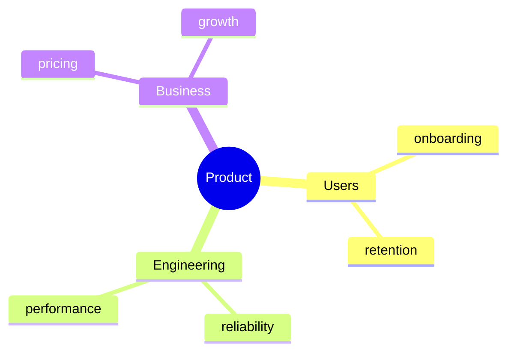

<!--
Minimal smoke fixture for the marp-slide renderer.
Exercises: frontmatter directives, title slide, one mermaid mindmap, basic bullet list.
Expected behaviour:
  - with mmdc:  Slide 2 mindmap appears as an SVG diagram
  - without mmdc: Slide 2 mindmap degrades to a code block (render.py prints a warning)
4 slides is intentional — small enough to inspect every element at a glance.
-->

# Minimal Fixture

## marp-slide renderer smoke test

---

# Topic map

---

# Key points

- Three clusters, two sub-items each
- 2-level mindmap per the `discovery-presentation-builder` rule
- Rendering target: SVG via `mmdc`
- Fallback: code block

---

# Done

If you see a mindmap diagram on slide 2, mermaid preprocessing works.
If you see a code block on slide 2, install `mmdc` or accept graceful degradation.
