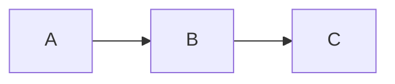
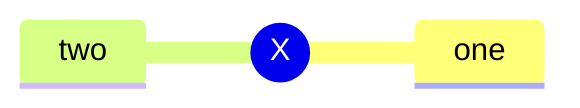

<!--
Multi-block fixture. Exercises: three mermaid blocks where #1 and #3 are
byte-identical so the SHA1 dedup collapses them into the same cached SVG.
Expected after render with mmdc:
  - fixture-mermaid-multi_assets/ contains exactly 2 diagram-*.svg (not 3)
  - all three slides show their diagram
This guards against regex regressions (greedy vs non-greedy match) and
cache-key regressions.
-->

# Multi-block fixture

## Three blocks, two unique

---

# Flow (block 1)

---

# Mindmap (block 2, different source)

---

# Flow (block 3, duplicate of block 1)

