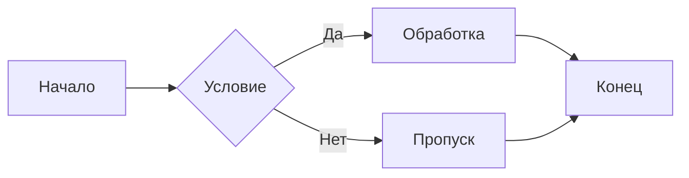
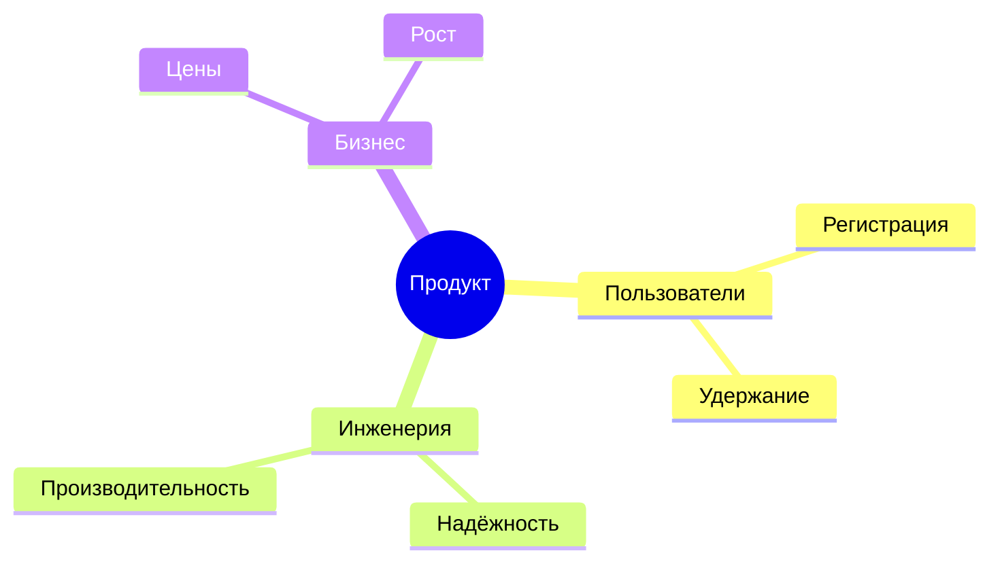

# Тестовая диаграмма с кириллицей

Проверяем, что font-fallback chain в `mermaid-config.json` корректно
отображает русские подписи в flowchart и mindmap (без glyphless boxes).

## Flowchart

## Mindmap

