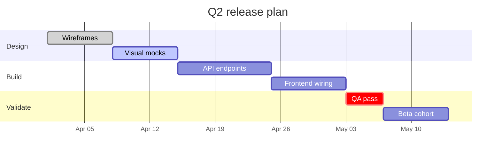

# Gantt chart fixture

Multi-section gantt with `dateFormat`. Exercises mmdc's date-axis
renderer.

```mermaid
gantt
    title Q2 release plan
    dateFormat  YYYY-MM-DD
    axisFormat  %b %d

    section Design
    Wireframes        :done,    a1, 2026-04-01, 2026-04-08
    Visual mocks      :active,  a2, 2026-04-08, 7d

    section Build
    API endpoints     :         b1, after a2, 10d
    Frontend wiring   :         b2, after b1, 8d

    section Validate
    QA pass           :crit,    c1, after b2, 4d
    Beta cohort       :         c2, after c1, 7d
```
