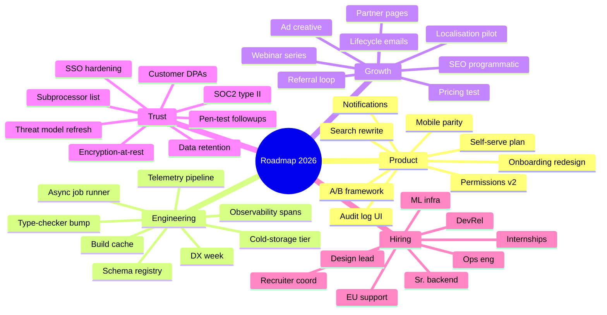

# Large mindmap fixture

5 branches × 8 leaves. Stress-tests mmdc's mindmap layout (used to
overflow page boundaries; the `.mermaid-diagram { max-height: 7in }`
rule in `md2pdf.py` is what keeps these on a single page).

