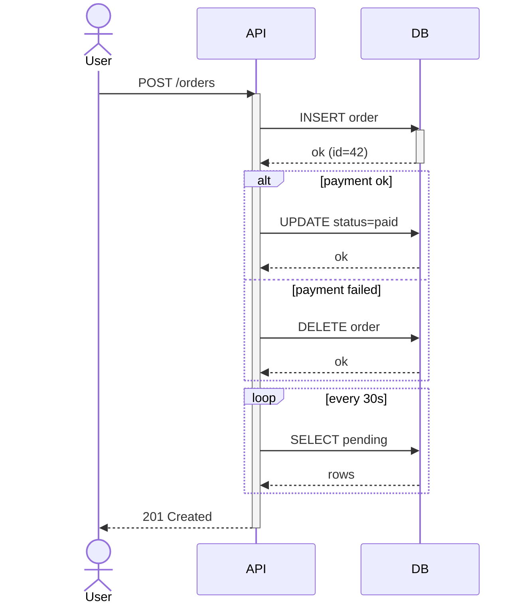

# Sequence diagram fixture

Three-actor sequence with `alt` and `loop` blocks. Exercises mmdc's
sequence renderer (which has a different layout engine than the
flowchart renderer used by `graph LR`).

