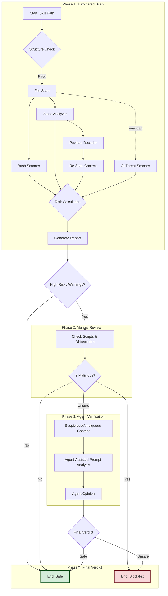

# Skill Validator

**Purpose**: Automatically audit skills (especially third-party/downloaded ones) to detect security risks, malicious patterns, and ensure compliance with the "Rich Skill" structure.

## 1. Red Flags (Anti-Rationalization)
**STOP and READ THIS if you are thinking:**
- "I can just read the files manually" -> **WRONG**. Malicious code can be obfuscated or hidden in long lines. **EXECUTE** the validator.
- "It's just a simple skill, no need to scan" -> **WRONG**. Simple skills are the easiest vector for supply chain attacks.
- "The validator found 0 issues, it must be safe" -> **WRONG**. The validator is a *static analysis* tool. It cannot catch everything. Use your judgment.
- "I'll skip the bash scanner because there are no .sh files" -> **WRONG**. Bash code can be embedded in `SKILL.md` examples or Python strings.
- "Prompts are just text, they can't be dangerous" -> **WRONG**. Prompt injection can override system instructions or generate harmful content.


## 2. Capabilities
- **Structure Audit**: Verifies `SKILL.md` frontmatter, required directories, and file integrity.
- **Bash Scanning**: Detects dangerous patterns (piping downloads to shell, recursive deletion, fork bombs).
- **Static Analysis**: Flags high-risk keywords (`eval`, `exec`, `subprocess`, `os.system`) across all files.
- **Obfuscation Detection**: Flags high-entropy strings and long lines that might hide malware.
- **Base64 Payload Inspection**: Decodes Base64 strings and re-scans decoded content for hidden threats.
- **AI Safety Analysis**: Detects prompt injection, jailbreak attempts ("DAN", "simulate unfiltered"), and harmful content instructions (opt-in via `--ai-scan`).
- **PII & Credential Detection**: Flags potential API keys (OpenAI, GitHub, AWS), emails, and IP addresses.
- **Risk Level**: Reports a risk assessment (SAFE/CAUTION/DANGER) based on scan findings.

## 3. Instructions

### Phase 1: Scan
1.  **Run Full Audit (Recommended for Untrusted Skills)**:
    This script runs all checks (including AI Scan), ignores `.scanignore`, and prompts you for Phase 3 verification if needed.
    ```bash
    python3 scripts/full_audit.py <path-to-skill>
    ```

2.  **Run Standard Scan (For Your Own Trusted Skills)**:
    This respects `.scanignore` and runs faster (no AI scan by default).
    ```bash
    python3 scripts/validate.py <path-to-skill>
    ```
2.  **Analyze Report**: Review the output.
    - **CRITICAL**: Immediate blockers. **DO NOT USE** the skill.
    - **WARNING**: Require manual verification.
    - **INFO**: Suggestions for improvement.
3.  **Check Risk Level**: If DANGER or CAUTION, perform Phase 2.

### Phase 2: Manual Review (Adversarial)
1.  **Check Bash Scripts**: If `scripts/` contains bash files, read them carefully.
    - Look for network calls that pipe to execution.
    - Check for environment variable exfiltration.
2.  **Verify Obfuscation**: If the validator flagged "High Entropy", check those lines. Are they legitimate assets (images/keys) or hidden code?

### Phase 3: Agent-Assisted Verification (Advanced)
For deep analysis of prompts or suspicious text, use the extracted LLM prompts in `references/prompts/`.
1.  **Select Prompt**: Choose `jailbreak_check.md` or `alignment_check.md`.
2.  **Instruct Agent**: "Reference `references/prompts/jailbreak_check.md` and analyze the following text: [Text from Skill]"
3.  **Evaluate**: The Agent will use the specialized prompt to detect subtle manipulation attempts that regex missed.

### CLI Options
| Flag | Description |
| :--- | :--- |
| `--json` | Output results in structured JSON format (for CI/CD). |
| `--no-scanignore` | Ignore `.scanignore` files. **Use for untrusted skills.** |
| `--strict` | Exit code 2 on warnings (for CI/CD gating). |
| `--ai-scan` | Enable AI threat detection (prompt injection, jailbreaks). |
| `--version` | Print validator version. |

## 4. Workflows



## 5. Security & Limitations

> [!WARNING]
> **Regex-based bypass**: This scanner uses pattern matching. Attackers can bypass it with string splitting, variable indirection, encoding layers, or dynamic imports. See `references/guidelines.md` for known bypass techniques.

> [!CAUTION]
> **`.scanignore` risk**: By default, `.scanignore` in the scanned skill is honored. For untrusted skills, ALWAYS use `--no-scanignore` to prevent attackers from hiding their malicious files.

- **Static Only**: This tool does not *execute* the skill. It reads the files.
- **False Positives**: It may flag legitimate security tools because they contain "attack patterns" for detection.
- **File Size Limit**: Files larger than 10MB are skipped to prevent OOM.
- **Risk Level != Safety**: A SAFE risk level means the scanner found no threats, NOT that the skill is guaranteed safe.

## 6. Resources
- `scripts/validate.py`: Main entry point.
- `scripts/scanners/`: Pluggable scanner modules.
  - `patterns.py`: Shared pattern definitions.
  - `bash_scanner.py`: Bash-specific scanner.
  - `static_analyzer.py`: Static analysis, obfuscation, Base64 inspection.
  - `ai_scanner.py`: AI threat detection (prompt injection, jailbreaks).
  - `structure_check.py`: Structural validation.
- `references/guidelines.md`: OWASP patterns, CWE references, known bypass techniques.
- `examples/usage_example.md`: Complete usage walkthrough with sample outputs.
- `assets/report_format_example.md`: Suggested report format for downstream consumers.
- `references/prompts/`: LLM prompts for agent-assisted verification.
  - `jailbreak_check.md`: Detects adversarial attacks.
  - `alignment_check.md`: Verifies topical scope.
