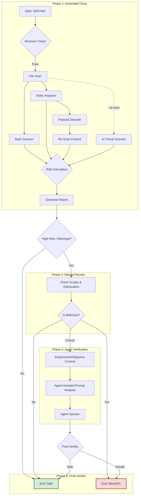

# Skill Validator

**Purpose**: Automatically audit skills (especially third-party/downloaded ones) to detect security risks, malicious patterns, and ensure compliance with the "Rich Skill" structure.

## 1. Red Flags (Anti-Rationalization)
**STOP and READ THIS if you are thinking:**
- "I can just read the files manually" -> **WRONG**. Malicious code can be obfuscated or hidden in long lines. **EXECUTE** the validator.
- "It's just a simple skill, no need to scan" -> **WRONG**. Simple skills are the easiest vector for supply chain attacks.
- "The validator found 0 issues, it must be safe" -> **WRONG**. The validator is a *static analysis* tool. It cannot catch everything. Use your judgment.
- "I'll skip the bash scanner because there are no .sh files" -> **WRONG**. Bash code can be embedded in `SKILL.md` examples or Python strings.
- "Prompts are just text, they can't be dangerous" -> **WRONG**. Prompt injection can override system instructions or generate harmful content.

### Rationalization Table
| Agent Excuse | Reality / Counter-Argument |
| :--- | :--- |
| "Risk level SAFE, so I can install it" | SAFE means no pattern matched. Regex sees text, not intent — string splitting, variable indirection and encoding layers all pass. SAFE is the floor, not the verdict. |
| "The author is known, skip the scan" | Provenance is not review. A dependency bump or a merged PR changes the code without changing the author. |
| "It flagged `subprocess`, so the skill is malicious" | `subprocess` is how every script-first skill calls its tools. Read the call site: an argument list is not `shell=True`, and a pinned download-then-inspect is not a pipe into a shell. |
| "I'll fix the finding by deleting the scanner rule" | The rule fired on real code. Change the code, or record why the pattern is safe here — silencing the check removes the evidence, not the risk. |
| "Base64 in an asset is just data" | It is data until it is decoded and executed. The decoder re-scans decoded content for exactly that reason; read what came out. |

## 2. Capabilities
- **Structure Audit**: Verifies `SKILL.md` frontmatter, required directories, and file integrity.
- **Bash Scanning**: Detects dangerous patterns (piping downloads to shell, recursive deletion, fork bombs).
- **Static Analysis**: Flags high-risk keywords (`eval`, `exec`, `subprocess`, `os.system`) across all files.
- **Obfuscation Detection**: Flags high-entropy strings and long lines that might hide malware.
- **Base64 Payload Inspection**: Decodes Base64 strings and re-scans decoded content for hidden threats.
- **AI Safety Analysis**: Detects prompt injection, jailbreak attempts ("DAN", "simulate unfiltered"), and harmful content instructions (opt-in via `--ai-scan`).
- **PII & Credential Detection**: Flags potential API keys (OpenAI, GitHub, AWS), emails, and IP addresses.
- **Risk Level**: Reports a risk assessment (SAFE/CAUTION/DANGER) based on scan findings.
## 3. Execution Mode
- **Mode**: `hybrid`
- **Why this mode**: Phase 1 is a script and only a script — the Red Flags forbid substituting a manual read, because obfuscation defeats reading. Phases 2-3 are judgement over what the regex flagged: the scanner has no notion of intent, so `full_audit.py` run against THIS skill reports DANGER over its own detection corpus (`references/guidelines.md`, `scripts/scanners/patterns.py`).

## 4. Script Contract
- **Commands**:
  - `python3 scripts/validate.py <skill-path> [--json] [--no-scanignore] [--strict] [--ai-scan]` — the scan itself. `--version` prints `skill-validator 1.4`, `-h` prints usage; both exit 0.
  - `python3 scripts/full_audit.py <skill-path>` — wrapper, no flags of its own. Runs `validate.py <skill-path> --ai-scan --no-scanignore --json` in a subprocess, reprints the findings, and appends both `references/prompts/` texts when the run produced any warning or info.
- **Inputs**: one positional path to a skill directory, and nothing else. `.scanignore` inside the scanned skill is honoured unless `--no-scanignore` is given.
- **Outputs**: everything lands on **stdout** — the human report, or with `--json` one document `{skill, risk_level, issues[], summary{critical,error,warning,info}}`. Startup failures (bad path, scanner import error) go to stdout too, as `{"error": {...}}` under `--json`. **stderr** carries one message only: an unreadable `.scanignore`.
- **Exit codes**:

| Code | Meaning |
| :--- | :--- |
| `0` | Text mode: no findings, or warnings/info only. **Every `--json` run that reached the scan, whatever the risk level** — measured: 3 criticals, exit 0. A JSON caller gates on `risk_level`, never on the status. `full_audit.py`: risk SAFE, and CAUTION by deliberate choice (the agent proceeds with caution). |
| `1` | Text mode: any critical or error finding. Either mode: `<skill-path>` is not a directory, or the `scanners` package failed to import. `full_audit.py`: risk DANGER. |
| `2` | Text mode plus `--strict`: warnings present, no critical and no error. |

- **Idempotency**: read-only, so the same tree returns the same verdict on every run.

## 5. Instructions

### Phase 1: Scan
1.  **Run Full Audit (Recommended for Untrusted Skills)**:
    This script runs all checks (including AI Scan), ignores `.scanignore`, and prompts you for Phase 3 verification if needed.
    ```bash
    python3 scripts/full_audit.py <path-to-skill>
    ```

2.  **Run Standard Scan (For Your Own Trusted Skills)**:
    This respects `.scanignore` and runs faster (no AI scan by default).
    ```bash
    python3 scripts/validate.py <path-to-skill>
    ```
2.  **Analyze Report**: Review the output.
    - **CRITICAL**: Immediate blockers. **DO NOT USE** the skill.
    - **WARNING**: Require manual verification.
    - **INFO**: Suggestions for improvement.
3.  **Check Risk Level**: If DANGER or CAUTION, perform Phase 2.

### Phase 2: Manual Review (Adversarial)
1.  **Check Bash Scripts**: If `scripts/` contains bash files, read them carefully.
    - Look for network calls that pipe to execution.
    - Check for environment variable exfiltration.
2.  **Verify Obfuscation**: If the validator flagged "High Entropy", check those lines. Are they legitimate assets (images/keys) or hidden code?

### Phase 3: Agent-Assisted Verification (Advanced)
For deep analysis of prompts or suspicious text, use the extracted LLM prompts in `references/prompts/`.
1.  **Select Prompt**: Choose `jailbreak_check.md` or `alignment_check.md`.
2.  **Instruct Agent**: "Reference `references/prompts/jailbreak_check.md` and analyze the following text: [Text from Skill]"
3.  **Evaluate**: The Agent will use the specialized prompt to detect subtle manipulation attempts that regex missed.

### CLI Options
| Flag | Description |
| :--- | :--- |
| `--json` | Output results in structured JSON format (for CI/CD). |
| `--no-scanignore` | Ignore `.scanignore` files. **Use for untrusted skills.** |
| `--strict` | Exit code 2 on warnings (for CI/CD gating). |
| `--ai-scan` | Enable AI threat detection (prompt injection, jailbreaks). |
| `--version` | Print validator version. |

## 6. Workflows


```mermaid
graph TD
    %% Phase Definitions
    subgraph Phase1 [Phase 1: Automated Scan]
        A[Start: Skill Path] --> B{Structure Check}
        B -- Pass --> C[File Scan]
        C --> D[Bash Scanner]
        C --> E[Static Analyzer]
        E --> F[Payload Decoder]
        F --> G[Re-Scan Content]
        C -.->|--ai-scan| H[AI Threat Scanner]
        D & E & G & H --> I{Risk Calculation}
        I --> J[Generate Report]
    end

    subgraph Phase2 [Phase 2: Manual Review]
        L[Check Scripts & Obfuscation]
        L --> M{Is Malicious?}
    end

    subgraph Phase3 [Phase 3: Agent Verification]
        N[Suspicious/Ambiguous Content]
        N --> O[Agent-Assisted Prompt Analysis]
        O --> P[Agent Opinion]
    end

    subgraph Phase4 [Phase 4: Final Verdict]
        EndSafe[End: Safe]
        EndBlock[End: Block/Fix]
    end

    %% Connections
    J --> K{High Risk / Warnings?}
    K -- No --> EndSafe
    K -- Yes --> L
    
    M -- Yes --> EndBlock
    M -- No --> EndSafe
    M -- Unsure --> N

    P --> Q{Final Verdict}
    Q -- Safe --> EndSafe
    Q -- Unsafe --> EndBlock

    %% Styling
    style EndSafe fill:#d4edda,stroke:#155724,stroke-width:2px
    style EndBlock fill:#f8d7da,stroke:#721c24,stroke-width:2px
```

## 7. Safety Boundaries (Security & Limitations)

> [!WARNING]
> **Regex-based bypass**: This scanner uses pattern matching. Attackers can bypass it with string splitting, variable indirection, encoding layers, or dynamic imports. See `references/guidelines.md` for known bypass techniques.

> [!CAUTION]
> **`.scanignore` risk**: By default, `.scanignore` in the scanned skill is honored. For untrusted skills, ALWAYS use `--no-scanignore` to prevent attackers from hiding their malicious files.

- **Static Only**: This tool does not *execute* the skill. It reads the files.
- **False Positives**: It may flag legitimate security tools because they contain "attack patterns" for detection.
- **File Size Limit**: Files larger than 10MB are skipped to prevent OOM.
- **Risk Level != Safety**: A SAFE risk level means the scanner found no threats, NOT that the skill is guaranteed safe.
- **Allowed scope**: the single directory named on the command line, walked recursively. Hidden directories and `__pycache__` are pruned; binary extensions and files over 10 MB are skipped.
- **Read-only**: neither script writes, renames, or deletes anything in the scanned skill — the only writes go to stdout and stderr. Quarantine or repair of a flagged skill stays with the caller, outside these scripts.

## 8. Validation Evidence
Measured 2026-09-02, from the repository root.
- `python3 skills/skill-validator/scripts/validate.py skills/skill-validator` — exit 0, `0 Critical, 0 Errors, 6 Warnings, 4 Info`, `PASSED with Warnings.`, stderr empty. Same run with `--strict` — exit 2; with `--json` — exit 0, verdict in `risk_level`.
- `python3 skills/skill-validator/scripts/full_audit.py skills/skill-validator` — exit 1, `Risk Level: DANGER`, 3 criticals: two in `references/guidelines.md`, one decoded out of a Base64 pattern literal in `scripts/scanners/patterns.py`. A scanner reading its own detection corpus is the standing false positive Phase 2 exists for.
- `cd skills/skill-validator/scripts && python3 -m unittest discover -s tests` — 23 tests, OK, exit 0: the broken-pipe exit-status contract and the human channel under a non-UTF-8 locale.
- `python3 .claude/skills/skill-creator/scripts/validate_skill.py skills/skill-validator` — exit 0.

## 9. Resources
- `scripts/validate.py`: Main entry point.
- `scripts/scanners/`: Pluggable scanner modules.
  - `patterns.py`: Shared pattern definitions.
  - `bash_scanner.py`: Bash-specific scanner.
  - `static_analyzer.py`: Static analysis, obfuscation, Base64 inspection.
  - `ai_scanner.py`: AI threat detection (prompt injection, jailbreaks).
  - `structure_check.py`: Structural validation.
- `references/guidelines.md`: OWASP patterns, CWE references, known bypass techniques.
- `examples/usage_example.md`: Complete usage walkthrough with sample outputs.
- `assets/report_format_example.md`: Suggested report format for downstream consumers.
- `references/prompts/`: LLM prompts for agent-assisted verification.
  - `jailbreak_check.md`: Detects adversarial attacks.
  - `alignment_check.md`: Verifies topical scope.
